# Mô-đun 16: Kỹ nghệ nạp và tích hợp dữ liệu

Module này sở hữu đoạn từ hệ nguồn tới vùng thô. Biến đổi dữ liệu thuộc M17, tầng phục vụ thuộc M12, còn nội bộ dòng sự kiện thuộc M21 và M22. Nguyên tắc xuyên suốt và cũng là chế độ hỏng nghiêm trọng nhất: mốc tiến độ chỉ được đẩy sau khi dữ liệu đã nằm bền vững ở đích và đã được công bố nguyên tử. Đảo thứ tự hai việc đó tạo ra mất dữ liệu im lặng, loại lỗi mà không cảnh báo nào bắt được và chỉ lộ ra khi đối soát. Nguyên tắc thứ hai: một trình kết nối có sẵn chuyển giao trách nhiệm vận hành nhưng không chuyển giao trách nhiệm về tính đúng.

## Điều kiện đầu vào

| Mã | Người học có thể | Bằng chứng được chấp nhận |
|---|---|---|
| EN-16-01 | M06 · M09 · M10 · M15 | Bằng chứng hoàn thành điều kiện được nêu trong cột trước |

Nếu chưa có bằng chứng đầu vào, người học phải hoàn thành lại bài hoặc mô-đun được dẫn chiếu trước khi thực hiện phép đánh giá của mô-đun này.

## Đầu ra mô-đun

Đưa dữ liệu từ cơ sở dữ liệu, giao diện lập trình, tệp, dịch vụ ngoài và nguồn sự kiện vào vùng thô với tính đầy đủ, khả năng chạy lại, tiến hoá lược đồ và bảo vệ nguồn

## Tiêu chí hoàn thành

| Mã | Bằng chứng bắt buộc | Ngưỡng đạt | Lỗi loại trực tiếp |
|---|---|---|---|
| EC-16-01 | Ba loại nguồn chạy được cả khởi tạo, tăng dần, nạp bù và chạy lại; hỏng giữa chừng không mất dữ liệu im lặng; đối soát độc lập từ nguồn tới vùng thô đạt trong phạm vi đã ghi | ≥ 5/6 tình huống được phát hiện tự động, mọi tình huống phục hồi với đối soát khớp, và sổ tay được sửa theo chênh lệch quan sát. | Đồng nhất việc trình kết nối chạy xong với việc đường dẫn dữ liệu đúng, và đẩy mốc tiến độ trước khi dữ liệu được công bố bền vững |

## Khái niệm và nguyên tắc bất biến

| Mã khái niệm | Ranh giới định nghĩa | Nguyên tắc bất biến hoặc quy tắc quyết định | Bài chính |
|---|---|---|---|
| C16-231 | Trước khi viết dòng mã nào, tám nhóm thông tin phải chốt với chủ hệ nguồn, và thiếu nhóm nào thì một chế độ hỏng cụ thể sẽ xuất hiện sau. | Ai sở hữu hệ, ai sở hữu giao diện, ai sở hữu dữ liệu về mặt nghiệp vụ, và cửa sổ thời gian được phép trích xuất. | L231 |
| C16-232 | Cách nguồn thay đổi quyết định mọi lựa chọn còn lại, nên bài này đặt trước bài chọn mẫu trích xuất. | Bốn câu hỏi phải trả lời cho từng thực thể: bản ghi có được sửa sau khi tạo không, có bị xoá cứng không, xoá mềm được đánh dấu bằng gì, và thứ tự thay đổi có quan sát được không. | L232 |
| C16-233 | Tám mẫu trích xuất, mỗi mẫu có điều kiện thắng và rủi ro chính, và chọn theo ngữ nghĩa thay đổi ở bài trước chứ theo thói quen. | Chụp toàn bộ đọc hết trạng thái: đơn giản và phục hồi dễ, nhưng tốn nguồn và không giữ thứ tự thay đổi. | L233 |
| C16-234 | Mẫu phổ biến nhất và cũng bị cài sai nhiều nhất, nên nó có một bài riêng. | Điều kiện lọc theo mốc lớn hơn giá trị lớn nhất đã nạp chỉ đầy đủ khi năm giả định cùng đúng | L234 |
| C16-235 | Ba cách phân trang cho ba mức bảo đảm khác nhau, và chọn sai gây mất hoặc trùng bản ghi mà không báo lỗi. | Phân trang theo độ lệch đơn giản nhưng hỏng khi tập dữ liệu thay đổi giữa các trang: thêm một bản ghi ở đầu làm mọi trang sau lệch một, nên vừa trùng vừa sót. | L235 |
| C16-236 | Bên trích xuất là khách của hệ nguồn, nên bảo vệ nguồn là một yêu cầu chức năng chứ phép lịch sự. | Đọc tín hiệu hạn mức từ tiêu đề phản hồi và tôn trọng chỉ dẫn chờ; ba cách hiểu sai đồng hồ đặt lại hạn mức, gồm cả lệch múi giờ. | L236 |
| C16-237 | Trao đổi bằng tệp trông đơn giản và hỏng theo những cách rất đặc trưng. | Giao thức giao nhận đúng có bốn bước | L237 |
| C16-238 | Trích xuất từ cơ sở dữ liệu giao dịch đụng thẳng vào nội dung M10, nên bài này dùng lại kiến thức đó ở vai người gọi. | Ảnh chụp nhất quán: một truy vấn dài giữ một giao dịch mở, và giao dịch mở lâu cản việc thu dọn phiên bản cũ theo Bài 141, nên trích xuất nặng có thể làm phình cơ sở dữ liệu nguồn. | L238 |
| C16-239 | Vùng thô có một nhiệm vụ: giữ đúng những gì nguồn đã nói, để mọi biến đổi sau này chạy lại được. | Trung thực với nguồn nghĩa là lưu tải trọng gốc chưa diễn giải, kèm một phong bì siêu dữ liệu. | L239 |
| C16-240 | Bài cưỡng chế nguyên tắc trung tâm của module bằng thực nghiệm. | Thứ tự bắt buộc gồm bốn bước: ghi dữ liệu ra vị trí tạm, xác nhận đã bền vững, công bố nguyên tử, rồi mới đẩy mốc tiến độ. | L240 |
| C16-241 | Lược đồ nguồn đổi mà không báo trước là chuyện thường, nên đường nạp phải coi đó là trạng thái bình thường chứ sự cố. | Phát hiện bằng cách so lược đồ quan sát được của lô hiện tại với lược đồ đã đăng ký, chứ đợi bước biến đổi báo lỗi. | L241 |
| C16-242 | Đối soát là bằng chứng duy nhất cho tính đầy đủ, và mọi thứ khác chỉ là dấu hiệu. | Thang đối soát bốn bậc theo chi phí tăng dần | L242 |
| C16-243 | Đường nạp là dịch vụ, nên nó có chỉ số và cam kết. | Bảy chỉ số phải đo: độ trễ trích xuất, độ tươi của vùng thô, tỉ lệ lần chạy thành công, số dòng và số byte, số lỗi lược đồ, tải đặt lên nguồn, và chênh lệch đối soát. | L243 |
| C16-244 | Năm nhóm công cụ và tiêu chí chọn, với một ranh giới trách nhiệm phải nói rõ. | Dịch vụ nạp được quản lý: nhanh để có kết quả, chi phí theo lượng dữ liệu, và hành vi xử lý lệch lược đồ cùng thử lại phải kiểm chứ đọc trang giới thiệu. | L244 |
| C16-245 | Bài dự án tổng hợp module, lấy đúng yêu cầu capstone của hợp đồng nguồn. | Nạp ba loại nguồn vào một vùng thô trên kho đối tượng: một cơ sở dữ liệu quan hệ, một giao diện lập trình có phân trang, và tệp đối tác giao hằng ngày. | L245 |
| C16-246 | Bài diễn tập sự cố khép module, chạy trên chính hệ đã dựng ở bài trước. | Sáu tình huống bắt buộc, mỗi tình huống có một hành vi kỳ vọng ghi trước | L246 |

## Các bài trong mô-đun

| Bài | Dạng | Đầu ra | Bằng chứng | Điều kiện tiên quyết |
|---|---|---|---|---|
| L231 · [[wiki.ingestion.source-discovery-extraction-contract|Source discovery and the extraction contract]]| LT | Nộp hợp đồng trích xuất đủ tám nhóm cho một nguồn thật và chỉ ra rủi ro của từng nhóm còn trống. | ≥ 6/8 nhóm có câu trả lời cụ thể, giá trị canh chừng được dò bằng thống kê thật, và mọi nhóm trống kèm chế độ hỏng dự đoán. | M16: M15 |
| L232 · Change semantics - insert, update, delete and soft delete | TH | Xác định ngữ nghĩa thay đổi của bốn thực thể bằng thực nghiệm và suy ra yêu cầu kỹ thuật kéo theo. | Bốn thực thể có kết luận dựa trên bằng chứng thực nghiệm, và ít nhất một chỗ tài liệu sai được phát hiện. | L231 |
| L233 · Choosing an extraction pattern | TH | Chọn mẫu trích xuất cho bốn nguồn và nêu rõ giả định phải đúng để mẫu đó cho kết quả đầy đủ. | Chọn đúng ≥ 3/4 nguồn, mỗi lựa chọn kèm danh sách giả định, và mỗi giả định có một phép kiểm cụ thể. | L232 |
| L234 · High watermark - the five assumptions it needs | TH | Cài trích xuất theo mốc tiến độ vượt qua cả năm giả định và chứng minh không mất cũng không trùng. | Số dòng, tổng và tập khoá khớp nguồn ở cả năm ca biên, và độ rộng cửa sổ chồng lấn dẫn được từ độ trễ đo được. | L233 |
| L235 · API pagination - offset, keyset and cursor | TH | Cài trích xuất phân trang chịu được thay đổi giữa các trang và chứng minh không mất cũng không trùng bản ghi. | Tập khoá khớp tập đúng khi có chèn giữa chừng ở cách phân trang được chọn, và hai chế độ hỏng con trỏ được tái hiện cùng xử lý. | L234 |
| L236 · Rate limits, retry budget and source protection | TH | Cài lớp gọi có ngân sách thử lại và điều chỉnh đồng thời, chứng minh không vượt hạn mức nguồn dưới tải. | Không lần nào vượt hạn mức nguồn dưới tải, số lần thử lại trong ngân sách, và phản hồi thất lạc không tạo tác dụng phụ trùng. | L235 |
| L237 · File drop - the delivery protocol and arrival completeness | TH | Cài giao thức bốn bước và chứng minh phát hiện được tệp thiếu, tệp trùng và tệp hỏng. | Bốn ca hỏng đều bị phát hiện và đi đúng đường xử lý, và lô thiếu tệp không bao giờ được đánh dấu hoàn tất. | L236 |
| L238 · Database extraction - snapshot, chunking and replica lag | TH | Trích xuất bảng lớn theo lô mà không vượt ngưỡng tác động lên nguồn và không mất dòng vì độ trễ bản sao. | Đối soát khớp nguồn tại ranh giới đã chốt, và mọi số đo tác động lên nguồn dưới ngưỡng thoả thuận. | L237 |
| L239 · The landing zone - fidelity, envelope and required metadata | LT | Thiết kế phong bì vùng thô đủ sáu trường và nêu chính sách dữ liệu nhạy cảm đi kèm. | Sáu trường có mặt ở cả ba thiết kế, mỗi trường kèm câu hỏi vận hành nó trả lời, và chính sách dữ liệu nhạy cảm đủ bốn phần. | L238 |
| L240 · Atomic landing and the checkpoint ordering rule | TH | Chứng minh bằng thực nghiệm rằng hỏng ở mọi ranh giới đều không mất dữ liệu và không trùng ngoài giới hạn đã nêu. | Mọi ranh giới hỏng đều phục hồi được với đối soát khớp, và bản đảo thứ tự được chứng minh mất dữ liệu kèm số dòng cụ thể. | L239 |
| L241 · Schema drift - detect, classify, quarantine | TH | Cài phát hiện và phân loại lệch lược đồ ba mức, chứng minh mỗi mức đi đúng đường xử lý. | Phân loại đúng ≥ 5/6 thay đổi, không lô nào bị bỏ im lặng, và lô cách ly nạp lại được với đối soát khớp. | L240 |
| L242 · Reconciliation from source to landing | TH | Chạy đủ bốn bậc đối soát cho ba nguồn và giải thích mọi chênh lệch còn lại bằng nguyên nhân cụ thể. | Bốn bậc chạy cho cả ba nguồn, ba lỗi tiêm được quy đúng bậc phát hiện, và mọi chênh lệch còn lại có nguyên nhân nêu tên. | L241 |
| L243 · Ingestion SLO and the backfill isolation rule | TH | Dựng bộ bảy chỉ số cùng cam kết, và chứng minh nạp bù 90 phân vùng không phá cam kết của lần chạy hằng ngày. | Độ tươi hằng ngày trong cam kết suốt 90 phân vùng nạp bù, nguồn không vượt hạn mức, và nạp bù tiếp được từ điểm kiểm tra. | L242 |
| L244 · Connector landscape - build, adopt or buy | LT | Chọn nhóm công cụ cho ba nguồn theo mười tiêu chí và nêu trách nhiệm nào không được chuyển giao. | Mỗi lựa chọn có ≥ 5 tiêu chí kiểm bằng thực nghiệm, và bản ghi quyết định nêu rõ trách nhiệm về tính đúng vẫn thuộc đội. | L243 |
| L245 · Ingestion capstone - three sources into one raw zone | DA | Nộp hệ nạp ba nguồn chạy được cả ba chế độ, với đối soát độc lập đạt cho cả ba. | Ba nguồn đối soát khớp trong ngân sách đã duyệt, ba chế độ vận hành chạy được, và giết tiến trình ở mọi chế độ đều phục hồi đúng. | L244 |
| L246 · Game day - provider throttling, cursor expiry and duplicate delivery | TH | Chạy sáu tình huống sự cố và chứng minh phát hiện, chặn phạm vi cùng phục hồi cho từng cái. | ≥ 5/6 tình huống được phát hiện tự động, mọi tình huống phục hồi với đối soát khớp, và sổ tay được sửa theo chênh lệch quan sát. | L245 |

## Nội dung từng bài

> **Sơ đồ đề xuất: DE-M16 v0.1.0.** Mỗi nhánh đi từ một bài học đến các nội dung nguyên tử bắt buộc. Thứ tự dạy lấy từ bảng `Các bài trong mô-đun`.

```mermaid
%%{init: {"flowchart": {"htmlLabels": true, "wrappingWidth": 720, "nodeSpacing": 64, "rankSpacing": 160}}}%%
flowchart LR
  M16["BẢN ĐỀ XUẤT<br/>DE-M16 · Kỹ nghệ nạp và tích hợp dữ liệu"]
  M16 --> L231["Bài 231 · Source discovery and the extraction contract"]
  L231 --> A231["• Trước khi viết dòng mã nào, tám nhóm thông tin phải chốt với chủ hệ nguồn, và thiếu nhóm nào thì một chế độ hỏng cụ thể sẽ xuất hiện sau.<br/>• Ai sở hữu hệ, ai sở hữu giao diện, ai sở hữu dữ liệu về mặt nghiệp vụ, và cửa sổ thời gian được phép trích xuất.<br/>• Danh sách thực thể cùng khoá, quan hệ, hạt và khối lượng.<br/>• Ngữ nghĩa thay đổi của từng thực thể."]
  M16 --> L232["Bài 232 · Change semantics - insert, update, delete and soft delete"]
  L232 --> A232["• Cách nguồn thay đổi quyết định mọi lựa chọn còn lại, nên bài này đặt trước bài chọn mẫu trích xuất.<br/>• Bốn câu hỏi phải trả lời cho từng thực thể: bản ghi có được sửa sau khi tạo không, có bị xoá cứng không, xoá mềm được đánh dấu bằng gì, và thứ tự thay đổi có quan sát được không.<br/>• Xoá cứng là chế độ hỏng nặng nhất của mọi phương pháp tăng dần, vì một dòng biến mất khỏi nguồn không để lại dấu vết nào cho truy vấn theo dấu thời gian; ba cách phát hiện và chi phí từng cách.<br/>• Lịch sử có thể thay đổi: khi nguồn sửa cả bản ghi cũ, mọi kỳ đã nạp đều có thể sai, nên cần đối soát định kỳ chứ chỉ nạp tiếp."]
  M16 --> L233["Bài 233 · Choosing an extraction pattern"]
  L233 --> A233["• Tám mẫu trích xuất, mỗi mẫu có điều kiện thắng và rủi ro chính, và chọn theo ngữ nghĩa thay đổi ở bài trước chứ theo thói quen.<br/>• Chụp toàn bộ đọc hết trạng thái: đơn giản và phục hồi dễ, nhưng tốn nguồn và không giữ thứ tự thay đổi.<br/>• Mốc tiến độ theo dấu thời gian: rẻ, đòi một trường thay đổi đơn điệu tin cậy.<br/>• Tăng dần theo khoá có thứ tự: phân trang được ở quy mô lớn, đòi khoá ổn định và có thứ tự toàn phần."]
  M16 --> L234["Bài 234 · High watermark - the five assumptions it needs"]
  L234 --> A234["• Mẫu phổ biến nhất và cũng bị cài sai nhiều nhất, nên nó có một bài riêng.<br/>• Điều kiện lọc theo mốc lớn hơn giá trị lớn nhất đã nạp chỉ đầy đủ khi năm giả định cùng đúng<br/>• đồng hồ nguồn không lùi<br/>• trường mốc được cập nhật ở mọi lần sửa"]
  M16 --> L235["Bài 235 · API pagination - offset, keyset and cursor"]
  L235 --> A235["• Ba cách phân trang cho ba mức bảo đảm khác nhau, và chọn sai gây mất hoặc trùng bản ghi mà không báo lỗi.<br/>• Phân trang theo độ lệch đơn giản nhưng hỏng khi tập dữ liệu thay đổi giữa các trang: thêm một bản ghi ở đầu làm mọi trang sau lệch một, nên vừa trùng vừa sót.<br/>• Phân trang theo khoá dùng giá trị của bản ghi cuối làm điểm bắt đầu, nên ổn định trước việc thêm bản ghi, với điều kiện khoá sắp thứ tự toàn phần và không đổi.<br/>• Con trỏ do nhà cung cấp cấp có thể ghim một ảnh chụp hoặc không, và tài liệu thường không nói rõ, nên phải kiểm bằng thực nghiệm."]
  M16 --> L236["Bài 236 · Rate limits, retry budget and source protection"]
  L236 --> A236["• Bên trích xuất là khách của hệ nguồn, nên bảo vệ nguồn là một yêu cầu chức năng chứ phép lịch sự.<br/>• Đọc tín hiệu hạn mức từ tiêu đề phản hồi và tôn trọng chỉ dẫn chờ; ba cách hiểu sai đồng hồ đặt lại hạn mức, gồm cả lệch múi giờ.<br/>• Phân loại lỗi tạm thời và lỗi vĩnh viễn theo Bài 107, vì thử lại một lỗi vĩnh viễn chỉ làm nguồn tệ hơn.<br/>• Ngân sách thử lại có giới hạn cùng lùi dần theo cấp số nhân có nhiễu ngẫu nhiên, để tránh cả đoàn khách cùng quay lại một lúc."]
  M16 --> L237["Bài 237 · File drop - the delivery protocol and arrival completeness"]
  L237 --> A237["• Trao đổi bằng tệp trông đơn giản và hỏng theo những cách rất đặc trưng.<br/>• Giao thức giao nhận đúng có bốn bước<br/>• ghi bằng tên tạm, kiểm tổng kiểm tra, ghi tệp kê khai hoặc dấu hiệu hoàn tất, rồi mới đổi sang tên chính thức bất biến<br/>• đọc tệp trước khi thấy dấu hiệu hoàn tất là nguyên nhân số một của dữ liệu cụt."]
  M16 --> L238["Bài 238 · Database extraction - snapshot, chunking and replica lag"]
  L238 --> A238["• Trích xuất từ cơ sở dữ liệu giao dịch đụng thẳng vào nội dung M10, nên bài này dùng lại kiến thức đó ở vai người gọi.<br/>• Ảnh chụp nhất quán: một truy vấn dài giữ một giao dịch mở, và giao dịch mở lâu cản việc thu dọn phiên bản cũ theo Bài 141, nên trích xuất nặng có thể làm phình cơ sở dữ liệu nguồn.<br/>• Chia lô theo khoá có chỉ mục và ổn định, kích thước lô điều chỉnh theo thời gian phản hồi; chia theo độ lệch làm truy vấn chậm dần.<br/>• Trích xuất từ bản sao đọc giảm tải cho bản chính nhưng đưa vào độ trễ sao chép, nên ranh giới trích xuất phải tính theo trạng thái bản sao chứ theo đồng hồ; chuyển đổi dự phòng làm điểm cuối đổi giữa chừng."]
  M16 --> L239["Bài 239 · The landing zone - fidelity, envelope and required metadata"]
  L239 --> A239["• Vùng thô có một nhiệm vụ: giữ đúng những gì nguồn đã nói, để mọi biến đổi sau này chạy lại được.<br/>• Trung thực với nguồn nghĩa là lưu tải trọng gốc chưa diễn giải, kèm một phong bì siêu dữ liệu.<br/>• Sáu trường siêu dữ liệu bắt buộc: định danh nguồn, định danh lần chạy trích xuất, vị trí của bản ghi trong nguồn, thời điểm nạp, phiên bản lược đồ, và tổng kiểm tra.<br/>• Thiếu trường thứ ba thì không chạy lại từ một điểm được; thiếu trường thứ năm thì không giải thích được vì sao hai lô cùng nguồn có hình dạng khác nhau."]
  M16 --> L240["Bài 240 · Atomic landing and the checkpoint ordering rule"]
  L240 --> A240["• Bài cưỡng chế nguyên tắc trung tâm của module bằng thực nghiệm.<br/>• Thứ tự bắt buộc gồm bốn bước: ghi dữ liệu ra vị trí tạm, xác nhận đã bền vững, công bố nguyên tử, rồi mới đẩy mốc tiến độ.<br/>• Đảo hai bước cuối tạo ra mất dữ liệu im lặng<br/>• tiến trình chết sau khi đẩy mốc nhưng trước khi công bố, và lần chạy sau bắt đầu từ mốc mới nên khoảng dữ liệu ở giữa không bao giờ được nạp, không có lỗi nào được ghi lại và chỉ đối soát mới phát hiện ra."]
  M16 --> L241["Bài 241 · Schema drift - detect, classify, quarantine"]
  L241 --> A241["• Lược đồ nguồn đổi mà không báo trước là chuyện thường, nên đường nạp phải coi đó là trạng thái bình thường chứ sự cố.<br/>• Phát hiện bằng cách so lược đồ quan sát được của lô hiện tại với lược đồ đã đăng ký, chứ đợi bước biến đổi báo lỗi.<br/>• Phân loại ba mức theo đúng ma trận ở Bài 220: thay đổi tương thích thì nạp tiếp và ghi nhận; thay đổi làm đổi nghĩa thì cảnh báo và chặn bước hạ nguồn; thay đổi phá vỡ thì đưa cả lô vào vùng cách ly kèm chủ sở hữu.<br/>• Cột mới xuất hiện không phải lý do dừng đường nạp, còn cột đổi kiểu thu hẹp thì phải dừng."]
  M16 --> L242["Bài 242 · Reconciliation from source to landing"]
  L242 --> A242["• Đối soát là bằng chứng duy nhất cho tính đầy đủ, và mọi thứ khác chỉ là dấu hiệu.<br/>• Thang đối soát bốn bậc theo chi phí tăng dần<br/>• tổng kiểm soát gồm số dòng, tổng, nhỏ nhất và lớn nhất theo phân vùng<br/>• so tập khoá để biết thiếu, thừa hay trùng cụ thể"]
  M16 --> L243["Bài 243 · Ingestion SLO and the backfill isolation rule"]
  L243 --> A243["• Đường nạp là dịch vụ, nên nó có chỉ số và cam kết.<br/>• Bảy chỉ số phải đo: độ trễ trích xuất, độ tươi của vùng thô, tỉ lệ lần chạy thành công, số dòng và số byte, số lỗi lược đồ, tải đặt lên nguồn, và chênh lệch đối soát.<br/>• Chỉ số cuối là chỉ số duy nhất nói về tính đúng, và sáu chỉ số kia đều xanh mà nó đỏ là tình huống phải nhận ra.<br/>• Đặt cam kết theo nhu cầu của quyết định hạ nguồn theo Bài 185, chứ theo năng lực hiện có."]
  M16 --> L244["Bài 244 · Connector landscape - build, adopt or buy"]
  L244 --> A244["• Năm nhóm công cụ và tiêu chí chọn, với một ranh giới trách nhiệm phải nói rõ.<br/>• Dịch vụ nạp được quản lý: nhanh để có kết quả, chi phí theo lượng dữ liệu, và hành vi xử lý lệch lược đồ cùng thử lại phải kiểm chứ đọc trang giới thiệu.<br/>• Trình kết nối mã nguồn mở: kiểm soát được, đổi lại phải tự vận hành.<br/>• Bắt thay đổi từ nhật ký giao dịch, học sâu ở M22."]
  M16 --> L245["Bài 245 · Ingestion capstone - three sources into one raw zone"]
  L245 --> A245["• Bài dự án tổng hợp module, lấy đúng yêu cầu capstone của hợp đồng nguồn.<br/>• Nạp ba loại nguồn vào một vùng thô trên kho đối tượng: một cơ sở dữ liệu quan hệ, một giao diện lập trình có phân trang, và tệp đối tác giao hằng ngày.<br/>• Ba chế độ vận hành phải chạy được: khởi tạo ban đầu, tăng dần hằng ngày, và nạp bù 90 ngày.<br/>• Yêu cầu bắt buộc"]
  M16 --> L246["Bài 246 · Game day - provider throttling, cursor expiry and duplicate delivery"]
  L246 --> A246["• Bài diễn tập sự cố khép module, chạy trên chính hệ đã dựng ở bài trước.<br/>• Sáu tình huống bắt buộc, mỗi tình huống có một hành vi kỳ vọng ghi trước<br/>• nhà cung cấp trả mã từ chối vì vượt hạn mức trong lúc nạp bù<br/>• nhà cung cấp trả lỗi máy chủ ngẫu nhiên"]

  classDef module fill:#2b1b12,color:#fff4e8,stroke:#ff8a3d,stroke-width:2px;
  classDef lesson fill:#fff4e8,color:#2b1b12,stroke:#c85e16,stroke-width:1.5px;
  classDef atom fill:#fffdf8,color:#2b1b12,stroke:#b8a99a,stroke-width:1px,font-size:15px;
  class M16 module;
  class L231,L232,L233,L234,L235,L236,L237,L238,L239,L240,L241,L242,L243,L244,L245,L246 lesson;
  class A231,A232,A233,A234,A235,A236,A237,A238,A239,A240,A241,A242,A243,A244,A245,A246 atom;
```

### Lesson 231: Source discovery and the extraction contract

Trước khi viết dòng mã nào, tám nhóm thông tin phải chốt với chủ hệ nguồn, và thiếu nhóm nào thì một chế độ hỏng cụ thể sẽ xuất hiện sau. Ai sở hữu hệ, ai sở hữu giao diện, ai sở hữu dữ liệu về mặt nghiệp vụ, và cửa sổ thời gian được phép trích xuất. Danh sách thực thể cùng khoá, quan hệ, hạt và khối lượng. Ngữ nghĩa thay đổi của từng thực thể. Ngữ nghĩa dấu thời gian gồm múi giờ nguồn, độ phân giải và tính đơn điệu. Lược đồ cùng kiểu, giá trị rỗng và những giá trị canh chừng không có trong tài liệu như ngày 1900-01-01 nghĩa là chưa biết. Thông lượng, hạn mức và thời hạn giữ dữ liệu ở nguồn. Phân loại dữ liệu cá nhân, nơi lưu trú và người được phép dùng. Số liệu cơ sở để đối soát về sau. Hợp đồng trích xuất là đầu ra của bài, và nó là tài liệu được hai bên ký chứ ghi chú riêng.

Người học phải nộp hợp đồng trích xuất đủ tám nhóm cho một nguồn thật và chỉ ra rủi ro của từng nhóm còn trống. Bằng chứng thực hành: Chọn một nguồn thật có tài liệu. Điền hợp đồng trích xuất tám nhóm, phần nào không có trong tài liệu thì ghi là chưa biết chứ đoán. Dò tìm giá trị canh chừng bằng cách thống kê phân bố từng cột. Với mỗi nhóm còn trống, viết một câu mô tả chế độ hỏng nó gây ra. Bài hoàn tất khi ≥ 6/8 nhóm có câu trả lời cụ thể, giá trị canh chừng được dò bằng thống kê thật, và mọi nhóm trống kèm chế độ hỏng dự đoán.

Cách đánh giá: Tầng *áp dụng*. Bài mở module, áp một danh mục phỏng vấn vào nguồn thật. Kiểm bằng rà soát tám nhóm; đạt khi ít nhất sáu nhóm có câu trả lời cụ thể và mỗi nhóm trống kèm một chế độ hỏng dự đoán được.

### Lesson 232: Change semantics - insert, update, delete and soft delete

Cách nguồn thay đổi quyết định mọi lựa chọn còn lại, nên bài này đặt trước bài chọn mẫu trích xuất. Bốn câu hỏi phải trả lời cho từng thực thể: bản ghi có được sửa sau khi tạo không, có bị xoá cứng không, xoá mềm được đánh dấu bằng gì, và thứ tự thay đổi có quan sát được không. Xoá cứng là chế độ hỏng nặng nhất của mọi phương pháp tăng dần, vì một dòng biến mất khỏi nguồn không để lại dấu vết nào cho truy vấn theo dấu thời gian; ba cách phát hiện và chi phí từng cách. Lịch sử có thể thay đổi: khi nguồn sửa cả bản ghi cũ, mọi kỳ đã nạp đều có thể sai, nên cần đối soát định kỳ chứ chỉ nạp tiếp. Giao dịch và thứ tự: hai bản ghi cùng giao dịch phải cùng xuất hiện, nếu không thì đích có trạng thái không nhất quán tạm thời. Ánh xạ bốn câu trả lời sang yêu cầu kỹ thuật.

Người học phải xác định ngữ nghĩa thay đổi của bốn thực thể bằng thực nghiệm và suy ra yêu cầu kỹ thuật kéo theo. Bằng chứng thực hành: Với bốn thực thể, thiết kế phép dò: chụp hai lần cách nhau và so tập khoá để phát hiện xoá cứng; so nội dung để phát hiện sửa bản ghi cũ; kiểm tính đơn điệu của dấu thời gian. Đối chiếu kết quả với tài liệu nguồn và ghi lại mọi chỗ lệch. Với mỗi thực thể, suy ra yêu cầu kỹ thuật cho bước trích xuất. Bài hoàn tất khi bốn thực thể có kết luận dựa trên bằng chứng thực nghiệm, và ít nhất một chỗ tài liệu sai được phát hiện.

Cách đánh giá: Tầng *phân tích*. Objective đòi kiểm chứng bằng dữ liệu thay vì tin tài liệu. Kiểm bằng phép dò thực nghiệm; đạt khi bốn thực thể có kết luận dựa trên bằng chứng và phát hiện được ít nhất một chỗ tài liệu sai.

### Lesson 233: Choosing an extraction pattern

Tám mẫu trích xuất, mỗi mẫu có điều kiện thắng và rủi ro chính, và chọn theo ngữ nghĩa thay đổi ở bài trước chứ theo thói quen. Chụp toàn bộ đọc hết trạng thái: đơn giản và phục hồi dễ, nhưng tốn nguồn và không giữ thứ tự thay đổi. Mốc tiến độ theo dấu thời gian: rẻ, đòi một trường thay đổi đơn điệu tin cậy. Tăng dần theo khoá có thứ tự: phân trang được ở quy mô lớn, đòi khoá ổn định và có thứ tự toàn phần. Con trỏ do nhà cung cấp cấp: ổn định cho giao diện lập trình, rủi ro là con trỏ hết hạn tạo lỗ hổng. Thả tệp: hợp cho trao đổi khối lượng lớn, rủi ro là tải lên dở dang và trùng tên. Trích xuất bằng truy vấn giới hạn: kiểm soát được tập con, rủi ro là khoá và tải lên nguồn. Bắt thay đổi từ nhật ký giao dịch, học sâu ở M22. Nguồn tự phát sự kiện: bên sản xuất sở hữu ý định.

Người học phải chọn mẫu trích xuất cho bốn nguồn và nêu rõ giả định phải đúng để mẫu đó cho kết quả đầy đủ. Bằng chứng thực hành: Cho bốn nguồn với ngữ nghĩa thay đổi khác nhau, trong đó một nguồn có xoá cứng và một nguồn có dấu thời gian không đơn điệu. Chọn mẫu cho từng cái. Với mỗi lựa chọn, liệt kê giả định phải đúng và thiết kế một phép kiểm cho từng giả định. Chỉ ra nguồn nào không dùng được mẫu theo dấu thời gian và vì sao. Bài hoàn tất khi chọn đúng ≥ 3/4 nguồn, mỗi lựa chọn kèm danh sách giả định, và mỗi giả định có một phép kiểm cụ thể.

Cách đánh giá: Tầng *đánh giá*. Objective đòi nêu giả định chứ chỉ chọn. Kiểm bằng bốn nguồn có ngữ nghĩa khác nhau; đạt khi chọn đúng ít nhất ba và mỗi lựa chọn kèm danh sách giả định kiểm được.

### Lesson 234: High watermark - the five assumptions it needs

Mẫu phổ biến nhất và cũng bị cài sai nhiều nhất, nên nó có một bài riêng. Điều kiện lọc theo mốc lớn hơn giá trị lớn nhất đã nạp chỉ đầy đủ khi năm giả định cùng đúng: đồng hồ nguồn không lùi; trường mốc được cập nhật ở mọi lần sửa; không có hai bản ghi cùng giá trị mốc nằm hai bên ranh giới; xoá được theo dõi bằng cơ chế khác; và đích rỗng được xử lý đúng. Vi phạm giả định thứ ba là lỗi âm thầm phổ biến nhất: dùng dấu lớn hơn thì mất bản ghi trùng giá trị, dùng lớn hơn hoặc bằng thì trùng lặp, nên lời giải đúng là cửa sổ chồng lấn cộng khử trùng có quy tắc chọn thắng xác định. Độ rộng cửa sổ chồng lấn tính từ độ trễ tối đa quan sát được chứ đoán. Cập nhật tới muộn và giao dịch mở lâu làm bản ghi xuất hiện với mốc cũ hơn thời điểm nhìn thấy.

Người học phải cài trích xuất theo mốc tiến độ vượt qua cả năm giả định và chứng minh không mất cũng không trùng. Bằng chứng thực hành: Dựng nguồn có đủ năm ca biên: đồng hồ lùi, sửa không cập nhật mốc, nhiều bản ghi trùng giá trị mốc ở ranh giới, xoá cứng, và lần chạy đầu trên đích rỗng. Cài cửa sổ chồng lấn cộng khử trùng. Tính độ rộng cửa sổ từ độ trễ đo được. Đối soát số dòng, tổng và tập khoá với nguồn sau mỗi ca. Bài hoàn tất khi số dòng, tổng và tập khoá khớp nguồn ở cả năm ca biên, và độ rộng cửa sổ chồng lấn dẫn được từ độ trễ đo được.

Cách đánh giá: Tầng *áp dụng*. Objective có tiêu chí nghiệm thu là đối soát khớp tuyệt đối qua các ca biên. Kiểm bằng năm ca biên tiêm; đạt khi số dòng và tổng khớp nguồn ở cả năm và quy tắc chọn thắng xác định.

### Lesson 235: API pagination - offset, keyset and cursor

Ba cách phân trang cho ba mức bảo đảm khác nhau, và chọn sai gây mất hoặc trùng bản ghi mà không báo lỗi. Phân trang theo độ lệch đơn giản nhưng hỏng khi tập dữ liệu thay đổi giữa các trang: thêm một bản ghi ở đầu làm mọi trang sau lệch một, nên vừa trùng vừa sót. Phân trang theo khoá dùng giá trị của bản ghi cuối làm điểm bắt đầu, nên ổn định trước việc thêm bản ghi, với điều kiện khoá sắp thứ tự toàn phần và không đổi. Con trỏ do nhà cung cấp cấp có thể ghim một ảnh chụp hoặc không, và tài liệu thường không nói rõ, nên phải kiểm bằng thực nghiệm. Ba chế độ hỏng bắt buộc xử lý: con trỏ hết hạn giữa chừng, phản hồi mã thành công nhưng thân chứa lỗi nghiệp vụ, và thứ tự trả về không ổn định. Điểm dừng phân trang phải tường minh chứ dựa vào trang rỗng.

Người học phải cài trích xuất phân trang chịu được thay đổi giữa các trang và chứng minh không mất cũng không trùng bản ghi. Bằng chứng thực hành: Dựng một giao diện lập trình mô phỏng có thể chèn và xoá bản ghi giữa các trang. Cài cả ba cách phân trang. Chạy trích xuất trong khi chèn bản ghi ở đầu tập, và so tập khoá thu được với tập khoá đúng. Tái hiện con trỏ hết hạn và phản hồi mã thành công chứa lỗi nghiệp vụ. Chạy lại có điểm kiểm tra sau mỗi trang. Bài hoàn tất khi tập khoá khớp tập đúng khi có chèn giữa chừng ở cách phân trang được chọn, và hai chế độ hỏng con trỏ được tái hiện cùng xử lý.

Cách đánh giá: Tầng *áp dụng*. Objective có tiêu chí nghiệm thu là đối soát tập khoá dưới nhiễu. Kiểm bằng phép thử chèn giữa chừng; đạt khi tập khoá thu được khớp tập khoá nguồn tại ranh giới đã chốt, ở cả ba cách phân trang được so.

### Lesson 236: Rate limits, retry budget and source protection

Bên trích xuất là khách của hệ nguồn, nên bảo vệ nguồn là một yêu cầu chức năng chứ phép lịch sự. Đọc tín hiệu hạn mức từ tiêu đề phản hồi và tôn trọng chỉ dẫn chờ; ba cách hiểu sai đồng hồ đặt lại hạn mức, gồm cả lệch múi giờ. Phân loại lỗi tạm thời và lỗi vĩnh viễn theo Bài 107, vì thử lại một lỗi vĩnh viễn chỉ làm nguồn tệ hơn. Ngân sách thử lại có giới hạn cùng lùi dần theo cấp số nhân có nhiễu ngẫu nhiên, để tránh cả đoàn khách cùng quay lại một lúc. Thử lại một yêu cầu ghi có thể nhân đôi tác dụng phụ khi phản hồi thất lạc, nên cần khoá chống trùng theo Bài 105. Điều chỉnh mức đồng thời theo phản hồi của nguồn thay vì đặt cố định. Nạp bù là mối nguy lớn nhất với nguồn, nên nó phải có hạn mức riêng và cửa sổ riêng, quy tắc được cưỡng chế ở Bài 243.

Người học phải cài lớp gọi có ngân sách thử lại và điều chỉnh đồng thời, chứng minh không vượt hạn mức nguồn dưới tải. Bằng chứng thực hành: Dựng nguồn mô phỏng có hạn mức, có trả lỗi tạm thời ngẫu nhiên và có đồng hồ đặt lại ở múi giờ khác. Cài lớp gọi có phân loại lỗi, ngân sách thử lại, lùi dần có nhiễu, và điều chỉnh đồng thời. Chạy tải và đo số lần vượt hạn mức. Tái hiện phản hồi thất lạc sau một yêu cầu ghi và chứng minh không nhân đôi. Bài hoàn tất khi không lần nào vượt hạn mức nguồn dưới tải, số lần thử lại trong ngân sách, và phản hồi thất lạc không tạo tác dụng phụ trùng.

Cách đánh giá: Tầng *áp dụng*. Objective có tiêu chí nghiệm thu đo được ở phía nguồn. Kiểm bằng phép thử tải; đạt khi không lần nào vượt hạn mức, số lần thử lại nằm trong ngân sách, và không có tác dụng phụ trùng lặp.

### Lesson 237: File drop - the delivery protocol and arrival completeness

Trao đổi bằng tệp trông đơn giản và hỏng theo những cách rất đặc trưng. Giao thức giao nhận đúng có bốn bước: ghi bằng tên tạm, kiểm tổng kiểm tra, ghi tệp kê khai hoặc dấu hiệu hoàn tất, rồi mới đổi sang tên chính thức bất biến; đọc tệp trước khi thấy dấu hiệu hoàn tất là nguyên nhân số một của dữ liệu cụt. Danh tính tệp để khử trùng gồm nguồn, đường dẫn, băm nội dung, kích thước và siêu dữ liệu sửa đổi, vì tên tệp có thể bị dùng lại. Tính đầy đủ của lô là một khái niệm khác với sự kiện tệp tới: biết tệp nào đã tới không trả lời được câu đã tới đủ chưa, nên cần danh sách tệp kỳ vọng hoặc tổng kiểm soát trong kê khai. Tệp hỏng, cụt hoặc mã hoá đi vùng cách ly kèm chủ sở hữu, không bị bỏ im lặng. Sự kiện từ kho đối tượng thường là ít nhất một lần và có thể chạy đua với thao tác liệt kê.

Người học phải cài giao thức bốn bước và chứng minh phát hiện được tệp thiếu, tệp trùng và tệp hỏng. Bằng chứng thực hành: Cài giao thức bốn bước cho bên gửi và bên nhận. Tiêm bốn ca: tải lên dở dang, tệp trùng tên khác nội dung, tệp hỏng, và lô thiếu một tệp so với kê khai. Chứng minh từng ca bị phát hiện và đi đúng đường xử lý. Chứng minh lô thiếu tệp không được đánh dấu hoàn tất. Đo hiệu ứng của việc gom tệp nhỏ trước khi ghi vùng thô. Bài hoàn tất khi bốn ca hỏng đều bị phát hiện và đi đúng đường xử lý, và lô thiếu tệp không bao giờ được đánh dấu hoàn tất.

Cách đánh giá: Tầng *áp dụng*. Objective đòi phân biệt tệp đã tới với lô đã đủ. Kiểm bằng bốn ca hỏng tiêm; đạt khi cả bốn bị phát hiện, không ca nào bị bỏ im lặng, và lô thiếu tệp không được công bố.

### Lesson 238: Database extraction - snapshot, chunking and replica lag

Trích xuất từ cơ sở dữ liệu giao dịch đụng thẳng vào nội dung M10, nên bài này dùng lại kiến thức đó ở vai người gọi. Ảnh chụp nhất quán: một truy vấn dài giữ một giao dịch mở, và giao dịch mở lâu cản việc thu dọn phiên bản cũ theo Bài 141, nên trích xuất nặng có thể làm phình cơ sở dữ liệu nguồn. Chia lô theo khoá có chỉ mục và ổn định, kích thước lô điều chỉnh theo thời gian phản hồi; chia theo độ lệch làm truy vấn chậm dần. Trích xuất từ bản sao đọc giảm tải cho bản chính nhưng đưa vào độ trễ sao chép, nên ranh giới trích xuất phải tính theo trạng thái bản sao chứ theo đồng hồ; chuyển đổi dự phòng làm điểm cuối đổi giữa chừng. Phát hiện thay đổi cấu trúc ở nguồn trước khi nó làm hỏng lần chạy. Theo dõi tác động lên nguồn bằng số đo của nguồn chứ bằng cảm nhận.

Người học phải trích xuất bảng lớn theo lô mà không vượt ngưỡng tác động lên nguồn và không mất dòng vì độ trễ bản sao. Bằng chứng thực hành: Trích xuất một bảng lớn theo lô chia bằng khoá có chỉ mục, kích thước lô điều chỉnh động. Đo trên nguồn: thời gian truy vấn, số kết nối, độ dài giao dịch mở và mức phình phiên bản. So với một bản chia theo độ lệch. Chuyển sang trích xuất từ bản sao, tạo độ trễ nhân tạo và chứng minh ranh giới tính theo trạng thái bản sao cho kết quả đúng. Bài hoàn tất khi đối soát khớp nguồn tại ranh giới đã chốt, và mọi số đo tác động lên nguồn dưới ngưỡng thoả thuận.

Cách đánh giá: Tầng *áp dụng*. Objective có hai ràng buộc: đúng dữ liệu và không hại nguồn. Kiểm bằng cặp số đo; đạt khi đối soát khớp nguồn tại ranh giới đã chốt và mọi số đo tác động nằm dưới ngưỡng thoả thuận.

### Lesson 239: The landing zone - fidelity, envelope and required metadata

Vùng thô có một nhiệm vụ: giữ đúng những gì nguồn đã nói, để mọi biến đổi sau này chạy lại được. Trung thực với nguồn nghĩa là lưu tải trọng gốc chưa diễn giải, kèm một phong bì siêu dữ liệu. Sáu trường siêu dữ liệu bắt buộc: định danh nguồn, định danh lần chạy trích xuất, vị trí của bản ghi trong nguồn, thời điểm nạp, phiên bản lược đồ, và tổng kiểm tra. Thiếu trường thứ ba thì không chạy lại từ một điểm được; thiếu trường thứ năm thì không giải thích được vì sao hai lô cùng nguồn có hình dạng khác nhau. Trung thực với nguồn không có nghĩa lưu mọi dữ liệu nhạy cảm vô thời hạn: phân loại, mã hoá, thời hạn giữ và đường lan truyền lệnh xoá vẫn áp dụng ở vùng thô, và đây là chỗ hay bị bỏ qua nhất. Vùng cách ly tách khỏi vùng thô đã nhận. Đăng ký danh mục và phát tín hiệu dòng dõi ngay khi công bố chứ suy lại sau nhiều tháng.

Người học phải thiết kế phong bì vùng thô đủ sáu trường và nêu chính sách dữ liệu nhạy cảm đi kèm. Bằng chứng thực hành: Thiết kế phong bì cho ba loại nguồn khác nhau. Với mỗi trường siêu dữ liệu, viết một câu hỏi vận hành mà không có trường đó thì không trả lời được. Viết chính sách cho dữ liệu nhạy cảm ở vùng thô gồm phân loại, mã hoá, thời hạn giữ và cách lan truyền lệnh xoá. Chỉ ra ba thứ không nên nằm ở vùng thô. Bài hoàn tất khi sáu trường có mặt ở cả ba thiết kế, mỗi trường kèm câu hỏi vận hành nó trả lời, và chính sách dữ liệu nhạy cảm đủ bốn phần.

Cách đánh giá: Tầng *hiểu*. Bài lý thuyết đặt chuẩn cho hai bài thực hành sau. Kiểm bằng bài thiết kế cộng bài lập luận; đạt khi sáu trường có mặt và mỗi trường kèm một câu hỏi vận hành nó trả lời được.

### Lesson 240: Atomic landing and the checkpoint ordering rule

Bài cưỡng chế nguyên tắc trung tâm của module bằng thực nghiệm. Thứ tự bắt buộc gồm bốn bước: ghi dữ liệu ra vị trí tạm, xác nhận đã bền vững, công bố nguyên tử, rồi mới đẩy mốc tiến độ. Đảo hai bước cuối tạo ra mất dữ liệu im lặng: tiến trình chết sau khi đẩy mốc nhưng trước khi công bố, và lần chạy sau bắt đầu từ mốc mới nên khoảng dữ liệu ở giữa không bao giờ được nạp, không có lỗi nào được ghi lại và chỉ đối soát mới phát hiện ra. Công bố nguyên tử trên kho đối tượng dùng giao thức chốt ở Bài 226. Trạng thái điểm kiểm tra gồm những gì, ai sở hữu nó, và nó phải bền vững cùng lúc hay sau dữ liệu. Thực thi ít nhất một lần cộng tác dụng phụ luỹ đẳng là mô hình thực tế; tuyên bố đúng một lần mà không nêu ranh giới là tuyên bố rỗng. Chạy lại vào đích cách ly để so trước khi hoán đổi.

Người học phải chứng minh bằng thực nghiệm rằng hỏng ở mọi ranh giới đều không mất dữ liệu và không trùng ngoài giới hạn đã nêu. Bằng chứng thực hành: Cài đường nạp theo đúng bốn bước. Giết tiến trình ở từng ranh giới giữa các bước, chạy lại, và đối soát với nguồn. Cài thêm một bản cố ý đẩy mốc trước khi công bố, giết ở đúng ranh giới đó, và chứng minh dữ liệu mất mà không có lỗi nào. Định lượng số dòng mất. Bài hoàn tất khi mọi ranh giới hỏng đều phục hồi được với đối soát khớp, và bản đảo thứ tự được chứng minh mất dữ liệu kèm số dòng cụ thể.

Cách đánh giá: Tầng *áp dụng*. Objective có tiêu chí nghiệm thu bằng thí nghiệm hỏng tại từng ranh giới. Kiểm bằng phép thử giết tiến trình; đạt khi mọi ranh giới cho kết quả đối soát khớp sau khi chạy lại, và ranh giới đảo thứ tự bị chứng minh là mất dữ liệu.

### Lesson 241: Schema drift - detect, classify, quarantine

Lược đồ nguồn đổi mà không báo trước là chuyện thường, nên đường nạp phải coi đó là trạng thái bình thường chứ sự cố. Phát hiện bằng cách so lược đồ quan sát được của lô hiện tại với lược đồ đã đăng ký, chứ đợi bước biến đổi báo lỗi. Phân loại ba mức theo đúng ma trận ở Bài 220: thay đổi tương thích thì nạp tiếp và ghi nhận; thay đổi làm đổi nghĩa thì cảnh báo và chặn bước hạ nguồn; thay đổi phá vỡ thì đưa cả lô vào vùng cách ly kèm chủ sở hữu. Cột mới xuất hiện không phải lý do dừng đường nạp, còn cột đổi kiểu thu hẹp thì phải dừng. Phiên bản lược đồ ghi trong phong bì nên truy được lô nào theo lược đồ nào. Đường phục hồi sau khi sửa: nạp lại từ vùng cách ly chứ bỏ. Ba cách trình kết nối có sẵn xử lý việc này và vì sao phải kiểm chứ tin.

Người học phải cài phát hiện và phân loại lệch lược đồ ba mức, chứng minh mỗi mức đi đúng đường xử lý. Bằng chứng thực hành: Đăng ký lược đồ cho ba nguồn. Tiêm sáu thay đổi thuộc ba mức, gồm thêm cột, bỏ cột, đổi kiểu mở rộng, đổi kiểu thu hẹp, đổi tên, và đổi nghĩa mà giữ kiểu. Chứng minh từng cái được phát hiện, phân đúng mức và đi đúng đường xử lý. Sửa một thay đổi phá vỡ rồi nạp lại từ vùng cách ly và đối soát. Bài hoàn tất khi phân loại đúng ≥ 5/6 thay đổi, không lô nào bị bỏ im lặng, và lô cách ly nạp lại được với đối soát khớp.

Cách đánh giá: Tầng *áp dụng*. Objective có tiêu chí nghiệm thu bằng phép thử tiêm ba mức. Kiểm bằng sáu thay đổi tiêm; đạt khi phân loại đúng ít nhất năm và không lô nào bị bỏ im lặng.

### Lesson 242: Reconciliation from source to landing

Đối soát là bằng chứng duy nhất cho tính đầy đủ, và mọi thứ khác chỉ là dấu hiệu. Thang đối soát bốn bậc theo chi phí tăng dần: tổng kiểm soát gồm số dòng, tổng, nhỏ nhất và lớn nhất theo phân vùng; so tập khoá để biết thiếu, thừa hay trùng cụ thể; băm dòng trên giá trị đã chuẩn hoá; và bất biến nghiệp vụ xuyên bảng. Chuẩn hoá trước khi băm là bước quyết định: thời gian, số thập phân, giá trị rỗng và thứ tự cột phải quy về một dạng, nếu không thì hai bên đúng vẫn cho hai băm khác nhau, đúng vấn đề đã gặp ở Bài 223. Ranh giới trích xuất phải bất biến khi đối soát, nếu không thì nguồn đã đổi giữa hai lần đếm và chênh lệch là giả. Lấy mẫu không chứng minh được tính đầy đủ và nhầm lẫn này là lỗi lập luận chính của bài. Ngân sách chênh lệch được chấp nhận phải có người duyệt chứ do kỹ thuật tự đặt.

Người học phải chạy đủ bốn bậc đối soát cho ba nguồn và giải thích mọi chênh lệch còn lại bằng nguyên nhân cụ thể. Bằng chứng thực hành: Với ba nguồn, chạy cả bốn bậc đối soát tại một ranh giới bất biến. Tiêm ba lỗi: mất một lô, trùng một lô, và một cột bị làm tròn khác. Chứng minh bậc nào phát hiện được lỗi nào. Chuẩn hoá giá trị trước khi băm và chỉ ra chênh lệch giả biến mất. Viết ngân sách chênh lệch kèm người duyệt. Bài hoàn tất khi bốn bậc chạy cho cả ba nguồn, ba lỗi tiêm được quy đúng bậc phát hiện, và mọi chênh lệch còn lại có nguyên nhân nêu tên.

Cách đánh giá: Tầng *đánh giá*. Objective đòi chứng minh tính đầy đủ chứ đưa dấu hiệu. Kiểm bằng bốn bậc cho ba nguồn; đạt khi bậc hai chỉ đúng khoá lệch, và mọi chênh lệch còn lại có nguyên nhân được nêu tên chứ bỏ qua.

### Lesson 243: Ingestion SLO and the backfill isolation rule

Đường nạp là dịch vụ, nên nó có chỉ số và cam kết. Bảy chỉ số phải đo: độ trễ trích xuất, độ tươi của vùng thô, tỉ lệ lần chạy thành công, số dòng và số byte, số lỗi lược đồ, tải đặt lên nguồn, và chênh lệch đối soát. Chỉ số cuối là chỉ số duy nhất nói về tính đúng, và sáu chỉ số kia đều xanh mà nó đỏ là tình huống phải nhận ra. Đặt cam kết theo nhu cầu của quyết định hạ nguồn theo Bài 185, chứ theo năng lực hiện có. Định tuyến cảnh báo theo chủ sở hữu và mức nghiêm trọng, tránh cảnh báo không hành động được. Nạp bù phải cách ly khỏi lần chạy hằng ngày: hạn mức riêng, hàng đợi riêng, cửa sổ riêng, và ngưỡng dừng; chạy chung là một trong những chế độ hỏng bị liệt vào danh sách tự động chưa đạt. Tiến độ từng phần và điểm kiểm tra cho nạp bù dài, để dừng giữa chừng không mất công đã làm.

Người học phải dựng bộ bảy chỉ số cùng cam kết, và chứng minh nạp bù 90 phân vùng không phá cam kết của lần chạy hằng ngày. Bằng chứng thực hành: Dựng bộ bảy chỉ số và đặt cam kết cho ba chỉ số quan trọng nhất. Chạy nạp bù 90 phân vùng đồng thời với lần chạy hằng ngày, có hạn mức và hàng đợi riêng. Đo độ tươi hằng ngày và tải nguồn suốt quá trình. Dừng nạp bù giữa chừng và chứng minh chạy tiếp được từ điểm kiểm tra. Tạo một tình huống sáu chỉ số xanh mà chênh lệch đối soát đỏ. Bài hoàn tất khi độ tươi hằng ngày trong cam kết suốt 90 phân vùng nạp bù, nguồn không vượt hạn mức, và nạp bù tiếp được từ điểm kiểm tra.

Cách đánh giá: Tầng *áp dụng*. Objective có tiêu chí nghiệm thu là cam kết hằng ngày giữ được trong lúc nạp bù. Kiểm bằng thí nghiệm chạy song song; đạt khi độ tươi hằng ngày trong cam kết suốt thời gian nạp bù và nguồn không vượt hạn mức.

### Lesson 244: Connector landscape - build, adopt or buy

Năm nhóm công cụ và tiêu chí chọn, với một ranh giới trách nhiệm phải nói rõ. Dịch vụ nạp được quản lý: nhanh để có kết quả, chi phí theo lượng dữ liệu, và hành vi xử lý lệch lược đồ cùng thử lại phải kiểm chứ đọc trang giới thiệu. Trình kết nối mã nguồn mở: kiểm soát được, đổi lại phải tự vận hành. Bắt thay đổi từ nhật ký giao dịch, học sâu ở M22. Dịch vụ truyền dữ liệu của nhà cung cấp đám mây. Tự viết: bắt buộc cho nguồn không ai hỗ trợ hoặc nguồn trọng yếu. Mười tiêu chí chọn gồm ngữ nghĩa nguồn được hỗ trợ, xử lý xoá và lịch sử, lệch lược đồ, ai giữ trạng thái, hạn mức và nạp bù, bảo mật, khả năng quan sát, chi phí, khả năng mở rộng, và đường phục hồi. Có trình kết nối không chứng minh ngữ nghĩa đúng: công cụ chuyển giao trách nhiệm vận hành, không chuyển giao trách nhiệm về tính đúng, nên đối soát vẫn là của ta.

Người học phải chọn nhóm công cụ cho ba nguồn theo mười tiêu chí và nêu trách nhiệm nào không được chuyển giao. Bằng chứng thực hành: Cho ba nguồn có ngữ nghĩa khác nhau, trong đó một nguồn có xoá cứng. Chấm ba nhóm công cụ theo mười tiêu chí. Với công cụ được chọn, kiểm bằng thực nghiệm ít nhất năm tiêu chí gồm hành vi khi lược đồ đổi và hành vi khi nguồn xoá bản ghi. Viết bản ghi quyết định nêu rõ trách nhiệm nào vẫn thuộc về đội. Bài hoàn tất khi mỗi lựa chọn có ≥ 5 tiêu chí kiểm bằng thực nghiệm, và bản ghi quyết định nêu rõ trách nhiệm về tính đúng vẫn thuộc đội.

Cách đánh giá: Tầng *đánh giá*. Objective đòi phân biệt trách nhiệm vận hành với trách nhiệm về tính đúng. Kiểm bằng bản ghi quyết định ba nguồn; đạt khi mỗi lựa chọn có ít nhất năm tiêu chí được kiểm bằng thực nghiệm chứ bằng tài liệu.

### Lesson 245: Ingestion capstone - three sources into one raw zone

Bài dự án tổng hợp module, lấy đúng yêu cầu capstone của hợp đồng nguồn. Nạp ba loại nguồn vào một vùng thô trên kho đối tượng: một cơ sở dữ liệu quan hệ, một giao diện lập trình có phân trang, và tệp đối tác giao hằng ngày. Ba chế độ vận hành phải chạy được: khởi tạo ban đầu, tăng dần hằng ngày, và nạp bù 90 ngày. Yêu cầu bắt buộc: chạy lại luỹ đẳng, hạ cánh nguyên tử theo Bài 240, hợp đồng lược đồ có phiên bản và vùng cách ly, bảo vệ nguồn cùng quản lý thông tin xác thực, phát tín hiệu danh mục và dòng dõi khi công bố, và bộ chỉ số cùng bảng theo dõi cùng sổ tay vận hành. Đối soát độc lập từ nguồn tới vùng thô cho cả ba nguồn là tiêu chí nghiệm thu chính, chứ số lần chạy thành công.

Người học phải nộp hệ nạp ba nguồn chạy được cả ba chế độ, với đối soát độc lập đạt cho cả ba. Bằng chứng thực hành: Dựng hệ nạp ba nguồn. Chạy khởi tạo, chạy tăng dần bảy ngày, rồi nạp bù 90 ngày có cách ly. Chạy đối soát bốn bậc cho cả ba nguồn. Giết tiến trình ngẫu nhiên trong mỗi chế độ và chứng minh chạy lại phục hồi đúng. Nộp sổ tay vận hành gồm đặt lại điểm kiểm tra, xoay thông tin xác thực, nguồn hỏng và quy trình chạy lại. Bài hoàn tất khi ba nguồn đối soát khớp trong ngân sách đã duyệt, ba chế độ vận hành chạy được, và giết tiến trình ở mọi chế độ đều phục hồi đúng.

Cách đánh giá: Tầng *sáng tạo*. Bài tổng hợp toàn module thành một hệ vận hành được. Kiểm bằng đối soát độc lập cộng rà soát sổ tay; đạt khi ba nguồn đối soát khớp trong ngân sách chênh lệch đã duyệt và mọi chế độ chạy lại được.

### Lesson 246: Game day - provider throttling, cursor expiry and duplicate delivery

Bài diễn tập sự cố khép module, chạy trên chính hệ đã dựng ở bài trước. Sáu tình huống bắt buộc, mỗi tình huống có một hành vi kỳ vọng ghi trước: nhà cung cấp trả mã từ chối vì vượt hạn mức trong lúc nạp bù; nhà cung cấp trả lỗi máy chủ ngẫu nhiên; con trỏ phân trang hết hạn giữa chừng; bản sao cơ sở dữ liệu trễ bất thường; tệp đối tác giao thiếu một phần; và cùng một lô được giao hai lần. Với mỗi tình huống, ba câu hỏi phải trả lời bằng bằng chứng: hệ có phát hiện không, ảnh hưởng có bị chặn trong phạm vi không, và phục hồi mất bao lâu. Hành vi kỳ vọng phải viết trước khi chạy, vì viết sau thì luôn khớp. Kết quả diễn tập là đầu vào sửa sổ tay vận hành chứ một buổi biểu diễn.

Người học phải chạy sáu tình huống sự cố và chứng minh phát hiện, chặn phạm vi cùng phục hồi cho từng cái. Bằng chứng thực hành: Viết hành vi kỳ vọng cho sáu tình huống trước khi chạy. Chạy từng cái trên hệ đã dựng. Ghi lại thời điểm phát hiện, phạm vi ảnh hưởng và thời gian phục hồi. Đối soát sau mỗi lần phục hồi. So kết quả với hành vi kỳ vọng và sửa sổ tay vận hành theo chênh lệch. Bài hoàn tất khi ≥ 5/6 tình huống được phát hiện tự động, mọi tình huống phục hồi với đối soát khớp, và sổ tay được sửa theo chênh lệch quan sát.

Cách đánh giá: Tầng *đánh giá*. Objective đo năng lực vận hành dưới sự cố có tiêu chí viết trước. Kiểm bằng sáu tình huống; đạt khi ít nhất năm được phát hiện tự động và mọi tình huống phục hồi với đối soát khớp.

## Lý do sắp xếp

Mô-đun bắt đầu từ `M16: M15` và đi theo các quan hệ tiên quyết đã ghi trong bảng. Mỗi bài chỉ sử dụng khái niệm hoặc thao tác đã được giới thiệu trước đó; bài cuối L246 tích hợp đầu ra của toàn mô-đun.

## Ma trận đánh giá

| Mã đầu ra | Mức độ tư duy | Cách đánh giá | Ngưỡng đạt | Hình thức kiểm tra lại |
|---|---|---|---|---|
| L231 | Áp dụng | Tầng *áp dụng*. Bài mở module, áp một danh mục phỏng vấn vào nguồn thật. Kiểm bằng rà soát tám nhóm; đạt khi ít nhất sáu nhóm có câu trả lời cụ thể và mỗi nhóm trống kèm một chế độ hỏng dự đoán được. | ≥ 6/8 nhóm có câu trả lời cụ thể, giá trị canh chừng được dò bằng thống kê thật, và mọi nhóm trống kèm chế độ hỏng dự đoán. | Tình huống mới, giữ nguyên đầu ra và ngưỡng |
| L232 | Phân tích | Tầng *phân tích*. Objective đòi kiểm chứng bằng dữ liệu thay vì tin tài liệu. Kiểm bằng phép dò thực nghiệm; đạt khi bốn thực thể có kết luận dựa trên bằng chứng và phát hiện được ít nhất một chỗ tài liệu sai. | Bốn thực thể có kết luận dựa trên bằng chứng thực nghiệm, và ít nhất một chỗ tài liệu sai được phát hiện. | Tình huống mới, giữ nguyên đầu ra và ngưỡng |
| L233 | Đánh giá | Tầng *đánh giá*. Objective đòi nêu giả định chứ chỉ chọn. Kiểm bằng bốn nguồn có ngữ nghĩa khác nhau; đạt khi chọn đúng ít nhất ba và mỗi lựa chọn kèm danh sách giả định kiểm được. | Chọn đúng ≥ 3/4 nguồn, mỗi lựa chọn kèm danh sách giả định, và mỗi giả định có một phép kiểm cụ thể. | Tình huống mới, giữ nguyên đầu ra và ngưỡng |
| L234 | Áp dụng | Tầng *áp dụng*. Objective có tiêu chí nghiệm thu là đối soát khớp tuyệt đối qua các ca biên. Kiểm bằng năm ca biên tiêm; đạt khi số dòng và tổng khớp nguồn ở cả năm và quy tắc chọn thắng xác định. | Số dòng, tổng và tập khoá khớp nguồn ở cả năm ca biên, và độ rộng cửa sổ chồng lấn dẫn được từ độ trễ đo được. | Tình huống mới, giữ nguyên đầu ra và ngưỡng |
| L235 | Áp dụng | Tầng *áp dụng*. Objective có tiêu chí nghiệm thu là đối soát tập khoá dưới nhiễu. Kiểm bằng phép thử chèn giữa chừng; đạt khi tập khoá thu được khớp tập khoá nguồn tại ranh giới đã chốt, ở cả ba cách phân trang được so. | Tập khoá khớp tập đúng khi có chèn giữa chừng ở cách phân trang được chọn, và hai chế độ hỏng con trỏ được tái hiện cùng xử lý. | Tình huống mới, giữ nguyên đầu ra và ngưỡng |
| L236 | Áp dụng | Tầng *áp dụng*. Objective có tiêu chí nghiệm thu đo được ở phía nguồn. Kiểm bằng phép thử tải; đạt khi không lần nào vượt hạn mức, số lần thử lại nằm trong ngân sách, và không có tác dụng phụ trùng lặp. | Không lần nào vượt hạn mức nguồn dưới tải, số lần thử lại trong ngân sách, và phản hồi thất lạc không tạo tác dụng phụ trùng. | Tình huống mới, giữ nguyên đầu ra và ngưỡng |
| L237 | Áp dụng | Tầng *áp dụng*. Objective đòi phân biệt tệp đã tới với lô đã đủ. Kiểm bằng bốn ca hỏng tiêm; đạt khi cả bốn bị phát hiện, không ca nào bị bỏ im lặng, và lô thiếu tệp không được công bố. | Bốn ca hỏng đều bị phát hiện và đi đúng đường xử lý, và lô thiếu tệp không bao giờ được đánh dấu hoàn tất. | Tình huống mới, giữ nguyên đầu ra và ngưỡng |
| L238 | Áp dụng | Tầng *áp dụng*. Objective có hai ràng buộc: đúng dữ liệu và không hại nguồn. Kiểm bằng cặp số đo; đạt khi đối soát khớp nguồn tại ranh giới đã chốt và mọi số đo tác động nằm dưới ngưỡng thoả thuận. | Đối soát khớp nguồn tại ranh giới đã chốt, và mọi số đo tác động lên nguồn dưới ngưỡng thoả thuận. | Tình huống mới, giữ nguyên đầu ra và ngưỡng |
| L239 | Hiểu | Tầng *hiểu*. Bài lý thuyết đặt chuẩn cho hai bài thực hành sau. Kiểm bằng bài thiết kế cộng bài lập luận; đạt khi sáu trường có mặt và mỗi trường kèm một câu hỏi vận hành nó trả lời được. | Sáu trường có mặt ở cả ba thiết kế, mỗi trường kèm câu hỏi vận hành nó trả lời, và chính sách dữ liệu nhạy cảm đủ bốn phần. | Tình huống mới, giữ nguyên đầu ra và ngưỡng |
| L240 | Áp dụng | Tầng *áp dụng*. Objective có tiêu chí nghiệm thu bằng thí nghiệm hỏng tại từng ranh giới. Kiểm bằng phép thử giết tiến trình; đạt khi mọi ranh giới cho kết quả đối soát khớp sau khi chạy lại, và ranh giới đảo thứ tự bị chứng minh là mất dữ liệu. | Mọi ranh giới hỏng đều phục hồi được với đối soát khớp, và bản đảo thứ tự được chứng minh mất dữ liệu kèm số dòng cụ thể. | Tình huống mới, giữ nguyên đầu ra và ngưỡng |
| L241 | Áp dụng | Tầng *áp dụng*. Objective có tiêu chí nghiệm thu bằng phép thử tiêm ba mức. Kiểm bằng sáu thay đổi tiêm; đạt khi phân loại đúng ít nhất năm và không lô nào bị bỏ im lặng. | Phân loại đúng ≥ 5/6 thay đổi, không lô nào bị bỏ im lặng, và lô cách ly nạp lại được với đối soát khớp. | Tình huống mới, giữ nguyên đầu ra và ngưỡng |
| L242 | Đánh giá | Tầng *đánh giá*. Objective đòi chứng minh tính đầy đủ chứ đưa dấu hiệu. Kiểm bằng bốn bậc cho ba nguồn; đạt khi bậc hai chỉ đúng khoá lệch, và mọi chênh lệch còn lại có nguyên nhân được nêu tên chứ bỏ qua. | Bốn bậc chạy cho cả ba nguồn, ba lỗi tiêm được quy đúng bậc phát hiện, và mọi chênh lệch còn lại có nguyên nhân nêu tên. | Tình huống mới, giữ nguyên đầu ra và ngưỡng |
| L243 | Áp dụng | Tầng *áp dụng*. Objective có tiêu chí nghiệm thu là cam kết hằng ngày giữ được trong lúc nạp bù. Kiểm bằng thí nghiệm chạy song song; đạt khi độ tươi hằng ngày trong cam kết suốt thời gian nạp bù và nguồn không vượt hạn mức. | Độ tươi hằng ngày trong cam kết suốt 90 phân vùng nạp bù, nguồn không vượt hạn mức, và nạp bù tiếp được từ điểm kiểm tra. | Tình huống mới, giữ nguyên đầu ra và ngưỡng |
| L244 | Đánh giá | Tầng *đánh giá*. Objective đòi phân biệt trách nhiệm vận hành với trách nhiệm về tính đúng. Kiểm bằng bản ghi quyết định ba nguồn; đạt khi mỗi lựa chọn có ít nhất năm tiêu chí được kiểm bằng thực nghiệm chứ bằng tài liệu. | Mỗi lựa chọn có ≥ 5 tiêu chí kiểm bằng thực nghiệm, và bản ghi quyết định nêu rõ trách nhiệm về tính đúng vẫn thuộc đội. | Tình huống mới, giữ nguyên đầu ra và ngưỡng |
| L245 | Sáng tạo | Tầng *sáng tạo*. Bài tổng hợp toàn module thành một hệ vận hành được. Kiểm bằng đối soát độc lập cộng rà soát sổ tay; đạt khi ba nguồn đối soát khớp trong ngân sách chênh lệch đã duyệt và mọi chế độ chạy lại được. | Ba nguồn đối soát khớp trong ngân sách đã duyệt, ba chế độ vận hành chạy được, và giết tiến trình ở mọi chế độ đều phục hồi đúng. | Tình huống mới, giữ nguyên đầu ra và ngưỡng |
| L246 | Đánh giá | Tầng *đánh giá*. Objective đo năng lực vận hành dưới sự cố có tiêu chí viết trước. Kiểm bằng sáu tình huống; đạt khi ít nhất năm được phát hiện tự động và mọi tình huống phục hồi với đối soát khớp. | ≥ 5/6 tình huống được phát hiện tự động, mọi tình huống phục hồi với đối soát khớp, và sổ tay được sửa theo chênh lệch quan sát. | Tình huống mới, giữ nguyên đầu ra và ngưỡng |

Không cộng điểm để bù cho lỗi loại trực tiếp. Người học phải sửa đúng lỗi, nộp lại bằng chứng và thực hiện kiểm tra lại trên một tình huống khác.

## Bài thực hành bắt buộc

| Bài thực hành hoặc dự án | Bài liên quan | Sản phẩm bắt buộc | Lỗi được cài vào tình huống |
|---|---|---|---|
| Source discovery and the extraction contract | L231 | Chọn một nguồn thật có tài liệu. Điền hợp đồng trích xuất tám nhóm, phần nào không có trong tài liệu thì ghi là chưa biết chứ đoán. Dò tìm giá trị canh chừng bằng cách thống kê phân bố từng cột. Với mỗi nhóm còn trống, viết một câu mô tả chế độ hỏng nó gây ra. | Bắt đầu viết trình trích xuất trước khi chốt ngữ nghĩa thay đổi · tin tài liệu nguồn nói đúng về giá trị rỗng · bỏ qua múi giờ của dấu thời gian nguồn · không hỏi cửa sổ thời gian được phép chạy. |
| Change semantics - insert, update, delete and soft delete | L232 | Với bốn thực thể, thiết kế phép dò: chụp hai lần cách nhau và so tập khoá để phát hiện xoá cứng; so nội dung để phát hiện sửa bản ghi cũ; kiểm tính đơn điệu của dấu thời gian. Đối chiếu kết quả với tài liệu nguồn và ghi lại mọi chỗ lệch. Với mỗi thực thể, suy ra yêu cầu kỹ thuật cho bước trích xuất. | Tin tài liệu nói không có xoá cứng · bỏ qua khả năng lịch sử bị sửa · coi dấu thời gian luôn tăng · kết luận từ một lần chụp duy nhất. |
| Choosing an extraction pattern | L233 | Cho bốn nguồn với ngữ nghĩa thay đổi khác nhau, trong đó một nguồn có xoá cứng và một nguồn có dấu thời gian không đơn điệu. Chọn mẫu cho từng cái. Với mỗi lựa chọn, liệt kê giả định phải đúng và thiết kế một phép kiểm cho từng giả định. Chỉ ra nguồn nào không dùng được mẫu theo dấu thời gian và vì sao. | Mặc định dùng mốc theo dấu thời gian cho mọi nguồn · chọn chụp toàn bộ vì đơn giản mà không tính tải lên nguồn · dùng phân trang theo độ lệch trên tập đang thay đổi · chọn mẫu trước khi biết ngữ nghĩa xoá. |
| High watermark - the five assumptions it needs | L234 | Dựng nguồn có đủ năm ca biên: đồng hồ lùi, sửa không cập nhật mốc, nhiều bản ghi trùng giá trị mốc ở ranh giới, xoá cứng, và lần chạy đầu trên đích rỗng. Cài cửa sổ chồng lấn cộng khử trùng. Tính độ rộng cửa sổ từ độ trễ đo được. Đối soát số dòng, tổng và tập khoá với nguồn sau mỗi ca. | Dùng điều kiện lớn hơn giá trị lớn nhất mà không có cửa sổ chồng lấn · đặt độ rộng cửa sổ bằng một con số tròn không có căn cứ · khử trùng không có quy tắc chọn thắng xác định · bỏ qua ca đích rỗng. |
| API pagination - offset, keyset and cursor | L235 | Dựng một giao diện lập trình mô phỏng có thể chèn và xoá bản ghi giữa các trang. Cài cả ba cách phân trang. Chạy trích xuất trong khi chèn bản ghi ở đầu tập, và so tập khoá thu được với tập khoá đúng. Tái hiện con trỏ hết hạn và phản hồi mã thành công chứa lỗi nghiệp vụ. Chạy lại có điểm kiểm tra sau mỗi trang. | Dùng phân trang theo độ lệch trên tập đang thay đổi · dừng khi gặp trang rỗng mà không kiểm dấu hiệu kết thúc tường minh · coi mã phản hồi thành công là dữ liệu hợp lệ · không kiểm con trỏ có ghim ảnh chụp hay không. |
| Rate limits, retry budget and source protection | L236 | Dựng nguồn mô phỏng có hạn mức, có trả lỗi tạm thời ngẫu nhiên và có đồng hồ đặt lại ở múi giờ khác. Cài lớp gọi có phân loại lỗi, ngân sách thử lại, lùi dần có nhiễu, và điều chỉnh đồng thời. Chạy tải và đo số lần vượt hạn mức. Tái hiện phản hồi thất lạc sau một yêu cầu ghi và chứng minh không nhân đôi. | Thử lại không giới hạn · thử lại lỗi vĩnh viễn · lùi dần không có nhiễu nên các tiến trình đồng loạt quay lại · chạy nạp bù chung hạn mức với lần chạy hằng ngày. |
| File drop - the delivery protocol and arrival completeness | L237 | Cài giao thức bốn bước cho bên gửi và bên nhận. Tiêm bốn ca: tải lên dở dang, tệp trùng tên khác nội dung, tệp hỏng, và lô thiếu một tệp so với kê khai. Chứng minh từng ca bị phát hiện và đi đúng đường xử lý. Chứng minh lô thiếu tệp không được đánh dấu hoàn tất. Đo hiệu ứng của việc gom tệp nhỏ trước khi ghi vùng thô. | Đọc tệp ngay khi sự kiện báo tệp tới · khử trùng bằng tên tệp · coi có đủ sự kiện là có đủ tệp · bỏ tệp hỏng mà không cách ly và không báo chủ sở hữu. |
| Database extraction - snapshot, chunking and replica lag | L238 | Trích xuất một bảng lớn theo lô chia bằng khoá có chỉ mục, kích thước lô điều chỉnh động. Đo trên nguồn: thời gian truy vấn, số kết nối, độ dài giao dịch mở và mức phình phiên bản. So với một bản chia theo độ lệch. Chuyển sang trích xuất từ bản sao, tạo độ trễ nhân tạo và chứng minh ranh giới tính theo trạng thái bản sao cho kết quả đúng. | Chia lô theo độ lệch · giữ một giao dịch mở suốt lần trích xuất · tính ranh giới theo đồng hồ khi đọc từ bản sao · không đo tác động lên nguồn. |
| The landing zone - fidelity, envelope and required metadata | L239 | Thiết kế phong bì cho ba loại nguồn khác nhau. Với mỗi trường siêu dữ liệu, viết một câu hỏi vận hành mà không có trường đó thì không trả lời được. Viết chính sách cho dữ liệu nhạy cảm ở vùng thô gồm phân loại, mã hoá, thời hạn giữ và cách lan truyền lệnh xoá. Chỉ ra ba thứ không nên nằm ở vùng thô. | Diễn giải dữ liệu trước khi hạ cánh · bỏ vị trí bản ghi trong nguồn · trộn dữ liệu bị cách ly vào vùng thô đã nhận · coi trung thực với nguồn là miễn trừ khỏi quy định về dữ liệu cá nhân. |
| Atomic landing and the checkpoint ordering rule | L240 | Cài đường nạp theo đúng bốn bước. Giết tiến trình ở từng ranh giới giữa các bước, chạy lại, và đối soát với nguồn. Cài thêm một bản cố ý đẩy mốc trước khi công bố, giết ở đúng ranh giới đó, và chứng minh dữ liệu mất mà không có lỗi nào. Định lượng số dòng mất. | Đẩy mốc tiến độ trước khi công bố · lưu điểm kiểm tra ở nơi khác với dữ liệu mà không có thứ tự bền vững rõ · tuyên bố đúng một lần mà không nêu ranh giới · chạy lại thẳng vào đích đang phục vụ. |
| Schema drift - detect, classify, quarantine | L241 | Đăng ký lược đồ cho ba nguồn. Tiêm sáu thay đổi thuộc ba mức, gồm thêm cột, bỏ cột, đổi kiểu mở rộng, đổi kiểu thu hẹp, đổi tên, và đổi nghĩa mà giữ kiểu. Chứng minh từng cái được phát hiện, phân đúng mức và đi đúng đường xử lý. Sửa một thay đổi phá vỡ rồi nạp lại từ vùng cách ly và đối soát. | Dừng đường nạp khi chỉ có cột mới · để bước biến đổi phát hiện lệch thay vì bước nạp · bỏ lô hỏng thay vì cách ly · không ghi phiên bản lược đồ vào phong bì. |
| Reconciliation from source to landing | L242 | Với ba nguồn, chạy cả bốn bậc đối soát tại một ranh giới bất biến. Tiêm ba lỗi: mất một lô, trùng một lô, và một cột bị làm tròn khác. Chứng minh bậc nào phát hiện được lỗi nào. Chuẩn hoá giá trị trước khi băm và chỉ ra chênh lệch giả biến mất. Viết ngân sách chênh lệch kèm người duyệt. | Đối soát bằng lấy mẫu rồi kết luận đầy đủ · băm mà không chuẩn hoá · đếm hai bên ở hai thời điểm khác nhau · tự đặt ngân sách chênh lệch được chấp nhận. |
| Ingestion SLO and the backfill isolation rule | L243 | Dựng bộ bảy chỉ số và đặt cam kết cho ba chỉ số quan trọng nhất. Chạy nạp bù 90 phân vùng đồng thời với lần chạy hằng ngày, có hạn mức và hàng đợi riêng. Đo độ tươi hằng ngày và tải nguồn suốt quá trình. Dừng nạp bù giữa chừng và chứng minh chạy tiếp được từ điểm kiểm tra. Tạo một tình huống sáu chỉ số xanh mà chênh lệch đối soát đỏ. | Chạy nạp bù chung hàng đợi với lần chạy hằng ngày · đặt cam kết theo năng lực hiện có · cảnh báo trên chỉ số không hành động được · nạp bù không có điểm kiểm tra nên dừng là mất hết. |
| Connector landscape - build, adopt or buy | L244 | Cho ba nguồn có ngữ nghĩa khác nhau, trong đó một nguồn có xoá cứng. Chấm ba nhóm công cụ theo mười tiêu chí. Với công cụ được chọn, kiểm bằng thực nghiệm ít nhất năm tiêu chí gồm hành vi khi lược đồ đổi và hành vi khi nguồn xoá bản ghi. Viết bản ghi quyết định nêu rõ trách nhiệm nào vẫn thuộc về đội. | Chọn công cụ theo danh sách nguồn được hỗ trợ · tin tài liệu về hành vi lệch lược đồ · giả định công cụ xử lý xoá đúng · coi dùng dịch vụ quản lý là hết trách nhiệm đối soát. |
| Ingestion capstone - three sources into one raw zone | L245 | Dựng hệ nạp ba nguồn. Chạy khởi tạo, chạy tăng dần bảy ngày, rồi nạp bù 90 ngày có cách ly. Chạy đối soát bốn bậc cho cả ba nguồn. Giết tiến trình ngẫu nhiên trong mỗi chế độ và chứng minh chạy lại phục hồi đúng. Nộp sổ tay vận hành gồm đặt lại điểm kiểm tra, xoay thông tin xác thực, nguồn hỏng và quy trình chạy lại. | Coi lần chạy thành công là bằng chứng đầy đủ · bỏ chế độ nạp bù vì tốn thời gian · để thông tin xác thực trong mã hoặc nhật ký · chạy lại bằng cách xoá đích rồi nạp lại mà không đối soát. |
| Game day - provider throttling, cursor expiry and duplicate delivery | L246 | Viết hành vi kỳ vọng cho sáu tình huống trước khi chạy. Chạy từng cái trên hệ đã dựng. Ghi lại thời điểm phát hiện, phạm vi ảnh hưởng và thời gian phục hồi. Đối soát sau mỗi lần phục hồi. So kết quả với hành vi kỳ vọng và sửa sổ tay vận hành theo chênh lệch. | Viết hành vi kỳ vọng sau khi đã thấy kết quả · coi phục hồi bằng tay là đạt mà không ghi vào sổ tay · bỏ qua tình huống giao trùng lô vì nghĩ khử trùng đã lo · không đối soát sau khi phục hồi. |

## Ngộ nhận và lỗi loại trực tiếp

| Lỗi | Hệ quả | Nơi phát hiện | Cách khắc phục |
|---|---|---|---|
| Bắt đầu viết trình trích xuất trước khi chốt ngữ nghĩa thay đổi · tin tài liệu nguồn nói đúng về giá trị rỗng · bỏ qua múi giờ của dấu thời gian nguồn · không hỏi cửa sổ thời gian được phép chạy. | Không tạo được bằng chứng hợp lệ cho đầu ra L231 | L231 | Làm lại phép đánh giá trên tình huống mới và đạt tiêu chí `Done when` |
| Tin tài liệu nói không có xoá cứng · bỏ qua khả năng lịch sử bị sửa · coi dấu thời gian luôn tăng · kết luận từ một lần chụp duy nhất. | Không tạo được bằng chứng hợp lệ cho đầu ra L232 | L232 | Làm lại phép đánh giá trên tình huống mới và đạt tiêu chí `Done when` |
| Mặc định dùng mốc theo dấu thời gian cho mọi nguồn · chọn chụp toàn bộ vì đơn giản mà không tính tải lên nguồn · dùng phân trang theo độ lệch trên tập đang thay đổi · chọn mẫu trước khi biết ngữ nghĩa xoá. | Không tạo được bằng chứng hợp lệ cho đầu ra L233 | L233 | Làm lại phép đánh giá trên tình huống mới và đạt tiêu chí `Done when` |
| Dùng điều kiện lớn hơn giá trị lớn nhất mà không có cửa sổ chồng lấn · đặt độ rộng cửa sổ bằng một con số tròn không có căn cứ · khử trùng không có quy tắc chọn thắng xác định · bỏ qua ca đích rỗng. | Không tạo được bằng chứng hợp lệ cho đầu ra L234 | L234 | Làm lại phép đánh giá trên tình huống mới và đạt tiêu chí `Done when` |
| Dùng phân trang theo độ lệch trên tập đang thay đổi · dừng khi gặp trang rỗng mà không kiểm dấu hiệu kết thúc tường minh · coi mã phản hồi thành công là dữ liệu hợp lệ · không kiểm con trỏ có ghim ảnh chụp hay không. | Không tạo được bằng chứng hợp lệ cho đầu ra L235 | L235 | Làm lại phép đánh giá trên tình huống mới và đạt tiêu chí `Done when` |
| Thử lại không giới hạn · thử lại lỗi vĩnh viễn · lùi dần không có nhiễu nên các tiến trình đồng loạt quay lại · chạy nạp bù chung hạn mức với lần chạy hằng ngày. | Không tạo được bằng chứng hợp lệ cho đầu ra L236 | L236 | Làm lại phép đánh giá trên tình huống mới và đạt tiêu chí `Done when` |
| Đọc tệp ngay khi sự kiện báo tệp tới · khử trùng bằng tên tệp · coi có đủ sự kiện là có đủ tệp · bỏ tệp hỏng mà không cách ly và không báo chủ sở hữu. | Không tạo được bằng chứng hợp lệ cho đầu ra L237 | L237 | Làm lại phép đánh giá trên tình huống mới và đạt tiêu chí `Done when` |
| Chia lô theo độ lệch · giữ một giao dịch mở suốt lần trích xuất · tính ranh giới theo đồng hồ khi đọc từ bản sao · không đo tác động lên nguồn. | Không tạo được bằng chứng hợp lệ cho đầu ra L238 | L238 | Làm lại phép đánh giá trên tình huống mới và đạt tiêu chí `Done when` |
| Diễn giải dữ liệu trước khi hạ cánh · bỏ vị trí bản ghi trong nguồn · trộn dữ liệu bị cách ly vào vùng thô đã nhận · coi trung thực với nguồn là miễn trừ khỏi quy định về dữ liệu cá nhân. | Không tạo được bằng chứng hợp lệ cho đầu ra L239 | L239 | Làm lại phép đánh giá trên tình huống mới và đạt tiêu chí `Done when` |
| Đẩy mốc tiến độ trước khi công bố · lưu điểm kiểm tra ở nơi khác với dữ liệu mà không có thứ tự bền vững rõ · tuyên bố đúng một lần mà không nêu ranh giới · chạy lại thẳng vào đích đang phục vụ. | Không tạo được bằng chứng hợp lệ cho đầu ra L240 | L240 | Làm lại phép đánh giá trên tình huống mới và đạt tiêu chí `Done when` |
| Dừng đường nạp khi chỉ có cột mới · để bước biến đổi phát hiện lệch thay vì bước nạp · bỏ lô hỏng thay vì cách ly · không ghi phiên bản lược đồ vào phong bì. | Không tạo được bằng chứng hợp lệ cho đầu ra L241 | L241 | Làm lại phép đánh giá trên tình huống mới và đạt tiêu chí `Done when` |
| Đối soát bằng lấy mẫu rồi kết luận đầy đủ · băm mà không chuẩn hoá · đếm hai bên ở hai thời điểm khác nhau · tự đặt ngân sách chênh lệch được chấp nhận. | Không tạo được bằng chứng hợp lệ cho đầu ra L242 | L242 | Làm lại phép đánh giá trên tình huống mới và đạt tiêu chí `Done when` |
| Chạy nạp bù chung hàng đợi với lần chạy hằng ngày · đặt cam kết theo năng lực hiện có · cảnh báo trên chỉ số không hành động được · nạp bù không có điểm kiểm tra nên dừng là mất hết. | Không tạo được bằng chứng hợp lệ cho đầu ra L243 | L243 | Làm lại phép đánh giá trên tình huống mới và đạt tiêu chí `Done when` |
| Chọn công cụ theo danh sách nguồn được hỗ trợ · tin tài liệu về hành vi lệch lược đồ · giả định công cụ xử lý xoá đúng · coi dùng dịch vụ quản lý là hết trách nhiệm đối soát. | Không tạo được bằng chứng hợp lệ cho đầu ra L244 | L244 | Làm lại phép đánh giá trên tình huống mới và đạt tiêu chí `Done when` |
| Coi lần chạy thành công là bằng chứng đầy đủ · bỏ chế độ nạp bù vì tốn thời gian · để thông tin xác thực trong mã hoặc nhật ký · chạy lại bằng cách xoá đích rồi nạp lại mà không đối soát. | Không tạo được bằng chứng hợp lệ cho đầu ra L245 | L245 | Làm lại phép đánh giá trên tình huống mới và đạt tiêu chí `Done when` |
| Viết hành vi kỳ vọng sau khi đã thấy kết quả · coi phục hồi bằng tay là đạt mà không ghi vào sổ tay · bỏ qua tình huống giao trùng lô vì nghĩ khử trùng đã lo · không đối soát sau khi phục hồi. | Không tạo được bằng chứng hợp lệ cho đầu ra L246 | L246 | Làm lại phép đánh giá trên tình huống mới và đạt tiêu chí `Done when` |

## Điểm nối với mô-đun khác

| Kế thừa từ | Cung cấp cho mô-đun sau | Cam kết đầu ra |
|---|---|---|
| M06 · M09 · M10 · M15 | M10, M15, M22 | Đưa dữ liệu từ cơ sở dữ liệu, giao diện lập trình, tệp, dịch vụ ngoài và nguồn sự kiện vào vùng thô với tính đầy đủ, khả năng chạy lại, tiến hoá lược đồ và bảo vệ nguồn |

## Tài liệu tham khảo

| Mã | Nguồn | Vị trí | Dùng cho |
|---|---|---|---|
| R16-01 | Hợp đồng học tập gốc | `14B_DATA_INGESTION_AND_INTEGRATION.md` | Phạm vi, lab, tiêu chí hoàn thành và lỗi loại trực tiếp |
| R16-02 | Manifest nguồn cấp bài | `Material/DE/Reference/.../Lesson_*/sources.yaml` | Truy vết nguồn khi manifest được điền |

## Đối chiếu năng lực

| Khung hoặc mã năng lực | Phạm vi sử dụng | Bằng chứng |
|---|---|---|
| `DTAN` mức 4 · `PROG` mức 4 | Đầu ra và phép đánh giá của mô-đun | EC-16-01 và ma trận đánh giá theo bài |

Ánh xạ này mô tả phạm vi được thực hành; nó không tự động chứng nhận cấp độ của người học trong khung năng lực.

## Giới hạn của mô-đun

- Roadmap xác định phạm vi, bằng chứng và cách đánh giá; nội dung giảng giải đầy đủ thuộc `note.md`.
- Manifest nguồn cấp bài hiện chưa có dữ liệu. Không được dùng tên tệp trong `Reference/Library` làm bằng chứng cho một khẳng định.
- Hoàn thành mô-đun chỉ chứng minh các đầu ra được nêu trong tài liệu này; không tự động chứng nhận chức danh hoặc kinh nghiệm làm việc.
