# Mô-đun 18: Chất lượng và độ tin cậy dữ liệu

Module bù năng lực Analytics Engineer thứ ba. Nó sở hữu tính đúng, tính đầy đủ và tính kịp thời của dữ liệu, cùng toàn bộ vòng đời sự cố dữ liệu. Ranh giới lấy từ hợp đồng nguồn: sửa lỗi ở khâu nạp thuộc M16, sửa lỗi mô hình thuộc M11 và M17, còn nền tảng quan sát và bảo mật đi tiếp ở M26. Hai nhầm lẫn bị bác bỏ ngay từ bài đầu và được kiểm lại ở cổng: nhiều phép kiểm không đồng nghĩa với dữ liệu đáng tin, và tính chính xác thường không chứng minh được chỉ từ dữ liệu ở đích.

## Điều kiện đầu vào

| Mã | Người học có thể | Bằng chứng được chấp nhận |
|---|---|---|
| EN-18-01 | M09 · M10 · M11 · M16 · M17 | Bằng chứng hoàn thành điều kiện được nêu trong cột trước |

Nếu chưa có bằng chứng đầu vào, người học phải hoàn thành lại bài hoặc mô-đun được dẫn chiếu trước khi thực hiện phép đánh giá của mô-đun này.

## Đầu ra mô-đun

Biến câu dữ liệu đúng thành hợp đồng, bất biến, cam kết dịch vụ, chốt kiểm soát và một vòng đời sự cố có phục hồi

## Tiêu chí hoàn thành

| Mã | Bằng chứng bắt buộc | Ngưỡng đạt | Lỗi loại trực tiếp |
|---|---|---|---|
| EC-18-01 | Kế hoạch kiểm soát theo tầng có chủ sở hữu, mức nghiêm trọng, hành động và đường phục hồi cho mọi tài sản trọng yếu; hai sự cố được sửa, đối soát và ghi lại | Phát hiện ≥ 16/20 lỗi gieo với tỉ lệ báo giả dưới ngưỡng, hai sự cố được sửa và đối soát và ghi lại, và không vi phạm sáu điều kiện tự động chưa đạt. | Dùng số lượng phép kiểm làm bằng chứng độ phủ mà không ánh xạ với rủi ro, và chọn ngưỡng sao cho bảng theo dõi luôn xanh |

## Khái niệm và nguyên tắc bất biến

| Mã khái niệm | Ranh giới định nghĩa | Nguyên tắc bất biến hoặc quy tắc quyết định | Bài chính |
|---|---|---|---|
| C18-275 | Bài mở module bằng việc đổi bảy tính từ mơ hồ thành bảy định nghĩa quan sát được, vì không quan sát được thì không kiểm được. | Đầy đủ: đủ bản ghi và đủ trường đã kỳ vọng cho một phân vùng. | L275 |
| C18-276 | Một quy tắc chất lượng thiếu phần nào thì hỏng theo một kiểu tương ứng, nên bài này đặt ra bảy phần bắt buộc. | Tài sản, trường và phân vùng cùng bối cảnh nghiệp vụ. | L276 |
| C18-277 | Đặt phép kiểm sai tầng vừa tốn vừa bắt muộn, nên bài này ánh xạ từng loại kiểm vào từng tầng. | Trước khi nạp: hợp đồng nguồn, lược đồ, khoá, ngữ nghĩa thay đổi, khối lượng và lịch kỳ vọng. | L277 |
| C18-278 | Tầng kiểm rẻ nhất và bắt sớm nhất, chạy ngay tại ranh giới giữa hai hệ. | Bốn nhóm: tên và kiểu trường; trường bắt buộc và giá trị mặc định; tương thích giữa phiên bản bên ghi và bên đọc theo ma trận bốn ô ở Bài 220; và ngữ nghĩa khoá cùng cách thay đổi. | L278 |
| C18-279 | Ba nhóm phép kiểm phủ ba loại lỗi khác nhau, và dùng một nhóm thay cho nhóm khác là nguồn của lỗ hổng. | Kiểm theo dòng xét từng bản ghi: miền giá trị, khoảng, mẫu, giá trị rỗng và ràng buộc có điều kiện; nó bắt được bản ghi xấu nhưng không bắt được lỗi mà mọi dòng đều hợp lệ. | L279 |
| C18-280 | Nhóm phép kiểm thứ tư, dành riêng cho lỗi về thời gian, vì chúng không lộ ra trong bất kỳ nhóm nào ở bài trước. | Bốn loại kiểm | L280 |
| C18-281 | Nhóm phép kiểm không cần biết kết quả đúng là gì, chỉ cần biết quan hệ giữa hai lần chạy phải đúng; nhờ vậy nó kiểm được cả những chỗ không có kết quả kỳ vọng. | Bốn quan hệ biến hình dùng được cho đường dẫn dữ liệu | L281 |
| C18-282 | Phát hiện bất thường bằng thống kê phủ được phần mà quy tắc tất định không phủ, nhưng nó có bản chất khác và phải dùng khác. | Bốn yếu tố cấu hình: đường cơ sở, cửa sổ, tính mùa vụ, và cách phân đoạn dữ liệu trước khi so. | L282 |
| C18-283 | Một quy tắc chưa chạy lại trên quá khứ là một quy tắc chưa biết có dùng được không, nên bài này đặt ra nghĩa vụ kiểm ngược. | Quy trình bốn bước | L283 |
| C18-284 | Bài mở rộng thang đối soát bốn bậc ở Bài 242 thành bảy bậc phủ toàn tuyến. | Bậc một là kê khai tệp cùng tổng kiểm tra byte. | L284 |
| C18-285 | Hai hệ cùng đúng vẫn cho hai kết quả đối soát khác nhau nếu chưa chuẩn hoá, nên chuẩn hoá là điều kiện để phép so có nghĩa. | Bảy nhóm phải quy về một dạng trước khi so hoặc băm | L285 |
| C18-286 | Cam kết chất lượng phải phát biểu được bằng số, nếu không thì nó là một lời hứa. | Sáu chỉ số phục vụ | L286 |
| C18-287 | Cảnh báo ồn tệ hơn không có cảnh báo, vì nó dạy người trực bỏ qua. | Nguyên tắc chọn cái gì đáng cảnh báo: cảnh báo trên triệu chứng người dùng chịu chứ trên mọi quy tắc theo dòng; một quy tắc dòng đỏ là một sự kiện cần ghi nhận, còn một cam kết sắp vỡ mới là một cảnh báo. | L287 |
| C18-288 | Sự cố dữ liệu khác sự cố hệ thống ở một điểm quyết định: dữ liệu sai đã công bố thì người ta đã ra quyết định dựa trên nó, nên dừng lan rộng quan trọng hơn khôi phục nhanh. | Tám bước theo thứ tự | L288 |
| C18-289 | Sửa dữ liệu hỏng là thao tác dễ tạo ra hỏng lần hai, nên nó có quy trình riêng. | Bốn bước bắt buộc: chạy thử không ghi để biết phạm vi sẽ chạm; chạy vào đích cách ly theo Bài 252; đối soát đích cách ly với nguồn; rồi mới thăng cấp bằng hoán đổi nguyên tử và giữ đường quay lại. | L289 |
| C18-290 | Bộ quy tắc là tài sản phải bảo trì, và không bảo trì thì nó tự mục theo ba cách. | Báo giả tích luỹ làm người trực mất tin, và cách đo là tỉ lệ cảnh báo bị đóng với lý do không phải vấn đề. | L290 |
| C18-291 | Bài gom bảy chế độ hỏng mà hợp đồng nguồn liệt kê thành một bảng dùng được khi trực, mỗi dòng gồm hiện tượng, lý do phép kiểm thông thường bỏ sót, và chốt kiểm soát tốt hơn. | Toàn bộ dữ liệu lệch múi giờ thì kiểu và khoảng đều hợp lệ, cần bộ đối chứng và kiểm ranh giới thời gian. | L291 |
| C18-292 | Bài dự án khép module, lấy đúng yêu cầu capstone của hợp đồng nguồn: bổ sung lớp kiểm soát tin cậy vào nền tảng đã dựng ở M17. | Nộp gồm bảy hạng mục | L292 |

## Các bài trong mô-đun

| Bài | Dạng | Đầu ra | Bằng chứng | Điều kiện tiên quyết |
|---|---|---|---|---|
| L275 · Quality dimensions defined operationally | LT | Chuyển bảy chiều thành định nghĩa quan sát được cho một tài sản thật và chỉ ra chiều nào không tự kiểm được. | Bảy chiều đều có phép quan sát cụ thể, và chiều chính xác được nêu rõ nguồn đối chiếu hoặc nêu rõ đại lượng thay thế cùng giới hạn. | M18: M17 |
| L276 · Rule anatomy - seven parts | TH | Viết sổ đăng ký quy tắc đủ bảy phần cho bốn tầng dữ liệu và chỉ ra hậu quả của từng phần bị thiếu. | 20 quy tắc đủ bảy phần, phép kiểm tự động chặn quy tắc thiếu phần, và mọi ngoại lệ đều có ngày hết hạn. | L275 |
| L277 · Layered controls - where each check belongs | LT | Ánh xạ 20 phép kiểm vào đúng tầng và giải thích ba phép kiểm không thể đặt sớm hơn. | Ánh xạ đúng ≥ 16/20 phép kiểm, ba ca đặt muộn có lý do dựa trên ngữ cảnh, và không còn chỗ nào bỏ dữ liệu im lặng. | L276 |
| L278 · Schema and contract tests at the boundary | TH | Cài phép kiểm hợp đồng ở cả hai phía và chặn được một thay đổi phá vỡ trước khi nó tới môi trường chạy. | Ba thay đổi phá vỡ bị chặn ở phía sản xuất kèm danh sách bên tiêu thụ ảnh hưởng, và mọi miễn trừ đủ bốn phần. | L277 |
| L279 · Row, aggregate and relationship tests | TH | Chứng minh bằng dữ liệu rằng kiểm theo dòng bỏ sót hai loại lỗi, và bịt chúng bằng hai nhóm còn lại. | Hai lỗi tiêm lọt qua kiểm theo dòng và bị hai nhóm còn lại bắt, và bảng ánh xạ loại lỗi với nhóm phép kiểm đầy đủ. | L278 |
| L280 · Temporal tests - late, out of order and overlap | TH | Cài bốn phép kiểm thời gian và bắt được ca dịch múi giờ mà mọi phép kiểm khác bỏ qua. | Bốn lỗi thời gian đều bị bắt, ca dịch múi giờ được chứng minh lọt qua ba nhóm kia, và hai bất biến chạy không dung sai. | L279 |
| L281 · Metamorphic and property tests for pipelines | TH | Viết bốn phép kiểm biến hình cho một đường dẫn và bắt được một lỗi logic thầm lặng tiêm sẵn. | Bốn quan hệ chạy tự động, lỗi logic thầm lặng bị ít nhất một quan hệ phát hiện, và nhóm này có lịch chạy phù hợp thời gian đo được. | L280 |
| L282 · Statistical anomaly detection and its cost | TH | Cấu hình phát hiện bất thường cho ba chỉ số với độ chính xác và độ phủ được đo, không dùng nó thay bất biến. | Ba chỉ số có cặp độ chính xác với độ phủ ở ba mức ngưỡng, và ba trường hợp viết lại được thành bất biến đã được chuyển. | L281 |
| L283 · Backtesting rules against known incidents | TH | Kiểm ngược bộ quy tắc trên sáu tháng dữ liệu có nhãn và nộp bảng ánh xạ rủi ro với quy tắc. | Mọi rủi ro trọng yếu có quy tắc phủ, ba sự cố lịch sử đều bị bắt sau khi sửa, và tỉ lệ báo giả dưới ngưỡng thoả thuận. | L282 |
| L284 · The reconciliation ladder - seven levels | TH | Chạy bảy bậc đối soát qua bốn chốt kiểm soát và quy được mọi chênh lệch về một đoạn cụ thể. | Ba lỗi tiêm được quy đúng đoạn gây ra, và tuyên bố đối soát nêu đủ tổng thể, cửa sổ, phép kiểm và dung sai. | L283 |
| L285 · Normalization before comparison | TH | Loại hết chênh lệch giả trên một cặp đối soát và chứng minh chênh lệch còn lại đều có nguyên nhân thật. | Số chênh lệch giả về không sau khi chuẩn hoá, mọi chênh lệch còn lại có nguyên nhân nêu tên, và thư viện chuẩn hoá dùng chung cho hai phía. | L284 |
| L286 · Data SLI and SLO design | TH | Định nghĩa ba cam kết theo hành trình người dùng với tử số, mẫu số, cửa sổ và loại trừ tường minh. | Ba cam kết cho cùng con số khi hai người tính độc lập, mỗi cam kết dẫn về một hành trình người dùng, và tình huống công việc xanh mà cam kết vỡ được tái hiện. | L285 |
| L287 · Low-noise alerting and the error budget | TH | Dựng bộ cảnh báo có bốn thuộc tính bắt buộc và giảm được số cảnh báo không hành động được sau một vòng rà. | Ba sự cố phát lại đều sinh cảnh báo đúng người, mọi cảnh báo có đủ bốn thuộc tính, và tỉ lệ không hành động được giảm có số đo. | L286 |
| L288 · The incident lifecycle - eight steps | LT | Chạy đúng thứ tự tám bước trên một sự cố mô phỏng và nêu quyết định của từng bước. | Tám bước có quyết định ghi lại theo đúng thứ tự, bằng chứng được giữ nguyên, và danh sách bên tiêu thụ lập trước khi sửa. | L287 |
| L289 · Repair, backfill and restatement | TH | Sửa hai sự cố qua đủ bốn bước, đối soát đạt trước khi công bố lại, và không tạo hỏng lần hai. | Hai sự cố đều đối soát đạt ở đích cách ly trước khi thăng cấp, quay lại thực hiện được, và dấu vết sửa được ghi đầy đủ. | L288 |
| L290 · False positives, coverage and quality debt | TH | Đo ba chỉ số sức khoẻ của bộ quy tắc và tìm được phép kiểm có phạm vi che dữ liệu hỏng. | Ba chỉ số sức khoẻ có số đo, mọi phép kiểm có bộ lọc được đối chiếu số dòng xét, và sổ nợ chất lượng có chủ cùng hạn. | L289 |
| L291 · The quality failure matrix | TH | Lập ma trận bảy chế độ hỏng có chốt kiểm soát tự động cho từng dòng và chứng minh bằng phép thử tiêm. | ≥ 6/7 lỗi tiêm bị phát hiện tự động kèm thời gian phát hiện, và cả bảy chốt kiểm soát nằm trong bộ kiểm hồi quy. | L290 |
| L292 · Reliability capstone - twenty seeded defects | DA | Nộp lớp kiểm soát tin cậy đủ bảy hạng mục, đạt ngưỡng phát hiện trên 20 lỗi gieo sẵn và không vi phạm sáu điều kiện. | Phát hiện ≥ 16/20 lỗi gieo với tỉ lệ báo giả dưới ngưỡng, hai sự cố được sửa và đối soát và ghi lại, và không vi phạm sáu điều kiện tự động chưa đạt. | L291 |

## Nội dung từng bài

> **Sơ đồ đề xuất — DE-M18 v0.1.0.** Mỗi nhánh đi từ một bài học đến các nội dung nguyên tử bắt buộc. Thứ tự dạy lấy từ bảng `Các bài trong mô-đun`.

```mermaid
%%{init: {"flowchart": {"htmlLabels": true, "wrappingWidth": 720, "nodeSpacing": 64, "rankSpacing": 160}}}%%
flowchart LR
  M18["BẢN ĐỀ XUẤT<br/>DE-M18 · Chất lượng và độ tin cậy dữ liệu"]
  M18 --> L275["Bài 275 · Quality dimensions defined operationally"]
  L275 --> A275["• Bài mở module bằng việc đổi bảy tính từ mơ hồ thành bảy định nghĩa quan sát được, vì không quan sát được thì không kiểm được.<br/>• Đầy đủ: đủ bản ghi và đủ trường đã kỳ vọng cho một phân vùng.<br/>• Hợp lệ: đúng miền giá trị, kiểu, khoảng và định dạng.<br/>• Duy nhất: một thực thể hoặc sự kiện xuất hiện đúng số lần quy định."]
  M18 --> L276["Bài 276 · Rule anatomy - seven parts"]
  L276 --> A276["• Một quy tắc chất lượng thiếu phần nào thì hỏng theo một kiểu tương ứng, nên bài này đặt ra bảy phần bắt buộc.<br/>• Tài sản, trường và phân vùng cùng bối cảnh nghiệp vụ.<br/>• Bất biến hoặc truy vấn hoặc kỳ vọng thống kê.<br/>• Ngưỡng, cửa sổ và đường cơ sở."]
  M18 --> L277["Bài 277 · Layered controls - where each check belongs"]
  L277 --> A277["• Đặt phép kiểm sai tầng vừa tốn vừa bắt muộn, nên bài này ánh xạ từng loại kiểm vào từng tầng.<br/>• Trước khi nạp: hợp đồng nguồn, lược đồ, khoá, ngữ nghĩa thay đổi, khối lượng và lịch kỳ vọng.<br/>• Vùng thô: tổng kiểm tra tệp, giải mã được lược đồ, trùng lặp, dữ liệu hỏng hoặc cụt; giữ lại tải trọng bị từ chối cùng xuất xứ, không bỏ im lặng.<br/>• Tầng chuẩn hoá: kiểu, miền giá trị, giá trị rỗng, khử trùng, toàn vẹn tham chiếu, quy tắc thời gian và thứ tự, kèm vùng cách ly có lý do và đường phát lại."]
  M18 --> L278["Bài 278 · Schema and contract tests at the boundary"]
  L278 --> A278["• Tầng kiểm rẻ nhất và bắt sớm nhất, chạy ngay tại ranh giới giữa hai hệ.<br/>• Bốn nhóm: tên và kiểu trường; trường bắt buộc và giá trị mặc định; tương thích giữa phiên bản bên ghi và bên đọc theo ma trận bốn ô ở Bài 220; và ngữ nghĩa khoá cùng cách thay đổi.<br/>• Hợp đồng bên sản xuất khai báo lược đồ, khoá, ngữ nghĩa thay đổi và xoá, cam kết dịch vụ cùng chủ sở hữu; hợp đồng bên tiêu thụ khai báo hạt, ý nghĩa, độ tươi, mức tương thích cần và yêu cầu bảo mật.<br/>• Hai hợp đồng gặp nhau ở một điểm và chênh lệch giữa chúng là thứ phải phát hiện trước khi chạy."]
  M18 --> L279["Bài 279 · Row, aggregate and relationship tests"]
  L279 --> A279["• Ba nhóm phép kiểm phủ ba loại lỗi khác nhau, và dùng một nhóm thay cho nhóm khác là nguồn của lỗ hổng.<br/>• Kiểm theo dòng xét từng bản ghi: miền giá trị, khoảng, mẫu, giá trị rỗng và ràng buộc có điều kiện; nó bắt được bản ghi xấu nhưng không bắt được lỗi mà mọi dòng đều hợp lệ.<br/>• Kiểm tổng hợp xét phân bố theo phân vùng hoặc theo nhóm: số dòng, tổng, và hình dạng phân bố; đây là nhóm duy nhất bắt được lỗi nhân dòng do phép kết, vì từng dòng vẫn hợp lệ còn tổng thì gấp đôi.<br/>• Kiểm quan hệ xét khoá mồ côi, bản số và phân bổ trong quan hệ nhiều nhiều theo Bài 156."]
  M18 --> L280["Bài 280 · Temporal tests - late, out of order and overlap"]
  L280 --> A280["• Nhóm phép kiểm thứ tư, dành riêng cho lỗi về thời gian, vì chúng không lộ ra trong bất kỳ nhóm nào ở bài trước.<br/>• Bốn loại kiểm<br/>• dữ liệu tới muộn vượt cửa sổ đã thoả thuận ở Bài 251<br/>• sự kiện tới sai thứ tự so với thời gian sự kiện"]
  M18 --> L281["Bài 281 · Metamorphic and property tests for pipelines"]
  L281 --> A281["• Nhóm phép kiểm không cần biết kết quả đúng là gì, chỉ cần biết quan hệ giữa hai lần chạy phải đúng; nhờ vậy nó kiểm được cả những chỗ không có kết quả kỳ vọng.<br/>• Bốn quan hệ biến hình dùng được cho đường dẫn dữ liệu<br/>• đảo thứ tự bản ghi đầu vào không được đổi kết quả<br/>• chia đầu vào thành nhiều phân vùng rồi gộp phải cho cùng kết quả với chạy một lần"]
  M18 --> L282["Bài 282 · Statistical anomaly detection and its cost"]
  L282 --> A282["• Phát hiện bất thường bằng thống kê phủ được phần mà quy tắc tất định không phủ, nhưng nó có bản chất khác và phải dùng khác.<br/>• Bốn yếu tố cấu hình: đường cơ sở, cửa sổ, tính mùa vụ, và cách phân đoạn dữ liệu trước khi so.<br/>• Thống kê bền vững trước giá trị ngoại lai tốt hơn trung bình và độ lệch chuẩn, vì chính giá trị ngoại lai là thứ ta đang tìm.<br/>• Nhận biết điểm đổi để phân biệt một thay đổi thật với một bất thường."]
  M18 --> L283["Bài 283 · Backtesting rules against known incidents"]
  L283 --> A283["• Một quy tắc chưa chạy lại trên quá khứ là một quy tắc chưa biết có dùng được không, nên bài này đặt ra nghĩa vụ kiểm ngược.<br/>• Quy trình bốn bước<br/>• gắn nhãn một tập lịch sử gồm cả khoảng có sự cố đã biết và khoảng bình thường có thay đổi nghiệp vụ hợp lệ<br/>• chạy bộ quy tắc trên toàn bộ tập"]
  M18 --> L284["Bài 284 · The reconciliation ladder - seven levels"]
  L284 --> A284["• Bài mở rộng thang đối soát bốn bậc ở Bài 242 thành bảy bậc phủ toàn tuyến.<br/>• Bậc một là kê khai tệp cùng tổng kiểm tra byte.<br/>• Bậc hai là số dòng theo một ranh giới bất biến.<br/>• Bậc ba là so tập khoá để biết thiếu, thừa hay trùng cụ thể."]
  M18 --> L285["Bài 285 · Normalization before comparison"]
  L285 --> A285["• Hai hệ cùng đúng vẫn cho hai kết quả đối soát khác nhau nếu chưa chuẩn hoá, nên chuẩn hoá là điều kiện để phép so có nghĩa.<br/>• Bảy nhóm phải quy về một dạng trước khi so hoặc băm<br/>• giá trị rỗng so với thiếu so với chuỗi rỗng<br/>• khoảng trắng, chữ hoa chữ thường và dạng chuẩn ký tự"]
  M18 --> L286["Bài 286 · Data SLI and SLO design"]
  L286 --> A286["• Cam kết chất lượng phải phát biểu được bằng số, nếu không thì nó là một lời hứa.<br/>• Sáu chỉ số phục vụ<br/>• độ trễ tới khi sẵn sàng và thời điểm sẵn sàng cam kết<br/>• tỉ lệ phân vùng thành công và đầy đủ"]
  M18 --> L287["Bài 287 · Low-noise alerting and the error budget"]
  L287 --> A287["• Cảnh báo ồn tệ hơn không có cảnh báo, vì nó dạy người trực bỏ qua.<br/>• Nguyên tắc chọn cái gì đáng cảnh báo: cảnh báo trên triệu chứng người dùng chịu chứ trên mọi quy tắc theo dòng; một quy tắc dòng đỏ là một sự kiện cần ghi nhận, còn một cam kết sắp vỡ mới là một cảnh báo.<br/>• Cảnh báo theo tốc độ tiêu ngân sách sai sót cho hai mức: tiêu nhanh thì gọi ngay, tiêu chậm nhưng bền thì mở việc.<br/>• Bốn thuộc tính bắt buộc của một cảnh báo: có chủ sở hữu, có sổ tay xử lý, có mô tả ảnh hưởng tới bên tiêu thụ, và có hành động cụ thể; thiếu một trong bốn thì nó là thông báo chứ cảnh báo."]
  M18 --> L288["Bài 288 · The incident lifecycle - eight steps"]
  L288 --> A288["• Sự cố dữ liệu khác sự cố hệ thống ở một điểm quyết định: dữ liệu sai đã công bố thì người ta đã ra quyết định dựa trên nó, nên dừng lan rộng quan trọng hơn khôi phục nhanh.<br/>• Tám bước theo thứ tự<br/>• phát hiện và phân loại mức nghiêm trọng cùng phạm vi ảnh hưởng<br/>• dừng công bố tiếp hoặc đánh dấu suy giảm, và giữ nguyên bằng chứng"]
  M18 --> L289["Bài 289 · Repair, backfill and restatement"]
  L289 --> A289["• Sửa dữ liệu hỏng là thao tác dễ tạo ra hỏng lần hai, nên nó có quy trình riêng.<br/>• Bốn bước bắt buộc: chạy thử không ghi để biết phạm vi sẽ chạm; chạy vào đích cách ly theo Bài 252; đối soát đích cách ly với nguồn; rồi mới thăng cấp bằng hoán đổi nguyên tử và giữ đường quay lại.<br/>• Sửa mà không cách ly tạo hỏng lần hai, và đó là ô nguy hiểm nhất trong ma trận chế độ hỏng của module.<br/>• Trình bày lại là quyết định nghiệp vụ theo Bài 158: số đã công bố có đổi hay giữ nguyên, ai duyệt, và bên tiêu thụ được báo ra sao."]
  M18 --> L290["Bài 290 · False positives, coverage and quality debt"]
  L290 --> A290["• Bộ quy tắc là tài sản phải bảo trì, và không bảo trì thì nó tự mục theo ba cách.<br/>• Báo giả tích luỹ làm người trực mất tin, và cách đo là tỉ lệ cảnh báo bị đóng với lý do không phải vấn đề.<br/>• Độ phủ suy giảm khi hệ đổi mà quy tắc không đổi, và cách đo là ánh xạ rủi ro với quy tắc theo Bài 283 chạy lại định kỳ.<br/>• Nợ chất lượng tích luỹ dưới dạng miễn trừ hết hạn, quy tắc bị tắt và chênh lệch được chấp nhận; nó phải có sổ, có chủ và có hạn giống nợ kỹ thuật."]
  M18 --> L291["Bài 291 · The quality failure matrix"]
  L291 --> A291["• Bài gom bảy chế độ hỏng mà hợp đồng nguồn liệt kê thành một bảng dùng được khi trực, mỗi dòng gồm hiện tượng, lý do phép kiểm thông thường bỏ sót, và chốt kiểm soát tốt hơn.<br/>• Toàn bộ dữ liệu lệch múi giờ thì kiểu và khoảng đều hợp lệ, cần bộ đối chứng và kiểm ranh giới thời gian.<br/>• Phép kết nhân dòng làm chỉ số sai thì kiểm theo dòng xanh, cần đối soát theo hạt và tổng kiểm soát.<br/>• Phân vùng thiếu thì phép kiểm theo dòng không chạy lần nào, cần kiểm đầy đủ theo phân vùng kỳ vọng."]
  M18 --> L292["Bài 292 · Reliability capstone - twenty seeded defects"]
  L292 --> A292["• Bài dự án khép module, lấy đúng yêu cầu capstone của hợp đồng nguồn: bổ sung lớp kiểm soát tin cậy vào nền tảng đã dựng ở M17.<br/>• Nộp gồm bảy hạng mục<br/>• hợp đồng dữ liệu và sổ đăng ký quy tắc đủ bảy phần<br/>• bộ kiểm cài trên một nền được chọn"]

  classDef module fill:#2b1b12,color:#fff4e8,stroke:#ff8a3d,stroke-width:2px;
  classDef lesson fill:#fff4e8,color:#2b1b12,stroke:#c85e16,stroke-width:1.5px;
  classDef atom fill:#fffdf8,color:#2b1b12,stroke:#b8a99a,stroke-width:1px,font-size:15px;
  class M18 module;
  class L275,L276,L277,L278,L279,L280,L281,L282,L283,L284,L285,L286,L287,L288,L289,L290,L291,L292 lesson;
  class A275,A276,A277,A278,A279,A280,A281,A282,A283,A284,A285,A286,A287,A288,A289,A290,A291,A292 atom;
```

### Bài 275: Quality dimensions defined operationally

Bài mở module bằng việc đổi bảy tính từ mơ hồ thành bảy định nghĩa quan sát được, vì không quan sát được thì không kiểm được. Đầy đủ: đủ bản ghi và đủ trường đã kỳ vọng cho một phân vùng. Hợp lệ: đúng miền giá trị, kiểu, khoảng và định dạng. Duy nhất: một thực thể hoặc sự kiện xuất hiện đúng số lần quy định. Nhất quán: các biểu diễn tuân thủ quy tắc xuyên hệ. Kịp thời: sẵn sàng trước một thời điểm nghiệp vụ. Toàn vẹn: quan hệ và chuyển trạng thái được giữ. Chính xác: giá trị khớp thực tế đáng tin cậy, và đây là chiều khác hẳn sáu chiều kia. Tính chính xác thường không chứng minh được chỉ từ dữ liệu ở đích, vì đích không biết thế giới thật; muốn chứng minh phải có một nguồn có thẩm quyền để đối chiếu, còn không thì phải nói rõ đang dùng một đại lượng thay thế. Phân biệt hợp lệ với chính xác bằng ví dụ: một số tiền đúng định dạng và đúng khoảng vẫn có thể sai.

Người học phải chuyển bảy chiều thành định nghĩa quan sát được cho một tài sản thật và chỉ ra chiều nào không tự kiểm được. Bằng chứng thực hành: Với một bảng phục vụ thật, viết định nghĩa quan sát được cho cả bảy chiều, mỗi cái kèm phép đo. Chỉ ra chiều nào cần nguồn có thẩm quyền bên ngoài. Tìm ba ví dụ dữ liệu hợp lệ nhưng không chính xác trong chính dữ liệu của mình. Nếu chưa có nguồn đối chiếu, viết rõ đang dùng đại lượng thay thế nào và giới hạn của nó. Bài hoàn tất khi bảy chiều đều có phép quan sát cụ thể, và chiều chính xác được nêu rõ nguồn đối chiếu hoặc nêu rõ đại lượng thay thế cùng giới hạn.

Cách đánh giá: Tầng *hiểu*. Bài mở module, đặt từ vựng và đặt một giới hạn nhận thức. Kiểm bằng bài định nghĩa bảy chiều; đạt khi mỗi chiều có một phép quan sát cụ thể và chiều chính xác được nêu rõ cần nguồn đối chiếu nào.

### Bài 276: Rule anatomy - seven parts

Một quy tắc chất lượng thiếu phần nào thì hỏng theo một kiểu tương ứng, nên bài này đặt ra bảy phần bắt buộc. Tài sản, trường và phân vùng cùng bối cảnh nghiệp vụ. Bất biến hoặc truy vấn hoặc kỳ vọng thống kê. Ngưỡng, cửa sổ và đường cơ sở. Mức nghiêm trọng và hành động, chọn một trong bốn: cảnh báo, cách ly, chặn, hoặc quay lui. Chủ sở hữu và đường leo thang cùng ảnh hưởng tới bên tiêu thụ. Ngoại lệ có thời hạn và cách khắc phục. Bằng chứng được giữ lại cùng chi phí chạy. Phần thứ tư là phần hay bị bỏ nhất và bỏ nó gây hậu quả cụ thể: một quy tắc không nói rõ hành động thì khi nó đỏ không ai biết phải chặn hay chỉ ghi nhận, nên sau vài tuần nó bị tắt. Ngoại lệ phải có ngày hết hạn, nếu không thì danh sách miễn trừ chỉ dài thêm. Sổ đăng ký quy tắc nằm trong kho mã và được rà soát cùng mã.

Người học phải viết sổ đăng ký quy tắc đủ bảy phần cho bốn tầng dữ liệu và chỉ ra hậu quả của từng phần bị thiếu. Bằng chứng thực hành: Lập sổ đăng ký cho ít nhất 20 quy tắc phủ bốn tầng. Với mỗi quy tắc, điền đủ bảy phần. Viết một phép kiểm tự động chặn mọi quy tắc thiếu phần bắt buộc. Với ba quy tắc, cố ý bỏ một phần khác nhau và mô tả chế độ hỏng vận hành nó gây ra. Đặt hạn cho mọi ngoại lệ đang có. Bài hoàn tất khi 20 quy tắc đủ bảy phần, phép kiểm tự động chặn quy tắc thiếu phần, và mọi ngoại lệ đều có ngày hết hạn.

Cách đánh giá: Tầng *áp dụng*. Objective là một chuẩn tài liệu có thể rà soát máy móc. Kiểm bằng rà soát sổ đăng ký; đạt khi mọi quy tắc đủ bảy phần và mỗi quy tắc có hành động nằm trong bốn lựa chọn cho phép.

### Bài 277: Layered controls - where each check belongs

Đặt phép kiểm sai tầng vừa tốn vừa bắt muộn, nên bài này ánh xạ từng loại kiểm vào từng tầng. Trước khi nạp: hợp đồng nguồn, lược đồ, khoá, ngữ nghĩa thay đổi, khối lượng và lịch kỳ vọng. Vùng thô: tổng kiểm tra tệp, giải mã được lược đồ, trùng lặp, dữ liệu hỏng hoặc cụt; giữ lại tải trọng bị từ chối cùng xuất xứ, không bỏ im lặng. Tầng chuẩn hoá: kiểu, miền giá trị, giá trị rỗng, khử trùng, toàn vẹn tham chiếu, quy tắc thời gian và thứ tự, kèm vùng cách ly có lý do và đường phát lại. Tầng phục vụ: tính duy nhất theo hạt, quan hệ, khoảng hiệu lực của chiều biến đổi chậm, đối soát tổng hợp, bất biến chỉ số và tương thích với tầng ngữ nghĩa. Tầng tiêu thụ: độ tươi, đầy đủ, bảo mật, đối soát giữa bảng điều khiển với chỉ số, và trạng thái suy giảm hiển thị cho người dùng. Nguyên tắc chọn tầng: bắt càng sớm càng rẻ, nhưng bất biến nghiệp vụ chỉ kiểm được ở tầng có đủ ngữ cảnh.

Người học phải ánh xạ 20 phép kiểm vào đúng tầng và giải thích ba phép kiểm không thể đặt sớm hơn. Bằng chứng thực hành: Cho 20 phép kiểm và năm tầng. Ánh xạ từng cái vào tầng rẻ nhất mà nó vẫn bắt được lỗi. Với ba phép kiểm phải đặt muộn, giải thích ngữ cảnh nào chỉ có ở tầng đó. Rà đường dẫn hiện có và tìm mọi chỗ dữ liệu bị bỏ im lặng, rồi chuyển sang cách ly có lý do. Bài hoàn tất khi ánh xạ đúng ≥ 16/20 phép kiểm, ba ca đặt muộn có lý do dựa trên ngữ cảnh, và không còn chỗ nào bỏ dữ liệu im lặng.

Cách đánh giá: Tầng *hiểu*. Bài lý thuyết đặt bản đồ cho tám bài thực hành sau. Kiểm bằng bài ánh xạ; đạt khi đặt đúng ít nhất 16 và ba ca không đặt sớm được có lý do dựa trên ngữ cảnh cần thiết.

### Bài 278: Schema and contract tests at the boundary

Tầng kiểm rẻ nhất và bắt sớm nhất, chạy ngay tại ranh giới giữa hai hệ. Bốn nhóm: tên và kiểu trường; trường bắt buộc và giá trị mặc định; tương thích giữa phiên bản bên ghi và bên đọc theo ma trận bốn ô ở Bài 220; và ngữ nghĩa khoá cùng cách thay đổi. Hợp đồng bên sản xuất khai báo lược đồ, khoá, ngữ nghĩa thay đổi và xoá, cam kết dịch vụ cùng chủ sở hữu; hợp đồng bên tiêu thụ khai báo hạt, ý nghĩa, độ tươi, mức tương thích cần và yêu cầu bảo mật. Hai hợp đồng gặp nhau ở một điểm và chênh lệch giữa chúng là thứ phải phát hiện trước khi chạy. Chạy phép kiểm hợp đồng ở cả hai phía khi thẩm quyền cho phép: bên sản xuất chạy để biết mình sắp phá vỡ ai, bên tiêu thụ chạy để biết mình đang dựa vào gì. Miễn trừ phải có chủ sở hữu, lý do, hạn và một biện pháp bù, nếu không thì nó là một cách tắt phép kiểm có giấy tờ.

Người học phải cài phép kiểm hợp đồng ở cả hai phía và chặn được một thay đổi phá vỡ trước khi nó tới môi trường chạy. Bằng chứng thực hành: Viết hợp đồng bên sản xuất và bên tiêu thụ cho hai tài sản. Cài phép kiểm hợp đồng chạy ở cả hai phía trong tích hợp liên tục. Tiêm ba thay đổi phá vỡ khác loại và xác nhận bị chặn kèm thông báo chỉ rõ bên tiêu thụ nào ảnh hưởng. Rà mọi miễn trừ đang có và bổ sung chủ sở hữu, lý do, hạn cùng biện pháp bù. Bài hoàn tất khi ba thay đổi phá vỡ bị chặn ở phía sản xuất kèm danh sách bên tiêu thụ ảnh hưởng, và mọi miễn trừ đủ bốn phần.

Cách đánh giá: Tầng *áp dụng*. Objective là một cửa chặn hai phía có tiêu chí nghiệm thu bằng phép thử tiêm. Kiểm bằng ba thay đổi phá vỡ; đạt khi cả ba bị chặn ở phía sản xuất và mọi miễn trừ đang có đều đủ bốn phần.

### Bài 279: Row, aggregate and relationship tests

Ba nhóm phép kiểm phủ ba loại lỗi khác nhau, và dùng một nhóm thay cho nhóm khác là nguồn của lỗ hổng. Kiểm theo dòng xét từng bản ghi: miền giá trị, khoảng, mẫu, giá trị rỗng và ràng buộc có điều kiện; nó bắt được bản ghi xấu nhưng không bắt được lỗi mà mọi dòng đều hợp lệ. Kiểm tổng hợp xét phân bố theo phân vùng hoặc theo nhóm: số dòng, tổng, và hình dạng phân bố; đây là nhóm duy nhất bắt được lỗi nhân dòng do phép kết, vì từng dòng vẫn hợp lệ còn tổng thì gấp đôi. Kiểm quan hệ xét khoá mồ côi, bản số và phân bổ trong quan hệ nhiều nhiều theo Bài 156. Ví dụ đối chiếu bắt buộc chạy: một phép kết sai làm chỉ số gấp đôi thì kiểm theo dòng xanh hết, chỉ đối soát tổng mới thấy; và một phân vùng thiếu hoàn toàn thì kiểm theo dòng không chạy lần nào nên cũng xanh.

Người học phải chứng minh bằng dữ liệu rằng kiểm theo dòng bỏ sót hai loại lỗi, và bịt chúng bằng hai nhóm còn lại. Bằng chứng thực hành: Cài đủ ba nhóm cho một mô hình phục vụ. Tiêm một phép kết nhân dòng và một phân vùng thiếu. Chứng minh kiểm theo dòng vẫn xanh ở cả hai. Thêm đối soát tổng và kiểm độ đầy đủ theo phân vùng kỳ vọng, rồi xác nhận bắt được. Lập bảng ánh xạ loại lỗi với nhóm phép kiểm bắt được nó. Bài hoàn tất khi hai lỗi tiêm lọt qua kiểm theo dòng và bị hai nhóm còn lại bắt, và bảng ánh xạ loại lỗi với nhóm phép kiểm đầy đủ.

Cách đánh giá: Tầng *phân tích*. Objective đòi nhận ra giới hạn của nhóm phép kiểm quen dùng nhất. Kiểm bằng hai lỗi tiêm; đạt khi cả hai lọt qua kiểm theo dòng, bị nhóm khác bắt, và độ phủ được ánh xạ theo loại lỗi chứ theo số lượng.

### Bài 280: Temporal tests - late, out of order and overlap

Nhóm phép kiểm thứ tư, dành riêng cho lỗi về thời gian, vì chúng không lộ ra trong bất kỳ nhóm nào ở bài trước. Bốn loại kiểm: dữ liệu tới muộn vượt cửa sổ đã thoả thuận ở Bài 251; sự kiện tới sai thứ tự so với thời gian sự kiện; khoảng hiệu lực chồng nhau ở chiều biến đổi chậm theo Bài 157; và chuyển trạng thái đi ngược chiều trong một vòng đời. Loại thứ ba và thứ tư là bất biến chứ ngưỡng, nên chúng phải đỏ tuyệt đối chứ có dung sai. Một ca hỏng đặc trưng và bắt buộc tái hiện: toàn bộ dữ liệu bị dịch múi giờ thì mọi kiểm kiểu và kiểm khoảng đều xanh, vì giá trị vẫn hợp lệ, chỉ là thuộc sai ngày; cách bắt là một bộ dữ liệu đối chứng có mốc thời gian biết trước cùng một phép kiểm ranh giới ngày. Bộ đối chứng cố định là công cụ chính của nhóm này.

Người học phải cài bốn phép kiểm thời gian và bắt được ca dịch múi giờ mà mọi phép kiểm khác bỏ qua. Bằng chứng thực hành: Cài bốn phép kiểm thời gian. Dựng một bộ đối chứng có mốc thời gian biết trước. Tiêm bốn lỗi: dữ liệu muộn vượt cửa sổ, sự kiện sai thứ tự, khoảng hiệu lực chồng nhau, và toàn bộ dữ liệu bị dịch một múi giờ. Chứng minh ba nhóm phép kiểm ở Bài 279 đều xanh với ca dịch múi giờ, còn phép kiểm ranh giới ngày thì đỏ. Bài hoàn tất khi bốn lỗi thời gian đều bị bắt, ca dịch múi giờ được chứng minh lọt qua ba nhóm kia, và hai bất biến chạy không dung sai.

Cách đánh giá: Tầng *phân tích*. Objective nhắm vào một lỗi đi qua được toàn bộ phép kiểm thông thường. Kiểm bằng bốn lỗi tiêm gồm ca dịch múi giờ; đạt khi cả bốn bị bắt và hai bất biến không có dung sai.

### Bài 281: Metamorphic and property tests for pipelines

Nhóm phép kiểm không cần biết kết quả đúng là gì, chỉ cần biết quan hệ giữa hai lần chạy phải đúng; nhờ vậy nó kiểm được cả những chỗ không có kết quả kỳ vọng. Bốn quan hệ biến hình dùng được cho đường dẫn dữ liệu: đảo thứ tự bản ghi đầu vào không được đổi kết quả; chia đầu vào thành nhiều phân vùng rồi gộp phải cho cùng kết quả với chạy một lần; chạy lại với cùng đầu vào phải cho trạng thái tương đương, tức chính tính luỹ đẳng ở Bài 250; và nhân đôi một bản ghi phải làm kết quả đổi theo đúng cách đã khai báo chứ tuỳ. Kiểm theo tính chất sinh dữ liệu ngẫu nhiên có ràng buộc rồi khẳng định bất biến, nên nó tìm ra ca biên mà con người không nghĩ tới. Giá trị lớn nhất của nhóm này là nó bắt lỗi logic thầm lặng, loại lỗi mà kết quả vẫn hợp lệ và vẫn trông hợp lý.

Người học phải viết bốn phép kiểm biến hình cho một đường dẫn và bắt được một lỗi logic thầm lặng tiêm sẵn. Bằng chứng thực hành: Viết bốn phép kiểm biến hình cho một mô hình phục vụ. Viết thêm một phép kiểm theo tính chất sinh 1.000 trường hợp có ràng buộc. Giảng viên sửa một dòng logic biến đổi sao cho kết quả vẫn hợp lệ nhưng sai; chạy toàn bộ phép kiểm và xác định quan hệ nào bắt được. Đo thời gian chạy của nhóm này và đặt lịch phù hợp. Bài hoàn tất khi bốn quan hệ chạy tự động, lỗi logic thầm lặng bị ít nhất một quan hệ phát hiện, và nhóm này có lịch chạy phù hợp thời gian đo được.

Cách đánh giá: Tầng *áp dụng*. Objective nhắm vào loại lỗi mà mọi phép kiểm giá trị đều bỏ qua. Kiểm bằng lỗi logic tiêm; đạt khi bốn quan hệ chạy tự động và lỗi tiêm bị ít nhất một quan hệ phát hiện.

### Bài 282: Statistical anomaly detection and its cost

Phát hiện bất thường bằng thống kê phủ được phần mà quy tắc tất định không phủ, nhưng nó có bản chất khác và phải dùng khác. Bốn yếu tố cấu hình: đường cơ sở, cửa sổ, tính mùa vụ, và cách phân đoạn dữ liệu trước khi so. Thống kê bền vững trước giá trị ngoại lai tốt hơn trung bình và độ lệch chuẩn, vì chính giá trị ngoại lai là thứ ta đang tìm. Nhận biết điểm đổi để phân biệt một thay đổi thật với một bất thường. Đánh đổi trung tâm phải định lượng: ngưỡng chặt cho nhiều báo giả và người trực sẽ bỏ qua cảnh báo, ngưỡng lỏng cho lỗi lọt; nên phải tính độ chính xác và độ phủ chứ chọn ngưỡng theo cảm giác. Bất thường là tín hiệu để phân loại, không phải bằng chứng dữ liệu sai, và nhầm điều này biến mọi thay đổi nghiệp vụ hợp lệ thành sự cố. Quy tắc tất định luôn được ưu tiên khi biểu diễn được bằng bất biến.

Người học phải cấu hình phát hiện bất thường cho ba chỉ số với độ chính xác và độ phủ được đo, không dùng nó thay bất biến. Bằng chứng thực hành: Chọn ba chỉ số có tính mùa vụ khác nhau. Dựng đường cơ sở bằng thống kê bền vững, phân đoạn theo nguồn hoặc theo phân khúc. Chạy trên sáu tháng dữ liệu lịch sử đã gắn nhãn sự cố và sự kiện nghiệp vụ hợp lệ. Tính độ chính xác và độ phủ ở ba mức ngưỡng. Chỉ ra ba chỗ đang định dùng phát hiện thống kê nhưng viết được thành bất biến. Bài hoàn tất khi ba chỉ số có cặp độ chính xác với độ phủ ở ba mức ngưỡng, và ba trường hợp viết lại được thành bất biến đã được chuyển.

Cách đánh giá: Tầng *đánh giá*. Objective đòi cân hai loại sai lầm và biết ranh giới dùng của phương pháp. Kiểm bằng cặp số độ chính xác với độ phủ; đạt khi cả ba chỉ số có cặp số đo trên dữ liệu lịch sử và không bất biến nào bị thay bằng phát hiện thống kê.

### Bài 283: Backtesting rules against known incidents

Một quy tắc chưa chạy lại trên quá khứ là một quy tắc chưa biết có dùng được không, nên bài này đặt ra nghĩa vụ kiểm ngược. Quy trình bốn bước: gắn nhãn một tập lịch sử gồm cả khoảng có sự cố đã biết và khoảng bình thường có thay đổi nghiệp vụ hợp lệ; chạy bộ quy tắc trên toàn bộ tập; đếm bốn ô gồm bắt đúng, bỏ sót, báo giả và im đúng; rồi điều chỉnh ngưỡng cùng phạm vi. Hai kết quả phải xử lý khác nhau: quy tắc bỏ sót một sự cố đã biết là quy tắc chưa phủ rủi ro đó, cần thêm hoặc sửa; quy tắc báo giả ở một thay đổi nghiệp vụ hợp lệ là quy tắc sẽ bị tắt, cần thu hẹp phạm vi hoặc đổi mức nghiêm trọng. Độ phủ phải ánh xạ theo rủi ro chứ đếm theo số quy tắc, nên đầu ra của bài là một bảng rủi ro với quy tắc phủ nó chứ một con số.

Người học phải kiểm ngược bộ quy tắc trên sáu tháng dữ liệu có nhãn và nộp bảng ánh xạ rủi ro với quy tắc. Bằng chứng thực hành: Gắn nhãn sáu tháng dữ liệu gồm ba sự cố đã biết và bốn thay đổi nghiệp vụ hợp lệ. Chạy bộ quy tắc và lập bảng bốn ô. Với mỗi sự cố bị bỏ sót, thêm hoặc sửa quy tắc rồi chạy lại. Với mỗi báo giả, thu hẹp phạm vi hoặc hạ mức nghiêm trọng. Nộp bảng ánh xạ rủi ro với quy tắc phủ nó. Bài hoàn tất khi mọi rủi ro trọng yếu có quy tắc phủ, ba sự cố lịch sử đều bị bắt sau khi sửa, và tỉ lệ báo giả dưới ngưỡng thoả thuận.

Cách đánh giá: Tầng *đánh giá*. Objective thay phép đếm quy tắc bằng phép đo độ phủ rủi ro. Kiểm bằng bảng bốn ô cộng bảng rủi ro; đạt khi mọi rủi ro trọng yếu có ít nhất một quy tắc phủ và tỉ lệ báo giả nằm dưới ngưỡng thoả thuận.

### Bài 284: The reconciliation ladder - seven levels

Bài mở rộng thang đối soát bốn bậc ở Bài 242 thành bảy bậc phủ toàn tuyến. Bậc một là kê khai tệp cùng tổng kiểm tra byte. Bậc hai là số dòng theo một ranh giới bất biến. Bậc ba là so tập khoá để biết thiếu, thừa hay trùng cụ thể. Bậc bốn là tổng kiểm soát theo lát cắt có nghĩa nghiệp vụ. Bậc năm là băm dòng trên giá trị đã chuẩn hoá. Bậc sáu là bất biến của quy trình nghiệp vụ xuyên nhiều tài sản. Bậc bảy là đối soát chỉ số hoặc báo cáo mà người dùng nhìn thấy, và đây là bậc duy nhất trả lời được câu người dùng có thấy đúng không. Chốt kiểm soát đặt ở bốn điểm: nguồn, vùng thô, tầng chuẩn hoá, tầng phục vụ; chênh lệch ở mỗi chốt quy được về một đoạn cụ thể thay vì một chênh lệch tổng không biết ở đâu. Lấy mẫu hỗ trợ chẩn đoán nhưng không chứng minh được không mất và không trùng, nên mọi tuyên bố phải nêu tổng thể, cửa sổ, phép kiểm và dung sai.

Người học phải chạy bảy bậc đối soát qua bốn chốt kiểm soát và quy được mọi chênh lệch về một đoạn cụ thể. Bằng chứng thực hành: Dựng bộ đối soát chạy bảy bậc tại bốn chốt. Tiêm ba lỗi ở ba đoạn: mất dữ liệu khi nạp, nhân dòng khi biến đổi, và lệch làm tròn ở tầng phục vụ. Với mỗi lỗi, chỉ ra bậc nào và chốt nào phát hiện, rồi quy về đoạn gây ra. Viết một tuyên bố đối soát nêu rõ tổng thể, cửa sổ, phép kiểm và dung sai. Bài hoàn tất khi ba lỗi tiêm được quy đúng đoạn gây ra, và tuyên bố đối soát nêu đủ tổng thể, cửa sổ, phép kiểm và dung sai.

Cách đánh giá: Tầng *áp dụng*. Objective đòi định vị chênh lệch chứ chỉ phát hiện. Kiểm bằng ba lỗi tiêm ở ba đoạn khác nhau; đạt khi cả ba được quy đúng đoạn và mọi tuyên bố đối soát nêu đủ bốn yếu tố phạm vi.

### Bài 285: Normalization before comparison

Hai hệ cùng đúng vẫn cho hai kết quả đối soát khác nhau nếu chưa chuẩn hoá, nên chuẩn hoá là điều kiện để phép so có nghĩa. Bảy nhóm phải quy về một dạng trước khi so hoặc băm: giá trị rỗng so với thiếu so với chuỗi rỗng; khoảng trắng, chữ hoa chữ thường và dạng chuẩn ký tự; múi giờ và độ phân giải thời gian; số thập phân, cách làm tròn và đơn vị tiền tệ; thứ tự bản ghi và chính sách trùng lặp; thời điểm tham chiếu khi so với dữ liệu có lịch sử; và hiệu chỉnh từ nguồn cùng dung sai về độ trễ được chấp nhận. Nhóm thứ nhất và nhóm thứ tư gây nhiều chênh lệch giả nhất. Chênh lệch giả nguy hiểm vì nó làm người vận hành quen với việc đối soát không khớp, và khi có chênh lệch thật thì không ai để ý. Bộ quy tắc chuẩn hoá phải là mã dùng chung cho cả hai phía, chứ mỗi bên tự viết một bản.

Người học phải loại hết chênh lệch giả trên một cặp đối soát và chứng minh chênh lệch còn lại đều có nguyên nhân thật. Bằng chứng thực hành: Đối soát hai hệ khi chưa chuẩn hoá và đếm số chênh lệch. Phân loại từng chênh lệch vào bảy nhóm. Viết một thư viện chuẩn hoá dùng chung cho cả hai phía. Đối soát lại và chứng minh số chênh lệch giả về không. Với mỗi chênh lệch còn lại, nêu nguyên nhân thật. Đưa thư viện chuẩn hoá vào bộ kiểm để nó không lệch giữa hai phía. Bài hoàn tất khi số chênh lệch giả về không sau khi chuẩn hoá, mọi chênh lệch còn lại có nguyên nhân nêu tên, và thư viện chuẩn hoá dùng chung cho hai phía.

Cách đánh giá: Tầng *phân tích*. Objective đòi tách chênh lệch giả khỏi chênh lệch thật. Kiểm bằng phép đối soát trước và sau chuẩn hoá; đạt khi số chênh lệch giả về không và mọi chênh lệch còn lại được nêu tên nguyên nhân.

### Bài 286: Data SLI and SLO design

Cam kết chất lượng phải phát biểu được bằng số, nếu không thì nó là một lời hứa. Sáu chỉ số phục vụ: độ trễ tới khi sẵn sàng và thời điểm sẵn sàng cam kết; tỉ lệ phân vùng thành công và đầy đủ; tỉ lệ bản ghi hợp lệ và đã đối soát; tỉ lệ trùng, mồ côi và bị cách ly; thời gian phát hiện cùng thời gian phục hồi sự cố; và bằng chứng về tính đúng của truy vấn hoặc chỉ số đã chứng nhận. Thiết kế cam kết theo hành trình người dùng và mức trọng yếu nghiệp vụ trước, chứ theo công việc chạy; cam kết đặt theo công việc không nói gì cho người dùng, vì một công việc xanh vẫn có thể phục vụ dữ liệu cũ. Tử số, mẫu số, cửa sổ và phần loại trừ phải định nghĩa tường minh, nếu không hai người tính ra hai con số. Ngân sách sai sót nối cam kết với quyết định phát hành.

Người học phải định nghĩa ba cam kết theo hành trình người dùng với tử số, mẫu số, cửa sổ và loại trừ tường minh. Bằng chứng thực hành: Chọn ba hành trình người dùng khác mức trọng yếu. Với mỗi cái, định nghĩa chỉ số phục vụ và cam kết đủ bốn phần. Nhờ một học viên khác tính độc lập ba cam kết trên cùng dữ liệu và so con số. Tạo một tình huống công việc xanh mà cam kết vẫn vỡ, và giải thích vì sao. Đặt ngân sách sai sót và nêu quyết định nó chi phối. Bài hoàn tất khi ba cam kết cho cùng con số khi hai người tính độc lập, mỗi cam kết dẫn về một hành trình người dùng, và tình huống công việc xanh mà cam kết vỡ được tái hiện.

Cách đánh giá: Tầng *áp dụng*. Objective đòi đặt cam kết theo người dùng chứ theo công việc. Kiểm bằng phép thử hai người tính độc lập; đạt khi ba cam kết cho cùng con số ở hai người và mỗi cam kết dẫn được về một hành trình người dùng.

### Bài 287: Low-noise alerting and the error budget

Cảnh báo ồn tệ hơn không có cảnh báo, vì nó dạy người trực bỏ qua. Nguyên tắc chọn cái gì đáng cảnh báo: cảnh báo trên triệu chứng người dùng chịu chứ trên mọi quy tắc theo dòng; một quy tắc dòng đỏ là một sự kiện cần ghi nhận, còn một cam kết sắp vỡ mới là một cảnh báo. Cảnh báo theo tốc độ tiêu ngân sách sai sót cho hai mức: tiêu nhanh thì gọi ngay, tiêu chậm nhưng bền thì mở việc. Bốn thuộc tính bắt buộc của một cảnh báo: có chủ sở hữu, có sổ tay xử lý, có mô tả ảnh hưởng tới bên tiêu thụ, và có hành động cụ thể; thiếu một trong bốn thì nó là thông báo chứ cảnh báo. Chống ồn bằng gộp theo nguyên nhân gốc, im lặng có thời hạn khi đang xử lý, và phụ thuộc giữa các cảnh báo. Chọn ngưỡng sao cho bảng theo dõi luôn xanh là một chế độ hỏng tự động chưa đạt.

Người học phải dựng bộ cảnh báo có bốn thuộc tính bắt buộc và giảm được số cảnh báo không hành động được sau một vòng rà. Bằng chứng thực hành: Rà toàn bộ cảnh báo đang có, đếm tỉ lệ không hành động được trong 30 ngày. Chuyển các quy tắc dòng từ cảnh báo sang ghi nhận. Dựng cảnh báo theo tốc độ tiêu ngân sách ở hai mức. Bổ sung đủ bốn thuộc tính. Phát lại ba sự cố lịch sử và kiểm cảnh báo có nổ đúng lúc, đúng người. Đo lại tỉ lệ không hành động được. Bài hoàn tất khi ba sự cố phát lại đều sinh cảnh báo đúng người, mọi cảnh báo có đủ bốn thuộc tính, và tỉ lệ không hành động được giảm có số đo.

Cách đánh giá: Tầng *đánh giá*. Objective đo chất lượng cảnh báo bằng tỉ lệ hành động được, chứ bằng độ phủ. Kiểm bằng phát lại sự cố cũ; đạt khi ba sự cố đều sinh cảnh báo đúng chủ sở hữu và tỉ lệ cảnh báo không hành động được giảm có số đo.

### Bài 288: The incident lifecycle - eight steps

Sự cố dữ liệu khác sự cố hệ thống ở một điểm quyết định: dữ liệu sai đã công bố thì người ta đã ra quyết định dựa trên nó, nên dừng lan rộng quan trọng hơn khôi phục nhanh. Tám bước theo thứ tự: phát hiện và phân loại mức nghiêm trọng cùng phạm vi ảnh hưởng; dừng công bố tiếp hoặc đánh dấu suy giảm, và giữ nguyên bằng chứng; xác định phân vùng hỏng, bên tiêu thụ bị ảnh hưởng và trạng thái tốt gần nhất; giảm thiểu bằng quay lui, cách ly, chặn truy cập hoặc thông báo; truy nguyên nhân gốc xuyên nguồn, mã, cấu hình, nền tảng và vận hành; sửa, nạp bù hoặc trình bày lại trong luồng cách ly; đối soát và lấy chấp thuận trước khi công bố lại; rồi phân tích sau sự cố. Bước hai chứa một quy tắc hay bị vi phạm khi dọn dẹp vội: ghi đè bằng chứng sự cố là mất khả năng truy nguyên nhân.

Người học phải chạy đúng thứ tự tám bước trên một sự cố mô phỏng và nêu quyết định của từng bước. Bằng chứng thực hành: Nhận một sự cố mô phỏng thuộc một trong chín lớp sự cố: phân vùng thiếu hoặc muộn, trùng lặp, phá vỡ lược đồ, hồi quy logic thầm lặng, hỏng lịch sử chiều, nạp bù dở dang, bảng điều khiển cũ, lộ dữ liệu xuyên khách hàng, và công cụ chất lượng hỏng gây tin nhầm. Chạy tám bước và ghi quyết định từng bước. Liệt kê bên tiêu thụ ảnh hưởng bằng dòng dõi trước khi sửa. Bài hoàn tất khi tám bước có quyết định ghi lại theo đúng thứ tự, bằng chứng được giữ nguyên, và danh sách bên tiêu thụ lập trước khi sửa.

Cách đánh giá: Tầng *hiểu*. Bài lý thuyết đặt quy trình cho hai bài thực hành sau. Kiểm bằng bài chạy quy trình; đạt khi tám bước có quyết định ghi lại, bằng chứng được giữ nguyên, và bên tiêu thụ bị ảnh hưởng được liệt kê trước khi sửa.

### Bài 289: Repair, backfill and restatement

Sửa dữ liệu hỏng là thao tác dễ tạo ra hỏng lần hai, nên nó có quy trình riêng. Bốn bước bắt buộc: chạy thử không ghi để biết phạm vi sẽ chạm; chạy vào đích cách ly theo Bài 252; đối soát đích cách ly với nguồn; rồi mới thăng cấp bằng hoán đổi nguyên tử và giữ đường quay lại. Sửa mà không cách ly tạo hỏng lần hai, và đó là ô nguy hiểm nhất trong ma trận chế độ hỏng của module. Trình bày lại là quyết định nghiệp vụ theo Bài 158: số đã công bố có đổi hay giữ nguyên, ai duyệt, và bên tiêu thụ được báo ra sao. Sửa dữ liệu lịch sử phải giữ dấu vết đã sửa gì, vào lúc nào, bởi ai. Ba tình huống không nên sửa mà nên đánh dấu suy giảm rồi sửa gốc trước, vì sửa hạ nguồn khi gốc còn sai chỉ tạo hai nguồn sự thật.

Người học phải sửa hai sự cố qua đủ bốn bước, đối soát đạt trước khi công bố lại, và không tạo hỏng lần hai. Bằng chứng thực hành: Nhận hai sự cố: một phân vùng thiếu và một hồi quy logic thầm lặng. Với mỗi cái, chạy thử không ghi, sửa trong đích cách ly, đối soát, thăng cấp, rồi thực hiện quay lại. Ghi chính sách trình bày lại kèm người duyệt và cách báo bên tiêu thụ. Ghi lại dấu vết đã sửa gì và bởi ai. Bài hoàn tất khi hai sự cố đều đối soát đạt ở đích cách ly trước khi thăng cấp, quay lại thực hiện được, và dấu vết sửa được ghi đầy đủ.

Cách đánh giá: Tầng *áp dụng*. Objective có tiêu chí nghiệm thu là đối soát đạt trước công bố và quay lại được sau đó. Kiểm bằng hai sự cố sửa đầy đủ; đạt khi cả hai đối soát đạt ở đích cách ly trước khi thăng cấp và quay lại thực hiện được.

### Bài 290: False positives, coverage and quality debt

Bộ quy tắc là tài sản phải bảo trì, và không bảo trì thì nó tự mục theo ba cách. Báo giả tích luỹ làm người trực mất tin, và cách đo là tỉ lệ cảnh báo bị đóng với lý do không phải vấn đề. Độ phủ suy giảm khi hệ đổi mà quy tắc không đổi, và cách đo là ánh xạ rủi ro với quy tắc theo Bài 283 chạy lại định kỳ. Nợ chất lượng tích luỹ dưới dạng miễn trừ hết hạn, quy tắc bị tắt và chênh lệch được chấp nhận; nó phải có sổ, có chủ và có hạn giống nợ kỹ thuật. Một chế độ hỏng tinh vi phải nhận ra: phép kiểm có bộ lọc thu hẹp sẽ che đúng phần dữ liệu hỏng, vì người viết đã loại ca gây đỏ ra khỏi phạm vi; cách phát hiện là đối chiếu số dòng phép kiểm thực sự xét với số dòng của bảng. Rà soát định kỳ bộ quy tắc và điều kiện gỡ một quy tắc.

Người học phải đo ba chỉ số sức khoẻ của bộ quy tắc và tìm được phép kiểm có phạm vi che dữ liệu hỏng. Bằng chứng thực hành: Đo tỉ lệ báo giả trong 30 ngày, chạy lại ánh xạ rủi ro với quy tắc, và lập sổ nợ chất lượng gồm miễn trừ hết hạn cùng quy tắc đang tắt. Với mọi phép kiểm có bộ lọc, đối chiếu số dòng nó xét với số dòng bảng và tìm ca che dữ liệu hỏng. Gỡ những quy tắc không còn phủ rủi ro nào. Bài hoàn tất khi ba chỉ số sức khoẻ có số đo, mọi phép kiểm có bộ lọc được đối chiếu số dòng xét, và sổ nợ chất lượng có chủ cùng hạn.

Cách đánh giá: Tầng *đánh giá*. Objective đòi đánh giá chính hệ kiểm chứ dữ liệu. Kiểm bằng ba chỉ số cộng bài rà phạm vi; đạt khi ba chỉ số có số đo và mọi phép kiểm có bộ lọc thu hẹp đều được đối chiếu số dòng xét.

### Bài 291: The quality failure matrix

Bài gom bảy chế độ hỏng mà hợp đồng nguồn liệt kê thành một bảng dùng được khi trực, mỗi dòng gồm hiện tượng, lý do phép kiểm thông thường bỏ sót, và chốt kiểm soát tốt hơn. Toàn bộ dữ liệu lệch múi giờ thì kiểu và khoảng đều hợp lệ, cần bộ đối chứng và kiểm ranh giới thời gian. Phép kết nhân dòng làm chỉ số sai thì kiểm theo dòng xanh, cần đối soát theo hạt và tổng kiểm soát. Phân vùng thiếu thì phép kiểm theo dòng không chạy lần nào, cần kiểm đầy đủ theo phân vùng kỳ vọng. Quy tắc tốt chặn nhầm dữ liệu tốt vì ngưỡng hoặc bối cảnh sai, cần kiểm ngược và cách ly thay vì chặn. Phép kiểm loại trừ chính phần hỏng, cần đối chiếu số dòng xét. Đường dẫn xanh trên nguồn cũ vì mọi việc chạy xong trên đầu vào cũ, cần chỉ số độ tươi của nguồn. Sửa tạo hỏng lần hai, cần chạy thử, cách ly và đối soát trước khi thăng cấp.

Người học phải lập ma trận bảy chế độ hỏng có chốt kiểm soát tự động cho từng dòng và chứng minh bằng phép thử tiêm. Bằng chứng thực hành: Lập ma trận bảy dòng đủ ba cột. Với mỗi dòng, cài chốt kiểm soát tự động. Giảng viên tiêm bảy lỗi tương ứng vào hệ và đếm bao nhiêu cái bị phát hiện, mất bao lâu. Với lỗi không bị bắt, bổ sung chốt và tiêm lại. Đưa cả bảy vào bộ kiểm hồi quy. Bài hoàn tất khi ≥ 6/7 lỗi tiêm bị phát hiện tự động kèm thời gian phát hiện, và cả bảy chốt kiểm soát nằm trong bộ kiểm hồi quy.

Cách đánh giá: Tầng *đánh giá*. Objective tổng hợp toàn module thành một hệ phòng vệ có bằng chứng. Kiểm bằng bảy lỗi tiêm; đạt khi ít nhất sáu bị chốt kiểm soát tương ứng phát hiện tự động.

### Bài 292: Reliability capstone - twenty seeded defects

Bài dự án khép module, lấy đúng yêu cầu capstone của hợp đồng nguồn: bổ sung lớp kiểm soát tin cậy vào nền tảng đã dựng ở M17. Nộp gồm bảy hạng mục: hợp đồng dữ liệu và sổ đăng ký quy tắc đủ bảy phần; bộ kiểm cài trên một nền được chọn; đối soát bảy bậc từ nguồn tới tầng phục vụ; vùng cách ly cùng đường phát lại và một cửa chặn công bố có chứng nhận; cam kết dịch vụ, bảng theo dõi, cảnh báo, trạng thái và sổ tay vận hành; ma trận bảy chế độ hỏng có chốt tự động; và kết quả diễn tập ba tình huống gồm hồi quy logic thầm lặng, phân vùng thiếu, và một lần nạp bù hỏng. Nghiệm thu bằng 20 lỗi gieo sẵn: đo độ phủ phát hiện và tỉ lệ báo giả. Sáu điều kiện tự động chưa đạt lấy từ phần *Critical failures* của nguồn, gồm dùng số lượng phép kiểm làm bằng chứng độ phủ, tuyên bố chính xác không có nguồn đối chiếu, bỏ lỗi chất lượng im lặng, công bố bản sửa trước khi đối soát, cảnh báo không có chủ hoặc sổ tay, và ghi đè bằng chứng sự cố khi dọn dẹp.

Người học phải nộp lớp kiểm soát tin cậy đủ bảy hạng mục, đạt ngưỡng phát hiện trên 20 lỗi gieo sẵn và không vi phạm sáu điều kiện. Bằng chứng thực hành: Dựng lớp kiểm soát theo bảy hạng mục. Gieo 20 lỗi thuộc nhiều loại, trong đó ít nhất bốn lỗi thuộc loại phép kiểm theo dòng không bắt được. Đo độ phủ phát hiện, thời gian phát hiện và tỉ lệ báo giả. Người chấm tiêm thêm một lỗi thầm lặng chưa từng gặp; định vị phạm vi ảnh hưởng và chạy phục hồi an toàn. Bài hoàn tất khi phát hiện ≥ 16/20 lỗi gieo với tỉ lệ báo giả dưới ngưỡng, hai sự cố được sửa và đối soát và ghi lại, và không vi phạm sáu điều kiện tự động chưa đạt.

Cách đánh giá: Tầng *sáng tạo*. Bài tổng hợp toàn module thành một hệ vận hành có bằng chứng định lượng. Kiểm bằng 20 lỗi gieo; đạt khi phát hiện ít nhất 16 với tỉ lệ báo giả dưới ngưỡng, và hai sự cố được sửa cùng đối soát cùng ghi lại.

## Lý do sắp xếp

Mô-đun bắt đầu từ `M18: M17` và đi theo các quan hệ tiên quyết đã ghi trong bảng. Mỗi bài chỉ sử dụng khái niệm hoặc thao tác đã được giới thiệu trước đó; bài cuối L292 tích hợp đầu ra của toàn mô-đun.

## Ma trận đánh giá

| Mã đầu ra | Mức độ tư duy | Cách đánh giá | Ngưỡng đạt | Hình thức kiểm tra lại |
|---|---|---|---|---|
| L275 | Hiểu | Tầng *hiểu*. Bài mở module, đặt từ vựng và đặt một giới hạn nhận thức. Kiểm bằng bài định nghĩa bảy chiều; đạt khi mỗi chiều có một phép quan sát cụ thể và chiều chính xác được nêu rõ cần nguồn đối chiếu nào. | Bảy chiều đều có phép quan sát cụ thể, và chiều chính xác được nêu rõ nguồn đối chiếu hoặc nêu rõ đại lượng thay thế cùng giới hạn. | Tình huống mới, giữ nguyên đầu ra và ngưỡng |
| L276 | Áp dụng | Tầng *áp dụng*. Objective là một chuẩn tài liệu có thể rà soát máy móc. Kiểm bằng rà soát sổ đăng ký; đạt khi mọi quy tắc đủ bảy phần và mỗi quy tắc có hành động nằm trong bốn lựa chọn cho phép. | 20 quy tắc đủ bảy phần, phép kiểm tự động chặn quy tắc thiếu phần, và mọi ngoại lệ đều có ngày hết hạn. | Tình huống mới, giữ nguyên đầu ra và ngưỡng |
| L277 | Hiểu | Tầng *hiểu*. Bài lý thuyết đặt bản đồ cho tám bài thực hành sau. Kiểm bằng bài ánh xạ; đạt khi đặt đúng ít nhất 16 và ba ca không đặt sớm được có lý do dựa trên ngữ cảnh cần thiết. | Ánh xạ đúng ≥ 16/20 phép kiểm, ba ca đặt muộn có lý do dựa trên ngữ cảnh, và không còn chỗ nào bỏ dữ liệu im lặng. | Tình huống mới, giữ nguyên đầu ra và ngưỡng |
| L278 | Áp dụng | Tầng *áp dụng*. Objective là một cửa chặn hai phía có tiêu chí nghiệm thu bằng phép thử tiêm. Kiểm bằng ba thay đổi phá vỡ; đạt khi cả ba bị chặn ở phía sản xuất và mọi miễn trừ đang có đều đủ bốn phần. | Ba thay đổi phá vỡ bị chặn ở phía sản xuất kèm danh sách bên tiêu thụ ảnh hưởng, và mọi miễn trừ đủ bốn phần. | Tình huống mới, giữ nguyên đầu ra và ngưỡng |
| L279 | Phân tích | Tầng *phân tích*. Objective đòi nhận ra giới hạn của nhóm phép kiểm quen dùng nhất. Kiểm bằng hai lỗi tiêm; đạt khi cả hai lọt qua kiểm theo dòng, bị nhóm khác bắt, và độ phủ được ánh xạ theo loại lỗi chứ theo số lượng. | Hai lỗi tiêm lọt qua kiểm theo dòng và bị hai nhóm còn lại bắt, và bảng ánh xạ loại lỗi với nhóm phép kiểm đầy đủ. | Tình huống mới, giữ nguyên đầu ra và ngưỡng |
| L280 | Phân tích | Tầng *phân tích*. Objective nhắm vào một lỗi đi qua được toàn bộ phép kiểm thông thường. Kiểm bằng bốn lỗi tiêm gồm ca dịch múi giờ; đạt khi cả bốn bị bắt và hai bất biến không có dung sai. | Bốn lỗi thời gian đều bị bắt, ca dịch múi giờ được chứng minh lọt qua ba nhóm kia, và hai bất biến chạy không dung sai. | Tình huống mới, giữ nguyên đầu ra và ngưỡng |
| L281 | Áp dụng | Tầng *áp dụng*. Objective nhắm vào loại lỗi mà mọi phép kiểm giá trị đều bỏ qua. Kiểm bằng lỗi logic tiêm; đạt khi bốn quan hệ chạy tự động và lỗi tiêm bị ít nhất một quan hệ phát hiện. | Bốn quan hệ chạy tự động, lỗi logic thầm lặng bị ít nhất một quan hệ phát hiện, và nhóm này có lịch chạy phù hợp thời gian đo được. | Tình huống mới, giữ nguyên đầu ra và ngưỡng |
| L282 | Đánh giá | Tầng *đánh giá*. Objective đòi cân hai loại sai lầm và biết ranh giới dùng của phương pháp. Kiểm bằng cặp số độ chính xác với độ phủ; đạt khi cả ba chỉ số có cặp số đo trên dữ liệu lịch sử và không bất biến nào bị thay bằng phát hiện thống kê. | Ba chỉ số có cặp độ chính xác với độ phủ ở ba mức ngưỡng, và ba trường hợp viết lại được thành bất biến đã được chuyển. | Tình huống mới, giữ nguyên đầu ra và ngưỡng |
| L283 | Đánh giá | Tầng *đánh giá*. Objective thay phép đếm quy tắc bằng phép đo độ phủ rủi ro. Kiểm bằng bảng bốn ô cộng bảng rủi ro; đạt khi mọi rủi ro trọng yếu có ít nhất một quy tắc phủ và tỉ lệ báo giả nằm dưới ngưỡng thoả thuận. | Mọi rủi ro trọng yếu có quy tắc phủ, ba sự cố lịch sử đều bị bắt sau khi sửa, và tỉ lệ báo giả dưới ngưỡng thoả thuận. | Tình huống mới, giữ nguyên đầu ra và ngưỡng |
| L284 | Áp dụng | Tầng *áp dụng*. Objective đòi định vị chênh lệch chứ chỉ phát hiện. Kiểm bằng ba lỗi tiêm ở ba đoạn khác nhau; đạt khi cả ba được quy đúng đoạn và mọi tuyên bố đối soát nêu đủ bốn yếu tố phạm vi. | Ba lỗi tiêm được quy đúng đoạn gây ra, và tuyên bố đối soát nêu đủ tổng thể, cửa sổ, phép kiểm và dung sai. | Tình huống mới, giữ nguyên đầu ra và ngưỡng |
| L285 | Phân tích | Tầng *phân tích*. Objective đòi tách chênh lệch giả khỏi chênh lệch thật. Kiểm bằng phép đối soát trước và sau chuẩn hoá; đạt khi số chênh lệch giả về không và mọi chênh lệch còn lại được nêu tên nguyên nhân. | Số chênh lệch giả về không sau khi chuẩn hoá, mọi chênh lệch còn lại có nguyên nhân nêu tên, và thư viện chuẩn hoá dùng chung cho hai phía. | Tình huống mới, giữ nguyên đầu ra và ngưỡng |
| L286 | Áp dụng | Tầng *áp dụng*. Objective đòi đặt cam kết theo người dùng chứ theo công việc. Kiểm bằng phép thử hai người tính độc lập; đạt khi ba cam kết cho cùng con số ở hai người và mỗi cam kết dẫn được về một hành trình người dùng. | Ba cam kết cho cùng con số khi hai người tính độc lập, mỗi cam kết dẫn về một hành trình người dùng, và tình huống công việc xanh mà cam kết vỡ được tái hiện. | Tình huống mới, giữ nguyên đầu ra và ngưỡng |
| L287 | Đánh giá | Tầng *đánh giá*. Objective đo chất lượng cảnh báo bằng tỉ lệ hành động được, chứ bằng độ phủ. Kiểm bằng phát lại sự cố cũ; đạt khi ba sự cố đều sinh cảnh báo đúng chủ sở hữu và tỉ lệ cảnh báo không hành động được giảm có số đo. | Ba sự cố phát lại đều sinh cảnh báo đúng người, mọi cảnh báo có đủ bốn thuộc tính, và tỉ lệ không hành động được giảm có số đo. | Tình huống mới, giữ nguyên đầu ra và ngưỡng |
| L288 | Hiểu | Tầng *hiểu*. Bài lý thuyết đặt quy trình cho hai bài thực hành sau. Kiểm bằng bài chạy quy trình; đạt khi tám bước có quyết định ghi lại, bằng chứng được giữ nguyên, và bên tiêu thụ bị ảnh hưởng được liệt kê trước khi sửa. | Tám bước có quyết định ghi lại theo đúng thứ tự, bằng chứng được giữ nguyên, và danh sách bên tiêu thụ lập trước khi sửa. | Tình huống mới, giữ nguyên đầu ra và ngưỡng |
| L289 | Áp dụng | Tầng *áp dụng*. Objective có tiêu chí nghiệm thu là đối soát đạt trước công bố và quay lại được sau đó. Kiểm bằng hai sự cố sửa đầy đủ; đạt khi cả hai đối soát đạt ở đích cách ly trước khi thăng cấp và quay lại thực hiện được. | Hai sự cố đều đối soát đạt ở đích cách ly trước khi thăng cấp, quay lại thực hiện được, và dấu vết sửa được ghi đầy đủ. | Tình huống mới, giữ nguyên đầu ra và ngưỡng |
| L290 | Đánh giá | Tầng *đánh giá*. Objective đòi đánh giá chính hệ kiểm chứ dữ liệu. Kiểm bằng ba chỉ số cộng bài rà phạm vi; đạt khi ba chỉ số có số đo và mọi phép kiểm có bộ lọc thu hẹp đều được đối chiếu số dòng xét. | Ba chỉ số sức khoẻ có số đo, mọi phép kiểm có bộ lọc được đối chiếu số dòng xét, và sổ nợ chất lượng có chủ cùng hạn. | Tình huống mới, giữ nguyên đầu ra và ngưỡng |
| L291 | Đánh giá | Tầng *đánh giá*. Objective tổng hợp toàn module thành một hệ phòng vệ có bằng chứng. Kiểm bằng bảy lỗi tiêm; đạt khi ít nhất sáu bị chốt kiểm soát tương ứng phát hiện tự động. | ≥ 6/7 lỗi tiêm bị phát hiện tự động kèm thời gian phát hiện, và cả bảy chốt kiểm soát nằm trong bộ kiểm hồi quy. | Tình huống mới, giữ nguyên đầu ra và ngưỡng |
| L292 | Sáng tạo | Tầng *sáng tạo*. Bài tổng hợp toàn module thành một hệ vận hành có bằng chứng định lượng. Kiểm bằng 20 lỗi gieo; đạt khi phát hiện ít nhất 16 với tỉ lệ báo giả dưới ngưỡng, và hai sự cố được sửa cùng đối soát cùng ghi lại. | Phát hiện ≥ 16/20 lỗi gieo với tỉ lệ báo giả dưới ngưỡng, hai sự cố được sửa và đối soát và ghi lại, và không vi phạm sáu điều kiện tự động chưa đạt. | Tình huống mới, giữ nguyên đầu ra và ngưỡng |

Không cộng điểm để bù cho lỗi loại trực tiếp. Người học phải sửa đúng lỗi, nộp lại bằng chứng và thực hiện kiểm tra lại trên một tình huống khác.

## Bài thực hành bắt buộc

| Bài thực hành hoặc dự án | Bài liên quan | Sản phẩm bắt buộc | Lỗi được cài vào tình huống |
|---|---|---|---|
| Quality dimensions defined operationally | L275 | Với một bảng phục vụ thật, viết định nghĩa quan sát được cho cả bảy chiều, mỗi cái kèm phép đo. Chỉ ra chiều nào cần nguồn có thẩm quyền bên ngoài. Tìm ba ví dụ dữ liệu hợp lệ nhưng không chính xác trong chính dữ liệu của mình. Nếu chưa có nguồn đối chiếu, viết rõ đang dùng đại lượng thay thế nào và giới hạn của nó. | Gọi dữ liệu là chất lượng cao mà không nói theo chiều nào · tuyên bố chính xác dựa trên phép kiểm chạy ở đích · gộp hợp lệ với chính xác · định nghĩa chiều bằng tính từ thay vì bằng phép quan sát. |
| Rule anatomy - seven parts | L276 | Lập sổ đăng ký cho ít nhất 20 quy tắc phủ bốn tầng. Với mỗi quy tắc, điền đủ bảy phần. Viết một phép kiểm tự động chặn mọi quy tắc thiếu phần bắt buộc. Với ba quy tắc, cố ý bỏ một phần khác nhau và mô tả chế độ hỏng vận hành nó gây ra. Đặt hạn cho mọi ngoại lệ đang có. | Viết quy tắc mà không nói hành động khi đỏ · gán chủ sở hữu là một phòng ban · miễn trừ không có ngày hết hạn · không ghi chi phí chạy nên quy tắc đắt bị tắt lặng lẽ. |
| Layered controls - where each check belongs | L277 | Cho 20 phép kiểm và năm tầng. Ánh xạ từng cái vào tầng rẻ nhất mà nó vẫn bắt được lỗi. Với ba phép kiểm phải đặt muộn, giải thích ngữ cảnh nào chỉ có ở tầng đó. Rà đường dẫn hiện có và tìm mọi chỗ dữ liệu bị bỏ im lặng, rồi chuyển sang cách ly có lý do. | Dồn mọi phép kiểm vào tầng phục vụ · bỏ bản ghi hỏng thay vì cách ly · kiểm bất biến nghiệp vụ ở vùng thô nơi chưa đủ ngữ cảnh · trộn dữ liệu cách ly với dữ liệu đã nhận. |
| Schema and contract tests at the boundary | L278 | Viết hợp đồng bên sản xuất và bên tiêu thụ cho hai tài sản. Cài phép kiểm hợp đồng chạy ở cả hai phía trong tích hợp liên tục. Tiêm ba thay đổi phá vỡ khác loại và xác nhận bị chặn kèm thông báo chỉ rõ bên tiêu thụ nào ảnh hưởng. Rà mọi miễn trừ đang có và bổ sung chủ sở hữu, lý do, hạn cùng biện pháp bù. | Chỉ chạy phép kiểm hợp đồng ở phía tiêu thụ · miễn trừ không có hạn · không liệt kê bên tiêu thụ ảnh hưởng khi chặn · coi lược đồ khớp là hợp đồng được tôn trọng. |
| Row, aggregate and relationship tests | L279 | Cài đủ ba nhóm cho một mô hình phục vụ. Tiêm một phép kết nhân dòng và một phân vùng thiếu. Chứng minh kiểm theo dòng vẫn xanh ở cả hai. Thêm đối soát tổng và kiểm độ đầy đủ theo phân vùng kỳ vọng, rồi xác nhận bắt được. Lập bảng ánh xạ loại lỗi với nhóm phép kiểm bắt được nó. | Coi số lượng phép kiểm là độ phủ · chỉ kiểm theo dòng rồi kết luận dữ liệu sạch · không kiểm phân vùng kỳ vọng nên phân vùng thiếu không ai biết · kiểm quan hệ mà bỏ chiều bản số. |
| Temporal tests - late, out of order and overlap | L280 | Cài bốn phép kiểm thời gian. Dựng một bộ đối chứng có mốc thời gian biết trước. Tiêm bốn lỗi: dữ liệu muộn vượt cửa sổ, sự kiện sai thứ tự, khoảng hiệu lực chồng nhau, và toàn bộ dữ liệu bị dịch một múi giờ. Chứng minh ba nhóm phép kiểm ở Bài 279 đều xanh với ca dịch múi giờ, còn phép kiểm ranh giới ngày thì đỏ. | Đặt dung sai cho bất biến khoảng hiệu lực · kiểm thời gian mà không có bộ đối chứng · giả định mốc thời gian nguồn luôn cùng múi giờ · bỏ kiểm chuyển trạng thái ngược chiều vì hiếm. |
| Metamorphic and property tests for pipelines | L281 | Viết bốn phép kiểm biến hình cho một mô hình phục vụ. Viết thêm một phép kiểm theo tính chất sinh 1.000 trường hợp có ràng buộc. Giảng viên sửa một dòng logic biến đổi sao cho kết quả vẫn hợp lệ nhưng sai; chạy toàn bộ phép kiểm và xác định quan hệ nào bắt được. Đo thời gian chạy của nhóm này và đặt lịch phù hợp. | Chỉ kiểm bằng giá trị kỳ vọng cố định · bỏ quan hệ chia rồi gộp vì nghĩ hiển nhiên đúng · sinh dữ liệu ngẫu nhiên không ràng buộc nên toàn ca vô nghĩa · chạy nhóm này ở mỗi lần nộp mã dù nó chậm. |
| Statistical anomaly detection and its cost | L282 | Chọn ba chỉ số có tính mùa vụ khác nhau. Dựng đường cơ sở bằng thống kê bền vững, phân đoạn theo nguồn hoặc theo phân khúc. Chạy trên sáu tháng dữ liệu lịch sử đã gắn nhãn sự cố và sự kiện nghiệp vụ hợp lệ. Tính độ chính xác và độ phủ ở ba mức ngưỡng. Chỉ ra ba chỗ đang định dùng phát hiện thống kê nhưng viết được thành bất biến. | Dùng phát hiện thống kê cho thứ biểu diễn được bằng bất biến · dùng trung bình và độ lệch chuẩn trên dữ liệu có giá trị ngoại lai · bỏ tính mùa vụ nên mỗi thứ hai là một sự cố · coi bất thường là bằng chứng lỗi. |
| Backtesting rules against known incidents | L283 | Gắn nhãn sáu tháng dữ liệu gồm ba sự cố đã biết và bốn thay đổi nghiệp vụ hợp lệ. Chạy bộ quy tắc và lập bảng bốn ô. Với mỗi sự cố bị bỏ sót, thêm hoặc sửa quy tắc rồi chạy lại. Với mỗi báo giả, thu hẹp phạm vi hoặc hạ mức nghiêm trọng. Nộp bảng ánh xạ rủi ro với quy tắc phủ nó. | Báo cáo độ phủ bằng số lượng quy tắc · chỉ kiểm ngược trên khoảng có sự cố · giữ quy tắc báo giả nhiều vì nó đã từng bắt đúng một lần · không gắn nhãn thay đổi nghiệp vụ hợp lệ. |
| The reconciliation ladder - seven levels | L284 | Dựng bộ đối soát chạy bảy bậc tại bốn chốt. Tiêm ba lỗi ở ba đoạn: mất dữ liệu khi nạp, nhân dòng khi biến đổi, và lệch làm tròn ở tầng phục vụ. Với mỗi lỗi, chỉ ra bậc nào và chốt nào phát hiện, rồi quy về đoạn gây ra. Viết một tuyên bố đối soát nêu rõ tổng thể, cửa sổ, phép kiểm và dung sai. | Chỉ đối soát hai đầu nên không biết chênh lệch sinh ở đâu · đối soát bằng lấy mẫu rồi tuyên bố đầy đủ · bỏ bậc bảy nên người dùng thấy sai mà hệ báo xanh · đối soát hai bên ở hai thời điểm khác nhau. |
| Normalization before comparison | L285 | Đối soát hai hệ khi chưa chuẩn hoá và đếm số chênh lệch. Phân loại từng chênh lệch vào bảy nhóm. Viết một thư viện chuẩn hoá dùng chung cho cả hai phía. Đối soát lại và chứng minh số chênh lệch giả về không. Với mỗi chênh lệch còn lại, nêu nguyên nhân thật. Đưa thư viện chuẩn hoá vào bộ kiểm để nó không lệch giữa hai phía. | Mỗi bên tự viết quy tắc chuẩn hoá · băm trực tiếp trên giá trị thô · coi chênh lệch nhỏ là chấp nhận được mà không tìm nguyên nhân · bỏ nhóm thời điểm tham chiếu khi so dữ liệu có lịch sử. |
| Data SLI and SLO design | L286 | Chọn ba hành trình người dùng khác mức trọng yếu. Với mỗi cái, định nghĩa chỉ số phục vụ và cam kết đủ bốn phần. Nhờ một học viên khác tính độc lập ba cam kết trên cùng dữ liệu và so con số. Tạo một tình huống công việc xanh mà cam kết vẫn vỡ, và giải thích vì sao. Đặt ngân sách sai sót và nêu quyết định nó chi phối. | Đặt cam kết theo công việc chạy · không nêu phần loại trừ nên hai người tính khác nhau · đặt cam kết bằng năng lực hiện có · bỏ chỉ số về tính đúng vì khó đo. |
| Low-noise alerting and the error budget | L287 | Rà toàn bộ cảnh báo đang có, đếm tỉ lệ không hành động được trong 30 ngày. Chuyển các quy tắc dòng từ cảnh báo sang ghi nhận. Dựng cảnh báo theo tốc độ tiêu ngân sách ở hai mức. Bổ sung đủ bốn thuộc tính. Phát lại ba sự cố lịch sử và kiểm cảnh báo có nổ đúng lúc, đúng người. Đo lại tỉ lệ không hành động được. | Cảnh báo trên từng quy tắc dòng · cảnh báo không có sổ tay xử lý · đặt ngưỡng để bảng theo dõi xanh · im lặng vĩnh viễn thay vì im lặng có hạn. |
| The incident lifecycle - eight steps | L288 | Nhận một sự cố mô phỏng thuộc một trong chín lớp sự cố: phân vùng thiếu hoặc muộn, trùng lặp, phá vỡ lược đồ, hồi quy logic thầm lặng, hỏng lịch sử chiều, nạp bù dở dang, bảng điều khiển cũ, lộ dữ liệu xuyên khách hàng, và công cụ chất lượng hỏng gây tin nhầm. Chạy tám bước và ghi quyết định từng bước. Liệt kê bên tiêu thụ ảnh hưởng bằng dòng dõi trước khi sửa. | Sửa dữ liệu trước khi giữ bằng chứng · công bố lại trước khi đối soát · bỏ bước liệt kê bên tiêu thụ · phân tích sau sự cố quy về lỗi cá nhân. |
| Repair, backfill and restatement | L289 | Nhận hai sự cố: một phân vùng thiếu và một hồi quy logic thầm lặng. Với mỗi cái, chạy thử không ghi, sửa trong đích cách ly, đối soát, thăng cấp, rồi thực hiện quay lại. Ghi chính sách trình bày lại kèm người duyệt và cách báo bên tiêu thụ. Ghi lại dấu vết đã sửa gì và bởi ai. | Sửa thẳng vào bảng phục vụ · công bố lại trước khi đối soát · nạp lại toàn bộ để chữa mà không truy nguyên nhân · sửa hạ nguồn khi nguồn vẫn còn sai. |
| False positives, coverage and quality debt | L290 | Đo tỉ lệ báo giả trong 30 ngày, chạy lại ánh xạ rủi ro với quy tắc, và lập sổ nợ chất lượng gồm miễn trừ hết hạn cùng quy tắc đang tắt. Với mọi phép kiểm có bộ lọc, đối chiếu số dòng nó xét với số dòng bảng và tìm ca che dữ liệu hỏng. Gỡ những quy tắc không còn phủ rủi ro nào. | Coi phép kiểm xanh là dữ liệu sạch mà không xem phạm vi · để miễn trừ hết hạn nằm mãi · thêm quy tắc mà không bao giờ gỡ · đo độ phủ bằng số lượng quy tắc. |
| The quality failure matrix | L291 | Lập ma trận bảy dòng đủ ba cột. Với mỗi dòng, cài chốt kiểm soát tự động. Giảng viên tiêm bảy lỗi tương ứng vào hệ và đếm bao nhiêu cái bị phát hiện, mất bao lâu. Với lỗi không bị bắt, bổ sung chốt và tiêm lại. Đưa cả bảy vào bộ kiểm hồi quy. | Viết cột chốt kiểm soát mà không cài tự động · bỏ dòng đường dẫn xanh trên nguồn cũ vì nghĩ hiếm · tin bộ kiểm hiện có đã phủ cả bảy · không đo thời gian phát hiện. |
| Reliability capstone - twenty seeded defects | L292 | Dựng lớp kiểm soát theo bảy hạng mục. Gieo 20 lỗi thuộc nhiều loại, trong đó ít nhất bốn lỗi thuộc loại phép kiểm theo dòng không bắt được. Đo độ phủ phát hiện, thời gian phát hiện và tỉ lệ báo giả. Người chấm tiêm thêm một lỗi thầm lặng chưa từng gặp; định vị phạm vi ảnh hưởng và chạy phục hồi an toàn. | Thêm quy tắc để tăng độ phủ mà không ánh xạ rủi ro · tắt quy tắc ồn ngay trước khi chấm · công bố bản sửa trước khi đối soát · ghi đè bằng chứng sự cố khi dọn dẹp. |

## Ngộ nhận và lỗi loại trực tiếp

| Lỗi | Hệ quả | Nơi phát hiện | Cách khắc phục |
|---|---|---|---|
| Gọi dữ liệu là chất lượng cao mà không nói theo chiều nào · tuyên bố chính xác dựa trên phép kiểm chạy ở đích · gộp hợp lệ với chính xác · định nghĩa chiều bằng tính từ thay vì bằng phép quan sát. | Không tạo được bằng chứng hợp lệ cho đầu ra L275 | L275 | Làm lại phép đánh giá trên tình huống mới và đạt tiêu chí `Done when` |
| Viết quy tắc mà không nói hành động khi đỏ · gán chủ sở hữu là một phòng ban · miễn trừ không có ngày hết hạn · không ghi chi phí chạy nên quy tắc đắt bị tắt lặng lẽ. | Không tạo được bằng chứng hợp lệ cho đầu ra L276 | L276 | Làm lại phép đánh giá trên tình huống mới và đạt tiêu chí `Done when` |
| Dồn mọi phép kiểm vào tầng phục vụ · bỏ bản ghi hỏng thay vì cách ly · kiểm bất biến nghiệp vụ ở vùng thô nơi chưa đủ ngữ cảnh · trộn dữ liệu cách ly với dữ liệu đã nhận. | Không tạo được bằng chứng hợp lệ cho đầu ra L277 | L277 | Làm lại phép đánh giá trên tình huống mới và đạt tiêu chí `Done when` |
| Chỉ chạy phép kiểm hợp đồng ở phía tiêu thụ · miễn trừ không có hạn · không liệt kê bên tiêu thụ ảnh hưởng khi chặn · coi lược đồ khớp là hợp đồng được tôn trọng. | Không tạo được bằng chứng hợp lệ cho đầu ra L278 | L278 | Làm lại phép đánh giá trên tình huống mới và đạt tiêu chí `Done when` |
| Coi số lượng phép kiểm là độ phủ · chỉ kiểm theo dòng rồi kết luận dữ liệu sạch · không kiểm phân vùng kỳ vọng nên phân vùng thiếu không ai biết · kiểm quan hệ mà bỏ chiều bản số. | Không tạo được bằng chứng hợp lệ cho đầu ra L279 | L279 | Làm lại phép đánh giá trên tình huống mới và đạt tiêu chí `Done when` |
| Đặt dung sai cho bất biến khoảng hiệu lực · kiểm thời gian mà không có bộ đối chứng · giả định mốc thời gian nguồn luôn cùng múi giờ · bỏ kiểm chuyển trạng thái ngược chiều vì hiếm. | Không tạo được bằng chứng hợp lệ cho đầu ra L280 | L280 | Làm lại phép đánh giá trên tình huống mới và đạt tiêu chí `Done when` |
| Chỉ kiểm bằng giá trị kỳ vọng cố định · bỏ quan hệ chia rồi gộp vì nghĩ hiển nhiên đúng · sinh dữ liệu ngẫu nhiên không ràng buộc nên toàn ca vô nghĩa · chạy nhóm này ở mỗi lần nộp mã dù nó chậm. | Không tạo được bằng chứng hợp lệ cho đầu ra L281 | L281 | Làm lại phép đánh giá trên tình huống mới và đạt tiêu chí `Done when` |
| Dùng phát hiện thống kê cho thứ biểu diễn được bằng bất biến · dùng trung bình và độ lệch chuẩn trên dữ liệu có giá trị ngoại lai · bỏ tính mùa vụ nên mỗi thứ hai là một sự cố · coi bất thường là bằng chứng lỗi. | Không tạo được bằng chứng hợp lệ cho đầu ra L282 | L282 | Làm lại phép đánh giá trên tình huống mới và đạt tiêu chí `Done when` |
| Báo cáo độ phủ bằng số lượng quy tắc · chỉ kiểm ngược trên khoảng có sự cố · giữ quy tắc báo giả nhiều vì nó đã từng bắt đúng một lần · không gắn nhãn thay đổi nghiệp vụ hợp lệ. | Không tạo được bằng chứng hợp lệ cho đầu ra L283 | L283 | Làm lại phép đánh giá trên tình huống mới và đạt tiêu chí `Done when` |
| Chỉ đối soát hai đầu nên không biết chênh lệch sinh ở đâu · đối soát bằng lấy mẫu rồi tuyên bố đầy đủ · bỏ bậc bảy nên người dùng thấy sai mà hệ báo xanh · đối soát hai bên ở hai thời điểm khác nhau. | Không tạo được bằng chứng hợp lệ cho đầu ra L284 | L284 | Làm lại phép đánh giá trên tình huống mới và đạt tiêu chí `Done when` |
| Mỗi bên tự viết quy tắc chuẩn hoá · băm trực tiếp trên giá trị thô · coi chênh lệch nhỏ là chấp nhận được mà không tìm nguyên nhân · bỏ nhóm thời điểm tham chiếu khi so dữ liệu có lịch sử. | Không tạo được bằng chứng hợp lệ cho đầu ra L285 | L285 | Làm lại phép đánh giá trên tình huống mới và đạt tiêu chí `Done when` |
| Đặt cam kết theo công việc chạy · không nêu phần loại trừ nên hai người tính khác nhau · đặt cam kết bằng năng lực hiện có · bỏ chỉ số về tính đúng vì khó đo. | Không tạo được bằng chứng hợp lệ cho đầu ra L286 | L286 | Làm lại phép đánh giá trên tình huống mới và đạt tiêu chí `Done when` |
| Cảnh báo trên từng quy tắc dòng · cảnh báo không có sổ tay xử lý · đặt ngưỡng để bảng theo dõi xanh · im lặng vĩnh viễn thay vì im lặng có hạn. | Không tạo được bằng chứng hợp lệ cho đầu ra L287 | L287 | Làm lại phép đánh giá trên tình huống mới và đạt tiêu chí `Done when` |
| Sửa dữ liệu trước khi giữ bằng chứng · công bố lại trước khi đối soát · bỏ bước liệt kê bên tiêu thụ · phân tích sau sự cố quy về lỗi cá nhân. | Không tạo được bằng chứng hợp lệ cho đầu ra L288 | L288 | Làm lại phép đánh giá trên tình huống mới và đạt tiêu chí `Done when` |
| Sửa thẳng vào bảng phục vụ · công bố lại trước khi đối soát · nạp lại toàn bộ để chữa mà không truy nguyên nhân · sửa hạ nguồn khi nguồn vẫn còn sai. | Không tạo được bằng chứng hợp lệ cho đầu ra L289 | L289 | Làm lại phép đánh giá trên tình huống mới và đạt tiêu chí `Done when` |
| Coi phép kiểm xanh là dữ liệu sạch mà không xem phạm vi · để miễn trừ hết hạn nằm mãi · thêm quy tắc mà không bao giờ gỡ · đo độ phủ bằng số lượng quy tắc. | Không tạo được bằng chứng hợp lệ cho đầu ra L290 | L290 | Làm lại phép đánh giá trên tình huống mới và đạt tiêu chí `Done when` |
| Viết cột chốt kiểm soát mà không cài tự động · bỏ dòng đường dẫn xanh trên nguồn cũ vì nghĩ hiếm · tin bộ kiểm hiện có đã phủ cả bảy · không đo thời gian phát hiện. | Không tạo được bằng chứng hợp lệ cho đầu ra L291 | L291 | Làm lại phép đánh giá trên tình huống mới và đạt tiêu chí `Done when` |
| Thêm quy tắc để tăng độ phủ mà không ánh xạ rủi ro · tắt quy tắc ồn ngay trước khi chấm · công bố bản sửa trước khi đối soát · ghi đè bằng chứng sự cố khi dọn dẹp. | Không tạo được bằng chứng hợp lệ cho đầu ra L292 | L292 | Làm lại phép đánh giá trên tình huống mới và đạt tiêu chí `Done when` |

## Điểm nối với mô-đun khác

| Kế thừa từ | Cung cấp cho mô-đun sau | Cam kết đầu ra |
|---|---|---|
| M09 · M10 · M11 · M16 · M17 | M17 | Biến câu dữ liệu đúng thành hợp đồng, bất biến, cam kết dịch vụ, chốt kiểm soát và một vòng đời sự cố có phục hồi |

## Tài liệu tham khảo

| Mã | Nguồn | Vị trí | Dùng cho |
|---|---|---|---|
| R18-01 | Hợp đồng học tập gốc | `14C_DATA_QUALITY_AND_RELIABILITY.md` | Phạm vi, lab, tiêu chí hoàn thành và lỗi loại trực tiếp |
| R18-02 | Manifest nguồn cấp bài | `Material/DE/Reference/.../Lesson_*/sources.yaml` | Truy vết nguồn khi manifest được điền |

## Đối chiếu năng lực

| Khung hoặc mã năng lực | Phạm vi sử dụng | Bằng chứng |
|---|---|---|
| `DTAN` mức 5 · `USUP` mức 4 | Đầu ra và phép đánh giá của mô-đun | EC-18-01 và ma trận đánh giá theo bài |

Ánh xạ này mô tả phạm vi được thực hành; nó không tự động chứng nhận cấp độ của người học trong khung năng lực.

## Giới hạn của mô-đun

- Roadmap xác định phạm vi, bằng chứng và cách đánh giá; nội dung giảng giải đầy đủ thuộc `note.md`.
- Manifest nguồn cấp bài hiện chưa có dữ liệu. Không được dùng tên tệp trong `Reference/Library` làm bằng chứng cho một khẳng định.
- Hoàn thành mô-đun chỉ chứng minh các đầu ra được nêu trong tài liệu này; không tự động chứng nhận chức danh hoặc kinh nghiệm làm việc.
