# Mô-đun 19: Metadata, catalog, lineage và quản trị

Module bù năng lực Analytics Engineer thứ tư và cuối cùng. Nó sở hữu mô hình siêu dữ liệu, việc thu thập, dòng dõi, khả năng khám phá, từ điển, quyền sở hữu và các luồng phê duyệt. Ranh giới lấy từ hợp đồng nguồn: nó không thay mô hình hoá dữ liệu, không thay việc chạy kiểm chất lượng, không phải hệ quản lý danh tính, và không phải thẩm quyền quản trị của tổ chức. Nguyên tắc nhận thức xuyên module: siêu dữ liệu thu thập tự động không tự nhiên trở thành ý nghĩa đáng tin. Mỗi trường phải mang xuất xứ, thời điểm quan sát và thẩm quyền; cạnh dòng dõi không chắc chắn phải giữ nguyên trạng thái không chắc chắn thay vì vẽ thành một cạnh trông như sự thật.

## Điều kiện đầu vào

| Mã | Người học có thể | Bằng chứng được chấp nhận |
|---|---|---|
| EN-19-01 | M11 · M13 · M17 · M18 | Bằng chứng hoàn thành điều kiện được nêu trong cột trước |

Nếu chưa có bằng chứng đầu vào, người học phải hoàn thành lại bài hoặc mô-đun được dẫn chiếu trước khi thực hiện phép đánh giá của mô-đun này.

## Đầu ra mô-đun

Thiết kế mô hình siêu dữ liệu chuẩn, thu thập được dòng dõi có xuất xứ và độ tin cậy, rồi vận hành quyền sở hữu, từ điển, chứng nhận và khai tử

## Tiêu chí hoàn thành

| Mã | Bằng chứng bắt buộc | Ngưỡng đạt | Lỗi loại trực tiếp |
|---|---|---|---|
| EC-19-01 | Định danh chuẩn phân giải cùng một tài sản xuyên hệ và xuyên môi trường mà không đụng độ; đường dòng dõi trọng yếu có xuất xứ cùng độ tin cậy; chú thích thủ công không bị thu thập tự động ghi đè | Đạt ≥ 70/100, phần A và D đều ≥ 60%. Tuyên bố đầy đủ dựa trên lấy mẫu thì phần A bằng không; trình bày cạnh suy ra như sự thật mà không nêu xuất xứ thì phần D bằng không. | Báo cáo dòng dõi do bộ phân tích suy ra như một sự thật, và tuyên bố danh mục cưỡng chế quyền truy cập trong khi nó chỉ lưu siêu dữ liệu |

## Khái niệm và nguyên tắc bất biến

| Mã khái niệm | Ranh giới định nghĩa | Nguyên tắc bất biến hoặc quy tắc quyết định | Bài chính |
|---|---|---|---|
| C19-293 | Bài mở module bằng việc tách bảy loại siêu dữ liệu, vì mỗi loại có một nguồn có thẩm quyền khác nhau và trộn chúng làm hỏng cả bảy. | Kỹ thuật gồm lược đồ, kiểu, phân vùng, câu lệnh và vị trí, lấy từ nền tảng và hiện vật. | L293 |
| C19-294 | Không có định danh ổn định thì mọi thứ còn lại sụp, nên bài này đặt nền định danh trước khi thu thập bất cứ gì. | Danh sách thực thể cần mô hình hoá | L294 |
| C19-295 | Cạnh quan hệ và vòng đời của chúng, nơi ba thao tác thường ngày phá hỏng đồ thị nếu xử lý sai. | Bảy loại quan hệ: chứa, sinh ra, tiêu thụ, dẫn xuất, sở hữu, tài liệu hoá, và phân loại. | L295 |
| C19-296 | Đường thu thập siêu dữ liệu là một đường dẫn dữ liệu, nên nó chịu mọi kỷ luật đã học ở M16. | Sáu bước | L296 |
| C19-297 | Bộ nối gặp đúng những vấn đề của một trình trích xuất ở M16, cộng thêm một vấn đề riêng. | Quét toàn bộ so với thu thập tăng dần theo sự kiện, và đánh đổi giữa độ tươi với tải đặt lên nguồn. | L297 |
| C19-298 | Năm mức dòng dõi trả lời năm câu hỏi khác nhau, và đòi mức sai thì vừa tốn vừa không trả lời được câu mình cần. | Dòng dõi mức tập dữ liệu nối nguồn với đích, đủ để trả lời câu bảng này lấy dữ liệu từ đâu. | L298 |
| C19-299 | Năm cách lấy dòng dõi, mỗi cách mạnh ở một chỗ và mù ở một chỗ, nên hệ thật dùng nhiều cách rồi hợp nhất. | Khai báo tường minh từ hiện vật của khung biến đổi cho đồ thị chính xác nhưng chỉ trong phạm vi khung đó. | L299 |
| C19-300 | Bài đặt ra quy tắc nhận thức trung tâm của module: một cạnh dòng dõi phải mang theo bằng chứng của chính nó. | Bốn trạng thái xuất xứ | L300 |
| C19-301 | Dòng dõi mức cột là thứ đáng giá nhất và cũng là thứ không bao giờ đạt được hoàn toàn bằng máy, nên bài này liệt kê chính xác chỗ bộ phân tích chịu thua. | Chọn toàn bộ cột làm tập cột đầu ra phụ thuộc lược đồ tại thời điểm chạy. | L301 |
| C19-302 | Bài chứng minh giá trị thật của đồ thị dòng dõi bằng câu hỏi mà nó sinh ra để trả lời. | Truy vấn ảnh hưởng đi xuôi từ một cột nguồn qua các mô hình, qua chỉ số, tới bảng điều khiển và tới bên tiêu thụ; truy vấn nguyên nhân đi ngược từ một con số sai về tới nguồn. | L302 |
| C19-303 | Danh mục chỉ có giá trị khi người ta tìm thấy và tin được thứ tìm thấy, nên bài này nối thẳng với phép thử khả năng tìm thấy ở Bài 192. | Tìm kiếm theo tên, mô tả, lược đồ, thuật ngữ, miền, chủ sở hữu, nhãn và mức sử dụng. | L303 |
| C19-304 | Quyền sở hữu và từ vựng là hai thứ quyết định danh mục có được dùng hay không, và cả hai đều là vấn đề tổ chức được biểu diễn bằng dữ liệu. | Năm vai: chủ sở hữu kỹ thuật, chủ sở hữu sản phẩm hoặc miền, người quản lý dữ liệu, người trực, và người phê duyệt. | L304 |
| C19-305 | Chứng nhận là tín hiệu tin cậy mạnh nhất trong danh mục, nên nó là thứ dễ bị lạm dụng nhất. | Năm trạng thái: bản nháp, đã kiểm, đã chứng nhận, đã khai tử, đã gỡ. | L305 |
| C19-306 | Bài đặt ra ranh giới mà module này không được vượt, và vượt nó là chế độ hỏng nguy hiểm nhất về mặt pháp lý. | Phân loại gồm mức nhạy cảm, dữ liệu cá nhân và phân loại nghiệp vụ; lan truyền phân loại theo dòng dõi là một tính năng mạnh và cũng dễ sai, nên nó cần cơ chế ghi đè có kiểm soát ở nơi phép lan truyền cho kết quả không đúng. | L306 |
| C19-307 | Bài dự án khép module và khép cả Phase 7, lấy đúng yêu cầu capstone của hợp đồng nguồn: bổ sung một mặt phẳng điều khiển siêu dữ liệu cho nền tảng đã dựng. | Nộp gồm bảy hạng mục | L307 |
| C19-308 | Cổng của Phase 7, cổng lớn nhất chương trình vì nó phủ bốn module và 78 bài. | Bài kiểm nạp dữ liệu ở M16, biến đổi cùng điều phối ở M17, chất lượng cùng tin cậy ở M18, và siêu dữ liệu cùng quản trị ở M19. | L308 |

## Các bài trong mô-đun

| Bài | Dạng | Đầu ra | Bằng chứng | Điều kiện tiên quyết |
|---|---|---|---|---|
| L293 · Metadata taxonomy - seven types and their authority | LT | Phân bảy loại cho một tập trường siêu dữ liệu thật và chỉ đúng nguồn có thẩm quyền của từng loại. | Phân đúng ≥ 16/20 trường, mỗi trường có nguồn thẩm quyền nêu tên, và ba trường lấy sai thẩm quyền được chỉ ra. | M19: M18 |
| L294 · The canonical model - entities, URNs and identity | TH | Thiết kế tên định danh chuẩn phân giải đúng cùng một tài sản xuyên bốn hệ và ba môi trường. | 40 tài sản phân giải đúng không đụng độ và không chẻ danh tính, và ca trùng được gộp bằng bí danh. | L293 |
| L295 · Relationships, versioning, rename and soft deletion | TH | Xử lý đổi tên, xoá và phiên bản sao cho lịch sử cùng danh sách bên tiêu thụ không mất. | Sau ba thao tác vẫn truy được lược đồ cũ và danh sách bên tiêu thụ, và phép kiểm không tìm thấy cạnh treo nào. | L294 |
| L296 · Ingestion architecture - the six-step harvest | TH | Cài đường thu thập sáu bước luỹ đẳng từ hai nguồn và chứng minh chạy lại không tạo bản ghi trùng. | Đồ thị sau năm lần chạy chồng chéo khớp đồ thị của một lần chạy sạch, và bước kiểm bắt được cả hai lỗi tiêm. | L295 |
| L297 · Connector concerns - incremental crawl, partial failure, preserved annotations | TH | Vận hành bộ nối qua bốn tình huống hỏng và chứng minh chú thích thủ công không bị mất. | 20 chú thích thủ công còn nguyên sau cả bốn tình huống, chính sách ưu tiên nguồn chặn được ghi đè, và bộ nối chạy bằng quyền chỉ đọc. | L296 |
| L298 · Lineage levels and what each answers | LT | Chọn mức dòng dõi cho năm câu hỏi thực tế và phân biệt dòng dõi tĩnh với dòng dõi thời gian chạy. | Chọn đúng mức cho ≥ 4/5 câu hỏi kèm chi phí, và hai loại cạnh tĩnh với thời gian chạy được phân biệt bằng ví dụ thật. | L297 |
| L299 · Five extraction methods and their weaknesses | TH | Lấy dòng dõi bằng ít nhất ba cách, hợp nhất, và định lượng độ phủ cùng vùng mù của từng cách. | Ba cách đều có tỉ lệ phủ đo được trên cùng tập tài sản, và phần không cách nào phủ được đánh dấu trạng thái không rõ. | L298 |
| L300 · Edge provenance - extracted, inferred, manual, unknown | TH | Gắn xuất xứ cho mọi cạnh và chứng minh truy vấn ảnh hưởng phân biệt được cạnh chắc chắn với cạnh suy ra. | Không cạnh nào thiếu xuất xứ, và truy vấn ảnh hưởng tách rõ phần chắc chắn, phần suy ra và phần không rõ. | L299 |
| L301 · Column lineage - why a parser cannot always prove it | TH | Chạy phân tích cột trên một tập câu lệnh đại diện và đánh dấu đúng mọi cạnh bộ phân tích không chứng minh được. | Mọi ca bộ phân tích chịu thua được đánh dấu không rõ, không cạnh suy đoán nào được vẽ thành sự thật, và ca ảnh hưởng qua điều kiện lọc được tìm ra. | L300 |
| L302 · Impact analysis from a source column to a dashboard | TH | Chạy truy vấn ảnh hưởng hai chiều và trả về danh sách bên tiêu thụ kèm chủ sở hữu, mức tin cậy và phần không chắc chắn. | Kết quả khớp danh sách đúng ở ≥ 2/3 truy vấn, mọi kết quả kèm chủ sở hữu cùng mức tin cậy cùng độ phủ đồ thị. | L301 |
| L303 · Catalog and discovery - search, relevance and the asset page | TH | Dựng tìm kiếm có lọc theo quyền và trang tài sản đủ mục, đạt ngưỡng trong phép thử khả năng tìm thấy. | Tỉ lệ tìm thấy trong ba phút vượt ngưỡng, không kết quả nào lộ siêu dữ liệu ngoài quyền, và tài sản phổ biến chưa chứng nhận không bị hiển thị như đã chứng nhận. | L302 |
| L304 · Ownership, glossary and conflicting domain meanings | TH | Đạt độ phủ quyền sở hữu có thẩm quyền và ghi nhận được một xung đột nghĩa giữa hai miền mà không ép một định nghĩa. | Chủ sở hữu được chính họ xác nhận ở ≥ 80% tài sản trọng yếu, phép kiểm phát hiện người đã rời chạy tự động, và xung đột nghĩa được ghi theo cả hai ngữ cảnh. | L303 |
| L305 · Certification, deprecation and the expiry rule | TH | Vận hành năm trạng thái với điều kiện chứng nhận kiểm được bằng máy và cơ chế tự hạ cấp khi quá hạn. | Tài sản thiếu điều kiện bị chặn chứng nhận, tài sản quá ngày rà soát tự hạ cấp, và tài sản khai tử về không người dùng trước khi gỡ. | L304 |
| L306 · Classification, retention and the enforcement boundary | LT | Nêu chính xác ranh giới giữa ghi nhận với cưỡng chế và thiết kế lan truyền phân loại có cơ chế ghi đè. | Phân đúng ≥ 8/10 nghĩa vụ giữa ghi nhận và cưỡng chế, lan truyền phân loại có ghi đè cùng ba ca sai được tìm ra, và giá trị mẫu có phân loại cùng kiểm soát truy cập. | L305 |
| L307 · Metadata control-plane capstone | DA | Nộp mặt phẳng điều khiển siêu dữ liệu đủ bảy hạng mục với chỉ số phục vụ đo được và không vi phạm sáu điều kiện tự động chưa đạt. | Bảy hạng mục đầy đủ, sáu chỉ số phục vụ có số đo, bốn tình huống tiêm đều giữ sự không chắc chắn hiện rõ và phục hồi không mất chú thích. | L306 |
| L308 · Gate 7 - defend a lineage claim and prove completeness | KT | Chứng minh tính đầy đủ từ nguồn tới đích bằng đối soát, bảo vệ một khẳng định về dòng dõi trước chất vấn, và phục hồi một sự cố dữ liệu an toàn. | Đạt ≥ 70/100, phần A và D đều ≥ 60%. Tuyên bố đầy đủ dựa trên lấy mẫu thì phần A bằng không; trình bày cạnh suy ra như sự thật mà không nêu xuất xứ thì phần D bằng không. | L307 |

## Nội dung từng bài

> **Sơ đồ đề xuất — DE-M19 v0.1.0.** Mỗi nhánh đi từ một bài học đến các nội dung nguyên tử bắt buộc. Thứ tự dạy lấy từ bảng `Các bài trong mô-đun`.

```mermaid
%%{init: {"flowchart": {"htmlLabels": true, "wrappingWidth": 720, "nodeSpacing": 64, "rankSpacing": 160}}}%%
flowchart LR
  M19["BẢN ĐỀ XUẤT<br/>DE-M19 · Metadata, catalog, lineage và quản trị"]
  M19 --> L293["Bài 293 · Metadata taxonomy - seven types and their authority"]
  L293 --> A293["• Bài mở module bằng việc tách bảy loại siêu dữ liệu, vì mỗi loại có một nguồn có thẩm quyền khác nhau và trộn chúng làm hỏng cả bảy.<br/>• Kỹ thuật gồm lược đồ, kiểu, phân vùng, câu lệnh và vị trí, lấy từ nền tảng và hiện vật.<br/>• Vận hành gồm lần chạy, độ tươi, khối lượng, lỗi và kế hoạch truy vấn, lấy từ bộ điều phối cùng engine.<br/>• Nghiệp vụ gồm định nghĩa, hạt, chỉ số và thuật ngữ, lấy từ chủ sở hữu miền chứ từ bộ thu thập."]
  M19 --> L294["Bài 294 · The canonical model - entities, URNs and identity"]
  L294 --> A294["• Không có định danh ổn định thì mọi thứ còn lại sụp, nên bài này đặt nền định danh trước khi thu thập bất cứ gì.<br/>• Danh sách thực thể cần mô hình hoá<br/>• cơ sở dữ liệu, lược đồ, bảng, khung nhìn, cột, tệp, chủ đề, công việc, tác vụ, mô hình, bảng điều khiển, biểu đồ, chỉ số, giao diện lập trình, sản phẩm dữ liệu, miền, đội, người dùng, nhãn, thuật ngữ và chính sách.<br/>• Tên định danh chuẩn phải mang đủ nền tảng, thể hiện và môi trường, vì cùng một tên bảng tồn tại ở cả môi trường phát triển lẫn sản xuất."]
  M19 --> L295["Bài 295 · Relationships, versioning, rename and soft deletion"]
  L295 --> A295["• Cạnh quan hệ và vòng đời của chúng, nơi ba thao tác thường ngày phá hỏng đồ thị nếu xử lý sai.<br/>• Bảy loại quan hệ: chứa, sinh ra, tiêu thụ, dẫn xuất, sở hữu, tài liệu hoá, và phân loại.<br/>• Phiên bản cùng thời gian hiệu lực cho phép trả lời câu tài sản này hồi tháng trước có lược đồ gì.<br/>• Xoá mềm bằng bia mộ giữ lại lịch sử thay vì xoá thật."]
  M19 --> L296["Bài 296 · Ingestion architecture - the six-step harvest"]
  L296 --> A296["• Đường thu thập siêu dữ liệu là một đường dẫn dữ liệu, nên nó chịu mọi kỷ luật đã học ở M16.<br/>• Sáu bước<br/>• bộ nối đọc giao diện lập trình, hiện vật, nhật ký hoặc lịch sử truy vấn của nguồn<br/>• chuẩn hoá về thực thể và cạnh chuẩn kèm xuất xứ"]
  M19 --> L297["Bài 297 · Connector concerns - incremental crawl, partial failure, preserved annotations"]
  L297 --> A297["• Bộ nối gặp đúng những vấn đề của một trình trích xuất ở M16, cộng thêm một vấn đề riêng.<br/>• Quét toàn bộ so với thu thập tăng dần theo sự kiện, và đánh đổi giữa độ tươi với tải đặt lên nguồn.<br/>• Hạn mức, phân trang, điểm kiểm tra và quyền hạn, theo Bài 237 và 238.<br/>• Luỹ đẳng, trùng lặp, quét dở dang và nguồn đã xoá tài sản."]
  M19 --> L298["Bài 298 · Lineage levels and what each answers"]
  L298 --> A298["• Năm mức dòng dõi trả lời năm câu hỏi khác nhau, và đòi mức sai thì vừa tốn vừa không trả lời được câu mình cần.<br/>• Dòng dõi mức tập dữ liệu nối nguồn với đích, đủ để trả lời câu bảng này lấy dữ liệu từ đâu.<br/>• Dòng dõi mức trường nối biểu thức dẫn xuất từng cột, cần cho phân tích ảnh hưởng chính xác và đắt hơn nhiều.<br/>• Dòng dõi mức công việc nối thành phần thực thi cùng phiên bản của nó."]
  M19 --> L299["Bài 299 · Five extraction methods and their weaknesses"]
  L299 --> A299["• Năm cách lấy dòng dõi, mỗi cách mạnh ở một chỗ và mù ở một chỗ, nên hệ thật dùng nhiều cách rồi hợp nhất.<br/>• Khai báo tường minh từ hiện vật của khung biến đổi cho đồ thị chính xác nhưng chỉ trong phạm vi khung đó.<br/>• Phân tích câu lệnh cho chi tiết tới mức cột ở quy mô lớn nhưng vấp phương ngữ, câu lệnh sinh động và hàm tự viết.<br/>• Sự kiện thời gian chạy theo một chuẩn mở cho bối cảnh thật của lần chạy nhưng phụ thuộc mức tích hợp và thời hạn giữ."]
  M19 --> L300["Bài 300 · Edge provenance - extracted, inferred, manual, unknown"]
  L300 --> A300["• Bài đặt ra quy tắc nhận thức trung tâm của module: một cạnh dòng dõi phải mang theo bằng chứng của chính nó.<br/>• Bốn trạng thái xuất xứ<br/>• trích xuất được, tức có khai báo tường minh hoặc bằng chứng thời gian chạy<br/>• suy ra, tức do bộ phân tích hoặc luật sinh, kèm tên luật, phiên bản và độ tin cậy"]
  M19 --> L301["Bài 301 · Column lineage - why a parser cannot always prove it"]
  L301 --> A301["• Dòng dõi mức cột là thứ đáng giá nhất và cũng là thứ không bao giờ đạt được hoàn toàn bằng máy, nên bài này liệt kê chính xác chỗ bộ phân tích chịu thua.<br/>• Chọn toàn bộ cột làm tập cột đầu ra phụ thuộc lược đồ tại thời điểm chạy.<br/>• Bí danh, trường lồng nhau, biểu thức bảng chung và truy vấn con làm chuỗi dẫn xuất dài và dễ đứt.<br/>• Hàm tự viết cùng thủ tục lưu trữ là hộp đen với bộ phân tích."]
  M19 --> L302["Bài 302 · Impact analysis from a source column to a dashboard"]
  L302 --> A302["• Bài chứng minh giá trị thật của đồ thị dòng dõi bằng câu hỏi mà nó sinh ra để trả lời.<br/>• Truy vấn ảnh hưởng đi xuôi từ một cột nguồn qua các mô hình, qua chỉ số, tới bảng điều khiển và tới bên tiêu thụ; truy vấn nguyên nhân đi ngược từ một con số sai về tới nguồn.<br/>• Kết quả phải kèm ba thứ để dùng được: danh sách bên tiêu thụ cùng chủ sở hữu của họ, mức tin cậy của từng đường, và phần không chắc chắn được nêu riêng.<br/>• Ba tình huống dùng thật: trước khi đổi lược đồ thì biết phải báo ai theo Bài 264; khi có sự cố thì biết phạm vi ảnh hưởng theo Bài 288; và khi cắt chi phí thì biết tài sản nào không phục vụ ai."]
  M19 --> L303["Bài 303 · Catalog and discovery - search, relevance and the asset page"]
  L303 --> A303["• Danh mục chỉ có giá trị khi người ta tìm thấy và tin được thứ tìm thấy, nên bài này nối thẳng với phép thử khả năng tìm thấy ở Bài 192.<br/>• Tìm kiếm theo tên, mô tả, lược đồ, thuật ngữ, miền, chủ sở hữu, nhãn và mức sử dụng.<br/>• Xếp hạng kết hợp khớp chính xác, khớp gần đúng, mức phổ biến, độ tươi, trạng thái chứng nhận, và lọc theo quyền trước khi trả kết quả, vì trả về siêu dữ liệu của tài sản mà người dùng không được xem cũng là rò rỉ.<br/>• Trang tài sản phải có đủ mục đích, hạt, lược đồ, chủ sở hữu, cam kết dịch vụ, tình trạng chất lượng, dòng dõi, bên tiêu thụ, truy vấn mẫu và cách xin quyền."]
  M19 --> L304["Bài 304 · Ownership, glossary and conflicting domain meanings"]
  L304 --> A304["• Quyền sở hữu và từ vựng là hai thứ quyết định danh mục có được dùng hay không, và cả hai đều là vấn đề tổ chức được biểu diễn bằng dữ liệu.<br/>• Năm vai: chủ sở hữu kỹ thuật, chủ sở hữu sản phẩm hoặc miền, người quản lý dữ liệu, người trực, và người phê duyệt.<br/>• Ba phép đo về quyền sở hữu: độ phủ, phát hiện đội hoặc người đã rời, và đường leo thang.<br/>• Một nguyên tắc dễ bị vi phạm: chủ sở hữu phải có thẩm quyền và có năng lực, nên gán tự động người tạo bảng chỉ là bước khởi tạo chứ không phải trạng thái quản trị cuối cùng."]
  M19 --> L305["Bài 305 · Certification, deprecation and the expiry rule"]
  L305 --> A305["• Chứng nhận là tín hiệu tin cậy mạnh nhất trong danh mục, nên nó là thứ dễ bị lạm dụng nhất.<br/>• Năm trạng thái: bản nháp, đã kiểm, đã chứng nhận, đã khai tử, đã gỡ.<br/>• Phạm vi chứng nhận phải nói rõ nó bảo đảm gì: tính đúng về ngữ nghĩa, tình trạng chất lượng và cam kết dịch vụ, quyền sở hữu, mức hỗ trợ, và ngày rà soát lại.<br/>• Chứng nhận không bao giờ hết hạn tạo ra niềm tin sai, vì một tài sản được chứng nhận hai năm trước có thể đã đổi hoàn toàn; nên mỗi chứng nhận có ngày rà soát và có cơ chế tự hạ cấp khi quá hạn hoặc khi cam kết dịch vụ vỡ."]
  M19 --> L306["Bài 306 · Classification, retention and the enforcement boundary"]
  L306 --> A306["• Bài đặt ra ranh giới mà module này không được vượt, và vượt nó là chế độ hỏng nguy hiểm nhất về mặt pháp lý.<br/>• Phân loại gồm mức nhạy cảm, dữ liệu cá nhân và phân loại nghiệp vụ; lan truyền phân loại theo dòng dõi là một tính năng mạnh và cũng dễ sai, nên nó cần cơ chế ghi đè có kiểm soát ở nơi phép lan truyền cho kết quả không đúng.<br/>• Gắn chính sách vào tài sản.<br/>• Danh mục ghi lại bằng chứng và trạng thái; việc cưỡng chế quyền truy cập, che dữ liệu và xoá theo thời hạn do hệ có thẩm quyền thực hiện."]
  M19 --> L307["Bài 307 · Metadata control-plane capstone"]
  L307 --> A307["• Bài dự án khép module và khép cả Phase 7, lấy đúng yêu cầu capstone của hợp đồng nguồn: bổ sung một mặt phẳng điều khiển siêu dữ liệu cho nền tảng đã dựng.<br/>• Nộp gồm bảy hạng mục<br/>• một danh mục được chọn để cài đặt<br/>• thu thập từ khung biến đổi, bộ điều phối, kho dữ liệu, nền tảng dòng sự kiện và công cụ báo cáo"]
  M19 --> L308["Bài 308 · Gate 7 - defend a lineage claim and prove completeness"]
  L308 --> A308["• Cổng của Phase 7, cổng lớn nhất chương trình vì nó phủ bốn module và 78 bài.<br/>• Bài kiểm nạp dữ liệu ở M16, biến đổi cùng điều phối ở M17, chất lượng cùng tin cậy ở M18, và siêu dữ liệu cùng quản trị ở M19.<br/>• Không có nội dung mới."]

  classDef module fill:#2b1b12,color:#fff4e8,stroke:#ff8a3d,stroke-width:2px;
  classDef lesson fill:#fff4e8,color:#2b1b12,stroke:#c85e16,stroke-width:1.5px;
  classDef atom fill:#fffdf8,color:#2b1b12,stroke:#b8a99a,stroke-width:1px,font-size:15px;
  class M19 module;
  class L293,L294,L295,L296,L297,L298,L299,L300,L301,L302,L303,L304,L305,L306,L307,L308 lesson;
  class A293,A294,A295,A296,A297,A298,A299,A300,A301,A302,A303,A304,A305,A306,A307,A308 atom;
```

### Bài 293: Metadata taxonomy - seven types and their authority

Bài mở module bằng việc tách bảy loại siêu dữ liệu, vì mỗi loại có một nguồn có thẩm quyền khác nhau và trộn chúng làm hỏng cả bảy. Kỹ thuật gồm lược đồ, kiểu, phân vùng, câu lệnh và vị trí, lấy từ nền tảng và hiện vật. Vận hành gồm lần chạy, độ tươi, khối lượng, lỗi và kế hoạch truy vấn, lấy từ bộ điều phối cùng engine. Nghiệp vụ gồm định nghĩa, hạt, chỉ số và thuật ngữ, lấy từ chủ sở hữu miền chứ từ bộ thu thập. Quyền sở hữu gồm đội, người quản lý và người trực. Quản trị gồm phân loại, chính sách, thời hạn giữ và chứng nhận. Sử dụng gồm truy vấn, bảng điều khiển, người dùng và mức phổ biến. Dòng dõi gồm các cạnh giữa tài sản, trường và công việc. Mỗi trường cần xuất xứ, thời điểm quan sát và thẩm quyền; một mô tả do bộ thu thập lấy từ chú thích cột không có cùng thẩm quyền với định nghĩa do chủ sở hữu miền viết.

Người học phải phân bảy loại cho một tập trường siêu dữ liệu thật và chỉ đúng nguồn có thẩm quyền của từng loại. Bằng chứng thực hành: Cho 20 trường siêu dữ liệu thật lấy từ một danh mục đang chạy. Phân vào bảy loại và ghi nguồn có thẩm quyền của từng cái. Tìm ba trường đang lấy từ nguồn không có thẩm quyền và chỉ ra hậu quả. Bổ sung xuất xứ cùng thời điểm quan sát cho mọi trường chưa có. Bài hoàn tất khi phân đúng ≥ 16/20 trường, mỗi trường có nguồn thẩm quyền nêu tên, và ba trường lấy sai thẩm quyền được chỉ ra.

Cách đánh giá: Tầng *hiểu*. Bài mở module, đặt từ vựng và đặt nguyên tắc xuất xứ. Kiểm bằng bài phân loại 20 trường; đạt khi phân đúng ít nhất 16 và mỗi trường có nguồn thẩm quyền nêu tên.

### Bài 294: The canonical model - entities, URNs and identity

Không có định danh ổn định thì mọi thứ còn lại sụp, nên bài này đặt nền định danh trước khi thu thập bất cứ gì. Danh sách thực thể cần mô hình hoá: cơ sở dữ liệu, lược đồ, bảng, khung nhìn, cột, tệp, chủ đề, công việc, tác vụ, mô hình, bảng điều khiển, biểu đồ, chỉ số, giao diện lập trình, sản phẩm dữ liệu, miền, đội, người dùng, nhãn, thuật ngữ và chính sách. Tên định danh chuẩn phải mang đủ nền tảng, thể hiện và môi trường, vì cùng một tên bảng tồn tại ở cả môi trường phát triển lẫn sản xuất. Định danh trùng làm quyền sở hữu và dòng dõi bị chẻ đôi, và đây là chế độ hỏng nền tảng nhất của module: hai bản ghi cho cùng một bảng nghĩa là nửa dòng dõi nằm ở bản này, nửa ở bản kia, nên phân tích ảnh hưởng thiếu. Cơ chế gộp danh tính trùng và cơ chế bí danh. Đánh đổi giữa kho đồ thị với kho quan hệ hoặc kho tài liệu.

Người học phải thiết kế tên định danh chuẩn phân giải đúng cùng một tài sản xuyên bốn hệ và ba môi trường. Bằng chứng thực hành: Định nghĩa lược đồ thực thể và quy tắc sinh tên định danh chuẩn. Lấy 40 tài sản thật từ bốn hệ và ba môi trường, sinh định danh cho từng cái. Kiểm không có hai tài sản khác nhau nhận cùng định danh và không có một tài sản nhận hai định danh. Tạo một ca trùng danh tính và gộp bằng cơ chế bí danh. So hai cách lưu trữ trên một truy vấn đồ thị điển hình. Bài hoàn tất khi 40 tài sản phân giải đúng không đụng độ và không chẻ danh tính, và ca trùng được gộp bằng bí danh.

Cách đánh giá: Tầng *áp dụng*. Objective có tiêu chí nghiệm thu là không đụng độ và không chẻ danh tính. Kiểm bằng bài phân giải; đạt khi 40 tài sản từ bốn hệ phân giải đúng, không cặp nào đụng độ, và ca trùng danh tính được gộp đúng.

### Bài 295: Relationships, versioning, rename and soft deletion

Cạnh quan hệ và vòng đời của chúng, nơi ba thao tác thường ngày phá hỏng đồ thị nếu xử lý sai. Bảy loại quan hệ: chứa, sinh ra, tiêu thụ, dẫn xuất, sở hữu, tài liệu hoá, và phân loại. Phiên bản cùng thời gian hiệu lực cho phép trả lời câu tài sản này hồi tháng trước có lược đồ gì. Xoá mềm bằng bia mộ giữ lại lịch sử thay vì xoá thật. Đổi tên bị xử lý như xoá rồi tạo mới là chế độ hỏng làm mất toàn bộ lịch sử và mất cả danh sách bên tiêu thụ; cách đúng là nhận diện đổi tên rồi ghi quan hệ kế thừa cùng bí danh, và cơ chế nhận diện dựa trên định danh ổn định hoặc trên so khớp lược đồ cùng dòng dõi. Bản số của quan hệ và những chỗ không được phép có chu trình. Mở rộng lược đồ có kiểm soát thay vì cho gắn cặp khoá giá trị tuỳ ý, vì cái sau biến danh mục thành bãi rác trong vài tháng.

Người học phải xử lý đổi tên, xoá và phiên bản sao cho lịch sử cùng danh sách bên tiêu thụ không mất. Bằng chứng thực hành: Dựng đồ thị có đủ bảy loại quan hệ cho 30 tài sản. Thực hiện ba thao tác: đổi tên một bảng, xoá một bảng còn bên tiêu thụ, và đổi lược đồ hai lần. Sau mỗi thao tác, truy lịch sử và danh sách bên tiêu thụ. Viết phép kiểm chặn cạnh treo và chặn chu trình ở nơi không cho phép. Bài hoàn tất khi sau ba thao tác vẫn truy được lược đồ cũ và danh sách bên tiêu thụ, và phép kiểm không tìm thấy cạnh treo nào.

Cách đánh giá: Tầng *áp dụng*. Objective có tiêu chí nghiệm thu là truy được lịch sử sau ba thao tác phá hoại. Kiểm bằng ba thao tác; đạt khi sau cả ba vẫn truy được lược đồ cũ và danh sách bên tiêu thụ, và không có cạnh treo.

### Bài 296: Ingestion architecture - the six-step harvest

Đường thu thập siêu dữ liệu là một đường dẫn dữ liệu, nên nó chịu mọi kỷ luật đã học ở M16. Sáu bước: bộ nối đọc giao diện lập trình, hiện vật, nhật ký hoặc lịch sử truy vấn của nguồn; chuẩn hoá về thực thể và cạnh chuẩn kèm xuất xứ; so sánh rồi chèn hoặc cập nhật có phiên bản, xử lý xoá cùng đổi tên và nguồn đã cũ; phát sự kiện thay đổi và cập nhật đồ thị cùng chỉ mục tìm kiếm; kiểm tính đầy đủ, độ tươi, danh tính và quan hệ; rồi đưa thay đổi, ảnh hưởng và luồng phê duyệt ra cho người dùng. Bước năm là bước hay bị bỏ và bỏ nó thì danh mục trông đầy mà sai. Nguồn đầu vào giàu nhất là hiện vật của công cụ biến đổi theo Bài 266 và sự kiện thời gian chạy của bộ điều phối, vì chúng khai báo tường minh chứ phải suy đoán. Thu thập phải luỹ đẳng theo Bài 250.

Người học phải cài đường thu thập sáu bước luỹ đẳng từ hai nguồn và chứng minh chạy lại không tạo bản ghi trùng. Bằng chứng thực hành: Cài bộ nối cho hiện vật của công cụ biến đổi và cho sự kiện của bộ điều phối. Chạy đủ sáu bước. Chạy lại năm lần với thời điểm bắt đầu chồng chéo và có lần bị giết giữa chừng; so đồ thị cuối với đồ thị của một lần chạy sạch. Tiêm một lỗi về danh tính và một cạnh treo, xác nhận bước kiểm bắt được. Bài hoàn tất khi đồ thị sau năm lần chạy chồng chéo khớp đồ thị của một lần chạy sạch, và bước kiểm bắt được cả hai lỗi tiêm.

Cách đánh giá: Tầng *áp dụng*. Objective có tiêu chí nghiệm thu là trạng thái đồ thị hội tụ sau nhiều lần chạy. Kiểm bằng phép thử chạy lại; đạt khi đồ thị sau năm lần chạy chồng chéo khớp đồ thị sau một lần chạy sạch và bước kiểm phát hiện được lỗi tiêm.

### Bài 297: Connector concerns - incremental crawl, partial failure, preserved annotations

Bộ nối gặp đúng những vấn đề của một trình trích xuất ở M16, cộng thêm một vấn đề riêng. Quét toàn bộ so với thu thập tăng dần theo sự kiện, và đánh đổi giữa độ tươi với tải đặt lên nguồn. Hạn mức, phân trang, điểm kiểm tra và quyền hạn, theo Bài 237 và 238. Luỹ đẳng, trùng lặp, quét dở dang và nguồn đã xoá tài sản. Bí mật và nguyên tắc quyền tối thiểu chỉ đọc: dùng quyền quản trị sản xuất để thu thập là một chế độ hỏng tự động chưa đạt, vì một bộ nối chỉ cần đọc siêu dữ liệu. Tương thích phiên bản khi nâng cấp bộ nối. Vấn đề riêng của module và là ô nguy hiểm nhất: chú thích thủ công do người viết bị lần thu thập sau ghi đè, làm mất toàn bộ ngữ cảnh nghiệp vụ; lời giải là một chính sách ưu tiên nguồn tường minh, trong đó trường do người có thẩm quyền viết thắng trường do bộ thu thập lấy. Nạp lại và dựng lại chỉ mục mà không mất chú thích.

Người học phải vận hành bộ nối qua bốn tình huống hỏng và chứng minh chú thích thủ công không bị mất. Bằng chứng thực hành: Thêm 20 chú thích thủ công vào các tài sản. Chạy bốn tình huống: quét dở dang, bộ nối trễ, nguồn xoá tài sản, và nâng cấp bộ nối lên phiên bản mới. Sau mỗi tình huống, đếm chú thích còn lại. Viết chính sách ưu tiên nguồn và chứng minh nó chặn ghi đè. Rà quyền của bộ nối và hạ xuống mức chỉ đọc siêu dữ liệu. Bài hoàn tất khi 20 chú thích thủ công còn nguyên sau cả bốn tình huống, chính sách ưu tiên nguồn chặn được ghi đè, và bộ nối chạy bằng quyền chỉ đọc.

Cách đánh giá: Tầng *áp dụng*. Objective có một tiêu chí nghiệm thu đặc trưng là bảo toàn chú thích. Kiểm bằng bốn tình huống; đạt khi cả bốn phục hồi đúng và không chú thích thủ công nào bị ghi đè sau khi dựng lại chỉ mục.

### Bài 298: Lineage levels and what each answers

Năm mức dòng dõi trả lời năm câu hỏi khác nhau, và đòi mức sai thì vừa tốn vừa không trả lời được câu mình cần. Dòng dõi mức tập dữ liệu nối nguồn với đích, đủ để trả lời câu bảng này lấy dữ liệu từ đâu. Dòng dõi mức trường nối biểu thức dẫn xuất từng cột, cần cho phân tích ảnh hưởng chính xác và đắt hơn nhiều. Dòng dõi mức công việc nối thành phần thực thi cùng phiên bản của nó. Dòng dõi mức bảng điều khiển và chỉ số nối tới nơi tiêu thụ, và đây là mức duy nhất trả lời được câu đổi cột này thì ai nhìn thấy số khác. Khác biệt cuối cùng và quan trọng: dòng dõi tĩnh mô tả đồ thị có thể xảy ra, dòng dõi thời gian chạy mô tả đường đã thật sự chạy; một cạnh có trong mã nhưng chưa bao giờ chạy và một cạnh đã chạy hôm qua là hai sự thật khác nhau, và câu hỏi vận hành thường cần cái thứ hai.

Người học phải chọn mức dòng dõi cho năm câu hỏi thực tế và phân biệt dòng dõi tĩnh với dòng dõi thời gian chạy. Bằng chứng thực hành: Cho năm câu hỏi vận hành thật. Với mỗi câu, chỉ ra mức dòng dõi tối thiểu trả lời được và chi phí kéo theo. Trên hệ đang có, tìm một cạnh có trong mã nhưng chưa từng chạy và một cạnh đã chạy; giải thích hai loại bằng chứng khác nhau ra sao. Ước lượng chi phí nâng từ mức tập dữ liệu lên mức trường. Bài hoàn tất khi chọn đúng mức cho ≥ 4/5 câu hỏi kèm chi phí, và hai loại cạnh tĩnh với thời gian chạy được phân biệt bằng ví dụ thật.

Cách đánh giá: Tầng *hiểu*. Bài lý thuyết đặt khung cho bốn bài thực hành sau. Kiểm bằng bài ánh xạ năm câu hỏi; đạt khi chọn đúng ít nhất bốn mức và nêu đúng một câu hỏi chỉ trả lời được bằng dòng dõi thời gian chạy.

### Bài 299: Five extraction methods and their weaknesses

Năm cách lấy dòng dõi, mỗi cách mạnh ở một chỗ và mù ở một chỗ, nên hệ thật dùng nhiều cách rồi hợp nhất. Khai báo tường minh từ hiện vật của khung biến đổi cho đồ thị chính xác nhưng chỉ trong phạm vi khung đó. Phân tích câu lệnh cho chi tiết tới mức cột ở quy mô lớn nhưng vấp phương ngữ, câu lệnh sinh động và hàm tự viết. Sự kiện thời gian chạy theo một chuẩn mở cho bối cảnh thật của lần chạy nhưng phụ thuộc mức tích hợp và thời hạn giữ. Lịch sử truy vấn cho thấy tiêu thụ thật nhưng chịu giới hạn về mẫu và về quyền, và bỏ sót truy vấn gián tiếp. Khai báo thủ công cho cạnh nghiệp vụ mà không cách nào tự lấy được, đổi lại nó cũ đi và tốn công quản trị. Vùng mù của bốn cách đầu cộng lại vẫn còn khoảng trống, nên phần còn thiếu phải hiện ra dưới dạng không rõ chứ bị lấp bằng suy đoán.

Người học phải lấy dòng dõi bằng ít nhất ba cách, hợp nhất, và định lượng độ phủ cùng vùng mù của từng cách. Bằng chứng thực hành: Trên cùng một nền tảng, lấy dòng dõi bằng khai báo tường minh, phân tích câu lệnh, và sự kiện thời gian chạy. Hợp nhất ba đồ thị. Với mỗi cách, tính tỉ lệ tài sản được phủ và liệt kê loại tài sản nó không thấy. Chỉ ra phần không cách nào phủ và đánh dấu trạng thái không rõ thay vì bỏ trống. Bài hoàn tất khi ba cách đều có tỉ lệ phủ đo được trên cùng tập tài sản, và phần không cách nào phủ được đánh dấu trạng thái không rõ.

Cách đánh giá: Tầng *phân tích*. Objective đòi đo độ phủ chứ chỉ dựng được đồ thị. Kiểm bằng bảng độ phủ ba cách; đạt khi mỗi cách có tỉ lệ phủ đo được trên cùng tập tài sản và phần không cách nào phủ được đánh dấu rõ.

### Bài 300: Edge provenance - extracted, inferred, manual, unknown

Bài đặt ra quy tắc nhận thức trung tâm của module: một cạnh dòng dõi phải mang theo bằng chứng của chính nó. Bốn trạng thái xuất xứ: trích xuất được, tức có khai báo tường minh hoặc bằng chứng thời gian chạy; suy ra, tức do bộ phân tích hoặc luật sinh, kèm tên luật, phiên bản và độ tin cậy; thủ công, tức một khẳng định của chủ sở hữu đã được duyệt; và không rõ hoặc nhập nhằng, tức giữ nguyên sự không chắc chắn. Vẽ một cạnh suy ra như một cạnh sự thật làm phân tích ảnh hưởng sai, và sai theo hướng nguy hiểm: người dùng tin rằng đã liệt kê hết bên bị ảnh hưởng trong khi thực tế còn thiếu. Hiển thị phải phân biệt được bốn trạng thái, và truy vấn ảnh hưởng phải trả về cả phần không chắc chắn kèm cảnh báo. Ngưỡng độ tin cậy để một cạnh được dùng trong quyết định tự động.

Người học phải gắn xuất xứ cho mọi cạnh và chứng minh truy vấn ảnh hưởng phân biệt được cạnh chắc chắn với cạnh suy ra. Bằng chứng thực hành: Gắn một trong bốn trạng thái xuất xứ cho mọi cạnh trong đồ thị đã hợp nhất, cạnh suy ra kèm tên luật và độ tin cậy. Viết phép kiểm chặn cạnh không có xuất xứ. Chạy một truy vấn ảnh hưởng và chứng minh kết quả tách phần chắc chắn khỏi phần suy ra và phần không rõ. Đặt ngưỡng độ tin cậy cho quyết định tự động và nêu lý do. Bài hoàn tất khi không cạnh nào thiếu xuất xứ, và truy vấn ảnh hưởng tách rõ phần chắc chắn, phần suy ra và phần không rõ.

Cách đánh giá: Tầng *áp dụng*. Objective là một ràng buộc nhận thức kiểm được bằng truy vấn. Kiểm bằng phép kiểm xuất xứ cộng truy vấn ảnh hưởng; đạt khi không cạnh nào thiếu xuất xứ và truy vấn ảnh hưởng trả về phần không chắc chắn kèm cảnh báo.

### Bài 301: Column lineage - why a parser cannot always prove it

Dòng dõi mức cột là thứ đáng giá nhất và cũng là thứ không bao giờ đạt được hoàn toàn bằng máy, nên bài này liệt kê chính xác chỗ bộ phân tích chịu thua. Chọn toàn bộ cột làm tập cột đầu ra phụ thuộc lược đồ tại thời điểm chạy. Bí danh, trường lồng nhau, biểu thức bảng chung và truy vấn con làm chuỗi dẫn xuất dài và dễ đứt. Hàm tự viết cùng thủ tục lưu trữ là hộp đen với bộ phân tích. Câu lệnh sinh động và mã vĩ mô chỉ biết được nội dung sau khi kết xuất. Bảng tạm và mã ngoài viết bằng ngôn ngữ khác nằm ngoài tầm. Phép hợp, hàm cửa sổ và phép gộp tạo ra khác biệt giữa dẫn xuất theo biểu thức với ảnh hưởng theo ngữ nghĩa: một cột nằm trong điều kiện lọc ảnh hưởng tới kết quả mà không xuất hiện trong biểu thức đầu ra. Khi bộ phân tích không chứng minh được, câu trả lời đúng là đánh dấu không rõ chứ đoán một cạnh trông hợp lý.

Người học phải chạy phân tích cột trên một tập câu lệnh đại diện và đánh dấu đúng mọi cạnh bộ phân tích không chứng minh được. Bằng chứng thực hành: Chuẩn bị 15 câu lệnh đại diện gồm chọn toàn bộ cột, biểu thức bảng chung lồng nhau, hàm tự viết, câu lệnh sinh động, phép hợp và hàm cửa sổ. Chạy bộ phân tích và đối chiếu kết quả với dòng dõi đúng do người xác định. Đếm số cạnh đúng, số cạnh sai và số cạnh bị bỏ sót. Đánh dấu không rõ cho mọi ca không chứng minh được. Tìm một cột ảnh hưởng qua điều kiện lọc mà không nằm trong biểu thức đầu ra. Bài hoàn tất khi mọi ca bộ phân tích chịu thua được đánh dấu không rõ, không cạnh suy đoán nào được vẽ thành sự thật, và ca ảnh hưởng qua điều kiện lọc được tìm ra.

Cách đánh giá: Tầng *phân tích*. Objective đòi nhận ra giới hạn của công cụ và biểu diễn giới hạn đó. Kiểm bằng tập câu lệnh có ca khó; đạt khi mọi ca bộ phân tích chịu thua đều được đánh dấu không rõ và không ca nào bị vẽ thành cạnh sự thật.

### Bài 302: Impact analysis from a source column to a dashboard

Bài chứng minh giá trị thật của đồ thị dòng dõi bằng câu hỏi mà nó sinh ra để trả lời. Truy vấn ảnh hưởng đi xuôi từ một cột nguồn qua các mô hình, qua chỉ số, tới bảng điều khiển và tới bên tiêu thụ; truy vấn nguyên nhân đi ngược từ một con số sai về tới nguồn. Kết quả phải kèm ba thứ để dùng được: danh sách bên tiêu thụ cùng chủ sở hữu của họ, mức tin cậy của từng đường, và phần không chắc chắn được nêu riêng. Ba tình huống dùng thật: trước khi đổi lược đồ thì biết phải báo ai theo Bài 264; khi có sự cố thì biết phạm vi ảnh hưởng theo Bài 288; và khi cắt chi phí thì biết tài sản nào không phục vụ ai. Truy vấn ảnh hưởng thiếu vẫn trông như một câu trả lời đầy đủ, nên nó phải luôn nói rõ độ phủ của đồ thị bên dưới, nếu không người dùng tưởng đã liệt kê hết.

Người học phải chạy truy vấn ảnh hưởng hai chiều và trả về danh sách bên tiêu thụ kèm chủ sở hữu, mức tin cậy và phần không chắc chắn. Bằng chứng thực hành: Chạy ba truy vấn ảnh hưởng từ ba cột nguồn khác nhau tới bảng điều khiển. Đối chiếu kết quả với danh sách đúng xác định bằng tay. Chạy một truy vấn nguyên nhân ngược từ một con số sai. Với mỗi kết quả, kèm chủ sở hữu, mức tin cậy và độ phủ của đồ thị. Dùng kết quả để lập danh sách thông báo cho một lần đổi lược đồ. Bài hoàn tất khi kết quả khớp danh sách đúng ở ≥ 2/3 truy vấn, mọi kết quả kèm chủ sở hữu cùng mức tin cậy cùng độ phủ đồ thị.

Cách đánh giá: Tầng *áp dụng*. Objective có tiêu chí nghiệm thu bằng đối chiếu với danh sách đúng. Kiểm bằng ba truy vấn; đạt khi kết quả khớp danh sách đúng ở ít nhất hai và mọi kết quả đều kèm độ phủ của đồ thị.

### Bài 303: Catalog and discovery - search, relevance and the asset page

Danh mục chỉ có giá trị khi người ta tìm thấy và tin được thứ tìm thấy, nên bài này nối thẳng với phép thử khả năng tìm thấy ở Bài 192. Tìm kiếm theo tên, mô tả, lược đồ, thuật ngữ, miền, chủ sở hữu, nhãn và mức sử dụng. Xếp hạng kết hợp khớp chính xác, khớp gần đúng, mức phổ biến, độ tươi, trạng thái chứng nhận, và lọc theo quyền trước khi trả kết quả, vì trả về siêu dữ liệu của tài sản mà người dùng không được xem cũng là rò rỉ. Trang tài sản phải có đủ mục đích, hạt, lược đồ, chủ sở hữu, cam kết dịch vụ, tình trạng chất lượng, dòng dõi, bên tiêu thụ, truy vấn mẫu và cách xin quyền. Duyệt theo miền và theo sản phẩm dữ liệu. Một cạm bẫy của xếp hạng theo mức phổ biến: một tài sản bị dùng rộng rãi nhưng sai sẽ được đẩy lên đầu và trông như đã được chứng nhận, nên mức phổ biến không được thay tín hiệu chứng nhận.

Người học phải dựng tìm kiếm có lọc theo quyền và trang tài sản đủ mục, đạt ngưỡng trong phép thử khả năng tìm thấy. Bằng chứng thực hành: Dựng trang tài sản đủ mười mục cho 20 tài sản. Cài xếp hạng có lọc theo quyền. Chạy phép thử khả năng tìm thấy với năm người, mỗi người một nhu cầu, tính giờ ba phút. Chạy phép thử phủ định với một tài khoản hạn chế và kiểm không kết quả nào lộ tài sản ngoài quyền. Tạo một tài sản phổ biến nhưng chưa chứng nhận và chứng minh giao diện không làm nó trông như đã chứng nhận. Bài hoàn tất khi tỉ lệ tìm thấy trong ba phút vượt ngưỡng, không kết quả nào lộ siêu dữ liệu ngoài quyền, và tài sản phổ biến chưa chứng nhận không bị hiển thị như đã chứng nhận.

Cách đánh giá: Tầng *đánh giá*. Objective đo bằng hành vi người dùng và bằng phép thử rò rỉ. Kiểm bằng phép thử với năm người cộng phép thử quyền; đạt khi tỉ lệ tìm thấy vượt ngưỡng và không kết quả nào lộ siêu dữ liệu ngoài quyền.

### Bài 304: Ownership, glossary and conflicting domain meanings

Quyền sở hữu và từ vựng là hai thứ quyết định danh mục có được dùng hay không, và cả hai đều là vấn đề tổ chức được biểu diễn bằng dữ liệu. Năm vai: chủ sở hữu kỹ thuật, chủ sở hữu sản phẩm hoặc miền, người quản lý dữ liệu, người trực, và người phê duyệt. Ba phép đo về quyền sở hữu: độ phủ, phát hiện đội hoặc người đã rời, và đường leo thang. Một nguyên tắc dễ bị vi phạm: chủ sở hữu phải có thẩm quyền và có năng lực, nên gán tự động người tạo bảng chỉ là bước khởi tạo chứ không phải trạng thái quản trị cuối cùng. Thuật ngữ trong từ điển gồm định nghĩa, phạm vi, ví dụ cùng phản ví dụ, từ đồng nghĩa, chủ sở hữu và quan hệ; gắn thuật ngữ vào cột, tài sản và chỉ số, và phân biệt thuật ngữ nghiệp vụ với tên cột vật lý. Xung đột nghĩa giữa hai miền phải được giải bằng cách ghi nhận cả hai theo ngữ cảnh, theo đúng Bài 161, chứ ép một định nghĩa toàn công ty.

Người học phải đạt độ phủ quyền sở hữu có thẩm quyền và ghi nhận được một xung đột nghĩa giữa hai miền mà không ép một định nghĩa. Bằng chứng thực hành: Gán năm vai cho toàn bộ tài sản trọng yếu. Gửi xác nhận tới từng chủ sở hữu và đếm tỉ lệ xác nhận. Chạy phép kiểm phát hiện đội hoặc người đã rời. Xây từ điển cho 15 thuật ngữ và gắn vào cột cùng chỉ số. Tìm một từ mang hai nghĩa ở hai miền và ghi nhận cả hai theo ngữ cảnh kèm cách phân biệt cho người tìm kiếm. Bài hoàn tất khi chủ sở hữu được chính họ xác nhận ở ≥ 80% tài sản trọng yếu, phép kiểm phát hiện người đã rời chạy tự động, và xung đột nghĩa được ghi theo cả hai ngữ cảnh.

Cách đánh giá: Tầng *áp dụng*. Objective đo chất lượng quyền sở hữu chứ chỉ sự tồn tại của một trường. Kiểm bằng phép thử xác nhận; đạt khi chủ sở hữu được chính họ xác nhận ở ít nhất 80 phần trăm tài sản trọng yếu và xung đột nghĩa được ghi theo ngữ cảnh.

### Bài 305: Certification, deprecation and the expiry rule

Chứng nhận là tín hiệu tin cậy mạnh nhất trong danh mục, nên nó là thứ dễ bị lạm dụng nhất. Năm trạng thái: bản nháp, đã kiểm, đã chứng nhận, đã khai tử, đã gỡ. Phạm vi chứng nhận phải nói rõ nó bảo đảm gì: tính đúng về ngữ nghĩa, tình trạng chất lượng và cam kết dịch vụ, quyền sở hữu, mức hỗ trợ, và ngày rà soát lại. Chứng nhận không bao giờ hết hạn tạo ra niềm tin sai, vì một tài sản được chứng nhận hai năm trước có thể đã đổi hoàn toàn; nên mỗi chứng nhận có ngày rà soát và có cơ chế tự hạ cấp khi quá hạn hoặc khi cam kết dịch vụ vỡ. Điều kiện chứng nhận lấy từ các module trước và phải kiểm được bằng máy, chứ dựa trên việc tài liệu đã điền đủ: tự động chứng nhận chỉ vì tài liệu đầy đủ là một chế độ hỏng tự động chưa đạt. Khai tử cần danh sách bên tiêu thụ, phương án thay thế, thời hạn và theo dõi mức dùng còn lại.

Người học phải vận hành năm trạng thái với điều kiện chứng nhận kiểm được bằng máy và cơ chế tự hạ cấp khi quá hạn. Bằng chứng thực hành: Dựng vòng đời năm trạng thái với danh mục điều kiện chứng nhận kiểm tự động, gồm tình trạng chất lượng từ M18 và quyền sở hữu đã xác nhận. Đưa ba tài sản qua vòng đời, trong đó một cái chỉ có tài liệu đầy đủ mà chưa đạt chất lượng và phải bị chặn. Đẩy đồng hồ qua ngày rà soát và chứng minh tự hạ cấp. Khai tử một tài sản với thời hạn và theo dõi mức dùng tới khi về không. Bài hoàn tất khi tài sản thiếu điều kiện bị chặn chứng nhận, tài sản quá ngày rà soát tự hạ cấp, và tài sản khai tử về không người dùng trước khi gỡ.

Cách đánh giá: Tầng *áp dụng*. Objective có tiêu chí nghiệm thu là chặn đúng và tự hạ cấp đúng. Kiểm bằng ba tài sản đi qua vòng đời; đạt khi tài sản thiếu điều kiện bị chặn chứng nhận, tài sản quá hạn tự hạ cấp, và tài sản khai tử không còn người dùng khi gỡ.

### Bài 306: Classification, retention and the enforcement boundary

Bài đặt ra ranh giới mà module này không được vượt, và vượt nó là chế độ hỏng nguy hiểm nhất về mặt pháp lý. Phân loại gồm mức nhạy cảm, dữ liệu cá nhân và phân loại nghiệp vụ; lan truyền phân loại theo dòng dõi là một tính năng mạnh và cũng dễ sai, nên nó cần cơ chế ghi đè có kiểm soát ở nơi phép lan truyền cho kết quả không đúng. Gắn chính sách vào tài sản. Danh mục ghi lại bằng chứng và trạng thái; việc cưỡng chế quyền truy cập, che dữ liệu và xoá theo thời hạn do hệ có thẩm quyền thực hiện. Tuyên bố danh mục cưỡng chế điều nó chỉ đang ghi lại là một tuyên bố sai và là một trong những chế độ hỏng tự động chưa đạt; hậu quả là tổ chức tin rằng một nghĩa vụ đã được thực hiện trong khi chưa. Một rủi ro riêng của danh mục: lưu giá trị mẫu hoặc thống kê phân bố có thể làm lộ dữ liệu nhạy cảm, nên phần đó cũng phải có phân loại và kiểm soát truy cập.

Người học phải nêu chính xác ranh giới giữa ghi nhận với cưỡng chế và thiết kế lan truyền phân loại có cơ chế ghi đè. Bằng chứng thực hành: Cho mười nghĩa vụ quản trị cụ thể. Phân từng cái vào ghi nhận hay cưỡng chế và nêu hệ nào thực hiện. Thiết kế lan truyền phân loại theo dòng dõi cho một miền, kèm cơ chế ghi đè. Tìm ba chỗ phép lan truyền cho kết quả sai. Rà phần giá trị mẫu và thống kê trong danh mục, phân loại chúng và đặt kiểm soát truy cập. Bài hoàn tất khi phân đúng ≥ 8/10 nghĩa vụ giữa ghi nhận và cưỡng chế, lan truyền phân loại có ghi đè cùng ba ca sai được tìm ra, và giá trị mẫu có phân loại cùng kiểm soát truy cập.

Cách đánh giá: Tầng *hiểu*. Bài lý thuyết chốt phần quản trị. Kiểm bằng bài phân định; đạt khi phân đúng ít nhất tám trong mười nghĩa vụ vào ghi nhận hay cưỡng chế và thiết kế lan truyền có ghi đè cùng phép kiểm rò rỉ giá trị mẫu.

### Bài 307: Metadata control-plane capstone

Bài dự án khép module và khép cả Phase 7, lấy đúng yêu cầu capstone của hợp đồng nguồn: bổ sung một mặt phẳng điều khiển siêu dữ liệu cho nền tảng đã dựng. Nộp gồm bảy hạng mục: một danh mục được chọn để cài đặt; thu thập từ khung biến đổi, bộ điều phối, kho dữ liệu, nền tảng dòng sự kiện và công cụ báo cáo; dòng dõi ở mức tập dữ liệu, cột, công việc, bảng điều khiển và chỉ số, mỗi cạnh có xuất xứ; miền cùng sản phẩm dữ liệu, từ điển, chủ sở hữu, phân loại và chứng nhận; nối với tình trạng chất lượng cùng cam kết dịch vụ ở M18 và phân tích ảnh hưởng khi có sự cố; luồng tìm kiếm, xin quyền và khai tử; và bảng theo dõi cùng sổ tay cho chính đường thu thập siêu dữ liệu. Chỉ số phục vụ của siêu dữ liệu phải đo được: độ phủ, độ tươi thu thập, tỉ lệ danh tính mồ côi hoặc trùng, độ phủ dòng dõi trên đường trọng yếu, tỉ lệ tìm kiếm không ra kết quả, và mức dùng tài sản đã chứng nhận.

Người học phải nộp mặt phẳng điều khiển siêu dữ liệu đủ bảy hạng mục với chỉ số phục vụ đo được và không vi phạm sáu điều kiện tự động chưa đạt. Bằng chứng thực hành: Dựng mặt phẳng điều khiển theo bảy hạng mục. Đo sáu chỉ số phục vụ. Người chấm tiêm bốn tình huống: đổi tên một tài sản, một câu lệnh sinh động mà bộ phân tích không đọc được, nguồn thu thập mất kết nối, và hai danh tính trùng. Với mỗi cái, chứng minh phần không chắc chắn vẫn hiện rõ và phục hồi không mất chú thích thủ công. Bài hoàn tất khi bảy hạng mục đầy đủ, sáu chỉ số phục vụ có số đo, bốn tình huống tiêm đều giữ sự không chắc chắn hiện rõ và phục hồi không mất chú thích.

Cách đánh giá: Tầng *sáng tạo*. Bài tổng hợp toàn module thành một hệ vận hành. Kiểm bằng tiêm bốn tình huống cộng rà chỉ số; đạt khi bốn tình huống giữ được sự không chắc chắn hiện rõ và phục hồi an toàn, và sáu chỉ số phục vụ có số đo.

### Bài 308: Gate 7 - defend a lineage claim and prove completeness

Cổng của Phase 7, cổng lớn nhất chương trình vì nó phủ bốn module và 78 bài. Bài kiểm nạp dữ liệu ở M16, biến đổi cùng điều phối ở M17, chất lượng cùng tin cậy ở M18, và siêu dữ liệu cùng quản trị ở M19. Không có nội dung mới.

Người học phải chứng minh tính đầy đủ từ nguồn tới đích bằng đối soát, bảo vệ một khẳng định về dòng dõi trước chất vấn, và phục hồi một sự cố dữ liệu an toàn. Bằng chứng thực hành: Buổi 180 phút: 135 phút làm bài độc lập, 45 phút chữa bài. Bài chấm sáu phần: A (20đ) chứng minh tính đầy đủ từ nguồn tới tầng phục vụ bằng thang đối soát, nêu rõ tổng thể, cửa sổ, phép kiểm và dung sai · B (20đ) trình chứng minh bảy phần cho một mô hình tăng dần và chạy hai ô của ma trận chế độ hỏng tại chỗ · C (15đ) một lỗi thầm lặng được tiêm; định vị phạm vi ảnh hưởng bằng dòng dõi và chạy phục hồi an toàn · D (20đ) bảo vệ một khẳng định về dòng dõi: cạnh này đến từ đâu, độ tin cậy bao nhiêu, phần nào chưa biết · E (15đ) giải thích ranh giới giữa danh mục ghi nhận và hệ cưỡng chế cho ba nghĩa vụ · F (10đ) rà một bộ quy tắc chất lượng và tìm phép kiểm có phạm vi che dữ liệu hỏng. Bài hoàn tất khi đạt ≥ 70/100, phần A và D đều ≥ 60%. Tuyên bố đầy đủ dựa trên lấy mẫu thì phần A bằng không; trình bày cạnh suy ra như sự thật mà không nêu xuất xứ thì phần D bằng không.

Cách đánh giá: Tầng *đánh giá*. Cổng đo năng lực chứng minh và vận hành dưới chất vấn, nên hình thức là thực hành tại chỗ cộng bảo vệ trực tiếp.

## Lý do sắp xếp

Mô-đun bắt đầu từ `M19: M18` và đi theo các quan hệ tiên quyết đã ghi trong bảng. Mỗi bài chỉ sử dụng khái niệm hoặc thao tác đã được giới thiệu trước đó; bài cuối L308 tích hợp đầu ra của toàn mô-đun.

## Ma trận đánh giá

| Mã đầu ra | Mức độ tư duy | Cách đánh giá | Ngưỡng đạt | Hình thức kiểm tra lại |
|---|---|---|---|---|
| L293 | Hiểu | Tầng *hiểu*. Bài mở module, đặt từ vựng và đặt nguyên tắc xuất xứ. Kiểm bằng bài phân loại 20 trường; đạt khi phân đúng ít nhất 16 và mỗi trường có nguồn thẩm quyền nêu tên. | Phân đúng ≥ 16/20 trường, mỗi trường có nguồn thẩm quyền nêu tên, và ba trường lấy sai thẩm quyền được chỉ ra. | Tình huống mới, giữ nguyên đầu ra và ngưỡng |
| L294 | Áp dụng | Tầng *áp dụng*. Objective có tiêu chí nghiệm thu là không đụng độ và không chẻ danh tính. Kiểm bằng bài phân giải; đạt khi 40 tài sản từ bốn hệ phân giải đúng, không cặp nào đụng độ, và ca trùng danh tính được gộp đúng. | 40 tài sản phân giải đúng không đụng độ và không chẻ danh tính, và ca trùng được gộp bằng bí danh. | Tình huống mới, giữ nguyên đầu ra và ngưỡng |
| L295 | Áp dụng | Tầng *áp dụng*. Objective có tiêu chí nghiệm thu là truy được lịch sử sau ba thao tác phá hoại. Kiểm bằng ba thao tác; đạt khi sau cả ba vẫn truy được lược đồ cũ và danh sách bên tiêu thụ, và không có cạnh treo. | Sau ba thao tác vẫn truy được lược đồ cũ và danh sách bên tiêu thụ, và phép kiểm không tìm thấy cạnh treo nào. | Tình huống mới, giữ nguyên đầu ra và ngưỡng |
| L296 | Áp dụng | Tầng *áp dụng*. Objective có tiêu chí nghiệm thu là trạng thái đồ thị hội tụ sau nhiều lần chạy. Kiểm bằng phép thử chạy lại; đạt khi đồ thị sau năm lần chạy chồng chéo khớp đồ thị sau một lần chạy sạch và bước kiểm phát hiện được lỗi tiêm. | Đồ thị sau năm lần chạy chồng chéo khớp đồ thị của một lần chạy sạch, và bước kiểm bắt được cả hai lỗi tiêm. | Tình huống mới, giữ nguyên đầu ra và ngưỡng |
| L297 | Áp dụng | Tầng *áp dụng*. Objective có một tiêu chí nghiệm thu đặc trưng là bảo toàn chú thích. Kiểm bằng bốn tình huống; đạt khi cả bốn phục hồi đúng và không chú thích thủ công nào bị ghi đè sau khi dựng lại chỉ mục. | 20 chú thích thủ công còn nguyên sau cả bốn tình huống, chính sách ưu tiên nguồn chặn được ghi đè, và bộ nối chạy bằng quyền chỉ đọc. | Tình huống mới, giữ nguyên đầu ra và ngưỡng |
| L298 | Hiểu | Tầng *hiểu*. Bài lý thuyết đặt khung cho bốn bài thực hành sau. Kiểm bằng bài ánh xạ năm câu hỏi; đạt khi chọn đúng ít nhất bốn mức và nêu đúng một câu hỏi chỉ trả lời được bằng dòng dõi thời gian chạy. | Chọn đúng mức cho ≥ 4/5 câu hỏi kèm chi phí, và hai loại cạnh tĩnh với thời gian chạy được phân biệt bằng ví dụ thật. | Tình huống mới, giữ nguyên đầu ra và ngưỡng |
| L299 | Phân tích | Tầng *phân tích*. Objective đòi đo độ phủ chứ chỉ dựng được đồ thị. Kiểm bằng bảng độ phủ ba cách; đạt khi mỗi cách có tỉ lệ phủ đo được trên cùng tập tài sản và phần không cách nào phủ được đánh dấu rõ. | Ba cách đều có tỉ lệ phủ đo được trên cùng tập tài sản, và phần không cách nào phủ được đánh dấu trạng thái không rõ. | Tình huống mới, giữ nguyên đầu ra và ngưỡng |
| L300 | Áp dụng | Tầng *áp dụng*. Objective là một ràng buộc nhận thức kiểm được bằng truy vấn. Kiểm bằng phép kiểm xuất xứ cộng truy vấn ảnh hưởng; đạt khi không cạnh nào thiếu xuất xứ và truy vấn ảnh hưởng trả về phần không chắc chắn kèm cảnh báo. | Không cạnh nào thiếu xuất xứ, và truy vấn ảnh hưởng tách rõ phần chắc chắn, phần suy ra và phần không rõ. | Tình huống mới, giữ nguyên đầu ra và ngưỡng |
| L301 | Phân tích | Tầng *phân tích*. Objective đòi nhận ra giới hạn của công cụ và biểu diễn giới hạn đó. Kiểm bằng tập câu lệnh có ca khó; đạt khi mọi ca bộ phân tích chịu thua đều được đánh dấu không rõ và không ca nào bị vẽ thành cạnh sự thật. | Mọi ca bộ phân tích chịu thua được đánh dấu không rõ, không cạnh suy đoán nào được vẽ thành sự thật, và ca ảnh hưởng qua điều kiện lọc được tìm ra. | Tình huống mới, giữ nguyên đầu ra và ngưỡng |
| L302 | Áp dụng | Tầng *áp dụng*. Objective có tiêu chí nghiệm thu bằng đối chiếu với danh sách đúng. Kiểm bằng ba truy vấn; đạt khi kết quả khớp danh sách đúng ở ít nhất hai và mọi kết quả đều kèm độ phủ của đồ thị. | Kết quả khớp danh sách đúng ở ≥ 2/3 truy vấn, mọi kết quả kèm chủ sở hữu cùng mức tin cậy cùng độ phủ đồ thị. | Tình huống mới, giữ nguyên đầu ra và ngưỡng |
| L303 | Đánh giá | Tầng *đánh giá*. Objective đo bằng hành vi người dùng và bằng phép thử rò rỉ. Kiểm bằng phép thử với năm người cộng phép thử quyền; đạt khi tỉ lệ tìm thấy vượt ngưỡng và không kết quả nào lộ siêu dữ liệu ngoài quyền. | Tỉ lệ tìm thấy trong ba phút vượt ngưỡng, không kết quả nào lộ siêu dữ liệu ngoài quyền, và tài sản phổ biến chưa chứng nhận không bị hiển thị như đã chứng nhận. | Tình huống mới, giữ nguyên đầu ra và ngưỡng |
| L304 | Áp dụng | Tầng *áp dụng*. Objective đo chất lượng quyền sở hữu chứ chỉ sự tồn tại của một trường. Kiểm bằng phép thử xác nhận; đạt khi chủ sở hữu được chính họ xác nhận ở ít nhất 80 phần trăm tài sản trọng yếu và xung đột nghĩa được ghi theo ngữ cảnh. | Chủ sở hữu được chính họ xác nhận ở ≥ 80% tài sản trọng yếu, phép kiểm phát hiện người đã rời chạy tự động, và xung đột nghĩa được ghi theo cả hai ngữ cảnh. | Tình huống mới, giữ nguyên đầu ra và ngưỡng |
| L305 | Áp dụng | Tầng *áp dụng*. Objective có tiêu chí nghiệm thu là chặn đúng và tự hạ cấp đúng. Kiểm bằng ba tài sản đi qua vòng đời; đạt khi tài sản thiếu điều kiện bị chặn chứng nhận, tài sản quá hạn tự hạ cấp, và tài sản khai tử không còn người dùng khi gỡ. | Tài sản thiếu điều kiện bị chặn chứng nhận, tài sản quá ngày rà soát tự hạ cấp, và tài sản khai tử về không người dùng trước khi gỡ. | Tình huống mới, giữ nguyên đầu ra và ngưỡng |
| L306 | Hiểu | Tầng *hiểu*. Bài lý thuyết chốt phần quản trị. Kiểm bằng bài phân định; đạt khi phân đúng ít nhất tám trong mười nghĩa vụ vào ghi nhận hay cưỡng chế và thiết kế lan truyền có ghi đè cùng phép kiểm rò rỉ giá trị mẫu. | Phân đúng ≥ 8/10 nghĩa vụ giữa ghi nhận và cưỡng chế, lan truyền phân loại có ghi đè cùng ba ca sai được tìm ra, và giá trị mẫu có phân loại cùng kiểm soát truy cập. | Tình huống mới, giữ nguyên đầu ra và ngưỡng |
| L307 | Sáng tạo | Tầng *sáng tạo*. Bài tổng hợp toàn module thành một hệ vận hành. Kiểm bằng tiêm bốn tình huống cộng rà chỉ số; đạt khi bốn tình huống giữ được sự không chắc chắn hiện rõ và phục hồi an toàn, và sáu chỉ số phục vụ có số đo. | Bảy hạng mục đầy đủ, sáu chỉ số phục vụ có số đo, bốn tình huống tiêm đều giữ sự không chắc chắn hiện rõ và phục hồi không mất chú thích. | Tình huống mới, giữ nguyên đầu ra và ngưỡng |
| L308 | Đánh giá | Tầng *đánh giá*. Cổng đo năng lực chứng minh và vận hành dưới chất vấn, nên hình thức là thực hành tại chỗ cộng bảo vệ trực tiếp. | Đạt ≥ 70/100, phần A và D đều ≥ 60%. Tuyên bố đầy đủ dựa trên lấy mẫu thì phần A bằng không; trình bày cạnh suy ra như sự thật mà không nêu xuất xứ thì phần D bằng không. | Tình huống mới, giữ nguyên đầu ra và ngưỡng |

Không cộng điểm để bù cho lỗi loại trực tiếp. Người học phải sửa đúng lỗi, nộp lại bằng chứng và thực hiện kiểm tra lại trên một tình huống khác.

## Bài thực hành bắt buộc

| Bài thực hành hoặc dự án | Bài liên quan | Sản phẩm bắt buộc | Lỗi được cài vào tình huống |
|---|---|---|---|
| Metadata taxonomy - seven types and their authority | L293 | Cho 20 trường siêu dữ liệu thật lấy từ một danh mục đang chạy. Phân vào bảy loại và ghi nguồn có thẩm quyền của từng cái. Tìm ba trường đang lấy từ nguồn không có thẩm quyền và chỉ ra hậu quả. Bổ sung xuất xứ cùng thời điểm quan sát cho mọi trường chưa có. | Coi mọi siêu dữ liệu thu thập được là đáng tin như nhau · lấy định nghĩa nghiệp vụ từ chú thích cột · không ghi thời điểm quan sát nên không biết dữ liệu cũ hay mới · gộp quyền sở hữu với quản trị. |
| The canonical model - entities, URNs and identity | L294 | Định nghĩa lược đồ thực thể và quy tắc sinh tên định danh chuẩn. Lấy 40 tài sản thật từ bốn hệ và ba môi trường, sinh định danh cho từng cái. Kiểm không có hai tài sản khác nhau nhận cùng định danh và không có một tài sản nhận hai định danh. Tạo một ca trùng danh tính và gộp bằng cơ chế bí danh. So hai cách lưu trữ trên một truy vấn đồ thị điển hình. | Dùng tên bảng làm định danh · bỏ môi trường khỏi định danh nên phát triển và sản xuất lẫn nhau · cho phép cặp khoá giá trị tuỳ ý thay vì mở rộng lược đồ có kiểm soát · không có cơ chế gộp danh tính trùng. |
| Relationships, versioning, rename and soft deletion | L295 | Dựng đồ thị có đủ bảy loại quan hệ cho 30 tài sản. Thực hiện ba thao tác: đổi tên một bảng, xoá một bảng còn bên tiêu thụ, và đổi lược đồ hai lần. Sau mỗi thao tác, truy lịch sử và danh sách bên tiêu thụ. Viết phép kiểm chặn cạnh treo và chặn chu trình ở nơi không cho phép. | Xử lý đổi tên như xoá rồi tạo mới · xoá cứng bản ghi tài sản · cho phép gắn thuộc tính tuỳ ý · không kiểm cạnh treo sau mỗi lần thu thập. |
| Ingestion architecture - the six-step harvest | L296 | Cài bộ nối cho hiện vật của công cụ biến đổi và cho sự kiện của bộ điều phối. Chạy đủ sáu bước. Chạy lại năm lần với thời điểm bắt đầu chồng chéo và có lần bị giết giữa chừng; so đồ thị cuối với đồ thị của một lần chạy sạch. Tiêm một lỗi về danh tính và một cạnh treo, xác nhận bước kiểm bắt được. | Bỏ bước kiểm nên danh mục đầy mà sai · thu thập không luỹ đẳng nên chạy lại sinh bản trùng · suy đoán quan hệ khi nguồn đã khai báo tường minh · không phát sự kiện thay đổi nên chỉ mục tìm kiếm lệch với đồ thị. |
| Connector concerns - incremental crawl, partial failure, preserved annotations | L297 | Thêm 20 chú thích thủ công vào các tài sản. Chạy bốn tình huống: quét dở dang, bộ nối trễ, nguồn xoá tài sản, và nâng cấp bộ nối lên phiên bản mới. Sau mỗi tình huống, đếm chú thích còn lại. Viết chính sách ưu tiên nguồn và chứng minh nó chặn ghi đè. Rà quyền của bộ nối và hạ xuống mức chỉ đọc siêu dữ liệu. | Cho bộ nối quyền quản trị sản xuất · để lần thu thập ghi đè mọi trường · dựng lại danh mục từ đầu mà không di trú danh tính và chú thích · quét toàn bộ mỗi giờ làm nguồn quá tải. |
| Lineage levels and what each answers | L298 | Cho năm câu hỏi vận hành thật. Với mỗi câu, chỉ ra mức dòng dõi tối thiểu trả lời được và chi phí kéo theo. Trên hệ đang có, tìm một cạnh có trong mã nhưng chưa từng chạy và một cạnh đã chạy; giải thích hai loại bằng chứng khác nhau ra sao. Ước lượng chi phí nâng từ mức tập dữ liệu lên mức trường. | Đòi dòng dõi mức trường cho mọi thứ · dùng dòng dõi tĩnh để trả lời câu hỏi về lần chạy hôm qua · bỏ mức tiêu thụ nên không biết ai bị ảnh hưởng · coi năm mức là một khái niệm. |
| Five extraction methods and their weaknesses | L299 | Trên cùng một nền tảng, lấy dòng dõi bằng khai báo tường minh, phân tích câu lệnh, và sự kiện thời gian chạy. Hợp nhất ba đồ thị. Với mỗi cách, tính tỉ lệ tài sản được phủ và liệt kê loại tài sản nó không thấy. Chỉ ra phần không cách nào phủ và đánh dấu trạng thái không rõ thay vì bỏ trống. | Dùng một cách rồi coi đồ thị là đầy đủ · lấp khoảng trống bằng suy đoán · bỏ lịch sử truy vấn nên không biết ai đang tiêu thụ · không đo độ phủ. |
| Edge provenance - extracted, inferred, manual, unknown | L300 | Gắn một trong bốn trạng thái xuất xứ cho mọi cạnh trong đồ thị đã hợp nhất, cạnh suy ra kèm tên luật và độ tin cậy. Viết phép kiểm chặn cạnh không có xuất xứ. Chạy một truy vấn ảnh hưởng và chứng minh kết quả tách phần chắc chắn khỏi phần suy ra và phần không rõ. Đặt ngưỡng độ tin cậy cho quyết định tự động và nêu lý do. | Vẽ cạnh suy ra như cạnh sự thật · bỏ cạnh không chắc chắn cho đồ thị sạch · không ghi phiên bản luật suy diễn · dùng cạnh độ tin cậy thấp cho quyết định tự động. |
| Column lineage - why a parser cannot always prove it | L301 | Chuẩn bị 15 câu lệnh đại diện gồm chọn toàn bộ cột, biểu thức bảng chung lồng nhau, hàm tự viết, câu lệnh sinh động, phép hợp và hàm cửa sổ. Chạy bộ phân tích và đối chiếu kết quả với dòng dõi đúng do người xác định. Đếm số cạnh đúng, số cạnh sai và số cạnh bị bỏ sót. Đánh dấu không rõ cho mọi ca không chứng minh được. Tìm một cột ảnh hưởng qua điều kiện lọc mà không nằm trong biểu thức đầu ra. | Tin kết quả bộ phân tích là đầy đủ · bỏ ca chọn toàn bộ cột vì khó · vẽ cạnh cho hàm tự viết theo phỏng đoán · bỏ qua ảnh hưởng qua điều kiện lọc. |
| Impact analysis from a source column to a dashboard | L302 | Chạy ba truy vấn ảnh hưởng từ ba cột nguồn khác nhau tới bảng điều khiển. Đối chiếu kết quả với danh sách đúng xác định bằng tay. Chạy một truy vấn nguyên nhân ngược từ một con số sai. Với mỗi kết quả, kèm chủ sở hữu, mức tin cậy và độ phủ của đồ thị. Dùng kết quả để lập danh sách thông báo cho một lần đổi lược đồ. | Trình bày kết quả truy vấn ảnh hưởng như danh sách đầy đủ · bỏ mức tin cậy · không kèm chủ sở hữu nên không báo được ai · bỏ phần không chắc chắn cho kết quả gọn. |
| Catalog and discovery - search, relevance and the asset page | L303 | Dựng trang tài sản đủ mười mục cho 20 tài sản. Cài xếp hạng có lọc theo quyền. Chạy phép thử khả năng tìm thấy với năm người, mỗi người một nhu cầu, tính giờ ba phút. Chạy phép thử phủ định với một tài khoản hạn chế và kiểm không kết quả nào lộ tài sản ngoài quyền. Tạo một tài sản phổ biến nhưng chưa chứng nhận và chứng minh giao diện không làm nó trông như đã chứng nhận. | Trả kết quả tìm kiếm trước khi lọc quyền · xếp hạng chỉ theo mức phổ biến · trang tài sản thiếu hạt và chủ sở hữu · đo danh mục bằng số tài sản đã đăng ký. |
| Ownership, glossary and conflicting domain meanings | L304 | Gán năm vai cho toàn bộ tài sản trọng yếu. Gửi xác nhận tới từng chủ sở hữu và đếm tỉ lệ xác nhận. Chạy phép kiểm phát hiện đội hoặc người đã rời. Xây từ điển cho 15 thuật ngữ và gắn vào cột cùng chỉ số. Tìm một từ mang hai nghĩa ở hai miền và ghi nhận cả hai theo ngữ cảnh kèm cách phân biệt cho người tìm kiếm. | Gán tự động người tạo bảng rồi coi là xong · gán chủ sở hữu là một phòng ban · ép một định nghĩa toàn công ty cho từ có hai nghĩa · lập từ điển mà không gắn vào cột nào. |
| Certification, deprecation and the expiry rule | L305 | Dựng vòng đời năm trạng thái với danh mục điều kiện chứng nhận kiểm tự động, gồm tình trạng chất lượng từ M18 và quyền sở hữu đã xác nhận. Đưa ba tài sản qua vòng đời, trong đó một cái chỉ có tài liệu đầy đủ mà chưa đạt chất lượng và phải bị chặn. Đẩy đồng hồ qua ngày rà soát và chứng minh tự hạ cấp. Khai tử một tài sản với thời hạn và theo dõi mức dùng tới khi về không. | Chứng nhận dựa trên tài liệu đầy đủ · chứng nhận không có ngày rà soát · gỡ tài sản khi còn người dùng · không nói rõ chứng nhận bảo đảm điều gì. |
| Classification, retention and the enforcement boundary | L306 | Cho mười nghĩa vụ quản trị cụ thể. Phân từng cái vào ghi nhận hay cưỡng chế và nêu hệ nào thực hiện. Thiết kế lan truyền phân loại theo dòng dõi cho một miền, kèm cơ chế ghi đè. Tìm ba chỗ phép lan truyền cho kết quả sai. Rà phần giá trị mẫu và thống kê trong danh mục, phân loại chúng và đặt kiểm soát truy cập. | Nói danh mục đang cưỡng chế chính sách · lan truyền phân loại mà không có ghi đè · lưu giá trị mẫu không phân loại · coi phân loại là việc một lần chứ trạng thái phải rà lại. |
| Metadata control-plane capstone | L307 | Dựng mặt phẳng điều khiển theo bảy hạng mục. Đo sáu chỉ số phục vụ. Người chấm tiêm bốn tình huống: đổi tên một tài sản, một câu lệnh sinh động mà bộ phân tích không đọc được, nguồn thu thập mất kết nối, và hai danh tính trùng. Với mỗi cái, chứng minh phần không chắc chắn vẫn hiện rõ và phục hồi không mất chú thích thủ công. | Báo cáo dòng dõi suy ra như sự thật · tuyên bố danh mục cưỡng chế quyền truy cập · thu thập bằng quyền sản xuất quá rộng · dựng lại danh mục mà không sao lưu và không di trú danh tính. |
| Gate 7 - defend a lineage claim and prove completeness | L308 | Buổi 180 phút: 135 phút làm bài độc lập, 45 phút chữa bài. Bài chấm sáu phần: A (20đ) chứng minh tính đầy đủ từ nguồn tới tầng phục vụ bằng thang đối soát, nêu rõ tổng thể, cửa sổ, phép kiểm và dung sai · B (20đ) trình chứng minh bảy phần cho một mô hình tăng dần và chạy hai ô của ma trận chế độ hỏng tại chỗ · C (15đ) một lỗi thầm lặng được tiêm; định vị phạm vi ảnh hưởng bằng dòng dõi và chạy phục hồi an toàn · D (20đ) bảo vệ một khẳng định về dòng dõi: cạnh này đến từ đâu, độ tin cậy bao nhiêu, phần nào chưa biết · E (15đ) giải thích ranh giới giữa danh mục ghi nhận và hệ cưỡng chế cho ba nghĩa vụ · F (10đ) rà một bộ quy tắc chất lượng và tìm phép kiểm có phạm vi che dữ liệu hỏng. | Dùng mọi việc xanh làm bằng chứng đầy đủ · trình bày cạnh suy ra như sự thật · công bố bản sửa trước khi đối soát · tuyên bố danh mục cưỡng chế chính sách. |

## Ngộ nhận và lỗi loại trực tiếp

| Lỗi | Hệ quả | Nơi phát hiện | Cách khắc phục |
|---|---|---|---|
| Coi mọi siêu dữ liệu thu thập được là đáng tin như nhau · lấy định nghĩa nghiệp vụ từ chú thích cột · không ghi thời điểm quan sát nên không biết dữ liệu cũ hay mới · gộp quyền sở hữu với quản trị. | Không tạo được bằng chứng hợp lệ cho đầu ra L293 | L293 | Làm lại phép đánh giá trên tình huống mới và đạt tiêu chí `Done when` |
| Dùng tên bảng làm định danh · bỏ môi trường khỏi định danh nên phát triển và sản xuất lẫn nhau · cho phép cặp khoá giá trị tuỳ ý thay vì mở rộng lược đồ có kiểm soát · không có cơ chế gộp danh tính trùng. | Không tạo được bằng chứng hợp lệ cho đầu ra L294 | L294 | Làm lại phép đánh giá trên tình huống mới và đạt tiêu chí `Done when` |
| Xử lý đổi tên như xoá rồi tạo mới · xoá cứng bản ghi tài sản · cho phép gắn thuộc tính tuỳ ý · không kiểm cạnh treo sau mỗi lần thu thập. | Không tạo được bằng chứng hợp lệ cho đầu ra L295 | L295 | Làm lại phép đánh giá trên tình huống mới và đạt tiêu chí `Done when` |
| Bỏ bước kiểm nên danh mục đầy mà sai · thu thập không luỹ đẳng nên chạy lại sinh bản trùng · suy đoán quan hệ khi nguồn đã khai báo tường minh · không phát sự kiện thay đổi nên chỉ mục tìm kiếm lệch với đồ thị. | Không tạo được bằng chứng hợp lệ cho đầu ra L296 | L296 | Làm lại phép đánh giá trên tình huống mới và đạt tiêu chí `Done when` |
| Cho bộ nối quyền quản trị sản xuất · để lần thu thập ghi đè mọi trường · dựng lại danh mục từ đầu mà không di trú danh tính và chú thích · quét toàn bộ mỗi giờ làm nguồn quá tải. | Không tạo được bằng chứng hợp lệ cho đầu ra L297 | L297 | Làm lại phép đánh giá trên tình huống mới và đạt tiêu chí `Done when` |
| Đòi dòng dõi mức trường cho mọi thứ · dùng dòng dõi tĩnh để trả lời câu hỏi về lần chạy hôm qua · bỏ mức tiêu thụ nên không biết ai bị ảnh hưởng · coi năm mức là một khái niệm. | Không tạo được bằng chứng hợp lệ cho đầu ra L298 | L298 | Làm lại phép đánh giá trên tình huống mới và đạt tiêu chí `Done when` |
| Dùng một cách rồi coi đồ thị là đầy đủ · lấp khoảng trống bằng suy đoán · bỏ lịch sử truy vấn nên không biết ai đang tiêu thụ · không đo độ phủ. | Không tạo được bằng chứng hợp lệ cho đầu ra L299 | L299 | Làm lại phép đánh giá trên tình huống mới và đạt tiêu chí `Done when` |
| Vẽ cạnh suy ra như cạnh sự thật · bỏ cạnh không chắc chắn cho đồ thị sạch · không ghi phiên bản luật suy diễn · dùng cạnh độ tin cậy thấp cho quyết định tự động. | Không tạo được bằng chứng hợp lệ cho đầu ra L300 | L300 | Làm lại phép đánh giá trên tình huống mới và đạt tiêu chí `Done when` |
| Tin kết quả bộ phân tích là đầy đủ · bỏ ca chọn toàn bộ cột vì khó · vẽ cạnh cho hàm tự viết theo phỏng đoán · bỏ qua ảnh hưởng qua điều kiện lọc. | Không tạo được bằng chứng hợp lệ cho đầu ra L301 | L301 | Làm lại phép đánh giá trên tình huống mới và đạt tiêu chí `Done when` |
| Trình bày kết quả truy vấn ảnh hưởng như danh sách đầy đủ · bỏ mức tin cậy · không kèm chủ sở hữu nên không báo được ai · bỏ phần không chắc chắn cho kết quả gọn. | Không tạo được bằng chứng hợp lệ cho đầu ra L302 | L302 | Làm lại phép đánh giá trên tình huống mới và đạt tiêu chí `Done when` |
| Trả kết quả tìm kiếm trước khi lọc quyền · xếp hạng chỉ theo mức phổ biến · trang tài sản thiếu hạt và chủ sở hữu · đo danh mục bằng số tài sản đã đăng ký. | Không tạo được bằng chứng hợp lệ cho đầu ra L303 | L303 | Làm lại phép đánh giá trên tình huống mới và đạt tiêu chí `Done when` |
| Gán tự động người tạo bảng rồi coi là xong · gán chủ sở hữu là một phòng ban · ép một định nghĩa toàn công ty cho từ có hai nghĩa · lập từ điển mà không gắn vào cột nào. | Không tạo được bằng chứng hợp lệ cho đầu ra L304 | L304 | Làm lại phép đánh giá trên tình huống mới và đạt tiêu chí `Done when` |
| Chứng nhận dựa trên tài liệu đầy đủ · chứng nhận không có ngày rà soát · gỡ tài sản khi còn người dùng · không nói rõ chứng nhận bảo đảm điều gì. | Không tạo được bằng chứng hợp lệ cho đầu ra L305 | L305 | Làm lại phép đánh giá trên tình huống mới và đạt tiêu chí `Done when` |
| Nói danh mục đang cưỡng chế chính sách · lan truyền phân loại mà không có ghi đè · lưu giá trị mẫu không phân loại · coi phân loại là việc một lần chứ trạng thái phải rà lại. | Không tạo được bằng chứng hợp lệ cho đầu ra L306 | L306 | Làm lại phép đánh giá trên tình huống mới và đạt tiêu chí `Done when` |
| Báo cáo dòng dõi suy ra như sự thật · tuyên bố danh mục cưỡng chế quyền truy cập · thu thập bằng quyền sản xuất quá rộng · dựng lại danh mục mà không sao lưu và không di trú danh tính. | Không tạo được bằng chứng hợp lệ cho đầu ra L307 | L307 | Làm lại phép đánh giá trên tình huống mới và đạt tiêu chí `Done when` |
| Dùng mọi việc xanh làm bằng chứng đầy đủ · trình bày cạnh suy ra như sự thật · công bố bản sửa trước khi đối soát · tuyên bố danh mục cưỡng chế chính sách. | Không tạo được bằng chứng hợp lệ cho đầu ra L308 | L308 | Làm lại phép đánh giá trên tình huống mới và đạt tiêu chí `Done when` |

## Điểm nối với mô-đun khác

| Kế thừa từ | Cung cấp cho mô-đun sau | Cam kết đầu ra |
|---|---|---|
| M11 · M13 · M17 · M18 | M16, M17, M18 | Thiết kế mô hình siêu dữ liệu chuẩn, thu thập được dòng dõi có xuất xứ và độ tin cậy, rồi vận hành quyền sở hữu, từ điển, chứng nhận và khai tử |

## Tài liệu tham khảo

| Mã | Nguồn | Vị trí | Dùng cho |
|---|---|---|---|
| R19-01 | Hợp đồng học tập gốc | `14D_METADATA_CATALOG_LINEAGE_GOVERNANCE.md` | Phạm vi, lab, tiêu chí hoàn thành và lỗi loại trực tiếp |
| R19-02 | Manifest nguồn cấp bài | `Material/DE/Reference/.../Lesson_*/sources.yaml` | Truy vết nguồn khi manifest được điền |

## Đối chiếu năng lực

| Khung hoặc mã năng lực | Phạm vi sử dụng | Bằng chứng |
|---|---|---|
| `DATM` mức 5 · `GOVN` mức 4 | Đầu ra và phép đánh giá của mô-đun | EC-19-01 và ma trận đánh giá theo bài |

Ánh xạ này mô tả phạm vi được thực hành; nó không tự động chứng nhận cấp độ của người học trong khung năng lực.

## Giới hạn của mô-đun

- Roadmap xác định phạm vi, bằng chứng và cách đánh giá; nội dung giảng giải đầy đủ thuộc `note.md`.
- Manifest nguồn cấp bài hiện chưa có dữ liệu. Không được dùng tên tệp trong `Reference/Library` làm bằng chứng cho một khẳng định.
- Hoàn thành mô-đun chỉ chứng minh các đầu ra được nêu trong tài liệu này; không tự động chứng nhận chức danh hoặc kinh nghiệm làm việc.
