# Mô-đun 20: Nền tảng hệ phân tán

Module đặt nền cho ba module còn lại của phase, và nó có một câu bản lề chi phối mọi bài: hết giờ không phải một lỗi, nó là một trạng thái không biết. Bên kia có thể đã làm xong, có thể chưa làm, có thể đang làm; thiết kế phải đúng ở cả ba khả năng. Hai nhầm lẫn bị bác bỏ ngay và được kiểm lại ở cổng: số đông không tự suy ra tuần tự hoá được, và đồng hồ treo tường không dùng để xác lập thứ tự. Đồng thuận học sâu ở một thuật toán, thuật toán còn lại chỉ tới mức khái niệm.

## Điều kiện đầu vào

| Mã | Người học có thể | Bằng chứng được chấp nhận |
|---|---|---|
| EN-20-01 | M05 · M06 · M09 · M10 · M17 | Bằng chứng hoàn thành điều kiện được nêu trong cột trước |

Nếu chưa có bằng chứng đầu vào, người học phải hoàn thành lại bài hoặc mô-đun được dẫn chiếu trước khi thực hiện phép đánh giá của mô-đun này.

## Đầu ra mô-đun

Với mỗi bảo đảm được tuyên bố, nêu được giả định hệ thống nó dựa vào và chế độ hỏng nó không chịu được

## Tiêu chí hoàn thành

| Mã | Bằng chứng bắt buộc | Ngưỡng đạt | Lỗi loại trực tiếp |
|---|---|---|---|
| EC-20-01 | Giải thích bầu chọn người dẫn, sao chép nhật ký, chốt theo số đông và cách chặn chia rẽ; mọi thiết kế có thử lại, luỹ đẳng, thẻ chặn và hết giờ, không dùng cụm từ đúng một lần theo nghĩa mơ hồ | Xác định đúng ≥ 3/4 lịch sử kèm chuỗi thao tác chứng minh, lịch sử hợp lệ không bị báo nhầm, và giới hạn bộ kiểm được nêu rõ. | Coi hết giờ là bằng chứng bên kia đã hỏng, và nói số đông thì suy ra tuần tự hoá được |

## Khái niệm và nguyên tắc bất biến

| Mã khái niệm | Ranh giới định nghĩa | Nguyên tắc bất biến hoặc quy tắc quyết định | Bài chính |
|---|---|---|---|
| C20-309 | Bài mở module bằng một mô hình đủ chặt để lập luận, vì bàn về hệ phân tán bằng trực giác dẫn tới kết luận sai. | Mô hình gồm nút, tiến trình, thông điệp và trạng thái; lịch sử thao tác gồm lời gọi và phản hồi, và khoảng giữa hai mốc đó là chỗ mọi sự không chắc chắn nằm. | L309 |
| C20-310 | Bài chốt câu bản lề của module bằng thực nghiệm. | Các chế độ hỏng phải phân biệt: dừng hẳn, dừng rồi khởi động lại, bỏ sót thông điệp, phân vùng mạng, và trì hoãn cùng nhân bản cùng đảo thứ tự; hành vi tuỳ tiện chỉ cần biết là có. | L310 |
| C20-311 | Đồng hồ là công cụ đo thời gian, không phải công cụ xác lập thứ tự, và nhầm hai việc này gây mất dữ liệu im lặng. | Đồng hồ treo tường có thể nhảy lùi khi đồng bộ, nên hai sự kiện có dấu thời gian nhỏ hơn chưa chắc xảy ra trước. | L311 |
| C20-312 | Ba kiểu sao chép cho ba mô hình xung đột khác nhau, và chọn kiểu là chọn loại vấn đề mình sẵn sàng xử lý. | Một người dẫn | L312 |
| C20-313 | Chia dữ liệu ra nhiều nút để vượt giới hạn một máy, và ba quyết định đi kèm. | Chia theo khoảng giá trị cho phép quét theo khoảng hiệu quả nhưng dễ tạo phân vùng nóng khi khoá phân bố lệch. | L313 |
| C20-314 | Năm mô hình nhất quán, đặt tên theo thứ khách hàng quan sát được chứ theo cơ chế bên trong. | Tuần tự hoá được: mọi thao tác trông như xảy ra tức thời tại một thời điểm giữa lời gọi và phản hồi, đây là mô hình mạnh nhất và đắt nhất. | L314 |
| C20-315 | Số đông là một kỹ thuật giao nhau giữa tập ghi và tập đọc, và hiểu đúng giới hạn của nó là mục tiêu chính của bài. | Với tổng số bản sao, số bản sao phải ghi, và số bản sao phải đọc, điều kiện giao nhau bảo đảm phép đọc chạm ít nhất một bản sao có phiên bản mới nhất. | L315 |
| C20-316 | Đồng thuận giải bài toán mà số đông không giải được: làm cho nhiều nút đồng ý về một chuỗi thao tác theo đúng một thứ tự. | Học sâu một thuật toán, thuật toán còn lại chỉ tới mức khái niệm. | L316 |
| C20-317 | Khoá phân tán là chỗ trực giác sai nhiều nhất, nên bài này tái hiện ca hỏng kinh điển. | Hợp đồng thuê là một khoá có hạn, và nó dựa vào đồng hồ; nhưng tiến trình giữ hợp đồng thuê có thể bị tạm dừng lâu hơn hạn, chẳng hạn vì bộ dọn rác hoặc vì máy bị treo, nên nó tỉnh dậy và vẫn tưởng mình đang giữ khoá trong khi khoá đã cấp cho người khác. | L317 |
| C20-318 | Ba cách giữ tính nhất quán qua nhiều hệ, với ba mô hình hỏng khác nhau. | Chốt hai pha: điều phối viên hỏi mọi bên sẵn sàng chưa rồi mới ra lệnh chốt; đúng về mặt nguyên tử nhưng chặn khi điều phối viên chết sau pha chuẩn bị, vì các bên đã khoá tài nguyên và không ai dám tự quyết. | L318 |
| C20-319 | Hệ phân tán hỏng theo dây chuyền, và cơ chế lan truyền phải hiểu để chặn. | Chuỗi điển hình | L319 |
| C20-320 | Bài dự án khép module. | Cho một tập lịch sử thao tác thu được từ nhiều khách hàng chạy song song trên một kho dữ liệu, mỗi bản ghi có lời gọi, phản hồi và dấu thời gian cục bộ. | L320 |

## Các bài trong mô-đun

| Bài | Dạng | Đầu ra | Bằng chứng | Điều kiện tiên quyết |
|---|---|---|---|---|
| L309 · The formal model - safety, liveness and what the network may do | LT | Phát biểu một bảo đảm theo thứ khách hàng quan sát được và phân loại năm mệnh đề vào an toàn hay sống động. | Phân đúng ≥ 4/5 mệnh đề kèm giả định, và ba tuyên bố được phát biểu lại theo quan sát của khách hàng. | M20: M17 |
| L310 · Failure modes and why a timeout is not a failure | TH | Tái hiện năm chế độ hỏng trên một dịch vụ nhỏ và chứng minh hành vi đúng ở cả ba khả năng sau khi hết giờ. | Trạng thái cuối đúng ở cả ba kết cục sau hết giờ, và không tác dụng phụ nào xảy ra hai lần qua 1.000 lượt tiêm. | L309 |
| L311 · Time and order - wall clock, monotonic clock and logical clocks | TH | Chứng minh bằng thực nghiệm rằng chiến lược theo dấu thời gian làm mất cập nhật, và thay bằng đồng hồ logic. | Số cập nhật bị mất được định lượng, đồng hồ véctơ phát hiện đúng mọi cặp đồng thời, và chính sách xung đột nêu rõ thông tin bị mất. | L310 |
| L312 · Replication - single leader, multi leader, leaderless | LT | Chọn kiểu sao chép cho ba bối cảnh và định lượng lượng dữ liệu có thể mất khi chuyển đổi dự phòng. | Ba bối cảnh có lựa chọn kèm lượng mất tối đa tính từ độ trễ đo được, và số phép ghi mất khi giết người dẫn được đếm thật. | L311 |
| L313 · Partitioning, consistent hashing and rebalancing | TH | Đo phân bố tải qua ba cách chia và xử lý được một phân vùng nóng có bằng chứng. | Ba cách chia có số đo độ lệch và lượng dữ liệu di chuyển, và phân vùng nóng giảm độ lệch sau khi xử lý. | L312 |
| L314 · Consistency models named by what the client observes | LT | Xếp năm mô hình theo độ mạnh và chỉ ra bảo đảm nào một hệ cho trước thật sự cung cấp. | Xác định đúng mô hình bị vi phạm ở ≥ 3/4 lịch sử, và hai hệ thật được phát biểu lại bảo đảm theo năm mô hình. | L313 |
| L315 · Quorum reasoning, and why a quorum is not linearizability | TH | Tái hiện ca số đông giao nhau mà phép đọc vẫn trả giá trị cũ, và giải thích cần thêm gì. | Ba ca được tái hiện bằng dữ liệu, mỗi ca nêu đúng cơ chế còn thiếu, và hiệu lực của sửa khi đọc được đo theo từng ca. | L314 |
| L316 · Consensus - the replicated log, term, election and commit | TH | Cài phần bầu chọn và sao chép nhật ký, rồi giữ được ba tính chất an toàn qua các lần giết nút. | Ba tính chất an toàn không bị vi phạm qua 200 chu kỳ, và ca người dẫn cũ quay lại bị từ chối bằng nhiệm kỳ. | L315 |
| L317 · Leases, fencing tokens and the returning old leader | TH | Tái hiện ca hai tiến trình cùng tưởng mình giữ khoá và chặn nó bằng thẻ chặn cưỡng chế ở đích. | Ca hai tiến trình cùng ghi được tái hiện kèm bằng chứng dữ liệu sai, và bản có thẻ chặn từ chối đúng 100% yêu cầu mang số cũ. | L316 |
| L318 · Distributed transactions - two-phase commit against saga and outbox | TH | So ba cách trên cùng bài toán và lập ma trận hỏng tại mọi ranh giới cho từng cách. | Ma trận hỏng đầy đủ cho cả ba cách tại mọi ranh giới, ca điều phối viên chết được tái hiện kèm thời gian khoá đo được. | L317 |
| L319 · Overload, backpressure and cascading failure | TH | Tái hiện một lần sập dây chuyền và chặn nó bằng bốn cơ chế, có số đo trước sau. | Bản chưa phòng thủ sập hoàn toàn còn bản có phòng thủ giữ tỉ lệ phục vụ trên ngưỡng, và đóng góp của từng cơ chế có số đo. | L318 |
| L320 · History analysis project - judge a guarantee from evidence | DA | Xác định đúng mô hình bị vi phạm trên bốn lịch sử và nêu giới hạn của bộ kiểm mình viết. | Xác định đúng ≥ 3/4 lịch sử kèm chuỗi thao tác chứng minh, lịch sử hợp lệ không bị báo nhầm, và giới hạn bộ kiểm được nêu rõ. | L319 |

## Nội dung từng bài

> **Sơ đồ đề xuất — DE-M20 v0.1.0.** Mỗi nhánh đi từ một bài học đến các nội dung nguyên tử bắt buộc. Thứ tự dạy lấy từ bảng `Các bài trong mô-đun`.

```mermaid
%%{init: {"flowchart": {"htmlLabels": true, "wrappingWidth": 720, "nodeSpacing": 64, "rankSpacing": 160}}}%%
flowchart LR
  M20["BẢN ĐỀ XUẤT<br/>DE-M20 · Nền tảng hệ phân tán"]
  M20 --> L309["Bài 309 · The formal model - safety, liveness and what the network may do"]
  L309 --> A309["• Bài mở module bằng một mô hình đủ chặt để lập luận, vì bàn về hệ phân tán bằng trực giác dẫn tới kết luận sai.<br/>• Mô hình gồm nút, tiến trình, thông điệp và trạng thái; lịch sử thao tác gồm lời gọi và phản hồi, và khoảng giữa hai mốc đó là chỗ mọi sự không chắc chắn nằm.<br/>• Hai loại tính chất phải tách<br/>• an toàn nghĩa là việc xấu không bao giờ xảy ra, sống động nghĩa là việc tốt cuối cùng sẽ xảy ra"]
  M20 --> L310["Bài 310 · Failure modes and why a timeout is not a failure"]
  L310 --> A310["• Bài chốt câu bản lề của module bằng thực nghiệm.<br/>• Các chế độ hỏng phải phân biệt: dừng hẳn, dừng rồi khởi động lại, bỏ sót thông điệp, phân vùng mạng, và trì hoãn cùng nhân bản cùng đảo thứ tự; hành vi tuỳ tiện chỉ cần biết là có.<br/>• Từ đó suy ra điều quan trọng nhất: khi một lời gọi hết giờ, ta không biết bên kia đã thực hiện hay chưa, nên mọi thao tác có thể bị gọi lại phải luỹ đẳng theo Bài 105.<br/>• Phản hồi chậm tới sau khi đã hết giờ là ca cụ thể: bên gọi đã coi như thất bại và đã thử lại, nên tác dụng phụ xảy ra hai lần."]
  M20 --> L311["Bài 311 · Time and order - wall clock, monotonic clock and logical clocks"]
  L311 --> A311["• Đồng hồ là công cụ đo thời gian, không phải công cụ xác lập thứ tự, và nhầm hai việc này gây mất dữ liệu im lặng.<br/>• Đồng hồ treo tường có thể nhảy lùi khi đồng bộ, nên hai sự kiện có dấu thời gian nhỏ hơn chưa chắc xảy ra trước.<br/>• Đồng hồ đơn điệu chỉ đo khoảng, dùng được cho hết giờ nhưng không so được giữa hai máy.<br/>• Đồng hồ logic gán số đếm tăng theo quan hệ xảy ra trước; đồng hồ véctơ giữ một số đếm cho mỗi nút nên phân biệt được hai sự kiện đồng thời với hai sự kiện có quan hệ nhân quả, điều đồng hồ logic đơn không làm được."]
  M20 --> L312["Bài 312 · Replication - single leader, multi leader, leaderless"]
  L312 --> A312["• Ba kiểu sao chép cho ba mô hình xung đột khác nhau, và chọn kiểu là chọn loại vấn đề mình sẵn sàng xử lý.<br/>• Một người dẫn<br/>• mọi phép ghi qua một nút nên không có xung đột ghi, đổi lại người dẫn là điểm nghẽn và là điểm hỏng<br/>• sao chép đồng bộ không mất dữ liệu khi chuyển đổi dự phòng nhưng chậm, sao chép bất đồng bộ nhanh nhưng mất phần nhật ký chưa kịp truyền khi người dẫn chết, và lượng mất đó bằng đúng độ trễ sao chép ở Bài 143."]
  M20 --> L313["Bài 313 · Partitioning, consistent hashing and rebalancing"]
  L313 --> A313["• Chia dữ liệu ra nhiều nút để vượt giới hạn một máy, và ba quyết định đi kèm.<br/>• Chia theo khoảng giá trị cho phép quét theo khoảng hiệu quả nhưng dễ tạo phân vùng nóng khi khoá phân bố lệch.<br/>• Chia theo băm rải đều hơn nhưng mất khả năng quét theo khoảng.<br/>• Băm nhất quán giảm lượng dữ liệu phải di chuyển khi thêm hoặc bớt nút, và nút ảo làm phân bố đều hơn."]
  M20 --> L314["Bài 314 · Consistency models named by what the client observes"]
  L314 --> A314["• Năm mô hình nhất quán, đặt tên theo thứ khách hàng quan sát được chứ theo cơ chế bên trong.<br/>• Tuần tự hoá được: mọi thao tác trông như xảy ra tức thời tại một thời điểm giữa lời gọi và phản hồi, đây là mô hình mạnh nhất và đắt nhất.<br/>• Tuần tự: mọi nút thấy cùng một thứ tự nhưng thứ tự đó không nhất thiết khớp thời gian thật.<br/>• Nhân quả: các thao tác có quan hệ nhân quả được thấy đúng thứ tự, thao tác đồng thời thì không ràng buộc."]
  M20 --> L315["Bài 315 · Quorum reasoning, and why a quorum is not linearizability"]
  L315 --> A315["• Số đông là một kỹ thuật giao nhau giữa tập ghi và tập đọc, và hiểu đúng giới hạn của nó là mục tiêu chính của bài.<br/>• Với tổng số bản sao, số bản sao phải ghi, và số bản sao phải đọc, điều kiện giao nhau bảo đảm phép đọc chạm ít nhất một bản sao có phiên bản mới nhất.<br/>• Nhưng chạm được không bằng nhận ra: phép đọc chỉ trả đúng nếu có cách so phiên bản và có cơ chế sửa, nên số đông không tự suy ra tuần tự hoá được.<br/>• Ba ca phá vỡ trực giác về số đông"]
  M20 --> L316["Bài 316 · Consensus - the replicated log, term, election and commit"]
  L316 --> A316["• Đồng thuận giải bài toán mà số đông không giải được: làm cho nhiều nút đồng ý về một chuỗi thao tác theo đúng một thứ tự.<br/>• Học sâu một thuật toán, thuật toán còn lại chỉ tới mức khái niệm.<br/>• Cấu trúc: một nhật ký được sao chép, mỗi mục có chỉ số và nhiệm kỳ; một người dẫn được bầu cho mỗi nhiệm kỳ; mục được chốt khi đã sao chép tới số đông; nút theo sau áp dụng theo đúng thứ tự đã chốt.<br/>• Ba tính chất an toàn phải phát biểu được và phải kiểm được bằng thí nghiệm."]
  M20 --> L317["Bài 317 · Leases, fencing tokens and the returning old leader"]
  L317 --> A317["• Khoá phân tán là chỗ trực giác sai nhiều nhất, nên bài này tái hiện ca hỏng kinh điển.<br/>• Hợp đồng thuê là một khoá có hạn, và nó dựa vào đồng hồ; nhưng tiến trình giữ hợp đồng thuê có thể bị tạm dừng lâu hơn hạn, chẳng hạn vì bộ dọn rác hoặc vì máy bị treo, nên nó tỉnh dậy và vẫn tưởng mình đang giữ khoá trong khi khoá đã cấp cho người khác.<br/>• Hậu quả: hai tiến trình cùng ghi và dữ liệu hỏng.<br/>• Hợp đồng thuê một mình không đủ, phải có thẻ chặn: mỗi lần cấp khoá kèm một số tăng dần, và tài nguyên ở đích từ chối mọi yêu cầu mang số nhỏ hơn số lớn nhất đã thấy."]
  M20 --> L318["Bài 318 · Distributed transactions - two-phase commit against saga and outbox"]
  L318 --> A318["• Ba cách giữ tính nhất quán qua nhiều hệ, với ba mô hình hỏng khác nhau.<br/>• Chốt hai pha: điều phối viên hỏi mọi bên sẵn sàng chưa rồi mới ra lệnh chốt; đúng về mặt nguyên tử nhưng chặn khi điều phối viên chết sau pha chuẩn bị, vì các bên đã khoá tài nguyên và không ai dám tự quyết.<br/>• Chuỗi bù trừ: chia thành nhiều bước nhỏ, mỗi bước có một thao tác bù nghĩa; nó không nguyên tử nên có trạng thái trung gian nhìn thấy được, và phải chấp nhận điều đó tường minh.<br/>• Hộp thư đi theo Bài 109: ghi dữ liệu và ghi ý định gửi trong cùng một giao dịch cục bộ, rồi một tiến trình riêng đọc hộp thư và gửi đi; nó biến bài toán hai hệ thành bài toán một giao dịch cộng một lần gửi có thể lặp."]
  M20 --> L319["Bài 319 · Overload, backpressure and cascading failure"]
  L319 --> A319["• Hệ phân tán hỏng theo dây chuyền, và cơ chế lan truyền phải hiểu để chặn.<br/>• Chuỗi điển hình<br/>• một phụ thuộc chậm lại, bên gọi giữ kết nối lâu hơn, bể kết nối cạn, hàng đợi dài ra, hết giờ kích hoạt, thử lại làm tải tăng thêm, rồi phụ thuộc sập hẳn<br/>• thử lại là chất xúc tác của sập dây chuyền chứ một biện pháp phòng thủ, nên nó cần ngân sách."]
  M20 --> L320["Bài 320 · History analysis project - judge a guarantee from evidence"]
  L320 --> A320["• Bài dự án khép module.<br/>• Cho một tập lịch sử thao tác thu được từ nhiều khách hàng chạy song song trên một kho dữ liệu, mỗi bản ghi có lời gọi, phản hồi và dấu thời gian cục bộ.<br/>• Nhiệm vụ: xác định lịch sử đó vi phạm mô hình nhất quán nào và chứng minh bằng một chuỗi thao tác cụ thể, chứ nói cảm nhận.<br/>• Viết một bộ kiểm lịch sử cho một thanh ghi đơn giản và nêu rõ giới hạn của chính bộ kiểm đó: nó kiểm được gì, không kiểm được gì, và vì sao không được coi kết quả của nó là một chứng minh đầy đủ về hệ."]

  classDef module fill:#2b1b12,color:#fff4e8,stroke:#ff8a3d,stroke-width:2px;
  classDef lesson fill:#fff4e8,color:#2b1b12,stroke:#c85e16,stroke-width:1.5px;
  classDef atom fill:#fffdf8,color:#2b1b12,stroke:#b8a99a,stroke-width:1px,font-size:15px;
  class M20 module;
  class L309,L310,L311,L312,L313,L314,L315,L316,L317,L318,L319,L320 lesson;
  class A309,A310,A311,A312,A313,A314,A315,A316,A317,A318,A319,A320 atom;
```

### Bài 309: The formal model - safety, liveness and what the network may do

Bài mở module bằng một mô hình đủ chặt để lập luận, vì bàn về hệ phân tán bằng trực giác dẫn tới kết luận sai. Mô hình gồm nút, tiến trình, thông điệp và trạng thái; lịch sử thao tác gồm lời gọi và phản hồi, và khoảng giữa hai mốc đó là chỗ mọi sự không chắc chắn nằm. Hai loại tính chất phải tách: an toàn nghĩa là việc xấu không bao giờ xảy ra, sống động nghĩa là việc tốt cuối cùng sẽ xảy ra; hy sinh an toàn để đổi lấy sống động là một quyết định, không phải một tối ưu hoá, và nó phải được nói ra. Giả định về mạng và tiến trình: đồng bộ, bán đồng bộ, hay bất đồng bộ hoàn toàn; trong mô hình bất đồng bộ hoàn toàn có những việc không làm được, và trực giác về giới hạn đó giải thích vì sao mọi hệ thật đều thêm giả định về thời gian. Bảo đảm phải phát biểu theo thứ khách hàng quan sát được. Tách nhất quán của hệ sao chép khỏi mức cô lập của giao dịch ở Bài 142.

Người học phải phát biểu một bảo đảm theo thứ khách hàng quan sát được và phân loại năm mệnh đề vào an toàn hay sống động. Bằng chứng thực hành: Cho năm mệnh đề về một hệ lưu trữ; phân loại an toàn hay sống động và nêu giả định mỗi cái dựa vào. Lấy ba tuyên bố kiểu tiếp thị về một hệ thật và phát biểu lại bằng thứ khách hàng quan sát được. Chỉ ra chỗ nào tuyên bố gốc trộn nhất quán của hệ với mức cô lập giao dịch. Bài hoàn tất khi phân đúng ≥ 4/5 mệnh đề kèm giả định, và ba tuyên bố được phát biểu lại theo quan sát của khách hàng.

Cách đánh giá: Tầng *hiểu*. Bài mở module, đặt từ vựng cho toàn phase. Kiểm bằng bài phân loại cộng bài phát biểu lại; đạt khi phân đúng ít nhất bốn trong năm và bảo đảm được phát biểu bằng quan sát của khách hàng chứ bằng cơ chế nội bộ.

### Bài 310: Failure modes and why a timeout is not a failure

Bài chốt câu bản lề của module bằng thực nghiệm. Các chế độ hỏng phải phân biệt: dừng hẳn, dừng rồi khởi động lại, bỏ sót thông điệp, phân vùng mạng, và trì hoãn cùng nhân bản cùng đảo thứ tự; hành vi tuỳ tiện chỉ cần biết là có. Từ đó suy ra điều quan trọng nhất: khi một lời gọi hết giờ, ta không biết bên kia đã thực hiện hay chưa, nên mọi thao tác có thể bị gọi lại phải luỹ đẳng theo Bài 105. Phản hồi chậm tới sau khi đã hết giờ là ca cụ thể: bên gọi đã coi như thất bại và đã thử lại, nên tác dụng phụ xảy ra hai lần. Phân vùng mạng khác nút chết ở một điểm quyết định: nút bên kia vẫn sống và vẫn đang phục vụ, nên có hai bên cùng tin mình đúng. Bộ phát hiện hỏng chỉ đoán, và mọi bộ phát hiện đều có thể đoán sai theo cả hai chiều.

Người học phải tái hiện năm chế độ hỏng trên một dịch vụ nhỏ và chứng minh hành vi đúng ở cả ba khả năng sau khi hết giờ. Bằng chứng thực hành: Dựng một dịch vụ có tác dụng phụ ghi được. Tiêm năm chế độ hỏng bằng lớp mạng giả lập: chậm, mất gói, nhân đôi, đảo thứ tự, và phân vùng. Với ca hết giờ, tạo cả ba kết cục thật và chứng minh trạng thái cuối đúng ở cả ba. Đo số lần tác dụng phụ lặp trước và sau khi thêm khoá chống trùng. Bài hoàn tất khi trạng thái cuối đúng ở cả ba kết cục sau hết giờ, và không tác dụng phụ nào xảy ra hai lần qua 1.000 lượt tiêm.

Cách đánh giá: Tầng *áp dụng*. Objective có tiêu chí nghiệm thu là trạng thái đúng bất kể kết cục thật của lời gọi. Kiểm bằng phép thử tiêm; đạt khi trạng thái cuối đúng ở cả ba khả năng và không tác dụng phụ nào xảy ra hai lần.

### Bài 311: Time and order - wall clock, monotonic clock and logical clocks

Đồng hồ là công cụ đo thời gian, không phải công cụ xác lập thứ tự, và nhầm hai việc này gây mất dữ liệu im lặng. Đồng hồ treo tường có thể nhảy lùi khi đồng bộ, nên hai sự kiện có dấu thời gian nhỏ hơn chưa chắc xảy ra trước. Đồng hồ đơn điệu chỉ đo khoảng, dùng được cho hết giờ nhưng không so được giữa hai máy. Đồng hồ logic gán số đếm tăng theo quan hệ xảy ra trước; đồng hồ véctơ giữ một số đếm cho mỗi nút nên phân biệt được hai sự kiện đồng thời với hai sự kiện có quan hệ nhân quả, điều đồng hồ logic đơn không làm được. Chiến lược bản ghi có dấu thời gian lớn nhất thắng làm mất cập nhật khi đồng hồ lệch, và đây là ca phải tái hiện bằng số. Chính sách giải quyết xung đột phải chọn tường minh chứ để mặc định, và mọi chính sách đều mất thông tin theo một cách nào đó.

Người học phải chứng minh bằng thực nghiệm rằng chiến lược theo dấu thời gian làm mất cập nhật, và thay bằng đồng hồ logic. Bằng chứng thực hành: Dựng kho khoá giá trị hai bản sao. Đặt lệch đồng hồ giữa hai nút. Ghi song song và đếm số cập nhật bị mất với chiến lược dấu thời gian lớn nhất thắng. Cài đồng hồ logic rồi đồng hồ véctơ; chứng minh đồng hồ véctơ phân biệt được đồng thời với nhân quả. Chọn một chính sách giải quyết xung đột tường minh và nêu nó mất thông tin gì. Bài hoàn tất khi số cập nhật bị mất được định lượng, đồng hồ véctơ phát hiện đúng mọi cặp đồng thời, và chính sách xung đột nêu rõ thông tin bị mất.

Cách đánh giá: Tầng *phân tích*. Objective đòi nhận ra một lỗi không báo lỗi và sửa bằng cơ chế đúng. Kiểm bằng thí nghiệm lệch đồng hồ; đạt khi số cập nhật bị mất được định lượng và bản dùng đồng hồ véctơ phát hiện đúng mọi cặp sự kiện đồng thời.

### Bài 312: Replication - single leader, multi leader, leaderless

Ba kiểu sao chép cho ba mô hình xung đột khác nhau, và chọn kiểu là chọn loại vấn đề mình sẵn sàng xử lý. Một người dẫn: mọi phép ghi qua một nút nên không có xung đột ghi, đổi lại người dẫn là điểm nghẽn và là điểm hỏng; sao chép đồng bộ không mất dữ liệu khi chuyển đổi dự phòng nhưng chậm, sao chép bất đồng bộ nhanh nhưng mất phần nhật ký chưa kịp truyền khi người dẫn chết, và lượng mất đó bằng đúng độ trễ sao chép ở Bài 143. Nhiều người dẫn: ghi được ở nhiều nơi nên chịu được phân vùng tốt hơn, đổi lại phải giải quyết xung đột và phải chọn cách hội tụ. Không người dẫn: ghi vào nhiều bản sao và đọc từ nhiều bản sao, dùng số đông để bù; sửa khi đọc và chống lệch nền chỉ cần biết là có. Vị trí nhật ký, độ trễ và hành vi khi chuyển đổi dự phòng phải trả lời được cho cả ba kiểu.

Người học phải chọn kiểu sao chép cho ba bối cảnh và định lượng lượng dữ liệu có thể mất khi chuyển đổi dự phòng. Bằng chứng thực hành: Dựng bản sao một người dẫn ở cả chế độ đồng bộ và bất đồng bộ. Đo độ trễ sao chép dưới tải. Giết người dẫn và đếm số phép ghi đã báo thành công nhưng mất. Cho ba bối cảnh khác nhau về yêu cầu mất dữ liệu và độ trễ; chọn kiểu sao chép và tính lượng mất tối đa cho từng cái. Bài hoàn tất khi ba bối cảnh có lựa chọn kèm lượng mất tối đa tính từ độ trễ đo được, và số phép ghi mất khi giết người dẫn được đếm thật.

Cách đánh giá: Tầng *đánh giá*. Objective đòi nối lựa chọn với một con số về rủi ro mất dữ liệu. Kiểm bằng ba bối cảnh cộng phép đo; đạt khi mỗi lựa chọn kèm lượng mất tối đa tính được từ độ trễ đo được.

### Bài 313: Partitioning, consistent hashing and rebalancing

Chia dữ liệu ra nhiều nút để vượt giới hạn một máy, và ba quyết định đi kèm. Chia theo khoảng giá trị cho phép quét theo khoảng hiệu quả nhưng dễ tạo phân vùng nóng khi khoá phân bố lệch. Chia theo băm rải đều hơn nhưng mất khả năng quét theo khoảng. Băm nhất quán giảm lượng dữ liệu phải di chuyển khi thêm hoặc bớt nút, và nút ảo làm phân bố đều hơn. Phân vùng nóng là chế độ hỏng chính: một khoá chiếm phần lớn lưu lượng thì thêm nút không giúp gì, vì mọi yêu cầu của khoá đó vẫn về một nơi; ba cách xử lý và đánh đổi từng cách. Tái cân bằng là thao tác nặng và phải có giới hạn tốc độ, nếu không nó làm sập hệ đang phục vụ. Nối với phân vùng trong một cơ sở dữ liệu ở Bài 144: ở đây phân vùng nằm giữa các máy nên thêm chi phí mạng và chi phí di chuyển.

Người học phải đo phân bố tải qua ba cách chia và xử lý được một phân vùng nóng có bằng chứng. Bằng chứng thực hành: Cài ba cách chia trên cùng tập khoá thật có phân bố lệch. Đo độ lệch tải giữa các phân vùng. Thêm một nút và đo lượng dữ liệu phải di chuyển ở từng cách. Tạo một khoá nóng chiếm phần lớn lưu lượng, thử ba cách xử lý và đo lại. Chạy tái cân bằng có giới hạn tốc độ trong lúc hệ đang phục vụ và đo ảnh hưởng. Bài hoàn tất khi ba cách chia có số đo độ lệch và lượng dữ liệu di chuyển, và phân vùng nóng giảm độ lệch sau khi xử lý.

Cách đánh giá: Tầng *áp dụng*. Objective có tiêu chí nghiệm thu là độ lệch tải giảm có số đo. Kiểm bằng phép đo phân bố; đạt khi ba cách chia có số đo độ lệch, lượng dữ liệu di chuyển khi thêm nút được đo, và phân vùng nóng giảm lệch sau khi xử lý.

### Bài 314: Consistency models named by what the client observes

Năm mô hình nhất quán, đặt tên theo thứ khách hàng quan sát được chứ theo cơ chế bên trong. Tuần tự hoá được: mọi thao tác trông như xảy ra tức thời tại một thời điểm giữa lời gọi và phản hồi, đây là mô hình mạnh nhất và đắt nhất. Tuần tự: mọi nút thấy cùng một thứ tự nhưng thứ tự đó không nhất thiết khớp thời gian thật. Nhân quả: các thao tác có quan hệ nhân quả được thấy đúng thứ tự, thao tác đồng thời thì không ràng buộc. Đọc thấy phép ghi của chính mình: bảo đảm yếu nhưng là thứ người dùng thật hay kỳ vọng nhất. Cuối cùng nhất quán: chỉ hứa hội tụ khi ngừng ghi, nên nó phải đi kèm một hợp đồng về mức cũ tối đa, nếu không nó là một lời hứa rỗng. Định lý đánh đổi chỉ áp dụng khi có phân vùng; khi không có phân vùng thì đánh đổi thật là giữa độ trễ với nhất quán, và đó mới là trường hợp thường gặp hằng ngày.

Người học phải xếp năm mô hình theo độ mạnh và chỉ ra bảo đảm nào một hệ cho trước thật sự cung cấp. Bằng chứng thực hành: Cho bốn lịch sử thao tác của một thanh ghi; với mỗi cái, xác định mô hình nào bị vi phạm và giải thích bằng lời gọi cùng phản hồi cụ thể. Lấy tài liệu của hai hệ thật và phát biểu lại bảo đảm của chúng theo năm mô hình. Với một hệ hứa cuối cùng nhất quán, tìm hợp đồng về mức cũ tối đa; nếu không có thì ghi rõ là không có. Bài hoàn tất khi xác định đúng mô hình bị vi phạm ở ≥ 3/4 lịch sử, và hai hệ thật được phát biểu lại bảo đảm theo năm mô hình.

Cách đánh giá: Tầng *hiểu*. Bài lý thuyết chuẩn bị cho hai bài về số đông và đồng thuận. Kiểm bằng bài phân tích bốn lịch sử thao tác; đạt khi xác định đúng mô hình bị vi phạm ở ít nhất ba và nêu được đánh đổi khi không có phân vùng.

### Bài 315: Quorum reasoning, and why a quorum is not linearizability

Số đông là một kỹ thuật giao nhau giữa tập ghi và tập đọc, và hiểu đúng giới hạn của nó là mục tiêu chính của bài. Với tổng số bản sao, số bản sao phải ghi, và số bản sao phải đọc, điều kiện giao nhau bảo đảm phép đọc chạm ít nhất một bản sao có phiên bản mới nhất. Nhưng chạm được không bằng nhận ra: phép đọc chỉ trả đúng nếu có cách so phiên bản và có cơ chế sửa, nên số đông không tự suy ra tuần tự hoá được. Ba ca phá vỡ trực giác về số đông: phép ghi hỏng giữa chừng nên một số bản sao có giá trị mới còn số khác thì không, mà không có ai quay lui; số đông lỏng cùng trao tay gợi ý làm tập giao nhau không còn bảo đảm; và hai phép đọc liên tiếp có thể thấy giá trị mới rồi lại thấy giá trị cũ. Sửa khi đọc và chống lệch nền ở mức khái niệm.

Người học phải tái hiện ca số đông giao nhau mà phép đọc vẫn trả giá trị cũ, và giải thích cần thêm gì. Bằng chứng thực hành: Dựng kho khoá giá trị không người dẫn với tham số số đông cấu hình được. Tái hiện ba ca: phép ghi hỏng giữa chừng, hai phép đọc liên tiếp thấy mới rồi cũ, và số đông lỏng làm mất bảo đảm giao nhau. Với mỗi ca, nêu cơ chế còn thiếu. Bật sửa khi đọc và đo nó giảm ca nào, không giảm ca nào. Bài hoàn tất khi ba ca được tái hiện bằng dữ liệu, mỗi ca nêu đúng cơ chế còn thiếu, và hiệu lực của sửa khi đọc được đo theo từng ca.

Cách đánh giá: Tầng *phân tích*. Objective nhắm vào một kết luận sai rất phổ biến. Kiểm bằng ba ca tái hiện; đạt khi cả ba được tái hiện bằng dữ liệu và nêu đúng cơ chế còn thiếu cho từng ca.

### Bài 316: Consensus - the replicated log, term, election and commit

Đồng thuận giải bài toán mà số đông không giải được: làm cho nhiều nút đồng ý về một chuỗi thao tác theo đúng một thứ tự. Học sâu một thuật toán, thuật toán còn lại chỉ tới mức khái niệm. Cấu trúc: một nhật ký được sao chép, mỗi mục có chỉ số và nhiệm kỳ; một người dẫn được bầu cho mỗi nhiệm kỳ; mục được chốt khi đã sao chép tới số đông; nút theo sau áp dụng theo đúng thứ tự đã chốt. Ba tính chất an toàn phải phát biểu được và phải kiểm được bằng thí nghiệm. Nhiệm kỳ là cơ chế chặn chia rẽ: một người dẫn cũ quay lại với nhiệm kỳ nhỏ hơn sẽ bị từ chối, nên chia rẽ được chặn bằng nhiệm kỳ chứ bằng việc phát hiện nhanh. Thay đổi thành viên cụm và vì sao nó khó. Khác biệt với chốt hai pha ở Bài 318: đồng thuận không chặn khi một nút chết vì số đông vẫn tiến được.

Người học phải cài phần bầu chọn và sao chép nhật ký, rồi giữ được ba tính chất an toàn qua các lần giết nút. Bằng chứng thực hành: Cài bầu chọn người dẫn và sao chép nhật ký cho cụm năm nút. Chạy 200 chu kỳ giết ngẫu nhiên một hoặc hai nút rồi cho khôi phục, kèm phân vùng mạng ngắn. Sau mỗi chu kỳ, kiểm ba tính chất an toàn. Tái hiện ca người dẫn cũ quay lại và chứng minh nó bị từ chối bằng nhiệm kỳ. Vẽ trình tự một lần chốt đi qua một lần người dẫn chết. Bài hoàn tất khi ba tính chất an toàn không bị vi phạm qua 200 chu kỳ, và ca người dẫn cũ quay lại bị từ chối bằng nhiệm kỳ.

Cách đánh giá: Tầng *áp dụng*. Objective có tiêu chí nghiệm thu là bất biến an toàn giữ được dưới lỗi ngẫu nhiên. Kiểm bằng phép thử hỗn loạn; đạt khi ba tính chất an toàn không bị vi phạm lần nào qua 200 chu kỳ giết và khôi phục nút.

### Bài 317: Leases, fencing tokens and the returning old leader

Khoá phân tán là chỗ trực giác sai nhiều nhất, nên bài này tái hiện ca hỏng kinh điển. Hợp đồng thuê là một khoá có hạn, và nó dựa vào đồng hồ; nhưng tiến trình giữ hợp đồng thuê có thể bị tạm dừng lâu hơn hạn, chẳng hạn vì bộ dọn rác hoặc vì máy bị treo, nên nó tỉnh dậy và vẫn tưởng mình đang giữ khoá trong khi khoá đã cấp cho người khác. Hậu quả: hai tiến trình cùng ghi và dữ liệu hỏng. Hợp đồng thuê một mình không đủ, phải có thẻ chặn: mỗi lần cấp khoá kèm một số tăng dần, và tài nguyên ở đích từ chối mọi yêu cầu mang số nhỏ hơn số lớn nhất đã thấy. Điểm quan trọng là thẻ chặn phải được cưỡng chế ở phía tài nguyên chứ ở phía khách, vì khách đang là bên nhầm lẫn. Khoá chống trùng cùng bộ nhớ kết quả có thời hạn giữ. Thử lại khi không biết kết cục theo Bài 310.

Người học phải tái hiện ca hai tiến trình cùng tưởng mình giữ khoá và chặn nó bằng thẻ chặn cưỡng chế ở đích. Bằng chứng thực hành: Dựng dịch vụ cấp hợp đồng thuê và một tài nguyên dùng chung. Tạm dừng tiến trình giữ khoá lâu hơn hạn thuê rồi cho chạy tiếp; ghi lại dữ liệu hỏng. Thêm thẻ chặn tăng dần và cưỡng chế ở phía tài nguyên; chạy lại và chứng minh yêu cầu cũ bị từ chối. Thử cưỡng chế ở phía khách và chỉ ra vì sao không đủ. Bài hoàn tất khi ca hai tiến trình cùng ghi được tái hiện kèm bằng chứng dữ liệu sai, và bản có thẻ chặn từ chối đúng 100% yêu cầu mang số cũ.

Cách đánh giá: Tầng *áp dụng*. Objective có một ca hỏng cụ thể phải tái hiện được trước khi sửa. Kiểm bằng phép thử tạm dừng tiến trình; đạt khi ca hỏng được tái hiện kèm bằng chứng dữ liệu sai, và bản có thẻ chặn từ chối đúng mọi yêu cầu cũ.

### Bài 318: Distributed transactions - two-phase commit against saga and outbox

Ba cách giữ tính nhất quán qua nhiều hệ, với ba mô hình hỏng khác nhau. Chốt hai pha: điều phối viên hỏi mọi bên sẵn sàng chưa rồi mới ra lệnh chốt; đúng về mặt nguyên tử nhưng chặn khi điều phối viên chết sau pha chuẩn bị, vì các bên đã khoá tài nguyên và không ai dám tự quyết. Chuỗi bù trừ: chia thành nhiều bước nhỏ, mỗi bước có một thao tác bù nghĩa; nó không nguyên tử nên có trạng thái trung gian nhìn thấy được, và phải chấp nhận điều đó tường minh. Hộp thư đi theo Bài 109: ghi dữ liệu và ghi ý định gửi trong cùng một giao dịch cục bộ, rồi một tiến trình riêng đọc hộp thư và gửi đi; nó biến bài toán hai hệ thành bài toán một giao dịch cộng một lần gửi có thể lặp. Kết luận thực dụng dùng lại ở M21 và M22: giao nhận ít nhất một lần cộng tác dụng phụ luỹ đẳng thực tế hơn theo đuổi nguyên tử xuyên hệ.

Người học phải so ba cách trên cùng bài toán và lập ma trận hỏng tại mọi ranh giới cho từng cách. Bằng chứng thực hành: Cài cùng một quy trình đặt hàng gồm thanh toán và trừ kho theo cả ba cách. Với mỗi cách, giết tiến trình tại từng ranh giới và ghi trạng thái cuối. Tái hiện ca điều phối viên chết sau pha chuẩn bị và đo thời gian tài nguyên bị khoá. Lập ma trận hỏng ba cách nhân các ranh giới. Chọn một cách cho một bối cảnh và nêu trạng thái trung gian mà nghiệp vụ phải chấp nhận. Bài hoàn tất khi ma trận hỏng đầy đủ cho cả ba cách tại mọi ranh giới, ca điều phối viên chết được tái hiện kèm thời gian khoá đo được.

Cách đánh giá: Tầng *đánh giá*. Objective đòi so ba mô hình hỏng chứ ba cách cài đặt. Kiểm bằng ma trận hỏng; đạt khi mỗi cách có hành vi ghi rõ tại mọi ranh giới hỏng và ca điều phối viên chết được tái hiện thật.

### Bài 319: Overload, backpressure and cascading failure

Hệ phân tán hỏng theo dây chuyền, và cơ chế lan truyền phải hiểu để chặn. Chuỗi điển hình: một phụ thuộc chậm lại, bên gọi giữ kết nối lâu hơn, bể kết nối cạn, hàng đợi dài ra, hết giờ kích hoạt, thử lại làm tải tăng thêm, rồi phụ thuộc sập hẳn; thử lại là chất xúc tác của sập dây chuyền chứ một biện pháp phòng thủ, nên nó cần ngân sách. Bốn cơ chế chặn: áp lực ngược theo Bài 27, ngắt mạch, vách ngăn để một phụ thuộc hỏng không ăn hết tài nguyên, và suy giảm có kiểm soát. Loại bỏ tải có chủ ý tốt hơn sập toàn bộ: từ chối sớm một phần yêu cầu giữ cho phần còn lại vẫn chạy. Cơn bão thử lại đồng bộ do nhiều khách cùng lùi theo cùng công thức, chặn bằng nhiễu ngẫu nhiên. Sấm sét khi cùng lúc hàng loạt yêu cầu tới một tài nguyên vừa hết đệm.

Người học phải tái hiện một lần sập dây chuyền và chặn nó bằng bốn cơ chế, có số đo trước sau. Bằng chứng thực hành: Dựng ba dịch vụ nối nhau. Làm dịch vụ cuối chậm dần và đo chuỗi lan truyền: thời gian giữ kết nối, độ sâu hàng đợi, tỉ lệ hết giờ, tỉ lệ thử lại. Ghi lại thời điểm sập toàn bộ. Thêm lần lượt bốn cơ chế và đo đóng góp của từng cái. Tái hiện cơn bão thử lại đồng bộ rồi chặn bằng nhiễu ngẫu nhiên. Bài hoàn tất khi bản chưa phòng thủ sập hoàn toàn còn bản có phòng thủ giữ tỉ lệ phục vụ trên ngưỡng, và đóng góp của từng cơ chế có số đo.

Cách đánh giá: Tầng *áp dụng*. Objective có tiêu chí nghiệm thu là hệ giữ được một phần năng lực thay vì sập toàn bộ. Kiểm bằng phép thử tải có phụ thuộc chậm; đạt khi bản chưa phòng thủ sập hoàn toàn và bản có phòng thủ giữ được tỉ lệ phục vụ trên ngưỡng.

### Bài 320: History analysis project - judge a guarantee from evidence

Bài dự án khép module. Cho một tập lịch sử thao tác thu được từ nhiều khách hàng chạy song song trên một kho dữ liệu, mỗi bản ghi có lời gọi, phản hồi và dấu thời gian cục bộ. Nhiệm vụ: xác định lịch sử đó vi phạm mô hình nhất quán nào và chứng minh bằng một chuỗi thao tác cụ thể, chứ nói cảm nhận. Viết một bộ kiểm lịch sử cho một thanh ghi đơn giản và nêu rõ giới hạn của chính bộ kiểm đó: nó kiểm được gì, không kiểm được gì, và vì sao không được coi kết quả của nó là một chứng minh đầy đủ về hệ. Phần hai: chạy thử nghiệm của chính mình trên kho khoá giá trị đã dựng ở các bài trước, tiêm phân vùng và lệch đồng hồ, thu lịch sử rồi phân tích. Nộp kèm một bảng ghi với mỗi bảo đảm được tuyên bố thì giả định nào phải đúng và chế độ hỏng nào phá vỡ nó.

Người học phải xác định đúng mô hình bị vi phạm trên bốn lịch sử và nêu giới hạn của bộ kiểm mình viết. Bằng chứng thực hành: Nhận bốn lịch sử, trong đó một lịch sử hợp lệ. Viết bộ kiểm cho thanh ghi. Với mỗi lịch sử vi phạm, chỉ ra chuỗi thao tác cụ thể chứng minh. Chạy thử nghiệm riêng có tiêm phân vùng và lệch đồng hồ, thu lịch sử và phân tích. Nộp bảng bảo đảm với giả định và chế độ hỏng phá vỡ. Bài hoàn tất khi xác định đúng ≥ 3/4 lịch sử kèm chuỗi thao tác chứng minh, lịch sử hợp lệ không bị báo nhầm, và giới hạn bộ kiểm được nêu rõ.

Cách đánh giá: Tầng *sáng tạo*. Bài tổng hợp toàn module thành một năng lực lập luận có bằng chứng. Kiểm bằng bốn lịch sử cộng rà soát bộ kiểm; đạt khi xác định đúng ít nhất ba kèm chuỗi thao tác chứng minh, và giới hạn của bộ kiểm được nêu rõ.

## Lý do sắp xếp

Mô-đun bắt đầu từ `M20: M17` và đi theo các quan hệ tiên quyết đã ghi trong bảng. Mỗi bài chỉ sử dụng khái niệm hoặc thao tác đã được giới thiệu trước đó; bài cuối L320 tích hợp đầu ra của toàn mô-đun.

## Ma trận đánh giá

| Mã đầu ra | Mức độ tư duy | Cách đánh giá | Ngưỡng đạt | Hình thức kiểm tra lại |
|---|---|---|---|---|
| L309 | Hiểu | Tầng *hiểu*. Bài mở module, đặt từ vựng cho toàn phase. Kiểm bằng bài phân loại cộng bài phát biểu lại; đạt khi phân đúng ít nhất bốn trong năm và bảo đảm được phát biểu bằng quan sát của khách hàng chứ bằng cơ chế nội bộ. | Phân đúng ≥ 4/5 mệnh đề kèm giả định, và ba tuyên bố được phát biểu lại theo quan sát của khách hàng. | Tình huống mới, giữ nguyên đầu ra và ngưỡng |
| L310 | Áp dụng | Tầng *áp dụng*. Objective có tiêu chí nghiệm thu là trạng thái đúng bất kể kết cục thật của lời gọi. Kiểm bằng phép thử tiêm; đạt khi trạng thái cuối đúng ở cả ba khả năng và không tác dụng phụ nào xảy ra hai lần. | Trạng thái cuối đúng ở cả ba kết cục sau hết giờ, và không tác dụng phụ nào xảy ra hai lần qua 1.000 lượt tiêm. | Tình huống mới, giữ nguyên đầu ra và ngưỡng |
| L311 | Phân tích | Tầng *phân tích*. Objective đòi nhận ra một lỗi không báo lỗi và sửa bằng cơ chế đúng. Kiểm bằng thí nghiệm lệch đồng hồ; đạt khi số cập nhật bị mất được định lượng và bản dùng đồng hồ véctơ phát hiện đúng mọi cặp sự kiện đồng thời. | Số cập nhật bị mất được định lượng, đồng hồ véctơ phát hiện đúng mọi cặp đồng thời, và chính sách xung đột nêu rõ thông tin bị mất. | Tình huống mới, giữ nguyên đầu ra và ngưỡng |
| L312 | Đánh giá | Tầng *đánh giá*. Objective đòi nối lựa chọn với một con số về rủi ro mất dữ liệu. Kiểm bằng ba bối cảnh cộng phép đo; đạt khi mỗi lựa chọn kèm lượng mất tối đa tính được từ độ trễ đo được. | Ba bối cảnh có lựa chọn kèm lượng mất tối đa tính từ độ trễ đo được, và số phép ghi mất khi giết người dẫn được đếm thật. | Tình huống mới, giữ nguyên đầu ra và ngưỡng |
| L313 | Áp dụng | Tầng *áp dụng*. Objective có tiêu chí nghiệm thu là độ lệch tải giảm có số đo. Kiểm bằng phép đo phân bố; đạt khi ba cách chia có số đo độ lệch, lượng dữ liệu di chuyển khi thêm nút được đo, và phân vùng nóng giảm lệch sau khi xử lý. | Ba cách chia có số đo độ lệch và lượng dữ liệu di chuyển, và phân vùng nóng giảm độ lệch sau khi xử lý. | Tình huống mới, giữ nguyên đầu ra và ngưỡng |
| L314 | Hiểu | Tầng *hiểu*. Bài lý thuyết chuẩn bị cho hai bài về số đông và đồng thuận. Kiểm bằng bài phân tích bốn lịch sử thao tác; đạt khi xác định đúng mô hình bị vi phạm ở ít nhất ba và nêu được đánh đổi khi không có phân vùng. | Xác định đúng mô hình bị vi phạm ở ≥ 3/4 lịch sử, và hai hệ thật được phát biểu lại bảo đảm theo năm mô hình. | Tình huống mới, giữ nguyên đầu ra và ngưỡng |
| L315 | Phân tích | Tầng *phân tích*. Objective nhắm vào một kết luận sai rất phổ biến. Kiểm bằng ba ca tái hiện; đạt khi cả ba được tái hiện bằng dữ liệu và nêu đúng cơ chế còn thiếu cho từng ca. | Ba ca được tái hiện bằng dữ liệu, mỗi ca nêu đúng cơ chế còn thiếu, và hiệu lực của sửa khi đọc được đo theo từng ca. | Tình huống mới, giữ nguyên đầu ra và ngưỡng |
| L316 | Áp dụng | Tầng *áp dụng*. Objective có tiêu chí nghiệm thu là bất biến an toàn giữ được dưới lỗi ngẫu nhiên. Kiểm bằng phép thử hỗn loạn; đạt khi ba tính chất an toàn không bị vi phạm lần nào qua 200 chu kỳ giết và khôi phục nút. | Ba tính chất an toàn không bị vi phạm qua 200 chu kỳ, và ca người dẫn cũ quay lại bị từ chối bằng nhiệm kỳ. | Tình huống mới, giữ nguyên đầu ra và ngưỡng |
| L317 | Áp dụng | Tầng *áp dụng*. Objective có một ca hỏng cụ thể phải tái hiện được trước khi sửa. Kiểm bằng phép thử tạm dừng tiến trình; đạt khi ca hỏng được tái hiện kèm bằng chứng dữ liệu sai, và bản có thẻ chặn từ chối đúng mọi yêu cầu cũ. | Ca hai tiến trình cùng ghi được tái hiện kèm bằng chứng dữ liệu sai, và bản có thẻ chặn từ chối đúng 100% yêu cầu mang số cũ. | Tình huống mới, giữ nguyên đầu ra và ngưỡng |
| L318 | Đánh giá | Tầng *đánh giá*. Objective đòi so ba mô hình hỏng chứ ba cách cài đặt. Kiểm bằng ma trận hỏng; đạt khi mỗi cách có hành vi ghi rõ tại mọi ranh giới hỏng và ca điều phối viên chết được tái hiện thật. | Ma trận hỏng đầy đủ cho cả ba cách tại mọi ranh giới, ca điều phối viên chết được tái hiện kèm thời gian khoá đo được. | Tình huống mới, giữ nguyên đầu ra và ngưỡng |
| L319 | Áp dụng | Tầng *áp dụng*. Objective có tiêu chí nghiệm thu là hệ giữ được một phần năng lực thay vì sập toàn bộ. Kiểm bằng phép thử tải có phụ thuộc chậm; đạt khi bản chưa phòng thủ sập hoàn toàn và bản có phòng thủ giữ được tỉ lệ phục vụ trên ngưỡng. | Bản chưa phòng thủ sập hoàn toàn còn bản có phòng thủ giữ tỉ lệ phục vụ trên ngưỡng, và đóng góp của từng cơ chế có số đo. | Tình huống mới, giữ nguyên đầu ra và ngưỡng |
| L320 | Sáng tạo | Tầng *sáng tạo*. Bài tổng hợp toàn module thành một năng lực lập luận có bằng chứng. Kiểm bằng bốn lịch sử cộng rà soát bộ kiểm; đạt khi xác định đúng ít nhất ba kèm chuỗi thao tác chứng minh, và giới hạn của bộ kiểm được nêu rõ. | Xác định đúng ≥ 3/4 lịch sử kèm chuỗi thao tác chứng minh, lịch sử hợp lệ không bị báo nhầm, và giới hạn bộ kiểm được nêu rõ. | Tình huống mới, giữ nguyên đầu ra và ngưỡng |

Không cộng điểm để bù cho lỗi loại trực tiếp. Người học phải sửa đúng lỗi, nộp lại bằng chứng và thực hiện kiểm tra lại trên một tình huống khác.

## Bài thực hành bắt buộc

| Bài thực hành hoặc dự án | Bài liên quan | Sản phẩm bắt buộc | Lỗi được cài vào tình huống |
|---|---|---|---|
| The formal model - safety, liveness and what the network may do | L309 | Cho năm mệnh đề về một hệ lưu trữ; phân loại an toàn hay sống động và nêu giả định mỗi cái dựa vào. Lấy ba tuyên bố kiểu tiếp thị về một hệ thật và phát biểu lại bằng thứ khách hàng quan sát được. Chỉ ra chỗ nào tuyên bố gốc trộn nhất quán của hệ với mức cô lập giao dịch. | Bàn về hệ phân tán bằng trực giác về trường hợp thuận lợi · phát biểu bảo đảm bằng cơ chế nội bộ · trộn nhất quán với mức cô lập · bỏ qua việc phải nêu giả định về mạng. |
| Failure modes and why a timeout is not a failure | L310 | Dựng một dịch vụ có tác dụng phụ ghi được. Tiêm năm chế độ hỏng bằng lớp mạng giả lập: chậm, mất gói, nhân đôi, đảo thứ tự, và phân vùng. Với ca hết giờ, tạo cả ba kết cục thật và chứng minh trạng thái cuối đúng ở cả ba. Đo số lần tác dụng phụ lặp trước và sau khi thêm khoá chống trùng. | Coi hết giờ là bên kia đã hỏng · thử lại thao tác không luỹ đẳng · giả định mất gói và chậm là một · tin bộ phát hiện hỏng nói đúng. |
| Time and order - wall clock, monotonic clock and logical clocks | L311 | Dựng kho khoá giá trị hai bản sao. Đặt lệch đồng hồ giữa hai nút. Ghi song song và đếm số cập nhật bị mất với chiến lược dấu thời gian lớn nhất thắng. Cài đồng hồ logic rồi đồng hồ véctơ; chứng minh đồng hồ véctơ phân biệt được đồng thời với nhân quả. Chọn một chính sách giải quyết xung đột tường minh và nêu nó mất thông tin gì. | Dùng đồng hồ treo tường để xác lập thứ tự · dùng đồng hồ đơn điệu để so giữa hai máy · để chính sách xung đột theo mặc định · nghĩ đồng hồ logic đơn phát hiện được đồng thời. |
| Replication - single leader, multi leader, leaderless | L312 | Dựng bản sao một người dẫn ở cả chế độ đồng bộ và bất đồng bộ. Đo độ trễ sao chép dưới tải. Giết người dẫn và đếm số phép ghi đã báo thành công nhưng mất. Cho ba bối cảnh khác nhau về yêu cầu mất dữ liệu và độ trễ; chọn kiểu sao chép và tính lượng mất tối đa cho từng cái. | Dùng sao chép bất đồng bộ rồi tuyên bố không mất dữ liệu · chọn nhiều người dẫn mà chưa có chính sách xung đột · bỏ qua độ trễ sao chép khi tính rủi ro · coi bản sao đọc là bản sao lưu. |
| Partitioning, consistent hashing and rebalancing | L313 | Cài ba cách chia trên cùng tập khoá thật có phân bố lệch. Đo độ lệch tải giữa các phân vùng. Thêm một nút và đo lượng dữ liệu phải di chuyển ở từng cách. Tạo một khoá nóng chiếm phần lớn lưu lượng, thử ba cách xử lý và đo lại. Chạy tái cân bằng có giới hạn tốc độ trong lúc hệ đang phục vụ và đo ảnh hưởng. | Chia theo băm rồi vẫn cần quét theo khoảng · thêm nút để chữa phân vùng nóng · tái cân bằng không giới hạn tốc độ · đo phân bố bằng khoá sinh ngẫu nhiên đều thay vì khoá thật. |
| Consistency models named by what the client observes | L314 | Cho bốn lịch sử thao tác của một thanh ghi; với mỗi cái, xác định mô hình nào bị vi phạm và giải thích bằng lời gọi cùng phản hồi cụ thể. Lấy tài liệu của hai hệ thật và phát biểu lại bảo đảm của chúng theo năm mô hình. Với một hệ hứa cuối cùng nhất quán, tìm hợp đồng về mức cũ tối đa; nếu không có thì ghi rõ là không có. | Dùng định lý đánh đổi để biện minh cho mọi quyết định · nói cuối cùng nhất quán mà không kèm mức cũ tối đa · nhầm tuần tự với tuần tự hoá được · đặt tên mô hình theo cơ chế bên trong. |
| Quorum reasoning, and why a quorum is not linearizability | L315 | Dựng kho khoá giá trị không người dẫn với tham số số đông cấu hình được. Tái hiện ba ca: phép ghi hỏng giữa chừng, hai phép đọc liên tiếp thấy mới rồi cũ, và số đông lỏng làm mất bảo đảm giao nhau. Với mỗi ca, nêu cơ chế còn thiếu. Bật sửa khi đọc và đo nó giảm ca nào, không giảm ca nào. | Kết luận số đông suy ra tuần tự hoá được · bật số đông lỏng mà không nói rõ mất bảo đảm gì · không có cách so phiên bản giữa các bản sao · tin sửa khi đọc chữa được mọi ca. |
| Consensus - the replicated log, term, election and commit | L316 | Cài bầu chọn người dẫn và sao chép nhật ký cho cụm năm nút. Chạy 200 chu kỳ giết ngẫu nhiên một hoặc hai nút rồi cho khôi phục, kèm phân vùng mạng ngắn. Sau mỗi chu kỳ, kiểm ba tính chất an toàn. Tái hiện ca người dẫn cũ quay lại và chứng minh nó bị từ chối bằng nhiệm kỳ. Vẽ trình tự một lần chốt đi qua một lần người dẫn chết. | Bầu người dẫn mà không so nhật ký nên mất mục đã chốt · dùng thời gian phát hiện nhanh thay cho nhiệm kỳ · chỉ kiểm ở trường hợp thuận lợi · nhầm đã sao chép với đã chốt. |
| Leases, fencing tokens and the returning old leader | L317 | Dựng dịch vụ cấp hợp đồng thuê và một tài nguyên dùng chung. Tạm dừng tiến trình giữ khoá lâu hơn hạn thuê rồi cho chạy tiếp; ghi lại dữ liệu hỏng. Thêm thẻ chặn tăng dần và cưỡng chế ở phía tài nguyên; chạy lại và chứng minh yêu cầu cũ bị từ chối. Thử cưỡng chế ở phía khách và chỉ ra vì sao không đủ. | Dùng hợp đồng thuê mà không có thẻ chặn · cưỡng chế thẻ chặn ở phía khách · đặt hạn thuê ngắn hơn thời gian tạm dừng có thể xảy ra · giả định tiến trình không bao giờ bị tạm dừng lâu. |
| Distributed transactions - two-phase commit against saga and outbox | L318 | Cài cùng một quy trình đặt hàng gồm thanh toán và trừ kho theo cả ba cách. Với mỗi cách, giết tiến trình tại từng ranh giới và ghi trạng thái cuối. Tái hiện ca điều phối viên chết sau pha chuẩn bị và đo thời gian tài nguyên bị khoá. Lập ma trận hỏng ba cách nhân các ranh giới. Chọn một cách cho một bối cảnh và nêu trạng thái trung gian mà nghiệp vụ phải chấp nhận. | Dùng chốt hai pha mà không tính ca điều phối viên chết · viết thao tác bù bằng cách hoàn tác kỹ thuật thay vì bù nghĩa nghiệp vụ · gửi thông điệp ngoài giao dịch cục bộ · tuyên bố nguyên tử xuyên hệ. |
| Overload, backpressure and cascading failure | L319 | Dựng ba dịch vụ nối nhau. Làm dịch vụ cuối chậm dần và đo chuỗi lan truyền: thời gian giữ kết nối, độ sâu hàng đợi, tỉ lệ hết giờ, tỉ lệ thử lại. Ghi lại thời điểm sập toàn bộ. Thêm lần lượt bốn cơ chế và đo đóng góp của từng cái. Tái hiện cơn bão thử lại đồng bộ rồi chặn bằng nhiễu ngẫu nhiên. | Thử lại không có ngân sách · dùng một bể kết nối chung cho mọi phụ thuộc · lùi dần không có nhiễu · coi sập toàn bộ và suy giảm một phần là như nhau. |
| History analysis project - judge a guarantee from evidence | L320 | Nhận bốn lịch sử, trong đó một lịch sử hợp lệ. Viết bộ kiểm cho thanh ghi. Với mỗi lịch sử vi phạm, chỉ ra chuỗi thao tác cụ thể chứng minh. Chạy thử nghiệm riêng có tiêm phân vùng và lệch đồng hồ, thu lịch sử và phân tích. Nộp bảng bảo đảm với giả định và chế độ hỏng phá vỡ. | Tuyên bố đã kiểm chứng toàn hệ từ một bộ kiểm nhỏ · kết luận vi phạm mà không chỉ ra chuỗi thao tác · dùng dấu thời gian cục bộ làm thứ tự toàn cục · bỏ lịch sử hợp lệ nên không kiểm được báo giả. |

## Ngộ nhận và lỗi loại trực tiếp

| Lỗi | Hệ quả | Nơi phát hiện | Cách khắc phục |
|---|---|---|---|
| Bàn về hệ phân tán bằng trực giác về trường hợp thuận lợi · phát biểu bảo đảm bằng cơ chế nội bộ · trộn nhất quán với mức cô lập · bỏ qua việc phải nêu giả định về mạng. | Không tạo được bằng chứng hợp lệ cho đầu ra L309 | L309 | Làm lại phép đánh giá trên tình huống mới và đạt tiêu chí `Done when` |
| Coi hết giờ là bên kia đã hỏng · thử lại thao tác không luỹ đẳng · giả định mất gói và chậm là một · tin bộ phát hiện hỏng nói đúng. | Không tạo được bằng chứng hợp lệ cho đầu ra L310 | L310 | Làm lại phép đánh giá trên tình huống mới và đạt tiêu chí `Done when` |
| Dùng đồng hồ treo tường để xác lập thứ tự · dùng đồng hồ đơn điệu để so giữa hai máy · để chính sách xung đột theo mặc định · nghĩ đồng hồ logic đơn phát hiện được đồng thời. | Không tạo được bằng chứng hợp lệ cho đầu ra L311 | L311 | Làm lại phép đánh giá trên tình huống mới và đạt tiêu chí `Done when` |
| Dùng sao chép bất đồng bộ rồi tuyên bố không mất dữ liệu · chọn nhiều người dẫn mà chưa có chính sách xung đột · bỏ qua độ trễ sao chép khi tính rủi ro · coi bản sao đọc là bản sao lưu. | Không tạo được bằng chứng hợp lệ cho đầu ra L312 | L312 | Làm lại phép đánh giá trên tình huống mới và đạt tiêu chí `Done when` |
| Chia theo băm rồi vẫn cần quét theo khoảng · thêm nút để chữa phân vùng nóng · tái cân bằng không giới hạn tốc độ · đo phân bố bằng khoá sinh ngẫu nhiên đều thay vì khoá thật. | Không tạo được bằng chứng hợp lệ cho đầu ra L313 | L313 | Làm lại phép đánh giá trên tình huống mới và đạt tiêu chí `Done when` |
| Dùng định lý đánh đổi để biện minh cho mọi quyết định · nói cuối cùng nhất quán mà không kèm mức cũ tối đa · nhầm tuần tự với tuần tự hoá được · đặt tên mô hình theo cơ chế bên trong. | Không tạo được bằng chứng hợp lệ cho đầu ra L314 | L314 | Làm lại phép đánh giá trên tình huống mới và đạt tiêu chí `Done when` |
| Kết luận số đông suy ra tuần tự hoá được · bật số đông lỏng mà không nói rõ mất bảo đảm gì · không có cách so phiên bản giữa các bản sao · tin sửa khi đọc chữa được mọi ca. | Không tạo được bằng chứng hợp lệ cho đầu ra L315 | L315 | Làm lại phép đánh giá trên tình huống mới và đạt tiêu chí `Done when` |
| Bầu người dẫn mà không so nhật ký nên mất mục đã chốt · dùng thời gian phát hiện nhanh thay cho nhiệm kỳ · chỉ kiểm ở trường hợp thuận lợi · nhầm đã sao chép với đã chốt. | Không tạo được bằng chứng hợp lệ cho đầu ra L316 | L316 | Làm lại phép đánh giá trên tình huống mới và đạt tiêu chí `Done when` |
| Dùng hợp đồng thuê mà không có thẻ chặn · cưỡng chế thẻ chặn ở phía khách · đặt hạn thuê ngắn hơn thời gian tạm dừng có thể xảy ra · giả định tiến trình không bao giờ bị tạm dừng lâu. | Không tạo được bằng chứng hợp lệ cho đầu ra L317 | L317 | Làm lại phép đánh giá trên tình huống mới và đạt tiêu chí `Done when` |
| Dùng chốt hai pha mà không tính ca điều phối viên chết · viết thao tác bù bằng cách hoàn tác kỹ thuật thay vì bù nghĩa nghiệp vụ · gửi thông điệp ngoài giao dịch cục bộ · tuyên bố nguyên tử xuyên hệ. | Không tạo được bằng chứng hợp lệ cho đầu ra L318 | L318 | Làm lại phép đánh giá trên tình huống mới và đạt tiêu chí `Done when` |
| Thử lại không có ngân sách · dùng một bể kết nối chung cho mọi phụ thuộc · lùi dần không có nhiễu · coi sập toàn bộ và suy giảm một phần là như nhau. | Không tạo được bằng chứng hợp lệ cho đầu ra L319 | L319 | Làm lại phép đánh giá trên tình huống mới và đạt tiêu chí `Done when` |
| Tuyên bố đã kiểm chứng toàn hệ từ một bộ kiểm nhỏ · kết luận vi phạm mà không chỉ ra chuỗi thao tác · dùng dấu thời gian cục bộ làm thứ tự toàn cục · bỏ lịch sử hợp lệ nên không kiểm được báo giả. | Không tạo được bằng chứng hợp lệ cho đầu ra L320 | L320 | Làm lại phép đánh giá trên tình huống mới và đạt tiêu chí `Done when` |

## Điểm nối với mô-đun khác

| Kế thừa từ | Cung cấp cho mô-đun sau | Cam kết đầu ra |
|---|---|---|
| M05 · M06 · M09 · M10 · M17 | M17, M21, M22 | Với mỗi bảo đảm được tuyên bố, nêu được giả định hệ thống nó dựa vào và chế độ hỏng nó không chịu được |

## Tài liệu tham khảo

| Mã | Nguồn | Vị trí | Dùng cho |
|---|---|---|---|
| R20-01 | Hợp đồng học tập gốc | `15_DISTRIBUTED_SYSTEMS.md` | Phạm vi, lab, tiêu chí hoàn thành và lỗi loại trực tiếp |
| R20-02 | Manifest nguồn cấp bài | `Material/DE/Reference/.../Lesson_*/sources.yaml` | Truy vết nguồn khi manifest được điền |

## Đối chiếu năng lực

| Khung hoặc mã năng lực | Phạm vi sử dụng | Bằng chứng |
|---|---|---|
| `SYSP` mức 5 · `ARCH` mức 4 | Đầu ra và phép đánh giá của mô-đun | EC-20-01 và ma trận đánh giá theo bài |

Ánh xạ này mô tả phạm vi được thực hành; nó không tự động chứng nhận cấp độ của người học trong khung năng lực.

## Giới hạn của mô-đun

- Roadmap xác định phạm vi, bằng chứng và cách đánh giá; nội dung giảng giải đầy đủ thuộc `note.md`.
- Manifest nguồn cấp bài hiện chưa có dữ liệu. Không được dùng tên tệp trong `Reference/Library` làm bằng chứng cho một khẳng định.
- Hoàn thành mô-đun chỉ chứng minh các đầu ra được nêu trong tài liệu này; không tự động chứng nhận chức danh hoặc kinh nghiệm làm việc.
