# Mô-đun 21: Kafka và event streaming

Nhật ký phân tán khác hàng đợi ở một điểm quyết định: bản ghi không bị xoá khi đã đọc, nên nhiều nhóm tiêu thụ đọc độc lập và đọc lại được. Hiểu điều đó là hiểu vì sao nó thành xương sống của kiến trúc dữ liệu. Ranh giới bảo đảm phải phát biểu chính xác: thứ tự chỉ có trong một phân vùng, giao dịch chỉ bao trong phạm vi hệ này, và mọi tuyên bố về đúng một lần phải nêu nguồn, đích và giả định lỗi, theo đúng kết luận ở Bài 318.

## Điều kiện đầu vào

| Mã | Người học có thể | Bằng chứng được chấp nhận |
|---|---|---|
| EN-21-01 | M06 · M10 · M15 · M20 | Bằng chứng hoàn thành điều kiện được nêu trong cột trước |

Nếu chưa có bằng chứng đầu vào, người học phải hoàn thành lại bài hoặc mô-đun được dẫn chiếu trước khi thực hiện phép đánh giá của mô-đun này.

## Đầu ra mô-đun

Dự đoán được vị trí, thứ tự và quyền sở hữu của bất kỳ khoá nào; giải thích được khi nào một bản ghi hiển thị và khi nào nó bền vững

## Tiêu chí hoàn thành

| Mã | Bằng chứng bắt buộc | Ngưỡng đạt | Lỗi loại trực tiếp |
|---|---|---|---|
| EC-21-01 | Sổ tay vận hành phủ được độ trễ tiêu thụ, thiếu bản sao đồng bộ, đầy đĩa, bản ghi độc và phá vỡ lược đồ; tính được số bản trùng và lượng mất tối đa cho một cấu hình cho trước | ≥ 7/8 tình huống phục hồi với đối soát khớp, ba số đo đầy đủ cho mỗi tình huống, và sổ tay có đủ năm mục bắt buộc. | Tăng số phân vùng mà không xử lý khoá và thứ tự, đặt lại vị trí tiêu thụ mà không đối soát, và gọi giao nhận ít nhất một lần là đúng một lần |

## Khái niệm và nguyên tắc bất biến

| Mã khái niệm | Ranh giới định nghĩa | Nguyên tắc bất biến hoặc quy tắc quyết định | Bài chính |
|---|---|---|---|
| C21-321 | Bài mở module bằng hai phép phân biệt quyết định thiết kế. | Thứ nhất, ba loại thông điệp: sự kiện kể lại một việc đã xảy ra và không kỳ vọng ai làm gì; lệnh yêu cầu một việc được làm và có một người nhận xác định; trạng thái mô tả hiện trạng của một thực thể. | L321 |
| C21-322 | Bài dạy mô hình định vị, và nó là bài phải nắm chắc nhất vì mọi thứ sau đều dựa vào. | Chủ đề chia thành phân vùng; mỗi bản ghi có vị trí tăng dần trong phân vùng của nó; khoá quyết định phân vùng qua một hàm băm, nên cùng khoá thì cùng phân vùng. | L322 |
| C21-323 | Bên trong một máy chủ, và hiểu nó giải thích cả hiệu năng lẫn các giới hạn vận hành. | Đường đi của một bản ghi: lô bản ghi tới người dẫn phân vùng, ghi nối vào đoạn nhật ký hiện tại, cập nhật chỉ mục, nằm trong bộ đệm trang của hệ điều hành, rồi nút theo sau kéo về. | L323 |
| C21-324 | Cơ chế giữ lại bản ghi mới nhất cho mỗi khoá thay vì giữ theo thời gian, dùng khi chủ đề biểu diễn trạng thái chứ chuỗi sự kiện. | Quá trình nén giữ lại bản ghi cuối cùng của mỗi khoá và xoá các bản cũ hơn, nên chủ đề trở thành một bản chụp trạng thái có thể đọc lại từ đầu để dựng lại toàn bộ. | L324 |
| C21-325 | Bên sản xuất quyết định một bản ghi bền vững tới mức nào, và ba tham số kiểm soát điều đó. | Mức xác nhận: không chờ ai thì nhanh nhất và mất khi người dẫn chết; chờ người dẫn thì mất khi người dẫn chết trước khi nút theo sau kéo về; chờ toàn bộ bản sao đồng bộ thì bền nhất và chậm nhất. | L325 |
| C21-326 | Giao dịch ở đây cho phép ghi nguyên tử qua nhiều phân vùng và ghi cả vị trí tiêu thụ trong cùng một giao dịch, nên nó giải được mẫu đọc rồi xử lý rồi ghi. | Định danh giao dịch cùng cơ chế chặn ngăn một tiến trình cũ ghi tiếp sau khi đã có tiến trình mới, dùng lại đúng ý tưởng thẻ chặn ở Bài 317. | L326 |
| C21-327 | Bên tiêu thụ làm việc theo vòng lặp lấy dữ liệu, và mô hình nhóm quyết định ai đọc phân vùng nào. | Một nhóm chia các phân vùng cho các thành viên, mỗi phân vùng thuộc đúng một thành viên tại một thời điểm, nên mức song song tối đa bằng số phân vùng; thêm thành viên vượt số phân vùng không tăng thông lượng. | L327 |
| C21-328 | Bài chốt ngữ nghĩa giao nhận bằng hai cửa sổ hỏng, và đây là bài quyết định của module. | Nếu ghi vị trí trước khi thực hiện tác dụng phụ rồi tiến trình chết ở giữa, bản ghi đó không bao giờ được xử lý: mất dữ liệu. | L328 |
| C21-329 | Sao chép bên trong, và nó quyết định khi nào một bản ghi hiển thị với bên tiêu thụ. | Tập bản sao đồng bộ là những nút theo sau đang bắt kịp người dẫn; một nút tụt quá ngưỡng bị loại khỏi tập. | L329 |
| C21-330 | Mặt phẳng điều khiển quản lý siêu dữ liệu của cụm: danh sách máy chủ, phân vùng nào có người dẫn nào, và cấu hình. | Nó dựa trên một nhật ký được sao chép cùng số đông, tức chính cơ chế đồng thuận ở Bài 316 áp dụng cho siêu dữ liệu chứ cho dữ liệu người dùng. | L330 |
| C21-331 | Hợp đồng dữ liệu trên nhật ký phân tán có một khó khăn riêng: bản ghi cũ vẫn nằm trong nhật ký và vẫn được đọc lại, nên bên tiêu thụ mới phải đọc được cả bản ghi viết bằng lược đồ cũ. | Sổ đăng ký lược đồ giữ phiên bản và cưỡng chế quy tắc tương thích tại thời điểm đăng ký, nên thay đổi phá vỡ bị chặn trước khi tới môi trường chạy. | L331 |
| C21-332 | Số phân vùng là quyết định khó đảo ngược nhất, nên nó phải tính chứ chọn theo quy tắc ngón tay. | Bốn yếu tố đầu vào: thông lượng mục tiêu, mức song song tiêu thụ cần, thời gian phục hồi khi một máy chủ chết, và chi phí siêu dữ liệu trên mỗi phân vùng. | L332 |
| C21-333 | Cụm dùng chung nhiều đội đặt ra ba yêu cầu mà một cụm lab không có. | Mã hoá đường truyền và xác thực cho cả máy khách lẫn giữa các máy chủ. | L333 |
| C21-334 | Bài dự án khép module. | Chạy diễn tập trên cụm đã dựng, với hành vi kỳ vọng viết trước theo đúng kỷ luật ở Bài 246. | L334 |

## Các bài trong mô-đun

| Bài | Dạng | Đầu ra | Bằng chứng | Điều kiện tiên quyết |
|---|---|---|---|---|
| L321 · Event, command and state - and three messaging shapes | LT | Phân loại thông điệp và chọn hình thái hạ tầng cho bốn tình huống, nêu hệ quả của việc giữ lại bản ghi. | Phân đúng ≥ 6/8 thông điệp kèm hệ quả của ba cái đặt tên sai, và chọn đúng hình thái ở ≥ 3/4 tình huống. | M21: M20 |
| L322 · Topic, partition, key and the ordering boundary | TH | Dự đoán đúng phân vùng, thứ tự và nhóm sở hữu cho một tập tình huống khoá, và chứng minh hậu quả của việc tăng phân vùng. | Dự đoán đúng ≥ 8/10 tình huống trước khi chạy, và ca khoá chuyển phân vùng sau khi tăng được tái hiện bằng dữ liệu. | L321 |
| L323 · Broker internals - segment, index, page cache and retention | TH | Truy đường đi của một bản ghi trên hệ thật và tính được thời hạn đọc lại từ cấu hình cùng dung lượng. | Đường đi của bản ghi được truy đủ chặng trên hệ thật, và thời hạn đọc lại tính từ cấu hình khớp quan sát. | L322 |
| L324 · Log compaction and the tombstone lifecycle | TH | Dựng lại trạng thái từ một chủ đề đã nén và tái hiện ca bia mộ hết hạn trước bên tiêu thụ chậm. | Trạng thái dựng lại khớp nguồn tuyệt đối, và ca bia mộ hết hạn được tái hiện kèm số khoá thừa đếm được. | L323 |
| L325 · Producer - acks, retry, idempotent producer and the sequence | TH | Tính lượng mất và số bản trùng tối đa cho ba cấu hình, và chứng minh bằng thí nghiệm giết máy chủ. | Số đo mất và trùng khớp tính toán ở cả ba cấu hình, và bên sản xuất luỹ đẳng đưa số bản trùng về không trong phạm vi phiên. | L324 |
| L326 · Producer transactions and the scope of the guarantee | TH | Cài mẫu đọc rồi xử lý rồi ghi có giao dịch và phát biểu chính xác ranh giới bảo đảm. | Không bản trùng nào trong phạm vi hệ qua mọi ranh giới giết, và bước ghi ra hệ ngoài được chỉ rõ nằm ngoài bảo đảm kèm cơ chế bù. | L325 |
| L327 · Consumer - the poll loop, group, assignment and rebalance | TH | Dự đoán quyền sở hữu phân vùng qua các lần thay đổi thành viên và tái hiện bão tái cân bằng do xử lý chậm. | Dự đoán đúng ≥ 5/6 tình huống phân bổ, và số lần tái cân bằng giảm có số đo sau khi áp biện pháp. | L326 |
| L328 · Offset commit - the two failure windows | TH | Tái hiện cả hai cửa sổ hỏng bằng thực nghiệm và chọn một cửa sổ rồi bù bằng đích luỹ đẳng. | Hai cửa sổ hỏng có số đo mất và trùng qua 100 lần giết, và bản có đích luỹ đẳng đưa số trùng quan sát được về không. | L327 |
| L329 · Replication - in-sync replicas, high watermark and leader epoch | TH | Tính lượng dữ liệu có thể mất theo ba tổ hợp cấu hình và chứng minh bằng thí nghiệm giết máy chủ. | Lượng mất đo được khớp tính toán ở cả ba tổ hợp, và ca bầu chọn không sạch được tái hiện kèm số bản ghi đã xác nhận bị mất. | L328 |
| L330 · Controller quorum and metadata | LT | Phân biệt sự cố mặt phẳng điều khiển với sự cố mặt phẳng dữ liệu từ triệu chứng và số đo. | Phân đúng ≥ 3/4 tình huống, và quan sát thật trên cụm xác nhận đúng việc cụm còn làm được khi mất số đông điều khiển. | L329 |
| L331 · Schema registry, compatibility and consumer rollout order | TH | Thực hiện một thay đổi lược đồ theo đúng thứ tự triển khai và chứng minh không bên nào ngừng đọc được. | Không bên tiêu thụ nào lỗi suốt quá trình triển khai, và bên tiêu thụ mới đọc lại toàn bộ nhật ký cũ với đối soát khớp. | L330 |
| L332 · Capacity - partition count from throughput, not a rule | TH | Tính số phân vùng từ bốn yếu tố đầu vào và kiểm bằng phép thử tải ở ba mức. | Con số tính ra đạt thông lượng mục tiêu trong phép thử, và đường cong ba mức cho thấy điểm tăng phân vùng phản tác dụng. | L331 |
| L333 · Security, quota and multi-tenancy | TH | Cài xác thực, phân quyền và hạn mức, rồi chứng minh một bên đọc lại không làm vỡ cam kết của bên khác. | Phép thử phủ định bị chặn hết, độ trễ của đội không liên quan giữ trong cam kết suốt lần đọc lại, và xoay thông tin xác thực không gây gián đoạn. | L332 |
| L334 · Game day - kill the leader, the controller and the consumer | DA | Chạy tám tình huống với hành vi kỳ vọng viết trước và nộp sổ tay vận hành có bằng chứng đối soát. | ≥ 7/8 tình huống phục hồi với đối soát khớp, ba số đo đầy đủ cho mỗi tình huống, và sổ tay có đủ năm mục bắt buộc. | L333 |

## Nội dung từng bài

> **Sơ đồ đề xuất — DE-M21 v0.1.0.** Mỗi nhánh đi từ một bài học đến các nội dung nguyên tử bắt buộc. Thứ tự dạy lấy từ bảng `Các bài trong mô-đun`.

```mermaid
%%{init: {"flowchart": {"htmlLabels": true, "wrappingWidth": 720, "nodeSpacing": 64, "rankSpacing": 160}}}%%
flowchart LR
  M21["BẢN ĐỀ XUẤT<br/>DE-M21 · Kafka và event streaming"]
  M21 --> L321["Bài 321 · Event, command and state - and three messaging shapes"]
  L321 --> A321["• Bài mở module bằng hai phép phân biệt quyết định thiết kế.<br/>• Thứ nhất, ba loại thông điệp: sự kiện kể lại một việc đã xảy ra và không kỳ vọng ai làm gì; lệnh yêu cầu một việc được làm và có một người nhận xác định; trạng thái mô tả hiện trạng của một thực thể.<br/>• Đặt tên sai loại dẫn tới ghép nối sai: gọi một lệnh là sự kiện làm bên sản xuất phụ thuộc ngầm vào việc bên nào đó phải xử lý.<br/>• Thứ hai, ba hình thái hạ tầng"]
  M21 --> L322["Bài 322 · Topic, partition, key and the ordering boundary"]
  L322 --> A322["• Bài dạy mô hình định vị, và nó là bài phải nắm chắc nhất vì mọi thứ sau đều dựa vào.<br/>• Chủ đề chia thành phân vùng; mỗi bản ghi có vị trí tăng dần trong phân vùng của nó; khoá quyết định phân vùng qua một hàm băm, nên cùng khoá thì cùng phân vùng.<br/>• Hệ quả trung tâm và là ranh giới bảo đảm: thứ tự chỉ được giữ trong một phân vùng, không giữ giữa các phân vùng; muốn hai bản ghi có thứ tự với nhau thì chúng phải cùng khoá.<br/>• Bản ghi không khoá được rải theo cách khác và không có thứ tự với nhau."]
  M21 --> L323["Bài 323 · Broker internals - segment, index, page cache and retention"]
  L323 --> A323["• Bên trong một máy chủ, và hiểu nó giải thích cả hiệu năng lẫn các giới hạn vận hành.<br/>• Đường đi của một bản ghi: lô bản ghi tới người dẫn phân vùng, ghi nối vào đoạn nhật ký hiện tại, cập nhật chỉ mục, nằm trong bộ đệm trang của hệ điều hành, rồi nút theo sau kéo về.<br/>• Ghi nối vào cuối tệp là lý do thông lượng cao, và nó dùng lại đúng nguyên lý tuần tự nhanh hơn ngẫu nhiên ở Bài 52.<br/>• Bộ đệm trang đóng vai trò chính nên bộ nhớ trống của máy quan trọng hơn kích thước bộ nhớ tiến trình."]
  M21 --> L324["Bài 324 · Log compaction and the tombstone lifecycle"]
  L324 --> A324["• Cơ chế giữ lại bản ghi mới nhất cho mỗi khoá thay vì giữ theo thời gian, dùng khi chủ đề biểu diễn trạng thái chứ chuỗi sự kiện.<br/>• Quá trình nén giữ lại bản ghi cuối cùng của mỗi khoá và xoá các bản cũ hơn, nên chủ đề trở thành một bản chụp trạng thái có thể đọc lại từ đầu để dựng lại toàn bộ.<br/>• Bản ghi bia mộ có khoá và giá trị rỗng, báo rằng khoá đã bị xoá; nó phải nằm lại một khoảng đủ lâu để mọi bên tiêu thụ kịp thấy.<br/>• Bia mộ hết hạn trước khi một bên tiêu thụ chậm kịp đọc làm bên đó không bao giờ biết khoá đã bị xoá, nên trạng thái dựng lại của nó thừa một bản ghi; đây là chế độ hỏng đặc trưng và phải tái hiện."]
  M21 --> L325["Bài 325 · Producer - acks, retry, idempotent producer and the sequence"]
  L325 --> A325["• Bên sản xuất quyết định một bản ghi bền vững tới mức nào, và ba tham số kiểm soát điều đó.<br/>• Mức xác nhận: không chờ ai thì nhanh nhất và mất khi người dẫn chết; chờ người dẫn thì mất khi người dẫn chết trước khi nút theo sau kéo về; chờ toàn bộ bản sao đồng bộ thì bền nhất và chậm nhất.<br/>• Thử lại và hết giờ giao hàng: một lần thử lại sau khi máy chủ đã ghi thành công nhưng phản hồi thất lạc sẽ tạo bản trùng, đúng ca không biết kết cục ở Bài 310.<br/>• Bên sản xuất luỹ đẳng giải ca này bằng số thứ tự và nhiệm kỳ cho mỗi phân vùng, nên máy chủ nhận ra và bỏ bản trùng; giới hạn của nó là chỉ trong phạm vi một phiên và một phân vùng."]
  M21 --> L326["Bài 326 · Producer transactions and the scope of the guarantee"]
  L326 --> A326["• Giao dịch ở đây cho phép ghi nguyên tử qua nhiều phân vùng và ghi cả vị trí tiêu thụ trong cùng một giao dịch, nên nó giải được mẫu đọc rồi xử lý rồi ghi.<br/>• Định danh giao dịch cùng cơ chế chặn ngăn một tiến trình cũ ghi tiếp sau khi đã có tiến trình mới, dùng lại đúng ý tưởng thẻ chặn ở Bài 317.<br/>• Bên tiêu thụ phải đặt ở chế độ chỉ đọc bản đã chốt, nếu không nó vẫn thấy bản ghi của giao dịch chưa chốt.<br/>• Ranh giới bảo đảm phải phát biểu chính xác và đây là điểm ra của bài: giao dịch chỉ bao những gì nằm trong hệ này; nó không bao một lần ghi vào cơ sở dữ liệu bên ngoài, không bao một lời gọi dịch vụ, không bao một lần gửi thư."]
  M21 --> L327["Bài 327 · Consumer - the poll loop, group, assignment and rebalance"]
  L327 --> A327["• Bên tiêu thụ làm việc theo vòng lặp lấy dữ liệu, và mô hình nhóm quyết định ai đọc phân vùng nào.<br/>• Một nhóm chia các phân vùng cho các thành viên, mỗi phân vùng thuộc đúng một thành viên tại một thời điểm, nên mức song song tối đa bằng số phân vùng; thêm thành viên vượt số phân vùng không tăng thông lượng.<br/>• Điều phối viên nhóm quản lý thành viên qua nhịp tim và thời hạn phiên.<br/>• Tái cân bằng xảy ra khi thành viên vào, ra, hoặc quá hạn; ca hay gặp và phải tái hiện: xử lý một lô quá lâu làm thành viên quá hạn giữa chừng và bị coi là chết, gây tái cân bằng, rồi lô đó bị giao cho người khác xử lý lại."]
  M21 --> L328["Bài 328 · Offset commit - the two failure windows"]
  L328 --> A328["• Bài chốt ngữ nghĩa giao nhận bằng hai cửa sổ hỏng, và đây là bài quyết định của module.<br/>• Nếu ghi vị trí trước khi thực hiện tác dụng phụ rồi tiến trình chết ở giữa, bản ghi đó không bao giờ được xử lý: mất dữ liệu.<br/>• Nếu thực hiện tác dụng phụ trước rồi ghi vị trí và chết ở giữa, bản ghi đó được xử lý lại: trùng lặp.<br/>• Không có thứ tự nào tránh được cả hai, nên phải chọn một cửa sổ và bù bằng thiết kế: chọn trùng lặp rồi làm đích luỹ đẳng là lựa chọn đúng trong phần lớn trường hợp, theo kết luận ở Bài 318."]
  M21 --> L329["Bài 329 · Replication - in-sync replicas, high watermark and leader epoch"]
  L329 --> A329["• Sao chép bên trong, và nó quyết định khi nào một bản ghi hiển thị với bên tiêu thụ.<br/>• Tập bản sao đồng bộ là những nút theo sau đang bắt kịp người dẫn; một nút tụt quá ngưỡng bị loại khỏi tập.<br/>• Mốc nước cao là vị trí mà mọi bản sao đồng bộ đã có; bên tiêu thụ chỉ thấy bản ghi dưới mốc nước cao, nên có độ trễ giữa lúc ghi xong và lúc đọc được.<br/>• Ngưỡng số bản sao đồng bộ tối thiểu kết hợp với mức xác nhận toàn bộ mới cho bảo đảm bền vững thật: đặt ngưỡng bằng một thì mức xác nhận toàn bộ không còn nghĩa."]
  M21 --> L330["Bài 330 · Controller quorum and metadata"]
  L330 --> A330["• Mặt phẳng điều khiển quản lý siêu dữ liệu của cụm: danh sách máy chủ, phân vùng nào có người dẫn nào, và cấu hình.<br/>• Nó dựa trên một nhật ký được sao chép cùng số đông, tức chính cơ chế đồng thuận ở Bài 316 áp dụng cho siêu dữ liệu chứ cho dữ liệu người dùng.<br/>• Hệ quả vận hành<br/>• số đông điều khiển mất số đông thì cụm không bầu được người dẫn mới và không đổi được cấu hình, dù dữ liệu vẫn còn nguyên trên đĩa"]
  M21 --> L331["Bài 331 · Schema registry, compatibility and consumer rollout order"]
  L331 --> A331["• Hợp đồng dữ liệu trên nhật ký phân tán có một khó khăn riêng: bản ghi cũ vẫn nằm trong nhật ký và vẫn được đọc lại, nên bên tiêu thụ mới phải đọc được cả bản ghi viết bằng lược đồ cũ.<br/>• Sổ đăng ký lược đồ giữ phiên bản và cưỡng chế quy tắc tương thích tại thời điểm đăng ký, nên thay đổi phá vỡ bị chặn trước khi tới môi trường chạy.<br/>• Mức tương thích quyết định thứ tự triển khai, theo đúng Bài 220<br/>• tương thích ngược thì nâng cấp bên tiêu thụ trước, tương thích xuôi thì nâng cấp bên sản xuất trước"]
  M21 --> L332["Bài 332 · Capacity - partition count from throughput, not a rule"]
  L332 --> A332["• Số phân vùng là quyết định khó đảo ngược nhất, nên nó phải tính chứ chọn theo quy tắc ngón tay.<br/>• Bốn yếu tố đầu vào: thông lượng mục tiêu, mức song song tiêu thụ cần, thời gian phục hồi khi một máy chủ chết, và chi phí siêu dữ liệu trên mỗi phân vùng.<br/>• Quá ít phân vùng thì không đủ song song và có phân vùng nóng; quá nhiều thì tăng chi phí siêu dữ liệu, kéo dài thời gian bầu chọn khi máy chủ chết, và tăng độ trễ đầu cuối vì lô nhỏ đi.<br/>• Tăng số phân vùng về sau phá thứ tự theo khoá theo Bài 322, nên việc di trú phải có kế hoạch chứ làm tại chỗ."]
  M21 --> L333["Bài 333 · Security, quota and multi-tenancy"]
  L333 --> A333["• Cụm dùng chung nhiều đội đặt ra ba yêu cầu mà một cụm lab không có.<br/>• Mã hoá đường truyền và xác thực cho cả máy khách lẫn giữa các máy chủ.<br/>• Quyền truy cập ở mức chủ đề và mức nhóm, theo nguyên tắc quyền tối thiểu ở Bài 106: một bên tiêu thụ chỉ cần quyền đọc một chủ đề và quyền quản lý nhóm của nó.<br/>• Hạn mức theo người dùng hoặc theo máy khách giới hạn băng thông và tốc độ yêu cầu, để một đội chạy đọc lại toàn bộ không làm chậm mọi đội khác; đây là ca cụ thể phải tái hiện vì đọc lại là thao tác hợp lệ nhưng nặng."]
  M21 --> L334["Bài 334 · Game day - kill the leader, the controller and the consumer"]
  L334 --> A334["• Bài dự án khép module.<br/>• Chạy diễn tập trên cụm đã dựng, với hành vi kỳ vọng viết trước theo đúng kỷ luật ở Bài 246.<br/>• Tám tình huống bắt buộc<br/>• giết người dẫn của một phân vùng đang có tải"]

  classDef module fill:#2b1b12,color:#fff4e8,stroke:#ff8a3d,stroke-width:2px;
  classDef lesson fill:#fff4e8,color:#2b1b12,stroke:#c85e16,stroke-width:1.5px;
  classDef atom fill:#fffdf8,color:#2b1b12,stroke:#b8a99a,stroke-width:1px,font-size:15px;
  class M21 module;
  class L321,L322,L323,L324,L325,L326,L327,L328,L329,L330,L331,L332,L333,L334 lesson;
  class A321,A322,A323,A324,A325,A326,A327,A328,A329,A330,A331,A332,A333,A334 atom;
```

### Bài 321: Event, command and state - and three messaging shapes

Bài mở module bằng hai phép phân biệt quyết định thiết kế. Thứ nhất, ba loại thông điệp: sự kiện kể lại một việc đã xảy ra và không kỳ vọng ai làm gì; lệnh yêu cầu một việc được làm và có một người nhận xác định; trạng thái mô tả hiện trạng của một thực thể. Đặt tên sai loại dẫn tới ghép nối sai: gọi một lệnh là sự kiện làm bên sản xuất phụ thuộc ngầm vào việc bên nào đó phải xử lý. Thứ hai, ba hình thái hạ tầng: hàng đợi giao mỗi thông điệp cho một bên tiêu thụ rồi xoá; phát hành và đăng ký gửi cho mọi bên đăng ký tại thời điểm đó; nhật ký phân tán ghi bản ghi vào một chuỗi bền vững có thứ tự và giữ lại theo thời hạn chứ theo việc đã đọc hay chưa. Ba hệ quả của việc giữ lại: nhiều nhóm đọc độc lập, đọc lại được từ một vị trí cũ, và nhóm mới bắt đầu từ đầu được.

Người học phải phân loại thông điệp và chọn hình thái hạ tầng cho bốn tình huống, nêu hệ quả của việc giữ lại bản ghi. Bằng chứng thực hành: Cho tám thông điệp thật trong một hệ; phân loại thành sự kiện, lệnh hay trạng thái và chỉ ra ba cái đang đặt tên sai kèm hệ quả ghép nối. Cho bốn tình huống; chọn hình thái hạ tầng và nêu lý do. Với tình huống chọn nhật ký phân tán, liệt kê ba việc làm được nhờ giữ lại bản ghi. Bài hoàn tất khi phân đúng ≥ 6/8 thông điệp kèm hệ quả của ba cái đặt tên sai, và chọn đúng hình thái ở ≥ 3/4 tình huống.

Cách đánh giá: Tầng *hiểu*. Bài mở module, đặt từ vựng. Kiểm bằng bài phân loại cộng bài chọn; đạt khi phân đúng ít nhất sáu trong tám thông điệp và chọn đúng hình thái ở ít nhất ba trong bốn tình huống.

### Bài 322: Topic, partition, key and the ordering boundary

Bài dạy mô hình định vị, và nó là bài phải nắm chắc nhất vì mọi thứ sau đều dựa vào. Chủ đề chia thành phân vùng; mỗi bản ghi có vị trí tăng dần trong phân vùng của nó; khoá quyết định phân vùng qua một hàm băm, nên cùng khoá thì cùng phân vùng. Hệ quả trung tâm và là ranh giới bảo đảm: thứ tự chỉ được giữ trong một phân vùng, không giữ giữa các phân vùng; muốn hai bản ghi có thứ tự với nhau thì chúng phải cùng khoá. Bản ghi không khoá được rải theo cách khác và không có thứ tự với nhau. Vị trí không phải định danh của bản ghi: nó là vị trí trong một phân vùng cụ thể, nên cùng một con số ở hai phân vùng là hai bản ghi khác nhau. Tăng số phân vùng làm hàm băm cho kết quả khác, nên khoá cũ có thể chuyển sang phân vùng khác và thứ tự lịch sử bị phá.

Người học phải dự đoán đúng phân vùng, thứ tự và nhóm sở hữu cho một tập tình huống khoá, và chứng minh hậu quả của việc tăng phân vùng. Bằng chứng thực hành: Dựng cụm ba máy chủ với một chủ đề sáu phân vùng. Với mười tình huống về khoá và nhóm tiêu thụ, dự đoán phân vùng, thứ tự và bên sở hữu trước khi chạy, rồi đối chiếu. Tăng số phân vùng và chứng minh một khoá cụ thể chuyển sang phân vùng khác, làm bản ghi mới của nó không còn thứ tự với bản ghi cũ. Bài hoàn tất khi dự đoán đúng ≥ 8/10 tình huống trước khi chạy, và ca khoá chuyển phân vùng sau khi tăng được tái hiện bằng dữ liệu.

Cách đánh giá: Tầng *áp dụng*. Objective có tiêu chí nghiệm thu là dự đoán khớp thực tế. Kiểm bằng mười tình huống; đạt khi dự đoán đúng ít nhất tám trước khi chạy, và ca phá thứ tự khi tăng phân vùng được tái hiện.

### Bài 323: Broker internals - segment, index, page cache and retention

Bên trong một máy chủ, và hiểu nó giải thích cả hiệu năng lẫn các giới hạn vận hành. Đường đi của một bản ghi: lô bản ghi tới người dẫn phân vùng, ghi nối vào đoạn nhật ký hiện tại, cập nhật chỉ mục, nằm trong bộ đệm trang của hệ điều hành, rồi nút theo sau kéo về. Ghi nối vào cuối tệp là lý do thông lượng cao, và nó dùng lại đúng nguyên lý tuần tự nhanh hơn ngẫu nhiên ở Bài 52. Bộ đệm trang đóng vai trò chính nên bộ nhớ trống của máy quan trọng hơn kích thước bộ nhớ tiến trình. Đoạn nhật ký cuộn theo kích thước hoặc thời gian; thời hạn giữ theo thời gian hoặc dung lượng quyết định đọc lại được bao xa. Hai hệ quả vận hành: dung lượng đĩa là ràng buộc cứng, và đầy đĩa làm máy chủ ngừng nhận ghi; nên theo dõi dung lượng là việc bắt buộc chứ tuỳ chọn.

Người học phải truy đường đi của một bản ghi trên hệ thật và tính được thời hạn đọc lại từ cấu hình cùng dung lượng. Bằng chứng thực hành: Gửi một lô bản ghi và truy đường đi qua từng chặng: tìm tệp đoạn trên đĩa, xem chỉ mục, quan sát bộ đệm trang, và xác nhận nút theo sau đã kéo về. Tính thời hạn đọc lại từ tốc độ ghi, cấu hình giữ và dung lượng đĩa; đối chiếu với quan sát. Làm đầy đĩa có kiểm soát và ghi lại hành vi của máy chủ. Bài hoàn tất khi đường đi của bản ghi được truy đủ chặng trên hệ thật, và thời hạn đọc lại tính từ cấu hình khớp quan sát.

Cách đánh giá: Tầng *phân tích*. Objective đòi đọc trạng thái thật thay vì mô tả kiến trúc. Kiểm bằng bài truy vết cộng bài tính; đạt khi truy đủ các chặng trên hệ thật và thời hạn đọc lại tính được khớp quan sát trong sai số thoả thuận.

### Bài 324: Log compaction and the tombstone lifecycle

Cơ chế giữ lại bản ghi mới nhất cho mỗi khoá thay vì giữ theo thời gian, dùng khi chủ đề biểu diễn trạng thái chứ chuỗi sự kiện. Quá trình nén giữ lại bản ghi cuối cùng của mỗi khoá và xoá các bản cũ hơn, nên chủ đề trở thành một bản chụp trạng thái có thể đọc lại từ đầu để dựng lại toàn bộ. Bản ghi bia mộ có khoá và giá trị rỗng, báo rằng khoá đã bị xoá; nó phải nằm lại một khoảng đủ lâu để mọi bên tiêu thụ kịp thấy. Bia mộ hết hạn trước khi một bên tiêu thụ chậm kịp đọc làm bên đó không bao giờ biết khoá đã bị xoá, nên trạng thái dựng lại của nó thừa một bản ghi; đây là chế độ hỏng đặc trưng và phải tái hiện. Quan hệ với chủ đề theo thời gian: hai chế độ cho hai mục đích, và trộn chúng trên một chủ đề gây nhầm lẫn về nghĩa.

Người học phải dựng lại trạng thái từ một chủ đề đã nén và tái hiện ca bia mộ hết hạn trước bên tiêu thụ chậm. Bằng chứng thực hành: Dựng một chủ đề chế độ nén biểu diễn trạng thái khách hàng. Ghi chuỗi tạo, cập nhật và xoá. Chạy nén rồi đọc lại từ đầu và đối soát trạng thái dựng lại với nguồn. Đặt thời hạn giữ bia mộ ngắn, dừng một bên tiêu thụ đủ lâu rồi cho chạy lại; đếm số khoá đã xoá mà nó vẫn giữ. Bài hoàn tất khi trạng thái dựng lại khớp nguồn tuyệt đối, và ca bia mộ hết hạn được tái hiện kèm số khoá thừa đếm được.

Cách đánh giá: Tầng *áp dụng*. Objective có một ca hỏng cụ thể cần tái hiện. Kiểm bằng đối soát trạng thái dựng lại; đạt khi trạng thái dựng lại khớp nguồn tuyệt đối, và ca bia mộ hết hạn được tái hiện kèm số khoá thừa.

### Bài 325: Producer - acks, retry, idempotent producer and the sequence

Bên sản xuất quyết định một bản ghi bền vững tới mức nào, và ba tham số kiểm soát điều đó. Mức xác nhận: không chờ ai thì nhanh nhất và mất khi người dẫn chết; chờ người dẫn thì mất khi người dẫn chết trước khi nút theo sau kéo về; chờ toàn bộ bản sao đồng bộ thì bền nhất và chậm nhất. Thử lại và hết giờ giao hàng: một lần thử lại sau khi máy chủ đã ghi thành công nhưng phản hồi thất lạc sẽ tạo bản trùng, đúng ca không biết kết cục ở Bài 310. Bên sản xuất luỹ đẳng giải ca này bằng số thứ tự và nhiệm kỳ cho mỗi phân vùng, nên máy chủ nhận ra và bỏ bản trùng; giới hạn của nó là chỉ trong phạm vi một phiên và một phân vùng. Số yêu cầu đang bay ảnh hưởng thứ tự khi có thử lại. Gom lô, nén và thời gian chờ gom là ba nút điều chỉnh giữa thông lượng, độ trễ và bộ nhớ.

Người học phải tính lượng mất và số bản trùng tối đa cho ba cấu hình, và chứng minh bằng thí nghiệm giết máy chủ. Bằng chứng thực hành: Với ba cấu hình xác nhận khác nhau, tính trước lượng mất và số bản trùng tối đa. Chạy tải rồi giết người dẫn phân vùng; đếm bản ghi mất và bản ghi trùng thật, đối chiếu với tính toán. Bật bên sản xuất luỹ đẳng và đo lại số bản trùng. Đo ảnh hưởng của gom lô, nén và thời gian chờ lên thông lượng cùng độ trễ. Bài hoàn tất khi số đo mất và trùng khớp tính toán ở cả ba cấu hình, và bên sản xuất luỹ đẳng đưa số bản trùng về không trong phạm vi phiên.

Cách đánh giá: Tầng *phân tích*. Objective đòi nối cấu hình với một con số về rủi ro. Kiểm bằng ba cấu hình đo song song; đạt khi số đo khớp con số tính trước trong sai số thoả thuận ở cả ba.

### Bài 326: Producer transactions and the scope of the guarantee

Giao dịch ở đây cho phép ghi nguyên tử qua nhiều phân vùng và ghi cả vị trí tiêu thụ trong cùng một giao dịch, nên nó giải được mẫu đọc rồi xử lý rồi ghi. Định danh giao dịch cùng cơ chế chặn ngăn một tiến trình cũ ghi tiếp sau khi đã có tiến trình mới, dùng lại đúng ý tưởng thẻ chặn ở Bài 317. Bên tiêu thụ phải đặt ở chế độ chỉ đọc bản đã chốt, nếu không nó vẫn thấy bản ghi của giao dịch chưa chốt. Ranh giới bảo đảm phải phát biểu chính xác và đây là điểm ra của bài: giao dịch chỉ bao những gì nằm trong hệ này; nó không bao một lần ghi vào cơ sở dữ liệu bên ngoài, không bao một lời gọi dịch vụ, không bao một lần gửi thư. Muốn đầu cuối thì phải cộng thêm đích luỹ đẳng hoặc hộp thư đi theo Bài 318. Chi phí của giao dịch về độ trễ và về thông lượng phải đo.

Người học phải cài mẫu đọc rồi xử lý rồi ghi có giao dịch và phát biểu chính xác ranh giới bảo đảm. Bằng chứng thực hành: Cài luồng đọc từ một chủ đề, xử lý, rồi ghi sang chủ đề khác kèm ghi vị trí, tất cả trong một giao dịch. Giết tiến trình ở từng ranh giới và đếm bản trùng ở đích. Thêm một bước ghi vào cơ sở dữ liệu ngoài và chứng minh nó không được giao dịch bảo vệ; bổ sung cơ chế luỹ đẳng cho bước đó. Đo chi phí độ trễ và thông lượng của giao dịch. Bài hoàn tất khi không bản trùng nào trong phạm vi hệ qua mọi ranh giới giết, và bước ghi ra hệ ngoài được chỉ rõ nằm ngoài bảo đảm kèm cơ chế bù.

Cách đánh giá: Tầng *đánh giá*. Objective đòi nêu đúng phạm vi bảo đảm chứ chỉ bật tính năng. Kiểm bằng phép thử giết tiến trình cộng bài phát biểu; đạt khi không bản trùng nào trong phạm vi hệ, và ca ghi ra hệ ngoài được chỉ ra là nằm ngoài bảo đảm kèm cách bù.

### Bài 327: Consumer - the poll loop, group, assignment and rebalance

Bên tiêu thụ làm việc theo vòng lặp lấy dữ liệu, và mô hình nhóm quyết định ai đọc phân vùng nào. Một nhóm chia các phân vùng cho các thành viên, mỗi phân vùng thuộc đúng một thành viên tại một thời điểm, nên mức song song tối đa bằng số phân vùng; thêm thành viên vượt số phân vùng không tăng thông lượng. Điều phối viên nhóm quản lý thành viên qua nhịp tim và thời hạn phiên. Tái cân bằng xảy ra khi thành viên vào, ra, hoặc quá hạn; ca hay gặp và phải tái hiện: xử lý một lô quá lâu làm thành viên quá hạn giữa chừng và bị coi là chết, gây tái cân bằng, rồi lô đó bị giao cho người khác xử lý lại. Ba cách giảm: giảm số bản ghi mỗi lần lấy, tăng thời hạn, hoặc tách việc nặng ra khỏi vòng lặp. Kiểu gán hợp tác và thành viên tĩnh chỉ cần biết là có.

Người học phải dự đoán quyền sở hữu phân vùng qua các lần thay đổi thành viên và tái hiện bão tái cân bằng do xử lý chậm. Bằng chứng thực hành: Với chủ đề sáu phân vùng, chạy nhóm từ một tới tám thành viên; dự đoán phân bổ trước mỗi lần thay đổi rồi đối chiếu. Đo thông lượng khi số thành viên vượt số phân vùng. Làm xử lý một lô chậm hơn thời hạn và quan sát bão tái cân bằng; đếm số lần tái cân bằng và số bản ghi bị xử lý lại. Áp ba cách giảm và đo lại. Bài hoàn tất khi dự đoán đúng ≥ 5/6 tình huống phân bổ, và số lần tái cân bằng giảm có số đo sau khi áp biện pháp.

Cách đánh giá: Tầng *áp dụng*. Objective có tiêu chí nghiệm thu là dự đoán khớp và ca hỏng được chặn có số đo. Kiểm bằng sáu tình huống cộng thí nghiệm xử lý chậm; đạt khi dự đoán đúng ít nhất năm và bão tái cân bằng được chặn với số lần tái cân bằng giảm có số đo.

### Bài 328: Offset commit - the two failure windows

Bài chốt ngữ nghĩa giao nhận bằng hai cửa sổ hỏng, và đây là bài quyết định của module. Nếu ghi vị trí trước khi thực hiện tác dụng phụ rồi tiến trình chết ở giữa, bản ghi đó không bao giờ được xử lý: mất dữ liệu. Nếu thực hiện tác dụng phụ trước rồi ghi vị trí và chết ở giữa, bản ghi đó được xử lý lại: trùng lặp. Không có thứ tự nào tránh được cả hai, nên phải chọn một cửa sổ và bù bằng thiết kế: chọn trùng lặp rồi làm đích luỹ đẳng là lựa chọn đúng trong phần lớn trường hợp, theo kết luận ở Bài 318. Ghi vị trí tự động theo chu kỳ làm cửa sổ rộng và khó suy luận, nên ghi thủ công sau khi xử lý là mặc định nên chọn. Độ trễ tiêu thụ đọc được theo ba cách: theo số bản ghi, theo thời gian, và theo tốc độ xử lý; ba cách cho ba kết luận khác nhau. Chính sách bản ghi độc và hàng đợi bản ghi lỗi.

Người học phải tái hiện cả hai cửa sổ hỏng bằng thực nghiệm và chọn một cửa sổ rồi bù bằng đích luỹ đẳng. Bằng chứng thực hành: Cài hai bản: ghi vị trí trước khi xử lý và sau khi xử lý. Giết tiến trình 100 lần ở từng bản và đếm số bản ghi mất cùng số bản ghi xử lý lại. Chọn bản gây trùng và thêm đích luỹ đẳng bằng khoá xác định; chạy lại và đối soát. Đọc độ trễ tiêu thụ theo ba cách trong lúc bên tiêu thụ chậm và giải thích ba kết luận khác nhau. Bài hoàn tất khi hai cửa sổ hỏng có số đo mất và trùng qua 100 lần giết, và bản có đích luỹ đẳng đưa số trùng quan sát được về không.

Cách đánh giá: Tầng *phân tích*. Objective đòi chứng minh đánh đổi thay vì phát biểu nó. Kiểm bằng hai thí nghiệm giết tiến trình; đạt khi số mất và số trùng được đếm ở hai thứ tự, và bản có đích luỹ đẳng đưa số trùng quan sát được về không.

### Bài 329: Replication - in-sync replicas, high watermark and leader epoch

Sao chép bên trong, và nó quyết định khi nào một bản ghi hiển thị với bên tiêu thụ. Tập bản sao đồng bộ là những nút theo sau đang bắt kịp người dẫn; một nút tụt quá ngưỡng bị loại khỏi tập. Mốc nước cao là vị trí mà mọi bản sao đồng bộ đã có; bên tiêu thụ chỉ thấy bản ghi dưới mốc nước cao, nên có độ trễ giữa lúc ghi xong và lúc đọc được. Ngưỡng số bản sao đồng bộ tối thiểu kết hợp với mức xác nhận toàn bộ mới cho bảo đảm bền vững thật: đặt ngưỡng bằng một thì mức xác nhận toàn bộ không còn nghĩa. Nhiệm kỳ người dẫn giải bài toán nút theo sau có phần nhật ký không thuộc nhiệm kỳ hiện tại, theo đúng cơ chế ở Bài 316. Bầu chọn người dẫn không sạch cho phép một nút không đồng bộ lên làm người dẫn để giữ khả dụng, và nó đánh đổi bằng mất dữ liệu đã xác nhận; bật hay tắt là một quyết định nghiệp vụ.

Người học phải tính lượng dữ liệu có thể mất theo ba tổ hợp cấu hình và chứng minh bằng thí nghiệm giết máy chủ. Bằng chứng thực hành: Dựng cụm ba máy chủ, hệ số sao chép ba. Với ba tổ hợp mức xác nhận và ngưỡng bản sao đồng bộ tối thiểu, tính trước lượng mất tối đa. Giết người dẫn rồi giết thêm một nút theo sau; đếm bản ghi đã xác nhận mà mất. Bật bầu chọn không sạch, tái hiện ca mất dữ liệu đã xác nhận. Đo độ trễ giữa lúc ghi và lúc đọc được. Bài hoàn tất khi lượng mất đo được khớp tính toán ở cả ba tổ hợp, và ca bầu chọn không sạch được tái hiện kèm số bản ghi đã xác nhận bị mất.

Cách đánh giá: Tầng *đánh giá*. Objective đòi nối ba tham số thành một con số rủi ro. Kiểm bằng ba tổ hợp; đạt khi lượng mất đo được khớp tính toán ở cả ba và ca bầu chọn không sạch được tái hiện kèm số bản ghi mất.

### Bài 330: Controller quorum and metadata

Mặt phẳng điều khiển quản lý siêu dữ liệu của cụm: danh sách máy chủ, phân vùng nào có người dẫn nào, và cấu hình. Nó dựa trên một nhật ký được sao chép cùng số đông, tức chính cơ chế đồng thuận ở Bài 316 áp dụng cho siêu dữ liệu chứ cho dữ liệu người dùng. Hệ quả vận hành: số đông điều khiển mất số đông thì cụm không bầu được người dẫn mới và không đổi được cấu hình, dù dữ liệu vẫn còn nguyên trên đĩa; cụm vẫn phục vụ đọc ghi trên các phân vùng chưa đổi người dẫn nhưng không tự hồi phục được, và phân biệt hai trạng thái này khi trực là quan trọng. Đăng ký máy chủ và nhiệm kỳ. Kiến trúc cũ dùng một hệ phối hợp riêng chỉ cần biết ở mức lịch sử. Ba chỉ số phải theo dõi cho mặt phẳng điều khiển và vì sao chúng khác chỉ số của mặt phẳng dữ liệu.

Người học phải phân biệt sự cố mặt phẳng điều khiển với sự cố mặt phẳng dữ liệu từ triệu chứng và số đo. Bằng chứng thực hành: Cho bốn tình huống với triệu chứng và số đo. Với mỗi cái, xác định sự cố thuộc mặt phẳng nào và liệt kê việc cụm còn làm được. Trên cụm lab, dừng số đông điều khiển và quan sát: ghi và đọc trên phân vùng cũ còn chạy không, tạo chủ đề mới có được không, người dẫn mới có bầu được không. Bài hoàn tất khi phân đúng ≥ 3/4 tình huống, và quan sát thật trên cụm xác nhận đúng việc cụm còn làm được khi mất số đông điều khiển.

Cách đánh giá: Tầng *hiểu*. Bài lý thuyết chuẩn bị cho bài diễn tập. Kiểm bằng bốn tình huống chẩn đoán; đạt khi phân đúng ít nhất ba và nêu đúng việc cụm còn làm được gì trong mỗi tình huống.

### Bài 331: Schema registry, compatibility and consumer rollout order

Hợp đồng dữ liệu trên nhật ký phân tán có một khó khăn riêng: bản ghi cũ vẫn nằm trong nhật ký và vẫn được đọc lại, nên bên tiêu thụ mới phải đọc được cả bản ghi viết bằng lược đồ cũ. Sổ đăng ký lược đồ giữ phiên bản và cưỡng chế quy tắc tương thích tại thời điểm đăng ký, nên thay đổi phá vỡ bị chặn trước khi tới môi trường chạy. Mức tương thích quyết định thứ tự triển khai, theo đúng Bài 220: tương thích ngược thì nâng cấp bên tiêu thụ trước, tương thích xuôi thì nâng cấp bên sản xuất trước; chọn sai thứ tự làm một phía không đọc được dữ liệu của phía kia. Khác biệt so với hợp đồng theo yêu cầu phản hồi ở M8: ở đây không điều phối được thời điểm, vì dữ liệu cũ tồn tại suốt thời hạn giữ. Cách xử lý bản ghi không giải mã được: đưa vào hàng đợi bản ghi lỗi kèm nguyên nhân, không bỏ im lặng.

Người học phải thực hiện một thay đổi lược đồ theo đúng thứ tự triển khai và chứng minh không bên nào ngừng đọc được. Bằng chứng thực hành: Đăng ký lược đồ với mức tương thích chọn trước. Ghi 100.000 bản ghi bằng lược đồ cũ. Thực hiện một thay đổi tương thích và một thay đổi phá vỡ; xác nhận thay đổi phá vỡ bị sổ đăng ký chặn. Triển khai theo đúng thứ tự suy ra từ mức tương thích, với cả hai phía đang chạy tải. Đọc lại toàn bộ nhật ký từ đầu bằng bên tiêu thụ mới và đối soát. Bài hoàn tất khi không bên tiêu thụ nào lỗi suốt quá trình triển khai, và bên tiêu thụ mới đọc lại toàn bộ nhật ký cũ với đối soát khớp.

Cách đánh giá: Tầng *áp dụng*. Objective có tiêu chí nghiệm thu là không gián đoạn ở cả hai phía. Kiểm bằng thí nghiệm triển khai có tải; đạt khi không bên tiêu thụ nào lỗi suốt quá trình và bản ghi cũ trong nhật ký vẫn đọc được sau khi nâng cấp.

### Bài 332: Capacity - partition count from throughput, not a rule

Số phân vùng là quyết định khó đảo ngược nhất, nên nó phải tính chứ chọn theo quy tắc ngón tay. Bốn yếu tố đầu vào: thông lượng mục tiêu, mức song song tiêu thụ cần, thời gian phục hồi khi một máy chủ chết, và chi phí siêu dữ liệu trên mỗi phân vùng. Quá ít phân vùng thì không đủ song song và có phân vùng nóng; quá nhiều thì tăng chi phí siêu dữ liệu, kéo dài thời gian bầu chọn khi máy chủ chết, và tăng độ trễ đầu cuối vì lô nhỏ đi. Tăng số phân vùng về sau phá thứ tự theo khoá theo Bài 322, nên việc di trú phải có kế hoạch chứ làm tại chỗ. Khoá nóng là bài toán khác với thiếu phân vùng và cần cách khác: thêm phân vùng không chia nhỏ được một khoá. Kích thước bản ghi, thời hạn giữ và dung lượng cho ra ràng buộc lưu trữ. Đọc lại toàn bộ là một hợp đồng phải tính vào năng lực.

Người học phải tính số phân vùng từ bốn yếu tố đầu vào và kiểm bằng phép thử tải ở ba mức. Bằng chứng thực hành: Tính số phân vùng cho một khối lượng công việc cho trước từ bốn yếu tố. Chạy tải với ba mức số phân vùng quanh con số tính được; đo thông lượng, độ trễ phân vị 95, thời gian phục hồi khi giết một máy chủ, và chi phí siêu dữ liệu. Tạo một khoá nóng và chứng minh thêm phân vùng không giúp. Lập kế hoạch di trú nếu phải tăng phân vùng. Bài hoàn tất khi con số tính ra đạt thông lượng mục tiêu trong phép thử, và đường cong ba mức cho thấy điểm tăng phân vùng phản tác dụng.

Cách đánh giá: Tầng *đánh giá*. Objective đòi tính từ ràng buộc chứ chọn theo quy tắc. Kiểm bằng phép thử tải ba mức; đạt khi con số tính ra đạt thông lượng mục tiêu và đường cong cho thấy điểm tăng phân vùng bắt đầu phản tác dụng.

### Bài 333: Security, quota and multi-tenancy

Cụm dùng chung nhiều đội đặt ra ba yêu cầu mà một cụm lab không có. Mã hoá đường truyền và xác thực cho cả máy khách lẫn giữa các máy chủ. Quyền truy cập ở mức chủ đề và mức nhóm, theo nguyên tắc quyền tối thiểu ở Bài 106: một bên tiêu thụ chỉ cần quyền đọc một chủ đề và quyền quản lý nhóm của nó. Hạn mức theo người dùng hoặc theo máy khách giới hạn băng thông và tốc độ yêu cầu, để một đội chạy đọc lại toàn bộ không làm chậm mọi đội khác; đây là ca cụ thể phải tái hiện vì đọc lại là thao tác hợp lệ nhưng nặng. Xoay thông tin xác thực mà không gián đoạn. Phân loại dữ liệu trên chủ đề và hệ quả về thời hạn giữ cùng quyền xem, nối với Bài 306. Ba chế độ hỏng của cụm dùng chung và cách cô lập.

Người học phải cài xác thực, phân quyền và hạn mức, rồi chứng minh một bên đọc lại không làm vỡ cam kết của bên khác. Bằng chứng thực hành: Bật mã hoá đường truyền và xác thực. Cấp quyền tối thiểu cho hai đội. Chạy phép thử phủ định: mỗi đội thử đọc và ghi chủ đề của đội kia. Đặt hạn mức. Cho một đội đọc lại toàn bộ chủ đề lớn trong khi đội kia đang chạy tải bình thường; đo độ trễ của đội kia trước và trong lúc đọc lại. Xoay thông tin xác thực không gián đoạn. Bài hoàn tất khi phép thử phủ định bị chặn hết, độ trễ của đội không liên quan giữ trong cam kết suốt lần đọc lại, và xoay thông tin xác thực không gây gián đoạn.

Cách đánh giá: Tầng *áp dụng*. Objective có tiêu chí nghiệm thu là cách ly đo được dưới tải. Kiểm bằng phép thử đọc lại; đạt khi bên bị ảnh hưởng giữ độ trễ trong cam kết, và phép thử phủ định về quyền bị chặn hết.

### Bài 334: Game day - kill the leader, the controller and the consumer

Bài dự án khép module. Chạy diễn tập trên cụm đã dựng, với hành vi kỳ vọng viết trước theo đúng kỷ luật ở Bài 246. Tám tình huống bắt buộc: giết người dẫn của một phân vùng đang có tải; giết một máy chủ mang nhiều người dẫn; làm mất số đông điều khiển; giết bên tiêu thụ giữa lúc đã thực hiện tác dụng phụ nhưng chưa ghi vị trí; làm tập bản sao đồng bộ co lại; làm đầy đĩa một máy chủ; đưa một bản ghi độc vào chủ đề; và triển khai một thay đổi lược đồ phá vỡ. Với mỗi tình huống ghi ba số: thời gian phát hiện, thời gian phục hồi, và số bản ghi mất hoặc trùng đo bằng đối soát. Phục hồi bằng cách đặt lại vị trí về cuối là lối tắt bị cấm, vì nó bỏ qua dữ liệu chưa xử lý mà không ai biết; mọi lần đặt lại vị trí phải kèm đối soát. Nộp sổ tay vận hành gồm cả năm mục bắt buộc.

Người học phải chạy tám tình huống với hành vi kỳ vọng viết trước và nộp sổ tay vận hành có bằng chứng đối soát. Bằng chứng thực hành: Viết hành vi kỳ vọng cho tám tình huống. Chạy từng cái trên cụm có tải. Ghi ba số cho mỗi tình huống. Đối soát số bản ghi ở đích với nguồn sau mỗi lần phục hồi. Nộp sổ tay gồm độ trễ tiêu thụ, thiếu bản sao, đầy đĩa, bản ghi độc và phá vỡ lược đồ. Bài hoàn tất khi ≥ 7/8 tình huống phục hồi với đối soát khớp, ba số đo đầy đủ cho mỗi tình huống, và sổ tay có đủ năm mục bắt buộc.

Cách đánh giá: Tầng *sáng tạo*. Bài tổng hợp toàn module thành năng lực vận hành có số đo. Kiểm bằng tám tình huống; đạt khi ít nhất bảy phục hồi với đối soát khớp và không lần nào dùng lối tắt đặt lại vị trí về cuối.

## Lý do sắp xếp

Mô-đun bắt đầu từ `M21: M20` và đi theo các quan hệ tiên quyết đã ghi trong bảng. Mỗi bài chỉ sử dụng khái niệm hoặc thao tác đã được giới thiệu trước đó; bài cuối L334 tích hợp đầu ra của toàn mô-đun.

## Ma trận đánh giá

| Mã đầu ra | Mức độ tư duy | Cách đánh giá | Ngưỡng đạt | Hình thức kiểm tra lại |
|---|---|---|---|---|
| L321 | Hiểu | Tầng *hiểu*. Bài mở module, đặt từ vựng. Kiểm bằng bài phân loại cộng bài chọn; đạt khi phân đúng ít nhất sáu trong tám thông điệp và chọn đúng hình thái ở ít nhất ba trong bốn tình huống. | Phân đúng ≥ 6/8 thông điệp kèm hệ quả của ba cái đặt tên sai, và chọn đúng hình thái ở ≥ 3/4 tình huống. | Tình huống mới, giữ nguyên đầu ra và ngưỡng |
| L322 | Áp dụng | Tầng *áp dụng*. Objective có tiêu chí nghiệm thu là dự đoán khớp thực tế. Kiểm bằng mười tình huống; đạt khi dự đoán đúng ít nhất tám trước khi chạy, và ca phá thứ tự khi tăng phân vùng được tái hiện. | Dự đoán đúng ≥ 8/10 tình huống trước khi chạy, và ca khoá chuyển phân vùng sau khi tăng được tái hiện bằng dữ liệu. | Tình huống mới, giữ nguyên đầu ra và ngưỡng |
| L323 | Phân tích | Tầng *phân tích*. Objective đòi đọc trạng thái thật thay vì mô tả kiến trúc. Kiểm bằng bài truy vết cộng bài tính; đạt khi truy đủ các chặng trên hệ thật và thời hạn đọc lại tính được khớp quan sát trong sai số thoả thuận. | Đường đi của bản ghi được truy đủ chặng trên hệ thật, và thời hạn đọc lại tính từ cấu hình khớp quan sát. | Tình huống mới, giữ nguyên đầu ra và ngưỡng |
| L324 | Áp dụng | Tầng *áp dụng*. Objective có một ca hỏng cụ thể cần tái hiện. Kiểm bằng đối soát trạng thái dựng lại; đạt khi trạng thái dựng lại khớp nguồn tuyệt đối, và ca bia mộ hết hạn được tái hiện kèm số khoá thừa. | Trạng thái dựng lại khớp nguồn tuyệt đối, và ca bia mộ hết hạn được tái hiện kèm số khoá thừa đếm được. | Tình huống mới, giữ nguyên đầu ra và ngưỡng |
| L325 | Phân tích | Tầng *phân tích*. Objective đòi nối cấu hình với một con số về rủi ro. Kiểm bằng ba cấu hình đo song song; đạt khi số đo khớp con số tính trước trong sai số thoả thuận ở cả ba. | Số đo mất và trùng khớp tính toán ở cả ba cấu hình, và bên sản xuất luỹ đẳng đưa số bản trùng về không trong phạm vi phiên. | Tình huống mới, giữ nguyên đầu ra và ngưỡng |
| L326 | Đánh giá | Tầng *đánh giá*. Objective đòi nêu đúng phạm vi bảo đảm chứ chỉ bật tính năng. Kiểm bằng phép thử giết tiến trình cộng bài phát biểu; đạt khi không bản trùng nào trong phạm vi hệ, và ca ghi ra hệ ngoài được chỉ ra là nằm ngoài bảo đảm kèm cách bù. | Không bản trùng nào trong phạm vi hệ qua mọi ranh giới giết, và bước ghi ra hệ ngoài được chỉ rõ nằm ngoài bảo đảm kèm cơ chế bù. | Tình huống mới, giữ nguyên đầu ra và ngưỡng |
| L327 | Áp dụng | Tầng *áp dụng*. Objective có tiêu chí nghiệm thu là dự đoán khớp và ca hỏng được chặn có số đo. Kiểm bằng sáu tình huống cộng thí nghiệm xử lý chậm; đạt khi dự đoán đúng ít nhất năm và bão tái cân bằng được chặn với số lần tái cân bằng giảm có số đo. | Dự đoán đúng ≥ 5/6 tình huống phân bổ, và số lần tái cân bằng giảm có số đo sau khi áp biện pháp. | Tình huống mới, giữ nguyên đầu ra và ngưỡng |
| L328 | Phân tích | Tầng *phân tích*. Objective đòi chứng minh đánh đổi thay vì phát biểu nó. Kiểm bằng hai thí nghiệm giết tiến trình; đạt khi số mất và số trùng được đếm ở hai thứ tự, và bản có đích luỹ đẳng đưa số trùng quan sát được về không. | Hai cửa sổ hỏng có số đo mất và trùng qua 100 lần giết, và bản có đích luỹ đẳng đưa số trùng quan sát được về không. | Tình huống mới, giữ nguyên đầu ra và ngưỡng |
| L329 | Đánh giá | Tầng *đánh giá*. Objective đòi nối ba tham số thành một con số rủi ro. Kiểm bằng ba tổ hợp; đạt khi lượng mất đo được khớp tính toán ở cả ba và ca bầu chọn không sạch được tái hiện kèm số bản ghi mất. | Lượng mất đo được khớp tính toán ở cả ba tổ hợp, và ca bầu chọn không sạch được tái hiện kèm số bản ghi đã xác nhận bị mất. | Tình huống mới, giữ nguyên đầu ra và ngưỡng |
| L330 | Hiểu | Tầng *hiểu*. Bài lý thuyết chuẩn bị cho bài diễn tập. Kiểm bằng bốn tình huống chẩn đoán; đạt khi phân đúng ít nhất ba và nêu đúng việc cụm còn làm được gì trong mỗi tình huống. | Phân đúng ≥ 3/4 tình huống, và quan sát thật trên cụm xác nhận đúng việc cụm còn làm được khi mất số đông điều khiển. | Tình huống mới, giữ nguyên đầu ra và ngưỡng |
| L331 | Áp dụng | Tầng *áp dụng*. Objective có tiêu chí nghiệm thu là không gián đoạn ở cả hai phía. Kiểm bằng thí nghiệm triển khai có tải; đạt khi không bên tiêu thụ nào lỗi suốt quá trình và bản ghi cũ trong nhật ký vẫn đọc được sau khi nâng cấp. | Không bên tiêu thụ nào lỗi suốt quá trình triển khai, và bên tiêu thụ mới đọc lại toàn bộ nhật ký cũ với đối soát khớp. | Tình huống mới, giữ nguyên đầu ra và ngưỡng |
| L332 | Đánh giá | Tầng *đánh giá*. Objective đòi tính từ ràng buộc chứ chọn theo quy tắc. Kiểm bằng phép thử tải ba mức; đạt khi con số tính ra đạt thông lượng mục tiêu và đường cong cho thấy điểm tăng phân vùng bắt đầu phản tác dụng. | Con số tính ra đạt thông lượng mục tiêu trong phép thử, và đường cong ba mức cho thấy điểm tăng phân vùng phản tác dụng. | Tình huống mới, giữ nguyên đầu ra và ngưỡng |
| L333 | Áp dụng | Tầng *áp dụng*. Objective có tiêu chí nghiệm thu là cách ly đo được dưới tải. Kiểm bằng phép thử đọc lại; đạt khi bên bị ảnh hưởng giữ độ trễ trong cam kết, và phép thử phủ định về quyền bị chặn hết. | Phép thử phủ định bị chặn hết, độ trễ của đội không liên quan giữ trong cam kết suốt lần đọc lại, và xoay thông tin xác thực không gây gián đoạn. | Tình huống mới, giữ nguyên đầu ra và ngưỡng |
| L334 | Sáng tạo | Tầng *sáng tạo*. Bài tổng hợp toàn module thành năng lực vận hành có số đo. Kiểm bằng tám tình huống; đạt khi ít nhất bảy phục hồi với đối soát khớp và không lần nào dùng lối tắt đặt lại vị trí về cuối. | ≥ 7/8 tình huống phục hồi với đối soát khớp, ba số đo đầy đủ cho mỗi tình huống, và sổ tay có đủ năm mục bắt buộc. | Tình huống mới, giữ nguyên đầu ra và ngưỡng |

Không cộng điểm để bù cho lỗi loại trực tiếp. Người học phải sửa đúng lỗi, nộp lại bằng chứng và thực hiện kiểm tra lại trên một tình huống khác.

## Bài thực hành bắt buộc

| Bài thực hành hoặc dự án | Bài liên quan | Sản phẩm bắt buộc | Lỗi được cài vào tình huống |
|---|---|---|---|
| Event, command and state - and three messaging shapes | L321 | Cho tám thông điệp thật trong một hệ; phân loại thành sự kiện, lệnh hay trạng thái và chỉ ra ba cái đang đặt tên sai kèm hệ quả ghép nối. Cho bốn tình huống; chọn hình thái hạ tầng và nêu lý do. Với tình huống chọn nhật ký phân tán, liệt kê ba việc làm được nhờ giữ lại bản ghi. | Gọi lệnh là sự kiện · dùng hàng đợi rồi muốn đọc lại · giả định nhật ký phân tán thay được mọi hàng đợi · bỏ qua việc thời hạn giữ quyết định đọc lại được bao xa. |
| Topic, partition, key and the ordering boundary | L322 | Dựng cụm ba máy chủ với một chủ đề sáu phân vùng. Với mười tình huống về khoá và nhóm tiêu thụ, dự đoán phân vùng, thứ tự và bên sở hữu trước khi chạy, rồi đối chiếu. Tăng số phân vùng và chứng minh một khoá cụ thể chuyển sang phân vùng khác, làm bản ghi mới của nó không còn thứ tự với bản ghi cũ. | Giả định thứ tự toàn cục trong một chủ đề · dùng vị trí như định danh bản ghi · tăng phân vùng mà không xử lý khoá và thứ tự · gửi bản ghi không khoá rồi mong có thứ tự. |
| Broker internals - segment, index, page cache and retention | L323 | Gửi một lô bản ghi và truy đường đi qua từng chặng: tìm tệp đoạn trên đĩa, xem chỉ mục, quan sát bộ đệm trang, và xác nhận nút theo sau đã kéo về. Tính thời hạn đọc lại từ tốc độ ghi, cấu hình giữ và dung lượng đĩa; đối chiếu với quan sát. Làm đầy đĩa có kiểm soát và ghi lại hành vi của máy chủ. | Bỏ qua bộ đệm trang khi tính bộ nhớ cần · đặt thời hạn giữ mà không tính dung lượng · không theo dõi dung lượng đĩa · nghĩ thông lượng cao đến từ phần cứng chứ từ cách ghi nối. |
| Log compaction and the tombstone lifecycle | L324 | Dựng một chủ đề chế độ nén biểu diễn trạng thái khách hàng. Ghi chuỗi tạo, cập nhật và xoá. Chạy nén rồi đọc lại từ đầu và đối soát trạng thái dựng lại với nguồn. Đặt thời hạn giữ bia mộ ngắn, dừng một bên tiêu thụ đủ lâu rồi cho chạy lại; đếm số khoá đã xoá mà nó vẫn giữ. | Dùng chế độ nén cho chủ đề chuỗi sự kiện · đặt thời hạn giữ bia mộ ngắn hơn thời gian dừng tối đa của bên tiêu thụ · gửi bản ghi không khoá vào chủ đề nén · không đối soát trạng thái dựng lại. |
| Producer - acks, retry, idempotent producer and the sequence | L325 | Với ba cấu hình xác nhận khác nhau, tính trước lượng mất và số bản trùng tối đa. Chạy tải rồi giết người dẫn phân vùng; đếm bản ghi mất và bản ghi trùng thật, đối chiếu với tính toán. Bật bên sản xuất luỹ đẳng và đo lại số bản trùng. Đo ảnh hưởng của gom lô, nén và thời gian chờ lên thông lượng cùng độ trễ. | Dùng mức xác nhận thấp rồi tuyên bố không mất · thử lại mà không bật chế độ luỹ đẳng · tăng số yêu cầu đang bay mà không xét thứ tự · chỉnh ba nút gom lô mà không đo. |
| Producer transactions and the scope of the guarantee | L326 | Cài luồng đọc từ một chủ đề, xử lý, rồi ghi sang chủ đề khác kèm ghi vị trí, tất cả trong một giao dịch. Giết tiến trình ở từng ranh giới và đếm bản trùng ở đích. Thêm một bước ghi vào cơ sở dữ liệu ngoài và chứng minh nó không được giao dịch bảo vệ; bổ sung cơ chế luỹ đẳng cho bước đó. Đo chi phí độ trễ và thông lượng của giao dịch. | Tuyên bố đúng một lần đầu cuối nhờ giao dịch · để bên tiêu thụ đọc cả bản chưa chốt · đưa lời gọi dịch vụ ngoài vào trong giao dịch · bật giao dịch mà không đo chi phí. |
| Consumer - the poll loop, group, assignment and rebalance | L327 | Với chủ đề sáu phân vùng, chạy nhóm từ một tới tám thành viên; dự đoán phân bổ trước mỗi lần thay đổi rồi đối chiếu. Đo thông lượng khi số thành viên vượt số phân vùng. Làm xử lý một lô chậm hơn thời hạn và quan sát bão tái cân bằng; đếm số lần tái cân bằng và số bản ghi bị xử lý lại. Áp ba cách giảm và đo lại. | Thêm thành viên vượt số phân vùng để tăng thông lượng · để việc nặng trong vòng lặp lấy dữ liệu · tăng thời hạn phiên mà không xét thời gian phát hiện chết · bỏ qua số bản ghi bị xử lý lại sau tái cân bằng. |
| Offset commit - the two failure windows | L328 | Cài hai bản: ghi vị trí trước khi xử lý và sau khi xử lý. Giết tiến trình 100 lần ở từng bản và đếm số bản ghi mất cùng số bản ghi xử lý lại. Chọn bản gây trùng và thêm đích luỹ đẳng bằng khoá xác định; chạy lại và đối soát. Đọc độ trễ tiêu thụ theo ba cách trong lúc bên tiêu thụ chậm và giải thích ba kết luận khác nhau. | Dùng ghi vị trí tự động rồi suy luận về cửa sổ hỏng · ghi vị trí trước khi xử lý · đọc độ trễ chỉ theo số bản ghi · đặt lại vị trí về cuối để làm sạch cảnh báo mà không đối soát. |
| Replication - in-sync replicas, high watermark and leader epoch | L329 | Dựng cụm ba máy chủ, hệ số sao chép ba. Với ba tổ hợp mức xác nhận và ngưỡng bản sao đồng bộ tối thiểu, tính trước lượng mất tối đa. Giết người dẫn rồi giết thêm một nút theo sau; đếm bản ghi đã xác nhận mà mất. Bật bầu chọn không sạch, tái hiện ca mất dữ liệu đã xác nhận. Đo độ trễ giữa lúc ghi và lúc đọc được. | Đặt mức xác nhận toàn bộ với ngưỡng bản sao đồng bộ bằng một · bật bầu chọn không sạch mà không coi là quyết định nghiệp vụ · giả định bản ghi ghi xong là đọc được ngay · bỏ theo dõi số phân vùng thiếu bản sao. |
| Controller quorum and metadata | L330 | Cho bốn tình huống với triệu chứng và số đo. Với mỗi cái, xác định sự cố thuộc mặt phẳng nào và liệt kê việc cụm còn làm được. Trên cụm lab, dừng số đông điều khiển và quan sát: ghi và đọc trên phân vùng cũ còn chạy không, tạo chủ đề mới có được không, người dẫn mới có bầu được không. | Nhầm sự cố điều khiển với sự cố dữ liệu · giả định mất số đông điều khiển là cụm ngừng hoàn toàn · theo dõi cụm chỉ bằng chỉ số của mặt phẳng dữ liệu · đổi cấu hình khi số đông điều khiển chưa lành. |
| Schema registry, compatibility and consumer rollout order | L331 | Đăng ký lược đồ với mức tương thích chọn trước. Ghi 100.000 bản ghi bằng lược đồ cũ. Thực hiện một thay đổi tương thích và một thay đổi phá vỡ; xác nhận thay đổi phá vỡ bị sổ đăng ký chặn. Triển khai theo đúng thứ tự suy ra từ mức tương thích, với cả hai phía đang chạy tải. Đọc lại toàn bộ nhật ký từ đầu bằng bên tiêu thụ mới và đối soát. | Nâng cấp bên sản xuất trước khi mức tương thích cho phép · đặt sổ đăng ký ở chế độ không cưỡng chế · bỏ bản ghi không giải mã được · quên rằng dữ liệu cũ vẫn nằm trong nhật ký. |
| Capacity - partition count from throughput, not a rule | L332 | Tính số phân vùng cho một khối lượng công việc cho trước từ bốn yếu tố. Chạy tải với ba mức số phân vùng quanh con số tính được; đo thông lượng, độ trễ phân vị 95, thời gian phục hồi khi giết một máy chủ, và chi phí siêu dữ liệu. Tạo một khoá nóng và chứng minh thêm phân vùng không giúp. Lập kế hoạch di trú nếu phải tăng phân vùng. | Chọn số phân vùng theo một quy tắc chung · tăng phân vùng để chữa khoá nóng · tăng phân vùng tại chỗ mà không có kế hoạch di trú khoá · bỏ thời gian phục hồi khỏi tính toán. |
| Security, quota and multi-tenancy | L333 | Bật mã hoá đường truyền và xác thực. Cấp quyền tối thiểu cho hai đội. Chạy phép thử phủ định: mỗi đội thử đọc và ghi chủ đề của đội kia. Đặt hạn mức. Cho một đội đọc lại toàn bộ chủ đề lớn trong khi đội kia đang chạy tải bình thường; đo độ trễ của đội kia trước và trong lúc đọc lại. Xoay thông tin xác thực không gián đoạn. | Cấp quyền theo chủ đề mà quên quyền nhóm · không đặt hạn mức nên một đội chiếm hết băng thông · dùng chung một tài khoản cho nhiều đội · xoay thông tin xác thực bằng cách dừng dịch vụ. |
| Game day - kill the leader, the controller and the consumer | L334 | Viết hành vi kỳ vọng cho tám tình huống. Chạy từng cái trên cụm có tải. Ghi ba số cho mỗi tình huống. Đối soát số bản ghi ở đích với nguồn sau mỗi lần phục hồi. Nộp sổ tay gồm độ trễ tiêu thụ, thiếu bản sao, đầy đĩa, bản ghi độc và phá vỡ lược đồ. | Đặt lại vị trí về cuối để hết cảnh báo · viết hành vi kỳ vọng sau khi thấy kết quả · bỏ tình huống mất số đông điều khiển vì khó dựng · không đối soát sau phục hồi. |

## Ngộ nhận và lỗi loại trực tiếp

| Lỗi | Hệ quả | Nơi phát hiện | Cách khắc phục |
|---|---|---|---|
| Gọi lệnh là sự kiện · dùng hàng đợi rồi muốn đọc lại · giả định nhật ký phân tán thay được mọi hàng đợi · bỏ qua việc thời hạn giữ quyết định đọc lại được bao xa. | Không tạo được bằng chứng hợp lệ cho đầu ra L321 | L321 | Làm lại phép đánh giá trên tình huống mới và đạt tiêu chí `Done when` |
| Giả định thứ tự toàn cục trong một chủ đề · dùng vị trí như định danh bản ghi · tăng phân vùng mà không xử lý khoá và thứ tự · gửi bản ghi không khoá rồi mong có thứ tự. | Không tạo được bằng chứng hợp lệ cho đầu ra L322 | L322 | Làm lại phép đánh giá trên tình huống mới và đạt tiêu chí `Done when` |
| Bỏ qua bộ đệm trang khi tính bộ nhớ cần · đặt thời hạn giữ mà không tính dung lượng · không theo dõi dung lượng đĩa · nghĩ thông lượng cao đến từ phần cứng chứ từ cách ghi nối. | Không tạo được bằng chứng hợp lệ cho đầu ra L323 | L323 | Làm lại phép đánh giá trên tình huống mới và đạt tiêu chí `Done when` |
| Dùng chế độ nén cho chủ đề chuỗi sự kiện · đặt thời hạn giữ bia mộ ngắn hơn thời gian dừng tối đa của bên tiêu thụ · gửi bản ghi không khoá vào chủ đề nén · không đối soát trạng thái dựng lại. | Không tạo được bằng chứng hợp lệ cho đầu ra L324 | L324 | Làm lại phép đánh giá trên tình huống mới và đạt tiêu chí `Done when` |
| Dùng mức xác nhận thấp rồi tuyên bố không mất · thử lại mà không bật chế độ luỹ đẳng · tăng số yêu cầu đang bay mà không xét thứ tự · chỉnh ba nút gom lô mà không đo. | Không tạo được bằng chứng hợp lệ cho đầu ra L325 | L325 | Làm lại phép đánh giá trên tình huống mới và đạt tiêu chí `Done when` |
| Tuyên bố đúng một lần đầu cuối nhờ giao dịch · để bên tiêu thụ đọc cả bản chưa chốt · đưa lời gọi dịch vụ ngoài vào trong giao dịch · bật giao dịch mà không đo chi phí. | Không tạo được bằng chứng hợp lệ cho đầu ra L326 | L326 | Làm lại phép đánh giá trên tình huống mới và đạt tiêu chí `Done when` |
| Thêm thành viên vượt số phân vùng để tăng thông lượng · để việc nặng trong vòng lặp lấy dữ liệu · tăng thời hạn phiên mà không xét thời gian phát hiện chết · bỏ qua số bản ghi bị xử lý lại sau tái cân bằng. | Không tạo được bằng chứng hợp lệ cho đầu ra L327 | L327 | Làm lại phép đánh giá trên tình huống mới và đạt tiêu chí `Done when` |
| Dùng ghi vị trí tự động rồi suy luận về cửa sổ hỏng · ghi vị trí trước khi xử lý · đọc độ trễ chỉ theo số bản ghi · đặt lại vị trí về cuối để làm sạch cảnh báo mà không đối soát. | Không tạo được bằng chứng hợp lệ cho đầu ra L328 | L328 | Làm lại phép đánh giá trên tình huống mới và đạt tiêu chí `Done when` |
| Đặt mức xác nhận toàn bộ với ngưỡng bản sao đồng bộ bằng một · bật bầu chọn không sạch mà không coi là quyết định nghiệp vụ · giả định bản ghi ghi xong là đọc được ngay · bỏ theo dõi số phân vùng thiếu bản sao. | Không tạo được bằng chứng hợp lệ cho đầu ra L329 | L329 | Làm lại phép đánh giá trên tình huống mới và đạt tiêu chí `Done when` |
| Nhầm sự cố điều khiển với sự cố dữ liệu · giả định mất số đông điều khiển là cụm ngừng hoàn toàn · theo dõi cụm chỉ bằng chỉ số của mặt phẳng dữ liệu · đổi cấu hình khi số đông điều khiển chưa lành. | Không tạo được bằng chứng hợp lệ cho đầu ra L330 | L330 | Làm lại phép đánh giá trên tình huống mới và đạt tiêu chí `Done when` |
| Nâng cấp bên sản xuất trước khi mức tương thích cho phép · đặt sổ đăng ký ở chế độ không cưỡng chế · bỏ bản ghi không giải mã được · quên rằng dữ liệu cũ vẫn nằm trong nhật ký. | Không tạo được bằng chứng hợp lệ cho đầu ra L331 | L331 | Làm lại phép đánh giá trên tình huống mới và đạt tiêu chí `Done when` |
| Chọn số phân vùng theo một quy tắc chung · tăng phân vùng để chữa khoá nóng · tăng phân vùng tại chỗ mà không có kế hoạch di trú khoá · bỏ thời gian phục hồi khỏi tính toán. | Không tạo được bằng chứng hợp lệ cho đầu ra L332 | L332 | Làm lại phép đánh giá trên tình huống mới và đạt tiêu chí `Done when` |
| Cấp quyền theo chủ đề mà quên quyền nhóm · không đặt hạn mức nên một đội chiếm hết băng thông · dùng chung một tài khoản cho nhiều đội · xoay thông tin xác thực bằng cách dừng dịch vụ. | Không tạo được bằng chứng hợp lệ cho đầu ra L333 | L333 | Làm lại phép đánh giá trên tình huống mới và đạt tiêu chí `Done when` |
| Đặt lại vị trí về cuối để hết cảnh báo · viết hành vi kỳ vọng sau khi thấy kết quả · bỏ tình huống mất số đông điều khiển vì khó dựng · không đối soát sau phục hồi. | Không tạo được bằng chứng hợp lệ cho đầu ra L334 | L334 | Làm lại phép đánh giá trên tình huống mới và đạt tiêu chí `Done when` |

## Điểm nối với mô-đun khác

| Kế thừa từ | Cung cấp cho mô-đun sau | Cam kết đầu ra |
|---|---|---|
| M06 · M10 · M15 · M20 | M08, M20 | Dự đoán được vị trí, thứ tự và quyền sở hữu của bất kỳ khoá nào; giải thích được khi nào một bản ghi hiển thị và khi nào nó bền vững |

## Tài liệu tham khảo

| Mã | Nguồn | Vị trí | Dùng cho |
|---|---|---|---|
| R21-01 | Hợp đồng học tập gốc | `16_KAFKA_EVENT_STREAMING.md` | Phạm vi, lab, tiêu chí hoàn thành và lỗi loại trực tiếp |
| R21-02 | Manifest nguồn cấp bài | `Material/DE/Reference/.../Lesson_*/sources.yaml` | Truy vết nguồn khi manifest được điền |

## Đối chiếu năng lực

| Khung hoặc mã năng lực | Phạm vi sử dụng | Bằng chứng |
|---|---|---|
| `SYSP` mức 4 · `ITOP` mức 4 | Đầu ra và phép đánh giá của mô-đun | EC-21-01 và ma trận đánh giá theo bài |

Ánh xạ này mô tả phạm vi được thực hành; nó không tự động chứng nhận cấp độ của người học trong khung năng lực.

## Giới hạn của mô-đun

- Roadmap xác định phạm vi, bằng chứng và cách đánh giá; nội dung giảng giải đầy đủ thuộc `note.md`.
- Manifest nguồn cấp bài hiện chưa có dữ liệu. Không được dùng tên tệp trong `Reference/Library` làm bằng chứng cho một khẳng định.
- Hoàn thành mô-đun chỉ chứng minh các đầu ra được nêu trong tài liệu này; không tự động chứng nhận chức danh hoặc kinh nghiệm làm việc.
