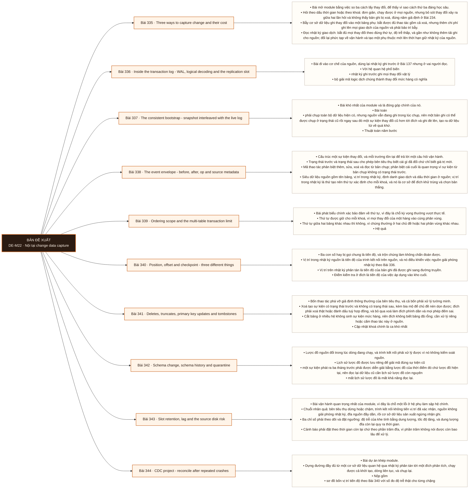

# Mô-đun 22: Nội tại change data capture

Module học sâu cơ chế mà M16 chỉ nhắc tới. Nó nối trực tiếp ba module trước: nhật ký ghi trước ở M10 là nguồn, nhật ký phân tán ở M21 là đường truyền, và lập luận về hỏng ở M20 là khung phân tích. Điểm khó nhất và cũng là đóng góp chính của module: bản chụp ban đầu phải được đan xen với dòng thay đổi đang chạy, vì nguồn vẫn đang ghi trong lúc ta chụp. Làm sai chỗ này tạo ra khoảng trống hoặc ghi đè ngược, và cả hai đều im lặng.

## Điều kiện đầu vào

| Mã | Người học có thể | Bằng chứng được chấp nhận |
|---|---|---|
| EN-22-01 | M10 · M15 · M20 · M21 | Bằng chứng hoàn thành điều kiện được nêu trong cột trước |

Nếu chưa có bằng chứng đầu vào, người học phải hoàn thành lại bài hoặc mô-đun được dẫn chiếu trước khi thực hiện phép đánh giá của mô-đun này.

## Đầu ra mô-đun

Vẽ được đường từ vị trí nhật ký nguồn tới vị trí trình kết nối tới vị trí trên nhật ký phân tán tới điểm kiểm tra ở đích, và chứng minh tính đầy đủ bằng đối soát

## Tiêu chí hoàn thành

| Mã | Bằng chứng bắt buộc | Ngưỡng đạt | Lỗi loại trực tiếp |
|---|---|---|---|
| EC-22-01 | Giải thích được tính nhất quán của bản chụp ban đầu cùng cửa sổ hỏng của nó và chứng minh bằng đối soát; sổ tay phủ rủi ro thời hạn giữ ở nguồn, độ trễ, bản ghi độc, chụp lại và phá vỡ lược đồ | Đích khớp nguồn tuyệt đối về tập khoá và giá trị sau ≥ 30 lần giết, bốn vị trí tiến độ có số đo độ trễ, và lần chụp lại có đối soát trước khi hoán đổi. | Xoá khe sao chép để tắt cảnh báo mà không có kế hoạch phục hồi, và chụp lại đè lên trạng thái đang phục vụ |

## Khái niệm và nguyên tắc bất biến

| Mã khái niệm | Ranh giới định nghĩa | Nguyên tắc bất biến hoặc quy tắc quyết định | Bài chính |
|---|---|---|---|
| C22-335 | Bài mở module bằng việc so ba cách lấy thay đổi, để thấy vì sao cách thứ ba đáng học sâu. | Hỏi theo dấu thời gian hoặc theo khoá: đơn giản, chạy được ở mọi nguồn, nhưng bỏ sót thay đổi xảy ra giữa hai lần hỏi và không thấy bản ghi bị xoá, đúng năm giả định ở Bài 234. | L335 |
| C22-336 | Bài đi vào cơ chế của nguồn, dùng lại nhật ký ghi trước ở Bài 137 nhưng ở vai người đọc. | Với hệ quan hệ phổ biến | L336 |
| C22-337 | Bài khó nhất của module và là đóng góp chính của nó. | Bài toán | L337 |
| C22-338 | Cấu trúc một sự kiện thay đổi, và mỗi trường tồn tại để trả lời một câu hỏi vận hành. | Trạng thái trước và trạng thái sau cho phép bên tiêu thụ biết cái gì đã đổi chứ chỉ biết giá trị mới. | L338 |
| C22-339 | Bài phát biểu chính xác bảo đảm về thứ tự, vì đây là chỗ kỳ vọng thường vượt thực tế. | Thứ tự được giữ cho mỗi khoá, vì mọi thay đổi của một hàng vào cùng phân vùng. | L339 |
| C22-340 | Ba con số hay bị gọi chung là tiến độ, và trộn chúng làm không chẩn đoán được. | Vị trí trong nhật ký nguồn là tiến độ của trình kết nối trên nguồn, và nó điều khiển việc nguồn giải phóng nhật ký theo Bài 336. | L340 |
| C22-341 | Bốn thao tác phá vỡ giả định thông thường của bên tiêu thụ, và cả bốn phải xử lý tường minh. | Xoá tạo sự kiện có trạng thái trước và không có trạng thái sau, kèm bia mộ để chủ đề nén dọn được; đích phải xoá thật hoặc đánh dấu tuỳ hợp đồng, và bỏ qua xoá làm đích phình dần và mọi phép đếm sai. | L341 |
| C22-342 | Lược đồ nguồn đổi trong lúc dòng đang chạy, và trình kết nối phải xử lý được vì nó không kiểm soát nguồn. | Lịch sử lược đồ được lưu riêng để giải mã đúng sự kiện cũ | L342 |
| C22-343 | Bài vận hành quan trọng nhất của module, vì đây là chỗ một lỗi ở hệ phụ làm sập hệ chính. | Chuỗi nhân quả: bên tiêu thụ dừng hoặc chậm, trình kết nối không tiến vị trí đã xác nhận, nguồn không giải phóng nhật ký, đĩa nguồn đầy dần, rồi cơ sở dữ liệu sản xuất ngừng nhận ghi. | L343 |
| C22-344 | Bài dự án khép module. | Dựng đường đầy đủ từ một cơ sở dữ liệu quan hệ qua nhật ký phân tán tới một đích phân tích, chạy được cả khởi tạo, dòng liên tục, và chụp lại. | L344 |

## Các bài trong mô-đun

| Bài | Dạng | Đầu ra | Bằng chứng | Điều kiện tiên quyết |
|---|---|---|---|---|
| L335 · [[wiki.cdc.capture-methods-cost|Three ways to capture change and their cost]]| LT | So ba cách theo ba tiêu chí và chứng minh cách hỏi theo dấu thời gian bỏ sót thay đổi. | Số thay đổi bỏ sót và số bản xoá không thấy được đo thật, và bảng ba cách có số đo ở tiêu chí tải nguồn. | M22: M21 |
| L336 · [[wiki.cdc.wal-logical-decoding-slot|Inside the transaction log - WAL, logical decoding and the replication slot]]| TH | Đọc được vị trí và trạng thái khe trên nguồn thật, và định lượng tốc độ tích luỹ nhật ký khi bên đọc dừng. | Tốc độ tích luỹ được đo theo dung lượng trên giờ, thời gian tới khi đầy đĩa tính được, và nhật ký được giải phóng sau khi bên đọc chạy lại. | L335 |
| L337 · [[wiki.cdc.consistent-bootstrap-snapshot-log|The consistent bootstrap - snapshot interleaved with the live log]]| TH | Chạy bản chụp ban đầu trong khi nguồn đang ghi và chứng minh không có khoảng trống cũng không có ghi đè ngược. | Đích khớp nguồn tuyệt đối tại ranh giới bất biến, và bản bỏ bước đan xen được chứng minh tạo ghi đè ngược kèm số bản ghi sai. | L336 |
| L338 · [[wiki.cdc.event-envelope|The event envelope - before, after, op and source metadata]]| TH | Cài đích áp dụng sự kiện đúng cho cả bốn mã thao tác, dùng vị trí nhật ký để chọn bản thắng. | Đích khớp nguồn tuyệt đối sau 10.000 thao tác, và sự kiện bị đảo thứ tự không làm sai trạng thái nhờ so phiên bản. | L337 |
| L339 · [[wiki.cdc.ordering-transaction-scope|Ordering scope and the multi-table transaction limit]]| TH | Tái hiện ca đích thấy nửa giao dịch và chọn một cách xử lý kèm điều kiện áp dụng. | Ca nửa giao dịch được quan sát kèm độ dài khoảng thời gian, và cách xử lý chọn kèm hai điều kiện áp dụng. | L338 |
| L340 · [[wiki.cdc.position-offset-checkpoint|Position, offset and checkpoint - three different things]]| TH | Đo riêng ba loại độ trễ và tái hiện ca phát lại sau khi chết, chứng minh đích luỹ đẳng xử lý đúng. | Ba loại độ trễ được đo riêng, và đích khớp nguồn sau 50 lần giết nhờ luỹ đẳng. | L339 |
| L341 · [[wiki.cdc.deletes-truncates-pk-tombstones|Deletes, truncates, primary key updates and tombstones]]| TH | Xử lý đúng cả bốn thao tác và chứng minh đích không còn bản mồ côi cũng không đếm đôi. | Đích khớp nguồn về tập khoá và số lượng sau cả bốn thao tác, không còn hàng mồ côi, và ca cắt bảng có xử lý tường minh. | L340 |
| L342 · [[wiki.cdc.schema-history-quarantine|Schema change, schema history and quarantine]]| TH | Xử lý ba loại thay đổi lược đồ trong lúc dòng đang chạy và đọc lại được dữ liệu cũ sau đó. | Dữ liệu trước thay đổi giải mã đúng khi đọc lại, không sự kiện nào bị bỏ im lặng, và sự kiện cách ly được phát lại thành công. | L341 |
| L343 · [[wiki.cdc.slot-retention-source-disk-risk|Slot retention, lag and the source disk risk]]| TH | Dựng cảnh báo theo thời gian còn lại và chạy đúng quy trình xử lý khi khe phình, không dùng thao tác phá huỷ. | Cảnh báo nổ trước ngưỡng thời gian thoả thuận, phục hồi hoàn tất không cần bỏ khe, và lần chụp lại ở môi trường cách ly có đối soát trước khi hoán đổi. | L342 |
| L344 · [[wiki.cdc.repeated-crash-reconciliation|CDC project - reconcile after repeated crashes]]| DA | Nộp đường bắt thay đổi hoàn chỉnh, đối soát khớp nguồn sau ít nhất 30 lần giết ngẫu nhiên. | Đích khớp nguồn tuyệt đối về tập khoá và giá trị sau ≥ 30 lần giết, bốn vị trí tiến độ có số đo độ trễ, và lần chụp lại có đối soát trước khi hoán đổi. | L343 |

## Nội dung từng bài

> **Sơ đồ đề xuất: DE-M22 v0.1.0.** Mỗi nhánh đi từ một bài học đến các nội dung nguyên tử bắt buộc. Thứ tự dạy lấy từ bảng `Các bài trong mô-đun`.

### Lesson 335: Three ways to capture change and their cost

Bài mở module bằng việc so ba cách lấy thay đổi, để thấy vì sao cách thứ ba đáng học sâu. Hỏi theo dấu thời gian hoặc theo khoá: đơn giản, chạy được ở mọi nguồn, nhưng bỏ sót thay đổi xảy ra giữa hai lần hỏi và không thấy bản ghi bị xoá, đúng năm giả định ở Bài 234. Bẫy cơ sở dữ liệu ghi thay đổi vào một bảng phụ: bắt được đủ thao tác gồm cả xoá, nhưng thêm chi phí ghi lên mọi giao dịch của nguồn và phải bảo trì bẫy. Đọc nhật ký giao dịch: bắt đủ mọi thay đổi theo đúng thứ tự, độ trễ thấp, và gần như không thêm tải ghi cho nguồn; đổi lại phức tạp về vận hành và tạo một phụ thuộc mới lên thời hạn giữ nhật ký của nguồn. Ba tiêu chí so: tải đặt lên nguồn, độ trễ, và tính đầy đủ. Phân biệt với nguồn sự kiện: ở đó ứng dụng chủ động phát ý định nghiệp vụ, còn ở đây ta suy ra thay đổi từ trạng thái vật lý.

Người học phải so ba cách theo ba tiêu chí và chứng minh cách hỏi theo dấu thời gian bỏ sót thay đổi. Bằng chứng thực hành: Dựng một bảng nguồn có ghi liên tục. Chạy cách hỏi theo dấu thời gian mỗi 10 giây trong khi ghi nhiều lần một bản ghi và xoá vài bản ghi; đếm số thay đổi bị bỏ sót và số bản xoá không thấy. Cài một bẫy và đo chi phí ghi thêm trên nguồn. Lập bảng ba cách nhân ba tiêu chí. Bài hoàn tất khi số thay đổi bỏ sót và số bản xoá không thấy được đo thật, và bảng ba cách có số đo ở tiêu chí tải nguồn.

Cách đánh giá: Tầng *hiểu*. Bài mở module, kiểm bằng một thí nghiệm nhỏ chứ chỉ lập luận. Kiểm bằng phép đếm bỏ sót; đạt khi số thay đổi bị bỏ sót được đo thật và bảng ba cách nhân ba tiêu chí có số ở tiêu chí tải nguồn.

### Lesson 336: Inside the transaction log - WAL, logical decoding and the replication slot

Bài đi vào cơ chế của nguồn, dùng lại nhật ký ghi trước ở Bài 137 nhưng ở vai người đọc. Với hệ quan hệ phổ biến: nhật ký ghi trước ghi mọi thay đổi vật lý; bộ giải mã logic dịch chúng thành thay đổi mức hàng có nghĩa; khe sao chép giữ vị trí mà bên đọc đã xác nhận, và nguồn không được xoá phần nhật ký chưa được khe nào xác nhận. Từ đó suy ra rủi ro trung tâm của module: bên đọc dừng thì nhật ký tích luỹ và đĩa nguồn đầy dần, nên một trình kết nối chết có thể làm sập cơ sở dữ liệu sản xuất. Vị trí khởi động lại và vị trí đã xác nhận là hai con số khác nhau. Với hệ khác thì có nhật ký nhị phân cùng định dạng và vị trí hoặc định danh giao dịch toàn cục. Ranh giới giao dịch có trong nhật ký, và đây là thứ cách hỏi theo dấu thời gian không bao giờ có.

Người học phải đọc được vị trí và trạng thái khe trên nguồn thật, và định lượng tốc độ tích luỹ nhật ký khi bên đọc dừng. Bằng chứng thực hành: Bật giải mã logic trên một cơ sở dữ liệu lab và tạo một khe. Đọc vị trí khởi động lại và vị trí đã xác nhận, giải thích khác biệt. Chạy tải ghi, dừng bên đọc, và đo tốc độ tích luỹ nhật ký. Tính thời gian còn lại tới khi đầy đĩa. Cho bên đọc chạy lại và xác nhận nhật ký được giải phóng. Bài hoàn tất khi tốc độ tích luỹ được đo theo dung lượng trên giờ, thời gian tới khi đầy đĩa tính được, và nhật ký được giải phóng sau khi bên đọc chạy lại.

Cách đánh giá: Tầng *phân tích*. Objective đòi quan sát trạng thái thật của nguồn. Kiểm bằng thí nghiệm dừng bên đọc; đạt khi tốc độ tích luỹ được đo theo đơn vị dung lượng trên giờ và thời gian tới khi đầy đĩa tính được.

### Lesson 337: The consistent bootstrap - snapshot interleaved with the live log

Bài khó nhất của module và là đóng góp chính của nó. Bài toán: phải chụp toàn bộ dữ liệu hiện có, nhưng nguồn vẫn đang ghi trong lúc chụp, nên một bản ghi có thể được chụp ở trạng thái cũ rồi ngay sau đó một sự kiện thay đổi cũ hơn tới đích và ghi đè lên, tạo ra dữ liệu lùi về quá khứ. Thuật toán năm bước: xác lập vị trí nhật ký và ranh giới nhất quán trước khi chụp; đọc bảng theo từng khối trong khi vẫn thu sự kiện thay đổi; đan xen sao cho một dòng của bản chụp không bao giờ ghi đè một sự kiện mới hơn, dùng cơ chế mốc nước hoặc so phiên bản theo khoá; hoàn tất bản chụp rồi tiếp tục phát dòng từ đúng vị trí đã xác lập; và chỉ lưu vị trí của trình kết nối theo đúng giao thức giao nhận. Chia khối theo khoá có chỉ mục và ảnh hưởng lên nguồn theo Bài 238. Hai chế độ hỏng: khoảng trống, và ghi đè ngược.

Người học phải chạy bản chụp ban đầu trong khi nguồn đang ghi và chứng minh không có khoảng trống cũng không có ghi đè ngược. Bằng chứng thực hành: Chạy tải ghi liên tục trên nguồn. Khởi tạo bản chụp trong lúc đó. Sau khi hoàn tất, dừng ghi và đối soát tập khoá cùng giá trị giữa nguồn và đích. Cài thêm một bản cố ý bỏ bước đan xen và chứng minh nó tạo ra dữ liệu lùi về quá khứ; đếm số bản ghi sai. Đo ảnh hưởng của việc chụp lên nguồn. Bài hoàn tất khi đích khớp nguồn tuyệt đối tại ranh giới bất biến, và bản bỏ bước đan xen được chứng minh tạo ghi đè ngược kèm số bản ghi sai.

Cách đánh giá: Tầng *áp dụng*. Objective có tiêu chí nghiệm thu là đối soát khớp tuyệt đối dưới ghi đồng thời. Kiểm bằng đối soát tập khoá và giá trị; đạt khi đích khớp nguồn tại một ranh giới bất biến, và bản cài sai được chứng minh tạo ghi đè ngược.

### Lesson 338: The event envelope - before, after, op and source metadata

Cấu trúc một sự kiện thay đổi, và mỗi trường tồn tại để trả lời một câu hỏi vận hành. Trạng thái trước và trạng thái sau cho phép bên tiêu thụ biết cái gì đã đổi chứ chỉ biết giá trị mới. Mã thao tác phân biệt thêm, sửa, xoá và đọc từ bản chụp; phân biệt cái cuối là quan trọng vì sự kiện từ bản chụp không có trạng thái trước. Siêu dữ liệu nguồn gồm tên bảng, vị trí trong nhật ký, định danh giao dịch và dấu thời gian ở nguồn; vị trí trong nhật ký là thứ tạo nên thứ tự xác định cho mỗi khoá, và nó là cơ sở để đích khử trùng và chọn bản thắng. Khoá của sự kiện lấy từ khoá chính, và nó quyết định phân vùng theo Bài 322 nên mọi thay đổi của một hàng đi cùng phân vùng và giữ đúng thứ tự. Sự kiện bia mộ cho thao tác xoá theo Bài 324. Đích áp dụng bằng ghi đè theo khoá cộng so phiên bản.

Người học phải cài đích áp dụng sự kiện đúng cho cả bốn mã thao tác, dùng vị trí nhật ký để chọn bản thắng. Bằng chứng thực hành: Thu sự kiện cho một bảng và kiểm từng trường của phong bì. Cài đích áp dụng bằng ghi đè theo khoá với so phiên bản theo vị trí nhật ký. Chạy 10.000 thao tác hỗn hợp gồm thêm, sửa, xoá. Cố ý đảo thứ tự một số sự kiện khi giao và chứng minh so phiên bản giữ trạng thái đúng. Đối soát cuối cùng. Bài hoàn tất khi đích khớp nguồn tuyệt đối sau 10.000 thao tác, và sự kiện bị đảo thứ tự không làm sai trạng thái nhờ so phiên bản.

Cách đánh giá: Tầng *áp dụng*. Objective có tiêu chí nghiệm thu là trạng thái đích khớp nguồn sau một chuỗi thao tác hỗn hợp. Kiểm bằng đối soát sau 10.000 thao tác; đạt khi đích khớp nguồn tuyệt đối và sự kiện tới sai thứ tự không làm sai trạng thái.

### Lesson 339: Ordering scope and the multi-table transaction limit

Bài phát biểu chính xác bảo đảm về thứ tự, vì đây là chỗ kỳ vọng thường vượt thực tế. Thứ tự được giữ cho mỗi khoá, vì mọi thay đổi của một hàng vào cùng phân vùng. Thứ tự giữa hai bảng khác nhau thì không, vì chúng thường ở hai chủ đề hoặc hai phân vùng khác nhau. Hệ quả: một giao dịch nguồn chạm hai bảng sẽ tới đích thành hai sự kiện độc lập, và đích có thể thấy nửa giao dịch trong một khoảng thời gian; nếu hạ nguồn có ràng buộc tham chiếu giữa hai bảng thì nó sẽ thấy trạng thái không nhất quán tạm thời. Ba cách xử lý và đánh đổi: chấp nhận trạng thái trung gian và nói rõ với bên tiêu thụ; gom theo định danh giao dịch rồi áp dụng cả cụm; hoặc đưa hai bảng về một chủ đề với khoá chung. Định danh giao dịch có trong phong bì nên gom được, nhưng ranh giới kết thúc giao dịch cần một tín hiệu riêng.

Người học phải tái hiện ca đích thấy nửa giao dịch và chọn một cách xử lý kèm điều kiện áp dụng. Bằng chứng thực hành: Tạo một giao dịch nguồn chạm hai bảng có quan hệ tham chiếu. Ở đích, chạy một truy vấn liên tục kiểm ràng buộc tham chiếu và ghi lại mọi lần nó bị vi phạm cùng độ dài khoảng thời gian. Cài cách gom theo định danh giao dịch và đo lại. So độ trễ của hai cách. Viết một câu cho bên tiêu thụ nói rõ bảo đảm thứ tự mà họ nhận được. Bài hoàn tất khi ca nửa giao dịch được quan sát kèm độ dài khoảng thời gian, và cách xử lý chọn kèm hai điều kiện áp dụng.

Cách đánh giá: Tầng *phân tích*. Objective đòi nhận ra một giới hạn thường bị bỏ qua khi thiết kế. Kiểm bằng ca tái hiện cộng bài chọn; đạt khi ca nửa giao dịch được quan sát và định lượng khoảng thời gian, và cách xử lý chọn kèm hai điều kiện.

### Lesson 340: Position, offset and checkpoint - three different things

Ba con số hay bị gọi chung là tiến độ, và trộn chúng làm không chẩn đoán được. Vị trí trong nhật ký nguồn là tiến độ của trình kết nối trên nguồn, và nó điều khiển việc nguồn giải phóng nhật ký theo Bài 336. Vị trí trên nhật ký phân tán là tiến độ của bản ghi đã được ghi sang đường truyền. Điểm kiểm tra ở đích là tiến độ của việc áp dụng vào kho cuối. Ba con số tiến theo ba nhịp và khoảng cách giữa chúng là ba loại độ trễ khác nhau, mỗi loại có nguyên nhân riêng và cách xử lý riêng. Thứ tự lưu trạng thái phải theo đúng quy tắc ở Bài 240: chỉ tiến một con số sau khi dữ liệu tương ứng đã bền vững ở bước sau. Ca hỏng bắt buộc tái hiện: trình kết nối chết sau khi đã phát sự kiện nhưng trước khi lưu vị trí, dẫn tới phát lại và trùng lặp ở đích; lời giải là đích luỹ đẳng chứ cố tránh phát lại.

Người học phải đo riêng ba loại độ trễ và tái hiện ca phát lại sau khi chết, chứng minh đích luỹ đẳng xử lý đúng. Bằng chứng thực hành: Dựng đường đầy đủ từ nguồn qua nhật ký phân tán tới đích. Đo riêng ba loại độ trễ dưới tải và vẽ ba đường. Giết trình kết nối 50 lần ở các thời điểm ngẫu nhiên, trong đó có lần sau khi phát và trước khi lưu vị trí. Đếm số sự kiện trùng ở đích. Bật đích luỹ đẳng và đối soát lại. Bài hoàn tất khi ba loại độ trễ được đo riêng, và đích khớp nguồn sau 50 lần giết nhờ luỹ đẳng.

Cách đánh giá: Tầng *phân tích*. Objective đòi tách ba tiến độ thường bị gộp. Kiểm bằng ba số đo cộng thí nghiệm giết; đạt khi ba loại độ trễ được đo riêng và đích vẫn khớp nguồn sau 50 lần giết ngẫu nhiên.

### Lesson 341: Deletes, truncates, primary key updates and tombstones

Bốn thao tác phá vỡ giả định thông thường của bên tiêu thụ, và cả bốn phải xử lý tường minh. Xoá tạo sự kiện có trạng thái trước và không có trạng thái sau, kèm bia mộ để chủ đề nén dọn được; đích phải xoá thật hoặc đánh dấu tuỳ hợp đồng, và bỏ qua xoá làm đích phình dần và mọi phép đếm sai. Cắt bảng ở nhiều hệ không sinh sự kiện mức hàng, nên đích không biết bảng đã rỗng; cần xử lý riêng hoặc cấm thao tác này ở nguồn. Cập nhật khoá chính là ca khó nhất: nguồn coi là một lần sửa, nhưng ở đích khoá cũ và khoá mới là hai hàng, nên nếu không xử lý thì hàng cũ ở lại thành bản mồ côi và số lượng bị đếm đôi; lời giải là phát cả sự kiện xoá khoá cũ lẫn sự kiện thêm khoá mới. Xoá theo tầng ở nguồn sinh hàng loạt sự kiện và có thể gây dồn ứ.

Người học phải xử lý đúng cả bốn thao tác và chứng minh đích không còn bản mồ côi cũng không đếm đôi. Bằng chứng thực hành: Thực hiện bốn thao tác trên nguồn: xoá, cắt bảng, cập nhật khoá chính, và xoá theo tầng nhiều nghìn hàng. Sau mỗi thao tác, đối soát tập khoá và số lượng giữa nguồn và đích. Với cập nhật khoá chính, chứng minh không còn hàng mồ côi. Với cắt bảng, chỉ ra hệ có sinh sự kiện không và xử lý tường minh. Đo dồn ứ khi xoá theo tầng. Bài hoàn tất khi đích khớp nguồn về tập khoá và số lượng sau cả bốn thao tác, không còn hàng mồ côi, và ca cắt bảng có xử lý tường minh.

Cách đánh giá: Tầng *áp dụng*. Objective có bốn ca biên với tiêu chí nghiệm thu bằng đối soát. Kiểm bằng bốn thao tác tiêm; đạt khi đích khớp nguồn về tập khoá và số lượng sau cả bốn, và ca cắt bảng được xử lý tường minh.

### Lesson 342: Schema change, schema history and quarantine

Lược đồ nguồn đổi trong lúc dòng đang chạy, và trình kết nối phải xử lý được vì nó không kiểm soát nguồn. Lịch sử lược đồ được lưu riêng để giải mã đúng sự kiện cũ: một sự kiện phát ra ba tháng trước phải được diễn giải bằng lược đồ của thời điểm đó chứ lược đồ hiện tại, nên đọc lại dữ liệu cũ cần lịch sử lược đồ còn nguyên; mất lịch sử lược đồ là mất khả năng đọc lại. Ba loại thay đổi và phản ứng, theo phân loại ở Bài 241: thêm cột thì bên tiêu thụ cũ vẫn chạy; đổi kiểu thu hẹp là phá vỡ; đổi tên là phá vỡ với bên đọc theo tên. Thứ tự triển khai giữa bên sản xuất và bên tiêu thụ lấy từ mức tương thích ở Bài 331. Sự kiện không giải mã được đi vào vùng cách ly kèm nguyên nhân và vị trí, để phát lại sau khi sửa chứ bỏ.

Người học phải xử lý ba loại thay đổi lược đồ trong lúc dòng đang chạy và đọc lại được dữ liệu cũ sau đó. Bằng chứng thực hành: Chạy dòng liên tục rồi thực hiện ba thay đổi lược đồ ở nguồn. Với mỗi cái, ghi lại phản ứng của trình kết nối và của bên tiêu thụ. Sau khi đổi xong, đọc lại toàn bộ chủ đề từ đầu và xác nhận dữ liệu cũ giải mã đúng nhờ lịch sử lược đồ. Tạo một sự kiện không giải mã được, xác nhận nó vào vùng cách ly, sửa rồi phát lại. Bài hoàn tất khi dữ liệu trước thay đổi giải mã đúng khi đọc lại, không sự kiện nào bị bỏ im lặng, và sự kiện cách ly được phát lại thành công.

Cách đánh giá: Tầng *áp dụng*. Objective có tiêu chí nghiệm thu là đọc lại dữ liệu cũ vẫn đúng sau khi lược đồ đã đổi. Kiểm bằng phép đọc lại; đạt khi dữ liệu trước thay đổi được giải mã đúng, không sự kiện nào bị bỏ im lặng, và sự kiện cách ly phát lại được.

### Lesson 343: Slot retention, lag and the source disk risk

Bài vận hành quan trọng nhất của module, vì đây là chỗ một lỗi ở hệ phụ làm sập hệ chính. Chuỗi nhân quả: bên tiêu thụ dừng hoặc chậm, trình kết nối không tiến vị trí đã xác nhận, nguồn không giải phóng nhật ký, đĩa nguồn đầy dần, rồi cơ sở dữ liệu sản xuất ngừng nhận ghi. Ba chỉ số phải theo dõi và đặt ngưỡng: độ trễ của khe tính bằng dung lượng, tốc độ tăng, và dung lượng đĩa còn lại quy ra thời gian. Cảnh báo phải đặt theo thời gian còn lại chứ theo phần trăm đĩa, vì phần trăm không nói được còn bao lâu để xử lý. Quy trình khi cảnh báo nổ, theo thứ tự: tìm nguyên nhân bên tiêu thụ dừng, khôi phục nó, chỉ khi hết cách mới cân nhắc bỏ khe. Bỏ khe là thao tác phá huỷ: nó giải phóng đĩa ngay nhưng mất toàn bộ thay đổi chưa đọc, nên bắt buộc phải chụp lại, và chụp lại phải vào không gian cách ly chứ đè lên trạng thái đang phục vụ.

Người học phải dựng cảnh báo theo thời gian còn lại và chạy đúng quy trình xử lý khi khe phình, không dùng thao tác phá huỷ. Bằng chứng thực hành: Dựng ba chỉ số và đặt cảnh báo theo thời gian còn lại. Dừng bên tiêu thụ và để khe phình; xác nhận cảnh báo nổ đúng lúc. Chạy quy trình phục hồi theo thứ tự và đo thời gian tới khi nhật ký được giải phóng. Ở môi trường cách ly, thực hiện một lần bỏ khe rồi chụp lại vào không gian riêng, đối soát trước khi hoán đổi. Bài hoàn tất khi cảnh báo nổ trước ngưỡng thời gian thoả thuận, phục hồi hoàn tất không cần bỏ khe, và lần chụp lại ở môi trường cách ly có đối soát trước khi hoán đổi.

Cách đánh giá: Tầng *đánh giá*. Objective đo năng lực vận hành dưới một rủi ro có thể làm sập hệ chính. Kiểm bằng tình huống tái hiện; đạt khi cảnh báo nổ trước ngưỡng thời gian thoả thuận và quy trình phục hồi không cần bỏ khe.

### Lesson 344: CDC project - reconcile after repeated crashes

Bài dự án khép module. Dựng đường đầy đủ từ một cơ sở dữ liệu quan hệ qua nhật ký phân tán tới một đích phân tích, chạy được cả khởi tạo, dòng liên tục, và chụp lại. Nộp gồm: sơ đồ bốn vị trí tiến độ theo Bài 340 với số đo độ trễ thật cho từng chặng; bằng chứng bản chụp ban đầu nhất quán theo Bài 337; xử lý đủ bốn thao tác ở Bài 341; lịch sử lược đồ cùng vùng cách ly; ba chỉ số cùng cảnh báo theo Bài 343; và sổ tay vận hành. Nghiệm thu bằng đối soát sau khi giết lặp lại: chạy tải ghi liên tục trên nguồn, giết trình kết nối, máy chủ nhật ký và tiến trình ghi đích ở các thời điểm ngẫu nhiên ít nhất 30 lần, rồi đối soát tập khoá và giá trị giữa nguồn và đích tại một ranh giới bất biến. Mọi việc chạy xong không phải bằng chứng; đối soát mới là.

Người học phải nộp đường bắt thay đổi hoàn chỉnh, đối soát khớp nguồn sau ít nhất 30 lần giết ngẫu nhiên. Bằng chứng thực hành: Dựng đường đầy đủ. Chạy tải ghi liên tục gồm thêm, sửa, xoá và một lần cập nhật khoá chính. Giết ba thành phần ngẫu nhiên ít nhất 30 lần. Dừng ghi và đối soát. Thực hiện một lần chụp lại vào không gian cách ly rồi hoán đổi. Nộp sổ tay đủ năm mục bắt buộc. Bài hoàn tất khi đích khớp nguồn tuyệt đối về tập khoá và giá trị sau ≥ 30 lần giết, bốn vị trí tiến độ có số đo độ trễ, và lần chụp lại có đối soát trước khi hoán đổi.

Cách đánh giá: Tầng *sáng tạo*. Bài tổng hợp toàn module. Kiểm bằng đối soát sau giết lặp lại; đạt khi đích khớp nguồn tuyệt đối về tập khoá và giá trị, và bốn vị trí tiến độ đều có số đo độ trễ.

## Lý do sắp xếp

Mô-đun bắt đầu từ `M22: M21` và đi theo các quan hệ tiên quyết đã ghi trong bảng. Mỗi bài chỉ sử dụng khái niệm hoặc thao tác đã được giới thiệu trước đó; bài cuối L344 tích hợp đầu ra của toàn mô-đun.

## Ma trận đánh giá

| Mã đầu ra | Mức độ tư duy | Cách đánh giá | Ngưỡng đạt | Hình thức kiểm tra lại |
|---|---|---|---|---|
| L335 | Hiểu | Tầng *hiểu*. Bài mở module, kiểm bằng một thí nghiệm nhỏ chứ chỉ lập luận. Kiểm bằng phép đếm bỏ sót; đạt khi số thay đổi bị bỏ sót được đo thật và bảng ba cách nhân ba tiêu chí có số ở tiêu chí tải nguồn. | Số thay đổi bỏ sót và số bản xoá không thấy được đo thật, và bảng ba cách có số đo ở tiêu chí tải nguồn. | Tình huống mới, giữ nguyên đầu ra và ngưỡng |
| L336 | Phân tích | Tầng *phân tích*. Objective đòi quan sát trạng thái thật của nguồn. Kiểm bằng thí nghiệm dừng bên đọc; đạt khi tốc độ tích luỹ được đo theo đơn vị dung lượng trên giờ và thời gian tới khi đầy đĩa tính được. | Tốc độ tích luỹ được đo theo dung lượng trên giờ, thời gian tới khi đầy đĩa tính được, và nhật ký được giải phóng sau khi bên đọc chạy lại. | Tình huống mới, giữ nguyên đầu ra và ngưỡng |
| L337 | Áp dụng | Tầng *áp dụng*. Objective có tiêu chí nghiệm thu là đối soát khớp tuyệt đối dưới ghi đồng thời. Kiểm bằng đối soát tập khoá và giá trị; đạt khi đích khớp nguồn tại một ranh giới bất biến, và bản cài sai được chứng minh tạo ghi đè ngược. | Đích khớp nguồn tuyệt đối tại ranh giới bất biến, và bản bỏ bước đan xen được chứng minh tạo ghi đè ngược kèm số bản ghi sai. | Tình huống mới, giữ nguyên đầu ra và ngưỡng |
| L338 | Áp dụng | Tầng *áp dụng*. Objective có tiêu chí nghiệm thu là trạng thái đích khớp nguồn sau một chuỗi thao tác hỗn hợp. Kiểm bằng đối soát sau 10.000 thao tác; đạt khi đích khớp nguồn tuyệt đối và sự kiện tới sai thứ tự không làm sai trạng thái. | Đích khớp nguồn tuyệt đối sau 10.000 thao tác, và sự kiện bị đảo thứ tự không làm sai trạng thái nhờ so phiên bản. | Tình huống mới, giữ nguyên đầu ra và ngưỡng |
| L339 | Phân tích | Tầng *phân tích*. Objective đòi nhận ra một giới hạn thường bị bỏ qua khi thiết kế. Kiểm bằng ca tái hiện cộng bài chọn; đạt khi ca nửa giao dịch được quan sát và định lượng khoảng thời gian, và cách xử lý chọn kèm hai điều kiện. | Ca nửa giao dịch được quan sát kèm độ dài khoảng thời gian, và cách xử lý chọn kèm hai điều kiện áp dụng. | Tình huống mới, giữ nguyên đầu ra và ngưỡng |
| L340 | Phân tích | Tầng *phân tích*. Objective đòi tách ba tiến độ thường bị gộp. Kiểm bằng ba số đo cộng thí nghiệm giết; đạt khi ba loại độ trễ được đo riêng và đích vẫn khớp nguồn sau 50 lần giết ngẫu nhiên. | Ba loại độ trễ được đo riêng, và đích khớp nguồn sau 50 lần giết nhờ luỹ đẳng. | Tình huống mới, giữ nguyên đầu ra và ngưỡng |
| L341 | Áp dụng | Tầng *áp dụng*. Objective có bốn ca biên với tiêu chí nghiệm thu bằng đối soát. Kiểm bằng bốn thao tác tiêm; đạt khi đích khớp nguồn về tập khoá và số lượng sau cả bốn, và ca cắt bảng được xử lý tường minh. | Đích khớp nguồn về tập khoá và số lượng sau cả bốn thao tác, không còn hàng mồ côi, và ca cắt bảng có xử lý tường minh. | Tình huống mới, giữ nguyên đầu ra và ngưỡng |
| L342 | Áp dụng | Tầng *áp dụng*. Objective có tiêu chí nghiệm thu là đọc lại dữ liệu cũ vẫn đúng sau khi lược đồ đã đổi. Kiểm bằng phép đọc lại; đạt khi dữ liệu trước thay đổi được giải mã đúng, không sự kiện nào bị bỏ im lặng, và sự kiện cách ly phát lại được. | Dữ liệu trước thay đổi giải mã đúng khi đọc lại, không sự kiện nào bị bỏ im lặng, và sự kiện cách ly được phát lại thành công. | Tình huống mới, giữ nguyên đầu ra và ngưỡng |
| L343 | Đánh giá | Tầng *đánh giá*. Objective đo năng lực vận hành dưới một rủi ro có thể làm sập hệ chính. Kiểm bằng tình huống tái hiện; đạt khi cảnh báo nổ trước ngưỡng thời gian thoả thuận và quy trình phục hồi không cần bỏ khe. | Cảnh báo nổ trước ngưỡng thời gian thoả thuận, phục hồi hoàn tất không cần bỏ khe, và lần chụp lại ở môi trường cách ly có đối soát trước khi hoán đổi. | Tình huống mới, giữ nguyên đầu ra và ngưỡng |
| L344 | Sáng tạo | Tầng *sáng tạo*. Bài tổng hợp toàn module. Kiểm bằng đối soát sau giết lặp lại; đạt khi đích khớp nguồn tuyệt đối về tập khoá và giá trị, và bốn vị trí tiến độ đều có số đo độ trễ. | Đích khớp nguồn tuyệt đối về tập khoá và giá trị sau ≥ 30 lần giết, bốn vị trí tiến độ có số đo độ trễ, và lần chụp lại có đối soát trước khi hoán đổi. | Tình huống mới, giữ nguyên đầu ra và ngưỡng |

Không cộng điểm để bù cho lỗi loại trực tiếp. Người học phải sửa đúng lỗi, nộp lại bằng chứng và thực hiện kiểm tra lại trên một tình huống khác.

## Bài thực hành bắt buộc

| Bài thực hành hoặc dự án | Bài liên quan | Sản phẩm bắt buộc | Lỗi được cài vào tình huống |
|---|---|---|---|
| Three ways to capture change and their cost | L335 | Dựng một bảng nguồn có ghi liên tục. Chạy cách hỏi theo dấu thời gian mỗi 10 giây trong khi ghi nhiều lần một bản ghi và xoá vài bản ghi; đếm số thay đổi bị bỏ sót và số bản xoá không thấy. Cài một bẫy và đo chi phí ghi thêm trên nguồn. Lập bảng ba cách nhân ba tiêu chí. | Dùng cách hỏi theo dấu thời gian rồi tuyên bố bắt đủ thay đổi · cài bẫy mà không đo chi phí ghi thêm · nhầm bắt thay đổi với nguồn sự kiện · chọn đọc nhật ký mà chưa tính phụ thuộc thời hạn giữ. |
| Inside the transaction log - WAL, logical decoding and the replication slot | L336 | Bật giải mã logic trên một cơ sở dữ liệu lab và tạo một khe. Đọc vị trí khởi động lại và vị trí đã xác nhận, giải thích khác biệt. Chạy tải ghi, dừng bên đọc, và đo tốc độ tích luỹ nhật ký. Tính thời gian còn lại tới khi đầy đĩa. Cho bên đọc chạy lại và xác nhận nhật ký được giải phóng. | Tạo khe rồi quên bên đọc · nhầm vị trí khởi động lại với vị trí đã xác nhận · không đo tốc độ tích luỹ nên không đặt được cảnh báo · giả định nguồn tự dọn nhật ký. |
| The consistent bootstrap - snapshot interleaved with the live log | L337 | Chạy tải ghi liên tục trên nguồn. Khởi tạo bản chụp trong lúc đó. Sau khi hoàn tất, dừng ghi và đối soát tập khoá cùng giá trị giữa nguồn và đích. Cài thêm một bản cố ý bỏ bước đan xen và chứng minh nó tạo ra dữ liệu lùi về quá khứ; đếm số bản ghi sai. Đo ảnh hưởng của việc chụp lên nguồn. | Chụp xong rồi mới bắt đầu thu dòng thay đổi · để dòng bản chụp ghi đè sự kiện mới hơn · khoá bảng để chụp cho đơn giản · không đối soát sau khi hoàn tất. |
| The event envelope - before, after, op and source metadata | L338 | Thu sự kiện cho một bảng và kiểm từng trường của phong bì. Cài đích áp dụng bằng ghi đè theo khoá với so phiên bản theo vị trí nhật ký. Chạy 10.000 thao tác hỗn hợp gồm thêm, sửa, xoá. Cố ý đảo thứ tự một số sự kiện khi giao và chứng minh so phiên bản giữ trạng thái đúng. Đối soát cuối cùng. | Chỉ dùng trạng thái sau nên không biết cái gì đã đổi · áp dụng theo thứ tự tới thay vì theo vị trí nhật ký · xử lý sự kiện từ bản chụp như một lần sửa · bỏ qua sự kiện bia mộ. |
| Ordering scope and the multi-table transaction limit | L339 | Tạo một giao dịch nguồn chạm hai bảng có quan hệ tham chiếu. Ở đích, chạy một truy vấn liên tục kiểm ràng buộc tham chiếu và ghi lại mọi lần nó bị vi phạm cùng độ dài khoảng thời gian. Cài cách gom theo định danh giao dịch và đo lại. So độ trễ của hai cách. Viết một câu cho bên tiêu thụ nói rõ bảo đảm thứ tự mà họ nhận được. | Giả định thứ tự toàn cục giữa các bảng · để hạ nguồn cưỡng chế ràng buộc tham chiếu mà không nói trước · gom theo giao dịch mà không có tín hiệu kết thúc · bỏ qua độ trễ tăng thêm khi gom. |
| Position, offset and checkpoint - three different things | L340 | Dựng đường đầy đủ từ nguồn qua nhật ký phân tán tới đích. Đo riêng ba loại độ trễ dưới tải và vẽ ba đường. Giết trình kết nối 50 lần ở các thời điểm ngẫu nhiên, trong đó có lần sau khi phát và trước khi lưu vị trí. Đếm số sự kiện trùng ở đích. Bật đích luỹ đẳng và đối soát lại. | Gọi chung ba con số là độ trễ · lưu vị trí trình kết nối trước khi sự kiện bền vững ở đường truyền · cố tránh phát lại thay vì làm đích luỹ đẳng · theo dõi một loại độ trễ rồi kết luận cho cả tuyến. |
| Deletes, truncates, primary key updates and tombstones | L341 | Thực hiện bốn thao tác trên nguồn: xoá, cắt bảng, cập nhật khoá chính, và xoá theo tầng nhiều nghìn hàng. Sau mỗi thao tác, đối soát tập khoá và số lượng giữa nguồn và đích. Với cập nhật khoá chính, chứng minh không còn hàng mồ côi. Với cắt bảng, chỉ ra hệ có sinh sự kiện không và xử lý tường minh. Đo dồn ứ khi xoá theo tầng. | Bỏ qua sự kiện xoá · coi cập nhật khoá chính là một lần sửa thường · giả định cắt bảng sinh sự kiện mức hàng · không đo dồn ứ khi có thao tác hàng loạt. |
| Schema change, schema history and quarantine | L342 | Chạy dòng liên tục rồi thực hiện ba thay đổi lược đồ ở nguồn. Với mỗi cái, ghi lại phản ứng của trình kết nối và của bên tiêu thụ. Sau khi đổi xong, đọc lại toàn bộ chủ đề từ đầu và xác nhận dữ liệu cũ giải mã đúng nhờ lịch sử lược đồ. Tạo một sự kiện không giải mã được, xác nhận nó vào vùng cách ly, sửa rồi phát lại. | Xoá lịch sử lược đồ để dọn dẹp · để sự kiện không giải mã được bị bỏ qua · đổi lược đồ nguồn mà không báo bên tiêu thụ · triển khai sai thứ tự so với mức tương thích. |
| Slot retention, lag and the source disk risk | L343 | Dựng ba chỉ số và đặt cảnh báo theo thời gian còn lại. Dừng bên tiêu thụ và để khe phình; xác nhận cảnh báo nổ đúng lúc. Chạy quy trình phục hồi theo thứ tự và đo thời gian tới khi nhật ký được giải phóng. Ở môi trường cách ly, thực hiện một lần bỏ khe rồi chụp lại vào không gian riêng, đối soát trước khi hoán đổi. | Đặt cảnh báo theo phần trăm đĩa · bỏ khe để tắt cảnh báo · chụp lại đè lên trạng thái đang phục vụ · không đo thời gian còn lại nên không biết còn bao lâu để xử lý. |
| CDC project - reconcile after repeated crashes | L344 | Dựng đường đầy đủ. Chạy tải ghi liên tục gồm thêm, sửa, xoá và một lần cập nhật khoá chính. Giết ba thành phần ngẫu nhiên ít nhất 30 lần. Dừng ghi và đối soát. Thực hiện một lần chụp lại vào không gian cách ly rồi hoán đổi. Nộp sổ tay đủ năm mục bắt buộc. | Coi trình kết nối báo chạy là bằng chứng đầy đủ · chụp lại đè lên đích đang phục vụ · bỏ ca cập nhật khoá chính · đối soát bằng cách đếm tổng mà không so tập khoá. |

## Ngộ nhận và lỗi loại trực tiếp

| Lỗi | Hệ quả | Nơi phát hiện | Cách khắc phục |
|---|---|---|---|
| Dùng cách hỏi theo dấu thời gian rồi tuyên bố bắt đủ thay đổi · cài bẫy mà không đo chi phí ghi thêm · nhầm bắt thay đổi với nguồn sự kiện · chọn đọc nhật ký mà chưa tính phụ thuộc thời hạn giữ. | Không tạo được bằng chứng hợp lệ cho đầu ra L335 | L335 | Làm lại phép đánh giá trên tình huống mới và đạt tiêu chí `Done when` |
| Tạo khe rồi quên bên đọc · nhầm vị trí khởi động lại với vị trí đã xác nhận · không đo tốc độ tích luỹ nên không đặt được cảnh báo · giả định nguồn tự dọn nhật ký. | Không tạo được bằng chứng hợp lệ cho đầu ra L336 | L336 | Làm lại phép đánh giá trên tình huống mới và đạt tiêu chí `Done when` |
| Chụp xong rồi mới bắt đầu thu dòng thay đổi · để dòng bản chụp ghi đè sự kiện mới hơn · khoá bảng để chụp cho đơn giản · không đối soát sau khi hoàn tất. | Không tạo được bằng chứng hợp lệ cho đầu ra L337 | L337 | Làm lại phép đánh giá trên tình huống mới và đạt tiêu chí `Done when` |
| Chỉ dùng trạng thái sau nên không biết cái gì đã đổi · áp dụng theo thứ tự tới thay vì theo vị trí nhật ký · xử lý sự kiện từ bản chụp như một lần sửa · bỏ qua sự kiện bia mộ. | Không tạo được bằng chứng hợp lệ cho đầu ra L338 | L338 | Làm lại phép đánh giá trên tình huống mới và đạt tiêu chí `Done when` |
| Giả định thứ tự toàn cục giữa các bảng · để hạ nguồn cưỡng chế ràng buộc tham chiếu mà không nói trước · gom theo giao dịch mà không có tín hiệu kết thúc · bỏ qua độ trễ tăng thêm khi gom. | Không tạo được bằng chứng hợp lệ cho đầu ra L339 | L339 | Làm lại phép đánh giá trên tình huống mới và đạt tiêu chí `Done when` |
| Gọi chung ba con số là độ trễ · lưu vị trí trình kết nối trước khi sự kiện bền vững ở đường truyền · cố tránh phát lại thay vì làm đích luỹ đẳng · theo dõi một loại độ trễ rồi kết luận cho cả tuyến. | Không tạo được bằng chứng hợp lệ cho đầu ra L340 | L340 | Làm lại phép đánh giá trên tình huống mới và đạt tiêu chí `Done when` |
| Bỏ qua sự kiện xoá · coi cập nhật khoá chính là một lần sửa thường · giả định cắt bảng sinh sự kiện mức hàng · không đo dồn ứ khi có thao tác hàng loạt. | Không tạo được bằng chứng hợp lệ cho đầu ra L341 | L341 | Làm lại phép đánh giá trên tình huống mới và đạt tiêu chí `Done when` |
| Xoá lịch sử lược đồ để dọn dẹp · để sự kiện không giải mã được bị bỏ qua · đổi lược đồ nguồn mà không báo bên tiêu thụ · triển khai sai thứ tự so với mức tương thích. | Không tạo được bằng chứng hợp lệ cho đầu ra L342 | L342 | Làm lại phép đánh giá trên tình huống mới và đạt tiêu chí `Done when` |
| Đặt cảnh báo theo phần trăm đĩa · bỏ khe để tắt cảnh báo · chụp lại đè lên trạng thái đang phục vụ · không đo thời gian còn lại nên không biết còn bao lâu để xử lý. | Không tạo được bằng chứng hợp lệ cho đầu ra L343 | L343 | Làm lại phép đánh giá trên tình huống mới và đạt tiêu chí `Done when` |
| Coi trình kết nối báo chạy là bằng chứng đầy đủ · chụp lại đè lên đích đang phục vụ · bỏ ca cập nhật khoá chính · đối soát bằng cách đếm tổng mà không so tập khoá. | Không tạo được bằng chứng hợp lệ cho đầu ra L344 | L344 | Làm lại phép đánh giá trên tình huống mới và đạt tiêu chí `Done when` |

## Điểm nối với mô-đun khác

| Kế thừa từ | Cung cấp cho mô-đun sau | Cam kết đầu ra |
|---|---|---|
| M10 · M15 · M20 · M21 | M21 | Vẽ được đường từ vị trí nhật ký nguồn tới vị trí trình kết nối tới vị trí trên nhật ký phân tán tới điểm kiểm tra ở đích, và chứng minh tính đầy đủ bằng đối soát |

## Tài liệu tham khảo

| Mã | Nguồn | Vị trí | Dùng cho |
|---|---|---|---|
| R22-01 | Hợp đồng học tập gốc | `17_CDC_INTERNALS.md` | Phạm vi, lab, tiêu chí hoàn thành và lỗi loại trực tiếp |
| R22-02 | Manifest nguồn cấp bài | `Material/DE/Reference/.../Lesson_*/sources.yaml` | Truy vết nguồn khi manifest được điền |

## Đối chiếu năng lực

| Khung hoặc mã năng lực | Phạm vi sử dụng | Bằng chứng |
|---|---|---|
| `DTAN` mức 4 · `SYSP` mức 4 | Đầu ra và phép đánh giá của mô-đun | EC-22-01 và ma trận đánh giá theo bài |

Ánh xạ này mô tả phạm vi được thực hành; nó không tự động chứng nhận cấp độ của người học trong khung năng lực.

## Giới hạn của mô-đun

- Roadmap xác định phạm vi, bằng chứng và cách đánh giá; nội dung giảng giải đầy đủ thuộc `note.md`.
- Manifest nguồn cấp bài hiện chưa có dữ liệu. Không được dùng tên tệp trong `Reference/Library` làm bằng chứng cho một khẳng định.
- Hoàn thành mô-đun chỉ chứng minh các đầu ra được nêu trong tài liệu này; không tự động chứng nhận chức danh hoặc kinh nghiệm làm việc.
