# Mô-đun 23: Spark, Flink và distributed compute engine

Module áp toàn bộ phần song song ở M4 vào một engine thật. Ba tầng đặt ra ở Bài 48 và Bài 56 gặp lại đầy đủ: cụm tính toán là nhiều lệnh nhiều dữ liệu phân tán, một mảnh toán tử chạy theo khuôn mẫu một chương trình nhiều dữ liệu trên nhiều phân vùng, và bên trong mỗi tác vụ có đường xử lý theo lô cùng làn véctơ. Kỷ luật điều chỉnh lấy từ M4 và giữ nguyên ở đây: sửa dữ liệu, bố cục và thuật toán trước khi chạm tới cấu hình bộ nhớ. Một engine học sâu là đủ; engine dòng chảy còn lại ở mức hiểu kiến trúc và khác biệt, trừ khi công việc yêu cầu.

## Điều kiện đầu vào

| Mã | Người học có thể | Bằng chứng được chấp nhận |
|---|---|---|
| EN-23-01 | M03 · M04 · M05 · M14 · M15 · M20 · M21 | Bằng chứng hoàn thành điều kiện được nêu trong cột trước |

Nếu chưa có bằng chứng đầu vào, người học phải hoàn thành lại bài hoặc mô-đun được dẫn chiếu trước khi thực hiện phép đánh giá của mô-đun này.

## Đầu ra mô-đun

Ánh xạ mã nguồn thành kế hoạch logic, toán tử vật lý, giai đoạn và tác vụ; điều chỉnh bắt đầu từ số đo chứ từ việc đổi cấu hình

## Tiêu chí hoàn thành

| Mã | Bằng chứng bắt buộc | Ngưỡng đạt | Lỗi loại trực tiếp |
|---|---|---|---|
| EC-23-01 | Giải thích được song song lồng nhau và tránh được cấp phát quá mức giữa lõi của tiến trình thực thi, mức đồng thời của tác vụ, luồng của thư viện gốc và số nút; chọn giữa bốn lớp engine gồm hai engine phân tán và hai engine một máy, theo khối lượng công việc, quy mô, độ trễ, nhu cầu giữ trạng thái và chi phí vận hành | Đạt ≥ 70/100, phần B và D đều ≥ 60%. Tuyên bố đúng một lần không nêu nguồn, đích và giả định lỗi thì phần B bằng không; phục hồi bằng cách đặt lại vị trí về cuối thì phần D bằng không. | Đổi cấu hình bộ nhớ tiến trình thực thi một cách ngẫu nhiên, kéo toàn bộ dữ liệu về tiến trình điều khiển, và tuyên bố dòng chảy đúng một lần mà bỏ qua đích |

## Khái niệm và nguyên tắc bất biến

| Mã khái niệm | Ranh giới định nghĩa | Nguyên tắc bất biến hoặc quy tắc quyết định | Bài chính |
|---|---|---|---|
| C23-345 | Bài mở module bằng từ vựng thực thi, vì năm từ dưới đây bị dùng lẫn thường xuyên. | Tiến trình điều khiển giữ kế hoạch, lập lịch và gom kết quả; tiến trình thực thi chạy tác vụ và giữ dữ liệu trong bộ nhớ; bộ quản lý cụm cấp tài nguyên. | L345 |
| C23-346 | Bài truy đường biên dịch, nối thẳng với nội dung engine truy vấn ở Bài 126 và Bài 130. | Bốn bước: mã dựng kế hoạch logic chưa phân giải; bộ phân tích phân giải tên và kiểu theo danh mục; bộ tối ưu áp luật viết lại cùng thông tin chi phí; bộ lập kế hoạch chọn toán tử vật lý. | L346 |
| C23-347 | Bài giải thích ranh giới giai đoạn bằng cơ chế chứ bằng quy ước. | Phụ thuộc hẹp: mỗi phân vùng đầu ra chỉ cần một phân vùng đầu vào, nên phép biến đổi chạy tại chỗ và nhiều phép nối tiếp nhau gộp vào một tác vụ. | L347 |
| C23-348 | Ba chiến lược kết trong engine phân tán, tương ứng ba thuật toán ở Bài 127 nhưng thêm chiều mạng. | Kết phát tán băm gửi bảng nhỏ tới mọi tiến trình thực thi rồi kết cục bộ, nên không cần xáo trộn bảng lớn; điều kiện là bảng nhỏ vừa bộ nhớ, và ngưỡng phát tán dựa trên ước lượng kích thước nên thống kê sai làm tràn bộ nhớ theo đúng ca ở Bài 212. | L348 |
| C23-349 | Bước xáo trộn là thao tác đắt nhất, nên nó có một bài riêng để mổ xẻ chi phí. | Bốn thành phần chi phí phải tách: ghi dữ liệu xáo trộn ra đĩa cục bộ, truyền qua mạng, đọc lại, và chi phí tuần tự hoá cùng giải tuần tự hoá. | L349 |
| C23-350 | Bộ nhớ của tiến trình thực thi chia thành phần cho thực thi và phần cho lưu trữ, và hai phần cạnh tranh nhau. | Lưu tạm một tập dữ liệu chỉ có lợi khi nó được đọc lại nhiều lần; lưu tạm một tập dùng đúng một lần vừa không giúp vừa chiếm chỗ của phần thực thi, làm tăng tràn đĩa. | L350 |
| C23-351 | Lệch tải là nguyên nhân số một khiến một công việc chạy lâu bất thường mà mọi cấu hình trông đều hợp lý. | Triệu chứng đặc trưng | L351 |
| C23-352 | Bài đặt engine vào đúng khung phân loại ở Bài 48 và nối với Bài 56 cùng Bài 211. | Mỗi lõi của mỗi tiến trình thực thi có dòng lệnh và trạng thái riêng, nên cụm là nhiều lệnh nhiều dữ liệu bộ nhớ phân tán. | L352 |
| C23-353 | Bài chỉ ra một chế độ hỏng mà chỉ hiểu song song lồng nhau mới nhận ra. | Bốn nguồn song song cùng tồn tại | L353 |
| C23-354 | Bài thí nghiệm khép phần song song: cố định khối lượng công việc và tăng tài nguyên, rồi tìm điểm mà thêm tài nguyên bắt đầu phản tác dụng. | Chạy với 1, 2, 4 và nhiều hơn số lõi hoặc tiến trình thực thi; tính tăng tốc và hiệu suất song song ở từng mức theo Bài 56, và báo cáo cả hai chứ chỉ tăng tốc. | L354 |
| C23-355 | Bài dự án về điều chỉnh hiệu năng, chạy theo một cây quyết định có thứ tự cố định để chống việc đổi cấu hình ngẫu nhiên. | Thứ tự bắt buộc | L355 |
| C23-356 | Bài chuyển sang xử lý dòng trên cùng engine, với mô hình xử lý theo lô nhỏ. | Mỗi lần kích hoạt, engine đọc một khoảng vị trí từ nguồn, xử lý, ghi ra đích, rồi lưu tiến độ; nên nó là một chuỗi công việc theo lô liên tiếp chứ một dòng chảy từng bản ghi. | L356 |
| C23-357 | Bài áp ba trục thời gian ở Bài 251 vào xử lý dòng, nơi chúng trở thành cơ chế chạy được. | Thời gian sự kiện là lúc việc xảy ra; xử lý theo thời gian sự kiện cho kết quả đúng và ổn định khi chạy lại, còn xử lý theo thời gian tới thì kết quả đổi mỗi lần chạy lại. | L357 |
| C23-358 | Bài mở rộng phạm vi chọn engine ra bốn lớp, vì hai engine phân tán không phải lựa chọn duy nhất và thường không phải lựa chọn đúng. | Engine dòng chảy thứ hai học tới mức hiểu kiến trúc và khác biệt, đi sâu chỉ khi công việc yêu cầu. | L358 |
| C23-359 | Bài phát biểu chính xác bảo đảm đầu cuối của một đường dòng chảy, và nó là bài chống lại tuyên bố mơ hồ. | Bảo đảm đầu cuối là tích của ba điều kiện chứ một tính năng bật được: nguồn phải phát lại được từ một vị trí; trạng thái phải khôi phục được nhất quán với vị trí đó; và đích phải luỹ đẳng hoặc có giao dịch. | L359 |
| C23-360 | Cổng của Phase 8. | Bài kiểm bốn module: nền tảng hệ phân tán ở M20, nhật ký phân tán ở M21, bắt thay đổi ở M22, và engine tính toán ở M23. | L360 |

## Các bài trong mô-đun

| Bài | Dạng | Đầu ra | Bằng chứng | Điều kiện tiên quyết |
|---|---|---|---|---|
| L345 · [[wiki.spark.cluster-roles-execution-hierarchy|Cluster roles and the execution hierarchy]]| LT | Ánh xạ năm từ vựng thực thi vào một ứng dụng thật và đếm đúng số tác vụ của từng giai đoạn. | Đếm đúng số giai đoạn và tác vụ cho ba công việc, và giải thích được số tác vụ đến từ số phân vùng. | M23: M21 |
| L346 · [[wiki.spark.logical-physical-plan|From code to logical plan to physical operators]]| TH | Đọc kế hoạch vật lý của ba truy vấn và dự đoán đúng số giai đoạn trước khi chạy. | Dự đoán đúng số giai đoạn ở ≥ 2/3 truy vấn, và mọi bước trao đổi dữ liệu được chỉ đúng vị trí trong kế hoạch. | L345 |
| L347 · [[wiki.spark.dependencies-exchange-stage|Narrow and wide dependencies, and why exchange creates a stage]]| TH | Phân loại phép biến đổi theo hai loại phụ thuộc và giảm được số bước xáo trộn của một công việc thật. | Số bước trao đổi giảm ≥ 1 với thời gian giảm có số đo, và kết quả đối soát khớp bản gốc tuyệt đối. | L346 |
| L348 · [[wiki.spark.join-strategies-thresholds|Join strategies and the threshold that is not magic]]| TH | Ép cả ba chiến lược trên cùng phép kết, đo chi phí từng cái, và tái hiện ca phát tán gây tràn bộ nhớ. | Ba chiến lược có số đo thời gian và lượng xáo trộn, và ca tràn bộ nhớ do ước lượng sai được tái hiện cùng giải thích. | L347 |
| L349 · [[wiki.spark.shuffle-read-write-spill|Shuffle - read, write, sort, spill and serialization]]| TH | Tách bốn thành phần chi phí của một bước xáo trộn và giảm tổng thời gian có số đo mà kết quả không đổi. | Bốn thành phần chi phí đều có số đo, và thành phần lớn nhất giảm kéo tổng thời gian giảm theo với kết quả không đổi. | L348 |
| L350 · [[wiki.spark.memory-cache-gc|Memory, caching and garbage collection]]| TH | Quyết định lưu tạm dựa trên số lần đọc lại và chứng minh bằng số đo rằng lưu tạm sai làm chậm hơn. | Quyết định lưu tạm đúng ở cả ba tình huống, và ca lưu tạm sai được định lượng mức chậm thêm. | L349 |
| L351 · [[wiki.spark.skew-straggler-decision|Skew, stragglers and the salt-or-broadcast decision]]| TH | Chẩn đoán lệch tải từ phân bố thời gian tác vụ và sửa bằng một trong ba cách, có đối soát kết quả. | Chẩn đoán đúng cả ba tình huống bằng số đo, và bản sửa lệch tải khớp kết quả gốc với thời gian giảm có số đo. | L350 |
| L352 · [[wiki.spark.mimd-spmd|Distributed MIMD and SPMD in a compute engine]]| LT | Truy được ba tầng song song trên một công việc thật và gán đúng mỗi mức tăng quan sát được về một tầng. | Ba tầng được chỉ ra bằng bằng chứng quan sát được, và ba mức tăng được gán đúng tầng kèm lý do. | L351 |
| L353 · [[wiki.spark.nested-parallelism|Nested parallelism and oversubscription]]| TH | Phát hiện cấp phát quá mức bằng số đo và chặn nó, chứng minh thông lượng tăng trở lại. | Tổng số luồng và số lõi được đo, và sau khi đặt giới hạn thì thông lượng tăng với thời gian phân vị 95 của tác vụ giảm. | L352 |
| L354 · [[wiki.spark.strong-scaling|Strong scaling lab - where scale-out turns negative]]| TH | Vẽ đường hiệu suất song song tới ít nhất tám mức và quy trần về đúng một trong năm nguyên nhân. | Đường hiệu suất song song có số đo ở ≥ 4 mức, bốn thành phần thời gian tách được ở mọi mức, và trần quy về một nguyên nhân có bằng chứng. | L353 |
| L355 · [[wiki.spark.tuning-decision-tree|Tuning project - the decision tree on three unknown jobs]]| DA | Chẩn đoán ba công việc lạ theo cây quyết định và cải thiện từng cái bằng đúng một thay đổi có kiểm soát. | Chẩn đoán đúng nguyên nhân ở ≥ 2/3 công việc, mỗi cải thiện dùng đúng một thay đổi có số đo trước sau, và kết quả đối soát không đổi. | L354 |
| L356 · [[wiki.spark.streaming-checkpoint-state|Structured streaming - micro-batch, offsets, checkpoint and state]]| TH | Vận hành một công việc dòng có trạng thái, khôi phục từ điểm kiểm tra, và chặn được trạng thái phình vô hạn. | Khôi phục từ điểm kiểm tra không mất và không trùng ngoài giới hạn đã nêu, và kích thước trạng thái ổn định sau khi đặt hết hạn. | L355 |
| L357 · [[wiki.spark.event-time-watermark|Event time, watermark and late data]]| TH | Đo đánh đổi giữa độ trễ và tính đầy đủ theo ba mức mốc nước và áp chính sách rõ cho sự kiện quá muộn. | Ba mức mốc nước có cặp số độ trễ với tỉ lệ bỏ cùng kích thước trạng thái, và sự kiện quá muộn được đếm và ghi nhận. | L356 |
| L358 · [[wiki.compute.engine-class-selection|Choosing among four engine classes - distributed, embedded and in-process]]| TH | So bốn lớp engine theo năm tiêu chí và chọn đúng cho ba bối cảnh, phân biệt điểm kiểm tra với điểm lưu. | Bảng bốn lớp nhân năm tiêu chí có luận điểm kèm quan sát từ lab, ngưỡng chuyển sang engine phân tán có số đo từ ba kích thước dữ liệu, ba bối cảnh chọn đúng với ít nhất một chọn engine một máy, và khôi phục từ cả điểm kiểm tra lẫn điểm lưu thành công. | L357 |
| L359 · [[wiki.streaming.end-to-end-guarantee|End-to-end guarantee - source replay, state restore and sink]]| TH | Phát biểu bảo đảm đầu cuối cho ba cấu hình và chứng minh bằng thí nghiệm giết có đối soát. | Phát biểu khớp kết quả đo ở cả ba cấu hình sau 50 lần giết, và cấu hình đích chỉ thêm mới được nêu rõ giới hạn. | L358 |
| L360 · [[wiki.streaming.gate8-recovery-defense|Gate 8 - defend a delivery semantic and recover a stateful job]]| KT | Phát biểu và bảo vệ một bảo đảm giao nhận có nêu ranh giới, phục hồi một công việc có trạng thái, và giải thích song song lồng nhau bằng số đo. | Đạt ≥ 70/100, phần B và D đều ≥ 60%. Tuyên bố đúng một lần không nêu nguồn, đích và giả định lỗi thì phần B bằng không; phục hồi bằng cách đặt lại vị trí về cuối thì phần D bằng không. | L359 |

## Nội dung từng bài

> **Sơ đồ đề xuất: DE-M23 v0.1.0.** Mỗi nhánh đi từ một bài học đến các nội dung nguyên tử bắt buộc. Thứ tự dạy lấy từ bảng `Các bài trong mô-đun`.

```mermaid
%%{init: {"flowchart": {"htmlLabels": true, "wrappingWidth": 720, "nodeSpacing": 64, "rankSpacing": 160}}}%%
flowchart LR
  M23["BẢN ĐỀ XUẤT<br/>DE-M23 · Spark, Flink và distributed compute engine"]
  M23 --> L345["Bài 345 · Cluster roles and the execution hierarchy"]
  L345 --> A345["• Bài mở module bằng từ vựng thực thi, vì năm từ dưới đây bị dùng lẫn thường xuyên.<br/>• Tiến trình điều khiển giữ kế hoạch, lập lịch và gom kết quả; tiến trình thực thi chạy tác vụ và giữ dữ liệu trong bộ nhớ; bộ quản lý cụm cấp tài nguyên.<br/>• Bậc thang thực thi có bốn mức lồng nhau: một ứng dụng gồm nhiều công việc, một công việc gồm nhiều giai đoạn, một giai đoạn gồm nhiều tác vụ, và một tác vụ xử lý đúng một phân vùng.<br/>• Từ đó suy ra quan hệ nền tảng: số tác vụ trong một giai đoạn bằng số phân vùng, nên số phân vùng là nút điều chỉnh mức song song chứ số lõi."]
  M23 --> L346["Bài 346 · From code to logical plan to physical operators"]
  L346 --> A346["• Bài truy đường biên dịch, nối thẳng với nội dung engine truy vấn ở Bài 126 và Bài 130.<br/>• Bốn bước: mã dựng kế hoạch logic chưa phân giải; bộ phân tích phân giải tên và kiểu theo danh mục; bộ tối ưu áp luật viết lại cùng thông tin chi phí; bộ lập kế hoạch chọn toán tử vật lý.<br/>• Đọc kế hoạch là kỹ năng chính của module<br/>• phần quét cho biết có cắt tỉa và có đẩy điều kiện xuống không theo Bài 206 và 210"]
  M23 --> L347["Bài 347 · Narrow and wide dependencies, and why exchange creates a stage"]
  L347 --> A347["• Bài giải thích ranh giới giai đoạn bằng cơ chế chứ bằng quy ước.<br/>• Phụ thuộc hẹp: mỗi phân vùng đầu ra chỉ cần một phân vùng đầu vào, nên phép biến đổi chạy tại chỗ và nhiều phép nối tiếp nhau gộp vào một tác vụ.<br/>• Phụ thuộc rộng<br/>• một phân vùng đầu ra cần dữ liệu từ nhiều phân vùng đầu vào, nên phải xáo trộn dữ liệu qua mạng"]
  M23 --> L348["Bài 348 · Join strategies and the threshold that is not magic"]
  L348 --> A348["• Ba chiến lược kết trong engine phân tán, tương ứng ba thuật toán ở Bài 127 nhưng thêm chiều mạng.<br/>• Kết phát tán băm gửi bảng nhỏ tới mọi tiến trình thực thi rồi kết cục bộ, nên không cần xáo trộn bảng lớn; điều kiện là bảng nhỏ vừa bộ nhớ, và ngưỡng phát tán dựa trên ước lượng kích thước nên thống kê sai làm tràn bộ nhớ theo đúng ca ở Bài 212.<br/>• Kết băm sau xáo trộn băm cả hai bảng theo khoá kết.<br/>• Kết trộn sau sắp xếp sắp cả hai rồi trộn, ổn định với dữ liệu lớn và tốn chi phí sắp xếp."]
  M23 --> L349["Bài 349 · Shuffle - read, write, sort, spill and serialization"]
  L349 --> A349["• Bước xáo trộn là thao tác đắt nhất, nên nó có một bài riêng để mổ xẻ chi phí.<br/>• Bốn thành phần chi phí phải tách: ghi dữ liệu xáo trộn ra đĩa cục bộ, truyền qua mạng, đọc lại, và chi phí tuần tự hoá cùng giải tuần tự hoá.<br/>• Xáo trộn đi qua ba bậc chậm nhất của thứ bậc bộ nhớ cùng lúc theo Bài 58, nên nó thường chiếm phần lớn thời gian.<br/>• Tràn đĩa xảy ra khi bộ nhớ làm việc không đủ cho phép sắp xếp hoặc phép gộp; nó là cơ chế sống sót chứ lỗi, nhưng làm chậm nhiều lần và phải đọc được trong số đo."]
  M23 --> L350["Bài 350 · Memory, caching and garbage collection"]
  L350 --> A350["• Bộ nhớ của tiến trình thực thi chia thành phần cho thực thi và phần cho lưu trữ, và hai phần cạnh tranh nhau.<br/>• Lưu tạm một tập dữ liệu chỉ có lợi khi nó được đọc lại nhiều lần; lưu tạm một tập dùng đúng một lần vừa không giúp vừa chiếm chỗ của phần thực thi, làm tăng tràn đĩa.<br/>• Các mức lưu tạm khác nhau về nơi giữ và về việc có tuần tự hoá không, nên chúng đánh đổi giữa bộ nhớ và chi phí giải tuần tự hoá.<br/>• Thu dọn rác trở thành vấn đề khi giữ quá nhiều đối tượng sống: bộ thu dọn chạy liên tục và ăn thời gian bộ xử lý mà không làm việc hữu ích; biểu diễn dữ liệu ngoài vùng quản lý bộ nhớ giảm áp lực này."]
  M23 --> L351["Bài 351 · Skew, stragglers and the salt-or-broadcast decision"]
  L351 --> A351["• Lệch tải là nguyên nhân số một khiến một công việc chạy lâu bất thường mà mọi cấu hình trông đều hợp lý.<br/>• Triệu chứng đặc trưng<br/>• trong một giai đoạn, phần lớn tác vụ xong nhanh còn một hoặc vài tác vụ chạy lâu gấp nhiều lần<br/>• phân bố thời gian tác vụ là số đo chẩn đoán chính, và giá trị trung bình che mất hiện tượng này nên phải nhìn phân vị."]
  M23 --> L352["Bài 352 · Distributed MIMD and SPMD in a compute engine"]
  L352 --> A352["• Bài đặt engine vào đúng khung phân loại ở Bài 48 và nối với Bài 56 cùng Bài 211.<br/>• Mỗi lõi của mỗi tiến trình thực thi có dòng lệnh và trạng thái riêng, nên cụm là nhiều lệnh nhiều dữ liệu bộ nhớ phân tán.<br/>• Bộ lập lịch gửi cùng một mã toán tử cho nhiều phân vùng, nên đây là khuôn mẫu một chương trình nhiều dữ liệu.<br/>• Hệ quả quan trọng và hay bị hiểu sai"]
  M23 --> L353["Bài 353 · Nested parallelism and oversubscription"]
  L353 --> A353["• Bài chỉ ra một chế độ hỏng mà chỉ hiểu song song lồng nhau mới nhận ra.<br/>• Bốn nguồn song song cùng tồn tại<br/>• số nút trong cụm, số lõi cấp cho mỗi tiến trình thực thi, số tác vụ chạy đồng thời trong một tiến trình, và luồng do thư viện gốc tự tạo bên trong một tác vụ, chẳng hạn thư viện đại số tuyến tính hoặc thư viện xử lý cột.<br/>• Nguồn thứ tư là nguồn ẩn: nó không xuất hiện trong bất kỳ cấu hình nào của engine, nhưng nó nhân lên với ba nguồn kia."]
  M23 --> L354["Bài 354 · Strong scaling lab - where scale-out turns negative"]
  L354 --> A354["• Bài thí nghiệm khép phần song song: cố định khối lượng công việc và tăng tài nguyên, rồi tìm điểm mà thêm tài nguyên bắt đầu phản tác dụng.<br/>• Chạy với 1, 2, 4 và nhiều hơn số lõi hoặc tiến trình thực thi; tính tăng tốc và hiệu suất song song ở từng mức theo Bài 56, và báo cáo cả hai chứ chỉ tăng tốc.<br/>• Tách thời gian thành bốn phần: chờ lập lịch, tính, xáo trộn cùng truyền thông, và tuần tự hoá; bốn phần này tiến hoá khác nhau khi tăng quy mô, và phần nào tăng theo là phần chỉ ra trần.<br/>• Năm nguyên nhân làm tăng quy mô phản tác dụng: phần tuần tự ở tiến trình điều khiển, chi phí xáo trộn tăng theo số phân vùng, lệch tải, cấp phát quá mức theo Bài 353, và nút cổ chai ở hệ bên ngoài như nguồn dữ liệu."]
  M23 --> L355["Bài 355 · Tuning project - the decision tree on three unknown jobs"]
  L355 --> A355["• Bài dự án về điều chỉnh hiệu năng, chạy theo một cây quyết định có thứ tự cố định để chống việc đổi cấu hình ngẫu nhiên.<br/>• Thứ tự bắt buộc<br/>• kiểm tính đúng, lược đồ và số phân vùng trước<br/>• đọc kế hoạch theo trình tự quét rồi cắt tỉa rồi chiến lược kết rồi trao đổi rồi gộp và sắp xếp rồi ghi ra"]
  M23 --> L356["Bài 356 · Structured streaming - micro-batch, offsets, checkpoint and state"]
  L356 --> A356["• Bài chuyển sang xử lý dòng trên cùng engine, với mô hình xử lý theo lô nhỏ.<br/>• Mỗi lần kích hoạt, engine đọc một khoảng vị trí từ nguồn, xử lý, ghi ra đích, rồi lưu tiến độ; nên nó là một chuỗi công việc theo lô liên tiếp chứ một dòng chảy từng bản ghi.<br/>• Điểm kiểm tra giữ ba thứ: vị trí nguồn, trạng thái của các phép toán có trạng thái, và siêu dữ liệu của lần ghi; mất điểm kiểm tra là mất khả năng tiếp tục đúng chỗ, và nó không dựng lại được từ đích.<br/>• Kho trạng thái giữ dữ liệu cho phép gộp theo cửa sổ và phép kết dòng; trạng thái phình vô hạn nếu không có cơ chế hết hạn, và đây là chế độ hỏng vận hành phổ biến nhất."]
  M23 --> L357["Bài 357 · Event time, watermark and late data"]
  L357 --> A357["• Bài áp ba trục thời gian ở Bài 251 vào xử lý dòng, nơi chúng trở thành cơ chế chạy được.<br/>• Thời gian sự kiện là lúc việc xảy ra; xử lý theo thời gian sự kiện cho kết quả đúng và ổn định khi chạy lại, còn xử lý theo thời gian tới thì kết quả đổi mỗi lần chạy lại.<br/>• Mốc nước là ước lượng của engine về thời điểm mà mọi sự kiện trước đó coi như đã tới; nó điều khiển thời điểm đóng cửa sổ và giải phóng trạng thái.<br/>• Đánh đổi trung tâm phải đo: mốc nước rộng cho kết quả đầy đủ hơn nhưng trễ hơn và giữ trạng thái lâu hơn, mốc nước hẹp cho kết quả sớm nhưng bỏ nhiều sự kiện muộn."]
  M23 --> L358["Bài 358 · Choosing among four engine classes - distributed, embedded and in-process"]
  L358 --> A358["• Bài mở rộng phạm vi chọn engine ra bốn lớp, vì hai engine phân tán không phải lựa chọn duy nhất và thường không phải lựa chọn đúng.<br/>• Engine dòng chảy thứ hai học tới mức hiểu kiến trúc và khác biệt, đi sâu chỉ khi công việc yêu cầu.<br/>• Khác biệt nền tảng: nó xử lý từng bản ghi thay vì theo lô nhỏ, nên độ trễ thấp hơn đáng kể, đổi lại mô hình vận hành phức tạp hơn.<br/>• Đồ thị toán tử, khe tác vụ và mức song song; nhóm khoá quyết định trạng thái được chia thế nào và quyết định mức song song đổi được tới đâu."]
  M23 --> L359["Bài 359 · End-to-end guarantee - source replay, state restore and sink"]
  L359 --> A359["• Bài phát biểu chính xác bảo đảm đầu cuối của một đường dòng chảy, và nó là bài chống lại tuyên bố mơ hồ.<br/>• Bảo đảm đầu cuối là tích của ba điều kiện chứ một tính năng bật được: nguồn phải phát lại được từ một vị trí; trạng thái phải khôi phục được nhất quán với vị trí đó; và đích phải luỹ đẳng hoặc có giao dịch.<br/>• Thiếu một trong ba thì không có bảo đảm, dù engine có cờ nào bật đi nữa; và đích là mắt xích hay bị bỏ quên nhất.<br/>• Ba loại đích và cách đạt: đích có giao dịch thì chốt cùng tiến độ; đích luỹ đẳng theo khoá thì ghi đè an toàn; đích chỉ thêm mới thì không đạt được và phải chấp nhận trùng."]
  M23 --> L360["Bài 360 · Gate 8 - defend a delivery semantic and recover a stateful job"]
  L360 --> A360["• Cổng của Phase 8.<br/>• Bài kiểm bốn module: nền tảng hệ phân tán ở M20, nhật ký phân tán ở M21, bắt thay đổi ở M22, và engine tính toán ở M23.<br/>• Không có nội dung mới."]

  classDef module fill:#2b1b12,color:#fff4e8,stroke:#ff8a3d,stroke-width:2px;
  classDef lesson fill:#fff4e8,color:#2b1b12,stroke:#c85e16,stroke-width:1.5px;
  classDef atom fill:#fffdf8,color:#2b1b12,stroke:#b8a99a,stroke-width:1px,font-size:15px;
  class M23 module;
  class L345,L346,L347,L348,L349,L350,L351,L352,L353,L354,L355,L356,L357,L358,L359,L360 lesson;
  class A345,A346,A347,A348,A349,A350,A351,A352,A353,A354,A355,A356,A357,A358,A359,A360 atom;
```

### Lesson 345: Cluster roles and the execution hierarchy

Bài mở module bằng từ vựng thực thi, vì năm từ dưới đây bị dùng lẫn thường xuyên. Tiến trình điều khiển giữ kế hoạch, lập lịch và gom kết quả; tiến trình thực thi chạy tác vụ và giữ dữ liệu trong bộ nhớ; bộ quản lý cụm cấp tài nguyên. Bậc thang thực thi có bốn mức lồng nhau: một ứng dụng gồm nhiều công việc, một công việc gồm nhiều giai đoạn, một giai đoạn gồm nhiều tác vụ, và một tác vụ xử lý đúng một phân vùng. Từ đó suy ra quan hệ nền tảng: số tác vụ trong một giai đoạn bằng số phân vùng, nên số phân vùng là nút điều chỉnh mức song song chứ số lõi. Tiến trình điều khiển là điểm nghẽn tiềm tàng và là điểm hỏng: kéo dữ liệu lớn về nó làm tràn bộ nhớ, và kế hoạch quá lớn cùng quá nhiều siêu dữ liệu cũng làm nó chậm. Ánh xạ sang ba tầng song song ở Bài 48 được làm rõ ở Bài 352.

Người học phải ánh xạ năm từ vựng thực thi vào một ứng dụng thật và đếm đúng số tác vụ của từng giai đoạn. Bằng chứng thực hành: Chạy ba công việc có hình dạng khác nhau. Với mỗi cái, mở giao diện theo dõi và ghi số công việc, giai đoạn và tác vụ. Giải thích số tác vụ của mỗi giai đoạn đến từ đâu. Thay đổi số phân vùng đầu vào và xác nhận số tác vụ đổi theo. Kéo một tập dữ liệu lớn về tiến trình điều khiển và quan sát hậu quả. Bài hoàn tất khi đếm đúng số giai đoạn và tác vụ cho ba công việc, và giải thích được số tác vụ đến từ số phân vùng.

Cách đánh giá: Tầng *hiểu*. Bài mở module, đặt từ vựng. Kiểm bằng bài đọc giao diện theo dõi; đạt khi đếm đúng số giai đoạn và số tác vụ cho ba công việc và giải thích được nguồn gốc của số tác vụ.

### Lesson 346: From code to logical plan to physical operators

Bài truy đường biên dịch, nối thẳng với nội dung engine truy vấn ở Bài 126 và Bài 130. Bốn bước: mã dựng kế hoạch logic chưa phân giải; bộ phân tích phân giải tên và kiểu theo danh mục; bộ tối ưu áp luật viết lại cùng thông tin chi phí; bộ lập kế hoạch chọn toán tử vật lý. Đọc kế hoạch là kỹ năng chính của module: phần quét cho biết có cắt tỉa và có đẩy điều kiện xuống không theo Bài 206 và 210; phần kết cho biết chiến lược được chọn; phần trao đổi cho biết ranh giới giai đoạn; phần gộp và sắp xếp cho biết chi phí bộ nhớ. Kế hoạch đã tối ưu khác kế hoạch vật lý, và chỉ kế hoạch vật lý mới nói được công việc sẽ chạy ra sao. Hai giới hạn của bộ tối ưu phải biết: nó dựa vào thống kê nên thống kê cũ cho kế hoạch tồi, và nó không nhìn thấy bên trong hàm do người dùng viết.

Người học phải đọc kế hoạch vật lý của ba truy vấn và dự đoán đúng số giai đoạn trước khi chạy. Bằng chứng thực hành: Với ba truy vấn có hình dạng khác nhau, xuất cả kế hoạch logic, kế hoạch đã tối ưu và kế hoạch vật lý. Dự đoán số giai đoạn từ số bước trao đổi trước khi chạy, rồi đối chiếu. Làm thống kê lạc hậu và quan sát kế hoạch đổi thế nào. Chèn một hàm do người dùng viết và chỉ ra bộ tối ưu mất khả năng gì. Bài hoàn tất khi dự đoán đúng số giai đoạn ở ≥ 2/3 truy vấn, và mọi bước trao đổi dữ liệu được chỉ đúng vị trí trong kế hoạch.

Cách đánh giá: Tầng *phân tích*. Objective đòi dự đoán từ kế hoạch rồi kiểm bằng thực tế. Kiểm bằng ba truy vấn; đạt khi dự đoán đúng số giai đoạn ở ít nhất hai và chỉ ra đúng vị trí mọi bước trao đổi dữ liệu.

### Lesson 347: Narrow and wide dependencies, and why exchange creates a stage

Bài giải thích ranh giới giai đoạn bằng cơ chế chứ bằng quy ước. Phụ thuộc hẹp: mỗi phân vùng đầu ra chỉ cần một phân vùng đầu vào, nên phép biến đổi chạy tại chỗ và nhiều phép nối tiếp nhau gộp vào một tác vụ. Phụ thuộc rộng: một phân vùng đầu ra cần dữ liệu từ nhiều phân vùng đầu vào, nên phải xáo trộn dữ liệu qua mạng; bước trao đổi là ranh giới giai đoạn vì giai đoạn sau không bắt đầu được cho tới khi giai đoạn trước ghi xong toàn bộ dữ liệu xáo trộn, tức nó là một rào đồng bộ. Từ đó suy ra ba hệ quả thực hành: giảm số bước xáo trộn là đòn bẩy tối ưu lớn nhất; một tác vụ chậm trong giai đoạn trước giữ chân cả giai đoạn sau; và dòng dõi cho phép tính lại một phân vùng mất mà không chạy lại toàn bộ. Điểm kiểm tra khác dòng dõi: dòng dõi tính lại, điểm kiểm tra cắt chuỗi tính lại.

Người học phải phân loại phép biến đổi theo hai loại phụ thuộc và giảm được số bước xáo trộn của một công việc thật. Bằng chứng thực hành: Phân loại mười phép biến đổi vào hai loại. Lấy một công việc có bốn bước xáo trộn; viết lại để giảm ít nhất một bước, chẳng hạn bằng cách gộp phép gộp hoặc đổi thứ tự. Đo thời gian và lượng dữ liệu xáo trộn trước sau. Đối soát kết quả. Giết một tiến trình thực thi và quan sát việc tính lại theo dòng dõi; thêm điểm kiểm tra rồi đo lại. Bài hoàn tất khi số bước trao đổi giảm ≥ 1 với thời gian giảm có số đo, và kết quả đối soát khớp bản gốc tuyệt đối.

Cách đánh giá: Tầng *áp dụng*. Objective có tiêu chí nghiệm thu là số bước xáo trộn giảm mà kết quả không đổi. Kiểm bằng cặp số đo; đạt khi số bước trao đổi giảm ít nhất một, thời gian giảm có số đo, và kết quả đối soát khớp bản gốc.

### Lesson 348: Join strategies and the threshold that is not magic

Ba chiến lược kết trong engine phân tán, tương ứng ba thuật toán ở Bài 127 nhưng thêm chiều mạng. Kết phát tán băm gửi bảng nhỏ tới mọi tiến trình thực thi rồi kết cục bộ, nên không cần xáo trộn bảng lớn; điều kiện là bảng nhỏ vừa bộ nhớ, và ngưỡng phát tán dựa trên ước lượng kích thước nên thống kê sai làm tràn bộ nhớ theo đúng ca ở Bài 212. Kết băm sau xáo trộn băm cả hai bảng theo khoá kết. Kết trộn sau sắp xếp sắp cả hai rồi trộn, ổn định với dữ liệu lớn và tốn chi phí sắp xếp. Thực thi thích ứng có thể đổi chiến lược khi thấy kích thước thật tại thời gian chạy, nhưng nó chỉ sửa được sau khi đã có thống kê thật của giai đoạn trước, nên nó không cứu được mọi trường hợp. Ép chiến lược bằng gợi ý là công cụ chẩn đoán, không phải giải pháp lâu dài.

Người học phải ép cả ba chiến lược trên cùng phép kết, đo chi phí từng cái, và tái hiện ca phát tán gây tràn bộ nhớ. Bằng chứng thực hành: Với một phép kết giữa bảng lớn và bảng vừa, ép lần lượt ba chiến lược và xác nhận trong kế hoạch. Đo thời gian, lượng dữ liệu xáo trộn và bộ nhớ đỉnh. Làm thống kê sai để engine chọn phát tán cho một bảng quá lớn và ghi lại lỗi tràn bộ nhớ. Bật thực thi thích ứng và chỉ ra nó sửa được ca nào, không sửa được ca nào. Bài hoàn tất khi ba chiến lược có số đo thời gian và lượng xáo trộn, và ca tràn bộ nhớ do ước lượng sai được tái hiện cùng giải thích.

Cách đánh giá: Tầng *phân tích*. Objective đòi nối lựa chọn chiến lược với số đo và với một ca hỏng. Kiểm bằng ba chiến lược đo song song; đạt khi ba chiến lược có số đo thời gian cùng lượng xáo trộn và ca tràn bộ nhớ do ước lượng sai được tái hiện.

### Lesson 349: Shuffle - read, write, sort, spill and serialization

Bước xáo trộn là thao tác đắt nhất, nên nó có một bài riêng để mổ xẻ chi phí. Bốn thành phần chi phí phải tách: ghi dữ liệu xáo trộn ra đĩa cục bộ, truyền qua mạng, đọc lại, và chi phí tuần tự hoá cùng giải tuần tự hoá. Xáo trộn đi qua ba bậc chậm nhất của thứ bậc bộ nhớ cùng lúc theo Bài 58, nên nó thường chiếm phần lớn thời gian. Tràn đĩa xảy ra khi bộ nhớ làm việc không đủ cho phép sắp xếp hoặc phép gộp; nó là cơ chế sống sót chứ lỗi, nhưng làm chậm nhiều lần và phải đọc được trong số đo. Chi phí tuần tự hoá là phần hay bị bỏ qua và thường lớn hơn phép tính, nhất là với hàm do người dùng viết bằng ngôn ngữ cần chuyển đổi dữ liệu qua ranh giới. Số phân vùng sau xáo trộn quá nhỏ gây tràn, quá lớn gây nhiều tác vụ vụn và tăng chi phí lập lịch.

Người học phải tách bốn thành phần chi phí của một bước xáo trộn và giảm tổng thời gian có số đo mà kết quả không đổi. Bằng chứng thực hành: Chạy một công việc có bước xáo trộn lớn dưới bộ nhớ hạn chế. Đo riêng bốn thành phần chi phí cùng mức tràn đĩa và thời gian thu dọn rác. Thử bốn mức số phân vùng sau xáo trộn và vẽ đường thời gian. Giảm chi phí tuần tự hoá bằng cách thay hàm tự viết bằng biểu thức có sẵn và đo lại. Đối soát kết quả. Bài hoàn tất khi bốn thành phần chi phí đều có số đo, và thành phần lớn nhất giảm kéo tổng thời gian giảm theo với kết quả không đổi.

Cách đánh giá: Tầng *phân tích*. Objective đòi phân giải một số tổng thành bốn phần để biết sửa chỗ nào. Kiểm bằng phép đo phân tách; đạt khi bốn thành phần đều có số, và thành phần lớn nhất được giảm với tổng thời gian giảm theo.

### Lesson 350: Memory, caching and garbage collection

Bộ nhớ của tiến trình thực thi chia thành phần cho thực thi và phần cho lưu trữ, và hai phần cạnh tranh nhau. Lưu tạm một tập dữ liệu chỉ có lợi khi nó được đọc lại nhiều lần; lưu tạm một tập dùng đúng một lần vừa không giúp vừa chiếm chỗ của phần thực thi, làm tăng tràn đĩa. Các mức lưu tạm khác nhau về nơi giữ và về việc có tuần tự hoá không, nên chúng đánh đổi giữa bộ nhớ và chi phí giải tuần tự hoá. Thu dọn rác trở thành vấn đề khi giữ quá nhiều đối tượng sống: bộ thu dọn chạy liên tục và ăn thời gian bộ xử lý mà không làm việc hữu ích; biểu diễn dữ liệu ngoài vùng quản lý bộ nhớ giảm áp lực này. Ba dấu hiệu phân biệt thiếu bộ nhớ thật với dùng bộ nhớ sai cách. Giải phóng bộ nhớ lưu tạm khi không cần nữa là việc phải làm tường minh.

Người học phải quyết định lưu tạm dựa trên số lần đọc lại và chứng minh bằng số đo rằng lưu tạm sai làm chậm hơn. Bằng chứng thực hành: Cho ba tình huống với số lần đọc lại khác nhau là một, ba và mười. Chạy có và không có lưu tạm ở từng tình huống; đo thời gian, mức tràn đĩa và thời gian thu dọn rác. Thử ba mức lưu tạm khác nhau cho tình huống đọc lại nhiều. Tạo một ca giữ quá nhiều đối tượng sống và quan sát thu dọn rác; giảm bằng biểu diễn ngoài vùng quản lý. Bài hoàn tất khi quyết định lưu tạm đúng ở cả ba tình huống, và ca lưu tạm sai được định lượng mức chậm thêm.

Cách đánh giá: Tầng *đánh giá*. Objective chống lại phản xạ lưu tạm mọi thứ. Kiểm bằng ba tình huống đo song song; đạt khi quyết định đúng ở cả ba và ca lưu tạm sai được định lượng mức chậm thêm.

### Lesson 351: Skew, stragglers and the salt-or-broadcast decision

Lệch tải là nguyên nhân số một khiến một công việc chạy lâu bất thường mà mọi cấu hình trông đều hợp lý. Triệu chứng đặc trưng: trong một giai đoạn, phần lớn tác vụ xong nhanh còn một hoặc vài tác vụ chạy lâu gấp nhiều lần; phân bố thời gian tác vụ là số đo chẩn đoán chính, và giá trị trung bình che mất hiện tượng này nên phải nhìn phân vị. Nguyên nhân: một khoá chiếm phần lớn số dòng, nên tác vụ nhận khoá đó làm nhiều việc hơn hẳn. Ba cách xử lý và điều kiện dùng: thêm phần ngẫu nhiên vào khoá rồi gộp hai bước, chuyển sang kết phát tán nếu một bên đủ nhỏ, hoặc tách riêng các khoá nóng và xử lý theo đường khác. Mọi cách xử lý lệch tải đều đổi hình dạng phép tính, nên bắt buộc đối soát kết quả. Phân biệt lệch tải với tác vụ chậm do máy yếu hoặc do thu dọn rác.

Người học phải chẩn đoán lệch tải từ phân bố thời gian tác vụ và sửa bằng một trong ba cách, có đối soát kết quả. Bằng chứng thực hành: Tạo lệch tải bằng một khoá chiếm phần lớn số dòng. Chạy và ghi phân bố thời gian tác vụ; chỉ ra trung bình che hiện tượng thế nào. Thử cả ba cách xử lý, đo thời gian và đối soát kết quả với bản gốc. Tạo thêm hai tình huống có triệu chứng giống nhưng nguyên nhân là máy yếu và thu dọn rác; phân biệt bằng số đo. Bài hoàn tất khi chẩn đoán đúng cả ba tình huống bằng số đo, và bản sửa lệch tải khớp kết quả gốc với thời gian giảm có số đo.

Cách đánh giá: Tầng *phân tích*. Objective đòi phân biệt lệch tải với hai nguyên nhân giống triệu chứng. Kiểm bằng ba tình huống; đạt khi chẩn đoán đúng cả ba và bản sửa lệch tải cho kết quả khớp bản gốc với thời gian giảm có số đo.

### Lesson 352: Distributed MIMD and SPMD in a compute engine

Bài đặt engine vào đúng khung phân loại ở Bài 48 và nối với Bài 56 cùng Bài 211. Mỗi lõi của mỗi tiến trình thực thi có dòng lệnh và trạng thái riêng, nên cụm là nhiều lệnh nhiều dữ liệu bộ nhớ phân tán. Bộ lập lịch gửi cùng một mã toán tử cho nhiều phân vùng, nên đây là khuôn mẫu một chương trình nhiều dữ liệu. Hệ quả quan trọng và hay bị hiểu sai: tác vụ song song dữ liệu không chạy đồng bộ từng bước; thời gian của chúng khác nhau do lệch tải, vị trí dữ liệu, thu dọn rác, vào ra, thử lại và phần cứng không đồng nhất, và chênh lệch đó là bình thường. Bước trao đổi dữ liệu là ranh giới truyền thông và đồng bộ; rào cùng phép gộp cuối làm lộ phần tuần tự và làm lộ tác vụ chậm. Bên trong một tác vụ, bộ giải mã tệp cột và toán tử truy vấn có thể dùng đường xử lý theo lô và làn véctơ, tức tầng thứ ba theo Bài 208.

Người học phải truy được ba tầng song song trên một công việc thật và gán đúng mỗi mức tăng quan sát được về một tầng. Bằng chứng thực hành: Trên một công việc thật, chỉ ra bằng chứng của từng tầng: số tiến trình thực thi và lõi cho tầng nhiều lệnh nhiều dữ liệu, cùng một mã toán tử chạy trên nhiều phân vùng cho khuôn mẫu một chương trình nhiều dữ liệu, và đường xử lý theo lô trong kế hoạch cho tầng làn véctơ. Ghi phân bố thời gian tác vụ và giải thích vì sao chênh lệch là bình thường. Gán ba mức tăng quan sát được về đúng tầng. Bài hoàn tất khi ba tầng được chỉ ra bằng bằng chứng quan sát được, và ba mức tăng được gán đúng tầng kèm lý do.

Cách đánh giá: Tầng *hiểu*. Bài lý thuyết nối M4 với engine thật, chuẩn bị cho hai bài đo. Kiểm bằng bài truy tầng; đạt khi ba tầng được chỉ ra bằng bằng chứng quan sát được và ba mức tăng được gán đúng tầng.

### Lesson 353: Nested parallelism and oversubscription

Bài chỉ ra một chế độ hỏng mà chỉ hiểu song song lồng nhau mới nhận ra. Bốn nguồn song song cùng tồn tại: số nút trong cụm, số lõi cấp cho mỗi tiến trình thực thi, số tác vụ chạy đồng thời trong một tiến trình, và luồng do thư viện gốc tự tạo bên trong một tác vụ, chẳng hạn thư viện đại số tuyến tính hoặc thư viện xử lý cột. Nguồn thứ tư là nguồn ẩn: nó không xuất hiện trong bất kỳ cấu hình nào của engine, nhưng nó nhân lên với ba nguồn kia. Cấp phát quá mức xảy ra khi tổng số luồng vượt số lõi thật: hậu quả là tranh chấp bộ nhớ đệm, bão hoà băng thông bộ nhớ và chuyển ngữ cảnh liên tục, nên thêm song song làm chậm hơn, đúng hiện tượng ở Bài 55. Cách phát hiện: so tổng số luồng quan sát được với số lõi, và đo băng thông bộ nhớ. Cách chặn: đặt giới hạn luồng cho thư viện gốc một cách tường minh.

Người học phải phát hiện cấp phát quá mức bằng số đo và chặn nó, chứng minh thông lượng tăng trở lại. Bằng chứng thực hành: Chạy một công việc có dùng thư viện gốc đa luồng. Đếm tổng số luồng thật trên một máy và so với số lõi. Đo băng thông bộ nhớ và tỉ lệ chuyển ngữ cảnh. Đặt giới hạn luồng cho thư viện gốc và chạy lại; đo thông lượng cùng thời gian phân vị 95 của tác vụ. Lập bảng bốn nguồn song song với giá trị hiện tại của từng nguồn. Bài hoàn tất khi tổng số luồng và số lõi được đo, và sau khi đặt giới hạn thì thông lượng tăng với thời gian phân vị 95 của tác vụ giảm.

Cách đánh giá: Tầng *phân tích*. Objective nhắm vào một nguồn song song không xuất hiện trong cấu hình engine. Kiểm bằng cặp số đo; đạt khi tổng số luồng và số lõi được đo, và sau khi đặt giới hạn thì thông lượng tăng có số đo.

### Lesson 354: Strong scaling lab - where scale-out turns negative

Bài thí nghiệm khép phần song song: cố định khối lượng công việc và tăng tài nguyên, rồi tìm điểm mà thêm tài nguyên bắt đầu phản tác dụng. Chạy với 1, 2, 4 và nhiều hơn số lõi hoặc tiến trình thực thi; tính tăng tốc và hiệu suất song song ở từng mức theo Bài 56, và báo cáo cả hai chứ chỉ tăng tốc. Tách thời gian thành bốn phần: chờ lập lịch, tính, xáo trộn cùng truyền thông, và tuần tự hoá; bốn phần này tiến hoá khác nhau khi tăng quy mô, và phần nào tăng theo là phần chỉ ra trần. Năm nguyên nhân làm tăng quy mô phản tác dụng: phần tuần tự ở tiến trình điều khiển, chi phí xáo trộn tăng theo số phân vùng, lệch tải, cấp phát quá mức theo Bài 353, và nút cổ chai ở hệ bên ngoài như nguồn dữ liệu. Kết luận phải là một khuyến nghị về số tài nguyên kèm lý do, chứ một đồ thị.

Người học phải vẽ đường hiệu suất song song tới ít nhất tám mức và quy trần về đúng một trong năm nguyên nhân. Bằng chứng thực hành: Cố định tập dữ liệu và chạy với ít nhất bốn mức tài nguyên tăng dần. Ở mỗi mức, tính tăng tốc và hiệu suất song song, và tách bốn thành phần thời gian. Xác định mức mà thêm tài nguyên không còn giúp hoặc làm chậm hơn. Quy trần về một trong năm nguyên nhân bằng bằng chứng. Viết khuyến nghị về số tài nguyên kèm ngưỡng chi phí. Bài hoàn tất khi đường hiệu suất song song có số đo ở ≥ 4 mức, bốn thành phần thời gian tách được ở mọi mức, và trần quy về một nguyên nhân có bằng chứng.

Cách đánh giá: Tầng *đánh giá*. Objective đòi giải thích đường cong chứ chỉ vẽ nó. Kiểm bằng thí nghiệm tăng quy mô; đạt khi bốn thành phần thời gian được tách ở mọi mức, điểm phản tác dụng được xác định, và trần quy về một nguyên nhân có bằng chứng.

### Lesson 355: Tuning project - the decision tree on three unknown jobs

Bài dự án về điều chỉnh hiệu năng, chạy theo một cây quyết định có thứ tự cố định để chống việc đổi cấu hình ngẫu nhiên. Thứ tự bắt buộc: kiểm tính đúng, lược đồ và số phân vùng trước; đọc kế hoạch theo trình tự quét rồi cắt tỉa rồi chiến lược kết rồi trao đổi rồi gộp và sắp xếp rồi ghi ra; thu số đo gồm số dòng và byte vào ra, phân bố thời gian tác vụ, lượng xáo trộn, mức tràn đĩa, thời gian thu dọn rác, bộ nhớ đỉnh và thời gian chờ lập lịch; chẩn đoán phân biệt lệch tải với thiếu song song với quá nhiều tác vụ vụn; rồi sửa dữ liệu, bố cục và thuật toán trước khi chạm tới cấu hình bộ nhớ. Nhận ba công việc chưa từng thấy, mỗi cái có một nguyên nhân khác nhau. Với mỗi công việc, đề xuất đúng một thay đổi có kiểm soát, đo trước sau, và đối soát kết quả.

Người học phải chẩn đoán ba công việc lạ theo cây quyết định và cải thiện từng cái bằng đúng một thay đổi có kiểm soát. Bằng chứng thực hành: Nhận ba công việc chậm với ba nguyên nhân khác nhau. Với mỗi cái, chạy đủ cây quyết định và ghi số đo ở từng bước. Nêu giả thuyết trước khi sửa. Áp đúng một thay đổi, đo lại và đối soát kết quả. Nộp báo cáo hiệu năng theo chuẩn ở Bài 59, bắt đầu từ số đo chứ từ cấu hình. Bài hoàn tất khi chẩn đoán đúng nguyên nhân ở ≥ 2/3 công việc, mỗi cải thiện dùng đúng một thay đổi có số đo trước sau, và kết quả đối soát không đổi.

Cách đánh giá: Tầng *sáng tạo*. Bài tổng hợp phần hiệu năng thành một quy trình chẩn đoán có kỷ luật. Kiểm bằng ba công việc; đạt khi chẩn đoán đúng nguyên nhân ở ít nhất hai, mỗi cải thiện chỉ dùng một thay đổi, và kết quả đối soát không đổi.

### Lesson 356: Structured streaming - micro-batch, offsets, checkpoint and state

Bài chuyển sang xử lý dòng trên cùng engine, với mô hình xử lý theo lô nhỏ. Mỗi lần kích hoạt, engine đọc một khoảng vị trí từ nguồn, xử lý, ghi ra đích, rồi lưu tiến độ; nên nó là một chuỗi công việc theo lô liên tiếp chứ một dòng chảy từng bản ghi. Điểm kiểm tra giữ ba thứ: vị trí nguồn, trạng thái của các phép toán có trạng thái, và siêu dữ liệu của lần ghi; mất điểm kiểm tra là mất khả năng tiếp tục đúng chỗ, và nó không dựng lại được từ đích. Kho trạng thái giữ dữ liệu cho phép gộp theo cửa sổ và phép kết dòng; trạng thái phình vô hạn nếu không có cơ chế hết hạn, và đây là chế độ hỏng vận hành phổ biến nhất. Ba chế độ ghi ra và điều kiện dùng. Đổi lược đồ trạng thái giữa hai lần triển khai là thao tác không tương thích ngược ở nhiều trường hợp và phải có kế hoạch.

Người học phải vận hành một công việc dòng có trạng thái, khôi phục từ điểm kiểm tra, và chặn được trạng thái phình vô hạn. Bằng chứng thực hành: Dựng công việc dòng có phép gộp theo cửa sổ. Chạy vài giờ và đo kích thước trạng thái theo thời gian; chứng minh nó phình khi chưa có hết hạn. Đặt cơ chế hết hạn và đo lại. Giết công việc và khôi phục từ điểm kiểm tra; đối soát kết quả. Xoá điểm kiểm tra và chỉ ra hậu quả. Thử đổi lược đồ trạng thái và ghi lại phản ứng. Bài hoàn tất khi khôi phục từ điểm kiểm tra không mất và không trùng ngoài giới hạn đã nêu, và kích thước trạng thái ổn định sau khi đặt hết hạn.

Cách đánh giá: Tầng *áp dụng*. Objective có tiêu chí nghiệm thu là tiếp tục đúng chỗ và trạng thái có trần. Kiểm bằng phép thử giết và đo trạng thái; đạt khi khôi phục không mất và không trùng ngoài giới hạn đã nêu, và kích thước trạng thái ổn định sau khi đặt hết hạn.

### Lesson 357: Event time, watermark and late data

Bài áp ba trục thời gian ở Bài 251 vào xử lý dòng, nơi chúng trở thành cơ chế chạy được. Thời gian sự kiện là lúc việc xảy ra; xử lý theo thời gian sự kiện cho kết quả đúng và ổn định khi chạy lại, còn xử lý theo thời gian tới thì kết quả đổi mỗi lần chạy lại. Mốc nước là ước lượng của engine về thời điểm mà mọi sự kiện trước đó coi như đã tới; nó điều khiển thời điểm đóng cửa sổ và giải phóng trạng thái. Đánh đổi trung tâm phải đo: mốc nước rộng cho kết quả đầy đủ hơn nhưng trễ hơn và giữ trạng thái lâu hơn, mốc nước hẹp cho kết quả sớm nhưng bỏ nhiều sự kiện muộn. Độ trễ cho phép quyết định cửa sổ đã đóng còn nhận cập nhật không. Sự kiện tới sau ngưỡng phải có chính sách rõ: bỏ có ghi nhận, đưa vào luồng riêng, hoặc hiệu chỉnh về sau; bỏ im lặng là chế độ hỏng.

Người học phải đo đánh đổi giữa độ trễ và tính đầy đủ theo ba mức mốc nước và áp chính sách rõ cho sự kiện quá muộn. Bằng chứng thực hành: Sinh dòng sự kiện có phân bố độ trễ thực tế gồm một phần đuôi rất muộn. Chạy với ba mức mốc nước; với mỗi mức, đo độ trễ tới khi có kết quả, tỉ lệ sự kiện bị bỏ, và kích thước trạng thái. Chọn một mức và nêu lý do. Cài chính sách cho sự kiện quá muộn và chứng minh chúng được đếm và ghi nhận chứ bỏ. Bài hoàn tất khi ba mức mốc nước có cặp số độ trễ với tỉ lệ bỏ cùng kích thước trạng thái, và sự kiện quá muộn được đếm và ghi nhận.

Cách đánh giá: Tầng *đánh giá*. Objective đòi chọn tham số từ số đo chứ từ giá trị mặc định. Kiểm bằng ba mức mốc nước; đạt khi mỗi mức có cặp số độ trễ với tỉ lệ sự kiện bị bỏ, và sự kiện quá muộn không bị bỏ im lặng.

### Lesson 358: Choosing among four engine classes - distributed, embedded and in-process

Bài mở rộng phạm vi chọn engine ra bốn lớp, vì hai engine phân tán không phải lựa chọn duy nhất và thường không phải lựa chọn đúng. Engine dòng chảy thứ hai học tới mức hiểu kiến trúc và khác biệt, đi sâu chỉ khi công việc yêu cầu. Khác biệt nền tảng: nó xử lý từng bản ghi thay vì theo lô nhỏ, nên độ trễ thấp hơn đáng kể, đổi lại mô hình vận hành phức tạp hơn. Đồ thị toán tử, khe tác vụ và mức song song; nhóm khoá quyết định trạng thái được chia thế nào và quyết định mức song song đổi được tới đâu. Trạng thái theo khoá và trạng thái theo toán tử. Điểm kiểm tra dùng rào chắn chèn vào dòng: khi rào chắn đi qua mọi toán tử thì một ảnh chụp nhất quán được tạo mà không cần dừng dòng; chế độ căn chỉnh và không căn chỉnh khác nhau ở độ trễ dưới áp lực ngược. Điểm lưu khác điểm kiểm tra ở mục đích: điểm kiểm tra do hệ tạo để phục hồi tự động, điểm lưu do người tạo để nâng cấp và di trú. Áp lực ngược lan ngược về nguồn và làm điểm kiểm tra chậm hoặc hết giờ. Lớp thứ ba và thứ tư là engine chạy trên một máy, véctơ hoá theo Bài 208: một thư viện khung dữ liệu và một engine phân tích nhúng. Với dữ liệu vừa bộ nhớ hoặc vừa đĩa của một máy, chúng thường nhanh hơn engine phân tán vì không có chi phí xáo trộn, chi phí tuần tự hoá và chi phí lập lịch; ngưỡng chuyển sang phân tán phải đo chứ đoán. Mô hình lập trình theo đồ thị tính toán có nhiều bộ chạy chỉ cần biết là có. Quy tắc chọn: engine đơn giản nhất còn đáp ứng được dữ liệu và độ trễ là engine đúng.

Người học phải so bốn lớp engine theo năm tiêu chí và chọn đúng cho ba bối cảnh, phân biệt điểm kiểm tra với điểm lưu. Bằng chứng thực hành: So bốn lớp engine theo độ trễ, quy mô dữ liệu, mô hình trạng thái, chi phí vận hành và hệ sinh thái. Chạy một công việc đếm theo cửa sổ trên engine dòng chảy, giết một tiến trình quản lý tác vụ và khôi phục từ điểm kiểm tra; tạo một điểm lưu, đổi mức song song rồi khôi phục từ điểm lưu. Chạy cùng một phép tổng hợp trên cả engine phân tán lẫn hai engine một máy với ba kích thước dữ liệu tăng dần; tìm kích thước mà engine phân tán bắt đầu thắng. Cho ba bối cảnh khác nhau về quy mô và độ trễ, chọn engine cho từng cái. Bài hoàn tất khi bảng bốn lớp nhân năm tiêu chí có luận điểm kèm quan sát từ lab, ngưỡng chuyển sang engine phân tán có số đo từ ba kích thước dữ liệu, ba bối cảnh chọn đúng với ít nhất một chọn engine một máy, và khôi phục từ cả điểm kiểm tra lẫn điểm lưu thành công.

Cách đánh giá: Tầng *đánh giá*. Objective chống lại việc mặc định chọn engine phân tán. Kiểm bằng bảng bốn lớp nhân năm tiêu chí cộng một phép đo; đạt khi ba bối cảnh chọn đúng, ít nhất một bối cảnh chọn engine một máy, và ngưỡng chuyển sang phân tán có số đo.

### Lesson 359: End-to-end guarantee - source replay, state restore and sink

Bài phát biểu chính xác bảo đảm đầu cuối của một đường dòng chảy, và nó là bài chống lại tuyên bố mơ hồ. Bảo đảm đầu cuối là tích của ba điều kiện chứ một tính năng bật được: nguồn phải phát lại được từ một vị trí; trạng thái phải khôi phục được nhất quán với vị trí đó; và đích phải luỹ đẳng hoặc có giao dịch. Thiếu một trong ba thì không có bảo đảm, dù engine có cờ nào bật đi nữa; và đích là mắt xích hay bị bỏ quên nhất. Ba loại đích và cách đạt: đích có giao dịch thì chốt cùng tiến độ; đích luỹ đẳng theo khoá thì ghi đè an toàn; đích chỉ thêm mới thì không đạt được và phải chấp nhận trùng. Ghi ra hệ ngoài như gửi thư hoặc gọi dịch vụ là tác dụng phụ không hoàn tác được, nên nó luôn là ít nhất một lần. Phát biểu bảo đảm phải nêu nguồn, đích và giả định lỗi, theo Bài 326.

Người học phải phát biểu bảo đảm đầu cuối cho ba cấu hình và chứng minh bằng thí nghiệm giết có đối soát. Bằng chứng thực hành: Dựng cùng một đường dòng chảy với ba loại đích. Với mỗi cái, phát biểu bảo đảm đầu cuối trước khi thử. Giết tiến trình 50 lần ở các ranh giới khác nhau; đếm bản ghi mất và trùng ở đích rồi đối chiếu với phát biểu. Thêm một bước gọi dịch vụ ngoài và chỉ ra vì sao nó luôn là ít nhất một lần. Bài hoàn tất khi phát biểu khớp kết quả đo ở cả ba cấu hình sau 50 lần giết, và cấu hình đích chỉ thêm mới được nêu rõ giới hạn.

Cách đánh giá: Tầng *đánh giá*. Objective đòi phát biểu có điều kiện thay vì tuyên bố. Kiểm bằng ba cấu hình đích; đạt khi phát biểu khớp kết quả đo ở cả ba và cấu hình đích chỉ thêm mới được nêu rõ không đạt được đúng một lần.

### Lesson 360: Gate 8 - defend a delivery semantic and recover a stateful job

Cổng của Phase 8. Bài kiểm bốn module: nền tảng hệ phân tán ở M20, nhật ký phân tán ở M21, bắt thay đổi ở M22, và engine tính toán ở M23. Không có nội dung mới.

Người học phải phát biểu và bảo vệ một bảo đảm giao nhận có nêu ranh giới, phục hồi một công việc có trạng thái, và giải thích song song lồng nhau bằng số đo. Bằng chứng thực hành: Bài chấm sáu phần: A (20đ) cho một lịch sử thao tác, xác định mô hình nhất quán bị vi phạm kèm chuỗi chứng minh · B (20đ) phát biểu bảo đảm giao nhận đầu cuối của một đường cho trước, nêu nguồn, đích và giả định lỗi, rồi tính số bản trùng và lượng mất tối đa · C (15đ) tái hiện và sửa một ca người dẫn cũ quay lại bằng thẻ chặn · D (20đ) một công việc dòng có trạng thái bị giết; khôi phục từ điểm kiểm tra và đối soát · E (15đ) truy ba tầng song song trên một công việc và quy một mức tăng về đúng tầng · F (10đ) chẩn đoán một công việc chậm và đề xuất đúng một thay đổi có kiểm soát. Bài hoàn tất khi đạt ≥ 70/100, phần B và D đều ≥ 60%. Tuyên bố đúng một lần không nêu nguồn, đích và giả định lỗi thì phần B bằng không; phục hồi bằng cách đặt lại vị trí về cuối thì phần D bằng không.

Cách đánh giá: Tầng *đánh giá*. Cổng đo năng lực lập luận về bảo đảm và năng lực vận hành dưới hỏng, nên hình thức là thực hành tại chỗ cộng bảo vệ.

## Lý do sắp xếp

Mô-đun bắt đầu từ `M23: M21` và đi theo các quan hệ tiên quyết đã ghi trong bảng. Mỗi bài chỉ sử dụng khái niệm hoặc thao tác đã được giới thiệu trước đó; bài cuối L360 tích hợp đầu ra của toàn mô-đun.

## Ma trận đánh giá

| Mã đầu ra | Mức độ tư duy | Cách đánh giá | Ngưỡng đạt | Hình thức kiểm tra lại |
|---|---|---|---|---|
| L345 | Hiểu | Tầng *hiểu*. Bài mở module, đặt từ vựng. Kiểm bằng bài đọc giao diện theo dõi; đạt khi đếm đúng số giai đoạn và số tác vụ cho ba công việc và giải thích được nguồn gốc của số tác vụ. | Đếm đúng số giai đoạn và tác vụ cho ba công việc, và giải thích được số tác vụ đến từ số phân vùng. | Tình huống mới, giữ nguyên đầu ra và ngưỡng |
| L346 | Phân tích | Tầng *phân tích*. Objective đòi dự đoán từ kế hoạch rồi kiểm bằng thực tế. Kiểm bằng ba truy vấn; đạt khi dự đoán đúng số giai đoạn ở ít nhất hai và chỉ ra đúng vị trí mọi bước trao đổi dữ liệu. | Dự đoán đúng số giai đoạn ở ≥ 2/3 truy vấn, và mọi bước trao đổi dữ liệu được chỉ đúng vị trí trong kế hoạch. | Tình huống mới, giữ nguyên đầu ra và ngưỡng |
| L347 | Áp dụng | Tầng *áp dụng*. Objective có tiêu chí nghiệm thu là số bước xáo trộn giảm mà kết quả không đổi. Kiểm bằng cặp số đo; đạt khi số bước trao đổi giảm ít nhất một, thời gian giảm có số đo, và kết quả đối soát khớp bản gốc. | Số bước trao đổi giảm ≥ 1 với thời gian giảm có số đo, và kết quả đối soát khớp bản gốc tuyệt đối. | Tình huống mới, giữ nguyên đầu ra và ngưỡng |
| L348 | Phân tích | Tầng *phân tích*. Objective đòi nối lựa chọn chiến lược với số đo và với một ca hỏng. Kiểm bằng ba chiến lược đo song song; đạt khi ba chiến lược có số đo thời gian cùng lượng xáo trộn và ca tràn bộ nhớ do ước lượng sai được tái hiện. | Ba chiến lược có số đo thời gian và lượng xáo trộn, và ca tràn bộ nhớ do ước lượng sai được tái hiện cùng giải thích. | Tình huống mới, giữ nguyên đầu ra và ngưỡng |
| L349 | Phân tích | Tầng *phân tích*. Objective đòi phân giải một số tổng thành bốn phần để biết sửa chỗ nào. Kiểm bằng phép đo phân tách; đạt khi bốn thành phần đều có số, và thành phần lớn nhất được giảm với tổng thời gian giảm theo. | Bốn thành phần chi phí đều có số đo, và thành phần lớn nhất giảm kéo tổng thời gian giảm theo với kết quả không đổi. | Tình huống mới, giữ nguyên đầu ra và ngưỡng |
| L350 | Đánh giá | Tầng *đánh giá*. Objective chống lại phản xạ lưu tạm mọi thứ. Kiểm bằng ba tình huống đo song song; đạt khi quyết định đúng ở cả ba và ca lưu tạm sai được định lượng mức chậm thêm. | Quyết định lưu tạm đúng ở cả ba tình huống, và ca lưu tạm sai được định lượng mức chậm thêm. | Tình huống mới, giữ nguyên đầu ra và ngưỡng |
| L351 | Phân tích | Tầng *phân tích*. Objective đòi phân biệt lệch tải với hai nguyên nhân giống triệu chứng. Kiểm bằng ba tình huống; đạt khi chẩn đoán đúng cả ba và bản sửa lệch tải cho kết quả khớp bản gốc với thời gian giảm có số đo. | Chẩn đoán đúng cả ba tình huống bằng số đo, và bản sửa lệch tải khớp kết quả gốc với thời gian giảm có số đo. | Tình huống mới, giữ nguyên đầu ra và ngưỡng |
| L352 | Hiểu | Tầng *hiểu*. Bài lý thuyết nối M4 với engine thật, chuẩn bị cho hai bài đo. Kiểm bằng bài truy tầng; đạt khi ba tầng được chỉ ra bằng bằng chứng quan sát được và ba mức tăng được gán đúng tầng. | Ba tầng được chỉ ra bằng bằng chứng quan sát được, và ba mức tăng được gán đúng tầng kèm lý do. | Tình huống mới, giữ nguyên đầu ra và ngưỡng |
| L353 | Phân tích | Tầng *phân tích*. Objective nhắm vào một nguồn song song không xuất hiện trong cấu hình engine. Kiểm bằng cặp số đo; đạt khi tổng số luồng và số lõi được đo, và sau khi đặt giới hạn thì thông lượng tăng có số đo. | Tổng số luồng và số lõi được đo, và sau khi đặt giới hạn thì thông lượng tăng với thời gian phân vị 95 của tác vụ giảm. | Tình huống mới, giữ nguyên đầu ra và ngưỡng |
| L354 | Đánh giá | Tầng *đánh giá*. Objective đòi giải thích đường cong chứ chỉ vẽ nó. Kiểm bằng thí nghiệm tăng quy mô; đạt khi bốn thành phần thời gian được tách ở mọi mức, điểm phản tác dụng được xác định, và trần quy về một nguyên nhân có bằng chứng. | Đường hiệu suất song song có số đo ở ≥ 4 mức, bốn thành phần thời gian tách được ở mọi mức, và trần quy về một nguyên nhân có bằng chứng. | Tình huống mới, giữ nguyên đầu ra và ngưỡng |
| L355 | Sáng tạo | Tầng *sáng tạo*. Bài tổng hợp phần hiệu năng thành một quy trình chẩn đoán có kỷ luật. Kiểm bằng ba công việc; đạt khi chẩn đoán đúng nguyên nhân ở ít nhất hai, mỗi cải thiện chỉ dùng một thay đổi, và kết quả đối soát không đổi. | Chẩn đoán đúng nguyên nhân ở ≥ 2/3 công việc, mỗi cải thiện dùng đúng một thay đổi có số đo trước sau, và kết quả đối soát không đổi. | Tình huống mới, giữ nguyên đầu ra và ngưỡng |
| L356 | Áp dụng | Tầng *áp dụng*. Objective có tiêu chí nghiệm thu là tiếp tục đúng chỗ và trạng thái có trần. Kiểm bằng phép thử giết và đo trạng thái; đạt khi khôi phục không mất và không trùng ngoài giới hạn đã nêu, và kích thước trạng thái ổn định sau khi đặt hết hạn. | Khôi phục từ điểm kiểm tra không mất và không trùng ngoài giới hạn đã nêu, và kích thước trạng thái ổn định sau khi đặt hết hạn. | Tình huống mới, giữ nguyên đầu ra và ngưỡng |
| L357 | Đánh giá | Tầng *đánh giá*. Objective đòi chọn tham số từ số đo chứ từ giá trị mặc định. Kiểm bằng ba mức mốc nước; đạt khi mỗi mức có cặp số độ trễ với tỉ lệ sự kiện bị bỏ, và sự kiện quá muộn không bị bỏ im lặng. | Ba mức mốc nước có cặp số độ trễ với tỉ lệ bỏ cùng kích thước trạng thái, và sự kiện quá muộn được đếm và ghi nhận. | Tình huống mới, giữ nguyên đầu ra và ngưỡng |
| L358 | Đánh giá | Tầng *đánh giá*. Objective chống lại việc mặc định chọn engine phân tán. Kiểm bằng bảng bốn lớp nhân năm tiêu chí cộng một phép đo; đạt khi ba bối cảnh chọn đúng, ít nhất một bối cảnh chọn engine một máy, và ngưỡng chuyển sang phân tán có số đo. | Bảng bốn lớp nhân năm tiêu chí có luận điểm kèm quan sát từ lab, ngưỡng chuyển sang engine phân tán có số đo từ ba kích thước dữ liệu, ba bối cảnh chọn đúng với ít nhất một chọn engine một máy, và khôi phục từ cả điểm kiểm tra lẫn điểm lưu thành công. | Tình huống mới, giữ nguyên đầu ra và ngưỡng |
| L359 | Đánh giá | Tầng *đánh giá*. Objective đòi phát biểu có điều kiện thay vì tuyên bố. Kiểm bằng ba cấu hình đích; đạt khi phát biểu khớp kết quả đo ở cả ba và cấu hình đích chỉ thêm mới được nêu rõ không đạt được đúng một lần. | Phát biểu khớp kết quả đo ở cả ba cấu hình sau 50 lần giết, và cấu hình đích chỉ thêm mới được nêu rõ giới hạn. | Tình huống mới, giữ nguyên đầu ra và ngưỡng |
| L360 | Đánh giá | Tầng *đánh giá*. Cổng đo năng lực lập luận về bảo đảm và năng lực vận hành dưới hỏng, nên hình thức là thực hành tại chỗ cộng bảo vệ. | Đạt ≥ 70/100, phần B và D đều ≥ 60%. Tuyên bố đúng một lần không nêu nguồn, đích và giả định lỗi thì phần B bằng không; phục hồi bằng cách đặt lại vị trí về cuối thì phần D bằng không. | Tình huống mới, giữ nguyên đầu ra và ngưỡng |

Không cộng điểm để bù cho lỗi loại trực tiếp. Người học phải sửa đúng lỗi, nộp lại bằng chứng và thực hiện kiểm tra lại trên một tình huống khác.

## Bài thực hành bắt buộc

| Bài thực hành hoặc dự án | Bài liên quan | Sản phẩm bắt buộc | Lỗi được cài vào tình huống |
|---|---|---|---|
| Cluster roles and the execution hierarchy | L345 | Chạy ba công việc có hình dạng khác nhau. Với mỗi cái, mở giao diện theo dõi và ghi số công việc, giai đoạn và tác vụ. Giải thích số tác vụ của mỗi giai đoạn đến từ đâu. Thay đổi số phân vùng đầu vào và xác nhận số tác vụ đổi theo. Kéo một tập dữ liệu lớn về tiến trình điều khiển và quan sát hậu quả. | Nghĩ số tác vụ do số lõi quyết định · kéo dữ liệu lớn về tiến trình điều khiển · nhầm công việc với giai đoạn · bỏ qua tiến trình điều khiển khi tính năng lực. |
| From code to logical plan to physical operators | L346 | Với ba truy vấn có hình dạng khác nhau, xuất cả kế hoạch logic, kế hoạch đã tối ưu và kế hoạch vật lý. Dự đoán số giai đoạn từ số bước trao đổi trước khi chạy, rồi đối chiếu. Làm thống kê lạc hậu và quan sát kế hoạch đổi thế nào. Chèn một hàm do người dùng viết và chỉ ra bộ tối ưu mất khả năng gì. | Đọc kế hoạch logic rồi kết luận về cách chạy · bỏ qua bước trao đổi khi đếm giai đoạn · chạy với thống kê lạc hậu · chèn hàm tự viết vào chỗ cần đẩy điều kiện xuống. |
| Narrow and wide dependencies, and why exchange creates a stage | L347 | Phân loại mười phép biến đổi vào hai loại. Lấy một công việc có bốn bước xáo trộn; viết lại để giảm ít nhất một bước, chẳng hạn bằng cách gộp phép gộp hoặc đổi thứ tự. Đo thời gian và lượng dữ liệu xáo trộn trước sau. Đối soát kết quả. Giết một tiến trình thực thi và quan sát việc tính lại theo dòng dõi; thêm điểm kiểm tra rồi đo lại. | Coi ranh giới giai đoạn là quy ước · thêm phép sắp xếp không cần thiết · đặt điểm kiểm tra khắp nơi · sửa mà không đối soát kết quả. |
| Join strategies and the threshold that is not magic | L348 | Với một phép kết giữa bảng lớn và bảng vừa, ép lần lượt ba chiến lược và xác nhận trong kế hoạch. Đo thời gian, lượng dữ liệu xáo trộn và bộ nhớ đỉnh. Làm thống kê sai để engine chọn phát tán cho một bảng quá lớn và ghi lại lỗi tràn bộ nhớ. Bật thực thi thích ứng và chỉ ra nó sửa được ca nào, không sửa được ca nào. | Tin ngưỡng phát tán là con số an toàn · ép gợi ý rồi để đó thay vì sửa thống kê · bỏ qua lượng dữ liệu xáo trộn khi so · cho rằng thực thi thích ứng chữa được mọi kế hoạch tồi. |
| Shuffle - read, write, sort, spill and serialization | L349 | Chạy một công việc có bước xáo trộn lớn dưới bộ nhớ hạn chế. Đo riêng bốn thành phần chi phí cùng mức tràn đĩa và thời gian thu dọn rác. Thử bốn mức số phân vùng sau xáo trộn và vẽ đường thời gian. Giảm chi phí tuần tự hoá bằng cách thay hàm tự viết bằng biểu thức có sẵn và đo lại. Đối soát kết quả. | Tăng bộ nhớ tiến trình thực thi trước khi biết thành phần nào đắt · coi tràn đĩa là lỗi cấu hình · bỏ qua chi phí tuần tự hoá · chọn số phân vùng sau xáo trộn theo mặc định. |
| Memory, caching and garbage collection | L350 | Cho ba tình huống với số lần đọc lại khác nhau là một, ba và mười. Chạy có và không có lưu tạm ở từng tình huống; đo thời gian, mức tràn đĩa và thời gian thu dọn rác. Thử ba mức lưu tạm khác nhau cho tình huống đọc lại nhiều. Tạo một ca giữ quá nhiều đối tượng sống và quan sát thu dọn rác; giảm bằng biểu diễn ngoài vùng quản lý. | Lưu tạm mọi tập dữ liệu trung gian · lưu tạm tập dùng một lần · không giải phóng bộ nhớ lưu tạm · tăng bộ nhớ khi nguyên nhân là thu dọn rác. |
| Skew, stragglers and the salt-or-broadcast decision | L351 | Tạo lệch tải bằng một khoá chiếm phần lớn số dòng. Chạy và ghi phân bố thời gian tác vụ; chỉ ra trung bình che hiện tượng thế nào. Thử cả ba cách xử lý, đo thời gian và đối soát kết quả với bản gốc. Tạo thêm hai tình huống có triệu chứng giống nhưng nguyên nhân là máy yếu và thu dọn rác; phân biệt bằng số đo. | Đánh giá bằng thời gian tác vụ trung bình · thêm phần ngẫu nhiên vào khoá mà không đối soát · tăng số phân vùng để chữa lệch tải · nhầm tác vụ chậm do máy yếu với lệch tải. |
| Distributed MIMD and SPMD in a compute engine | L352 | Trên một công việc thật, chỉ ra bằng chứng của từng tầng: số tiến trình thực thi và lõi cho tầng nhiều lệnh nhiều dữ liệu, cùng một mã toán tử chạy trên nhiều phân vùng cho khuôn mẫu một chương trình nhiều dữ liệu, và đường xử lý theo lô trong kế hoạch cho tầng làn véctơ. Ghi phân bố thời gian tác vụ và giải thích vì sao chênh lệch là bình thường. Gán ba mức tăng quan sát được về đúng tầng. | Gộp ba tầng thành một lời giải thích · coi chênh lệch thời gian giữa các tác vụ là lỗi · nói engine nhanh vì dùng lệnh véctơ mà không tách các tầng · nhầm khuôn mẫu một chương trình nhiều dữ liệu với kiến trúc phần cứng. |
| Nested parallelism and oversubscription | L353 | Chạy một công việc có dùng thư viện gốc đa luồng. Đếm tổng số luồng thật trên một máy và so với số lõi. Đo băng thông bộ nhớ và tỉ lệ chuyển ngữ cảnh. Đặt giới hạn luồng cho thư viện gốc và chạy lại; đo thông lượng cùng thời gian phân vị 95 của tác vụ. Lập bảng bốn nguồn song song với giá trị hiện tại của từng nguồn. | Tăng số lõi mỗi tiến trình mà không biết thư viện gốc đang tạo bao nhiêu luồng · chỉ đếm song song ở tầng engine · kết luận thiếu tài nguyên khi nguyên nhân là tranh chấp · không đặt giới hạn luồng tường minh. |
| Strong scaling lab - where scale-out turns negative | L354 | Cố định tập dữ liệu và chạy với ít nhất bốn mức tài nguyên tăng dần. Ở mỗi mức, tính tăng tốc và hiệu suất song song, và tách bốn thành phần thời gian. Xác định mức mà thêm tài nguyên không còn giúp hoặc làm chậm hơn. Quy trần về một trong năm nguyên nhân bằng bằng chứng. Viết khuyến nghị về số tài nguyên kèm ngưỡng chi phí. | Báo cáo tăng tốc mà không báo hiệu suất song song · thêm tài nguyên khi trần là nguồn dữ liệu bên ngoài · không tách thời gian nên không biết phần nào tăng · kết luận bằng đồ thị mà không có khuyến nghị. |
| Tuning project - the decision tree on three unknown jobs | L355 | Nhận ba công việc chậm với ba nguyên nhân khác nhau. Với mỗi cái, chạy đủ cây quyết định và ghi số đo ở từng bước. Nêu giả thuyết trước khi sửa. Áp đúng một thay đổi, đo lại và đối soát kết quả. Nộp báo cáo hiệu năng theo chuẩn ở Bài 59, bắt đầu từ số đo chứ từ cấu hình. | Đổi nhiều cấu hình cùng lúc · tăng bộ nhớ tiến trình thực thi trước khi đọc kế hoạch · sửa mà không đối soát kết quả · viết báo cáo bắt đầu bằng việc đã đổi gì thay vì đã đo gì. |
| Structured streaming - micro-batch, offsets, checkpoint and state | L356 | Dựng công việc dòng có phép gộp theo cửa sổ. Chạy vài giờ và đo kích thước trạng thái theo thời gian; chứng minh nó phình khi chưa có hết hạn. Đặt cơ chế hết hạn và đo lại. Giết công việc và khôi phục từ điểm kiểm tra; đối soát kết quả. Xoá điểm kiểm tra và chỉ ra hậu quả. Thử đổi lược đồ trạng thái và ghi lại phản ứng. | Coi mô hình theo lô nhỏ là dòng chảy từng bản ghi · để trạng thái không có cơ chế hết hạn · xoá điểm kiểm tra để khởi động lại sạch · đổi lược đồ trạng thái mà không có kế hoạch. |
| Event time, watermark and late data | L357 | Sinh dòng sự kiện có phân bố độ trễ thực tế gồm một phần đuôi rất muộn. Chạy với ba mức mốc nước; với mỗi mức, đo độ trễ tới khi có kết quả, tỉ lệ sự kiện bị bỏ, và kích thước trạng thái. Chọn một mức và nêu lý do. Cài chính sách cho sự kiện quá muộn và chứng minh chúng được đếm và ghi nhận chứ bỏ. | Xử lý theo thời gian tới rồi chạy lại ra kết quả khác · đặt mốc nước theo giá trị mặc định · bỏ sự kiện muộn im lặng · bỏ qua ảnh hưởng của mốc nước lên kích thước trạng thái. |
| Choosing among four engine classes - distributed, embedded and in-process | L358 | So bốn lớp engine theo độ trễ, quy mô dữ liệu, mô hình trạng thái, chi phí vận hành và hệ sinh thái. Chạy một công việc đếm theo cửa sổ trên engine dòng chảy, giết một tiến trình quản lý tác vụ và khôi phục từ điểm kiểm tra; tạo một điểm lưu, đổi mức song song rồi khôi phục từ điểm lưu. Chạy cùng một phép tổng hợp trên cả engine phân tán lẫn hai engine một máy với ba kích thước dữ liệu tăng dần; tìm kích thước mà engine phân tán bắt đầu thắng. Cho ba bối cảnh khác nhau về quy mô và độ trễ, chọn engine cho từng cái. | Chọn engine theo độ phổ biến · dùng engine phân tán cho dữ liệu vừa một máy · nhầm điểm lưu với điểm kiểm tra · học sâu cả hai engine phân tán cùng lúc · bỏ qua chi phí vận hành khi so. |
| End-to-end guarantee - source replay, state restore and sink | L359 | Dựng cùng một đường dòng chảy với ba loại đích. Với mỗi cái, phát biểu bảo đảm đầu cuối trước khi thử. Giết tiến trình 50 lần ở các ranh giới khác nhau; đếm bản ghi mất và trùng ở đích rồi đối chiếu với phát biểu. Thêm một bước gọi dịch vụ ngoài và chỉ ra vì sao nó luôn là ít nhất một lần. | Tuyên bố đúng một lần vì engine hỗ trợ · bỏ qua đích khi phát biểu bảo đảm · dùng đích chỉ thêm mới rồi mong không trùng · không nêu giả định lỗi. |
| Gate 8 - defend a delivery semantic and recover a stateful job | L360 | Bài chấm sáu phần: A (20đ) cho một lịch sử thao tác, xác định mô hình nhất quán bị vi phạm kèm chuỗi chứng minh · B (20đ) phát biểu bảo đảm giao nhận đầu cuối của một đường cho trước, nêu nguồn, đích và giả định lỗi, rồi tính số bản trùng và lượng mất tối đa · C (15đ) tái hiện và sửa một ca người dẫn cũ quay lại bằng thẻ chặn · D (20đ) một công việc dòng có trạng thái bị giết; khôi phục từ điểm kiểm tra và đối soát · E (15đ) truy ba tầng song song trên một công việc và quy một mức tăng về đúng tầng · F (10đ) chẩn đoán một công việc chậm và đề xuất đúng một thay đổi có kiểm soát. | Coi hết giờ là bên kia đã hỏng · nói đúng một lần mà không nêu ranh giới · đặt lại vị trí tiêu thụ về cuối để phục hồi · đổi cấu hình bộ nhớ trước khi đọc kế hoạch. |

## Ngộ nhận và lỗi loại trực tiếp

| Lỗi | Hệ quả | Nơi phát hiện | Cách khắc phục |
|---|---|---|---|
| Nghĩ số tác vụ do số lõi quyết định · kéo dữ liệu lớn về tiến trình điều khiển · nhầm công việc với giai đoạn · bỏ qua tiến trình điều khiển khi tính năng lực. | Không tạo được bằng chứng hợp lệ cho đầu ra L345 | L345 | Làm lại phép đánh giá trên tình huống mới và đạt tiêu chí `Done when` |
| Đọc kế hoạch logic rồi kết luận về cách chạy · bỏ qua bước trao đổi khi đếm giai đoạn · chạy với thống kê lạc hậu · chèn hàm tự viết vào chỗ cần đẩy điều kiện xuống. | Không tạo được bằng chứng hợp lệ cho đầu ra L346 | L346 | Làm lại phép đánh giá trên tình huống mới và đạt tiêu chí `Done when` |
| Coi ranh giới giai đoạn là quy ước · thêm phép sắp xếp không cần thiết · đặt điểm kiểm tra khắp nơi · sửa mà không đối soát kết quả. | Không tạo được bằng chứng hợp lệ cho đầu ra L347 | L347 | Làm lại phép đánh giá trên tình huống mới và đạt tiêu chí `Done when` |
| Tin ngưỡng phát tán là con số an toàn · ép gợi ý rồi để đó thay vì sửa thống kê · bỏ qua lượng dữ liệu xáo trộn khi so · cho rằng thực thi thích ứng chữa được mọi kế hoạch tồi. | Không tạo được bằng chứng hợp lệ cho đầu ra L348 | L348 | Làm lại phép đánh giá trên tình huống mới và đạt tiêu chí `Done when` |
| Tăng bộ nhớ tiến trình thực thi trước khi biết thành phần nào đắt · coi tràn đĩa là lỗi cấu hình · bỏ qua chi phí tuần tự hoá · chọn số phân vùng sau xáo trộn theo mặc định. | Không tạo được bằng chứng hợp lệ cho đầu ra L349 | L349 | Làm lại phép đánh giá trên tình huống mới và đạt tiêu chí `Done when` |
| Lưu tạm mọi tập dữ liệu trung gian · lưu tạm tập dùng một lần · không giải phóng bộ nhớ lưu tạm · tăng bộ nhớ khi nguyên nhân là thu dọn rác. | Không tạo được bằng chứng hợp lệ cho đầu ra L350 | L350 | Làm lại phép đánh giá trên tình huống mới và đạt tiêu chí `Done when` |
| Đánh giá bằng thời gian tác vụ trung bình · thêm phần ngẫu nhiên vào khoá mà không đối soát · tăng số phân vùng để chữa lệch tải · nhầm tác vụ chậm do máy yếu với lệch tải. | Không tạo được bằng chứng hợp lệ cho đầu ra L351 | L351 | Làm lại phép đánh giá trên tình huống mới và đạt tiêu chí `Done when` |
| Gộp ba tầng thành một lời giải thích · coi chênh lệch thời gian giữa các tác vụ là lỗi · nói engine nhanh vì dùng lệnh véctơ mà không tách các tầng · nhầm khuôn mẫu một chương trình nhiều dữ liệu với kiến trúc phần cứng. | Không tạo được bằng chứng hợp lệ cho đầu ra L352 | L352 | Làm lại phép đánh giá trên tình huống mới và đạt tiêu chí `Done when` |
| Tăng số lõi mỗi tiến trình mà không biết thư viện gốc đang tạo bao nhiêu luồng · chỉ đếm song song ở tầng engine · kết luận thiếu tài nguyên khi nguyên nhân là tranh chấp · không đặt giới hạn luồng tường minh. | Không tạo được bằng chứng hợp lệ cho đầu ra L353 | L353 | Làm lại phép đánh giá trên tình huống mới và đạt tiêu chí `Done when` |
| Báo cáo tăng tốc mà không báo hiệu suất song song · thêm tài nguyên khi trần là nguồn dữ liệu bên ngoài · không tách thời gian nên không biết phần nào tăng · kết luận bằng đồ thị mà không có khuyến nghị. | Không tạo được bằng chứng hợp lệ cho đầu ra L354 | L354 | Làm lại phép đánh giá trên tình huống mới và đạt tiêu chí `Done when` |
| Đổi nhiều cấu hình cùng lúc · tăng bộ nhớ tiến trình thực thi trước khi đọc kế hoạch · sửa mà không đối soát kết quả · viết báo cáo bắt đầu bằng việc đã đổi gì thay vì đã đo gì. | Không tạo được bằng chứng hợp lệ cho đầu ra L355 | L355 | Làm lại phép đánh giá trên tình huống mới và đạt tiêu chí `Done when` |
| Coi mô hình theo lô nhỏ là dòng chảy từng bản ghi · để trạng thái không có cơ chế hết hạn · xoá điểm kiểm tra để khởi động lại sạch · đổi lược đồ trạng thái mà không có kế hoạch. | Không tạo được bằng chứng hợp lệ cho đầu ra L356 | L356 | Làm lại phép đánh giá trên tình huống mới và đạt tiêu chí `Done when` |
| Xử lý theo thời gian tới rồi chạy lại ra kết quả khác · đặt mốc nước theo giá trị mặc định · bỏ sự kiện muộn im lặng · bỏ qua ảnh hưởng của mốc nước lên kích thước trạng thái. | Không tạo được bằng chứng hợp lệ cho đầu ra L357 | L357 | Làm lại phép đánh giá trên tình huống mới và đạt tiêu chí `Done when` |
| Chọn engine theo độ phổ biến · dùng engine phân tán cho dữ liệu vừa một máy · nhầm điểm lưu với điểm kiểm tra · học sâu cả hai engine phân tán cùng lúc · bỏ qua chi phí vận hành khi so. | Không tạo được bằng chứng hợp lệ cho đầu ra L358 | L358 | Làm lại phép đánh giá trên tình huống mới và đạt tiêu chí `Done when` |
| Tuyên bố đúng một lần vì engine hỗ trợ · bỏ qua đích khi phát biểu bảo đảm · dùng đích chỉ thêm mới rồi mong không trùng · không nêu giả định lỗi. | Không tạo được bằng chứng hợp lệ cho đầu ra L359 | L359 | Làm lại phép đánh giá trên tình huống mới và đạt tiêu chí `Done when` |
| Coi hết giờ là bên kia đã hỏng · nói đúng một lần mà không nêu ranh giới · đặt lại vị trí tiêu thụ về cuối để phục hồi · đổi cấu hình bộ nhớ trước khi đọc kế hoạch. | Không tạo được bằng chứng hợp lệ cho đầu ra L360 | L360 | Làm lại phép đánh giá trên tình huống mới và đạt tiêu chí `Done when` |

## Điểm nối với mô-đun khác

| Kế thừa từ | Cung cấp cho mô-đun sau | Cam kết đầu ra |
|---|---|---|
| M03 · M04 · M05 · M14 · M15 · M20 · M21 | M20, M21, M22 | Ánh xạ mã nguồn thành kế hoạch logic, toán tử vật lý, giai đoạn và tác vụ; điều chỉnh bắt đầu từ số đo chứ từ việc đổi cấu hình |

## Tài liệu tham khảo

| Mã | Nguồn | Vị trí | Dùng cho |
|---|---|---|---|
| R23-01 | Hợp đồng học tập gốc | `18_SPARK_FLINK_COMPUTE.md` | Phạm vi, lab, tiêu chí hoàn thành và lỗi loại trực tiếp |
| R23-02 | Manifest nguồn cấp bài | `Material/DE/Reference/.../Lesson_*/sources.yaml` | Truy vết nguồn khi manifest được điền |

## Đối chiếu năng lực

| Khung hoặc mã năng lực | Phạm vi sử dụng | Bằng chứng |
|---|---|---|
| `SYSP` mức 5 · `PROG` mức 4 | Đầu ra và phép đánh giá của mô-đun | EC-23-01 và ma trận đánh giá theo bài |

Ánh xạ này mô tả phạm vi được thực hành; nó không tự động chứng nhận cấp độ của người học trong khung năng lực.

## Giới hạn của mô-đun

- Roadmap xác định phạm vi, bằng chứng và cách đánh giá; nội dung giảng giải đầy đủ thuộc `note.md`.
- Manifest nguồn cấp bài hiện chưa có dữ liệu. Không được dùng tên tệp trong `Reference/Library` làm bằng chứng cho một khẳng định.
- Hoàn thành mô-đun chỉ chứng minh các đầu ra được nêu trong tài liệu này; không tự động chứng nhận chức danh hoặc kinh nghiệm làm việc.
