# Giai đoạn 8: Hệ phân tán, streaming và compute engine

Giai đoạn này kết hợp M20-M23. Người học chuyển từ `Bằng chứng hoàn thành Giai đoạn 7` sang khả năng tạo và bảo vệ bằng chứng tích hợp ở L360.

## Điều kiện đầu vào

| Năng lực bắt buộc | Bằng chứng được chấp nhận | Cách khắc phục |
|---|---|---|
| Bằng chứng hoàn thành Giai đoạn 7 | Sản phẩm và kết quả đánh giá của giai đoạn trước | Hoàn thành lại tiêu chí chưa đạt trước khi vào bài kiểm tra tích hợp |

## Đầu ra giai đoạn

Phát biểu và bảo vệ một bảo đảm giao nhận có nêu ranh giới, phục hồi một công việc có trạng thái, và giải thích song song lồng nhau bằng số đo.

## Thứ tự mô-đun

| Mô-đun | Năng lực được bổ sung | Phụ thuộc | Bằng chứng hoàn thành |
|---|---|---|---|
| [DE-M20](Module_20-distributed-systems-fundamentals/roadmap.md) | Với mỗi bảo đảm được tuyên bố, nêu được giả định hệ thống nó dựa vào và chế độ hỏng nó không chịu được | M05 · M06 · M09 · M10 · M17 | Giải thích bầu chọn người dẫn, sao chép nhật ký, chốt theo số đông và cách chặn chia rẽ; mọi thiết kế có thử lại, luỹ đẳng, thẻ chặn và hết giờ, không dùng cụm từ đúng một lần theo nghĩa mơ hồ |
| [DE-M21](Module_21-kafka-and-event-streaming/roadmap.md) | Dự đoán được vị trí, thứ tự và quyền sở hữu của bất kỳ khoá nào; giải thích được khi nào một bản ghi hiển thị và khi nào nó bền vững | M06 · M10 · M15 · M20 | Sổ tay vận hành phủ được độ trễ tiêu thụ, thiếu bản sao đồng bộ, đầy đĩa, bản ghi độc và phá vỡ lược đồ; tính được số bản trùng và lượng mất tối đa cho một cấu hình cho trước |
| [DE-M22](Module_22-change-data-capture-internals/roadmap.md) | Vẽ được đường từ vị trí nhật ký nguồn tới vị trí trình kết nối tới vị trí trên nhật ký phân tán tới điểm kiểm tra ở đích, và chứng minh tính đầy đủ bằng đối soát | M10 · M15 · M20 · M21 | Giải thích được tính nhất quán của bản chụp ban đầu cùng cửa sổ hỏng của nó và chứng minh bằng đối soát; sổ tay phủ rủi ro thời hạn giữ ở nguồn, độ trễ, bản ghi độc, chụp lại và phá vỡ lược đồ |
| [DE-M23](Module_23-spark-flink-and-distributed-compute-engines/roadmap.md) | Ánh xạ mã nguồn thành kế hoạch logic, toán tử vật lý, giai đoạn và tác vụ; điều chỉnh bắt đầu từ số đo chứ từ việc đổi cấu hình | M03 · M04 · M05 · M14 · M15 · M20 · M21 | Giải thích được song song lồng nhau và tránh được cấp phát quá mức giữa lõi của tiến trình thực thi, mức đồng thời của tác vụ, luồng của thư viện gốc và số nút; chọn giữa bốn lớp engine gồm hai engine phân tán và hai engine một máy, theo khối lượng công việc, quy mô, độ trễ, nhu cầu giữ trạng thái và chi phí vận hành |

**Sơ đồ thứ tự:** đọc từ trái sang phải; mỗi mô-đun tạo bằng chứng đầu vào cho mô-đun kế tiếp và bài kiểm tra cuối giai đoạn.

```mermaid
%%{init: {"flowchart": {"htmlLabels": true, "wrappingWidth": 520, "nodeSpacing": 64, "rankSpacing": 160}}}%%
flowchart LR
  P08["Giai đoạn 8<br/>Hệ phân tán, streaming và compute engine<br/>Roadmap hiện hành"]
  M20["M20 · Nền tảng hệ phân tán<br/>Bài 309–320"]
  P08 --> M20
  M21["M21 · Kafka và event streaming<br/>Bài 321–334"]
  M20 --> M21
  M22["M22 · Nội tại change data capture<br/>Bài 335–344"]
  M21 --> M22
  M23["M23 · Spark, Flink và distributed compute engine<br/>Bài 345–360"]
  M22 --> M23
  G08["Bài kiểm tra cuối giai đoạn<br/>Bài 360"]
  M23 --> G08

  classDef phase fill:#2b1b12,color:#fff4e8,stroke:#ff8a3d,stroke-width:2px;
  classDef module fill:#fff4e8,color:#2b1b12,stroke:#c85e16,stroke-width:1.5px;
  classDef gate fill:#fffdf8,color:#2b1b12,stroke:#2b1b12,stroke-width:2px;
  class P08 phase;
  class M20,M21,M22,M23 module;
  class G08 gate;
```

## Lý do sắp xếp

- M20 đứng trước M21 vì điều kiện đầu vào của M21 sử dụng bằng chứng hoặc cơ chế đã hình thành ở mô-đun trước.
- M21 đứng trước M22 vì điều kiện đầu vào của M22 sử dụng bằng chứng hoặc cơ chế đã hình thành ở mô-đun trước.
- M22 đứng trước M23 vì điều kiện đầu vào của M23 sử dụng bằng chứng hoặc cơ chế đã hình thành ở mô-đun trước.

## Bài kiểm tra cuối giai đoạn

### Nhiệm vụ

Bài chấm sáu phần: A (20đ) cho một lịch sử thao tác, xác định mô hình nhất quán bị vi phạm kèm chuỗi chứng minh · B (20đ) phát biểu bảo đảm giao nhận đầu cuối của một đường cho trước, nêu nguồn, đích và giả định lỗi, rồi tính số bản trùng và lượng mất tối đa · C (15đ) tái hiện và sửa một ca người dẫn cũ quay lại bằng thẻ chặn · D (20đ) một công việc dòng có trạng thái bị giết; khôi phục từ điểm kiểm tra và đối soát · E (15đ) truy ba tầng song song trên một công việc và quy một mức tăng về đúng tầng · F (10đ) chẩn đoán một công việc chậm và đề xuất đúng một thay đổi có kiểm soát.

### Cách đánh giá

| Tiêu chí | Bằng chứng | Ngưỡng đạt | Lỗi loại trực tiếp |
|---|---|---|---|
| Phát biểu và bảo vệ một bảo đảm giao nhận có nêu ranh giới, phục hồi một công việc có trạng thái, và giải thích song song lồng nhau bằng số đo. | Bài chấm sáu phần: A (20đ) cho một lịch sử thao tác, xác định mô hình nhất quán bị vi phạm kèm chuỗi chứng minh · B (20đ) phát biểu bảo đảm giao nhận đầu cuối của một đường cho trước, nêu nguồn, đích và giả định lỗi, rồi tính số bản trùng và lượng mất tối đa · C (15đ) tái hiện và sửa một ca người dẫn cũ quay lại bằng thẻ chặn · D (20đ) một công việc dòng có trạng thái bị giết; khôi phục từ điểm kiểm tra và đối soát · E (15đ) truy ba tầng song song trên một công việc và quy một mức tăng về đúng tầng · F (10đ) chẩn đoán một công việc chậm và đề xuất đúng một thay đổi có kiểm soát. | Đạt ≥ 70/100, phần B và D đều ≥ 60%. Tuyên bố đúng một lần không nêu nguồn, đích và giả định lỗi thì phần B bằng không; phục hồi bằng cách đặt lại vị trí về cuối thì phần D bằng không. | Coi hết giờ là bên kia đã hỏng · nói đúng một lần mà không nêu ranh giới · đặt lại vị trí tiêu thụ về cuối để phục hồi · đổi cấu hình bộ nhớ trước khi đọc kế hoạch. |

## Điểm tích hợp

| Năng lực trước được dùng lại | Mô-đun sử dụng | Năng lực sau được mở khóa |
|---|---|---|
| M05 · M06 · M09 · M10 · M17 | M20 | Với mỗi bảo đảm được tuyên bố, nêu được giả định hệ thống nó dựa vào và chế độ hỏng nó không chịu được |
| M06 · M10 · M15 · M20 | M21 | Dự đoán được vị trí, thứ tự và quyền sở hữu của bất kỳ khoá nào; giải thích được khi nào một bản ghi hiển thị và khi nào nó bền vững |
| M10 · M15 · M20 · M21 | M22 | Vẽ được đường từ vị trí nhật ký nguồn tới vị trí trình kết nối tới vị trí trên nhật ký phân tán tới điểm kiểm tra ở đích, và chứng minh tính đầy đủ bằng đối soát |
| M03 · M04 · M05 · M14 · M15 · M20 · M21 | M23 | Ánh xạ mã nguồn thành kế hoạch logic, toán tử vật lý, giai đoạn và tác vụ; điều chỉnh bắt đầu từ số đo chứ từ việc đổi cấu hình |

## Khắc phục

| Tiêu chí chưa đạt | Bằng chứng chẩn đoán | Phần phải làm lại | Cách kiểm tra lại |
|---|---|---|---|
| Coi hết giờ là bên kia đã hỏng · nói đúng một lần mà không nêu ranh giới · đặt lại vị trí tiêu thụ về cuối để phục hồi · đổi cấu hình bộ nhớ trước khi đọc kế hoạch. | Bài làm, nhật ký và phản hồi theo tiêu chí L360 | Bài hoặc mô-đun tạo ra bằng chứng còn thiếu | Tình huống mới, giữ nguyên đầu ra và ngưỡng đạt |

## Rủi ro của giai đoạn

| Rủi ro | Cách phát hiện | Biện pháp kiểm soát |
|---|---|---|
| Coi hết giờ là bằng chứng bên kia đã hỏng, và nói số đông thì suy ra tuần tự hoá được | Không đạt tiêu chí hoàn thành M20 | Khắc phục tại M20 trước khi thực hiện bài kiểm tra cuối giai đoạn |
| Tăng số phân vùng mà không xử lý khoá và thứ tự, đặt lại vị trí tiêu thụ mà không đối soát, và gọi giao nhận ít nhất một lần là đúng một lần | Không đạt tiêu chí hoàn thành M21 | Khắc phục tại M21 trước khi thực hiện bài kiểm tra cuối giai đoạn |
| Xoá khe sao chép để tắt cảnh báo mà không có kế hoạch phục hồi, và chụp lại đè lên trạng thái đang phục vụ | Không đạt tiêu chí hoàn thành M22 | Khắc phục tại M22 trước khi thực hiện bài kiểm tra cuối giai đoạn |
| Đổi cấu hình bộ nhớ tiến trình thực thi một cách ngẫu nhiên, kéo toàn bộ dữ liệu về tiến trình điều khiển, và tuyên bố dòng chảy đúng một lần mà bỏ qua đích | Không đạt tiêu chí hoàn thành M23 | Khắc phục tại M23 trước khi thực hiện bài kiểm tra cuối giai đoạn |

## Tài liệu tham khảo

| Mã | Nguồn | Vị trí | Dùng cho |
|---|---|---|---|
| DE-M20 | Roadmap mô-đun | `Module_20-distributed-systems-fundamentals/roadmap.md` | Đầu ra, thứ tự bài và tiêu chí đánh giá của mô-đun |
| DE-M21 | Roadmap mô-đun | `Module_21-kafka-and-event-streaming/roadmap.md` | Đầu ra, thứ tự bài và tiêu chí đánh giá của mô-đun |
| DE-M22 | Roadmap mô-đun | `Module_22-change-data-capture-internals/roadmap.md` | Đầu ra, thứ tự bài và tiêu chí đánh giá của mô-đun |
| DE-M23 | Roadmap mô-đun | `Module_23-spark-flink-and-distributed-compute-engines/roadmap.md` | Đầu ra, thứ tự bài và tiêu chí đánh giá của mô-đun |

Roadmap giai đoạn không thay thế roadmap mô-đun. Khi hai cấp diễn đạt khác nhau, mã đầu ra và tiêu chí do roadmap mô-đun sở hữu được dùng để rà soát.
