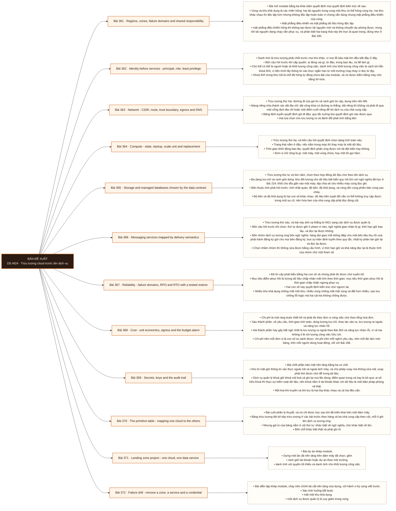

# Mô-đun 24: Trừu tượng cloud trước tên dịch vụ

Module có một quy tắc thứ tự tường minh: gọi tên trừu tượng trước, chọn dịch vụ sau. Với mỗi trừu tượng, có một câu hỏi phải trả lời và một bằng chứng phải đưa ra trước khi được phép nêu tên bất kỳ dịch vụ nào. Chọn một đám mây để thành thạo theo tín hiệu thật từ nơi làm việc hoặc thị trường mục tiêu; hai đám mây còn lại chỉ tới mức ánh xạ trừu tượng. Đa đám mây chỉ ở mức nhận biết cho tới khi một đám mây đã chạy được ở mức sản xuất. Ba thứ được kiểm ở mọi bài và ở cổng: danh tính, ranh giới tin cậy của mạng, và chi phí trên mỗi đơn vị công việc.

## Điều kiện đầu vào

| Mã | Người học có thể | Bằng chứng được chấp nhận |
|---|---|---|
| EN-24-01 | M05 · M06 · M10 · M20 | Bằng chứng hoàn thành điều kiện được nêu trong cột trước |

Nếu chưa có bằng chứng đầu vào, người học phải hoàn thành lại bài hoặc mô-đun được dẫn chiếu trước khi thực hiện phép đánh giá của mô-đun này.

## Đầu ra mô-đun

Gọi tên trừu tượng cần dùng trước khi chọn dịch vụ, rồi triển khai một lát cắt nền tảng trên một đám mây có danh tính, mạng, đường dữ liệu, miền hỏng và ranh giới chi phí

## Tiêu chí hoàn thành

| Mã | Bằng chứng bắt buộc | Ngưỡng đạt | Lỗi loại trực tiếp |
|---|---|---|---|
| EC-24-01 | Không có khoá tĩnh trong kho mã; quyền tối thiểu có lý do và có bằng chứng kiểm toán; phục hồi và chuyển dự phòng đã thử; chi phí hằng tháng cùng ba yếu tố nhạy cảm nhất được nêu ra | ≥ 5/6 tình huống phục hồi trong mục tiêu thời gian, cú sốc chi phí có phương án thiết kế lại kèm số đo trên mỗi đơn vị, và sổ tay được sửa. | Dùng khoá tĩnh hoặc tài khoản cao nhất cho nhanh, mở công khai như một lối tắt, và trừu tượng hoá đa đám mây trước khi một đám mây chạy được |

## Khái niệm và nguyên tắc bất biến

| Mã khái niệm | Ranh giới định nghĩa | Nguyên tắc bất biến hoặc quy tắc quyết định | Bài chính |
|---|---|---|---|
| C24-361 | Bài mở module bằng ba khái niệm quyết định mọi quyết định kiến trúc về sau. | Vùng và khu khả dụng là các miền hỏng: hai tài nguyên trong cùng một khu có thể hỏng cùng lúc, hai khu khác nhau thì độc lập hơn nhưng không độc lập hoàn toàn vì chúng vẫn dùng chung mặt phẳng điều khiển của vùng. | L361 |
| C24-362 | Danh tính là trừu tượng phải chốt trước mọi thứ khác, vì mọi lỗi bảo mật lớn đều bắt đầu ở đây. | Bốn câu hỏi trước khi cấp quyền: ai đóng vai gì, từ đâu, trong bao lâu, và để làm gì. | L362 |
| C24-363 | Trừu tượng thứ hai: đường đi của gói tin và ranh giới tin cậy, dựng trên nền M6. | Mạng riêng chia thành các dải địa chỉ; dải công khai có đường ra thẳng, dải riêng thì không và phải đi qua một cổng dịch địa chỉ hoặc một điểm cuối riêng để tới dịch vụ của nhà cung cấp. | L363 |
| C24-364 | Trừu tượng thứ ba, và bốn câu hỏi quyết định chọn dạng tính toán nào. | Trạng thái nằm ở đâu: nếu nằm trong máy thì thay máy là mất dữ liệu. | L364 |
| C24-365 | Trừu tượng thứ tư và thứ năm, chọn theo hợp đồng dữ liệu chứ theo tên dịch vụ. | Ba dạng lưu trữ và ranh giới dùng: kho đối tượng cho dữ liệu bất biến quy mô lớn với ngữ nghĩa đã học ở Bài 224; khối cho đĩa gắn vào một máy; tệp chia sẻ cho nhiều máy cùng đọc ghi. | L365 |
| C24-366 | Trừu tượng thứ sáu, và bài này ánh xạ thẳng từ M21 sang các dịch vụ được quản lý. | Bốn câu hỏi trước khi chọn: thứ tự được giữ ở phạm vi nào, ngữ nghĩa giao nhận là gì, thời hạn giữ bao lâu, và đọc lại được không. | L366 |
| C24-367 | Độ tin cậy phát biểu bằng hai con số và chúng phải đo được chứ tuyên bố. | Mục tiêu điểm phục hồi là lượng dữ liệu chấp nhận mất tính theo thời gian; mục tiêu thời gian phục hồi là thời gian chấp nhận ngừng phục vụ. | L367 |
| C24-368 | Chi phí là một ràng buộc thiết kế và phải đo theo đơn vị công việc chứ theo tổng hoá đơn. | Sáu thành phần: số yêu cầu, thời gian tính toán, dung lượng lưu trữ, thao tác vào ra, lưu lượng ra ngoài, và năng lực nhàn rỗi. | L368 |
| C24-369 | Bài chốt phần bảo mật nền tảng bằng ba cơ chế. | Kho bí mật giữ thông tin xác thực ngoài mã và ngoài ảnh máy, và cho phép xoay mà không sửa mã; xoay phải thử được chứ để trong tài liệu. | L369 |
| C24-370 | Bài cuối phần lý thuyết, và nó chỉ được học sau khi đã triển khai trên một đám mây. | Bảng trừu tượng liệt kê bảy trừu tượng ở các bài trước theo hàng và ba nhà cung cấp theo cột, mỗi ô ghi tên dịch vụ tương ứng. | L370 |
| C24-371 | Bài dự án khép module. | Dựng một lát cắt nền tảng trên đám mây đã chọn, gồm | L371 |
| C24-372 | Bài diễn tập khép module, chạy trên chính lát cắt nền tảng vừa dựng, với hành vi kỳ vọng viết trước. | Sáu tình huống bắt buộc | L372 |

## Các bài trong mô-đun

| Bài | Dạng | Đầu ra | Bằng chứng | Điều kiện tiên quyết |
|---|---|---|---|---|
| L361 · Regions, zones, failure domains and shared responsibility | LT | Vẽ miền hỏng cho một kiến trúc và chỉ đúng đường kẻ trách nhiệm cho bốn dịch vụ. | Sơ đồ miền hỏng đúng cho kiến trúc bốn thành phần, và phần trách nhiệm khách hàng đúng ở ≥ 3/4 dịch vụ kèm ba khoảng trống tìm được. | M24: M20 |
| L362 · Identity before services - principal, role, least privilege | TH | Cấp quyền tối thiểu cho ba khối lượng công việc bằng danh tính cho khối lượng công việc, có bằng chứng kiểm toán hai chiều. | Ba phép thử được phép thành công và ba phép thử bị từ chối đúng, mỗi quyền có lý do ghi lại, và bộ quét không tìm thấy khoá tĩnh nào. | L361 |
| L363 · Network - CIDR, route, trust boundary, egress and DNS | TH | Dựng mạng có dải riêng không đi ra internet trực tiếp và vẽ được sơ đồ đường đi gói tin có bằng chứng. | Tài nguyên ở dải riêng bị chặn ra internet nhưng gọi được dịch vụ qua điểm cuối riêng, và sơ đồ khớp kết quả truy vết thật. | L362 |
| L364 · Compute - state, startup, scale unit and replacement | TH | Chọn dạng tính toán cho ba khối lượng công việc theo bốn câu hỏi và chứng minh mất một đơn vị không mất dữ liệu. | Đơn vị bị giết được thay thế tự động với thời gian đo được, và không dữ liệu nào nằm lại trên đơn vị đó. | L363 |
| L365 · Storage and managed databases chosen by the data contract | TH | Chọn lưu trữ và cơ sở dữ liệu cho ba hợp đồng dữ liệu và chứng minh khác biệt giữa độ bền với độ khả dụng. | Ba lựa chọn dẫn từ bốn thuộc tính, khôi phục được đối tượng xoá nhầm, và chuyển dự phòng có số đo thời gian gián đoạn. | L364 |
| L366 · Messaging services mapped by delivery semantics | TH | Ánh xạ bốn ngữ nghĩa sang dịch vụ được quản lý và chứng minh bằng diễn tập trùng lặp hoặc mất. | Ngữ nghĩa quan sát được khớp tuyên bố ở cả hai dịch vụ, bốn giới hạn được ghi lại, và một yêu cầu không đáp ứng được chỉ ra. | L365 |
| L367 · Reliability - failure domains, RPO and RTO with a tested restore | TH | Đo được cả hai con số phục hồi bằng một lần phục hồi thật vào môi trường sạch. | Hai con số phục hồi đo được từ một lần phục hồi thật vào môi trường sạch, dữ liệu đối soát khớp, và ba nguyên nhân thất bại được kiểm. | L366 |
| L368 · Cost - unit economics, egress and the budget alarm | TH | Tính chi phí trên mỗi đơn vị cho ba khối lượng công việc và dựng cảnh báo ngân sách trước khi chạy. | Sai lệch giữa ước tính và chi phí thật dưới ngưỡng ở cả ba, chi phí trên mỗi đơn vị tính được, và cảnh báo ngân sách kích hoạt đúng. | L367 |
| L369 · Secrets, keys and the audit trail | TH | Dựng ba cơ chế và chứng minh xoay thông tin xác thực không gián đoạn cùng nhật ký kiểm toán đầy đủ. | Xoay thông tin xác thực không gây gián đoạn, thao tác nhạy cảm truy được trong nhật ký, và ba vi phạm tiêm đều bị chặn. | L368 |
| L370 · The primitive table - mapping one cloud to the others | LT | Lập bảng ánh xạ bảy trừu tượng và ghi được khác biệt ngữ nghĩa chứ chỉ khác biệt tên. | Mỗi hàng có ít nhất một khác biệt ngữ nghĩa cụ thể kèm nguồn và ngày tra, và bốn hàng quan trọng nhất có mô tả thay đổi khi chuyển đám mây. | L369 |
| L371 · Landing zone project - one cloud, one data service | DA | Nộp lát cắt nền tảng dựng lại được từ mã, không có khoá tĩnh, có phục hồi đã thử và chi phí đã đo. | Môi trường dựng lại được từ mã trong môi trường sạch, phục hồi có đối soát khớp, không khoá tĩnh và không tài nguyên mở ngoài ý muốn, và bảng chi phí có ba yếu tố nhạy cảm. | L370 |
| L372 · Failure drill - remove a zone, a service and a credential | TH | Chạy sáu tình huống với hành vi kỳ vọng viết trước và đề xuất thiết kế lại cho cú sốc chi phí. | ≥ 5/6 tình huống phục hồi trong mục tiêu thời gian, cú sốc chi phí có phương án thiết kế lại kèm số đo trên mỗi đơn vị, và sổ tay được sửa. | L371 |

## Nội dung từng bài

> **Sơ đồ đề xuất — DE-M24 v0.1.0.** Mỗi nhánh đi từ một bài học đến các nội dung nguyên tử bắt buộc. Thứ tự dạy lấy từ bảng `Các bài trong mô-đun`.

### Bài 361: Regions, zones, failure domains and shared responsibility

Bài mở module bằng ba khái niệm quyết định mọi quyết định kiến trúc về sau. Vùng và khu khả dụng là các miền hỏng: hai tài nguyên trong cùng một khu có thể hỏng cùng lúc, hai khu khác nhau thì độc lập hơn nhưng không độc lập hoàn toàn vì chúng vẫn dùng chung mặt phẳng điều khiển của vùng. Mặt phẳng điều khiển và mặt phẳng dữ liệu hỏng độc lập: mặt phẳng điều khiển hỏng thì không tạo được tài nguyên mới và không chuyển dự phòng được, trong khi tài nguyên đang chạy vẫn phục vụ, và phân biệt hai trạng thái này khi trực là quan trọng, đúng như ở Bài 330. Trách nhiệm chia sẻ: nhà cung cấp lo phần dưới một đường kẻ, khách hàng lo phần trên, và đường kẻ đó khác nhau giữa dịch vụ tự quản với dịch vụ được quản lý; hiểu sai đường kẻ tạo ra khoảng trống không ai lo, thường là sao lưu, vá lỗi và cấu hình truy cập.

Người học phải vẽ miền hỏng cho một kiến trúc và chỉ đúng đường kẻ trách nhiệm cho bốn dịch vụ. Bằng chứng thực hành: Cho một kiến trúc bốn thành phần; vẽ sơ đồ miền hỏng và chỉ ra thành phần nào cùng chết khi mất một khu khả dụng. Với bốn dịch vụ thuộc bốn mức quản lý khác nhau, liệt kê phần nhà cung cấp lo và phần mình lo. Tìm ba khoảng trống không ai lo trong một kiến trúc thật. Bài hoàn tất khi sơ đồ miền hỏng đúng cho kiến trúc bốn thành phần, và phần trách nhiệm khách hàng đúng ở ≥ 3/4 dịch vụ kèm ba khoảng trống tìm được.

Cách đánh giá: Tầng *hiểu*. Bài mở module, đặt từ vựng. Kiểm bằng bài phân định; đạt khi vẽ đúng miền hỏng và chỉ đúng phần khách hàng phải lo ở ít nhất ba trong bốn dịch vụ.

### Bài 362: Identity before services - principal, role, least privilege

Danh tính là trừu tượng phải chốt trước mọi thứ khác, vì mọi lỗi bảo mật lớn đều bắt đầu ở đây. Bốn câu hỏi trước khi cấp quyền: ai đóng vai gì, từ đâu, trong bao lâu, và để làm gì. Chủ thể có thể là người hoặc là khối lượng công việc; danh tính cho khối lượng công việc là cách bỏ hẳn khoá tĩnh, vì tiến trình lấy thông tin xác thực ngắn hạn từ môi trường chạy thay vì đọc từ tệp. Khoá tĩnh trong kho mã là chế độ hỏng tự động chưa đạt của module, và nó được kiểm bằng máy chứ bằng lời hứa. Chính sách gắn vào danh tính khác chính sách gắn vào tài nguyên, và hai loại giao nhau theo cách phải hiểu để gỡ lỗi từ chối. Quyền tối thiểu đạt được bằng cách bắt đầu từ không có gì rồi thêm theo lỗi từ chối thật, chứ bắt đầu từ ký tự đại diện rồi thu hẹp. Bằng chứng bắt buộc: một phép thử cho thấy bị từ chối và một phép thử cho thấy được phép, cùng bản ghi kiểm toán tương ứng.

Người học phải cấp quyền tối thiểu cho ba khối lượng công việc bằng danh tính cho khối lượng công việc, có bằng chứng kiểm toán hai chiều. Bằng chứng thực hành: Với ba khối lượng công việc, bắt đầu từ chính sách rỗng và thêm quyền theo từng lỗi từ chối thật; ghi lại lý do cho mỗi quyền. Chuyển toàn bộ sang danh tính cho khối lượng công việc và xoá mọi khoá tĩnh. Chạy sáu phép thử hai chiều và đối chiếu với bản ghi kiểm toán. Chạy một bộ quét chặn khoá tĩnh trong kho mã. Bài hoàn tất khi ba phép thử được phép thành công và ba phép thử bị từ chối đúng, mỗi quyền có lý do ghi lại, và bộ quét không tìm thấy khoá tĩnh nào.

Cách đánh giá: Tầng *áp dụng*. Objective có tiêu chí nghiệm thu bằng phép thử hai chiều chứ bằng rà soát chính sách. Kiểm bằng sáu phép thử; đạt khi ba phép thử được phép thành công, ba phép thử bị từ chối đúng, và không khoá tĩnh nào tồn tại trong kho mã.

### Bài 363: Network - CIDR, route, trust boundary, egress and DNS

Trừu tượng thứ hai: đường đi của gói tin và ranh giới tin cậy, dựng trên nền M6. Mạng riêng chia thành các dải địa chỉ; dải công khai có đường ra thẳng, dải riêng thì không và phải đi qua một cổng dịch địa chỉ hoặc một điểm cuối riêng để tới dịch vụ của nhà cung cấp. Bảng định tuyến quyết định gói đi đâu; quy tắc tường lửa quyết định gói nào được qua. Hai lựa chọn cho lưu lượng ra và đánh đổi phải tính bằng tiền: cổng dịch địa chỉ tính phí theo lượng dữ liệu nên nó là nguồn hoá đơn bất ngờ hay gặp, còn điểm cuối riêng giữ lưu lượng trong mạng nhà cung cấp và thường rẻ hơn cùng an toàn hơn. Phân giải tên và cân bằng tải. Nhóm bảo mật mở cho toàn bộ internet là một lối tắt bị cấm, kể cả trong môi trường thử. Bằng chứng bắt buộc của bài là một sơ đồ đường đi gói tin, không phải một sơ đồ hộp.

Người học phải dựng mạng có dải riêng không đi ra internet trực tiếp và vẽ được sơ đồ đường đi gói tin có bằng chứng. Bằng chứng thực hành: Dựng mạng có dải công khai và dải riêng, cổng dịch địa chỉ và ít nhất một điểm cuối riêng. Từ một máy ở dải riêng, thử ra internet trực tiếp và xác nhận bị chặn; thử gọi dịch vụ nhà cung cấp qua điểm cuối riêng và xác nhận thành công. Truy vết đường đi và vẽ sơ đồ. So chi phí ước tính giữa đi qua cổng dịch địa chỉ và đi qua điểm cuối riêng cho một khối lượng cho trước. Bài hoàn tất khi tài nguyên ở dải riêng bị chặn ra internet nhưng gọi được dịch vụ qua điểm cuối riêng, và sơ đồ khớp kết quả truy vết thật.

Cách đánh giá: Tầng *áp dụng*. Objective có tiêu chí nghiệm thu là đường đi thật quan sát được. Kiểm bằng phép thử kết nối; đạt khi tài nguyên ở dải riêng không ra được internet trực tiếp, vẫn gọi được dịch vụ qua điểm cuối riêng, và sơ đồ khớp kết quả truy vết thật.

### Bài 364: Compute - state, startup, scale unit and replacement

Trừu tượng thứ ba, và bốn câu hỏi quyết định chọn dạng tính toán nào. Trạng thái nằm ở đâu: nếu nằm trong máy thì thay máy là mất dữ liệu. Thời gian khởi động bao lâu: quyết định phản ứng được với tải đột biến hay không. Đơn vị mở rộng là gì: một máy, một vùng chứa, hay một lời gọi hàm. Thay thế ra sao khi một đơn vị chết. Ba dạng và điều kiện dùng: máy ảo cho khối lượng công việc cần kiểm soát môi trường; vùng chứa được quản lý cho dịch vụ dài hạn không muốn nuôi cụm; hàm không máy chủ cho việc ngắn theo sự kiện, với ba giới hạn phải biết là thời gian chạy tối đa, khởi động nguội, và trạng thái không giữ được giữa hai lần gọi. Ảnh máy bất biến cộng thay thế thay vì sửa tại chỗ là nguyên tắc chung, và nó là điều kiện để dựng lại được từ mã ở Bài 371.

Người học phải chọn dạng tính toán cho ba khối lượng công việc theo bốn câu hỏi và chứng minh mất một đơn vị không mất dữ liệu. Bằng chứng thực hành: Cho ba khối lượng công việc; trả lời bốn câu hỏi cho từng cái rồi chọn dạng tính toán. Triển khai một cái theo nhóm tự mở rộng dùng ảnh bất biến. Giết một đơn vị và đo thời gian tới khi đơn vị thay thế phục vụ được. Chứng minh không có trạng thái nằm lại trên đơn vị bị giết. Đo khởi động nguội của một hàm không máy chủ. Bài hoàn tất khi đơn vị bị giết được thay thế tự động với thời gian đo được, và không dữ liệu nào nằm lại trên đơn vị đó.

Cách đánh giá: Tầng *áp dụng*. Objective có tiêu chí nghiệm thu bằng diễn tập mất máy. Kiểm bằng phép thử giết; đạt khi dịch vụ tự thay thế đơn vị đã mất và không dữ liệu nào nằm lại trên đơn vị đó.

### Bài 365: Storage and managed databases chosen by the data contract

Trừu tượng thứ tư và thứ năm, chọn theo hợp đồng dữ liệu chứ theo tên dịch vụ. Ba dạng lưu trữ và ranh giới dùng: kho đối tượng cho dữ liệu bất biến quy mô lớn với ngữ nghĩa đã học ở Bài 224; khối cho đĩa gắn vào một máy; tệp chia sẻ cho nhiều máy cùng đọc ghi. Bốn thuộc tính phải hỏi trước: tính nhất quán, độ bền, độ khả dụng, và vòng đời cùng phiên bản cùng sao chép. Độ bền và độ khả dụng là hai con số khác nhau: dữ liệu bền tuyệt đối vẫn có thể không truy cập được trong một sự cố, nên hứa hẹn của nhà cung cấp phải đọc đúng cột. Cơ sở dữ liệu được quản lý chọn theo hợp đồng giao dịch, quy mô, cách chuyển dự phòng và đường kết nối; chuyển dự phòng nhiều khu không thay sao lưu, vì nó nhân bản cả một lệnh xoá nhầm. Đường mạng tới cơ sở dữ liệu và giới hạn số kết nối là hai chỗ hay bị bỏ qua tới khi có tải thật.

Người học phải chọn lưu trữ và cơ sở dữ liệu cho ba hợp đồng dữ liệu và chứng minh khác biệt giữa độ bền với độ khả dụng. Bằng chứng thực hành: Cho ba hợp đồng dữ liệu khác nhau; chọn lưu trữ và cơ sở dữ liệu cho từng cái kèm lý do theo bốn thuộc tính. Bật phiên bản và vòng đời trên kho đối tượng, rồi xoá nhầm một đối tượng và khôi phục. Kích hoạt chuyển dự phòng của cơ sở dữ liệu nhiều khu và đo thời gian gián đoạn cùng số kết nối bị đứt. Bài hoàn tất khi ba lựa chọn dẫn từ bốn thuộc tính, khôi phục được đối tượng xoá nhầm, và chuyển dự phòng có số đo thời gian gián đoạn.

Cách đánh giá: Tầng *đánh giá*. Objective đòi đọc đúng hợp đồng của nhà cung cấp chứ so tên dịch vụ. Kiểm bằng ba lựa chọn cộng một diễn tập; đạt khi mỗi lựa chọn dẫn từ bốn thuộc tính và diễn tập chuyển dự phòng cho số đo gián đoạn thật.

### Bài 366: Messaging services mapped by delivery semantics

Trừu tượng thứ sáu, và bài này ánh xạ thẳng từ M21 sang các dịch vụ được quản lý. Bốn câu hỏi trước khi chọn: thứ tự được giữ ở phạm vi nào, ngữ nghĩa giao nhận là gì, thời hạn giữ bao lâu, và đọc lại được không. Bốn nhóm dịch vụ tương ứng bốn ngữ nghĩa: hàng đợi giao mỗi thông điệp cho một bên tiêu thụ rồi xoá; phát hành đăng ký gửi cho mọi bên đăng ký; bus sự kiện định tuyến theo quy tắc; nhật ký phân tán giữ lại và đọc lại được. Chọn nhầm nhóm thì không sửa được bằng cấu hình, vì thời hạn giữ và khả năng đọc lại là thuộc tính của nhóm chứ một tham số. Giới hạn của dịch vụ được quản lý phải đọc trước: kích thước thông điệp tối đa, số bên tiêu thụ, thời hạn giữ tối đa, và hạn mức tốc độ. Bằng chứng bắt buộc: một diễn tập tạo bản trùng hoặc mất thông điệp, giống Bài 328.

Người học phải ánh xạ bốn ngữ nghĩa sang dịch vụ được quản lý và chứng minh bằng diễn tập trùng lặp hoặc mất. Bằng chứng thực hành: Chọn hai dịch vụ thuộc hai nhóm khác nhau. Với mỗi cái, trả lời bốn câu hỏi bằng tài liệu rồi kiểm bằng thực nghiệm: giết bên tiêu thụ giữa chừng và đếm bản trùng hoặc mất; thử đọc lại từ một thời điểm cũ. Ghi lại bốn giới hạn của dịch vụ. Chỉ ra một yêu cầu mà nhóm đã chọn không đáp ứng được. Bài hoàn tất khi ngữ nghĩa quan sát được khớp tuyên bố ở cả hai dịch vụ, bốn giới hạn được ghi lại, và một yêu cầu không đáp ứng được chỉ ra.

Cách đánh giá: Tầng *áp dụng*. Objective đòi kiểm ngữ nghĩa bằng thực nghiệm chứ đọc tài liệu. Kiểm bằng diễn tập; đạt khi ngữ nghĩa quan sát được khớp ngữ nghĩa đã tuyên bố ở cả hai dịch vụ và giới hạn dịch vụ được ghi lại.

### Bài 367: Reliability - failure domains, RPO and RTO with a tested restore

Độ tin cậy phát biểu bằng hai con số và chúng phải đo được chứ tuyên bố. Mục tiêu điểm phục hồi là lượng dữ liệu chấp nhận mất tính theo thời gian; mục tiêu thời gian phục hồi là thời gian chấp nhận ngừng phục vụ. Hai con số này quyết định kiến trúc chứ ngược lại. Nhiều khu khả dụng chống mất một khu; nhiều vùng chống mất một vùng và đắt hơn nhiều; sao lưu chống lỗi logic mà hai cái kia không chống được. Một bản sao lưu chưa được phục hồi thử thì không phải bản sao lưu, và ba nguyên nhân làm phục hồi thất bại dù bản sao lưu tồn tại là thiếu quyền, thiếu khoá mã hoá, và bản sao lưu nằm trong cùng tài khoản đã bị xoá. Hạn mức và phụ thuộc bên ngoài là miền hỏng thứ tư hay bị quên: hết hạn mức thì không tạo được tài nguyên thay thế giữa lúc sự cố.

Người học phải đo được cả hai con số phục hồi bằng một lần phục hồi thật vào môi trường sạch. Bằng chứng thực hành: Đặt mục tiêu hai con số cho một dịch vụ. Tạo sao lưu và phục hồi vào một tài khoản hoặc dự án sạch; bấm giờ và đối soát dữ liệu. Kiểm ba nguyên nhân thất bại bằng cách thử phục hồi khi thiếu quyền và khi thiếu khoá. Mất một khu khả dụng có kiểm soát và đo lại. Kiểm hạn mức còn đủ để tạo tài nguyên thay thế. Bài hoàn tất khi hai con số phục hồi đo được từ một lần phục hồi thật vào môi trường sạch, dữ liệu đối soát khớp, và ba nguyên nhân thất bại được kiểm.

Cách đánh giá: Tầng *áp dụng*. Objective có tiêu chí nghiệm thu là số đo từ một lần phục hồi thật, không phải một kế hoạch. Kiểm bằng diễn tập phục hồi; đạt khi hai con số đo được, dữ liệu sau phục hồi đối soát khớp, và ba nguyên nhân thất bại được kiểm tường minh.

### Bài 368: Cost - unit economics, egress and the budget alarm

Chi phí là một ràng buộc thiết kế và phải đo theo đơn vị công việc chứ theo tổng hoá đơn. Sáu thành phần: số yêu cầu, thời gian tính toán, dung lượng lưu trữ, thao tác vào ra, lưu lượng ra ngoài, và năng lực nhàn rỗi. Hai thành phần hay gây bất ngờ nhất là lưu lượng ra ngoài theo Bài 363 và năng lực nhàn rỗi, vì cả hai không tỉ lệ với lượng công việc hữu ích. Chi phí trên mỗi đơn vị là con số so sánh được: chi phí trên mỗi nghìn yêu cầu, trên mỗi lần làm mới bảng, trên mỗi người dùng hoạt động, nối với Bài 198. Gắn thẻ tài nguyên là điều kiện để quy chi phí về đội và về sản phẩm; không gắn thẻ thì không quy được và không ai chịu trách nhiệm. Cảnh báo ngân sách phải đặt trước khi chạy khối lượng công việc mới, không phải sau khi nhận hoá đơn. Cam kết dài hạn chỉ hợp lý sau khi đã có dữ liệu sử dụng ổn định.

Người học phải tính chi phí trên mỗi đơn vị cho ba khối lượng công việc và dựng cảnh báo ngân sách trước khi chạy. Bằng chứng thực hành: Với ba khối lượng công việc, ước tính sáu thành phần chi phí trước khi chạy. Gắn thẻ mọi tài nguyên. Chạy một chu kỳ rồi đối chiếu ước tính với chi phí thật và giải thích chênh lệch. Tính chi phí trên mỗi đơn vị cho từng cái. Dựng cảnh báo ngân sách và kích hoạt nó bằng một khối lượng thử. Xác định ba yếu tố nhạy cảm nhất. Bài hoàn tất khi sai lệch giữa ước tính và chi phí thật dưới ngưỡng ở cả ba, chi phí trên mỗi đơn vị tính được, và cảnh báo ngân sách kích hoạt đúng.

Cách đánh giá: Tầng *áp dụng*. Objective đòi nối chi phí với đơn vị công việc chứ đọc tổng hoá đơn. Kiểm bằng đối chiếu ước tính với hoá đơn thật; đạt khi sai lệch dưới ngưỡng thoả thuận ở cả ba và cảnh báo ngân sách kích hoạt đúng ngưỡng.

### Bài 369: Secrets, keys and the audit trail

Bài chốt phần bảo mật nền tảng bằng ba cơ chế. Kho bí mật giữ thông tin xác thực ngoài mã và ngoài ảnh máy, và cho phép xoay mà không sửa mã; xoay phải thử được chứ để trong tài liệu. Dịch vụ quản lý khoá giữ khoá mã hoá và ghi lại mọi lần dùng; điểm quan trọng và hay bị bỏ qua: ai sở hữu khoá thì thực sự kiểm soát dữ liệu, nên khoá nằm ở tài khoản khác với dữ liệu là một biện pháp phòng vệ thật. Mã hoá khi truyền và khi lưu là hai lớp khác nhau và cả hai đều cần. Nhật ký kiểm toán ghi ai làm gì lúc nào; nó chỉ có giá trị nếu được giữ ở nơi mà kẻ tấn công không xoá được, nên tách tài khoản lưu nhật ký là thực hành chuẩn. Ba phép kiểm tự động phải chạy trong tích hợp liên tục: không có khoá tĩnh, không có tài nguyên mở công khai ngoài ý muốn, và không có chính sách dùng ký tự đại diện.

Người học phải dựng ba cơ chế và chứng minh xoay thông tin xác thực không gián đoạn cùng nhật ký kiểm toán đầy đủ. Bằng chứng thực hành: Chuyển toàn bộ thông tin xác thực sang kho bí mật. Thực hiện một lần xoay khi dịch vụ đang chạy và đo gián đoạn. Mã hoá một tập dữ liệu bằng khoá do mình quản lý; thu hồi quyền dùng khoá và chứng minh dữ liệu không đọc được. Tách tài khoản lưu nhật ký. Tiêm ba vi phạm và xác nhận ba phép kiểm tự động chặn được. Bài hoàn tất khi xoay thông tin xác thực không gây gián đoạn, thao tác nhạy cảm truy được trong nhật ký, và ba vi phạm tiêm đều bị chặn.

Cách đánh giá: Tầng *áp dụng*. Objective có tiêu chí nghiệm thu là xoay thật và truy vết thật. Kiểm bằng phép thử xoay cộng truy vết; đạt khi xoay không gây gián đoạn, mọi thao tác nhạy cảm truy được trong nhật ký, và ba phép kiểm tự động chặn đúng vi phạm tiêm.

### Bài 370: The primitive table - mapping one cloud to the others

Bài cuối phần lý thuyết, và nó chỉ được học sau khi đã triển khai trên một đám mây. Bảng trừu tượng liệt kê bảy trừu tượng ở các bài trước theo hàng và ba nhà cung cấp theo cột, mỗi ô ghi tên dịch vụ tương ứng. Nhưng giá trị của bảng nằm ở cột thứ tư: khác biệt về ngữ nghĩa, chứ khác biệt về tên. Bốn chỗ khác biệt thật và phải ghi rõ: mô hình danh tính và cách chính sách giao nhau; mô hình mạng và cách lưu lượng ra được tính tiền; sự kiện của kho đối tượng có bảo đảm gì về thứ tự và về giao nhận; và cơ sở dữ liệu được quản lý khác nhau ở cách chuyển dự phòng cùng giới hạn kết nối. Cảnh báo về trừu tượng hoá sớm: xây một lớp trừu tượng chung cho nhiều đám mây trước khi một đám mây chạy được là cách chắc chắn có một lớp sai ở cả hai phía.

Người học phải lập bảng ánh xạ bảy trừu tượng và ghi được khác biệt ngữ nghĩa chứ chỉ khác biệt tên. Bằng chứng thực hành: Lập bảng bảy trừu tượng nhân ba nhà cung cấp. Với bốn hàng quan trọng nhất, tra tài liệu chính thức và ghi khác biệt ngữ nghĩa cụ thể kèm ngày tra. Chọn một kiến trúc đã dựng và mô tả nó phải đổi gì nếu chuyển sang đám mây khác. Viết hai câu nêu vì sao chưa nên xây lớp trừu tượng chung lúc này. Bài hoàn tất khi mỗi hàng có ít nhất một khác biệt ngữ nghĩa cụ thể kèm nguồn và ngày tra, và bốn hàng quan trọng nhất có mô tả thay đổi khi chuyển đám mây.

Cách đánh giá: Tầng *hiểu*. Bài lý thuyết đặt sau khi đã triển khai, đúng thứ tự của hợp đồng nguồn. Kiểm bằng bảng ánh xạ; đạt khi mỗi hàng có ít nhất một khác biệt ngữ nghĩa cụ thể chứ chỉ tên dịch vụ.

### Bài 371: Landing zone project - one cloud, one data service

Bài dự án khép module. Dựng một lát cắt nền tảng trên đám mây đã chọn, gồm: ranh giới tài khoản hoặc dự án theo môi trường; danh tính với quyền tối thiểu và danh tính cho khối lượng công việc; mạng có dải riêng, đường ra được kiểm soát và ít nhất một điểm cuối riêng; một dịch vụ dữ liệu gồm giao diện lập trình, cơ sở dữ liệu và một đường xử lý ghi ra kho đối tượng; bí mật và khoá theo Bài 369; nhật ký, số đo và nhật ký kiểm toán; sao lưu cùng một lần phục hồi đã thử; và gắn thẻ cùng cảnh báo ngân sách. Toàn bộ phải dựng bằng mã theo M25, để dựng lại được từ đầu. Nộp kèm sơ đồ kiến trúc có đủ năm thứ: danh tính, mạng, đường dữ liệu, miền hỏng và ranh giới chi phí; và một bảng chi phí hằng tháng kèm ba yếu tố nhạy cảm nhất.

Người học phải nộp lát cắt nền tảng dựng lại được từ mã, không có khoá tĩnh, có phục hồi đã thử và chi phí đã đo. Bằng chứng thực hành: Dựng lát cắt nền tảng đầy đủ bằng mã. Xoá sạch môi trường rồi dựng lại từ đầu chỉ bằng mã và sao lưu; bấm giờ. Chạy bộ quét bảo mật ba phép kiểm. Phục hồi dữ liệu và đối soát. Nộp sơ đồ năm thứ và bảng chi phí hằng tháng kèm ba yếu tố nhạy cảm. Bài hoàn tất khi môi trường dựng lại được từ mã trong môi trường sạch, phục hồi có đối soát khớp, không khoá tĩnh và không tài nguyên mở ngoài ý muốn, và bảng chi phí có ba yếu tố nhạy cảm.

Cách đánh giá: Tầng *sáng tạo*. Bài tổng hợp toàn module. Kiểm bằng dựng lại từ đầu cộng rà soát bằng chứng; đạt khi môi trường dựng lại được từ mã trong môi trường sạch, phục hồi thành công với đối soát, và không có khoá tĩnh hay tài nguyên mở công khai ngoài ý muốn.

### Bài 372: Failure drill - remove a zone, a service and a credential

Bài diễn tập khép module, chạy trên chính lát cắt nền tảng vừa dựng, với hành vi kỳ vọng viết trước. Sáu tình huống bắt buộc: mất một khu khả dụng; một dịch vụ được quản lý bị suy giảm trong vùng; mặt phẳng điều khiển không dùng được nên không tạo được tài nguyên mới; thông tin xác thực hết hạn giữa lúc chạy; chạm hạn mức của một dịch vụ; và một cú sốc chi phí do lượng quét hoặc lưu lượng ra tăng gấp mười. Với mỗi tình huống ghi ba số: thời gian phát hiện, mức suy giảm dịch vụ, và thời gian phục hồi. Tình huống cú sốc chi phí phải trả lời bằng thiết kế lại có số đo trên mỗi đơn vị, chứ bằng việc tắt bớt tính năng. Kết quả diễn tập là đầu vào sửa sổ tay vận hành và sửa kiến trúc, theo đúng kỷ luật ở Bài 246.

Người học phải chạy sáu tình huống với hành vi kỳ vọng viết trước và đề xuất thiết kế lại cho cú sốc chi phí. Bằng chứng thực hành: Viết hành vi kỳ vọng cho sáu tình huống trước khi chạy. Chạy từng cái trên lát cắt nền tảng. Ghi ba số cho mỗi tình huống. Với tình huống hạn mức, chứng minh cảnh báo nổ trước khi chạm trần. Với cú sốc chi phí, tính lại chi phí trên mỗi đơn vị và đề xuất thiết kế lại. Sửa sổ tay vận hành theo chênh lệch quan sát được. Bài hoàn tất khi ≥ 5/6 tình huống phục hồi trong mục tiêu thời gian, cú sốc chi phí có phương án thiết kế lại kèm số đo trên mỗi đơn vị, và sổ tay được sửa.

Cách đánh giá: Tầng *đánh giá*. Objective đo năng lực vận hành dưới sự cố cùng dưới ràng buộc chi phí. Kiểm bằng sáu tình huống; đạt khi ít nhất năm phục hồi trong mục tiêu thời gian đã đặt và cú sốc chi phí có phương án thiết kế lại kèm số đo trên mỗi đơn vị.

## Lý do sắp xếp

Mô-đun bắt đầu từ `M24: M20` và đi theo các quan hệ tiên quyết đã ghi trong bảng. Mỗi bài chỉ sử dụng khái niệm hoặc thao tác đã được giới thiệu trước đó; bài cuối L372 tích hợp đầu ra của toàn mô-đun.

## Ma trận đánh giá

| Mã đầu ra | Mức độ tư duy | Cách đánh giá | Ngưỡng đạt | Hình thức kiểm tra lại |
|---|---|---|---|---|
| L361 | Hiểu | Tầng *hiểu*. Bài mở module, đặt từ vựng. Kiểm bằng bài phân định; đạt khi vẽ đúng miền hỏng và chỉ đúng phần khách hàng phải lo ở ít nhất ba trong bốn dịch vụ. | Sơ đồ miền hỏng đúng cho kiến trúc bốn thành phần, và phần trách nhiệm khách hàng đúng ở ≥ 3/4 dịch vụ kèm ba khoảng trống tìm được. | Tình huống mới, giữ nguyên đầu ra và ngưỡng |
| L362 | Áp dụng | Tầng *áp dụng*. Objective có tiêu chí nghiệm thu bằng phép thử hai chiều chứ bằng rà soát chính sách. Kiểm bằng sáu phép thử; đạt khi ba phép thử được phép thành công, ba phép thử bị từ chối đúng, và không khoá tĩnh nào tồn tại trong kho mã. | Ba phép thử được phép thành công và ba phép thử bị từ chối đúng, mỗi quyền có lý do ghi lại, và bộ quét không tìm thấy khoá tĩnh nào. | Tình huống mới, giữ nguyên đầu ra và ngưỡng |
| L363 | Áp dụng | Tầng *áp dụng*. Objective có tiêu chí nghiệm thu là đường đi thật quan sát được. Kiểm bằng phép thử kết nối; đạt khi tài nguyên ở dải riêng không ra được internet trực tiếp, vẫn gọi được dịch vụ qua điểm cuối riêng, và sơ đồ khớp kết quả truy vết thật. | Tài nguyên ở dải riêng bị chặn ra internet nhưng gọi được dịch vụ qua điểm cuối riêng, và sơ đồ khớp kết quả truy vết thật. | Tình huống mới, giữ nguyên đầu ra và ngưỡng |
| L364 | Áp dụng | Tầng *áp dụng*. Objective có tiêu chí nghiệm thu bằng diễn tập mất máy. Kiểm bằng phép thử giết; đạt khi dịch vụ tự thay thế đơn vị đã mất và không dữ liệu nào nằm lại trên đơn vị đó. | Đơn vị bị giết được thay thế tự động với thời gian đo được, và không dữ liệu nào nằm lại trên đơn vị đó. | Tình huống mới, giữ nguyên đầu ra và ngưỡng |
| L365 | Đánh giá | Tầng *đánh giá*. Objective đòi đọc đúng hợp đồng của nhà cung cấp chứ so tên dịch vụ. Kiểm bằng ba lựa chọn cộng một diễn tập; đạt khi mỗi lựa chọn dẫn từ bốn thuộc tính và diễn tập chuyển dự phòng cho số đo gián đoạn thật. | Ba lựa chọn dẫn từ bốn thuộc tính, khôi phục được đối tượng xoá nhầm, và chuyển dự phòng có số đo thời gian gián đoạn. | Tình huống mới, giữ nguyên đầu ra và ngưỡng |
| L366 | Áp dụng | Tầng *áp dụng*. Objective đòi kiểm ngữ nghĩa bằng thực nghiệm chứ đọc tài liệu. Kiểm bằng diễn tập; đạt khi ngữ nghĩa quan sát được khớp ngữ nghĩa đã tuyên bố ở cả hai dịch vụ và giới hạn dịch vụ được ghi lại. | Ngữ nghĩa quan sát được khớp tuyên bố ở cả hai dịch vụ, bốn giới hạn được ghi lại, và một yêu cầu không đáp ứng được chỉ ra. | Tình huống mới, giữ nguyên đầu ra và ngưỡng |
| L367 | Áp dụng | Tầng *áp dụng*. Objective có tiêu chí nghiệm thu là số đo từ một lần phục hồi thật, không phải một kế hoạch. Kiểm bằng diễn tập phục hồi; đạt khi hai con số đo được, dữ liệu sau phục hồi đối soát khớp, và ba nguyên nhân thất bại được kiểm tường minh. | Hai con số phục hồi đo được từ một lần phục hồi thật vào môi trường sạch, dữ liệu đối soát khớp, và ba nguyên nhân thất bại được kiểm. | Tình huống mới, giữ nguyên đầu ra và ngưỡng |
| L368 | Áp dụng | Tầng *áp dụng*. Objective đòi nối chi phí với đơn vị công việc chứ đọc tổng hoá đơn. Kiểm bằng đối chiếu ước tính với hoá đơn thật; đạt khi sai lệch dưới ngưỡng thoả thuận ở cả ba và cảnh báo ngân sách kích hoạt đúng ngưỡng. | Sai lệch giữa ước tính và chi phí thật dưới ngưỡng ở cả ba, chi phí trên mỗi đơn vị tính được, và cảnh báo ngân sách kích hoạt đúng. | Tình huống mới, giữ nguyên đầu ra và ngưỡng |
| L369 | Áp dụng | Tầng *áp dụng*. Objective có tiêu chí nghiệm thu là xoay thật và truy vết thật. Kiểm bằng phép thử xoay cộng truy vết; đạt khi xoay không gây gián đoạn, mọi thao tác nhạy cảm truy được trong nhật ký, và ba phép kiểm tự động chặn đúng vi phạm tiêm. | Xoay thông tin xác thực không gây gián đoạn, thao tác nhạy cảm truy được trong nhật ký, và ba vi phạm tiêm đều bị chặn. | Tình huống mới, giữ nguyên đầu ra và ngưỡng |
| L370 | Hiểu | Tầng *hiểu*. Bài lý thuyết đặt sau khi đã triển khai, đúng thứ tự của hợp đồng nguồn. Kiểm bằng bảng ánh xạ; đạt khi mỗi hàng có ít nhất một khác biệt ngữ nghĩa cụ thể chứ chỉ tên dịch vụ. | Mỗi hàng có ít nhất một khác biệt ngữ nghĩa cụ thể kèm nguồn và ngày tra, và bốn hàng quan trọng nhất có mô tả thay đổi khi chuyển đám mây. | Tình huống mới, giữ nguyên đầu ra và ngưỡng |
| L371 | Sáng tạo | Tầng *sáng tạo*. Bài tổng hợp toàn module. Kiểm bằng dựng lại từ đầu cộng rà soát bằng chứng; đạt khi môi trường dựng lại được từ mã trong môi trường sạch, phục hồi thành công với đối soát, và không có khoá tĩnh hay tài nguyên mở công khai ngoài ý muốn. | Môi trường dựng lại được từ mã trong môi trường sạch, phục hồi có đối soát khớp, không khoá tĩnh và không tài nguyên mở ngoài ý muốn, và bảng chi phí có ba yếu tố nhạy cảm. | Tình huống mới, giữ nguyên đầu ra và ngưỡng |
| L372 | Đánh giá | Tầng *đánh giá*. Objective đo năng lực vận hành dưới sự cố cùng dưới ràng buộc chi phí. Kiểm bằng sáu tình huống; đạt khi ít nhất năm phục hồi trong mục tiêu thời gian đã đặt và cú sốc chi phí có phương án thiết kế lại kèm số đo trên mỗi đơn vị. | ≥ 5/6 tình huống phục hồi trong mục tiêu thời gian, cú sốc chi phí có phương án thiết kế lại kèm số đo trên mỗi đơn vị, và sổ tay được sửa. | Tình huống mới, giữ nguyên đầu ra và ngưỡng |

Không cộng điểm để bù cho lỗi loại trực tiếp. Người học phải sửa đúng lỗi, nộp lại bằng chứng và thực hiện kiểm tra lại trên một tình huống khác.

## Bài thực hành bắt buộc

| Bài thực hành hoặc dự án | Bài liên quan | Sản phẩm bắt buộc | Lỗi được cài vào tình huống |
|---|---|---|---|
| Regions, zones, failure domains and shared responsibility | L361 | Cho một kiến trúc bốn thành phần; vẽ sơ đồ miền hỏng và chỉ ra thành phần nào cùng chết khi mất một khu khả dụng. Với bốn dịch vụ thuộc bốn mức quản lý khác nhau, liệt kê phần nhà cung cấp lo và phần mình lo. Tìm ba khoảng trống không ai lo trong một kiến trúc thật. | Giả định dịch vụ được quản lý thì không cần sao lưu · coi nhiều khu khả dụng là thay được sao lưu · nhầm sự cố mặt phẳng điều khiển với sự cố mặt phẳng dữ liệu · vẽ kiến trúc mà không đánh dấu miền hỏng. |
| Identity before services - principal, role, least privilege | L362 | Với ba khối lượng công việc, bắt đầu từ chính sách rỗng và thêm quyền theo từng lỗi từ chối thật; ghi lại lý do cho mỗi quyền. Chuyển toàn bộ sang danh tính cho khối lượng công việc và xoá mọi khoá tĩnh. Chạy sáu phép thử hai chiều và đối chiếu với bản ghi kiểm toán. Chạy một bộ quét chặn khoá tĩnh trong kho mã. | Bắt đầu bằng ký tự đại diện rồi định thu hẹp sau · dùng tài khoản cao nhất cho việc thường ngày · để khoá tĩnh trong biến môi trường của kho mã · không chạy phép thử bị từ chối. |
| Network - CIDR, route, trust boundary, egress and DNS | L363 | Dựng mạng có dải công khai và dải riêng, cổng dịch địa chỉ và ít nhất một điểm cuối riêng. Từ một máy ở dải riêng, thử ra internet trực tiếp và xác nhận bị chặn; thử gọi dịch vụ nhà cung cấp qua điểm cuối riêng và xác nhận thành công. Truy vết đường đi và vẽ sơ đồ. So chi phí ước tính giữa đi qua cổng dịch địa chỉ và đi qua điểm cuối riêng cho một khối lượng cho trước. | Mở quy tắc cho toàn bộ internet để gỡ lỗi nhanh · đặt mọi thứ ở dải công khai · bỏ qua chi phí lưu lượng qua cổng dịch địa chỉ · vẽ sơ đồ hộp thay vì sơ đồ đường đi gói tin. |
| Compute - state, startup, scale unit and replacement | L364 | Cho ba khối lượng công việc; trả lời bốn câu hỏi cho từng cái rồi chọn dạng tính toán. Triển khai một cái theo nhóm tự mở rộng dùng ảnh bất biến. Giết một đơn vị và đo thời gian tới khi đơn vị thay thế phục vụ được. Chứng minh không có trạng thái nằm lại trên đơn vị bị giết. Đo khởi động nguội của một hàm không máy chủ. | Lưu trạng thái trên đĩa cục bộ của máy tự mở rộng · sửa cấu hình trên máy đang chạy thay vì dựng ảnh mới · chọn hàm không máy chủ cho việc chạy dài · bỏ qua khởi động nguội khi hứa độ trễ. |
| Storage and managed databases chosen by the data contract | L365 | Cho ba hợp đồng dữ liệu khác nhau; chọn lưu trữ và cơ sở dữ liệu cho từng cái kèm lý do theo bốn thuộc tính. Bật phiên bản và vòng đời trên kho đối tượng, rồi xoá nhầm một đối tượng và khôi phục. Kích hoạt chuyển dự phòng của cơ sở dữ liệu nhiều khu và đo thời gian gián đoạn cùng số kết nối bị đứt. | Coi nhiều khu là đã có sao lưu · đọc nhầm độ bền thành độ khả dụng · bỏ qua giới hạn số kết nối tới cơ sở dữ liệu · chọn dịch vụ theo tên rồi ép hợp đồng dữ liệu vào nó. |
| Messaging services mapped by delivery semantics | L366 | Chọn hai dịch vụ thuộc hai nhóm khác nhau. Với mỗi cái, trả lời bốn câu hỏi bằng tài liệu rồi kiểm bằng thực nghiệm: giết bên tiêu thụ giữa chừng và đếm bản trùng hoặc mất; thử đọc lại từ một thời điểm cũ. Ghi lại bốn giới hạn của dịch vụ. Chỉ ra một yêu cầu mà nhóm đã chọn không đáp ứng được. | Chọn hàng đợi rồi cần đọc lại · tin ngữ nghĩa theo tài liệu mà không kiểm · bỏ qua giới hạn kích thước thông điệp · coi dịch vụ được quản lý là miễn trừ khỏi việc khử trùng. |
| Reliability - failure domains, RPO and RTO with a tested restore | L367 | Đặt mục tiêu hai con số cho một dịch vụ. Tạo sao lưu và phục hồi vào một tài khoản hoặc dự án sạch; bấm giờ và đối soát dữ liệu. Kiểm ba nguyên nhân thất bại bằng cách thử phục hồi khi thiếu quyền và khi thiếu khoá. Mất một khu khả dụng có kiểm soát và đo lại. Kiểm hạn mức còn đủ để tạo tài nguyên thay thế. | Coi có lịch sao lưu là có khả năng phục hồi · phục hồi vào chính môi trường cũ nên không kiểm được phụ thuộc · để sao lưu cùng tài khoản với dữ liệu gốc · bỏ qua hạn mức khi lập kế hoạch phục hồi. |
| Cost - unit economics, egress and the budget alarm | L368 | Với ba khối lượng công việc, ước tính sáu thành phần chi phí trước khi chạy. Gắn thẻ mọi tài nguyên. Chạy một chu kỳ rồi đối chiếu ước tính với chi phí thật và giải thích chênh lệch. Tính chi phí trên mỗi đơn vị cho từng cái. Dựng cảnh báo ngân sách và kích hoạt nó bằng một khối lượng thử. Xác định ba yếu tố nhạy cảm nhất. | Đọc tổng hoá đơn mà không quy về đơn vị công việc · bỏ lưu lượng ra ngoài khỏi ước tính · không gắn thẻ nên không quy được chi phí · cam kết dài hạn trước khi có dữ liệu sử dụng. |
| Secrets, keys and the audit trail | L369 | Chuyển toàn bộ thông tin xác thực sang kho bí mật. Thực hiện một lần xoay khi dịch vụ đang chạy và đo gián đoạn. Mã hoá một tập dữ liệu bằng khoá do mình quản lý; thu hồi quyền dùng khoá và chứng minh dữ liệu không đọc được. Tách tài khoản lưu nhật ký. Tiêm ba vi phạm và xác nhận ba phép kiểm tự động chặn được. | Xoay bằng cách dừng dịch vụ · để khoá mã hoá cùng tài khoản với dữ liệu · lưu nhật ký kiểm toán trong chính tài khoản bị kiểm · coi mã hoá khi lưu là đủ khi thiếu kiểm soát khoá. |
| The primitive table - mapping one cloud to the others | L370 | Lập bảng bảy trừu tượng nhân ba nhà cung cấp. Với bốn hàng quan trọng nhất, tra tài liệu chính thức và ghi khác biệt ngữ nghĩa cụ thể kèm ngày tra. Chọn một kiến trúc đã dựng và mô tả nó phải đổi gì nếu chuyển sang đám mây khác. Viết hai câu nêu vì sao chưa nên xây lớp trừu tượng chung lúc này. | Lập bảng chỉ ghi tên dịch vụ · kết luận hai dịch vụ tương đương vì cùng loại · học ba đám mây song song · xây lớp trừu tượng chung trước khi một đám mây chạy được. |
| Landing zone project - one cloud, one data service | L371 | Dựng lát cắt nền tảng đầy đủ bằng mã. Xoá sạch môi trường rồi dựng lại từ đầu chỉ bằng mã và sao lưu; bấm giờ. Chạy bộ quét bảo mật ba phép kiểm. Phục hồi dữ liệu và đối soát. Nộp sơ đồ năm thứ và bảng chi phí hằng tháng kèm ba yếu tố nhạy cảm. | Tạo tài nguyên bằng tay rồi ghi lại vào mã sau · mở công khai một kho đối tượng cho tiện · bỏ bước dựng lại từ đầu vì tốn thời gian · nộp sơ đồ hộp không có miền hỏng và ranh giới chi phí. |
| Failure drill - remove a zone, a service and a credential | L372 | Viết hành vi kỳ vọng cho sáu tình huống trước khi chạy. Chạy từng cái trên lát cắt nền tảng. Ghi ba số cho mỗi tình huống. Với tình huống hạn mức, chứng minh cảnh báo nổ trước khi chạm trần. Với cú sốc chi phí, tính lại chi phí trên mỗi đơn vị và đề xuất thiết kế lại. Sửa sổ tay vận hành theo chênh lệch quan sát được. | Viết hành vi kỳ vọng sau khi thấy kết quả · xử lý cú sốc chi phí bằng cách tắt tính năng · bỏ tình huống mặt phẳng điều khiển vì khó dựng · không đo mức suy giảm mà chỉ đo phục hồi. |

## Ngộ nhận và lỗi loại trực tiếp

| Lỗi | Hệ quả | Nơi phát hiện | Cách khắc phục |
|---|---|---|---|
| Giả định dịch vụ được quản lý thì không cần sao lưu · coi nhiều khu khả dụng là thay được sao lưu · nhầm sự cố mặt phẳng điều khiển với sự cố mặt phẳng dữ liệu · vẽ kiến trúc mà không đánh dấu miền hỏng. | Không tạo được bằng chứng hợp lệ cho đầu ra L361 | L361 | Làm lại phép đánh giá trên tình huống mới và đạt tiêu chí `Done when` |
| Bắt đầu bằng ký tự đại diện rồi định thu hẹp sau · dùng tài khoản cao nhất cho việc thường ngày · để khoá tĩnh trong biến môi trường của kho mã · không chạy phép thử bị từ chối. | Không tạo được bằng chứng hợp lệ cho đầu ra L362 | L362 | Làm lại phép đánh giá trên tình huống mới và đạt tiêu chí `Done when` |
| Mở quy tắc cho toàn bộ internet để gỡ lỗi nhanh · đặt mọi thứ ở dải công khai · bỏ qua chi phí lưu lượng qua cổng dịch địa chỉ · vẽ sơ đồ hộp thay vì sơ đồ đường đi gói tin. | Không tạo được bằng chứng hợp lệ cho đầu ra L363 | L363 | Làm lại phép đánh giá trên tình huống mới và đạt tiêu chí `Done when` |
| Lưu trạng thái trên đĩa cục bộ của máy tự mở rộng · sửa cấu hình trên máy đang chạy thay vì dựng ảnh mới · chọn hàm không máy chủ cho việc chạy dài · bỏ qua khởi động nguội khi hứa độ trễ. | Không tạo được bằng chứng hợp lệ cho đầu ra L364 | L364 | Làm lại phép đánh giá trên tình huống mới và đạt tiêu chí `Done when` |
| Coi nhiều khu là đã có sao lưu · đọc nhầm độ bền thành độ khả dụng · bỏ qua giới hạn số kết nối tới cơ sở dữ liệu · chọn dịch vụ theo tên rồi ép hợp đồng dữ liệu vào nó. | Không tạo được bằng chứng hợp lệ cho đầu ra L365 | L365 | Làm lại phép đánh giá trên tình huống mới và đạt tiêu chí `Done when` |
| Chọn hàng đợi rồi cần đọc lại · tin ngữ nghĩa theo tài liệu mà không kiểm · bỏ qua giới hạn kích thước thông điệp · coi dịch vụ được quản lý là miễn trừ khỏi việc khử trùng. | Không tạo được bằng chứng hợp lệ cho đầu ra L366 | L366 | Làm lại phép đánh giá trên tình huống mới và đạt tiêu chí `Done when` |
| Coi có lịch sao lưu là có khả năng phục hồi · phục hồi vào chính môi trường cũ nên không kiểm được phụ thuộc · để sao lưu cùng tài khoản với dữ liệu gốc · bỏ qua hạn mức khi lập kế hoạch phục hồi. | Không tạo được bằng chứng hợp lệ cho đầu ra L367 | L367 | Làm lại phép đánh giá trên tình huống mới và đạt tiêu chí `Done when` |
| Đọc tổng hoá đơn mà không quy về đơn vị công việc · bỏ lưu lượng ra ngoài khỏi ước tính · không gắn thẻ nên không quy được chi phí · cam kết dài hạn trước khi có dữ liệu sử dụng. | Không tạo được bằng chứng hợp lệ cho đầu ra L368 | L368 | Làm lại phép đánh giá trên tình huống mới và đạt tiêu chí `Done when` |
| Xoay bằng cách dừng dịch vụ · để khoá mã hoá cùng tài khoản với dữ liệu · lưu nhật ký kiểm toán trong chính tài khoản bị kiểm · coi mã hoá khi lưu là đủ khi thiếu kiểm soát khoá. | Không tạo được bằng chứng hợp lệ cho đầu ra L369 | L369 | Làm lại phép đánh giá trên tình huống mới và đạt tiêu chí `Done when` |
| Lập bảng chỉ ghi tên dịch vụ · kết luận hai dịch vụ tương đương vì cùng loại · học ba đám mây song song · xây lớp trừu tượng chung trước khi một đám mây chạy được. | Không tạo được bằng chứng hợp lệ cho đầu ra L370 | L370 | Làm lại phép đánh giá trên tình huống mới và đạt tiêu chí `Done when` |
| Tạo tài nguyên bằng tay rồi ghi lại vào mã sau · mở công khai một kho đối tượng cho tiện · bỏ bước dựng lại từ đầu vì tốn thời gian · nộp sơ đồ hộp không có miền hỏng và ranh giới chi phí. | Không tạo được bằng chứng hợp lệ cho đầu ra L371 | L371 | Làm lại phép đánh giá trên tình huống mới và đạt tiêu chí `Done when` |
| Viết hành vi kỳ vọng sau khi thấy kết quả · xử lý cú sốc chi phí bằng cách tắt tính năng · bỏ tình huống mặt phẳng điều khiển vì khó dựng · không đo mức suy giảm mà chỉ đo phục hồi. | Không tạo được bằng chứng hợp lệ cho đầu ra L372 | L372 | Làm lại phép đánh giá trên tình huống mới và đạt tiêu chí `Done when` |

## Điểm nối với mô-đun khác

| Kế thừa từ | Cung cấp cho mô-đun sau | Cam kết đầu ra |
|---|---|---|
| M05 · M06 · M10 · M20 | M06, M20, M21, M25 | Gọi tên trừu tượng cần dùng trước khi chọn dịch vụ, rồi triển khai một lát cắt nền tảng trên một đám mây có danh tính, mạng, đường dữ liệu, miền hỏng và ranh giới chi phí |

## Tài liệu tham khảo

| Mã | Nguồn | Vị trí | Dùng cho |
|---|---|---|---|
| R24-01 | Hợp đồng học tập gốc | `19_CLOUD_ABSTRACTIONS.md` | Phạm vi, lab, tiêu chí hoàn thành và lỗi loại trực tiếp |
| R24-02 | Manifest nguồn cấp bài | `Material/DE/Reference/.../Lesson_*/sources.yaml` | Truy vết nguồn khi manifest được điền |

## Đối chiếu năng lực

| Khung hoặc mã năng lực | Phạm vi sử dụng | Bằng chứng |
|---|---|---|
| `ARCH` mức 4 · `ITMG` mức 4 · `SCTY` mức 4 | Đầu ra và phép đánh giá của mô-đun | EC-24-01 và ma trận đánh giá theo bài |

Ánh xạ này mô tả phạm vi được thực hành; nó không tự động chứng nhận cấp độ của người học trong khung năng lực.

## Giới hạn của mô-đun

- Roadmap xác định phạm vi, bằng chứng và cách đánh giá; nội dung giảng giải đầy đủ thuộc `note.md`.
- Manifest nguồn cấp bài hiện chưa có dữ liệu. Không được dùng tên tệp trong `Reference/Library` làm bằng chứng cho một khẳng định.
- Hoàn thành mô-đun chỉ chứng minh các đầu ra được nêu trong tài liệu này; không tự động chứng nhận chức danh hoặc kinh nghiệm làm việc.
