# Mô-đun 25: Container, infrastructure as code và Kubernetes

Module có một câu hỏi lọc đặt ngay ở bài về điều phối: khi nào một cách triển khai đơn giản hơn lại thắng. Điều phối vùng chứa là một khoản thuế vận hành, và trả khoản thuế đó chỉ hợp lý khi có đủ dịch vụ và đủ nhu cầu tự phục hồi. Kỷ luật xuyên module: mọi thay đổi đi qua mã, không đi qua thao tác tay trên cụm. Sửa tay là cách chắc chắn làm môi trường trôi khỏi mã và làm mất khả năng dựng lại. Ba tầng được học theo thứ tự cơ chế: tiến trình bị cô lập, trạng thái mong muốn, rồi vòng lặp hoà giải.

## Điều kiện đầu vào

| Mã | Người học có thể | Bằng chứng được chấp nhận |
|---|---|---|
| EN-25-01 | M05 · M06 · M07 · M24 | Bằng chứng hoàn thành điều kiện được nêu trong cột trước |

Nếu chưa có bằng chứng đầu vào, người học phải hoàn thành lại bài hoặc mô-đun được dẫn chiếu trước khi thực hiện phép đánh giá của mô-đun này.

## Đầu ra mô-đun

Giải thích được mọi trường trong bản khai báo mình dùng thông qua hành vi của bộ điều khiển và của môi trường chạy; dựng lại được cụm cùng dịch vụ từ mã, kho ảnh và bản sao lưu

## Tiêu chí hoàn thành

| Mã | Bằng chứng bắt buộc | Ngưỡng đạt | Lỗi loại trực tiếp |
|---|---|---|---|
| EC-25-01 | Ảnh bất biến và kế hoạch hạ tầng tái tạo được; quay lui đã thử; không rò rỉ bí mật; chẩn đoán được vòng lặp khởi động lại, trạng thái chờ, bị kết thúc vì hết bộ nhớ, thăm dò hỏng và sự cố triển khai | Môi trường sạch dựng lại thành công không can thiệp tay, dữ liệu đối soát khớp, quay lui thử thành công dưới tải, và năm trường bất kỳ được giải thích bằng cơ chế. | Sửa trực tiếp trên cụm rồi coi là xong, chạy không đặt giới hạn tài nguyên và không có thăm dò, và dùng điều phối vùng chứa ở nơi một máy ảo hoặc một dịch vụ được quản lý an toàn hơn |

## Khái niệm và nguyên tắc bất biến

| Mã khái niệm | Ranh giới định nghĩa | Nguyên tắc bất biến hoặc quy tắc quyết định | Bài chính |
|---|---|---|---|
| C25-373 | Bài mở module bằng việc bác bỏ một hình dung sai phổ biến: vùng chứa không phải máy ảo nhỏ. | Nó là một tiến trình thường của hệ điều hành máy chủ, chỉ khác ở chỗ nó nhìn thấy một thế giới bị giới hạn. | L373 |
| C25-374 | Ảnh là một chồng lớp chỉ đọc cộng siêu dữ liệu, và hiểu cấu trúc đó giải thích cả tốc độ dựng lẫn kích thước. | Mỗi chỉ thị dựng tạo một lớp; lớp được chia sẻ giữa các ảnh nhờ nội dung giống nhau, nên thứ tự chỉ thị quyết định bộ đệm dựng có dùng lại được không: đặt bước cài phụ thuộc trước bước sao chép mã nguồn là mẹo quan trọng nhất, vì mã đổi thường xuyên còn phụ thuộc thì không. | L374 |
| C25-375 | Tiến trình đầu tiên trong vùng chứa mang số một, và nó có hành vi đặc biệt của nhân: nó không nhận tín hiệu mặc định như tiến trình thường. | Hệ quả cụ thể và phải tái hiện: nếu tiến trình chính không xử lý tín hiệu kết thúc thì nó bị buộc dừng sau thời gian chờ, nên công việc đang dở bị cắt ngang; với một tiến trình ghi dữ liệu thì đó là mất dữ liệu hoặc ghi dở. | L375 |
| C25-376 | Hai phần hạ tầng của vùng chứa và ba lỗi đặc trưng của chúng. | Mạng: vùng chứa có không gian tên mạng riêng, nối với máy chủ qua một cặp giao diện ảo và một cầu nối; ánh xạ cổng dịch địa chỉ từ máy chủ vào; phân giải tên giữa các vùng chứa dùng một máy chủ tên nội bộ. | L376 |
| C25-377 | Ảnh là một hiện vật được phân phối, nên nó có chuỗi cung ứng và chuỗi đó là một bề mặt tấn công. | Năm biện pháp theo thứ tự hiệu quả | L377 |
| C25-378 | Bài mở phần hạ tầng khai báo bằng mô hình tư duy của nó. | Ta mô tả trạng thái mong muốn; công cụ so trạng thái mong muốn với trạng thái đã ghi và với thực tế, rồi tính ra tập thay đổi tối thiểu. | L378 |
| C25-379 | Tệp trạng thái là bản ghi công cụ tin về thế giới, và nó là thành phần quan trọng nhất cần bảo vệ. | Ba yêu cầu bắt buộc: lưu từ xa và mã hoá vì nó chứa thông tin nhạy cảm; khoá khi đang áp dụng để hai người không cùng sửa; và có phiên bản để quay lại được. | L379 |
| C25-380 | Tổ chức mã hạ tầng để nhiều môi trường dùng chung mà không sao chép. | Hợp đồng của một mô đun gồm đầu vào có kiểm tra giá trị, đầu ra, phiên bản nhà cung cấp và cách nâng cấp; nó chịu cùng kỷ luật hợp đồng như một thư viện phần mềm ở M7. | L380 |
| C25-381 | Bài đặt câu hỏi lọc trước khi học công cụ điều phối, vì đây là chỗ nhiều đội trả thuế vận hành mà không cần. | Bốn thứ điều phối cho: hoà giải về trạng thái mong muốn, lập lịch lên các nút, khám phá dịch vụ, và triển khai dần cùng tự khởi động lại. | L381 |
| C25-382 | Bài dạy cơ chế trung tâm của điều phối: vòng lặp hoà giải. | Năm bước khi ta gửi một đối tượng | L382 |
| C25-383 | Bốn trường có ảnh hưởng lớn nhất tới hành vi thật, nên chúng có một bài riêng. | Yêu cầu tài nguyên là thứ bộ lập lịch dùng để chọn nút; giới hạn tài nguyên là trần mà môi trường chạy cưỡng chế. | L383 |
| C25-384 | Cách lưu lượng tìm tới một đơn vị chạy, và bốn lỗi đặc trưng. | Dịch vụ chọn các đơn vị chạy theo nhãn; danh sách điểm cuối được cập nhật khi trạng thái sẵn sàng đổi; tên dịch vụ phân giải qua máy chủ tên trong cụm. | L384 |
| C25-385 | Tách cấu hình khỏi ảnh và xử lý trạng thái. | Cấu hình và bí mật được gắn vào dưới dạng biến môi trường hoặc tệp; gắn dưới dạng tệp có lợi hơn vì cập nhật được mà không dựng lại đơn vị chạy và không lộ trong danh sách tiến trình. | L385 |
| C25-386 | Triển khai phiên bản mới mà không gián đoạn, và bốn cơ chế kiểm soát. | Triển khai dần thay thế từng phần với hai tham số là số đơn vị thừa được tạo thêm và số đơn vị được phép không sẵn sàng; hai con số này quyết định tốc độ và mức rủi ro. | L386 |
| C25-387 | Bài rèn chẩn đoán, dùng lại quy trình ở Bài 75 nhưng cho môi trường điều phối. | Thứ tự cố định: đọc trạng thái của đối tượng, đọc sự kiện, đọc đặc tả, rồi mới đọc nhật ký ứng dụng và số đo của nút. | L387 |
| C25-388 | Bài dự án khép module, và tiêu chí nghiệm thu của nó là một phép thử duy nhất: dựng lại được từ con số không. | Trong một môi trường sạch, dựng lại toàn bộ chỉ từ ba thứ: mã hạ tầng, kho ảnh, và bản sao lưu dữ liệu. | L388 |

## Các bài trong mô-đun

| Bài | Dạng | Đầu ra | Bằng chứng | Điều kiện tiên quyết |
|---|---|---|---|---|
| L373 · [[wiki.container.isolated-process|A container is an isolated process]]| LT | Quan sát ba cơ chế cô lập bằng công cụ và giải thích một lần bị điều tiết bằng nhóm điều khiển. | Bốn không gian tên được chỉ ra bằng công cụ, và hiện tượng điều tiết cùng bị kết thúc vì hết bộ nhớ được tái hiện kèm số đo. | M25: M24 |
| L374 · [[wiki.container.images-layers-digests|Images, layers, digests and the multi-stage build]]| TH | Dựng ảnh nhiều giai đoạn nhỏ hơn đáng kể, ghim theo mã băm, và chứng minh không bí mật nào nằm trong lớp. | Kích thước ảnh giảm có số đo, thời gian dựng lại giảm nhờ thứ tự lớp, và bí mật đã xoá vẫn tìm lại được ở bản sai rồi được loại bỏ hẳn ở bản đúng. | L373 |
| L375 · [[wiki.container.pid1-signals|PID 1, signals and graceful shutdown in a container]]| TH | Chứng minh tiến trình trong vùng chứa tắt có kiểm soát trong thời gian chờ và không mất công việc đang dở. | 100 lần dừng đều hoàn tất việc đang dở ở bản đúng, và bản chạy qua lớp vỏ được chứng minh bị cắt ngang kèm số việc mất. | L374 |
| L376 · [[wiki.container.network-volume-uid|Container networking, volumes and the UID mismatch]]| TH | Truy vết đường gói tin vào ứng dụng và chẩn đoán đúng lỗi lệch định danh người dùng. | Sơ đồ đường gói khớp truy vết thật, và ba lỗi tiêm được chẩn đoán đúng nguyên nhân kèm bằng chứng. | L375 |
| L377 · [[wiki.container.supply-chain|Supply chain - minimal base, pinned digest, no secret in a layer]]| TH | Dựng quy trình có cửa chặn lỗ hổng và bản kê thành phần, chặn được ba vi phạm tiêm. | Ba vi phạm bị chặn ở đúng bước, bản kê thành phần sinh được, số lỗ hổng giảm có số đo khi đổi ảnh nền, và mọi miễn trừ có hạn. | L376 |
| L378 · [[wiki.iac.desired-state-graph|Infrastructure as code - desired state and the dependency graph]]| LT | Đọc một bản kế hoạch và nhận ra mọi hành động thay thế cùng hệ quả của chúng. | Nhận đúng mọi hành động thay thế trong ba kế hoạch kèm thuộc tính gây ra, và thứ tự xoá suy đúng từ đồ thị phụ thuộc. | L377 |
| L379 · [[wiki.iac.state-lock-drift-recovery|State, locking, drift and the recovery you must not improvise]]| TH | Vận hành trạng thái từ xa có khoá, phát hiện và xử lý trôi cấu hình, và phục hồi sau một sự cố trạng thái. | Áp dụng song song bị khoá chặn, trôi cấu hình được phát hiện tự động, và phục hồi trạng thái không làm mất hay tạo trùng tài nguyên nào. | L378 |
| L380 · [[wiki.iac.modules-environments-plan|Modules, environments and the plan review]]| TH | Dựng quy trình rà soát kế hoạch có kiểm chính sách và phê duyệt, chặn được ba cấu hình cấm. | Ba cấu hình cấm bị chặn bởi kiểm chính sách, và mọi lần áp dụng ở sản xuất có dấu phê duyệt cùng hiện vật lưu lại. | L379 |
| L381 · [[wiki.kubernetes.orchestration-fit|Why orchestration, and when a simpler deployment wins]]| LT | So ba cách triển khai cho một dự án theo bốn tiêu chí và chọn một kèm điều kiện đảo ngược. | Ba cách có số đo ở hai tiêu chí đầu cùng ước lượng giờ công vận hành, và lựa chọn kèm hai điều kiện đảo ngược cụ thể. | L380 |
| L382 · [[wiki.kubernetes.object-controller-trace|From object to controller - the five-step trace]]| TH | Truy đủ năm bước cho một lần triển khai thật và đọc được khoảng cách giữa đặc tả với trạng thái. | Năm bước có bằng chứng quan sát được kèm thời gian, và ba lần triển khai hỏng được quy đúng bước chỉ bằng sự kiện và trạng thái. | L381 |
| L383 · [[wiki.kubernetes.pods-probes-resources|Pods, probes, requests and limits]]| TH | Đặt bốn trường từ số đo thật và phân biệt được bị kết thúc vì hết bộ nhớ với bị điều tiết bộ xử lý. | Bốn tình huống được chẩn đoán đúng, và giá trị bốn trường dẫn được từ số đo tải thật. | L382 |
| L384 · [[wiki.kubernetes.service-endpoint-policy|Service, endpoint, DNS and network policy]]| TH | Chẩn đoán bốn sự cố kết nối theo đúng thứ tự chuỗi và dựng chính sách mạng từ chối mặc định. | Bốn sự cố được chẩn đoán đúng theo thứ tự chuỗi, và chính sách từ chối mặc định chặn đúng mọi kết nối không được phép trong phép thử phủ định. | L383 |
| L385 · [[wiki.kubernetes.config-stateful|Config, secrets, volumes and stateful workloads]]| TH | Gắn cấu hình và bí mật an toàn, và chỉ ra chính xác điều mà khối lượng công việc có trạng thái không tự cho. | Cấu hình cập nhật được không dựng lại đơn vị chạy, bí mật không lộ ở cả ba nơi kiểm, và giới hạn về sao chép dữ liệu được nêu đúng. | L384 |
| L386 · [[wiki.kubernetes.rollout-disruption|Rollout, rollback, drain and the disruption budget]]| TH | Triển khai và quay lui không gián đoạn, và tái hiện được bế tắc do ngân sách gián đoạn quá chặt. | Tỉ lệ lỗi bằng không suốt triển khai và quay lui, không yêu cầu nào bị cắt khi rút nút, và bế tắc do ngân sách được tái hiện rồi gỡ. | L385 |
| L387 · [[wiki.kubernetes.broken-workload-diagnosis|Diagnosing ten broken workloads]]| TH | Chẩn đoán mười khối lượng công việc hỏng theo đúng thứ tự và sửa bằng mã. | Chẩn đoán đúng ≥ 8/10 ca kèm bằng chứng dẫn ra, mọi bản sửa đi qua mã, và bảng năm nhóm dấu hiệu phân biệt hoàn chỉnh. | L386 |
| L388 · [[wiki.kubernetes.rebuild-from-code-backup|Rebuild project - cluster and service from code and backup]]| DA | Dựng lại toàn bộ trong môi trường sạch chỉ từ mã, kho ảnh và bản sao lưu, và giải thích được mọi trường đã dùng. | Môi trường sạch dựng lại thành công không can thiệp tay, dữ liệu đối soát khớp, quay lui thử thành công dưới tải, và năm trường bất kỳ được giải thích bằng cơ chế. | L387 |

## Nội dung từng bài

> **Sơ đồ đề xuất: DE-M25 v0.1.0.** Mỗi nhánh đi từ một bài học đến các nội dung nguyên tử bắt buộc. Thứ tự dạy lấy từ bảng `Các bài trong mô-đun`.

```mermaid
%%{init: {"flowchart": {"htmlLabels": true, "wrappingWidth": 720, "nodeSpacing": 64, "rankSpacing": 160}}}%%
flowchart LR
  M25["BẢN ĐỀ XUẤT<br/>DE-M25 · Container, infrastructure as code và Kubernetes"]
  M25 --> L373["Bài 373 · A container is an isolated process"]
  L373 --> A373["• Bài mở module bằng việc bác bỏ một hình dung sai phổ biến: vùng chứa không phải máy ảo nhỏ.<br/>• Nó là một tiến trình thường của hệ điều hành máy chủ, chỉ khác ở chỗ nó nhìn thấy một thế giới bị giới hạn.<br/>• Ba cơ chế tạo ra giới hạn đó<br/>• không gian tên làm tiến trình chỉ thấy một tập tiến trình, một cây thư mục, một giao diện mạng và một tập người dùng riêng"]
  M25 --> L374["Bài 374 · Images, layers, digests and the multi-stage build"]
  L374 --> A374["• Ảnh là một chồng lớp chỉ đọc cộng siêu dữ liệu, và hiểu cấu trúc đó giải thích cả tốc độ dựng lẫn kích thước.<br/>• Mỗi chỉ thị dựng tạo một lớp; lớp được chia sẻ giữa các ảnh nhờ nội dung giống nhau, nên thứ tự chỉ thị quyết định bộ đệm dựng có dùng lại được không: đặt bước cài phụ thuộc trước bước sao chép mã nguồn là mẹo quan trọng nhất, vì mã đổi thường xuyên còn phụ thuộc thì không.<br/>• Thẻ có thể bị đẩy lại trỏ sang ảnh khác, còn mã băm nội dung thì không; nên ghim theo mã băm là điều kiện để triển khai tái tạo được.<br/>• Dựng nhiều giai đoạn tách môi trường biên dịch khỏi ảnh chạy, giảm kích thước và giảm bề mặt tấn công."]
  M25 --> L375["Bài 375 · PID 1, signals and graceful shutdown in a container"]
  L375 --> A375["• Tiến trình đầu tiên trong vùng chứa mang số một, và nó có hành vi đặc biệt của nhân: nó không nhận tín hiệu mặc định như tiến trình thường.<br/>• Hệ quả cụ thể và phải tái hiện: nếu tiến trình chính không xử lý tín hiệu kết thúc thì nó bị buộc dừng sau thời gian chờ, nên công việc đang dở bị cắt ngang; với một tiến trình ghi dữ liệu thì đó là mất dữ liệu hoặc ghi dở.<br/>• Chạy tiến trình qua một lớp vỏ làm tín hiệu không tới được tiến trình thật, là lỗi hay gặp nhất.<br/>• Tiến trình con mồ côi tích tụ khi tiến trình số một không thu hồi chúng."]
  M25 --> L376["Bài 376 · Container networking, volumes and the UID mismatch"]
  L376 --> A376["• Hai phần hạ tầng của vùng chứa và ba lỗi đặc trưng của chúng.<br/>• Mạng: vùng chứa có không gian tên mạng riêng, nối với máy chủ qua một cặp giao diện ảo và một cầu nối; ánh xạ cổng dịch địa chỉ từ máy chủ vào; phân giải tên giữa các vùng chứa dùng một máy chủ tên nội bộ.<br/>• Truy vết đường đi của một gói từ ngoài vào ứng dụng là bài tập bắt buộc.<br/>• Ổ đĩa: dữ liệu trong lớp ghi của vùng chứa biến mất khi vùng chứa bị xoá, nên mọi dữ liệu cần giữ phải nằm trên ổ đĩa gắn ngoài."]
  M25 --> L377["Bài 377 · Supply chain - minimal base, pinned digest, no secret in a layer"]
  L377 --> A377["• Ảnh là một hiện vật được phân phối, nên nó có chuỗi cung ứng và chuỗi đó là một bề mặt tấn công.<br/>• Năm biện pháp theo thứ tự hiệu quả<br/>• chọn ảnh nền tối thiểu để giảm số gói và giảm số lỗ hổng phải theo<br/>• ghim theo mã băm để bản dựng tái tạo được"]
  M25 --> L378["Bài 378 · Infrastructure as code - desired state and the dependency graph"]
  L378 --> A378["• Bài mở phần hạ tầng khai báo bằng mô hình tư duy của nó.<br/>• Ta mô tả trạng thái mong muốn; công cụ so trạng thái mong muốn với trạng thái đã ghi và với thực tế, rồi tính ra tập thay đổi tối thiểu.<br/>• Đồ thị phụ thuộc giữa các tài nguyên được suy ra từ tham chiếu, nên nó quyết định thứ tự tạo và thứ tự xoá; phụ thuộc ngầm không khai báo được là nguồn của lỗi thứ tự khó tái hiện.<br/>• Bốn loại hành động trong một bản kế hoạch và ý nghĩa rủi ro rất khác nhau"]
  M25 --> L379["Bài 379 · State, locking, drift and the recovery you must not improvise"]
  L379 --> A379["• Tệp trạng thái là bản ghi công cụ tin về thế giới, và nó là thành phần quan trọng nhất cần bảo vệ.<br/>• Ba yêu cầu bắt buộc: lưu từ xa và mã hoá vì nó chứa thông tin nhạy cảm; khoá khi đang áp dụng để hai người không cùng sửa; và có phiên bản để quay lại được.<br/>• Trôi cấu hình xảy ra khi ai đó sửa tay trên đám mây<br/>• thực tế khác trạng thái ghi, và lần áp dụng tiếp theo sẽ hoàn tác thay đổi tay đó mà không báo trước"]
  M25 --> L380["Bài 380 · Modules, environments and the plan review"]
  L380 --> A380["• Tổ chức mã hạ tầng để nhiều môi trường dùng chung mà không sao chép.<br/>• Hợp đồng của một mô đun gồm đầu vào có kiểm tra giá trị, đầu ra, phiên bản nhà cung cấp và cách nâng cấp; nó chịu cùng kỷ luật hợp đồng như một thư viện phần mềm ở M7.<br/>• Chiến lược môi trường: tách tài khoản hoặc dự án theo môi trường là ranh giới mạnh nhất, tách bằng không gian tên trong cùng tài khoản là ranh giới yếu và dễ nhầm.<br/>• Danh tính cho quy trình tự động phải riêng và có quyền tối thiểu, không dùng lại thông tin xác thực của người."]
  M25 --> L381["Bài 381 · Why orchestration, and when a simpler deployment wins"]
  L381 --> A381["• Bài đặt câu hỏi lọc trước khi học công cụ điều phối, vì đây là chỗ nhiều đội trả thuế vận hành mà không cần.<br/>• Bốn thứ điều phối cho: hoà giải về trạng thái mong muốn, lập lịch lên các nút, khám phá dịch vụ, và triển khai dần cùng tự khởi động lại.<br/>• Khoản thuế phải trả: một mặt phẳng điều khiển phải vận hành và nâng cấp, một mô hình mạng và bảo mật mới phải học, và một lớp chẩn đoán mới nằm giữa mã và máy.<br/>• Ba tình huống mà cách đơn giản hơn thắng"]
  M25 --> L382["Bài 382 · From object to controller - the five-step trace"]
  L382 --> A382["• Bài dạy cơ chế trung tâm của điều phối: vòng lặp hoà giải.<br/>• Năm bước khi ta gửi một đối tượng<br/>• máy chủ giao diện xác thực, phân quyền, chạy các bộ kiểm nạp rồi lưu vào kho khoá giá trị<br/>• bộ điều khiển thấy đối tượng mới và tạo các đối tượng phụ thuộc"]
  M25 --> L383["Bài 383 · Pods, probes, requests and limits"]
  L383 --> A383["• Bốn trường có ảnh hưởng lớn nhất tới hành vi thật, nên chúng có một bài riêng.<br/>• Yêu cầu tài nguyên là thứ bộ lập lịch dùng để chọn nút; giới hạn tài nguyên là trần mà môi trường chạy cưỡng chế.<br/>• Đặt yêu cầu quá cao lãng phí năng lực, đặt quá thấp làm nút quá tải; đặt giới hạn bộ nhớ quá thấp làm tiến trình bị kết thúc vì hết bộ nhớ, còn giới hạn bộ xử lý gây điều tiết chứ kết thúc, và phân biệt hai hiện tượng này là kỹ năng chẩn đoán chính.<br/>• Ba loại thăm dò cho ba mục đích: thăm dò khởi động cho ứng dụng khởi động chậm, thăm dò sẵn sàng quyết định có nhận lưu lượng không, thăm dò sống quyết định có khởi động lại không."]
  M25 --> L384["Bài 384 · Service, endpoint, DNS and network policy"]
  L384 --> A384["• Cách lưu lượng tìm tới một đơn vị chạy, và bốn lỗi đặc trưng.<br/>• Dịch vụ chọn các đơn vị chạy theo nhãn; danh sách điểm cuối được cập nhật khi trạng thái sẵn sàng đổi; tên dịch vụ phân giải qua máy chủ tên trong cụm.<br/>• Từ đó suy ra chuỗi chẩn đoán có thứ tự: kiểm nhãn có khớp bộ chọn không, kiểm danh sách điểm cuối có rỗng không, kiểm phân giải tên, rồi mới kiểm ứng dụng.<br/>• Danh sách điểm cuối rỗng gần như luôn có nghĩa là nhãn sai hoặc không đơn vị nào sẵn sàng, và đó là hai nguyên nhân chiếm phần lớn sự cố loại này."]
  M25 --> L385["Bài 385 · Config, secrets, volumes and stateful workloads"]
  L385 --> A385["• Tách cấu hình khỏi ảnh và xử lý trạng thái.<br/>• Cấu hình và bí mật được gắn vào dưới dạng biến môi trường hoặc tệp; gắn dưới dạng tệp có lợi hơn vì cập nhật được mà không dựng lại đơn vị chạy và không lộ trong danh sách tiến trình.<br/>• Bí mật ở dạng mặc định chỉ được mã hoá cơ bản chứ mã hoá thật, nên nó cần lớp bảo vệ bổ sung, chẳng hạn mã hoá khi lưu ở kho khoá giá trị hoặc lấy từ kho bí mật bên ngoài theo Bài 369.<br/>• Ổ đĩa bền vững gắn vào đơn vị chạy và tồn tại độc lập với nó."]
  M25 --> L386["Bài 386 · Rollout, rollback, drain and the disruption budget"]
  L386 --> A386["• Triển khai phiên bản mới mà không gián đoạn, và bốn cơ chế kiểm soát.<br/>• Triển khai dần thay thế từng phần với hai tham số là số đơn vị thừa được tạo thêm và số đơn vị được phép không sẵn sàng; hai con số này quyết định tốc độ và mức rủi ro.<br/>• Quay lui là thao tác phải thử trước khi cần, theo Bài 97.<br/>• Rút nút ra khỏi phục vụ khi bảo trì phải phối hợp với tắt có kiểm soát ở Bài 375, nếu không thì yêu cầu đang xử lý bị cắt."]
  M25 --> L387["Bài 387 · Diagnosing ten broken workloads"]
  L387 --> A387["• Bài rèn chẩn đoán, dùng lại quy trình ở Bài 75 nhưng cho môi trường điều phối.<br/>• Thứ tự cố định: đọc trạng thái của đối tượng, đọc sự kiện, đọc đặc tả, rồi mới đọc nhật ký ứng dụng và số đo của nút.<br/>• Mười lỗi thuộc năm nhóm và mỗi nhóm có một dấu hiệu phân biệt<br/>• không kéo được ảnh do tên, thẻ hoặc quyền kho ảnh"]
  M25 --> L388["Bài 388 · Rebuild project - cluster and service from code and backup"]
  L388 --> A388["• Bài dự án khép module, và tiêu chí nghiệm thu của nó là một phép thử duy nhất: dựng lại được từ con số không.<br/>• Trong một môi trường sạch, dựng lại toàn bộ chỉ từ ba thứ: mã hạ tầng, kho ảnh, và bản sao lưu dữ liệu.<br/>• Không được dùng bất kỳ thao tác tay nào và không được chép cấu hình từ môi trường cũ.<br/>• Nộp gồm"]

  classDef module fill:#2b1b12,color:#fff4e8,stroke:#ff8a3d,stroke-width:2px;
  classDef lesson fill:#fff4e8,color:#2b1b12,stroke:#c85e16,stroke-width:1.5px;
  classDef atom fill:#fffdf8,color:#2b1b12,stroke:#b8a99a,stroke-width:1px,font-size:15px;
  class M25 module;
  class L373,L374,L375,L376,L377,L378,L379,L380,L381,L382,L383,L384,L385,L386,L387,L388 lesson;
  class A373,A374,A375,A376,A377,A378,A379,A380,A381,A382,A383,A384,A385,A386,A387,A388 atom;
```

### Lesson 373: A container is an isolated process

Bài mở module bằng việc bác bỏ một hình dung sai phổ biến: vùng chứa không phải máy ảo nhỏ. Nó là một tiến trình thường của hệ điều hành máy chủ, chỉ khác ở chỗ nó nhìn thấy một thế giới bị giới hạn. Ba cơ chế tạo ra giới hạn đó: không gian tên làm tiến trình chỉ thấy một tập tiến trình, một cây thư mục, một giao diện mạng và một tập người dùng riêng; nhóm điều khiển giới hạn lượng bộ xử lý và bộ nhớ nó dùng được; khả năng cùng bộ lọc lời gọi hệ thống giới hạn nó làm được gì với nhân. Vì dùng chung nhân với máy chủ, mức cô lập yếu hơn máy ảo, và đó là lý do khối lượng công việc không tin cậy cần thêm lớp cách ly. Hệ quả thực hành quan trọng: tiến trình trong vùng chứa vẫn chịu lịch biểu của nhân máy chủ, nên bị điều tiết vì vượt hạn mức bộ xử lý trông giống như chậm không rõ nguyên nhân.

Người học phải quan sát ba cơ chế cô lập bằng công cụ và giải thích một lần bị điều tiết bằng nhóm điều khiển. Bằng chứng thực hành: Chạy một vùng chứa và từ máy chủ tìm tiến trình tương ứng. Kiểm tra bốn không gian tên của nó và so với của máy chủ. Đặt hạn mức bộ xử lý thấp và chạy một tải tính toán; đo mức điều tiết. Đặt hạn mức bộ nhớ thấp và quan sát tiến trình bị kết thúc vì hết bộ nhớ. Ghi lại khác biệt so với chạy trên máy ảo. Bài hoàn tất khi bốn không gian tên được chỉ ra bằng công cụ, và hiện tượng điều tiết cùng bị kết thúc vì hết bộ nhớ được tái hiện kèm số đo.

Cách đánh giá: Tầng *hiểu*. Bài mở module, kiểm bằng quan sát hệ thật chứ bằng lập luận. Kiểm bằng bài quan sát cộng thí nghiệm hạn mức; đạt khi ba không gian tên được chỉ ra bằng công cụ và hiện tượng điều tiết được tái hiện kèm số đo.

### Lesson 374: Images, layers, digests and the multi-stage build

Ảnh là một chồng lớp chỉ đọc cộng siêu dữ liệu, và hiểu cấu trúc đó giải thích cả tốc độ dựng lẫn kích thước. Mỗi chỉ thị dựng tạo một lớp; lớp được chia sẻ giữa các ảnh nhờ nội dung giống nhau, nên thứ tự chỉ thị quyết định bộ đệm dựng có dùng lại được không: đặt bước cài phụ thuộc trước bước sao chép mã nguồn là mẹo quan trọng nhất, vì mã đổi thường xuyên còn phụ thuộc thì không. Thẻ có thể bị đẩy lại trỏ sang ảnh khác, còn mã băm nội dung thì không; nên ghim theo mã băm là điều kiện để triển khai tái tạo được. Dựng nhiều giai đoạn tách môi trường biên dịch khỏi ảnh chạy, giảm kích thước và giảm bề mặt tấn công. Một điểm bắt buộc: bí mật đưa vào trong một lớp thì vẫn nằm đó dù lớp sau có xoá, vì lớp trước vẫn tồn tại trong ảnh.

Người học phải dựng ảnh nhiều giai đoạn nhỏ hơn đáng kể, ghim theo mã băm, và chứng minh không bí mật nào nằm trong lớp. Bằng chứng thực hành: Dựng một ảnh theo cách thông thường rồi dựng lại theo nhiều giai đoạn; so kích thước và số lớp. Đảo thứ tự bước cài phụ thuộc và bước sao chép mã, đo thời gian dựng lại sau khi sửa một dòng mã ở cả hai cách. Ghim ảnh nền theo mã băm. Cố ý đưa một bí mật vào một lớp rồi xoá ở lớp sau; dùng công cụ tìm lại nó trong lịch sử lớp. Bài hoàn tất khi kích thước ảnh giảm có số đo, thời gian dựng lại giảm nhờ thứ tự lớp, và bí mật đã xoá vẫn tìm lại được ở bản sai rồi được loại bỏ hẳn ở bản đúng.

Cách đánh giá: Tầng *áp dụng*. Objective có ba tiêu chí nghiệm thu đo được. Kiểm bằng cặp số đo cộng bộ quét; đạt khi kích thước giảm có số đo, thời gian dựng lại giảm nhờ bộ đệm, và bộ quét lớp không tìm thấy bí mật.

### Lesson 375: PID 1, signals and graceful shutdown in a container

Tiến trình đầu tiên trong vùng chứa mang số một, và nó có hành vi đặc biệt của nhân: nó không nhận tín hiệu mặc định như tiến trình thường. Hệ quả cụ thể và phải tái hiện: nếu tiến trình chính không xử lý tín hiệu kết thúc thì nó bị buộc dừng sau thời gian chờ, nên công việc đang dở bị cắt ngang; với một tiến trình ghi dữ liệu thì đó là mất dữ liệu hoặc ghi dở. Chạy tiến trình qua một lớp vỏ làm tín hiệu không tới được tiến trình thật, là lỗi hay gặp nhất. Tiến trình con mồ côi tích tụ khi tiến trình số một không thu hồi chúng. Tắt có kiểm soát trong vùng chứa gồm ba bước theo Bài 67: nhận tín hiệu, ngừng nhận việc mới, hoàn tất việc đang dở rồi thoát, tất cả trong khoảng thời gian chờ đã cấu hình. Chạy bằng người dùng không đặc quyền và hệ tệp chỉ đọc là hai biện pháp giảm rủi ro.

Người học phải chứng minh tiến trình trong vùng chứa tắt có kiểm soát trong thời gian chờ và không mất công việc đang dở. Bằng chứng thực hành: Viết một tiến trình xử lý có việc kéo dài vài giây. Đóng gói theo hai cách: chạy trực tiếp và chạy qua một lớp vỏ. Dừng vùng chứa 100 lần ở cả hai cách và đếm số việc bị cắt ngang. Thêm xử lý tín hiệu và tắt có kiểm soát. Kiểm tiến trình con mồ côi. Chuyển sang chạy bằng người dùng không đặc quyền với hệ tệp chỉ đọc. Bài hoàn tất khi 100 lần dừng đều hoàn tất việc đang dở ở bản đúng, và bản chạy qua lớp vỏ được chứng minh bị cắt ngang kèm số việc mất.

Cách đánh giá: Tầng *áp dụng*. Objective có tiêu chí nghiệm thu là không mất việc khi dừng. Kiểm bằng phép thử dừng; đạt khi 100 lần dừng đều hoàn tất việc đang dở, và bản chạy qua lớp vỏ được chứng minh là bị cắt ngang.

### Lesson 376: Container networking, volumes and the UID mismatch

Hai phần hạ tầng của vùng chứa và ba lỗi đặc trưng của chúng. Mạng: vùng chứa có không gian tên mạng riêng, nối với máy chủ qua một cặp giao diện ảo và một cầu nối; ánh xạ cổng dịch địa chỉ từ máy chủ vào; phân giải tên giữa các vùng chứa dùng một máy chủ tên nội bộ. Truy vết đường đi của một gói từ ngoài vào ứng dụng là bài tập bắt buộc. Ổ đĩa: dữ liệu trong lớp ghi của vùng chứa biến mất khi vùng chứa bị xoá, nên mọi dữ liệu cần giữ phải nằm trên ổ đĩa gắn ngoài. Lỗi đặc trưng thứ ba và tốn thời gian nhất: định danh người dùng bên trong vùng chứa khác định danh sở hữu tệp trên máy chủ, nên tiến trình không ghi được vào thư mục gắn vào dù quyền trông có vẻ đúng; cách chẩn đoán là so định danh số chứ so tên người dùng.

Người học phải truy vết đường gói tin vào ứng dụng và chẩn đoán đúng lỗi lệch định danh người dùng. Bằng chứng thực hành: Chạy nhiều dịch vụ nối nhau. Truy vết đường đi của một yêu cầu từ máy chủ vào ứng dụng qua ánh xạ cổng và cầu nối; vẽ sơ đồ. Tiêm ba lỗi: sai tên dịch vụ khi phân giải, dữ liệu mất vì không gắn ổ đĩa, và tiến trình không ghi được vì lệch định danh người dùng. Chẩn đoán từng cái bằng số đo chứ đoán. Bài hoàn tất khi sơ đồ đường gói khớp truy vết thật, và ba lỗi tiêm được chẩn đoán đúng nguyên nhân kèm bằng chứng.

Cách đánh giá: Tầng *áp dụng*. Objective gồm một lỗi có triệu chứng gây hiểu nhầm. Kiểm bằng bài truy vết cộng ba lỗi tiêm; đạt khi sơ đồ đường gói khớp truy vết thật và ba lỗi được chẩn đoán đúng nguyên nhân.

### Lesson 377: Supply chain - minimal base, pinned digest, no secret in a layer

Ảnh là một hiện vật được phân phối, nên nó có chuỗi cung ứng và chuỗi đó là một bề mặt tấn công. Năm biện pháp theo thứ tự hiệu quả: chọn ảnh nền tối thiểu để giảm số gói và giảm số lỗ hổng phải theo; ghim theo mã băm để bản dựng tái tạo được; quét lỗ hổng trong tích hợp liên tục có cửa chặn; sinh bản kê thành phần để biết mình đang chạy những gì; và ký cùng kiểm nguồn gốc ở mức nhận biết. Quét mà không chặn thì chỉ là một báo cáo không ai đọc, nên ngưỡng chặn phải đặt tường minh kèm quy trình miễn trừ có hạn, theo đúng kỷ luật ở Bài 276. Bí mật trong tích hợp liên tục phải lấy từ kho bí mật và không bao giờ ghi ra nhật ký. Ba rủi ro riêng của chuỗi cung ứng ảnh: ảnh nền bị đẩy lại dưới cùng một thẻ, phụ thuộc bắc cầu không ai kiểm, và kho ảnh nội bộ không có kiểm soát truy cập.

Người học phải dựng quy trình có cửa chặn lỗ hổng và bản kê thành phần, chặn được ba vi phạm tiêm. Bằng chứng thực hành: Dựng quy trình gồm quét lỗ hổng có ngưỡng chặn, sinh bản kê thành phần, và kiểm ghim mã băm. Tiêm ba vi phạm: ảnh nền ghim theo thẻ, một phụ thuộc có lỗ hổng nghiêm trọng, và một bí mật lọt vào lớp. Xác nhận cả ba bị chặn. So số lỗ hổng giữa ảnh nền đầy đủ và ảnh nền tối thiểu. Đặt hạn cho mọi miễn trừ. Bài hoàn tất khi ba vi phạm bị chặn ở đúng bước, bản kê thành phần sinh được, số lỗ hổng giảm có số đo khi đổi ảnh nền, và mọi miễn trừ có hạn.

Cách đánh giá: Tầng *áp dụng*. Objective là một cửa chặn tự động có phép thử tiêm. Kiểm bằng ba vi phạm; đạt khi cả ba bị chặn ở đúng bước, bản kê thành phần sinh được, và mọi miễn trừ có hạn.

### Lesson 378: Infrastructure as code - desired state and the dependency graph

Bài mở phần hạ tầng khai báo bằng mô hình tư duy của nó. Ta mô tả trạng thái mong muốn; công cụ so trạng thái mong muốn với trạng thái đã ghi và với thực tế, rồi tính ra tập thay đổi tối thiểu. Đồ thị phụ thuộc giữa các tài nguyên được suy ra từ tham chiếu, nên nó quyết định thứ tự tạo và thứ tự xoá; phụ thuộc ngầm không khai báo được là nguồn của lỗi thứ tự khó tái hiện. Bốn loại hành động trong một bản kế hoạch và ý nghĩa rủi ro rất khác nhau: tạo, cập nhật tại chỗ, thay thế tức xoá rồi tạo lại, và xoá; loại thứ ba là loại nguy hiểm nhất vì một thay đổi trông nhỏ có thể kéo theo thay thế một cơ sở dữ liệu sản xuất. Từ đó suy ra quy tắc bắt buộc: đọc kế hoạch trước khi áp dụng, và mọi hành động thay thế hoặc xoá ở môi trường sản xuất phải được người thứ hai duyệt.

Người học phải đọc một bản kế hoạch và nhận ra mọi hành động thay thế cùng hệ quả của chúng. Bằng chứng thực hành: Cho ba bản kế hoạch thật, mỗi cái chứa ít nhất một hành động thay thế. Với mỗi cái, liệt kê bốn loại hành động và chỉ ra tài nguyên nào bị thay thế cùng thuộc tính nào gây ra. Vẽ đồ thị phụ thuộc của một tập tài nguyên và suy ra thứ tự xoá. Tạo một ca có phụ thuộc ngầm và chỉ ra lỗi thứ tự nó gây ra. Bài hoàn tất khi nhận đúng mọi hành động thay thế trong ba kế hoạch kèm thuộc tính gây ra, và thứ tự xoá suy đúng từ đồ thị phụ thuộc.

Cách đánh giá: Tầng *hiểu*. Bài lý thuyết đặt khung cho hai bài thực hành. Kiểm bằng bài đọc kế hoạch; đạt khi nhận đúng mọi hành động thay thế trong ba kế hoạch và giải thích được nguyên nhân gây thay thế.

### Lesson 379: State, locking, drift and the recovery you must not improvise

Tệp trạng thái là bản ghi công cụ tin về thế giới, và nó là thành phần quan trọng nhất cần bảo vệ. Ba yêu cầu bắt buộc: lưu từ xa và mã hoá vì nó chứa thông tin nhạy cảm; khoá khi đang áp dụng để hai người không cùng sửa; và có phiên bản để quay lại được. Trôi cấu hình xảy ra khi ai đó sửa tay trên đám mây: thực tế khác trạng thái ghi, và lần áp dụng tiếp theo sẽ hoàn tác thay đổi tay đó mà không báo trước; phát hiện trôi định kỳ là biện pháp phòng ngừa chứ một việc làm khi có sự cố. Nhập tài nguyên có sẵn và di chuyển tài nguyên trong mã là hai thao tác hay cần. Quy tắc nghiêm nhất của bài: không sửa tay tệp trạng thái khi chưa có bản sao lưu, vì một thao tác sai làm công cụ quên mất tài nguyên đang chạy và lần áp dụng sau sẽ tạo trùng hoặc xoá nhầm.

Người học phải vận hành trạng thái từ xa có khoá, phát hiện và xử lý trôi cấu hình, và phục hồi sau một sự cố trạng thái. Bằng chứng thực hành: Dựng trạng thái từ xa có mã hoá, khoá và phiên bản. Chạy hai lần áp dụng song song và xác nhận bị chặn. Sửa tay một tài nguyên trên đám mây rồi chạy phát hiện trôi; quyết định hoàn tác hay nhập vào mã. Mô phỏng mất tệp trạng thái và phục hồi từ phiên bản trước; đối soát danh sách tài nguyên thật với trạng thái sau phục hồi. Bài hoàn tất khi áp dụng song song bị khoá chặn, trôi cấu hình được phát hiện tự động, và phục hồi trạng thái không làm mất hay tạo trùng tài nguyên nào.

Cách đánh giá: Tầng *áp dụng*. Objective có tiêu chí nghiệm thu là phục hồi được mà không mất tài nguyên. Kiểm bằng ba tình huống; đạt khi trôi được phát hiện tự động, khoá chặn được áp dụng song song, và phục hồi trạng thái không làm mất hay tạo trùng tài nguyên nào.

### Lesson 380: Modules, environments and the plan review

Tổ chức mã hạ tầng để nhiều môi trường dùng chung mà không sao chép. Hợp đồng của một mô đun gồm đầu vào có kiểm tra giá trị, đầu ra, phiên bản nhà cung cấp và cách nâng cấp; nó chịu cùng kỷ luật hợp đồng như một thư viện phần mềm ở M7. Chiến lược môi trường: tách tài khoản hoặc dự án theo môi trường là ranh giới mạnh nhất, tách bằng không gian tên trong cùng tài khoản là ranh giới yếu và dễ nhầm. Danh tính cho quy trình tự động phải riêng và có quyền tối thiểu, không dùng lại thông tin xác thực của người. Rà soát kế hoạch trong tích hợp liên tục: hiển thị kế hoạch trong yêu cầu hợp nhất, chạy kiểm chính sách để chặn cấu hình cấm, và ước tính chi phí của thay đổi. Áp dụng ở môi trường sản xuất phải có phê duyệt của người thứ hai, và hiện vật của lần áp dụng được giữ lại để truy vết.

Người học phải dựng quy trình rà soát kế hoạch có kiểm chính sách và phê duyệt, chặn được ba cấu hình cấm. Bằng chứng thực hành: Tách mã thành mô đun có kiểm tra đầu vào và ghim phiên bản nhà cung cấp. Dựng quy trình hiển thị kế hoạch trong yêu cầu hợp nhất, chạy kiểm chính sách và ước tính chi phí. Tiêm ba cấu hình cấm gồm mở công khai, chính sách dùng ký tự đại diện, và một hành động thay thế cơ sở dữ liệu. Xác nhận bị chặn. Áp dụng ở môi trường sản xuất có phê duyệt và lưu hiện vật. Bài hoàn tất khi ba cấu hình cấm bị chặn bởi kiểm chính sách, và mọi lần áp dụng ở sản xuất có dấu phê duyệt cùng hiện vật lưu lại.

Cách đánh giá: Tầng *áp dụng*. Objective là một cửa chặn tự động cộng một cửa chặn người. Kiểm bằng ba vi phạm tiêm; đạt khi cả ba bị kiểm chính sách chặn và mọi lần áp dụng ở môi trường sản xuất đều có dấu phê duyệt cùng hiện vật lưu lại.

### Lesson 381: Why orchestration, and when a simpler deployment wins

Bài đặt câu hỏi lọc trước khi học công cụ điều phối, vì đây là chỗ nhiều đội trả thuế vận hành mà không cần. Bốn thứ điều phối cho: hoà giải về trạng thái mong muốn, lập lịch lên các nút, khám phá dịch vụ, và triển khai dần cùng tự khởi động lại. Khoản thuế phải trả: một mặt phẳng điều khiển phải vận hành và nâng cấp, một mô hình mạng và bảo mật mới phải học, và một lớp chẩn đoán mới nằm giữa mã và máy. Ba tình huống mà cách đơn giản hơn thắng: ít dịch vụ và tải ổn định thì máy ảo cùng trình quản lý dịch vụ ở Bài 69 là đủ; công việc theo lô chạy định kỳ thì một dịch vụ chạy vùng chứa được quản lý đủ và rẻ hơn; và đội chưa có năng lực vận hành nền tảng thì khoản thuế vận hành lớn hơn lợi ích và rủi ro cao hơn. Ba dấu hiệu một đội đang dùng điều phối vì nó phổ biến chứ vì ràng buộc thật.

Người học phải so ba cách triển khai cho một dự án theo bốn tiêu chí và chọn một kèm điều kiện đảo ngược. Bằng chứng thực hành: Triển khai cùng một dịch vụ theo ba cách: máy ảo cùng trình quản lý dịch vụ, dịch vụ vùng chứa được quản lý, và cụm điều phối. Đo thời gian triển khai đầu, thời gian một lần cập nhật, thời gian phục hồi khi mất một máy, và ước lượng giờ công vận hành mỗi tháng. Chọn một cho dự án và nêu hai điều kiện làm lựa chọn đó sai. Bài hoàn tất khi ba cách có số đo ở hai tiêu chí đầu cùng ước lượng giờ công vận hành, và lựa chọn kèm hai điều kiện đảo ngược cụ thể.

Cách đánh giá: Tầng *đánh giá*. Objective chống lại việc mặc định chọn phương án phức tạp nhất. Kiểm bằng bảng ba cách nhân bốn tiêu chí; đạt khi hai tiêu chí đầu có số đo và lựa chọn kèm hai điều kiện đảo ngược cụ thể.

### Lesson 382: From object to controller - the five-step trace

Bài dạy cơ chế trung tâm của điều phối: vòng lặp hoà giải. Năm bước khi ta gửi một đối tượng: máy chủ giao diện xác thực, phân quyền, chạy các bộ kiểm nạp rồi lưu vào kho khoá giá trị; bộ điều khiển thấy đối tượng mới và tạo các đối tượng phụ thuộc; bộ lập lịch gán một đơn vị chạy vào một nút; tiến trình trên nút tạo môi trường chạy, gắn ổ đĩa, nối mạng rồi chạy vùng chứa, và các phép thăm dò cập nhật trạng thái sẵn sàng; bộ điều khiển quan sát trạng thái và tiếp tục hoà giải cho tới khi khớp trạng thái mong muốn. Hai ý phải rút ra: đặc tả là mong muốn còn trạng thái là thực tế, và khoảng cách giữa chúng là nơi mọi sự cố nằm; và hệ khởi động lại hoặc lập lịch lại chứ không tự khôi phục trạng thái ứng dụng. Sự kiện của đối tượng là nguồn chẩn đoán đầu tiên, trước nhật ký.

Người học phải truy đủ năm bước cho một lần triển khai thật và đọc được khoảng cách giữa đặc tả với trạng thái. Bằng chứng thực hành: Gửi một đối tượng triển khai và theo dõi từng bước bằng sự kiện cùng trạng thái của các đối tượng liên quan. Ghi lại thời gian ở mỗi bước. Tạo ba lần triển khai hỏng ở ba bước khác nhau: bị bộ kiểm nạp từ chối, không lập lịch được, và không kéo được ảnh; với mỗi cái, quy về đúng bước chỉ bằng sự kiện và trạng thái. Bài hoàn tất khi năm bước có bằng chứng quan sát được kèm thời gian, và ba lần triển khai hỏng được quy đúng bước chỉ bằng sự kiện và trạng thái.

Cách đánh giá: Tầng *phân tích*. Objective đòi quan sát cơ chế thật thay vì mô tả nó. Kiểm bằng bài truy vết; đạt khi năm bước có bằng chứng quan sát được và ba lần triển khai hỏng được quy đúng bước.

### Lesson 383: Pods, probes, requests and limits

Bốn trường có ảnh hưởng lớn nhất tới hành vi thật, nên chúng có một bài riêng. Yêu cầu tài nguyên là thứ bộ lập lịch dùng để chọn nút; giới hạn tài nguyên là trần mà môi trường chạy cưỡng chế. Đặt yêu cầu quá cao lãng phí năng lực, đặt quá thấp làm nút quá tải; đặt giới hạn bộ nhớ quá thấp làm tiến trình bị kết thúc vì hết bộ nhớ, còn giới hạn bộ xử lý gây điều tiết chứ kết thúc, và phân biệt hai hiện tượng này là kỹ năng chẩn đoán chính. Ba loại thăm dò cho ba mục đích: thăm dò khởi động cho ứng dụng khởi động chậm, thăm dò sẵn sàng quyết định có nhận lưu lượng không, thăm dò sống quyết định có khởi động lại không. Chế độ hỏng đặc trưng: thăm dò nông chỉ kiểm tiến trình còn sống làm một dịch vụ hỏng vẫn được đánh dấu sẵn sàng và vẫn nhận lưu lượng; thăm dò sống quá nhạy gây vòng lặp khởi động lại dưới tải.

Người học phải đặt bốn trường từ số đo thật và phân biệt được bị kết thúc vì hết bộ nhớ với bị điều tiết bộ xử lý. Bằng chứng thực hành: Đo lượng bộ nhớ và bộ xử lý thật của một dịch vụ dưới tải; đặt yêu cầu và giới hạn từ số đo đó. Tiêm bốn tình huống: giới hạn bộ nhớ quá thấp, giới hạn bộ xử lý quá thấp, thăm dò sẵn sàng nông trên một dịch vụ hỏng, và thăm dò sống quá nhạy dưới tải. Chẩn đoán từng cái bằng sự kiện và số đo. Sửa và đo lại. Bài hoàn tất khi bốn tình huống được chẩn đoán đúng, và giá trị bốn trường dẫn được từ số đo tải thật.

Cách đánh giá: Tầng *áp dụng*. Objective đòi rút tham số từ đo lường và phân biệt hai triệu chứng gần giống. Kiểm bằng bốn tình huống tiêm; đạt khi bốn tình huống được chẩn đoán đúng và giá trị cuối dẫn được từ số đo chứ từ phỏng đoán.

### Lesson 384: Service, endpoint, DNS and network policy

Cách lưu lượng tìm tới một đơn vị chạy, và bốn lỗi đặc trưng. Dịch vụ chọn các đơn vị chạy theo nhãn; danh sách điểm cuối được cập nhật khi trạng thái sẵn sàng đổi; tên dịch vụ phân giải qua máy chủ tên trong cụm. Từ đó suy ra chuỗi chẩn đoán có thứ tự: kiểm nhãn có khớp bộ chọn không, kiểm danh sách điểm cuối có rỗng không, kiểm phân giải tên, rồi mới kiểm ứng dụng. Danh sách điểm cuối rỗng gần như luôn có nghĩa là nhãn sai hoặc không đơn vị nào sẵn sàng, và đó là hai nguyên nhân chiếm phần lớn sự cố loại này. Cổng của dịch vụ khác cổng của vùng chứa và nhầm hai cái là lỗi phổ biến. Chính sách mạng mặc định cho phép mọi thứ nói chuyện với nhau; đặt chính sách từ chối mặc định rồi mở theo nhu cầu là thực hành đúng, theo nguyên tắc ở Bài 73.

Người học phải chẩn đoán bốn sự cố kết nối theo đúng thứ tự chuỗi và dựng chính sách mạng từ chối mặc định. Bằng chứng thực hành: Tiêm bốn sự cố: nhãn không khớp bộ chọn, sai cổng, tên dịch vụ sai, và một đơn vị chạy chưa sẵn sàng. Với mỗi cái, chạy chuỗi chẩn đoán theo thứ tự và ghi bằng chứng ở mỗi bước. Đặt chính sách mạng từ chối mặc định rồi mở đúng các đường cần thiết; chạy phép thử phủ định cho mọi cặp dịch vụ. Bài hoàn tất khi bốn sự cố được chẩn đoán đúng theo thứ tự chuỗi, và chính sách từ chối mặc định chặn đúng mọi kết nối không được phép trong phép thử phủ định.

Cách đánh giá: Tầng *áp dụng*. Objective có một chuỗi chẩn đoán có thứ tự và một cấu hình bảo mật kiểm được. Kiểm bằng bốn sự cố tiêm cộng phép thử phủ định; đạt khi cả bốn được chẩn đoán đúng nguyên nhân và chính sách từ chối mặc định chặn đúng mọi kết nối không được phép.

### Lesson 385: Config, secrets, volumes and stateful workloads

Tách cấu hình khỏi ảnh và xử lý trạng thái. Cấu hình và bí mật được gắn vào dưới dạng biến môi trường hoặc tệp; gắn dưới dạng tệp có lợi hơn vì cập nhật được mà không dựng lại đơn vị chạy và không lộ trong danh sách tiến trình. Bí mật ở dạng mặc định chỉ được mã hoá cơ bản chứ mã hoá thật, nên nó cần lớp bảo vệ bổ sung, chẳng hạn mã hoá khi lưu ở kho khoá giá trị hoặc lấy từ kho bí mật bên ngoài theo Bài 369. Ổ đĩa bền vững gắn vào đơn vị chạy và tồn tại độc lập với nó. Khối lượng công việc có trạng thái cần danh tính ổn định và ổ đĩa riêng cho từng bản sao; nhưng phải nói rõ giới hạn: hệ điều phối cấp danh tính và ổ đĩa, còn việc sao chép dữ liệu giữa các bản sao vẫn là việc của ứng dụng, nên chạy một cơ sở dữ liệu ở đây không tự có tính sẵn sàng cao.

Người học phải gắn cấu hình và bí mật an toàn, và chỉ ra chính xác điều mà khối lượng công việc có trạng thái không tự cho. Bằng chứng thực hành: Gắn cấu hình theo cả hai cách và so: cập nhật giá trị rồi xem cách nào cần dựng lại đơn vị chạy. Lấy bí mật từ kho bên ngoài. Kiểm bí mật không xuất hiện trong nhật ký, trong biến môi trường in ra, hay trong đặc tả đối tượng. Chạy một khối lượng công việc có trạng thái ba bản sao; giết một bản và quan sát danh tính cùng ổ đĩa được giữ. Viết một đoạn nêu rõ phần sao chép dữ liệu ai lo. Bài hoàn tất khi cấu hình cập nhật được không dựng lại đơn vị chạy, bí mật không lộ ở cả ba nơi kiểm, và giới hạn về sao chép dữ liệu được nêu đúng.

Cách đánh giá: Tầng *áp dụng*. Objective gồm một giới hạn phải phát biểu đúng. Kiểm bằng phép thử cập nhật cộng bài lập luận; đạt khi cấu hình cập nhật được không dựng lại đơn vị chạy, bí mật không lộ trong nhật ký hay danh sách tiến trình, và giới hạn về sao chép dữ liệu được nêu đúng.

### Lesson 386: Rollout, rollback, drain and the disruption budget

Triển khai phiên bản mới mà không gián đoạn, và bốn cơ chế kiểm soát. Triển khai dần thay thế từng phần với hai tham số là số đơn vị thừa được tạo thêm và số đơn vị được phép không sẵn sàng; hai con số này quyết định tốc độ và mức rủi ro. Quay lui là thao tác phải thử trước khi cần, theo Bài 97. Rút nút ra khỏi phục vụ khi bảo trì phải phối hợp với tắt có kiểm soát ở Bài 375, nếu không thì yêu cầu đang xử lý bị cắt. Ngân sách gián đoạn giới hạn số đơn vị được phép mất cùng lúc do thao tác chủ động; đặt ngân sách quá chặt làm việc rút nút bị kẹt vô hạn, một bế tắc hay gặp khi cụm không còn đủ năng lực để tạo đơn vị thay thế. Triển khai song song hai phiên bản và triển khai thử với một phần lưu lượng là hai chiến lược an toàn hơn, đổi lại tốn năng lực gấp đôi hoặc cần định tuyến theo tỉ lệ.

Người học phải triển khai và quay lui không gián đoạn, và tái hiện được bế tắc do ngân sách gián đoạn quá chặt. Bằng chứng thực hành: Chạy tải liên tục trong lúc triển khai phiên bản mới; đo tỉ lệ lỗi và độ trễ. Thực hiện quay lui và đo lại. Rút một nút khi có tải và kiểm không yêu cầu nào bị cắt giữa chừng. Đặt ngân sách gián đoạn quá chặt rồi rút nút; quan sát bế tắc và gỡ bằng cách thêm năng lực hoặc nới ngân sách. Bài hoàn tất khi tỉ lệ lỗi bằng không suốt triển khai và quay lui, không yêu cầu nào bị cắt khi rút nút, và bế tắc do ngân sách được tái hiện rồi gỡ.

Cách đánh giá: Tầng *áp dụng*. Objective có tiêu chí nghiệm thu là không yêu cầu nào lỗi trong suốt quá trình. Kiểm bằng phép thử tải liên tục; đạt khi tỉ lệ lỗi bằng không suốt triển khai và quay lui, và bế tắc do ngân sách được tái hiện rồi gỡ.

### Lesson 387: Diagnosing ten broken workloads

Bài rèn chẩn đoán, dùng lại quy trình ở Bài 75 nhưng cho môi trường điều phối. Thứ tự cố định: đọc trạng thái của đối tượng, đọc sự kiện, đọc đặc tả, rồi mới đọc nhật ký ứng dụng và số đo của nút. Mười lỗi thuộc năm nhóm và mỗi nhóm có một dấu hiệu phân biệt: không kéo được ảnh do tên, thẻ hoặc quyền kho ảnh; vòng lặp khởi động lại do lỗi khi khởi động hoặc do thăm dò sống; trạng thái chờ do không đủ tài nguyên, do quy tắc chặn nút, hoặc do ổ đĩa chưa sẵn sàng; bị kết thúc vì hết bộ nhớ do giới hạn thấp hơn nhu cầu thật; và sẵn sàng nhưng hỏng do thăm dò nông. Mỗi chẩn đoán phải dẫn ra bằng chứng cụ thể đã đọc ở bước nào, và sửa bằng mã chứ bằng thao tác tay trên cụm. Ba lỗi trông giống nhau nhưng khác nguyên nhân được đặt cạnh nhau để rèn phân biệt.

Người học phải chẩn đoán mười khối lượng công việc hỏng theo đúng thứ tự và sửa bằng mã. Bằng chứng thực hành: Nhận mười khối lượng công việc hỏng thuộc năm nhóm. Với mỗi cái, chạy đúng thứ tự bốn bước và ghi bằng chứng ở bước phát hiện ra nguyên nhân. Sửa bằng cách đổi mã rồi triển khai lại. Bấm giờ từng ca. Lập bảng năm nhóm với dấu hiệu phân biệt để dùng khi trực. Bài hoàn tất khi chẩn đoán đúng ≥ 8/10 ca kèm bằng chứng dẫn ra, mọi bản sửa đi qua mã, và bảng năm nhóm dấu hiệu phân biệt hoàn chỉnh.

Cách đánh giá: Tầng *phân tích*. Objective đo năng lực chẩn đoán có phương pháp. Kiểm bằng mười ca; đạt khi chẩn đoán đúng ít nhất tám kèm bằng chứng dẫn ra, và mọi bản sửa đi qua mã chứ thao tác tay.

### Lesson 388: Rebuild project - cluster and service from code and backup

Bài dự án khép module, và tiêu chí nghiệm thu của nó là một phép thử duy nhất: dựng lại được từ con số không. Trong một môi trường sạch, dựng lại toàn bộ chỉ từ ba thứ: mã hạ tầng, kho ảnh, và bản sao lưu dữ liệu. Không được dùng bất kỳ thao tác tay nào và không được chép cấu hình từ môi trường cũ. Nộp gồm: mã hạ tầng có mô đun, trạng thái từ xa và kiểm chính sách; ảnh nhiều giai đoạn ghim theo mã băm, chạy bằng người dùng không đặc quyền; bản khai báo đầy đủ có thăm dò, yêu cầu và giới hạn tài nguyên, phân quyền theo vai và chính sách mạng từ chối mặc định; quy trình triển khai có quay lui đã thử; và sổ tay chẩn đoán năm nhóm ở Bài 387. Mọi trường trong bản khai báo phải giải thích được bằng hành vi của bộ điều khiển hoặc của môi trường chạy; trường nào không giải thích được thì gỡ bỏ.

Người học phải dựng lại toàn bộ trong môi trường sạch chỉ từ mã, kho ảnh và bản sao lưu, và giải thích được mọi trường đã dùng. Bằng chứng thực hành: Dựng lại toàn bộ trong môi trường sạch, bấm giờ và ghi lại mọi chỗ phải can thiệp tay; mỗi lần can thiệp tay là một thiếu sót phải đưa vào mã rồi làm lại. Phục hồi dữ liệu và đối soát. Thực hiện một lần triển khai và một lần quay lui dưới tải. Bảo vệ bản khai báo: người chấm chỉ vào năm trường bất kỳ và hỏi cơ chế đằng sau. Bài hoàn tất khi môi trường sạch dựng lại thành công không can thiệp tay, dữ liệu đối soát khớp, quay lui thử thành công dưới tải, và năm trường bất kỳ được giải thích bằng cơ chế.

Cách đánh giá: Tầng *sáng tạo*. Bài tổng hợp toàn module thành một phép thử tái tạo. Kiểm bằng dựng lại từ đầu cộng bảo vệ bản khai báo; đạt khi môi trường sạch dựng lại thành công với dữ liệu đối soát khớp, và mọi trường được giải thích bằng cơ chế.

## Lý do sắp xếp

Mô-đun bắt đầu từ `M25: M24` và đi theo các quan hệ tiên quyết đã ghi trong bảng. Mỗi bài chỉ sử dụng khái niệm hoặc thao tác đã được giới thiệu trước đó; bài cuối L388 tích hợp đầu ra của toàn mô-đun.

## Ma trận đánh giá

| Mã đầu ra | Mức độ tư duy | Cách đánh giá | Ngưỡng đạt | Hình thức kiểm tra lại |
|---|---|---|---|---|
| L373 | Hiểu | Tầng *hiểu*. Bài mở module, kiểm bằng quan sát hệ thật chứ bằng lập luận. Kiểm bằng bài quan sát cộng thí nghiệm hạn mức; đạt khi ba không gian tên được chỉ ra bằng công cụ và hiện tượng điều tiết được tái hiện kèm số đo. | Bốn không gian tên được chỉ ra bằng công cụ, và hiện tượng điều tiết cùng bị kết thúc vì hết bộ nhớ được tái hiện kèm số đo. | Tình huống mới, giữ nguyên đầu ra và ngưỡng |
| L374 | Áp dụng | Tầng *áp dụng*. Objective có ba tiêu chí nghiệm thu đo được. Kiểm bằng cặp số đo cộng bộ quét; đạt khi kích thước giảm có số đo, thời gian dựng lại giảm nhờ bộ đệm, và bộ quét lớp không tìm thấy bí mật. | Kích thước ảnh giảm có số đo, thời gian dựng lại giảm nhờ thứ tự lớp, và bí mật đã xoá vẫn tìm lại được ở bản sai rồi được loại bỏ hẳn ở bản đúng. | Tình huống mới, giữ nguyên đầu ra và ngưỡng |
| L375 | Áp dụng | Tầng *áp dụng*. Objective có tiêu chí nghiệm thu là không mất việc khi dừng. Kiểm bằng phép thử dừng; đạt khi 100 lần dừng đều hoàn tất việc đang dở, và bản chạy qua lớp vỏ được chứng minh là bị cắt ngang. | 100 lần dừng đều hoàn tất việc đang dở ở bản đúng, và bản chạy qua lớp vỏ được chứng minh bị cắt ngang kèm số việc mất. | Tình huống mới, giữ nguyên đầu ra và ngưỡng |
| L376 | Áp dụng | Tầng *áp dụng*. Objective gồm một lỗi có triệu chứng gây hiểu nhầm. Kiểm bằng bài truy vết cộng ba lỗi tiêm; đạt khi sơ đồ đường gói khớp truy vết thật và ba lỗi được chẩn đoán đúng nguyên nhân. | Sơ đồ đường gói khớp truy vết thật, và ba lỗi tiêm được chẩn đoán đúng nguyên nhân kèm bằng chứng. | Tình huống mới, giữ nguyên đầu ra và ngưỡng |
| L377 | Áp dụng | Tầng *áp dụng*. Objective là một cửa chặn tự động có phép thử tiêm. Kiểm bằng ba vi phạm; đạt khi cả ba bị chặn ở đúng bước, bản kê thành phần sinh được, và mọi miễn trừ có hạn. | Ba vi phạm bị chặn ở đúng bước, bản kê thành phần sinh được, số lỗ hổng giảm có số đo khi đổi ảnh nền, và mọi miễn trừ có hạn. | Tình huống mới, giữ nguyên đầu ra và ngưỡng |
| L378 | Hiểu | Tầng *hiểu*. Bài lý thuyết đặt khung cho hai bài thực hành. Kiểm bằng bài đọc kế hoạch; đạt khi nhận đúng mọi hành động thay thế trong ba kế hoạch và giải thích được nguyên nhân gây thay thế. | Nhận đúng mọi hành động thay thế trong ba kế hoạch kèm thuộc tính gây ra, và thứ tự xoá suy đúng từ đồ thị phụ thuộc. | Tình huống mới, giữ nguyên đầu ra và ngưỡng |
| L379 | Áp dụng | Tầng *áp dụng*. Objective có tiêu chí nghiệm thu là phục hồi được mà không mất tài nguyên. Kiểm bằng ba tình huống; đạt khi trôi được phát hiện tự động, khoá chặn được áp dụng song song, và phục hồi trạng thái không làm mất hay tạo trùng tài nguyên nào. | Áp dụng song song bị khoá chặn, trôi cấu hình được phát hiện tự động, và phục hồi trạng thái không làm mất hay tạo trùng tài nguyên nào. | Tình huống mới, giữ nguyên đầu ra và ngưỡng |
| L380 | Áp dụng | Tầng *áp dụng*. Objective là một cửa chặn tự động cộng một cửa chặn người. Kiểm bằng ba vi phạm tiêm; đạt khi cả ba bị kiểm chính sách chặn và mọi lần áp dụng ở môi trường sản xuất đều có dấu phê duyệt cùng hiện vật lưu lại. | Ba cấu hình cấm bị chặn bởi kiểm chính sách, và mọi lần áp dụng ở sản xuất có dấu phê duyệt cùng hiện vật lưu lại. | Tình huống mới, giữ nguyên đầu ra và ngưỡng |
| L381 | Đánh giá | Tầng *đánh giá*. Objective chống lại việc mặc định chọn phương án phức tạp nhất. Kiểm bằng bảng ba cách nhân bốn tiêu chí; đạt khi hai tiêu chí đầu có số đo và lựa chọn kèm hai điều kiện đảo ngược cụ thể. | Ba cách có số đo ở hai tiêu chí đầu cùng ước lượng giờ công vận hành, và lựa chọn kèm hai điều kiện đảo ngược cụ thể. | Tình huống mới, giữ nguyên đầu ra và ngưỡng |
| L382 | Phân tích | Tầng *phân tích*. Objective đòi quan sát cơ chế thật thay vì mô tả nó. Kiểm bằng bài truy vết; đạt khi năm bước có bằng chứng quan sát được và ba lần triển khai hỏng được quy đúng bước. | Năm bước có bằng chứng quan sát được kèm thời gian, và ba lần triển khai hỏng được quy đúng bước chỉ bằng sự kiện và trạng thái. | Tình huống mới, giữ nguyên đầu ra và ngưỡng |
| L383 | Áp dụng | Tầng *áp dụng*. Objective đòi rút tham số từ đo lường và phân biệt hai triệu chứng gần giống. Kiểm bằng bốn tình huống tiêm; đạt khi bốn tình huống được chẩn đoán đúng và giá trị cuối dẫn được từ số đo chứ từ phỏng đoán. | Bốn tình huống được chẩn đoán đúng, và giá trị bốn trường dẫn được từ số đo tải thật. | Tình huống mới, giữ nguyên đầu ra và ngưỡng |
| L384 | Áp dụng | Tầng *áp dụng*. Objective có một chuỗi chẩn đoán có thứ tự và một cấu hình bảo mật kiểm được. Kiểm bằng bốn sự cố tiêm cộng phép thử phủ định; đạt khi cả bốn được chẩn đoán đúng nguyên nhân và chính sách từ chối mặc định chặn đúng mọi kết nối không được phép. | Bốn sự cố được chẩn đoán đúng theo thứ tự chuỗi, và chính sách từ chối mặc định chặn đúng mọi kết nối không được phép trong phép thử phủ định. | Tình huống mới, giữ nguyên đầu ra và ngưỡng |
| L385 | Áp dụng | Tầng *áp dụng*. Objective gồm một giới hạn phải phát biểu đúng. Kiểm bằng phép thử cập nhật cộng bài lập luận; đạt khi cấu hình cập nhật được không dựng lại đơn vị chạy, bí mật không lộ trong nhật ký hay danh sách tiến trình, và giới hạn về sao chép dữ liệu được nêu đúng. | Cấu hình cập nhật được không dựng lại đơn vị chạy, bí mật không lộ ở cả ba nơi kiểm, và giới hạn về sao chép dữ liệu được nêu đúng. | Tình huống mới, giữ nguyên đầu ra và ngưỡng |
| L386 | Áp dụng | Tầng *áp dụng*. Objective có tiêu chí nghiệm thu là không yêu cầu nào lỗi trong suốt quá trình. Kiểm bằng phép thử tải liên tục; đạt khi tỉ lệ lỗi bằng không suốt triển khai và quay lui, và bế tắc do ngân sách được tái hiện rồi gỡ. | Tỉ lệ lỗi bằng không suốt triển khai và quay lui, không yêu cầu nào bị cắt khi rút nút, và bế tắc do ngân sách được tái hiện rồi gỡ. | Tình huống mới, giữ nguyên đầu ra và ngưỡng |
| L387 | Phân tích | Tầng *phân tích*. Objective đo năng lực chẩn đoán có phương pháp. Kiểm bằng mười ca; đạt khi chẩn đoán đúng ít nhất tám kèm bằng chứng dẫn ra, và mọi bản sửa đi qua mã chứ thao tác tay. | Chẩn đoán đúng ≥ 8/10 ca kèm bằng chứng dẫn ra, mọi bản sửa đi qua mã, và bảng năm nhóm dấu hiệu phân biệt hoàn chỉnh. | Tình huống mới, giữ nguyên đầu ra và ngưỡng |
| L388 | Sáng tạo | Tầng *sáng tạo*. Bài tổng hợp toàn module thành một phép thử tái tạo. Kiểm bằng dựng lại từ đầu cộng bảo vệ bản khai báo; đạt khi môi trường sạch dựng lại thành công với dữ liệu đối soát khớp, và mọi trường được giải thích bằng cơ chế. | Môi trường sạch dựng lại thành công không can thiệp tay, dữ liệu đối soát khớp, quay lui thử thành công dưới tải, và năm trường bất kỳ được giải thích bằng cơ chế. | Tình huống mới, giữ nguyên đầu ra và ngưỡng |

Không cộng điểm để bù cho lỗi loại trực tiếp. Người học phải sửa đúng lỗi, nộp lại bằng chứng và thực hiện kiểm tra lại trên một tình huống khác.

## Bài thực hành bắt buộc

| Bài thực hành hoặc dự án | Bài liên quan | Sản phẩm bắt buộc | Lỗi được cài vào tình huống |
|---|---|---|---|
| A container is an isolated process | L373 | Chạy một vùng chứa và từ máy chủ tìm tiến trình tương ứng. Kiểm tra bốn không gian tên của nó và so với của máy chủ. Đặt hạn mức bộ xử lý thấp và chạy một tải tính toán; đo mức điều tiết. Đặt hạn mức bộ nhớ thấp và quan sát tiến trình bị kết thúc vì hết bộ nhớ. Ghi lại khác biệt so với chạy trên máy ảo. | Coi vùng chứa là máy ảo nhỏ · chạy khối lượng công việc không tin cậy mà không thêm lớp cách ly · không đặt hạn mức nên một vùng chứa ăn hết máy · kết luận chậm mà không kiểm mức điều tiết. |
| Images, layers, digests and the multi-stage build | L374 | Dựng một ảnh theo cách thông thường rồi dựng lại theo nhiều giai đoạn; so kích thước và số lớp. Đảo thứ tự bước cài phụ thuộc và bước sao chép mã, đo thời gian dựng lại sau khi sửa một dòng mã ở cả hai cách. Ghim ảnh nền theo mã băm. Cố ý đưa một bí mật vào một lớp rồi xoá ở lớp sau; dùng công cụ tìm lại nó trong lịch sử lớp. | Sao chép mã nguồn trước khi cài phụ thuộc · ghim ảnh nền theo thẻ · đưa bí mật vào thời điểm dựng · chạy bằng người dùng cao nhất trong vùng chứa. |
| PID 1, signals and graceful shutdown in a container | L375 | Viết một tiến trình xử lý có việc kéo dài vài giây. Đóng gói theo hai cách: chạy trực tiếp và chạy qua một lớp vỏ. Dừng vùng chứa 100 lần ở cả hai cách và đếm số việc bị cắt ngang. Thêm xử lý tín hiệu và tắt có kiểm soát. Kiểm tiến trình con mồ côi. Chuyển sang chạy bằng người dùng không đặc quyền với hệ tệp chỉ đọc. | Chạy tiến trình qua một lớp vỏ nên tín hiệu không tới · không xử lý tín hiệu kết thúc · đặt thời gian chờ ngắn hơn việc dài nhất · chạy bằng người dùng cao nhất. |
| Container networking, volumes and the UID mismatch | L376 | Chạy nhiều dịch vụ nối nhau. Truy vết đường đi của một yêu cầu từ máy chủ vào ứng dụng qua ánh xạ cổng và cầu nối; vẽ sơ đồ. Tiêm ba lỗi: sai tên dịch vụ khi phân giải, dữ liệu mất vì không gắn ổ đĩa, và tiến trình không ghi được vì lệch định danh người dùng. Chẩn đoán từng cái bằng số đo chứ đoán. | Ghi dữ liệu vào lớp ghi của vùng chứa · chẩn đoán quyền bằng tên người dùng thay vì định danh số · mở cổng ra máy chủ khi chỉ cần gọi nội bộ · giả định phân giải tên giữa vùng chứa giống trên máy chủ. |
| Supply chain - minimal base, pinned digest, no secret in a layer | L377 | Dựng quy trình gồm quét lỗ hổng có ngưỡng chặn, sinh bản kê thành phần, và kiểm ghim mã băm. Tiêm ba vi phạm: ảnh nền ghim theo thẻ, một phụ thuộc có lỗ hổng nghiêm trọng, và một bí mật lọt vào lớp. Xác nhận cả ba bị chặn. So số lỗ hổng giữa ảnh nền đầy đủ và ảnh nền tối thiểu. Đặt hạn cho mọi miễn trừ. | Quét mà không chặn · ghim ảnh nền theo thẻ · miễn trừ lỗ hổng không có hạn · để nhật ký tích hợp liên tục in ra bí mật. |
| Infrastructure as code - desired state and the dependency graph | L378 | Cho ba bản kế hoạch thật, mỗi cái chứa ít nhất một hành động thay thế. Với mỗi cái, liệt kê bốn loại hành động và chỉ ra tài nguyên nào bị thay thế cùng thuộc tính nào gây ra. Vẽ đồ thị phụ thuộc của một tập tài nguyên và suy ra thứ tự xoá. Tạo một ca có phụ thuộc ngầm và chỉ ra lỗi thứ tự nó gây ra. | Áp dụng mà không đọc kế hoạch · bỏ qua hành động thay thế vì thấy thay đổi nhỏ · dựa vào thứ tự viết trong tệp thay vì đồ thị phụ thuộc · không khai báo phụ thuộc ngầm. |
| State, locking, drift and the recovery you must not improvise | L379 | Dựng trạng thái từ xa có mã hoá, khoá và phiên bản. Chạy hai lần áp dụng song song và xác nhận bị chặn. Sửa tay một tài nguyên trên đám mây rồi chạy phát hiện trôi; quyết định hoàn tác hay nhập vào mã. Mô phỏng mất tệp trạng thái và phục hồi từ phiên bản trước; đối soát danh sách tài nguyên thật với trạng thái sau phục hồi. | Để tệp trạng thái trên máy cá nhân · sửa tay tệp trạng thái mà không sao lưu · bỏ qua trôi cấu hình tới khi lần áp dụng sau hoàn tác nó · để lộ giá trị nhạy cảm trong đầu ra. |
| Modules, environments and the plan review | L380 | Tách mã thành mô đun có kiểm tra đầu vào và ghim phiên bản nhà cung cấp. Dựng quy trình hiển thị kế hoạch trong yêu cầu hợp nhất, chạy kiểm chính sách và ước tính chi phí. Tiêm ba cấu hình cấm gồm mở công khai, chính sách dùng ký tự đại diện, và một hành động thay thế cơ sở dữ liệu. Xác nhận bị chặn. Áp dụng ở môi trường sản xuất có phê duyệt và lưu hiện vật. | Sao chép mã giữa các môi trường thay vì dùng mô đun · dùng thông tin xác thực cá nhân cho quy trình tự động · áp dụng ở sản xuất không cần phê duyệt · không ghim phiên bản nhà cung cấp. |
| Why orchestration, and when a simpler deployment wins | L381 | Triển khai cùng một dịch vụ theo ba cách: máy ảo cùng trình quản lý dịch vụ, dịch vụ vùng chứa được quản lý, và cụm điều phối. Đo thời gian triển khai đầu, thời gian một lần cập nhật, thời gian phục hồi khi mất một máy, và ước lượng giờ công vận hành mỗi tháng. Chọn một cho dự án và nêu hai điều kiện làm lựa chọn đó sai. | Chọn điều phối vì nó phổ biến · so ba cách mà không tính giờ công vận hành · bỏ qua yêu cầu nâng cấp mặt phẳng điều khiển · khuyến nghị không có điều kiện đảo ngược. |
| From object to controller - the five-step trace | L382 | Gửi một đối tượng triển khai và theo dõi từng bước bằng sự kiện cùng trạng thái của các đối tượng liên quan. Ghi lại thời gian ở mỗi bước. Tạo ba lần triển khai hỏng ở ba bước khác nhau: bị bộ kiểm nạp từ chối, không lập lịch được, và không kéo được ảnh; với mỗi cái, quy về đúng bước chỉ bằng sự kiện và trạng thái. | Xem nhật ký ứng dụng trước khi xem sự kiện của đối tượng · giả định hệ khôi phục được trạng thái ứng dụng · sửa bằng cách xoá rồi tạo lại mà không tìm nguyên nhân · bỏ qua bước kiểm nạp khi chẩn đoán. |
| Pods, probes, requests and limits | L383 | Đo lượng bộ nhớ và bộ xử lý thật của một dịch vụ dưới tải; đặt yêu cầu và giới hạn từ số đo đó. Tiêm bốn tình huống: giới hạn bộ nhớ quá thấp, giới hạn bộ xử lý quá thấp, thăm dò sẵn sàng nông trên một dịch vụ hỏng, và thăm dò sống quá nhạy dưới tải. Chẩn đoán từng cái bằng sự kiện và số đo. Sửa và đo lại. | Đặt yêu cầu và giới hạn bằng con số tròn · bỏ giới hạn cho khỏi bị kết thúc · viết thăm dò sẵn sàng chỉ kiểm tiến trình còn sống · đặt thăm dò sống nhạy hơn thăm dò sẵn sàng. |
| Service, endpoint, DNS and network policy | L384 | Tiêm bốn sự cố: nhãn không khớp bộ chọn, sai cổng, tên dịch vụ sai, và một đơn vị chạy chưa sẵn sàng. Với mỗi cái, chạy chuỗi chẩn đoán theo thứ tự và ghi bằng chứng ở mỗi bước. Đặt chính sách mạng từ chối mặc định rồi mở đúng các đường cần thiết; chạy phép thử phủ định cho mọi cặp dịch vụ. | Xem nhật ký ứng dụng trước khi kiểm danh sách điểm cuối · nhầm cổng dịch vụ với cổng vùng chứa · để chính sách mạng mặc định cho phép mọi thứ · sửa bằng cách khởi động lại. |
| Config, secrets, volumes and stateful workloads | L385 | Gắn cấu hình theo cả hai cách và so: cập nhật giá trị rồi xem cách nào cần dựng lại đơn vị chạy. Lấy bí mật từ kho bên ngoài. Kiểm bí mật không xuất hiện trong nhật ký, trong biến môi trường in ra, hay trong đặc tả đối tượng. Chạy một khối lượng công việc có trạng thái ba bản sao; giết một bản và quan sát danh tính cùng ổ đĩa được giữ. Viết một đoạn nêu rõ phần sao chép dữ liệu ai lo. | Đưa bí mật vào biến môi trường rồi in ra nhật ký · tin bí mật ở dạng mặc định đã được mã hoá thật · nghĩ chạy cơ sở dữ liệu theo dạng có trạng thái là đã có sẵn sàng cao · gắn ổ đĩa chung cho nhiều bản sao cần ghi. |
| Rollout, rollback, drain and the disruption budget | L386 | Chạy tải liên tục trong lúc triển khai phiên bản mới; đo tỉ lệ lỗi và độ trễ. Thực hiện quay lui và đo lại. Rút một nút khi có tải và kiểm không yêu cầu nào bị cắt giữa chừng. Đặt ngân sách gián đoạn quá chặt rồi rút nút; quan sát bế tắc và gỡ bằng cách thêm năng lực hoặc nới ngân sách. | Triển khai mà không chạy tải nên không thấy lỗi · chưa từng thử quay lui · rút nút mà không có tắt có kiểm soát · đặt ngân sách gián đoạn mà không xét năng lực dự phòng. |
| Diagnosing ten broken workloads | L387 | Nhận mười khối lượng công việc hỏng thuộc năm nhóm. Với mỗi cái, chạy đúng thứ tự bốn bước và ghi bằng chứng ở bước phát hiện ra nguyên nhân. Sửa bằng cách đổi mã rồi triển khai lại. Bấm giờ từng ca. Lập bảng năm nhóm với dấu hiệu phân biệt để dùng khi trực. | Sửa trực tiếp trên cụm · đọc nhật ký ứng dụng trước khi đọc sự kiện · khởi động lại để xem có hết không · chẩn đoán mà không dẫn bằng chứng. |
| Rebuild project - cluster and service from code and backup | L388 | Dựng lại toàn bộ trong môi trường sạch, bấm giờ và ghi lại mọi chỗ phải can thiệp tay; mỗi lần can thiệp tay là một thiếu sót phải đưa vào mã rồi làm lại. Phục hồi dữ liệu và đối soát. Thực hiện một lần triển khai và một lần quay lui dưới tải. Bảo vệ bản khai báo: người chấm chỉ vào năm trường bất kỳ và hỏi cơ chế đằng sau. | Chép cấu hình từ môi trường cũ · giữ lại trường trong bản khai báo mà không biết nó làm gì · bỏ bước phục hồi dữ liệu · can thiệp tay rồi không đưa vào mã. |

## Ngộ nhận và lỗi loại trực tiếp

| Lỗi | Hệ quả | Nơi phát hiện | Cách khắc phục |
|---|---|---|---|
| Coi vùng chứa là máy ảo nhỏ · chạy khối lượng công việc không tin cậy mà không thêm lớp cách ly · không đặt hạn mức nên một vùng chứa ăn hết máy · kết luận chậm mà không kiểm mức điều tiết. | Không tạo được bằng chứng hợp lệ cho đầu ra L373 | L373 | Làm lại phép đánh giá trên tình huống mới và đạt tiêu chí `Done when` |
| Sao chép mã nguồn trước khi cài phụ thuộc · ghim ảnh nền theo thẻ · đưa bí mật vào thời điểm dựng · chạy bằng người dùng cao nhất trong vùng chứa. | Không tạo được bằng chứng hợp lệ cho đầu ra L374 | L374 | Làm lại phép đánh giá trên tình huống mới và đạt tiêu chí `Done when` |
| Chạy tiến trình qua một lớp vỏ nên tín hiệu không tới · không xử lý tín hiệu kết thúc · đặt thời gian chờ ngắn hơn việc dài nhất · chạy bằng người dùng cao nhất. | Không tạo được bằng chứng hợp lệ cho đầu ra L375 | L375 | Làm lại phép đánh giá trên tình huống mới và đạt tiêu chí `Done when` |
| Ghi dữ liệu vào lớp ghi của vùng chứa · chẩn đoán quyền bằng tên người dùng thay vì định danh số · mở cổng ra máy chủ khi chỉ cần gọi nội bộ · giả định phân giải tên giữa vùng chứa giống trên máy chủ. | Không tạo được bằng chứng hợp lệ cho đầu ra L376 | L376 | Làm lại phép đánh giá trên tình huống mới và đạt tiêu chí `Done when` |
| Quét mà không chặn · ghim ảnh nền theo thẻ · miễn trừ lỗ hổng không có hạn · để nhật ký tích hợp liên tục in ra bí mật. | Không tạo được bằng chứng hợp lệ cho đầu ra L377 | L377 | Làm lại phép đánh giá trên tình huống mới và đạt tiêu chí `Done when` |
| Áp dụng mà không đọc kế hoạch · bỏ qua hành động thay thế vì thấy thay đổi nhỏ · dựa vào thứ tự viết trong tệp thay vì đồ thị phụ thuộc · không khai báo phụ thuộc ngầm. | Không tạo được bằng chứng hợp lệ cho đầu ra L378 | L378 | Làm lại phép đánh giá trên tình huống mới và đạt tiêu chí `Done when` |
| Để tệp trạng thái trên máy cá nhân · sửa tay tệp trạng thái mà không sao lưu · bỏ qua trôi cấu hình tới khi lần áp dụng sau hoàn tác nó · để lộ giá trị nhạy cảm trong đầu ra. | Không tạo được bằng chứng hợp lệ cho đầu ra L379 | L379 | Làm lại phép đánh giá trên tình huống mới và đạt tiêu chí `Done when` |
| Sao chép mã giữa các môi trường thay vì dùng mô đun · dùng thông tin xác thực cá nhân cho quy trình tự động · áp dụng ở sản xuất không cần phê duyệt · không ghim phiên bản nhà cung cấp. | Không tạo được bằng chứng hợp lệ cho đầu ra L380 | L380 | Làm lại phép đánh giá trên tình huống mới và đạt tiêu chí `Done when` |
| Chọn điều phối vì nó phổ biến · so ba cách mà không tính giờ công vận hành · bỏ qua yêu cầu nâng cấp mặt phẳng điều khiển · khuyến nghị không có điều kiện đảo ngược. | Không tạo được bằng chứng hợp lệ cho đầu ra L381 | L381 | Làm lại phép đánh giá trên tình huống mới và đạt tiêu chí `Done when` |
| Xem nhật ký ứng dụng trước khi xem sự kiện của đối tượng · giả định hệ khôi phục được trạng thái ứng dụng · sửa bằng cách xoá rồi tạo lại mà không tìm nguyên nhân · bỏ qua bước kiểm nạp khi chẩn đoán. | Không tạo được bằng chứng hợp lệ cho đầu ra L382 | L382 | Làm lại phép đánh giá trên tình huống mới và đạt tiêu chí `Done when` |
| Đặt yêu cầu và giới hạn bằng con số tròn · bỏ giới hạn cho khỏi bị kết thúc · viết thăm dò sẵn sàng chỉ kiểm tiến trình còn sống · đặt thăm dò sống nhạy hơn thăm dò sẵn sàng. | Không tạo được bằng chứng hợp lệ cho đầu ra L383 | L383 | Làm lại phép đánh giá trên tình huống mới và đạt tiêu chí `Done when` |
| Xem nhật ký ứng dụng trước khi kiểm danh sách điểm cuối · nhầm cổng dịch vụ với cổng vùng chứa · để chính sách mạng mặc định cho phép mọi thứ · sửa bằng cách khởi động lại. | Không tạo được bằng chứng hợp lệ cho đầu ra L384 | L384 | Làm lại phép đánh giá trên tình huống mới và đạt tiêu chí `Done when` |
| Đưa bí mật vào biến môi trường rồi in ra nhật ký · tin bí mật ở dạng mặc định đã được mã hoá thật · nghĩ chạy cơ sở dữ liệu theo dạng có trạng thái là đã có sẵn sàng cao · gắn ổ đĩa chung cho nhiều bản sao cần ghi. | Không tạo được bằng chứng hợp lệ cho đầu ra L385 | L385 | Làm lại phép đánh giá trên tình huống mới và đạt tiêu chí `Done when` |
| Triển khai mà không chạy tải nên không thấy lỗi · chưa từng thử quay lui · rút nút mà không có tắt có kiểm soát · đặt ngân sách gián đoạn mà không xét năng lực dự phòng. | Không tạo được bằng chứng hợp lệ cho đầu ra L386 | L386 | Làm lại phép đánh giá trên tình huống mới và đạt tiêu chí `Done when` |
| Sửa trực tiếp trên cụm · đọc nhật ký ứng dụng trước khi đọc sự kiện · khởi động lại để xem có hết không · chẩn đoán mà không dẫn bằng chứng. | Không tạo được bằng chứng hợp lệ cho đầu ra L387 | L387 | Làm lại phép đánh giá trên tình huống mới và đạt tiêu chí `Done when` |
| Chép cấu hình từ môi trường cũ · giữ lại trường trong bản khai báo mà không biết nó làm gì · bỏ bước phục hồi dữ liệu · can thiệp tay rồi không đưa vào mã. | Không tạo được bằng chứng hợp lệ cho đầu ra L388 | L388 | Làm lại phép đánh giá trên tình huống mới và đạt tiêu chí `Done when` |

## Điểm nối với mô-đun khác

| Kế thừa từ | Cung cấp cho mô-đun sau | Cam kết đầu ra |
|---|---|---|
| M05 · M06 · M07 · M24 | M07, M24 | Giải thích được mọi trường trong bản khai báo mình dùng thông qua hành vi của bộ điều khiển và của môi trường chạy; dựng lại được cụm cùng dịch vụ từ mã, kho ảnh và bản sao lưu |

## Tài liệu tham khảo

| Mã | Nguồn | Vị trí | Dùng cho |
|---|---|---|---|
| R25-01 | Hợp đồng học tập gốc | `20_DOCKER_IAC_KUBERNETES.md` | Phạm vi, lab, tiêu chí hoàn thành và lỗi loại trực tiếp |
| R25-02 | Manifest nguồn cấp bài | `Material/DE/Reference/.../Lesson_*/sources.yaml` | Truy vết nguồn khi manifest được điền |

## Đối chiếu năng lực

| Khung hoặc mã năng lực | Phạm vi sử dụng | Bằng chứng |
|---|---|---|
| `SYSP` mức 4 · `ITOP` mức 4 · `PROG` mức 4 | Đầu ra và phép đánh giá của mô-đun | EC-25-01 và ma trận đánh giá theo bài |

Ánh xạ này mô tả phạm vi được thực hành; nó không tự động chứng nhận cấp độ của người học trong khung năng lực.

## Giới hạn của mô-đun

- Roadmap xác định phạm vi, bằng chứng và cách đánh giá; nội dung giảng giải đầy đủ thuộc `note.md`.
- Manifest nguồn cấp bài hiện chưa có dữ liệu. Không được dùng tên tệp trong `Reference/Library` làm bằng chứng cho một khẳng định.
- Hoàn thành mô-đun chỉ chứng minh các đầu ra được nêu trong tài liệu này; không tự động chứng nhận chức danh hoặc kinh nghiệm làm việc.
