# Mô-đun 26: Observability, reliability và security

Module khép Phase 9 bằng cách gộp ba mặt vốn bị tách rời: quan sát được, tin cậy và bảo mật. Chúng gộp vì một sự cố thật luôn chạm cả ba, và ma trận sự cố hợp nhất ở cuối module thể hiện đúng điều đó. Nguyên tắc thiết kế tín hiệu chạy suốt module: bắt đầu từ câu hỏi và từ hành trình người dùng, không bắt đầu từ những số đo sẵn có. Đo cái đo được rồi mới nghĩ dùng làm gì là cách tạo ra bảng theo dõi đầy biểu đồ mà không trả lời được câu nào. Phần cam kết dịch vụ nối thẳng với M18: ở đó là cam kết về dữ liệu, ở đây là cam kết về dịch vụ, và hai loại dùng chung một bộ máy.

## Điều kiện đầu vào

| Mã | Người học có thể | Bằng chứng được chấp nhận |
|---|---|---|
| EN-26-01 | M07 · M08 · M17 · M24 · M25 | Bằng chứng hoàn thành điều kiện được nêu trong cột trước |

Nếu chưa có bằng chứng đầu vào, người học phải hoàn thành lại bài hoặc mô-đun được dẫn chiếu trước khi thực hiện phép đánh giá của mô-đun này.

## Đầu ra mô-đun

Một bảng theo dõi trả lời được chuỗi ảnh hưởng người dùng tới dịch vụ tới phụ thuộc tới tài nguyên; cam kết dịch vụ dẫn tới một quyết định phát hành cụ thể

## Tiêu chí hoàn thành

| Mã | Bằng chứng bắt buộc | Ngưỡng đạt | Lỗi loại trực tiếp |
|---|---|---|---|
| EC-26-01 | Cảnh báo hành động được và có sổ tay đi kèm, không bùng nổ số chuỗi nhãn; phục hồi và xoay thông tin xác thực đã thử; mô hình mối đe doạ ánh xạ chốt kiểm soát với rủi ro | Đạt ≥ 70/100, phần A và C đều ≥ 60%. Dùng thao tác tay để hoàn thành phần A thì phần đó bằng không; phục hồi ở phần C mà không đối soát dữ liệu thì phần đó bằng không. | Gọi người trực vì một số đo không hành động được, để số chuỗi nhãn không giới hạn, phân tích sau sự cố quy về lỗi cá nhân, và để dữ liệu nhạy cảm lọt vào tín hiệu đo lường |

## Khái niệm và nguyên tắc bất biến

| Mã khái niệm | Ranh giới định nghĩa | Nguyên tắc bất biến hoặc quy tắc quyết định | Bài chính |
|---|---|---|---|
| C26-389 | Bài mở module bằng một phép phân biệt có hệ quả thực hành. | Theo dõi trả lời những câu hỏi đã biết trước: dịch vụ còn sống không, mức dùng bộ nhớ bao nhiêu. | L389 |
| C26-390 | Nhật ký có cấu trúc dùng lại nội dung ở Bài 20 và thêm bốn yêu cầu của môi trường phân tán. | Lược đồ thống nhất cho mọi dịch vụ để truy vấn được xuyên hệ. | L390 |
| C26-391 | Ba kiểu số đo và ba cái bẫy đi kèm. | Bộ đếm chỉ tăng và dùng để tính tốc độ; đồng hồ đo giá trị tức thời; biểu đồ phân bố ghi phân phối và cho phép tính phân vị. | L391 |
| C26-392 | Vết trả lời câu hỏi mà nhật ký và số đo không trả lời được: thời gian của một yêu cầu tiêu ở chặng nào. | Một vết gồm nhiều đoạn lồng nhau, mỗi đoạn là một đơn vị công việc có thời điểm bắt đầu và kết thúc. | L392 |
| C26-393 | Gom ba loại tín hiệu vào một đường thống nhất để không phụ thuộc vào một nhà cung cấp và để xử lý tín hiệu ở một chỗ. | Ba thành phần: thư viện đo lường trong ứng dụng, bộ thu gom chạy riêng, và bộ xuất đẩy sang hệ lưu trữ. | L393 |
| C26-394 | Bảng theo dõi tốt có cấu trúc theo chuỗi suy luận chứ theo danh sách thành phần. | Bốn tầng theo thứ tự đọc: ảnh hưởng người dùng, rồi dịch vụ nào gây ra, rồi phụ thuộc nào của dịch vụ đó, rồi tài nguyên nào bị ràng buộc. | L394 |
| C26-395 | Bài dùng lại bộ máy ở Bài 286 nhưng cho cam kết về dịch vụ, và nhấn vào phần định nghĩa chính xác. | Chỉ số phục vụ định nghĩa bằng tỉ lệ sự kiện tốt trên tổng sự kiện hợp lệ, nên bốn thứ phải nêu tường minh: tử số tức thế nào là tốt, mẫu số tức sự kiện nào được tính, cửa sổ đo, và phần loại trừ. | L395 |
| C26-396 | Ngân sách sai sót biến cam kết thành một công cụ ra quyết định thay vì một con số báo cáo. | Ngân sách là phần được phép hỏng trong cửa sổ; tốc độ tiêu cho biết đang tiêu nhanh gấp bao nhiêu lần mức bền vững. | L396 |
| C26-397 | Phân tích trước khi hỏng thay vì sau khi hỏng. | Bản đồ phụ thuộc liệt kê mọi thứ dịch vụ dựa vào, gồm cả phụ thuộc ngầm hay bị quên như phân giải tên, kho bí mật, sổ đăng ký ảnh và chính hệ đo lường. | L397 |
| C26-398 | Bài áp các cơ chế ở Bài 319 vào một hệ thật và đo hiệu lực từng cái. | Ngân sách thời gian chờ đầu cuối theo Bài 27, phân bổ xuống từng chặng, và chặng nào thấy ngân sách cạn thì bỏ sớm thay vì thử. | L398 |
| C26-399 | Bài nâng phần phục hồi ở Bài 367 lên mức toàn hệ thống. | Ba cấp thảm hoạ và cách chuẩn bị khác nhau: mất một thành phần, mất một vùng, và lỗi logic lan ra mọi bản sao. | L399 |
| C26-400 | Bài mở phần bảo mật bằng một quy trình có cấu trúc thay vì một danh sách kiểm. | Bốn bước | L400 |
| C26-401 | Bài thực hành phần bảo mật thứ nhất, dựng trên Bài 362 và Bài 369. | Phân biệt xác thực với phân quyền và ba lỗi hay gặp ở ranh giới đó, gồm kiểm được đăng nhập mà quên kiểm quyền trên đúng tài nguyên. | L401 |
| C26-402 | Bài thực hành bảo mật thứ hai, mở rộng Bài 377 ra toàn bộ đường giao hàng. | Bốn chốt trong quy trình tích hợp và triển khai | L402 |
| C26-403 | Bài dự án khép module, chạy hai buổi diễn tập trên hệ đã dựng, với ma trận sự cố hợp nhất làm khung: mỗi sự cố xem qua ba mặt là quan sát được, phản ứng về độ tin cậy, và khía cạnh bảo mật. | Buổi thứ nhất là sập dây chuyền do quá tải: một phụ thuộc chậm lại, quan sát chuỗi lan truyền, áp các cơ chế ở Bài 398, và giữ cam kết cho phần lưu lượng ưu tiên. | L403 |
| C26-404 | Cổng của Phase 9. | Bài kiểm ba module: trừu tượng đám mây ở M24, vùng chứa cùng hạ tầng khai báo cùng điều phối ở M25, và quan sát được cùng tin cậy cùng bảo mật ở M26. | L404 |

## Các bài trong mô-đun

| Bài | Dạng | Đầu ra | Bằng chứng | Điều kiện tiên quyết |
|---|---|---|---|---|
| L389 · Observability against monitoring - instrument from the question | LT | Thiết kế bộ tín hiệu bắt đầu từ ba câu hỏi vận hành và chỉ ra loại tín hiệu nào trả lời câu nào. | Ba câu hỏi đều có tín hiệu tương ứng chọn đúng loại, và bảng theo dõi hiện có được rà với số biểu đồ không trả lời câu nào được đếm. | M26: M25 |
| L390 · Logs - structure, correlation, retention and redaction | TH | Nối được toàn bộ dòng nhật ký của một yêu cầu đi qua hàng đợi và chứng minh không dữ liệu nhạy cảm nào lọt. | 100 yêu cầu qua hàng đợi đều nối đủ chặng, bộ quét không tìm thấy dữ liệu nhạy cảm, và chi phí nhật ký được tính. | L389 |
| L391 · Metrics - the three types, cardinality and the percentile trap | TH | Chứng minh bằng số hai cái bẫy về nhãn và về phân vị, rồi sửa bộ số đo cho đúng. | Số chuỗi nhãn đo được trước sau, và chênh lệch giữa phân vị gộp đúng với phân vị lấy trung bình được định lượng so với giá trị đúng. | L390 |
| L392 · Traces - span, context propagation and the queue boundary | TH | Nối được vết đi qua hàng đợi và chỉ ra chặng tốn nhất của một yêu cầu chậm. | Vết nối đủ chặng qua hàng đợi ở ≥ 95% mẫu, và chặng tốn nhất của ba yêu cầu chậm được chỉ đúng kèm phân biệt chờ với tính. | L391 |
| L393 · One telemetry pipeline - SDK, collector, exporter | TH | Dựng đường tín hiệu thống nhất có che dữ liệu ở bộ thu gom và phát hiện được khi chính nó hỏng. | Mất tín hiệu được phát hiện trong ngưỡng thoả thuận, che dữ liệu ở bộ thu gom có hiệu lực cho cả ba dịch vụ, và chi phí đo lường được tính. | L392 |
| L394 · Dashboard from the user journey | TH | Dựng bảng theo dõi bốn tầng và chứng minh người chưa biết hệ thu hẹp được tới đúng thành phần trong giới hạn thời gian. | ≥ 2/3 người chưa biết hệ thu hẹp đúng thành phần trong năm phút, và biểu đồ không trả lời câu nào đã được gỡ. | L393 |
| L395 · SLI and SLO from raw events | TH | Định nghĩa ba chỉ số phục vụ từ dữ liệu sự kiện thô với bốn phần tường minh và ngưỡng dẫn từ dữ liệu. | Ba chỉ số cho cùng con số khi hai người tính độc lập, ngưỡng dẫn từ dữ liệu hành vi, và tình huống khả dụng cao mà tính đúng thấp được tái hiện. | L394 |
| L396 · Error budget, burn rate and the release decision | TH | Dựng cảnh báo hai mức theo tốc độ tiêu và nối ngân sách với một quyết định phát hành cụ thể. | Cảnh báo nhanh nổ ở sự cố lớn, cảnh báo chậm nổ ở suy giảm kéo dài, không cái nào nổ ở khoảng bình thường, và một quyết định phát hành được dẫn ra từ ngân sách. | L395 |
| L397 · Failure-mode analysis, dependency map and blast radius | TH | Lập bản đồ phụ thuộc có phạm vi ảnh hưởng và biến được ít nhất hai phụ thuộc cứng thành mềm. | Dự đoán khớp thực tế ở ≥ 3/5 phụ thuộc tiêm lỗi, và hai phụ thuộc cứng chuyển thành mềm với phạm vi ảnh hưởng giảm có số đo. | L396 |
| L398 · Overload control - timeout budget, jitter, circuit breaker, shedding | TH | Áp năm cơ chế và đo đóng góp của từng cái vào việc giữ tỉ lệ phục vụ dưới quá tải. | Bản chưa có cơ chế sập còn bản có cơ chế giữ tỉ lệ phục vụ trên ngưỡng, đóng góp từng cơ chế có số đo, và phần lưu lượng ưu tiên vẫn đúng cam kết. | L397 |
| L399 · Disaster recovery - RPO, RTO and a restore into a clean environment | TH | Chạy phục hồi toàn hệ vào môi trường sạch và đo được hai con số thật, kèm đối soát dữ liệu. | Hệ phục vụ lại được trong môi trường sạch với hai con số đo thật, dữ liệu đối soát khớp, và chênh lệch so với mục tiêu được giải thích. | L398 |
| L400 · Threat modelling - asset, actor, trust boundary, abuse case | LT | Lập mô hình mối đe doạ bốn bước cho một hệ thật và ánh xạ mỗi rủi ro với chốt kiểm soát đủ bốn nhóm. | Mọi ranh giới tin cậy được vẽ, ≥ 6 ca lạm dụng gồm ít nhất một từ người trong tổ chức, và mỗi rủi ro lớn có chốt ở ≥ 2 nhóm. | L399 |
| L401 · Identity, secrets and key lifecycle in practice | TH | Thực hiện xoay và thu hồi khi dịch vụ đang chạy, và chặn được ba lỗi phân quyền bằng phép thử phủ định. | Sáu phép thử phủ định bị chặn đúng gồm cả đường phụ, xoay không gây gián đoạn, và mã thông báo thu hồi trước hạn không dùng được. | L400 |
| L402 · Supply chain and the secure delivery pipeline | TH | Dựng bốn chốt trong quy trình giao hàng và chứng minh quy trình không thể tự nâng quyền. | Bốn vi phạm bị chặn ở đúng chốt, yêu cầu hợp nhất từ nguồn không tin cậy không chạm được quyền triển khai, và câu hỏi về lỗ hổng mới trả lời được từ bản kê thành phần. | L401 |
| L403 · Two game days - overload cascade and credential incident | DA | Chạy hai buổi diễn tập đủ vòng đời và nộp phân tích sau sự cố có hành động kiểm chứng được. | Hai buổi có dòng thời gian đầy đủ và phạm vi ảnh hưởng xác định bằng bằng chứng, và mọi hành động sau sự cố có chủ, cách kiểm chứng và hạn. | L402 |
| L404 · Gate 9 - redeploy from code and recover from an injected incident | KT | Dựng lại toàn hệ từ mã trong môi trường sạch, phục hồi sau một sự cố được tiêm, và bảo vệ các lựa chọn về danh tính, chi phí và độ tin cậy. | Đạt ≥ 70/100, phần A và C đều ≥ 60%. Dùng thao tác tay để hoàn thành phần A thì phần đó bằng không; phục hồi ở phần C mà không đối soát dữ liệu thì phần đó bằng không. | L403 |

## Nội dung từng bài

> **Sơ đồ đề xuất — DE-M26 v0.1.0.** Mỗi nhánh đi từ một bài học đến các nội dung nguyên tử bắt buộc. Thứ tự dạy lấy từ bảng `Các bài trong mô-đun`.

```mermaid
%%{init: {"flowchart": {"htmlLabels": true, "wrappingWidth": 720, "nodeSpacing": 64, "rankSpacing": 160}}}%%
flowchart LR
  M26["BẢN ĐỀ XUẤT<br/>DE-M26 · Observability, reliability và security"]
  M26 --> L389["Bài 389 · Observability against monitoring - instrument from the question"]
  L389 --> A389["• Bài mở module bằng một phép phân biệt có hệ quả thực hành.<br/>• Theo dõi trả lời những câu hỏi đã biết trước: dịch vụ còn sống không, mức dùng bộ nhớ bao nhiêu.<br/>• Quan sát được là khả năng trả lời những câu hỏi chưa nghĩ tới, và nó đòi tín hiệu mang đủ ngữ cảnh để cắt lát theo nhiều chiều sau này.<br/>• Ba loại tín hiệu cho ba nhiệm vụ khác nhau và không thay nhau được: nhật ký giải thích một sự kiện rời rạc; số đo định lượng một tập hợp; vết nối các bước của một đường nhân quả."]
  M26 --> L390["Bài 390 · Logs - structure, correlation, retention and redaction"]
  L390 --> A390["• Nhật ký có cấu trúc dùng lại nội dung ở Bài 20 và thêm bốn yêu cầu của môi trường phân tán.<br/>• Lược đồ thống nhất cho mọi dịch vụ để truy vấn được xuyên hệ.<br/>• Định danh tương quan truyền qua mọi chặng, gồm cả qua hàng đợi, để nối các dòng nhật ký của cùng một yêu cầu; qua ranh giới hàng đợi là chỗ định danh hay bị rơi mất nhất, vì bên tiêu thụ là một tiến trình khác và phải đọc định danh từ thông điệp.<br/>• Mức nhật ký phải có kỷ luật, nếu không thì mức lỗi mất ý nghĩa."]
  M26 --> L391["Bài 391 · Metrics - the three types, cardinality and the percentile trap"]
  L391 --> A391["• Ba kiểu số đo và ba cái bẫy đi kèm.<br/>• Bộ đếm chỉ tăng và dùng để tính tốc độ; đồng hồ đo giá trị tức thời; biểu đồ phân bố ghi phân phối và cho phép tính phân vị.<br/>• Bẫy thứ nhất là số chuỗi nhãn<br/>• mỗi tổ hợp giá trị nhãn tạo một chuỗi riêng, nên thêm một nhãn có nhiều giá trị như định danh người dùng làm số chuỗi bùng nổ và làm sập hệ thu thập"]
  M26 --> L392["Bài 392 · Traces - span, context propagation and the queue boundary"]
  L392 --> A392["• Vết trả lời câu hỏi mà nhật ký và số đo không trả lời được: thời gian của một yêu cầu tiêu ở chặng nào.<br/>• Một vết gồm nhiều đoạn lồng nhau, mỗi đoạn là một đơn vị công việc có thời điểm bắt đầu và kết thúc.<br/>• Ngữ cảnh truyền qua tiêu đề khi gọi trực tiếp; qua hàng đợi thì phải nhúng vào thông điệp, và đây là chỗ vết hay bị đứt, làm phần xử lý bất đồng bộ trở thành một vết rời không nối được với yêu cầu gốc.<br/>• Lấy mẫu là bắt buộc vì lưu mọi vết quá đắt; ba chiến lược và đánh đổi, trong đó lấy mẫu theo đuôi giữ được các vết chậm hoặc lỗi nhưng cần bộ đệm."]
  M26 --> L393["Bài 393 · One telemetry pipeline - SDK, collector, exporter"]
  L393 --> A393["• Gom ba loại tín hiệu vào một đường thống nhất để không phụ thuộc vào một nhà cung cấp và để xử lý tín hiệu ở một chỗ.<br/>• Ba thành phần: thư viện đo lường trong ứng dụng, bộ thu gom chạy riêng, và bộ xuất đẩy sang hệ lưu trữ.<br/>• Bộ thu gom là nơi đặt các phép xử lý dùng chung<br/>• gộp, lấy mẫu, che dữ liệu nhạy cảm, và thêm siêu dữ liệu về môi trường"]
  M26 --> L394["Bài 394 · Dashboard from the user journey"]
  L394 --> A394["• Bảng theo dõi tốt có cấu trúc theo chuỗi suy luận chứ theo danh sách thành phần.<br/>• Bốn tầng theo thứ tự đọc: ảnh hưởng người dùng, rồi dịch vụ nào gây ra, rồi phụ thuộc nào của dịch vụ đó, rồi tài nguyên nào bị ràng buộc.<br/>• Người trực đọc từ trên xuống và mỗi tầng phải thu hẹp phạm vi, nên một bảng theo dõi chỉ có biểu đồ tài nguyên không giúp trả lời câu người dùng có bị ảnh hưởng không.<br/>• Ba câu hỏi một bảng theo dõi phải trả lời trong vòng một phút: có đang có sự cố không, ai bị ảnh hưởng, và nên xem tiếp ở đâu."]
  M26 --> L395["Bài 395 · SLI and SLO from raw events"]
  L395 --> A395["• Bài dùng lại bộ máy ở Bài 286 nhưng cho cam kết về dịch vụ, và nhấn vào phần định nghĩa chính xác.<br/>• Chỉ số phục vụ định nghĩa bằng tỉ lệ sự kiện tốt trên tổng sự kiện hợp lệ, nên bốn thứ phải nêu tường minh: tử số tức thế nào là tốt, mẫu số tức sự kiện nào được tính, cửa sổ đo, và phần loại trừ.<br/>• Thiếu phần loại trừ thì hai người tính ra hai con số, chẳng hạn yêu cầu bị chặn vì vượt hạn mức có tính là hỏng không.<br/>• Ngưỡng tốt phải chọn từ dữ liệu về hành vi người dùng chứ từ con số tròn."]
  M26 --> L396["Bài 396 · Error budget, burn rate and the release decision"]
  L396 --> A396["• Ngân sách sai sót biến cam kết thành một công cụ ra quyết định thay vì một con số báo cáo.<br/>• Ngân sách là phần được phép hỏng trong cửa sổ; tốc độ tiêu cho biết đang tiêu nhanh gấp bao nhiêu lần mức bền vững.<br/>• Cảnh báo hai mức là thực hành chuẩn: tiêu rất nhanh trong cửa sổ ngắn thì gọi người ngay; tiêu vừa phải nhưng kéo dài trong cửa sổ dài thì mở một việc cần xử lý.<br/>• Cảnh báo theo tốc độ tiêu thay thế được phần lớn cảnh báo ngưỡng lặt vặt, vì nó cảnh báo trên thứ người dùng chịu thay vì trên từng chỉ số thành phần."]
  M26 --> L397["Bài 397 · Failure-mode analysis, dependency map and blast radius"]
  L397 --> A397["• Phân tích trước khi hỏng thay vì sau khi hỏng.<br/>• Bản đồ phụ thuộc liệt kê mọi thứ dịch vụ dựa vào, gồm cả phụ thuộc ngầm hay bị quên như phân giải tên, kho bí mật, sổ đăng ký ảnh và chính hệ đo lường.<br/>• Với mỗi phụ thuộc, ba câu hỏi: nó hỏng thì dịch vụ còn chạy được phần nào, phạm vi ảnh hưởng tới đâu, và có cách suy giảm thay vì hỏng hẳn không.<br/>• Phụ thuộc cứng là phụ thuộc mà khi nó hỏng thì ta hỏng theo, và mục tiêu thiết kế là biến chúng thành phụ thuộc mềm bằng bộ nhớ đệm, giá trị mặc định hoặc chế độ chỉ đọc."]
  M26 --> L398["Bài 398 · Overload control - timeout budget, jitter, circuit breaker, shedding"]
  L398 --> A398["• Bài áp các cơ chế ở Bài 319 vào một hệ thật và đo hiệu lực từng cái.<br/>• Ngân sách thời gian chờ đầu cuối theo Bài 27, phân bổ xuống từng chặng, và chặng nào thấy ngân sách cạn thì bỏ sớm thay vì thử.<br/>• Thử lại có ngân sách cùng nhiễu ngẫu nhiên; thử lại không giới hạn là chất xúc tác của sập dây chuyền.<br/>• Ngắt mạch mở ra khi tỉ lệ lỗi vượt ngưỡng và đóng dần lại qua trạng thái thăm dò; ba tham số phải đặt từ số đo."]
  M26 --> L399["Bài 399 · Disaster recovery - RPO, RTO and a restore into a clean environment"]
  L399 --> A399["• Bài nâng phần phục hồi ở Bài 367 lên mức toàn hệ thống.<br/>• Ba cấp thảm hoạ và cách chuẩn bị khác nhau: mất một thành phần, mất một vùng, và lỗi logic lan ra mọi bản sao.<br/>• Cấp thứ ba là cấp mà sao chép không cứu được, vì nó nhân bản cả lệnh xoá nhầm hay bản ghi hỏng; chỉ có sao lưu theo thời điểm mới cứu được, theo Bài 145.<br/>• Kế hoạch phục hồi phải nêu thứ tự khôi phục theo bản đồ phụ thuộc: khôi phục sai thứ tự làm dịch vụ khởi động rồi lỗi và phải làm lại."]
  M26 --> L400["Bài 400 · Threat modelling - asset, actor, trust boundary, abuse case"]
  L400 --> A400["• Bài mở phần bảo mật bằng một quy trình có cấu trúc thay vì một danh sách kiểm.<br/>• Bốn bước<br/>• liệt kê tài sản gồm dữ liệu cùng phân loại của nó theo Bài 306<br/>• xác định tác nhân cùng năng lực của họ, gồm cả người trong tổ chức"]
  M26 --> L401["Bài 401 · Identity, secrets and key lifecycle in practice"]
  L401 --> A401["• Bài thực hành phần bảo mật thứ nhất, dựng trên Bài 362 và Bài 369.<br/>• Phân biệt xác thực với phân quyền và ba lỗi hay gặp ở ranh giới đó, gồm kiểm được đăng nhập mà quên kiểm quyền trên đúng tài nguyên.<br/>• Giới hạn của mã thông báo dạng tự chứa: nó không thu hồi được trước khi hết hạn, nên thời hạn sống phải ngắn và phải có cơ chế thu hồi riêng cho ca khẩn.<br/>• Vòng đời khoá và thông tin xác thực gồm tạo, phân phát, xoay, thu hồi, và huỷ; xoay phải thử được khi dịch vụ đang chạy chứ nằm trong tài liệu."]
  M26 --> L402["Bài 402 · Supply chain and the secure delivery pipeline"]
  L402 --> A402["• Bài thực hành bảo mật thứ hai, mở rộng Bài 377 ra toàn bộ đường giao hàng.<br/>• Bốn chốt trong quy trình tích hợp và triển khai<br/>• khoá phiên bản phụ thuộc và quét lỗ hổng có cửa chặn<br/>• sinh bản kê thành phần cho mọi hiện vật phát hành"]
  M26 --> L403["Bài 403 · Two game days - overload cascade and credential incident"]
  L403 --> A403["• Bài dự án khép module, chạy hai buổi diễn tập trên hệ đã dựng, với ma trận sự cố hợp nhất làm khung: mỗi sự cố xem qua ba mặt là quan sát được, phản ứng về độ tin cậy, và khía cạnh bảo mật.<br/>• Buổi thứ nhất là sập dây chuyền do quá tải: một phụ thuộc chậm lại, quan sát chuỗi lan truyền, áp các cơ chế ở Bài 398, và giữ cam kết cho phần lưu lượng ưu tiên.<br/>• Buổi thứ hai là sự cố thông tin xác thực bị lộ: xác định phạm vi bằng nhật ký kiểm toán, xoay và thu hồi, cô lập, đánh giá dữ liệu nào có thể đã bị lấy, và phục hồi.<br/>• Cả hai buổi chạy theo vòng đời sự cố ở Bài 288 với vai trò rõ, dòng thời gian, và truyền thông cho bên liên quan."]
  M26 --> L404["Bài 404 · Gate 9 - redeploy from code and recover from an injected incident"]
  L404 --> A404["• Cổng của Phase 9.<br/>• Bài kiểm ba module: trừu tượng đám mây ở M24, vùng chứa cùng hạ tầng khai báo cùng điều phối ở M25, và quan sát được cùng tin cậy cùng bảo mật ở M26.<br/>• Không có nội dung mới."]

  classDef module fill:#2b1b12,color:#fff4e8,stroke:#ff8a3d,stroke-width:2px;
  classDef lesson fill:#fff4e8,color:#2b1b12,stroke:#c85e16,stroke-width:1.5px;
  classDef atom fill:#fffdf8,color:#2b1b12,stroke:#b8a99a,stroke-width:1px,font-size:15px;
  class M26 module;
  class L389,L390,L391,L392,L393,L394,L395,L396,L397,L398,L399,L400,L401,L402,L403,L404 lesson;
  class A389,A390,A391,A392,A393,A394,A395,A396,A397,A398,A399,A400,A401,A402,A403,A404 atom;
```

### Bài 389: Observability against monitoring - instrument from the question

Bài mở module bằng một phép phân biệt có hệ quả thực hành. Theo dõi trả lời những câu hỏi đã biết trước: dịch vụ còn sống không, mức dùng bộ nhớ bao nhiêu. Quan sát được là khả năng trả lời những câu hỏi chưa nghĩ tới, và nó đòi tín hiệu mang đủ ngữ cảnh để cắt lát theo nhiều chiều sau này. Ba loại tín hiệu cho ba nhiệm vụ khác nhau và không thay nhau được: nhật ký giải thích một sự kiện rời rạc; số đo định lượng một tập hợp; vết nối các bước của một đường nhân quả. Quy trình thiết kế tín hiệu có thứ tự bắt buộc: bắt đầu từ hành trình người dùng hoặc từ một bất biến, ánh xạ dịch vụ cùng phụ thuộc cùng tài nguyên, rồi mới quyết định đo gì ở đâu. Đo những gì có sẵn rồi mới nghĩ dùng làm gì là cách tạo ra bảng theo dõi không trả lời được câu nào, và ba dấu hiệu của tình trạng đó.

Người học phải thiết kế bộ tín hiệu bắt đầu từ ba câu hỏi vận hành và chỉ ra loại tín hiệu nào trả lời câu nào. Bằng chứng thực hành: Chọn ba câu hỏi vận hành thật, chẳng hạn người dùng nào bị ảnh hưởng, chậm ở chặng nào, và nguyên nhân thuộc dịch vụ nào. Với mỗi câu, xác định tín hiệu cần và chọn loại. Rà bảng theo dõi hiện có và đếm bao nhiêu biểu đồ trả lời được một câu hỏi cụ thể; bỏ những biểu đồ không trả lời câu nào. Bài hoàn tất khi ba câu hỏi đều có tín hiệu tương ứng chọn đúng loại, và bảng theo dõi hiện có được rà với số biểu đồ không trả lời câu nào được đếm.

Cách đánh giá: Tầng *hiểu*. Bài mở module, đặt phương pháp. Kiểm bằng bài thiết kế ngược; đạt khi ba câu hỏi đều có tín hiệu tương ứng và mỗi tín hiệu được chọn đúng loại kèm lý do.

### Bài 390: Logs - structure, correlation, retention and redaction

Nhật ký có cấu trúc dùng lại nội dung ở Bài 20 và thêm bốn yêu cầu của môi trường phân tán. Lược đồ thống nhất cho mọi dịch vụ để truy vấn được xuyên hệ. Định danh tương quan truyền qua mọi chặng, gồm cả qua hàng đợi, để nối các dòng nhật ký của cùng một yêu cầu; qua ranh giới hàng đợi là chỗ định danh hay bị rơi mất nhất, vì bên tiêu thụ là một tiến trình khác và phải đọc định danh từ thông điệp. Mức nhật ký phải có kỷ luật, nếu không thì mức lỗi mất ý nghĩa. Lấy mẫu và thời hạn giữ vì nhật ký là tín hiệu đắt nhất trên mỗi đơn vị thông tin. Che dữ liệu nhạy cảm ngay tại nơi sinh ra chứ ở nơi lưu: dữ liệu cá nhân lọt vào nhật ký là một sự cố bảo mật, và nó khó dọn vì nhật ký đã nhân bản sang nhiều nơi. Ba thứ không bao giờ được ghi.

Người học phải nối được toàn bộ dòng nhật ký của một yêu cầu đi qua hàng đợi và chứng minh không dữ liệu nhạy cảm nào lọt. Bằng chứng thực hành: Thống nhất lược đồ nhật ký cho ba dịch vụ. Truyền định danh tương quan qua cả lời gọi trực tiếp lẫn hàng đợi. Chạy 100 yêu cầu và truy vấn nhật ký theo định danh; đếm số yêu cầu nối đủ chặng. Cài che dữ liệu tại nơi sinh và chạy bộ quét tìm dữ liệu nhạy cảm. Đặt lấy mẫu cùng thời hạn giữ và tính chi phí. Bài hoàn tất khi 100 yêu cầu qua hàng đợi đều nối đủ chặng, bộ quét không tìm thấy dữ liệu nhạy cảm, và chi phí nhật ký được tính.

Cách đánh giá: Tầng *áp dụng*. Objective có hai tiêu chí nghiệm thu kiểm được bằng truy vấn. Kiểm bằng phép thử tương quan cộng bộ quét; đạt khi 100 yêu cầu qua hàng đợi đều nối đủ chặng, và bộ quét không tìm thấy dữ liệu nhạy cảm trong nhật ký.

### Bài 391: Metrics - the three types, cardinality and the percentile trap

Ba kiểu số đo và ba cái bẫy đi kèm. Bộ đếm chỉ tăng và dùng để tính tốc độ; đồng hồ đo giá trị tức thời; biểu đồ phân bố ghi phân phối và cho phép tính phân vị. Bẫy thứ nhất là số chuỗi nhãn: mỗi tổ hợp giá trị nhãn tạo một chuỗi riêng, nên thêm một nhãn có nhiều giá trị như định danh người dùng làm số chuỗi bùng nổ và làm sập hệ thu thập; quy tắc là nhãn chỉ dùng cho giá trị có miền hữu hạn và nhỏ. Bẫy thứ hai là gộp phân vị: không thể lấy trung bình của các phân vị, vì phân vị 95 của tổng thể không bằng trung bình các phân vị 95 của từng phần; muốn gộp đúng thì phải gộp từ biểu đồ phân bố. Bẫy thứ ba là giá trị trung bình che mất đuôi phân phối. Bộ chỉ số theo yêu cầu và bộ chỉ số theo tài nguyên bị ràng buộc là hai khung chọn số đo.

Người học phải chứng minh bằng số hai cái bẫy về nhãn và về phân vị, rồi sửa bộ số đo cho đúng. Bằng chứng thực hành: Thêm một nhãn có miền giá trị lớn và đo số chuỗi cùng mức dùng bộ nhớ của hệ thu thập; gỡ nhãn và đo lại. Tính phân vị 95 của một dịch vụ theo hai cách: lấy trung bình phân vị của từng bản sao, và gộp từ biểu đồ phân bố; so hai con số với giá trị đúng tính từ dữ liệu thô. Dựng bộ chỉ số theo yêu cầu cho một dịch vụ và theo tài nguyên cho một hàng đợi. Bài hoàn tất khi số chuỗi nhãn đo được trước sau, và chênh lệch giữa phân vị gộp đúng với phân vị lấy trung bình được định lượng so với giá trị đúng.

Cách đánh giá: Tầng *phân tích*. Objective đòi chứng minh hai lỗi thường gặp bằng dữ liệu. Kiểm bằng hai thí nghiệm; đạt khi số chuỗi nhãn được đo trước sau và chênh lệch giữa phân vị gộp đúng với phân vị lấy trung bình được định lượng.

### Bài 392: Traces - span, context propagation and the queue boundary

Vết trả lời câu hỏi mà nhật ký và số đo không trả lời được: thời gian của một yêu cầu tiêu ở chặng nào. Một vết gồm nhiều đoạn lồng nhau, mỗi đoạn là một đơn vị công việc có thời điểm bắt đầu và kết thúc. Ngữ cảnh truyền qua tiêu đề khi gọi trực tiếp; qua hàng đợi thì phải nhúng vào thông điệp, và đây là chỗ vết hay bị đứt, làm phần xử lý bất đồng bộ trở thành một vết rời không nối được với yêu cầu gốc. Lấy mẫu là bắt buộc vì lưu mọi vết quá đắt; ba chiến lược và đánh đổi, trong đó lấy mẫu theo đuôi giữ được các vết chậm hoặc lỗi nhưng cần bộ đệm. Dữ liệu đính kèm truyền theo ngữ cảnh phải hạn chế vì nó đi qua mọi chặng. Đọc một vết để tìm chặng tốn nhất là kỹ năng chính, và nó phân biệt chậm do chờ với chậm do tính.

Người học phải nối được vết đi qua hàng đợi và chỉ ra chặng tốn nhất của một yêu cầu chậm. Bằng chứng thực hành: Gắn đo lường cho ba dịch vụ nối nhau qua một hàng đợi. Chạy tải và kiểm tỉ lệ vết nối đủ chặng. Cố ý bỏ truyền ngữ cảnh qua hàng đợi và quan sát vết đứt. Tạo ba yêu cầu chậm vì ba nguyên nhân khác nhau; đọc vết và chỉ ra chặng tốn nhất cùng phân biệt chờ với tính. Bật lấy mẫu theo đuôi và đo chi phí. Bài hoàn tất khi vết nối đủ chặng qua hàng đợi ở ≥ 95% mẫu, và chặng tốn nhất của ba yêu cầu chậm được chỉ đúng kèm phân biệt chờ với tính.

Cách đánh giá: Tầng *áp dụng*. Objective có tiêu chí nghiệm thu là vết liền mạch qua ranh giới bất đồng bộ. Kiểm bằng phép thử nối vết; đạt khi vết nối đủ chặng qua hàng đợi ở ít nhất 95 phần trăm mẫu, và chặng tốn nhất của ba yêu cầu chậm được chỉ đúng.

### Bài 393: One telemetry pipeline - SDK, collector, exporter

Gom ba loại tín hiệu vào một đường thống nhất để không phụ thuộc vào một nhà cung cấp và để xử lý tín hiệu ở một chỗ. Ba thành phần: thư viện đo lường trong ứng dụng, bộ thu gom chạy riêng, và bộ xuất đẩy sang hệ lưu trữ. Bộ thu gom là nơi đặt các phép xử lý dùng chung: gộp, lấy mẫu, che dữ liệu nhạy cảm, và thêm siêu dữ liệu về môi trường; đặt chúng ở đây thay vì trong từng ứng dụng làm chính sách nhất quán và đổi được mà không triển khai lại ứng dụng. Đường tín hiệu cũng có thể hỏng, và khi nó hỏng thì ta mù mà không biết mình mù; nên phải có nhịp tim, phải theo dõi độ sâu hàng đợi của bộ thu gom, và cảnh báo phải hành xử thận trọng khi mất tín hiệu chứ coi im lặng là bình thường. Chi phí đo lường phải tính vào ngân sách theo Bài 368.

Người học phải dựng đường tín hiệu thống nhất có che dữ liệu ở bộ thu gom và phát hiện được khi chính nó hỏng. Bằng chứng thực hành: Dựng đường tín hiệu cho ba dịch vụ với một bộ thu gom chung. Đặt che dữ liệu nhạy cảm và lấy mẫu ở bộ thu gom; xác nhận có hiệu lực cho cả ba mà không sửa ứng dụng. Dựng nhịp tim và cảnh báo mất tín hiệu. Dừng bộ thu gom và đo thời gian tới khi phát hiện. Làm đầy hàng đợi của bộ thu gom và quan sát hành vi. Tính chi phí đo lường. Bài hoàn tất khi mất tín hiệu được phát hiện trong ngưỡng thoả thuận, che dữ liệu ở bộ thu gom có hiệu lực cho cả ba dịch vụ, và chi phí đo lường được tính.

Cách đánh giá: Tầng *áp dụng*. Objective gồm một yêu cầu về chính hệ đo lường. Kiểm bằng phép thử mất tín hiệu; đạt khi mất tín hiệu được phát hiện trong ngưỡng thoả thuận và che dữ liệu ở bộ thu gom có hiệu lực cho cả ba dịch vụ.

### Bài 394: Dashboard from the user journey

Bảng theo dõi tốt có cấu trúc theo chuỗi suy luận chứ theo danh sách thành phần. Bốn tầng theo thứ tự đọc: ảnh hưởng người dùng, rồi dịch vụ nào gây ra, rồi phụ thuộc nào của dịch vụ đó, rồi tài nguyên nào bị ràng buộc. Người trực đọc từ trên xuống và mỗi tầng phải thu hẹp phạm vi, nên một bảng theo dõi chỉ có biểu đồ tài nguyên không giúp trả lời câu người dùng có bị ảnh hưởng không. Ba câu hỏi một bảng theo dõi phải trả lời trong vòng một phút: có đang có sự cố không, ai bị ảnh hưởng, và nên xem tiếp ở đâu. Phép thử của một bảng tốt là phép thử người: đưa cho một người chưa biết hệ cùng một sự cố đang diễn ra và bấm giờ xem họ mất bao lâu để thu hẹp tới đúng thành phần. Số biểu đồ không phải thước đo; biểu đồ không trả lời câu nào thì gỡ đi.

Người học phải dựng bảng theo dõi bốn tầng và chứng minh người chưa biết hệ thu hẹp được tới đúng thành phần trong giới hạn thời gian. Bằng chứng thực hành: Dựng bảng theo dõi bốn tầng cho một dịch vụ. Tiêm một sự cố. Đưa cho ba người chưa biết hệ và bấm giờ tới khi họ chỉ ra đúng thành phần gây ra. Ghi lại mọi chỗ họ vấp và mọi biểu đồ họ không dùng tới. Gỡ biểu đồ không trả lời câu nào và chạy lại với một sự cố khác. Bài hoàn tất khi ≥ 2/3 người chưa biết hệ thu hẹp đúng thành phần trong năm phút, và biểu đồ không trả lời câu nào đã được gỡ.

Cách đánh giá: Tầng *đánh giá*. Objective đo bằng kết quả của người dùng bảng chứ bằng độ đầy đủ. Kiểm bằng phép thử người có tính giờ; đạt khi ít nhất hai trong ba người thu hẹp đúng thành phần trong năm phút.

### Bài 395: SLI and SLO from raw events

Bài dùng lại bộ máy ở Bài 286 nhưng cho cam kết về dịch vụ, và nhấn vào phần định nghĩa chính xác. Chỉ số phục vụ định nghĩa bằng tỉ lệ sự kiện tốt trên tổng sự kiện hợp lệ, nên bốn thứ phải nêu tường minh: tử số tức thế nào là tốt, mẫu số tức sự kiện nào được tính, cửa sổ đo, và phần loại trừ. Thiếu phần loại trừ thì hai người tính ra hai con số, chẳng hạn yêu cầu bị chặn vì vượt hạn mức có tính là hỏng không. Ngưỡng tốt phải chọn từ dữ liệu về hành vi người dùng chứ từ con số tròn. Bốn khía cạnh chất lượng dịch vụ cần cam kết riêng và không thay nhau: khả dụng, độ trễ, tính đúng, và độ tươi; một dịch vụ khả dụng 100 phần trăm mà trả số sai thì cam kết khả dụng không nói gì. Mục tiêu đặt theo giá trị nghiệp vụ và chi phí đạt được, chứ theo mong muốn.

Người học phải định nghĩa ba chỉ số phục vụ từ dữ liệu sự kiện thô với bốn phần tường minh và ngưỡng dẫn từ dữ liệu. Bằng chứng thực hành: Từ nhật ký sự kiện thô, định nghĩa ba chỉ số phục vụ thuộc ba khía cạnh khác nhau, mỗi cái nêu đủ bốn phần. Chọn ngưỡng tốt từ phân bố độ trễ thật và từ dữ liệu hành vi người dùng. Nhờ một học viên khác tính độc lập ba chỉ số trên cùng dữ liệu và so con số. Tạo một tình huống khả dụng cao mà tính đúng thấp. Bài hoàn tất khi ba chỉ số cho cùng con số khi hai người tính độc lập, ngưỡng dẫn từ dữ liệu hành vi, và tình huống khả dụng cao mà tính đúng thấp được tái hiện.

Cách đánh giá: Tầng *áp dụng*. Objective có phép kiểm chứng khách quan bằng hai người tính độc lập. Kiểm bằng phép thử hai người; đạt khi ba chỉ số cho cùng con số ở hai người và mỗi ngưỡng dẫn được từ dữ liệu hành vi.

### Bài 396: Error budget, burn rate and the release decision

Ngân sách sai sót biến cam kết thành một công cụ ra quyết định thay vì một con số báo cáo. Ngân sách là phần được phép hỏng trong cửa sổ; tốc độ tiêu cho biết đang tiêu nhanh gấp bao nhiêu lần mức bền vững. Cảnh báo hai mức là thực hành chuẩn: tiêu rất nhanh trong cửa sổ ngắn thì gọi người ngay; tiêu vừa phải nhưng kéo dài trong cửa sổ dài thì mở một việc cần xử lý. Cảnh báo theo tốc độ tiêu thay thế được phần lớn cảnh báo ngưỡng lặt vặt, vì nó cảnh báo trên thứ người dùng chịu thay vì trên từng chỉ số thành phần. Mức giảm ồn thật phải đo trên chính hệ của mình bằng tỉ lệ cảnh báo hành động được ở Bài 287, chứ nhận theo lời. Chính sách ngân sách phải viết ra trước khi cần dùng: còn ngân sách thì được phát hành tính năng, cạn ngân sách thì dừng phát hành và chuyển sang việc về độ tin cậy; ngoại lệ cần ai duyệt. Viết chính sách trước là điều kiện để nó không bị tranh cãi ngay lúc đang căng thẳng.

Người học phải dựng cảnh báo hai mức theo tốc độ tiêu và nối ngân sách với một quyết định phát hành cụ thể. Bằng chứng thực hành: Tính ngân sách sai sót cho ba cam kết đã đặt. Dựng cảnh báo hai mức theo tốc độ tiêu. Phát lại ba đoạn dữ liệu lịch sử: một sự cố lớn ngắn, một suy giảm nhỏ kéo dài, và một khoảng bình thường; kiểm phản ứng của từng cảnh báo. Viết chính sách ngân sách và áp vào một quyết định phát hành thật. Bài hoàn tất khi cảnh báo nhanh nổ ở sự cố lớn, cảnh báo chậm nổ ở suy giảm kéo dài, không cái nào nổ ở khoảng bình thường, và một quyết định phát hành được dẫn ra từ ngân sách.

Cách đánh giá: Tầng *áp dụng*. Objective có tiêu chí nghiệm thu là cảnh báo nổ đúng và một quyết định thật được dẫn ra. Kiểm bằng phát lại sự cố; đạt khi cảnh báo nhanh nổ ở sự cố lớn, cảnh báo chậm nổ ở suy giảm kéo dài, và không cái nào nổ trong khoảng bình thường.

### Bài 397: Failure-mode analysis, dependency map and blast radius

Phân tích trước khi hỏng thay vì sau khi hỏng. Bản đồ phụ thuộc liệt kê mọi thứ dịch vụ dựa vào, gồm cả phụ thuộc ngầm hay bị quên như phân giải tên, kho bí mật, sổ đăng ký ảnh và chính hệ đo lường. Với mỗi phụ thuộc, ba câu hỏi: nó hỏng thì dịch vụ còn chạy được phần nào, phạm vi ảnh hưởng tới đâu, và có cách suy giảm thay vì hỏng hẳn không. Phụ thuộc cứng là phụ thuộc mà khi nó hỏng thì ta hỏng theo, và mục tiêu thiết kế là biến chúng thành phụ thuộc mềm bằng bộ nhớ đệm, giá trị mặc định hoặc chế độ chỉ đọc. Phạm vi ảnh hưởng đo bằng tỉ lệ người dùng và tỉ lệ chức năng bị ảnh hưởng; thiết kế để thu hẹp phạm vi gồm phân vùng theo khách hàng và vách ngăn ở Bài 319. Năng lực dự phòng và dự báo tải, dùng lại Bài 110.

Người học phải lập bản đồ phụ thuộc có phạm vi ảnh hưởng và biến được ít nhất hai phụ thuộc cứng thành mềm. Bằng chứng thực hành: Lập bản đồ phụ thuộc đầy đủ gồm cả phụ thuộc ngầm. Với mỗi cái, dự đoán hành vi khi nó hỏng và phạm vi ảnh hưởng. Tiêm lỗi cho năm phụ thuộc và so với dự đoán. Chọn hai phụ thuộc cứng và biến thành mềm bằng đệm hoặc chế độ suy giảm; đo lại phạm vi ảnh hưởng. Kiểm năng lực dự phòng bằng một lần chạy tải. Bài hoàn tất khi dự đoán khớp thực tế ở ≥ 3/5 phụ thuộc tiêm lỗi, và hai phụ thuộc cứng chuyển thành mềm với phạm vi ảnh hưởng giảm có số đo.

Cách đánh giá: Tầng *đánh giá*. Objective đòi phân tích trước rồi kiểm bằng thực nghiệm. Kiểm bằng tiêm lỗi phụ thuộc; đạt khi dự đoán khớp thực tế ở ít nhất ba phụ thuộc và hai phụ thuộc cứng được chuyển thành mềm có số đo.

### Bài 398: Overload control - timeout budget, jitter, circuit breaker, shedding

Bài áp các cơ chế ở Bài 319 vào một hệ thật và đo hiệu lực từng cái. Ngân sách thời gian chờ đầu cuối theo Bài 27, phân bổ xuống từng chặng, và chặng nào thấy ngân sách cạn thì bỏ sớm thay vì thử. Thử lại có ngân sách cùng nhiễu ngẫu nhiên; thử lại không giới hạn là chất xúc tác của sập dây chuyền. Ngắt mạch mở ra khi tỉ lệ lỗi vượt ngưỡng và đóng dần lại qua trạng thái thăm dò; ba tham số phải đặt từ số đo. Vách ngăn tách bể tài nguyên theo phụ thuộc để một phụ thuộc hỏng không ăn hết. Loại bỏ tải có chủ ý khi quá tải: từ chối sớm một phần yêu cầu theo mức ưu tiên giữ cho phần còn lại vẫn đúng cam kết; phục vụ một phần tốt hơn sập toàn bộ, và quyết định ưu tiên là quyết định nghiệp vụ. Áp lực ngược từ hàng đợi ngược về nguồn.

Người học phải áp năm cơ chế và đo đóng góp của từng cái vào việc giữ tỉ lệ phục vụ dưới quá tải. Bằng chứng thực hành: Chạy tải vượt năng lực hai lần cho một dịch vụ ba chặng. Đo điểm sập của bản chưa có cơ chế. Thêm lần lượt năm cơ chế và đo sau mỗi lần. Đặt ba tham số của ngắt mạch từ số đo chứ mặc định. Phân loại lưu lượng theo mức ưu tiên và chứng minh phần ưu tiên vẫn đúng cam kết khi đang loại bỏ tải. Bài hoàn tất khi bản chưa có cơ chế sập còn bản có cơ chế giữ tỉ lệ phục vụ trên ngưỡng, đóng góp từng cơ chế có số đo, và phần lưu lượng ưu tiên vẫn đúng cam kết.

Cách đánh giá: Tầng *áp dụng*. Objective có tiêu chí nghiệm thu là hệ giữ được cam kết cho phần lưu lượng ưu tiên. Kiểm bằng phép thử quá tải; đạt khi bản chưa có cơ chế sập, bản có cơ chế giữ tỉ lệ phục vụ trên ngưỡng, và đóng góp của từng cơ chế có số đo.

### Bài 399: Disaster recovery - RPO, RTO and a restore into a clean environment

Bài nâng phần phục hồi ở Bài 367 lên mức toàn hệ thống. Ba cấp thảm hoạ và cách chuẩn bị khác nhau: mất một thành phần, mất một vùng, và lỗi logic lan ra mọi bản sao. Cấp thứ ba là cấp mà sao chép không cứu được, vì nó nhân bản cả lệnh xoá nhầm hay bản ghi hỏng; chỉ có sao lưu theo thời điểm mới cứu được, theo Bài 145. Kế hoạch phục hồi phải nêu thứ tự khôi phục theo bản đồ phụ thuộc: khôi phục sai thứ tự làm dịch vụ khởi động rồi lỗi và phải làm lại. Diễn tập phục hồi phải vào một môi trường sạch, vì phục hồi vào môi trường cũ không phát hiện được các phụ thuộc ngầm đang tồn tại sẵn ở đó. Ba thứ hay thiếu khi phục hồi vào môi trường sạch: thông tin xác thực, cấu hình phân giải tên, và chứng chỉ. Kết quả diễn tập là hai con số đo được, và chúng thường tệ hơn nhiều so với con số trong kế hoạch.

Người học phải chạy phục hồi toàn hệ vào môi trường sạch và đo được hai con số thật, kèm đối soát dữ liệu. Bằng chứng thực hành: Lập kế hoạch phục hồi có thứ tự theo bản đồ phụ thuộc. Phục hồi toàn hệ vào một môi trường sạch; bấm giờ và ghi lại mọi thứ thiếu. Đối soát dữ liệu sau phục hồi. So hai con số đo được với mục tiêu và giải thích chênh lệch. Diễn tập một lỗi logic lan ra mọi bản sao và phục hồi theo thời điểm. Bài hoàn tất khi hệ phục vụ lại được trong môi trường sạch với hai con số đo thật, dữ liệu đối soát khớp, và chênh lệch so với mục tiêu được giải thích.

Cách đánh giá: Tầng *đánh giá*. Objective có tiêu chí nghiệm thu là một lần phục hồi thật chứ một kế hoạch. Kiểm bằng diễn tập; đạt khi hệ phục vụ lại được trong môi trường sạch, dữ liệu đối soát khớp, và chênh lệch giữa số đo với mục tiêu được giải thích.

### Bài 400: Threat modelling - asset, actor, trust boundary, abuse case

Bài mở phần bảo mật bằng một quy trình có cấu trúc thay vì một danh sách kiểm. Bốn bước: liệt kê tài sản gồm dữ liệu cùng phân loại của nó theo Bài 306; xác định tác nhân cùng năng lực của họ, gồm cả người trong tổ chức; vẽ ranh giới tin cậy là nơi dữ liệu đi từ vùng tin cậy này sang vùng khác; và viết ca lạm dụng tức cách một tác nhân đạt mục tiêu của họ. Xếp hạng theo khả năng xảy ra và mức tác động, có nêu mức không chắc chắn chứ giả vờ chính xác. Với mỗi rủi ro, chọn chốt kiểm soát thuộc một trong bốn nhóm: ngăn chặn, phát hiện, ứng phó, và phục hồi; một mô hình chỉ có chốt ngăn chặn là một mô hình giả định mình không bao giờ bị xuyên thủng. Phòng thủ theo chiều sâu. Đầu ra là một bảng ánh xạ rủi ro với chốt kiểm soát, và nó là tài liệu sống được rà lại khi kiến trúc đổi.

Người học phải lập mô hình mối đe doạ bốn bước cho một hệ thật và ánh xạ mỗi rủi ro với chốt kiểm soát đủ bốn nhóm. Bằng chứng thực hành: Với hệ đã dựng ở M24 và M25, chạy bốn bước. Vẽ sơ đồ luồng dữ liệu có ranh giới tin cậy. Viết ít nhất sáu ca lạm dụng, trong đó có ít nhất một từ người trong tổ chức. Xếp hạng theo khả năng và tác động kèm mức không chắc chắn. Ánh xạ rủi ro với chốt kiểm soát theo bốn nhóm và chỉ ra chỗ chỉ có chốt ngăn chặn. Bài hoàn tất khi mọi ranh giới tin cậy được vẽ, ≥ 6 ca lạm dụng gồm ít nhất một từ người trong tổ chức, và mỗi rủi ro lớn có chốt ở ≥ 2 nhóm.

Cách đánh giá: Tầng *hiểu*. Bài lý thuyết đặt khung cho hai bài thực hành. Kiểm bằng bảng ánh xạ; đạt khi mọi ranh giới tin cậy được vẽ, ít nhất sáu ca lạm dụng được viết, và mỗi rủi ro lớn có chốt ở ít nhất hai trong bốn nhóm.

### Bài 401: Identity, secrets and key lifecycle in practice

Bài thực hành phần bảo mật thứ nhất, dựng trên Bài 362 và Bài 369. Phân biệt xác thực với phân quyền và ba lỗi hay gặp ở ranh giới đó, gồm kiểm được đăng nhập mà quên kiểm quyền trên đúng tài nguyên. Giới hạn của mã thông báo dạng tự chứa: nó không thu hồi được trước khi hết hạn, nên thời hạn sống phải ngắn và phải có cơ chế thu hồi riêng cho ca khẩn. Vòng đời khoá và thông tin xác thực gồm tạo, phân phát, xoay, thu hồi, và huỷ; xoay phải thử được khi dịch vụ đang chạy chứ nằm trong tài liệu. Đường thoát khẩn cấp cần cho ca mất quyền truy cập, và nó phải được ghi lại cùng cảnh báo khi dùng. Cách ly giữa các khách hàng khi hệ phục vụ nhiều bên: kiểm quyền sở hữu ở mọi lối vào chứ chỉ ở giao diện chính, vì đường phụ là chỗ hay quên.

Người học phải thực hiện xoay và thu hồi khi dịch vụ đang chạy, và chặn được ba lỗi phân quyền bằng phép thử phủ định. Bằng chứng thực hành: Viết sáu phép thử phủ định gồm truy cập tài nguyên của khách hàng khác qua cả giao diện chính lẫn một đường phụ. Chạy và xác nhận bị chặn. Thực hiện xoay thông tin xác thực khi dịch vụ đang chạy và đo gián đoạn. Thu hồi một mã thông báo trước hạn và chứng minh nó không dùng được nữa. Dùng đường thoát khẩn cấp và xác nhận có cảnh báo cùng bản ghi. Bài hoàn tất khi sáu phép thử phủ định bị chặn đúng gồm cả đường phụ, xoay không gây gián đoạn, và mã thông báo thu hồi trước hạn không dùng được.

Cách đánh giá: Tầng *áp dụng*. Objective có tiêu chí nghiệm thu bằng phép thử phủ định và một thao tác vận hành thật. Kiểm bằng sáu phép thử phủ định cộng một lần xoay; đạt khi cả sáu bị chặn đúng và xoay không gây gián đoạn.

### Bài 402: Supply chain and the secure delivery pipeline

Bài thực hành bảo mật thứ hai, mở rộng Bài 377 ra toàn bộ đường giao hàng. Bốn chốt trong quy trình tích hợp và triển khai: khoá phiên bản phụ thuộc và quét lỗ hổng có cửa chặn; sinh bản kê thành phần cho mọi hiện vật phát hành; quét bí mật trên mã và trên nhật ký quy trình; và kiểm nguồn gốc hiện vật ở mức nhận biết. Bản thân quy trình tự động là một mục tiêu tấn công giá trị cao vì nó có quyền triển khai: danh tính của quy trình phải có quyền tối thiểu và phải giới hạn phạm vi theo nhánh cùng môi trường, nếu không thì một yêu cầu hợp nhất từ nguồn không tin cậy có thể chạy mã với quyền triển khai sản xuất. Ba lỗ hổng điển hình của quy trình tự động. Ứng phó khi có lỗ hổng mới công bố: biết mình đang chạy những gì ở đâu, và đó chính là lý do có bản kê thành phần.

Người học phải dựng bốn chốt trong quy trình giao hàng và chứng minh quy trình không thể tự nâng quyền. Bằng chứng thực hành: Dựng bốn chốt trong quy trình. Tiêm bốn vi phạm và xác nhận bị chặn ở đúng chốt. Giới hạn danh tính của quy trình theo nhánh và môi trường; mở một yêu cầu hợp nhất từ một nhánh không tin cậy và chứng minh nó không lấy được quyền triển khai. Với một lỗ hổng giả định mới công bố, dùng bản kê thành phần trả lời trong bao lâu mình đang chạy nó ở đâu. Bài hoàn tất khi bốn vi phạm bị chặn ở đúng chốt, yêu cầu hợp nhất từ nguồn không tin cậy không chạm được quyền triển khai, và câu hỏi về lỗ hổng mới trả lời được từ bản kê thành phần.

Cách đánh giá: Tầng *áp dụng*. Objective gồm cả bảo vệ chính quy trình tự động. Kiểm bằng bốn vi phạm tiêm cộng một phép thử nâng quyền; đạt khi bốn vi phạm bị chặn và yêu cầu hợp nhất từ nguồn không tin cậy không chạm được vào quyền triển khai.

### Bài 403: Two game days - overload cascade and credential incident

Bài dự án khép module, chạy hai buổi diễn tập trên hệ đã dựng, với ma trận sự cố hợp nhất làm khung: mỗi sự cố xem qua ba mặt là quan sát được, phản ứng về độ tin cậy, và khía cạnh bảo mật. Buổi thứ nhất là sập dây chuyền do quá tải: một phụ thuộc chậm lại, quan sát chuỗi lan truyền, áp các cơ chế ở Bài 398, và giữ cam kết cho phần lưu lượng ưu tiên. Buổi thứ hai là sự cố thông tin xác thực bị lộ: xác định phạm vi bằng nhật ký kiểm toán, xoay và thu hồi, cô lập, đánh giá dữ liệu nào có thể đã bị lấy, và phục hồi. Cả hai buổi chạy theo vòng đời sự cố ở Bài 288 với vai trò rõ, dòng thời gian, và truyền thông cho bên liên quan. Phân tích sau sự cố không quy lỗi cá nhân; mỗi hành động có chủ, có cách kiểm chứng hiệu lực, và có hạn.

Người học phải chạy hai buổi diễn tập đủ vòng đời và nộp phân tích sau sự cố có hành động kiểm chứng được. Bằng chứng thực hành: Chuẩn bị vai trò và kênh truyền thông. Chạy buổi một: tiêm phụ thuộc chậm, ghi thời gian phát hiện, mức suy giảm và thời gian phục hồi. Chạy buổi hai: lộ một thông tin xác thực trong môi trường lab, xác định phạm vi bằng nhật ký kiểm toán, xoay và cô lập. Viết hai bản phân tích sau sự cố theo bốn nhóm hành động là phát hiện, ngăn chặn, kiềm chế và phục hồi. Bài hoàn tất khi hai buổi có dòng thời gian đầy đủ và phạm vi ảnh hưởng xác định bằng bằng chứng, và mọi hành động sau sự cố có chủ, cách kiểm chứng và hạn.

Cách đánh giá: Tầng *sáng tạo*. Bài tổng hợp ba mặt của module vào hai sự cố thật. Kiểm bằng hai buổi diễn tập; đạt khi cả hai có dòng thời gian đầy đủ, phạm vi ảnh hưởng xác định bằng bằng chứng, và mọi hành động sau sự cố có chủ cùng cách kiểm chứng cùng hạn.

### Bài 404: Gate 9 - redeploy from code and recover from an injected incident

Cổng của Phase 9. Bài kiểm ba module: trừu tượng đám mây ở M24, vùng chứa cùng hạ tầng khai báo cùng điều phối ở M25, và quan sát được cùng tin cậy cùng bảo mật ở M26. Không có nội dung mới.

Người học phải dựng lại toàn hệ từ mã trong môi trường sạch, phục hồi sau một sự cố được tiêm, và bảo vệ các lựa chọn về danh tính, chi phí và độ tin cậy. Bằng chứng thực hành: Buổi 180 phút: 135 phút làm bài độc lập, 45 phút chữa bài. Bài chấm sáu phần: A (20đ) dựng lại một lát cắt hệ trong môi trường sạch chỉ từ mã, kho ảnh và bản sao lưu, không thao tác tay · B (15đ) chẩn đoán ba khối lượng công việc hỏng theo đúng thứ tự bằng chứng · C (20đ) một sự cố được tiêm; chạy vòng đời sự cố, xác định phạm vi ảnh hưởng bằng bằng chứng và phục hồi · D (15đ) định nghĩa một chỉ số phục vụ từ sự kiện thô đủ bốn phần và dẫn ra một quyết định phát hành từ ngân sách sai sót · E (15đ) trình mô hình mối đe doạ và chỉ ra chốt kiểm soát cho ba rủi ro lớn nhất, đủ ít nhất hai nhóm · F (15đ) trình bảng chi phí trên mỗi đơn vị và một phương án cho cú sốc chi phí gấp mười. Bài hoàn tất khi đạt ≥ 70/100, phần A và C đều ≥ 60%. Dùng thao tác tay để hoàn thành phần A thì phần đó bằng không; phục hồi ở phần C mà không đối soát dữ liệu thì phần đó bằng không.

Cách đánh giá: Tầng *đánh giá*. Cổng đo năng lực vận hành đầu cuối, nên hình thức là thực hành tại chỗ cộng bảo vệ.

## Lý do sắp xếp

Mô-đun bắt đầu từ `M26: M25` và đi theo các quan hệ tiên quyết đã ghi trong bảng. Mỗi bài chỉ sử dụng khái niệm hoặc thao tác đã được giới thiệu trước đó; bài cuối L404 tích hợp đầu ra của toàn mô-đun.

## Ma trận đánh giá

| Mã đầu ra | Mức độ tư duy | Cách đánh giá | Ngưỡng đạt | Hình thức kiểm tra lại |
|---|---|---|---|---|
| L389 | Hiểu | Tầng *hiểu*. Bài mở module, đặt phương pháp. Kiểm bằng bài thiết kế ngược; đạt khi ba câu hỏi đều có tín hiệu tương ứng và mỗi tín hiệu được chọn đúng loại kèm lý do. | Ba câu hỏi đều có tín hiệu tương ứng chọn đúng loại, và bảng theo dõi hiện có được rà với số biểu đồ không trả lời câu nào được đếm. | Tình huống mới, giữ nguyên đầu ra và ngưỡng |
| L390 | Áp dụng | Tầng *áp dụng*. Objective có hai tiêu chí nghiệm thu kiểm được bằng truy vấn. Kiểm bằng phép thử tương quan cộng bộ quét; đạt khi 100 yêu cầu qua hàng đợi đều nối đủ chặng, và bộ quét không tìm thấy dữ liệu nhạy cảm trong nhật ký. | 100 yêu cầu qua hàng đợi đều nối đủ chặng, bộ quét không tìm thấy dữ liệu nhạy cảm, và chi phí nhật ký được tính. | Tình huống mới, giữ nguyên đầu ra và ngưỡng |
| L391 | Phân tích | Tầng *phân tích*. Objective đòi chứng minh hai lỗi thường gặp bằng dữ liệu. Kiểm bằng hai thí nghiệm; đạt khi số chuỗi nhãn được đo trước sau và chênh lệch giữa phân vị gộp đúng với phân vị lấy trung bình được định lượng. | Số chuỗi nhãn đo được trước sau, và chênh lệch giữa phân vị gộp đúng với phân vị lấy trung bình được định lượng so với giá trị đúng. | Tình huống mới, giữ nguyên đầu ra và ngưỡng |
| L392 | Áp dụng | Tầng *áp dụng*. Objective có tiêu chí nghiệm thu là vết liền mạch qua ranh giới bất đồng bộ. Kiểm bằng phép thử nối vết; đạt khi vết nối đủ chặng qua hàng đợi ở ít nhất 95 phần trăm mẫu, và chặng tốn nhất của ba yêu cầu chậm được chỉ đúng. | Vết nối đủ chặng qua hàng đợi ở ≥ 95% mẫu, và chặng tốn nhất của ba yêu cầu chậm được chỉ đúng kèm phân biệt chờ với tính. | Tình huống mới, giữ nguyên đầu ra và ngưỡng |
| L393 | Áp dụng | Tầng *áp dụng*. Objective gồm một yêu cầu về chính hệ đo lường. Kiểm bằng phép thử mất tín hiệu; đạt khi mất tín hiệu được phát hiện trong ngưỡng thoả thuận và che dữ liệu ở bộ thu gom có hiệu lực cho cả ba dịch vụ. | Mất tín hiệu được phát hiện trong ngưỡng thoả thuận, che dữ liệu ở bộ thu gom có hiệu lực cho cả ba dịch vụ, và chi phí đo lường được tính. | Tình huống mới, giữ nguyên đầu ra và ngưỡng |
| L394 | Đánh giá | Tầng *đánh giá*. Objective đo bằng kết quả của người dùng bảng chứ bằng độ đầy đủ. Kiểm bằng phép thử người có tính giờ; đạt khi ít nhất hai trong ba người thu hẹp đúng thành phần trong năm phút. | ≥ 2/3 người chưa biết hệ thu hẹp đúng thành phần trong năm phút, và biểu đồ không trả lời câu nào đã được gỡ. | Tình huống mới, giữ nguyên đầu ra và ngưỡng |
| L395 | Áp dụng | Tầng *áp dụng*. Objective có phép kiểm chứng khách quan bằng hai người tính độc lập. Kiểm bằng phép thử hai người; đạt khi ba chỉ số cho cùng con số ở hai người và mỗi ngưỡng dẫn được từ dữ liệu hành vi. | Ba chỉ số cho cùng con số khi hai người tính độc lập, ngưỡng dẫn từ dữ liệu hành vi, và tình huống khả dụng cao mà tính đúng thấp được tái hiện. | Tình huống mới, giữ nguyên đầu ra và ngưỡng |
| L396 | Áp dụng | Tầng *áp dụng*. Objective có tiêu chí nghiệm thu là cảnh báo nổ đúng và một quyết định thật được dẫn ra. Kiểm bằng phát lại sự cố; đạt khi cảnh báo nhanh nổ ở sự cố lớn, cảnh báo chậm nổ ở suy giảm kéo dài, và không cái nào nổ trong khoảng bình thường. | Cảnh báo nhanh nổ ở sự cố lớn, cảnh báo chậm nổ ở suy giảm kéo dài, không cái nào nổ ở khoảng bình thường, và một quyết định phát hành được dẫn ra từ ngân sách. | Tình huống mới, giữ nguyên đầu ra và ngưỡng |
| L397 | Đánh giá | Tầng *đánh giá*. Objective đòi phân tích trước rồi kiểm bằng thực nghiệm. Kiểm bằng tiêm lỗi phụ thuộc; đạt khi dự đoán khớp thực tế ở ít nhất ba phụ thuộc và hai phụ thuộc cứng được chuyển thành mềm có số đo. | Dự đoán khớp thực tế ở ≥ 3/5 phụ thuộc tiêm lỗi, và hai phụ thuộc cứng chuyển thành mềm với phạm vi ảnh hưởng giảm có số đo. | Tình huống mới, giữ nguyên đầu ra và ngưỡng |
| L398 | Áp dụng | Tầng *áp dụng*. Objective có tiêu chí nghiệm thu là hệ giữ được cam kết cho phần lưu lượng ưu tiên. Kiểm bằng phép thử quá tải; đạt khi bản chưa có cơ chế sập, bản có cơ chế giữ tỉ lệ phục vụ trên ngưỡng, và đóng góp của từng cơ chế có số đo. | Bản chưa có cơ chế sập còn bản có cơ chế giữ tỉ lệ phục vụ trên ngưỡng, đóng góp từng cơ chế có số đo, và phần lưu lượng ưu tiên vẫn đúng cam kết. | Tình huống mới, giữ nguyên đầu ra và ngưỡng |
| L399 | Đánh giá | Tầng *đánh giá*. Objective có tiêu chí nghiệm thu là một lần phục hồi thật chứ một kế hoạch. Kiểm bằng diễn tập; đạt khi hệ phục vụ lại được trong môi trường sạch, dữ liệu đối soát khớp, và chênh lệch giữa số đo với mục tiêu được giải thích. | Hệ phục vụ lại được trong môi trường sạch với hai con số đo thật, dữ liệu đối soát khớp, và chênh lệch so với mục tiêu được giải thích. | Tình huống mới, giữ nguyên đầu ra và ngưỡng |
| L400 | Hiểu | Tầng *hiểu*. Bài lý thuyết đặt khung cho hai bài thực hành. Kiểm bằng bảng ánh xạ; đạt khi mọi ranh giới tin cậy được vẽ, ít nhất sáu ca lạm dụng được viết, và mỗi rủi ro lớn có chốt ở ít nhất hai trong bốn nhóm. | Mọi ranh giới tin cậy được vẽ, ≥ 6 ca lạm dụng gồm ít nhất một từ người trong tổ chức, và mỗi rủi ro lớn có chốt ở ≥ 2 nhóm. | Tình huống mới, giữ nguyên đầu ra và ngưỡng |
| L401 | Áp dụng | Tầng *áp dụng*. Objective có tiêu chí nghiệm thu bằng phép thử phủ định và một thao tác vận hành thật. Kiểm bằng sáu phép thử phủ định cộng một lần xoay; đạt khi cả sáu bị chặn đúng và xoay không gây gián đoạn. | Sáu phép thử phủ định bị chặn đúng gồm cả đường phụ, xoay không gây gián đoạn, và mã thông báo thu hồi trước hạn không dùng được. | Tình huống mới, giữ nguyên đầu ra và ngưỡng |
| L402 | Áp dụng | Tầng *áp dụng*. Objective gồm cả bảo vệ chính quy trình tự động. Kiểm bằng bốn vi phạm tiêm cộng một phép thử nâng quyền; đạt khi bốn vi phạm bị chặn và yêu cầu hợp nhất từ nguồn không tin cậy không chạm được vào quyền triển khai. | Bốn vi phạm bị chặn ở đúng chốt, yêu cầu hợp nhất từ nguồn không tin cậy không chạm được quyền triển khai, và câu hỏi về lỗ hổng mới trả lời được từ bản kê thành phần. | Tình huống mới, giữ nguyên đầu ra và ngưỡng |
| L403 | Sáng tạo | Tầng *sáng tạo*. Bài tổng hợp ba mặt của module vào hai sự cố thật. Kiểm bằng hai buổi diễn tập; đạt khi cả hai có dòng thời gian đầy đủ, phạm vi ảnh hưởng xác định bằng bằng chứng, và mọi hành động sau sự cố có chủ cùng cách kiểm chứng cùng hạn. | Hai buổi có dòng thời gian đầy đủ và phạm vi ảnh hưởng xác định bằng bằng chứng, và mọi hành động sau sự cố có chủ, cách kiểm chứng và hạn. | Tình huống mới, giữ nguyên đầu ra và ngưỡng |
| L404 | Đánh giá | Tầng *đánh giá*. Cổng đo năng lực vận hành đầu cuối, nên hình thức là thực hành tại chỗ cộng bảo vệ. | Đạt ≥ 70/100, phần A và C đều ≥ 60%. Dùng thao tác tay để hoàn thành phần A thì phần đó bằng không; phục hồi ở phần C mà không đối soát dữ liệu thì phần đó bằng không. | Tình huống mới, giữ nguyên đầu ra và ngưỡng |

Không cộng điểm để bù cho lỗi loại trực tiếp. Người học phải sửa đúng lỗi, nộp lại bằng chứng và thực hiện kiểm tra lại trên một tình huống khác.

## Bài thực hành bắt buộc

| Bài thực hành hoặc dự án | Bài liên quan | Sản phẩm bắt buộc | Lỗi được cài vào tình huống |
|---|---|---|---|
| Observability against monitoring - instrument from the question | L389 | Chọn ba câu hỏi vận hành thật, chẳng hạn người dùng nào bị ảnh hưởng, chậm ở chặng nào, và nguyên nhân thuộc dịch vụ nào. Với mỗi câu, xác định tín hiệu cần và chọn loại. Rà bảng theo dõi hiện có và đếm bao nhiêu biểu đồ trả lời được một câu hỏi cụ thể; bỏ những biểu đồ không trả lời câu nào. | Đo mọi thứ đo được rồi vẽ hết lên bảng · dùng nhật ký để làm việc của số đo · vẽ bảng theo dõi theo thành phần hạ tầng thay vì theo hành trình người dùng · coi theo dõi là quan sát được. |
| Logs - structure, correlation, retention and redaction | L390 | Thống nhất lược đồ nhật ký cho ba dịch vụ. Truyền định danh tương quan qua cả lời gọi trực tiếp lẫn hàng đợi. Chạy 100 yêu cầu và truy vấn nhật ký theo định danh; đếm số yêu cầu nối đủ chặng. Cài che dữ liệu tại nơi sinh và chạy bộ quét tìm dữ liệu nhạy cảm. Đặt lấy mẫu cùng thời hạn giữ và tính chi phí. | Để định danh tương quan rơi mất ở ranh giới hàng đợi · che dữ liệu ở nơi lưu thay vì nơi sinh · ghi toàn bộ thân yêu cầu vào nhật ký · giữ mọi nhật ký vô thời hạn. |
| Metrics - the three types, cardinality and the percentile trap | L391 | Thêm một nhãn có miền giá trị lớn và đo số chuỗi cùng mức dùng bộ nhớ của hệ thu thập; gỡ nhãn và đo lại. Tính phân vị 95 của một dịch vụ theo hai cách: lấy trung bình phân vị của từng bản sao, và gộp từ biểu đồ phân bố; so hai con số với giá trị đúng tính từ dữ liệu thô. Dựng bộ chỉ số theo yêu cầu cho một dịch vụ và theo tài nguyên cho một hàng đợi. | Đặt định danh người dùng làm nhãn · lấy trung bình của các phân vị · theo dõi bằng giá trị trung bình · dùng đồng hồ đo cho thứ cần tính tốc độ. |
| Traces - span, context propagation and the queue boundary | L392 | Gắn đo lường cho ba dịch vụ nối nhau qua một hàng đợi. Chạy tải và kiểm tỉ lệ vết nối đủ chặng. Cố ý bỏ truyền ngữ cảnh qua hàng đợi và quan sát vết đứt. Tạo ba yêu cầu chậm vì ba nguyên nhân khác nhau; đọc vết và chỉ ra chặng tốn nhất cùng phân biệt chờ với tính. Bật lấy mẫu theo đuôi và đo chi phí. | Không truyền ngữ cảnh qua hàng đợi · lấy mẫu đầu với tỉ lệ thấp rồi mất hết vết lỗi · nhét dữ liệu lớn vào dữ liệu đính kèm · đọc vết mà không phân biệt chờ với tính. |
| One telemetry pipeline - SDK, collector, exporter | L393 | Dựng đường tín hiệu cho ba dịch vụ với một bộ thu gom chung. Đặt che dữ liệu nhạy cảm và lấy mẫu ở bộ thu gom; xác nhận có hiệu lực cho cả ba mà không sửa ứng dụng. Dựng nhịp tim và cảnh báo mất tín hiệu. Dừng bộ thu gom và đo thời gian tới khi phát hiện. Làm đầy hàng đợi của bộ thu gom và quan sát hành vi. Tính chi phí đo lường. | Đặt logic che dữ liệu trong từng ứng dụng · coi im lặng là hệ đang khoẻ · không theo dõi hàng đợi của bộ thu gom · bỏ chi phí đo lường khỏi ngân sách. |
| Dashboard from the user journey | L394 | Dựng bảng theo dõi bốn tầng cho một dịch vụ. Tiêm một sự cố. Đưa cho ba người chưa biết hệ và bấm giờ tới khi họ chỉ ra đúng thành phần gây ra. Ghi lại mọi chỗ họ vấp và mọi biểu đồ họ không dùng tới. Gỡ biểu đồ không trả lời câu nào và chạy lại với một sự cố khác. | Xếp bảng theo dõi theo thành phần hạ tầng · thêm biểu đồ vì có số đo · đánh giá bảng bằng cảm nhận của chính người dựng · giữ biểu đồ không ai dùng. |
| SLI and SLO from raw events | L395 | Từ nhật ký sự kiện thô, định nghĩa ba chỉ số phục vụ thuộc ba khía cạnh khác nhau, mỗi cái nêu đủ bốn phần. Chọn ngưỡng tốt từ phân bố độ trễ thật và từ dữ liệu hành vi người dùng. Nhờ một học viên khác tính độc lập ba chỉ số trên cùng dữ liệu và so con số. Tạo một tình huống khả dụng cao mà tính đúng thấp. | Bỏ phần loại trừ · chọn ngưỡng bằng con số tròn · chỉ cam kết khả dụng rồi coi là đủ · tính chỉ số phục vụ từ số đo đã gộp thay vì từ sự kiện. |
| Error budget, burn rate and the release decision | L396 | Tính ngân sách sai sót cho ba cam kết đã đặt. Dựng cảnh báo hai mức theo tốc độ tiêu. Phát lại ba đoạn dữ liệu lịch sử: một sự cố lớn ngắn, một suy giảm nhỏ kéo dài, và một khoảng bình thường; kiểm phản ứng của từng cảnh báo. Viết chính sách ngân sách và áp vào một quyết định phát hành thật. | Cảnh báo trên từng ngưỡng riêng lẻ thay vì theo tốc độ tiêu · viết chính sách ngân sách sau khi đã cạn · không có ngoại lệ có người duyệt · coi ngân sách là chỉ số báo cáo. |
| Failure-mode analysis, dependency map and blast radius | L397 | Lập bản đồ phụ thuộc đầy đủ gồm cả phụ thuộc ngầm. Với mỗi cái, dự đoán hành vi khi nó hỏng và phạm vi ảnh hưởng. Tiêm lỗi cho năm phụ thuộc và so với dự đoán. Chọn hai phụ thuộc cứng và biến thành mềm bằng đệm hoặc chế độ suy giảm; đo lại phạm vi ảnh hưởng. Kiểm năng lực dự phòng bằng một lần chạy tải. | Bỏ sót phụ thuộc ngầm như phân giải tên và kho bí mật · đo phạm vi ảnh hưởng bằng số máy thay vì tỉ lệ người dùng · dự đoán mà không tiêm lỗi kiểm chứng · coi mọi phụ thuộc là cứng. |
| Overload control - timeout budget, jitter, circuit breaker, shedding | L398 | Chạy tải vượt năng lực hai lần cho một dịch vụ ba chặng. Đo điểm sập của bản chưa có cơ chế. Thêm lần lượt năm cơ chế và đo sau mỗi lần. Đặt ba tham số của ngắt mạch từ số đo chứ mặc định. Phân loại lưu lượng theo mức ưu tiên và chứng minh phần ưu tiên vẫn đúng cam kết khi đang loại bỏ tải. | Thử lại không có ngân sách · đặt tham số ngắt mạch theo giá trị mặc định · dùng một bể tài nguyên chung cho mọi phụ thuộc · loại bỏ tải ngẫu nhiên thay vì theo mức ưu tiên. |
| Disaster recovery - RPO, RTO and a restore into a clean environment | L399 | Lập kế hoạch phục hồi có thứ tự theo bản đồ phụ thuộc. Phục hồi toàn hệ vào một môi trường sạch; bấm giờ và ghi lại mọi thứ thiếu. Đối soát dữ liệu sau phục hồi. So hai con số đo được với mục tiêu và giải thích chênh lệch. Diễn tập một lỗi logic lan ra mọi bản sao và phục hồi theo thời điểm. | Coi sao chép là phương án chống thảm hoạ · phục hồi vào môi trường cũ · bỏ bước đối soát dữ liệu sau phục hồi · không thử ca lỗi logic lan ra mọi bản sao. |
| Threat modelling - asset, actor, trust boundary, abuse case | L400 | Với hệ đã dựng ở M24 và M25, chạy bốn bước. Vẽ sơ đồ luồng dữ liệu có ranh giới tin cậy. Viết ít nhất sáu ca lạm dụng, trong đó có ít nhất một từ người trong tổ chức. Xếp hạng theo khả năng và tác động kèm mức không chắc chắn. Ánh xạ rủi ro với chốt kiểm soát theo bốn nhóm và chỉ ra chỗ chỉ có chốt ngăn chặn. | Dùng danh sách kiểm thay cho mô hình mối đe doạ · bỏ qua tác nhân trong tổ chức · chỉ đặt chốt ngăn chặn · xếp hạng rủi ro bằng con số trông chính xác mà không có căn cứ. |
| Identity, secrets and key lifecycle in practice | L401 | Viết sáu phép thử phủ định gồm truy cập tài nguyên của khách hàng khác qua cả giao diện chính lẫn một đường phụ. Chạy và xác nhận bị chặn. Thực hiện xoay thông tin xác thực khi dịch vụ đang chạy và đo gián đoạn. Thu hồi một mã thông báo trước hạn và chứng minh nó không dùng được nữa. Dùng đường thoát khẩn cấp và xác nhận có cảnh báo cùng bản ghi. | Kiểm đăng nhập mà quên kiểm quyền sở hữu tài nguyên · đặt thời hạn mã thông báo dài vì tiện · chưa từng thử xoay · để đường thoát khẩn cấp không sinh cảnh báo. |
| Supply chain and the secure delivery pipeline | L402 | Dựng bốn chốt trong quy trình. Tiêm bốn vi phạm và xác nhận bị chặn ở đúng chốt. Giới hạn danh tính của quy trình theo nhánh và môi trường; mở một yêu cầu hợp nhất từ một nhánh không tin cậy và chứng minh nó không lấy được quyền triển khai. Với một lỗ hổng giả định mới công bố, dùng bản kê thành phần trả lời trong bao lâu mình đang chạy nó ở đâu. | Cho quy trình tự động quyền triển khai rộng · chạy mã của yêu cầu hợp nhất từ nguồn không tin cậy với bí mật · không quét bí mật trong nhật ký quy trình · không có bản kê thành phần nên không biết mình chạy gì. |
| Two game days - overload cascade and credential incident | L403 | Chuẩn bị vai trò và kênh truyền thông. Chạy buổi một: tiêm phụ thuộc chậm, ghi thời gian phát hiện, mức suy giảm và thời gian phục hồi. Chạy buổi hai: lộ một thông tin xác thực trong môi trường lab, xác định phạm vi bằng nhật ký kiểm toán, xoay và cô lập. Viết hai bản phân tích sau sự cố theo bốn nhóm hành động là phát hiện, ngăn chặn, kiềm chế và phục hồi. | Chẩn đoán trước khi giảm thiểu khi người dùng đang chịu ảnh hưởng · quy lỗi cá nhân trong phân tích sau sự cố · hành động không có chủ và không có hạn · xoá bằng chứng khi dọn dẹp sự cố. |
| Gate 9 - redeploy from code and recover from an injected incident | L404 | Buổi 180 phút: 135 phút làm bài độc lập, 45 phút chữa bài. Bài chấm sáu phần: A (20đ) dựng lại một lát cắt hệ trong môi trường sạch chỉ từ mã, kho ảnh và bản sao lưu, không thao tác tay · B (15đ) chẩn đoán ba khối lượng công việc hỏng theo đúng thứ tự bằng chứng · C (20đ) một sự cố được tiêm; chạy vòng đời sự cố, xác định phạm vi ảnh hưởng bằng bằng chứng và phục hồi · D (15đ) định nghĩa một chỉ số phục vụ từ sự kiện thô đủ bốn phần và dẫn ra một quyết định phát hành từ ngân sách sai sót · E (15đ) trình mô hình mối đe doạ và chỉ ra chốt kiểm soát cho ba rủi ro lớn nhất, đủ ít nhất hai nhóm · F (15đ) trình bảng chi phí trên mỗi đơn vị và một phương án cho cú sốc chi phí gấp mười. | Sửa trực tiếp trên cụm thay vì qua mã · gọi người trực vì một số đo không hành động được · phục hồi mà không đối soát dữ liệu · trình mô hình mối đe doạ chỉ có chốt ngăn chặn. |

## Ngộ nhận và lỗi loại trực tiếp

| Lỗi | Hệ quả | Nơi phát hiện | Cách khắc phục |
|---|---|---|---|
| Đo mọi thứ đo được rồi vẽ hết lên bảng · dùng nhật ký để làm việc của số đo · vẽ bảng theo dõi theo thành phần hạ tầng thay vì theo hành trình người dùng · coi theo dõi là quan sát được. | Không tạo được bằng chứng hợp lệ cho đầu ra L389 | L389 | Làm lại phép đánh giá trên tình huống mới và đạt tiêu chí `Done when` |
| Để định danh tương quan rơi mất ở ranh giới hàng đợi · che dữ liệu ở nơi lưu thay vì nơi sinh · ghi toàn bộ thân yêu cầu vào nhật ký · giữ mọi nhật ký vô thời hạn. | Không tạo được bằng chứng hợp lệ cho đầu ra L390 | L390 | Làm lại phép đánh giá trên tình huống mới và đạt tiêu chí `Done when` |
| Đặt định danh người dùng làm nhãn · lấy trung bình của các phân vị · theo dõi bằng giá trị trung bình · dùng đồng hồ đo cho thứ cần tính tốc độ. | Không tạo được bằng chứng hợp lệ cho đầu ra L391 | L391 | Làm lại phép đánh giá trên tình huống mới và đạt tiêu chí `Done when` |
| Không truyền ngữ cảnh qua hàng đợi · lấy mẫu đầu với tỉ lệ thấp rồi mất hết vết lỗi · nhét dữ liệu lớn vào dữ liệu đính kèm · đọc vết mà không phân biệt chờ với tính. | Không tạo được bằng chứng hợp lệ cho đầu ra L392 | L392 | Làm lại phép đánh giá trên tình huống mới và đạt tiêu chí `Done when` |
| Đặt logic che dữ liệu trong từng ứng dụng · coi im lặng là hệ đang khoẻ · không theo dõi hàng đợi của bộ thu gom · bỏ chi phí đo lường khỏi ngân sách. | Không tạo được bằng chứng hợp lệ cho đầu ra L393 | L393 | Làm lại phép đánh giá trên tình huống mới và đạt tiêu chí `Done when` |
| Xếp bảng theo dõi theo thành phần hạ tầng · thêm biểu đồ vì có số đo · đánh giá bảng bằng cảm nhận của chính người dựng · giữ biểu đồ không ai dùng. | Không tạo được bằng chứng hợp lệ cho đầu ra L394 | L394 | Làm lại phép đánh giá trên tình huống mới và đạt tiêu chí `Done when` |
| Bỏ phần loại trừ · chọn ngưỡng bằng con số tròn · chỉ cam kết khả dụng rồi coi là đủ · tính chỉ số phục vụ từ số đo đã gộp thay vì từ sự kiện. | Không tạo được bằng chứng hợp lệ cho đầu ra L395 | L395 | Làm lại phép đánh giá trên tình huống mới và đạt tiêu chí `Done when` |
| Cảnh báo trên từng ngưỡng riêng lẻ thay vì theo tốc độ tiêu · viết chính sách ngân sách sau khi đã cạn · không có ngoại lệ có người duyệt · coi ngân sách là chỉ số báo cáo. | Không tạo được bằng chứng hợp lệ cho đầu ra L396 | L396 | Làm lại phép đánh giá trên tình huống mới và đạt tiêu chí `Done when` |
| Bỏ sót phụ thuộc ngầm như phân giải tên và kho bí mật · đo phạm vi ảnh hưởng bằng số máy thay vì tỉ lệ người dùng · dự đoán mà không tiêm lỗi kiểm chứng · coi mọi phụ thuộc là cứng. | Không tạo được bằng chứng hợp lệ cho đầu ra L397 | L397 | Làm lại phép đánh giá trên tình huống mới và đạt tiêu chí `Done when` |
| Thử lại không có ngân sách · đặt tham số ngắt mạch theo giá trị mặc định · dùng một bể tài nguyên chung cho mọi phụ thuộc · loại bỏ tải ngẫu nhiên thay vì theo mức ưu tiên. | Không tạo được bằng chứng hợp lệ cho đầu ra L398 | L398 | Làm lại phép đánh giá trên tình huống mới và đạt tiêu chí `Done when` |
| Coi sao chép là phương án chống thảm hoạ · phục hồi vào môi trường cũ · bỏ bước đối soát dữ liệu sau phục hồi · không thử ca lỗi logic lan ra mọi bản sao. | Không tạo được bằng chứng hợp lệ cho đầu ra L399 | L399 | Làm lại phép đánh giá trên tình huống mới và đạt tiêu chí `Done when` |
| Dùng danh sách kiểm thay cho mô hình mối đe doạ · bỏ qua tác nhân trong tổ chức · chỉ đặt chốt ngăn chặn · xếp hạng rủi ro bằng con số trông chính xác mà không có căn cứ. | Không tạo được bằng chứng hợp lệ cho đầu ra L400 | L400 | Làm lại phép đánh giá trên tình huống mới và đạt tiêu chí `Done when` |
| Kiểm đăng nhập mà quên kiểm quyền sở hữu tài nguyên · đặt thời hạn mã thông báo dài vì tiện · chưa từng thử xoay · để đường thoát khẩn cấp không sinh cảnh báo. | Không tạo được bằng chứng hợp lệ cho đầu ra L401 | L401 | Làm lại phép đánh giá trên tình huống mới và đạt tiêu chí `Done when` |
| Cho quy trình tự động quyền triển khai rộng · chạy mã của yêu cầu hợp nhất từ nguồn không tin cậy với bí mật · không quét bí mật trong nhật ký quy trình · không có bản kê thành phần nên không biết mình chạy gì. | Không tạo được bằng chứng hợp lệ cho đầu ra L402 | L402 | Làm lại phép đánh giá trên tình huống mới và đạt tiêu chí `Done when` |
| Chẩn đoán trước khi giảm thiểu khi người dùng đang chịu ảnh hưởng · quy lỗi cá nhân trong phân tích sau sự cố · hành động không có chủ và không có hạn · xoá bằng chứng khi dọn dẹp sự cố. | Không tạo được bằng chứng hợp lệ cho đầu ra L403 | L403 | Làm lại phép đánh giá trên tình huống mới và đạt tiêu chí `Done when` |
| Sửa trực tiếp trên cụm thay vì qua mã · gọi người trực vì một số đo không hành động được · phục hồi mà không đối soát dữ liệu · trình mô hình mối đe doạ chỉ có chốt ngăn chặn. | Không tạo được bằng chứng hợp lệ cho đầu ra L404 | L404 | Làm lại phép đánh giá trên tình huống mới và đạt tiêu chí `Done when` |

## Điểm nối với mô-đun khác

| Kế thừa từ | Cung cấp cho mô-đun sau | Cam kết đầu ra |
|---|---|---|
| M07 · M08 · M17 · M24 · M25 | M24, M25 | Một bảng theo dõi trả lời được chuỗi ảnh hưởng người dùng tới dịch vụ tới phụ thuộc tới tài nguyên; cam kết dịch vụ dẫn tới một quyết định phát hành cụ thể |

## Tài liệu tham khảo

| Mã | Nguồn | Vị trí | Dùng cho |
|---|---|---|---|
| R26-01 | Hợp đồng học tập gốc | `21_OBSERVABILITY_RELIABILITY_SECURITY.md` | Phạm vi, lab, tiêu chí hoàn thành và lỗi loại trực tiếp |
| R26-02 | Manifest nguồn cấp bài | `Material/DE/Reference/.../Lesson_*/sources.yaml` | Truy vết nguồn khi manifest được điền |

## Đối chiếu năng lực

| Khung hoặc mã năng lực | Phạm vi sử dụng | Bằng chứng |
|---|---|---|
| `USUP` mức 5 · `SCTY` mức 4 · `ITOP` mức 4 | Đầu ra và phép đánh giá của mô-đun | EC-26-01 và ma trận đánh giá theo bài |

Ánh xạ này mô tả phạm vi được thực hành; nó không tự động chứng nhận cấp độ của người học trong khung năng lực.

## Giới hạn của mô-đun

- Roadmap xác định phạm vi, bằng chứng và cách đánh giá; nội dung giảng giải đầy đủ thuộc `note.md`.
- Manifest nguồn cấp bài hiện chưa có dữ liệu. Không được dùng tên tệp trong `Reference/Library` làm bằng chứng cho một khẳng định.
- Hoàn thành mô-đun chỉ chứng minh các đầu ra được nêu trong tài liệu này; không tự động chứng nhận chức danh hoặc kinh nghiệm làm việc.
