# Giai đoạn 9: Cloud platform và vận hành production

Giai đoạn này kết hợp M24-M26. Người học chuyển từ `Bằng chứng hoàn thành Giai đoạn 8` sang khả năng tạo và bảo vệ bằng chứng tích hợp ở L404.

## Điều kiện đầu vào

| Năng lực bắt buộc | Bằng chứng được chấp nhận | Cách khắc phục |
|---|---|---|
| Bằng chứng hoàn thành Giai đoạn 8 | Sản phẩm và kết quả đánh giá của giai đoạn trước | Hoàn thành lại tiêu chí chưa đạt trước khi vào bài kiểm tra tích hợp |

## Đầu ra giai đoạn

Dựng lại toàn hệ từ mã trong môi trường sạch, phục hồi sau một sự cố được tiêm, và bảo vệ các lựa chọn về danh tính, chi phí và độ tin cậy.

## Thứ tự mô-đun

| Mô-đun | Năng lực được bổ sung | Phụ thuộc | Bằng chứng hoàn thành |
|---|---|---|---|
| [DE-M24](Module_24-cloud-abstractions-before-service-names/roadmap.md) | Gọi tên trừu tượng cần dùng trước khi chọn dịch vụ, rồi triển khai một lát cắt nền tảng trên một đám mây có danh tính, mạng, đường dữ liệu, miền hỏng và ranh giới chi phí | M05 · M06 · M10 · M20 | Không có khoá tĩnh trong kho mã; quyền tối thiểu có lý do và có bằng chứng kiểm toán; phục hồi và chuyển dự phòng đã thử; chi phí hằng tháng cùng ba yếu tố nhạy cảm nhất được nêu ra |
| [DE-M25](Module_25-containers-infrastructure-as-code-and-kubernetes/roadmap.md) | Giải thích được mọi trường trong bản khai báo mình dùng thông qua hành vi của bộ điều khiển và của môi trường chạy; dựng lại được cụm cùng dịch vụ từ mã, kho ảnh và bản sao lưu | M05 · M06 · M07 · M24 | Ảnh bất biến và kế hoạch hạ tầng tái tạo được; quay lui đã thử; không rò rỉ bí mật; chẩn đoán được vòng lặp khởi động lại, trạng thái chờ, bị kết thúc vì hết bộ nhớ, thăm dò hỏng và sự cố triển khai |
| [DE-M26](Module_26-observability-reliability-and-security/roadmap.md) | Một bảng theo dõi trả lời được chuỗi ảnh hưởng người dùng tới dịch vụ tới phụ thuộc tới tài nguyên; cam kết dịch vụ dẫn tới một quyết định phát hành cụ thể | M07 · M08 · M17 · M24 · M25 | Cảnh báo hành động được và có sổ tay đi kèm, không bùng nổ số chuỗi nhãn; phục hồi và xoay thông tin xác thực đã thử; mô hình mối đe doạ ánh xạ chốt kiểm soát với rủi ro |

**Sơ đồ thứ tự:** đọc từ trái sang phải; mỗi mô-đun tạo bằng chứng đầu vào cho mô-đun kế tiếp và bài kiểm tra cuối giai đoạn.

```mermaid
%%{init: {"flowchart": {"htmlLabels": true, "wrappingWidth": 520, "nodeSpacing": 64, "rankSpacing": 160}}}%%
flowchart LR
  P09["Giai đoạn 9<br/>Cloud platform và vận hành production<br/>Roadmap hiện hành"]
  M24["M24 · Trừu tượng cloud trước tên dịch vụ<br/>Bài 361–372"]
  P09 --> M24
  M25["M25 · Container, infrastructure as code và Kubernetes<br/>Bài 373–388"]
  M24 --> M25
  M26["M26 · Observability, reliability và security<br/>Bài 389–404"]
  M25 --> M26
  G09["Bài kiểm tra cuối giai đoạn<br/>Bài 404"]
  M26 --> G09

  classDef phase fill:#2b1b12,color:#fff4e8,stroke:#ff8a3d,stroke-width:2px;
  classDef module fill:#fff4e8,color:#2b1b12,stroke:#c85e16,stroke-width:1.5px;
  classDef gate fill:#fffdf8,color:#2b1b12,stroke:#2b1b12,stroke-width:2px;
  class P09 phase;
  class M24,M25,M26 module;
  class G09 gate;
```

## Lý do sắp xếp

- M24 đứng trước M25 vì điều kiện đầu vào của M25 sử dụng bằng chứng hoặc cơ chế đã hình thành ở mô-đun trước.
- M25 đứng trước M26 vì điều kiện đầu vào của M26 sử dụng bằng chứng hoặc cơ chế đã hình thành ở mô-đun trước.

## Bài kiểm tra cuối giai đoạn

### Nhiệm vụ

Bài chấm sáu phần: A (20đ) dựng lại một lát cắt hệ trong môi trường sạch chỉ từ mã, kho ảnh và bản sao lưu, không thao tác tay · B (15đ) chẩn đoán ba khối lượng công việc hỏng theo đúng thứ tự bằng chứng · C (20đ) một sự cố được tiêm; chạy vòng đời sự cố, xác định phạm vi ảnh hưởng bằng bằng chứng và phục hồi · D (15đ) định nghĩa một chỉ số phục vụ từ sự kiện thô đủ bốn phần và dẫn ra một quyết định phát hành từ ngân sách sai sót · E (15đ) trình mô hình mối đe doạ và chỉ ra chốt kiểm soát cho ba rủi ro lớn nhất, đủ ít nhất hai nhóm · F (15đ) trình bảng chi phí trên mỗi đơn vị và một phương án cho cú sốc chi phí gấp mười.

### Cách đánh giá

| Tiêu chí | Bằng chứng | Ngưỡng đạt | Lỗi loại trực tiếp |
|---|---|---|---|
| Dựng lại toàn hệ từ mã trong môi trường sạch, phục hồi sau một sự cố được tiêm, và bảo vệ các lựa chọn về danh tính, chi phí và độ tin cậy. | Bài chấm sáu phần: A (20đ) dựng lại một lát cắt hệ trong môi trường sạch chỉ từ mã, kho ảnh và bản sao lưu, không thao tác tay · B (15đ) chẩn đoán ba khối lượng công việc hỏng theo đúng thứ tự bằng chứng · C (20đ) một sự cố được tiêm; chạy vòng đời sự cố, xác định phạm vi ảnh hưởng bằng bằng chứng và phục hồi · D (15đ) định nghĩa một chỉ số phục vụ từ sự kiện thô đủ bốn phần và dẫn ra một quyết định phát hành từ ngân sách sai sót · E (15đ) trình mô hình mối đe doạ và chỉ ra chốt kiểm soát cho ba rủi ro lớn nhất, đủ ít nhất hai nhóm · F (15đ) trình bảng chi phí trên mỗi đơn vị và một phương án cho cú sốc chi phí gấp mười. | Đạt ≥ 70/100, phần A và C đều ≥ 60%. Dùng thao tác tay để hoàn thành phần A thì phần đó bằng không; phục hồi ở phần C mà không đối soát dữ liệu thì phần đó bằng không. | Sửa trực tiếp trên cụm thay vì qua mã · gọi người trực vì một số đo không hành động được · phục hồi mà không đối soát dữ liệu · trình mô hình mối đe doạ chỉ có chốt ngăn chặn. |

## Điểm tích hợp

| Năng lực trước được dùng lại | Mô-đun sử dụng | Năng lực sau được mở khóa |
|---|---|---|
| M05 · M06 · M10 · M20 | M24 | Gọi tên trừu tượng cần dùng trước khi chọn dịch vụ, rồi triển khai một lát cắt nền tảng trên một đám mây có danh tính, mạng, đường dữ liệu, miền hỏng và ranh giới chi phí |
| M05 · M06 · M07 · M24 | M25 | Giải thích được mọi trường trong bản khai báo mình dùng thông qua hành vi của bộ điều khiển và của môi trường chạy; dựng lại được cụm cùng dịch vụ từ mã, kho ảnh và bản sao lưu |
| M07 · M08 · M17 · M24 · M25 | M26 | Một bảng theo dõi trả lời được chuỗi ảnh hưởng người dùng tới dịch vụ tới phụ thuộc tới tài nguyên; cam kết dịch vụ dẫn tới một quyết định phát hành cụ thể |

## Khắc phục

| Tiêu chí chưa đạt | Bằng chứng chẩn đoán | Phần phải làm lại | Cách kiểm tra lại |
|---|---|---|---|
| Sửa trực tiếp trên cụm thay vì qua mã · gọi người trực vì một số đo không hành động được · phục hồi mà không đối soát dữ liệu · trình mô hình mối đe doạ chỉ có chốt ngăn chặn. | Bài làm, nhật ký và phản hồi theo tiêu chí L404 | Bài hoặc mô-đun tạo ra bằng chứng còn thiếu | Tình huống mới, giữ nguyên đầu ra và ngưỡng đạt |

## Rủi ro của giai đoạn

| Rủi ro | Cách phát hiện | Biện pháp kiểm soát |
|---|---|---|
| Dùng khoá tĩnh hoặc tài khoản cao nhất cho nhanh, mở công khai như một lối tắt, và trừu tượng hoá đa đám mây trước khi một đám mây chạy được | Không đạt tiêu chí hoàn thành M24 | Khắc phục tại M24 trước khi thực hiện bài kiểm tra cuối giai đoạn |
| Sửa trực tiếp trên cụm rồi coi là xong, chạy không đặt giới hạn tài nguyên và không có thăm dò, và dùng điều phối vùng chứa ở nơi một máy ảo hoặc một dịch vụ được quản lý an toàn hơn | Không đạt tiêu chí hoàn thành M25 | Khắc phục tại M25 trước khi thực hiện bài kiểm tra cuối giai đoạn |
| Gọi người trực vì một số đo không hành động được, để số chuỗi nhãn không giới hạn, phân tích sau sự cố quy về lỗi cá nhân, và để dữ liệu nhạy cảm lọt vào tín hiệu đo lường | Không đạt tiêu chí hoàn thành M26 | Khắc phục tại M26 trước khi thực hiện bài kiểm tra cuối giai đoạn |

## Tài liệu tham khảo

| Mã | Nguồn | Vị trí | Dùng cho |
|---|---|---|---|
| DE-M24 | Roadmap mô-đun | `Module_24-cloud-abstractions-before-service-names/roadmap.md` | Đầu ra, thứ tự bài và tiêu chí đánh giá của mô-đun |
| DE-M25 | Roadmap mô-đun | `Module_25-containers-infrastructure-as-code-and-kubernetes/roadmap.md` | Đầu ra, thứ tự bài và tiêu chí đánh giá của mô-đun |
| DE-M26 | Roadmap mô-đun | `Module_26-observability-reliability-and-security/roadmap.md` | Đầu ra, thứ tự bài và tiêu chí đánh giá của mô-đun |

Roadmap giai đoạn không thay thế roadmap mô-đun. Khi hai cấp diễn đạt khác nhau, mã đầu ra và tiêu chí do roadmap mô-đun sở hữu được dùng để rà soát.
