# Mô-đun 27: Tiến trình thiết kế hệ thống

Module không dạy kiến thức mới; nó buộc dùng lại toàn bộ chương trình dưới áp lực của một quy trình có thứ tự và của phản biện. Hai phép thử chạy cho mọi thiết kế. Phép thử bỏ thành phần: gỡ một hộp ra thì mất bảo đảm nào; nếu không mất gì thì hộp đó không có lý do tồn tại. Phép thử đổi ràng buộc: gấp mười lưu lượng, yêu cầu xoá dữ liệu nghiêm ngặt, mất một vùng, hoặc cắt nửa ngân sách; thiết kế phải đổi được mà không mất tính đúng. Bậc thang mười bài toán đi từ một dịch vụ đơn tới một nền tảng nhiều khách hàng; ba bài được cài đặt, ba bài được đo thử, bốn bài rà soát trên giấy.

## Điều kiện đầu vào

| Mã | Người học có thể | Bằng chứng được chấp nhận |
|---|---|---|
| EN-27-01 | M08 · M11 · M17 · M20 · M24 · M25 · M26 | Bằng chứng hoàn thành điều kiện được nêu trong cột trước |

Nếu chưa có bằng chứng đầu vào, người học phải hoàn thành lại bài hoặc mô-đun được dẫn chiếu trước khi thực hiện phép đánh giá của mô-đun này.

## Đầu ra mô-đun

Chạy một quy trình thiết kế mười bước cho năm loại hệ, và bảo vệ được quyết định rồi thay đổi nó khi một ràng buộc đổi

## Tiêu chí hoàn thành

| Mã | Bằng chứng bắt buộc | Ngưỡng đạt | Lỗi loại trực tiếp |
|---|---|---|---|
| EC-27-01 | Người rà soát truy được mọi thành phần về một yêu cầu hoặc một bảo đảm; bảng năng lực có giả định và độ nhạy; bảng chế độ hỏng có phát hiện, ứng phó và hệ quả với dữ liệu | Sáu phần đầy đủ, mọi thành phần truy được về một yêu cầu hoặc bảo đảm, thử nghiệm nhỏ chạy thật có kết quả báo cáo trung thực, và bốn ràng buộc đổi được trả lời. | Vẽ một thành phần không gắn với yêu cầu nào, nói cuối cùng nhất quán mà không có hợp đồng với người dùng, coi bộ nhớ đệm là nguồn sự thật, và bỏ qua năng lực, bảo mật cùng đường quay lui |

## Khái niệm và nguyên tắc bất biến

| Mã khái niệm | Ranh giới định nghĩa | Nguyên tắc bất biến hoặc quy tắc quyết định | Bài chính |
|---|---|---|---|
| C27-405 | Bài mở module bằng một quy trình có thứ tự cố định, vì bỏ bước hoặc đảo bước là nguồn của phần lớn thiết kế hỏng. | Mười bước | L405 |
| C27-406 | Bài rèn bước hai, vì đây là bước quyết định mọi con số sau. | Sáu nhóm phải lượng hoá | L406 |
| C27-407 | Bài rèn bước năm, và nó là bước phân biệt một thiết kế đúng với một sơ đồ hợp lý. | Bất biến là mệnh đề luôn đúng bất kể thứ tự thao tác và bất kể lỗi; ví dụ số dư không âm, một khoá nghiệp vụ có đúng một bản ghi hiện hành theo Bài 157, hoặc tổng ở hai tầng phải khớp. | L407 |
| C27-408 | Bài rèn bước sáu và tạo ra một hiện vật bắt buộc cho mọi thiết kế về sau. | Bảng năng lực tính cho từng thành phần: số yêu cầu mỗi giây nó phải chịu, số kết nối đồng thời, lượng byte mỗi ngày, tập dữ liệu làm việc phải nằm trong bộ nhớ, và băng thông mạng. | L408 |
| C27-409 | Bậc thứ nhất của bậc thang, và nó rèn thói quen truy một phép ghi cùng một phép đọc qua mọi thành phần. | Một dịch vụ đơn có trạng thái gồm giao diện, logic, cơ sở dữ liệu và bộ nhớ đệm. | L409 |
| C27-410 | Bậc thứ hai thêm nhiều bản sao và nhiều phân vùng, nên nó kéo theo toàn bộ M20. | Bốn quyết định: định tuyến yêu cầu tới phân vùng nào; chọn giữa người dẫn và số đông theo Bài 312 và 315; xử lý tái phân bố khi thêm hoặc bớt nút theo Bài 313; và hành vi khi đọc phải bản sao cũ. | L410 |
| C27-411 | Bậc thứ ba tách xử lý ra khỏi đường yêu cầu, và nó kéo theo M21 cùng M23. | Ranh giới đồng bộ và bất đồng bộ là quyết định trung tâm: phần nào phải xong trước khi trả lời người dùng, phần nào làm sau. | L411 |
| C27-412 | Bậc thứ tư là bậc gần nhất với công việc thật của chương trình, và nó gộp M11 tới M19. | Năm chặng: nạp dữ liệu, lưu trữ bất biến, chốt siêu dữ liệu, tính toán phân tán, và tầng phục vụ. | L412 |
| C27-413 | Bậc cao nhất, và nó thêm một chiều mà bốn bậc trước không có: nhiều khách hàng dùng chung hạ tầng. | Tách mặt phẳng điều khiển khỏi mặt phẳng dữ liệu theo Bài 361. | L413 |
| C27-414 | Hai hiện vật bắt buộc cho mọi thiết kế, và cả hai đều lọc ra những thứ không có lý do tồn tại. | Bảng chế độ hỏng có sáu cột | L414 |
| C27-415 | Chi phí là một chiều thiết kế ngang hàng với hiệu năng và độ tin cậy, nên nó có mô hình chứ một ước tính. | Mô hình chi phí tính từ bảng năng lực ở Bài 408: mỗi thành phần có công thức chi phí theo các giả định, nên đổi giả định thì chi phí tự cập nhật. | L415 |
| C27-416 | Bài rèn bước chín, và nó là bước phân biệt một thiết kế với một lựa chọn đã định sẵn. | Ba phương án thật, luôn gồm phương án không làm gì; một phương án thật là phương án mà nếu ràng buộc đổi thì nó sẽ thắng, nên hai phương án dựng lên chỉ để loại bỏ là dấu hiệu quyết định đã định trước. | L416 |
| C27-417 | Phần lớn thiết kế trong công việc thật là thiết kế cho một hệ đang chạy, nên di trú là một phần của thiết kế chứ một việc sau đó. | Bốn giai đoạn: kiểm kê bên tiêu thụ theo Bài 264; chạy song song hai hệ và đối soát kết quả; chuyển đổi dần theo từng phần lưu lượng hoặc từng khách hàng; và giữ đường quay lui cho tới khi hệ cũ được gỡ. | L417 |
| C27-418 | Bài rèn năng lực rà soát, vì đọc thiết kế của người khác là cách nhanh nhất để thấy lỗ hổng trong thiết kế của mình. | Ba lượt rà soát có trọng tâm khác nhau và phải chạy tách biệt | L418 |
| C27-419 | Bài rèn năng lực quan trọng nhất của module: bảo vệ một quyết định rồi thay đổi nó khi ràng buộc đổi, mà không bám vào quyết định cũ. | Bốn ràng buộc đổi chuẩn: lưu lượng gấp mười; yêu cầu xoá dữ liệu nghiêm ngặt theo quy định; mất một vùng; và cắt nửa ngân sách. | L419 |
| C27-420 | Bài dự án khép module, và hồ sơ này là hiện vật chính để bảo vệ tốt nghiệp. | Nộp gồm sáu phần | L420 |

## Các bài trong mô-đun

| Bài | Dạng | Đầu ra | Bằng chứng | Điều kiện tiên quyết |
|---|---|---|---|---|
| L405 · The ten-step design process | LT | Chạy đủ mười bước cho một bài toán nhỏ và dừng được ở bước hai với các con số có căn cứ. | Mười bước có đầu ra ghi lại, ít nhất ba phi mục tiêu, và mọi con số ở bước hai kèm giả định cùng nguồn. | M27: M26 |
| L406 · Quantifying requirements - traffic, data, latency, RPO and cost | TH | Lượng hoá sáu nhóm cho hai bài toán, kèm giả định, độ nhạy và ước lượng khoá nóng. | Sáu nhóm có con số kèm giả định và nguồn ở cả hai bài toán, tỉ số đỉnh trên trung bình được nêu, và phân tích độ nhạy chỉ ra kết luận đổi. | L405 |
| L407 · Invariants and consistency boundaries | TH | Phát biểu bất biến cho hai thiết kế và suy ra ranh giới giao dịch cùng đường dựng lại dữ liệu dẫn xuất. | Mỗi bất biến chỉ ra đúng ranh giới cưỡng chế, mọi dữ liệu dẫn xuất có đường dựng lại, và mọi nhất quán cuối cùng có hợp đồng mức cũ. | L406 |
| L408 · The capacity sheet - assumptions and sensitivity | TH | Lập bảng năng lực có công thức cho một thiết kế và chỉ ra nút thắt đầu tiên cùng ngưỡng đổi kiến trúc. | Mọi ô có công thức, nút thắt đầu tiên được chỉ ra kèm giả định, và ≥ 2 ngưỡng đổi kiến trúc được nêu kèm mô tả. | L407 |
| L409 · Sequence 1 - a single stateful service | TH | Truy một phép ghi và một phép đọc qua mọi thành phần của ba thiết kế bậc một. | Bốn câu hỏi có câu trả lời ở mọi thành phần của ba thiết kế, và chính sách vô hiệu hoá bộ nhớ đệm được viết ra. | L408 |
| L410 · Sequence 2 - replicated and partitioned | TH | Thiết kế một dịch vụ có bản sao và phân vùng, trả lời được ba câu hỏi và nêu lượng dữ liệu mất tối đa. | Ba câu hỏi có câu trả lời cụ thể, lượng dữ liệu mất tối đa tính được từ độ trễ sao chép, và quy trình tái phân bố có giới hạn tốc độ. | L409 |
| L411 · Sequence 3 - asynchronous workflow | TH | Thiết kế một luồng bất đồng bộ có hợp đồng người dùng rõ và xử lý được bên tiêu thụ chậm. | Ranh giới đồng bộ và bất đồng bộ có lý do, hợp đồng người dùng đủ hai phần, và năng lực đệm khi bên tiêu thụ dừng một giờ tính được. | L410 |
| L412 · Sequence 4 - an analytical platform | TH | Thiết kế một nền tảng phân tích có chốt đối soát ở mọi chặng và đường chạy lại rõ. | Mỗi chặng có hợp đồng vào ra và đường chạy lại, và chốt đối soát đủ để quy một chênh lệch giả định về đúng đoạn. | L411 |
| L413 · Sequence 5 - a multi-tenant platform | TH | Thiết kế nền tảng nhiều khách hàng có cách ly, hạn mức, quy chi phí và đường tự phục vụ. | Cách ly cưỡng chế ở mọi lối vào, tình huống khách hàng ồn ào có cơ chế chặn cụ thể, chi phí quy được về từng khách hàng, và ba việc tự phục vụ được mô tả. | L412 |
| L414 · The failure table and the remove-component test | TH | Lập bảng chế độ hỏng sáu cột và chạy phép thử bỏ thành phần cho mọi hộp trong một thiết kế. | Mọi thành phần có dòng trong bảng hỏng kèm hệ quả với dữ liệu, và mọi hộp còn lại đều qua phép thử bỏ thành phần. | L413 |
| L415 · Cost model and unit economics in a design | TH | Lập mô hình chi phí theo công thức cho một thiết kế và so hai phương án theo chi phí trên mỗi đơn vị. | Mọi ô là công thức, ba thành phần hay bị bỏ sót đều có mặt, và hai phương án so được ở hai mức quy mô kèm điểm đảo ngược nếu có. | L414 |
| L416 · Alternatives, trade-offs and reversibility | TH | Trình ba phương án thật có lượng hoá và nêu điều kiện làm lựa chọn không còn phù hợp. | Mỗi phương án có một bối cảnh mà nó thắng, hệ quả lượng hoá theo cùng bộ tiêu chí, và hai điều kiện đảo ngược được nêu kèm chi phí. | L415 |
| L417 · Migration design - dual run, cutover, rollback | TH | Thiết kế kế hoạch di trú bốn giai đoạn có đối soát khi chạy song song và đường quay lui đã thử. | Kiểm kê bên tiêu thụ đầy đủ, đối soát chạy song song có tiêu chí đạt, quay lui diễn tập thành công, và thời hạn giữ hệ cũ có căn cứ. | L416 |
| L418 · Design review simulation - three passes | TH | Rà soát ba thiết kế của người khác theo ba lượt và ghi được phản đối cùng quyết định cho từng lượt. | Mỗi thiết kế nhận ≥ 3 phát hiện có căn cứ ở các lượt khác nhau, và biên bản ghi đủ phản đối cùng quyết định cho từng lượt. | L417 |
| L419 · The changed-constraint defence | TH | Điều chỉnh một thiết kế cho bốn ràng buộc đổi, mỗi lần chỉ đúng phần bị ảnh hưởng kèm chi phí. | ≥ 3/4 lần chỉ đúng phần bị ảnh hưởng dẫn từ hiện vật đã có, mỗi lần kèm chi phí, và không lần nào vẽ lại toàn bộ khi không cần. | L418 |
| L420 · Capstone design dossier - RFC, spike and ADRs | DA | Nộp hồ sơ thiết kế đủ sáu phần, có thử nghiệm nhỏ chạy được và mọi thành phần truy được về một yêu cầu. | Sáu phần đầy đủ, mọi thành phần truy được về một yêu cầu hoặc bảo đảm, thử nghiệm nhỏ chạy thật có kết quả báo cáo trung thực, và bốn ràng buộc đổi được trả lời. | L419 |

## Nội dung từng bài

> **Sơ đồ đề xuất — DE-M27 v0.1.0.** Mỗi nhánh đi từ một bài học đến các nội dung nguyên tử bắt buộc. Thứ tự dạy lấy từ bảng `Các bài trong mô-đun`.

```mermaid
%%{init: {"flowchart": {"htmlLabels": true, "wrappingWidth": 720, "nodeSpacing": 64, "rankSpacing": 160}}}%%
flowchart LR
  M27["BẢN ĐỀ XUẤT<br/>DE-M27 · Tiến trình thiết kế hệ thống"]
  M27 --> L405["Bài 405 · The ten-step design process"]
  L405 --> A405["• Bài mở module bằng một quy trình có thứ tự cố định, vì bỏ bước hoặc đảo bước là nguồn của phần lớn thiết kế hỏng.<br/>• Mười bước<br/>• làm rõ người dùng cùng ca sử dụng, yêu cầu chức năng cùng phi chức năng và phi mục tiêu<br/>• lượng hoá lưu lượng, dữ liệu, thời hạn giữ, độ trễ, khả dụng, nhất quán, hai con số phục hồi và chi phí"]
  M27 --> L406["Bài 406 · Quantifying requirements - traffic, data, latency, RPO and cost"]
  L406 --> A406["• Bài rèn bước hai, vì đây là bước quyết định mọi con số sau.<br/>• Sáu nhóm phải lượng hoá<br/>• số yêu cầu mỗi giây ở mức trung bình và mức đỉnh cùng tỉ số giữa chúng<br/>• lượng dữ liệu mỗi ngày, tổng dữ liệu theo thời hạn giữ, và tập dữ liệu làm việc"]
  M27 --> L407["Bài 407 · Invariants and consistency boundaries"]
  L407 --> A407["• Bài rèn bước năm, và nó là bước phân biệt một thiết kế đúng với một sơ đồ hợp lý.<br/>• Bất biến là mệnh đề luôn đúng bất kể thứ tự thao tác và bất kể lỗi; ví dụ số dư không âm, một khoá nghiệp vụ có đúng một bản ghi hiện hành theo Bài 157, hoặc tổng ở hai tầng phải khớp.<br/>• Bất biến quyết định ranh giới giao dịch và ranh giới phân vùng<br/>• mọi thứ phải đúng cùng lúc thì phải nằm trong cùng một ranh giới nguyên tử"]
  M27 --> L408["Bài 408 · The capacity sheet - assumptions and sensitivity"]
  L408 --> A408["• Bài rèn bước sáu và tạo ra một hiện vật bắt buộc cho mọi thiết kế về sau.<br/>• Bảng năng lực tính cho từng thành phần: số yêu cầu mỗi giây nó phải chịu, số kết nối đồng thời, lượng byte mỗi ngày, tập dữ liệu làm việc phải nằm trong bộ nhớ, và băng thông mạng.<br/>• Mỗi ô có công thức chứ một con số, để đổi giả định thì bảng tự cập nhật.<br/>• Từ bảng suy ra hai thứ: thành phần nào chạm trần trước, và ở giả định nào nó chạm."]
  M27 --> L409["Bài 409 · Sequence 1 - a single stateful service"]
  L409 --> A409["• Bậc thứ nhất của bậc thang, và nó rèn thói quen truy một phép ghi cùng một phép đọc qua mọi thành phần.<br/>• Một dịch vụ đơn có trạng thái gồm giao diện, logic, cơ sở dữ liệu và bộ nhớ đệm.<br/>• Bốn câu hỏi cho mỗi thành phần: trạng thái nào được lưu bền, ranh giới thử lại ở đâu, điểm nhất quán ở đâu, và phục hồi lấy dữ liệu từ nguồn nào.<br/>• Ba bài toán ở bậc này"]
  M27 --> L410["Bài 410 · Sequence 2 - replicated and partitioned"]
  L410 --> A410["• Bậc thứ hai thêm nhiều bản sao và nhiều phân vùng, nên nó kéo theo toàn bộ M20.<br/>• Bốn quyết định: định tuyến yêu cầu tới phân vùng nào; chọn giữa người dẫn và số đông theo Bài 312 và 315; xử lý tái phân bố khi thêm hoặc bớt nút theo Bài 313; và hành vi khi đọc phải bản sao cũ.<br/>• Ba câu hỏi phải trả lời cho mọi thiết kế ở bậc này: mất một nút thì mất bảo đảm gì, phân vùng mạng thì bên nào tiếp tục phục vụ, và tái phân bố chạy trong lúc phục vụ thì ảnh hưởng ra sao.<br/>• Nói thêm một bản sao là không đủ; phải nói bản sao đồng bộ hay bất đồng bộ và lượng dữ liệu mất tối đa là bao nhiêu."]
  M27 --> L411["Bài 411 · Sequence 3 - asynchronous workflow"]
  L411 --> A411["• Bậc thứ ba tách xử lý ra khỏi đường yêu cầu, và nó kéo theo M21 cùng M23.<br/>• Ranh giới đồng bộ và bất đồng bộ là quyết định trung tâm: phần nào phải xong trước khi trả lời người dùng, phần nào làm sau.<br/>• Bốn thứ phải thiết kế: trạng thái của bên tiêu thụ và cách nó tiến, thử lại cùng luỹ đẳng theo Bài 105, áp lực ngược khi bên tiêu thụ chậm hơn bên sản xuất, và bản ghi độc cùng hàng đợi lỗi.<br/>• Chuyển sang bất đồng bộ đổi hợp đồng với người dùng chứ chỉ đổi kiến trúc: người dùng nhận lời hứa sẽ xử lý thay vì kết quả, nên giao diện phải có cách tra trạng thái và có cách báo khi thất bại."]
  M27 --> L412["Bài 412 · Sequence 4 - an analytical platform"]
  L412 --> A412["• Bậc thứ tư là bậc gần nhất với công việc thật của chương trình, và nó gộp M11 tới M19.<br/>• Năm chặng: nạp dữ liệu, lưu trữ bất biến, chốt siêu dữ liệu, tính toán phân tán, và tầng phục vụ.<br/>• Với mỗi chặng, nêu hợp đồng vào và hợp đồng ra, và nêu chặng đó chạy lại được từ đâu.<br/>• Ba bài toán ở bậc này"]
  M27 --> L413["Bài 413 · Sequence 5 - a multi-tenant platform"]
  L413 --> A413["• Bậc cao nhất, và nó thêm một chiều mà bốn bậc trước không có: nhiều khách hàng dùng chung hạ tầng.<br/>• Tách mặt phẳng điều khiển khỏi mặt phẳng dữ liệu theo Bài 361.<br/>• Bốn cơ chế bắt buộc<br/>• cách ly dữ liệu giữa các khách hàng cưỡng chế ở mọi lối vào"]
  M27 --> L414["Bài 414 · The failure table and the remove-component test"]
  L414 --> A414["• Hai hiện vật bắt buộc cho mọi thiết kế, và cả hai đều lọc ra những thứ không có lý do tồn tại.<br/>• Bảng chế độ hỏng có sáu cột<br/>• thành phần, tác nhân kích hoạt, triệu chứng, cách phát hiện, ứng phó tự động hay thủ công, và hệ quả với dữ liệu<br/>• cột cuối là cột hay thiếu nhất và là cột quan trọng nhất với một hệ dữ liệu, vì mất khả dụng khác mất dữ liệu."]
  M27 --> L415["Bài 415 · Cost model and unit economics in a design"]
  L415 --> A415["• Chi phí là một chiều thiết kế ngang hàng với hiệu năng và độ tin cậy, nên nó có mô hình chứ một ước tính.<br/>• Mô hình chi phí tính từ bảng năng lực ở Bài 408: mỗi thành phần có công thức chi phí theo các giả định, nên đổi giả định thì chi phí tự cập nhật.<br/>• Chi phí trên mỗi đơn vị theo Bài 368 là con số dùng để so hai phương án và để phát hiện vấn đề khi quy mô tăng.<br/>• Ba thành phần chi phí không tỉ lệ với công việc hữu ích và hay bị bỏ sót: lưu lượng ra ngoài, năng lực nhàn rỗi, và chi phí của chính hệ đo lường."]
  M27 --> L416["Bài 416 · Alternatives, trade-offs and reversibility"]
  L416 --> A416["• Bài rèn bước chín, và nó là bước phân biệt một thiết kế với một lựa chọn đã định sẵn.<br/>• Ba phương án thật, luôn gồm phương án không làm gì; một phương án thật là phương án mà nếu ràng buộc đổi thì nó sẽ thắng, nên hai phương án dựng lên chỉ để loại bỏ là dấu hiệu quyết định đã định trước.<br/>• Với mỗi phương án, lượng hoá hệ quả theo cùng bộ tiêu chí.<br/>• Phân loại quyết định theo mức đảo ngược: quyết định dễ đảo thì quyết nhanh và học từ thực tế; quyết định khó đảo thì cần thử nghiệm nhỏ trước và cần bản ghi quyết định."]
  M27 --> L417["Bài 417 · Migration design - dual run, cutover, rollback"]
  L417 --> A417["• Phần lớn thiết kế trong công việc thật là thiết kế cho một hệ đang chạy, nên di trú là một phần của thiết kế chứ một việc sau đó.<br/>• Bốn giai đoạn: kiểm kê bên tiêu thụ theo Bài 264; chạy song song hai hệ và đối soát kết quả; chuyển đổi dần theo từng phần lưu lượng hoặc từng khách hàng; và giữ đường quay lui cho tới khi hệ cũ được gỡ.<br/>• Chạy song song là giai đoạn cho bằng chứng, và bỏ nó là bỏ cách duy nhất biết hệ mới đúng trước khi phụ thuộc vào nó.<br/>• Một lần chuyển đổi toàn bộ là chế độ hỏng đặc trưng vì nó không có đường lùi."]
  M27 --> L418["Bài 418 · Design review simulation - three passes"]
  L418 --> A418["• Bài rèn năng lực rà soát, vì đọc thiết kế của người khác là cách nhanh nhất để thấy lỗ hổng trong thiết kế của mình.<br/>• Ba lượt rà soát có trọng tâm khác nhau và phải chạy tách biệt<br/>• lượt một về tính đúng, kiểm bất biến cùng ngữ nghĩa giao diện và mô hình dữ liệu<br/>• lượt hai về vận hành, kiểm chế độ hỏng cùng quy mô cùng bảo mật cùng chi phí"]
  M27 --> L419["Bài 419 · The changed-constraint defence"]
  L419 --> A419["• Bài rèn năng lực quan trọng nhất của module: bảo vệ một quyết định rồi thay đổi nó khi ràng buộc đổi, mà không bám vào quyết định cũ.<br/>• Bốn ràng buộc đổi chuẩn: lưu lượng gấp mười; yêu cầu xoá dữ liệu nghiêm ngặt theo quy định; mất một vùng; và cắt nửa ngân sách.<br/>• Thêm hai ràng buộc về tổ chức: đội nhỏ lại một nửa, và thời hạn rút ngắn còn một phần ba.<br/>• Với mỗi ràng buộc, ba câu hỏi: phần nào của thiết kế còn đúng, phần nào phải đổi, và đổi đó tốn gì."]
  M27 --> L420["Bài 420 · Capstone design dossier - RFC, spike and ADRs"]
  L420 --> A420["• Bài dự án khép module, và hồ sơ này là hiện vật chính để bảo vệ tốt nghiệp.<br/>• Nộp gồm sáu phần<br/>• một bản đề xuất kỹ thuật từ sáu tới mười trang kèm sơ đồ<br/>• bảng năng lực có công thức và độ nhạy theo Bài 408"]

  classDef module fill:#2b1b12,color:#fff4e8,stroke:#ff8a3d,stroke-width:2px;
  classDef lesson fill:#fff4e8,color:#2b1b12,stroke:#c85e16,stroke-width:1.5px;
  classDef atom fill:#fffdf8,color:#2b1b12,stroke:#b8a99a,stroke-width:1px,font-size:15px;
  class M27 module;
  class L405,L406,L407,L408,L409,L410,L411,L412,L413,L414,L415,L416,L417,L418,L419,L420 lesson;
  class A405,A406,A407,A408,A409,A410,A411,A412,A413,A414,A415,A416,A417,A418,A419,A420 atom;
```

### Bài 405: The ten-step design process

Bài mở module bằng một quy trình có thứ tự cố định, vì bỏ bước hoặc đảo bước là nguồn của phần lớn thiết kế hỏng. Mười bước: làm rõ người dùng cùng ca sử dụng, yêu cầu chức năng cùng phi chức năng và phi mục tiêu; lượng hoá lưu lượng, dữ liệu, thời hạn giữ, độ trễ, khả dụng, nhất quán, hai con số phục hồi và chi phí; định nghĩa giao diện, sự kiện, mô hình dữ liệu và quyền sở hữu; vẽ kiến trúc tối thiểu cùng đường dữ liệu trọng yếu; phát biểu bất biến và ranh giới nhất quán; tính năng lực từng thành phần rồi tìm nút thắt; liệt kê chế độ hỏng cùng phát hiện, giảm thiểu và phục hồi; bảo mật cùng quyền riêng tư cùng quản trị cùng quan sát được cùng triển khai cùng di trú; nêu phương án thay thế và đánh đổi cùng điều kiện thiết kế không còn phù hợp; và kiểm chứng bằng một thử nghiệm nhỏ rồi viết bản ghi quyết định. Phi mục tiêu ở bước một là phần lọc mạnh nhất và hay bị bỏ nhất.

Người học phải chạy đủ mười bước cho một bài toán nhỏ và dừng được ở bước hai với các con số có căn cứ. Bằng chứng thực hành: Lấy bài toán rút gọn địa chỉ. Chạy đủ mười bước và nộp đầu ra từng bước. Ở bước một, viết ít nhất ba phi mục tiêu. Ở bước hai, mọi con số kèm giả định và nguồn. Đổi bài chéo: người khác đọc và tìm một thành phần chưa gắn với yêu cầu nào. Bài hoàn tất khi mười bước có đầu ra ghi lại, ít nhất ba phi mục tiêu, và mọi con số ở bước hai kèm giả định cùng nguồn.

Cách đánh giá: Tầng *áp dụng*. Bài mở module, áp một quy trình vào một bài toán đã quen. Kiểm bằng rà soát mười bước; đạt khi mọi bước có đầu ra ghi lại và bước hai có con số kèm giả định chứ để trống.

### Bài 406: Quantifying requirements - traffic, data, latency, RPO and cost

Bài rèn bước hai, vì đây là bước quyết định mọi con số sau. Sáu nhóm phải lượng hoá: số yêu cầu mỗi giây ở mức trung bình và mức đỉnh cùng tỉ số giữa chúng; lượng dữ liệu mỗi ngày, tổng dữ liệu theo thời hạn giữ, và tập dữ liệu làm việc; mục tiêu độ trễ phát biểu theo phân vị chứ theo trung bình; mục tiêu khả dụng cùng mô hình nhất quán mà người dùng quan sát được; hai con số phục hồi; và ngân sách chi phí. Phân bố mới là thứ quyết định thiết kế, không phải giá trị trung bình: một hệ có tỉ số đỉnh trên trung bình bằng mười cần thiết kế khác hẳn hệ có tỉ số bằng hai. Khoá nóng và khách hàng nóng phải ước lượng riêng. Mọi con số kèm giả định và kèm độ nhạy: nếu giả định sai gấp đôi thì kết luận nào đổi. Ba cách lấy con số khi chưa có hệ: từ hệ tương tự, từ quy mô nghiệp vụ, và từ giới hạn trên hiển nhiên.

Người học phải lượng hoá sáu nhóm cho hai bài toán, kèm giả định, độ nhạy và ước lượng khoá nóng. Bằng chứng thực hành: Cho hai bài toán khác nhau về hình dạng tải. Lượng hoá sáu nhóm cho từng cái. Với mỗi con số, ghi cách lấy và giả định. Tính tỉ số đỉnh trên trung bình và ước lượng phân bố khoá. Chạy phân tích độ nhạy: nhân đôi hai giả định quan trọng nhất và ghi kết luận nào đổi. Bài hoàn tất khi sáu nhóm có con số kèm giả định và nguồn ở cả hai bài toán, tỉ số đỉnh trên trung bình được nêu, và phân tích độ nhạy chỉ ra kết luận đổi.

Cách đánh giá: Tầng *áp dụng*. Objective đòi con số có căn cứ và có biên độ chứ một con số đơn. Kiểm bằng rà soát chéo; đạt khi mọi con số có giả định và nguồn, tỉ số đỉnh trên trung bình được nêu, và độ nhạy chỉ ra được kết luận nào đổi.

### Bài 407: Invariants and consistency boundaries

Bài rèn bước năm, và nó là bước phân biệt một thiết kế đúng với một sơ đồ hợp lý. Bất biến là mệnh đề luôn đúng bất kể thứ tự thao tác và bất kể lỗi; ví dụ số dư không âm, một khoá nghiệp vụ có đúng một bản ghi hiện hành theo Bài 157, hoặc tổng ở hai tầng phải khớp. Bất biến quyết định ranh giới giao dịch và ranh giới phân vùng: mọi thứ phải đúng cùng lúc thì phải nằm trong cùng một ranh giới nguyên tử; đặt chúng ở hai nơi thì bất biến đó không cưỡng chế được và phải chuyển sang bù trừ theo Bài 318. Từ đó suy ra câu hỏi thứ hai của bài: cái gì là nguồn sự thật và cái gì là dữ liệu dẫn xuất dựng lại được; bộ nhớ đệm và dữ liệu dẫn xuất không bao giờ là nguồn sự thật, và đường dựng lại phải mô tả được. Nhất quán cuối cùng phải kèm hợp đồng với người dùng về mức cũ tối đa, theo Bài 314.

Người học phải phát biểu bất biến cho hai thiết kế và suy ra ranh giới giao dịch cùng đường dựng lại dữ liệu dẫn xuất. Bằng chứng thực hành: Với hai thiết kế, liệt kê ít nhất năm bất biến mỗi cái. Với từng bất biến, chỉ ra nó được cưỡng chế ở đâu và chuyện gì xảy ra nếu hai thành phần liên quan nằm hai phân vùng. Phân loại mọi kho dữ liệu thành nguồn sự thật hay dẫn xuất, và mô tả đường dựng lại cho từng cái dẫn xuất. Với mỗi chỗ nhất quán cuối cùng, viết hợp đồng mức cũ tối đa. Bài hoàn tất khi mỗi bất biến chỉ ra đúng ranh giới cưỡng chế, mọi dữ liệu dẫn xuất có đường dựng lại, và mọi nhất quán cuối cùng có hợp đồng mức cũ.

Cách đánh giá: Tầng *phân tích*. Objective đòi suy ranh giới từ bất biến chứ đặt theo thói quen. Kiểm bằng bài phân tích; đạt khi mỗi bất biến chỉ ra đúng ranh giới cưỡng chế nó, mọi dữ liệu dẫn xuất có đường dựng lại, và mọi nhất quán cuối cùng có hợp đồng mức cũ.

### Bài 408: The capacity sheet - assumptions and sensitivity

Bài rèn bước sáu và tạo ra một hiện vật bắt buộc cho mọi thiết kế về sau. Bảng năng lực tính cho từng thành phần: số yêu cầu mỗi giây nó phải chịu, số kết nối đồng thời, lượng byte mỗi ngày, tập dữ liệu làm việc phải nằm trong bộ nhớ, và băng thông mạng. Mỗi ô có công thức chứ một con số, để đổi giả định thì bảng tự cập nhật. Từ bảng suy ra hai thứ: thành phần nào chạm trần trước, và ở giả định nào nó chạm. Biết nút thắt đầu tiên quan trọng hơn biết năng lực tổng, vì nó cho biết nên đầu tư vào đâu và cho biết thiết kế còn dùng được tới quy mô nào. Ngưỡng theo giai đoạn: thay vì thiết kế cho quy mô xa, nêu ngưỡng mà kiến trúc phải đổi và đổi thành gì. Độ nhạy chỉ ra giả định nào ảnh hưởng lớn nhất, và đó là giả định cần kiểm bằng thử nghiệm nhỏ trước tiên.

Người học phải lập bảng năng lực có công thức cho một thiết kế và chỉ ra nút thắt đầu tiên cùng ngưỡng đổi kiến trúc. Bằng chứng thực hành: Lập bảng năng lực cho mọi thành phần của một thiết kế, mỗi ô là công thức tham chiếu tới các giả định ở Bài 406. Tìm thành phần chạm trần trước và ghi ở giả định nào. Nhân đôi ba giả định lần lượt và ghi nút thắt có đổi không. Nêu hai ngưỡng mà kiến trúc phải đổi kèm mô tả đổi thành gì. Bài hoàn tất khi mọi ô có công thức, nút thắt đầu tiên được chỉ ra kèm giả định, và ≥ 2 ngưỡng đổi kiến trúc được nêu kèm mô tả.

Cách đánh giá: Tầng *áp dụng*. Objective có hiện vật kiểm được và một kết luận cụ thể. Kiểm bằng rà soát bảng; đạt khi mọi ô có công thức, nút thắt đầu tiên được chỉ ra kèm giả định, và ít nhất hai ngưỡng đổi kiến trúc được nêu.

### Bài 409: Sequence 1 - a single stateful service

Bậc thứ nhất của bậc thang, và nó rèn thói quen truy một phép ghi cùng một phép đọc qua mọi thành phần. Một dịch vụ đơn có trạng thái gồm giao diện, logic, cơ sở dữ liệu và bộ nhớ đệm. Bốn câu hỏi cho mỗi thành phần: trạng thái nào được lưu bền, ranh giới thử lại ở đâu, điểm nhất quán ở đâu, và phục hồi lấy dữ liệu từ nguồn nào. Ba bài toán ở bậc này: rút gọn địa chỉ với sinh khoá, bộ nhớ đệm chuyển hướng, khoá nóng và hết hạn; bộ giới hạn tốc độ với trạng thái phân tán và đánh đổi giữa chính xác với khả dụng; và dịch vụ tệp với việc tách siêu dữ liệu khỏi khối dữ liệu, tải lên nhiều phần, toàn vẹn và vòng đời. Bộ nhớ đệm làm hỏng tính đúng theo hai cách phải nêu: dữ liệu cũ và mất hiệu lực sai, nên chính sách vô hiệu hoá phải viết ra chứ để mặc định.

Người học phải truy một phép ghi và một phép đọc qua mọi thành phần của ba thiết kế bậc một. Bằng chứng thực hành: Thiết kế ba bài toán bậc một. Với mỗi cái, truy một phép ghi và một phép đọc qua mọi thành phần và trả lời bốn câu hỏi. Với bài rút gọn địa chỉ, tính năng lực và chỉ ra khoá nóng. Với bộ giới hạn tốc độ, nêu đánh đổi giữa đếm chính xác với khả dụng khi kho trạng thái chậm. Viết chính sách vô hiệu hoá bộ nhớ đệm. Bài hoàn tất khi bốn câu hỏi có câu trả lời ở mọi thành phần của ba thiết kế, và chính sách vô hiệu hoá bộ nhớ đệm được viết ra.

Cách đánh giá: Tầng *áp dụng*. Objective là một thói quen truy vết áp cho mọi thiết kế sau. Kiểm bằng bài truy vết; đạt khi bốn câu hỏi có câu trả lời ở mọi thành phần của cả ba thiết kế và chính sách vô hiệu hoá bộ nhớ đệm được viết ra.

### Bài 410: Sequence 2 - replicated and partitioned

Bậc thứ hai thêm nhiều bản sao và nhiều phân vùng, nên nó kéo theo toàn bộ M20. Bốn quyết định: định tuyến yêu cầu tới phân vùng nào; chọn giữa người dẫn và số đông theo Bài 312 và 315; xử lý tái phân bố khi thêm hoặc bớt nút theo Bài 313; và hành vi khi đọc phải bản sao cũ. Ba câu hỏi phải trả lời cho mọi thiết kế ở bậc này: mất một nút thì mất bảo đảm gì, phân vùng mạng thì bên nào tiếp tục phục vụ, và tái phân bố chạy trong lúc phục vụ thì ảnh hưởng ra sao. Nói thêm một bản sao là không đủ; phải nói bản sao đồng bộ hay bất đồng bộ và lượng dữ liệu mất tối đa là bao nhiêu. Bài toán ở bậc này là dịch vụ thông báo có nhiều kênh, có tuỳ chọn của người dùng, có khử trùng, có thử lại và có yêu cầu về thứ tự.

Người học phải thiết kế một dịch vụ có bản sao và phân vùng, trả lời được ba câu hỏi và nêu lượng dữ liệu mất tối đa. Bằng chứng thực hành: Thiết kế dịch vụ thông báo nhiều kênh. Chọn cách phân vùng và cách sao chép kèm lý do. Trả lời ba câu hỏi. Tính lượng dữ liệu mất tối đa từ độ trễ sao chép. Mô tả quy trình tái phân bố có giới hạn tốc độ. Nêu chính sách khử trùng và yêu cầu về thứ tự mà người dùng quan sát được. Bài hoàn tất khi ba câu hỏi có câu trả lời cụ thể, lượng dữ liệu mất tối đa tính được từ độ trễ sao chép, và quy trình tái phân bố có giới hạn tốc độ.

Cách đánh giá: Tầng *áp dụng*. Objective đòi nối lựa chọn sao chép với một con số rủi ro. Kiểm bằng rà soát thiết kế; đạt khi ba câu hỏi có câu trả lời cụ thể, lượng dữ liệu mất tối đa tính được, và cách xử lý khoá nóng được nêu.

### Bài 411: Sequence 3 - asynchronous workflow

Bậc thứ ba tách xử lý ra khỏi đường yêu cầu, và nó kéo theo M21 cùng M23. Ranh giới đồng bộ và bất đồng bộ là quyết định trung tâm: phần nào phải xong trước khi trả lời người dùng, phần nào làm sau. Bốn thứ phải thiết kế: trạng thái của bên tiêu thụ và cách nó tiến, thử lại cùng luỹ đẳng theo Bài 105, áp lực ngược khi bên tiêu thụ chậm hơn bên sản xuất, và bản ghi độc cùng hàng đợi lỗi. Chuyển sang bất đồng bộ đổi hợp đồng với người dùng chứ chỉ đổi kiến trúc: người dùng nhận lời hứa sẽ xử lý thay vì kết quả, nên giao diện phải có cách tra trạng thái và có cách báo khi thất bại. Bài toán ở bậc này là nền tảng nhật ký với nạp, đệm, đánh chỉ mục, lưu trữ lâu dài, truy vấn, thời hạn giữ và nhiều khách hàng.

Người học phải thiết kế một luồng bất đồng bộ có hợp đồng người dùng rõ và xử lý được bên tiêu thụ chậm. Bằng chứng thực hành: Thiết kế nền tảng nhật ký. Chỉ ra ranh giới đồng bộ và bất đồng bộ cùng lý do. Viết hợp đồng người dùng cho phần bất đồng bộ gồm cách tra trạng thái và cách báo thất bại. Thiết kế áp lực ngược và chính sách bản ghi độc. Tính năng lực cho phần đệm khi bên tiêu thụ dừng một giờ. Bài hoàn tất khi ranh giới đồng bộ và bất đồng bộ có lý do, hợp đồng người dùng đủ hai phần, và năng lực đệm khi bên tiêu thụ dừng một giờ tính được.

Cách đánh giá: Tầng *áp dụng*. Objective gồm một hệ quả về hợp đồng mà thiết kế hay bỏ qua. Kiểm bằng rà soát thiết kế; đạt khi ranh giới đồng bộ và bất đồng bộ có lý do, hợp đồng người dùng nêu cách tra trạng thái cùng cách báo thất bại, và áp lực ngược có cơ chế cụ thể.

### Bài 412: Sequence 4 - an analytical platform

Bậc thứ tư là bậc gần nhất với công việc thật của chương trình, và nó gộp M11 tới M19. Năm chặng: nạp dữ liệu, lưu trữ bất biến, chốt siêu dữ liệu, tính toán phân tán, và tầng phục vụ. Với mỗi chặng, nêu hợp đồng vào và hợp đồng ra, và nêu chặng đó chạy lại được từ đâu. Ba bài toán ở bậc này: nền tảng phân tích với hợp đồng sự kiện cùng quản trị; kho dữ liệu kết hợp với nạp theo lô cùng bắt thay đổi, chốt bảng, danh mục và cách ly tính toán; và phân tích dòng chảy với phân vùng, thời gian sự kiện, mốc nước, trạng thái và đích. Yêu cầu riêng của bậc này là chứng minh tính đầy đủ, chứ chỉ vẽ luồng: thiết kế phải chỉ ra đối soát chạy ở đâu và chênh lệch được quy về đoạn nào, theo Bài 284.

Người học phải thiết kế một nền tảng phân tích có chốt đối soát ở mọi chặng và đường chạy lại rõ. Bằng chứng thực hành: Thiết kế một trong ba bài toán bậc bốn. Với mỗi chặng, viết hợp đồng vào ra và đường chạy lại. Đặt chốt đối soát và chỉ ra một chênh lệch giả định được quy về đoạn nào. Tính năng lực cho chặng tốn nhất. Nêu cách cách ly tính toán giữa các khối lượng công việc. Bài hoàn tất khi mỗi chặng có hợp đồng vào ra và đường chạy lại, và chốt đối soát đủ để quy một chênh lệch giả định về đúng đoạn.

Cách đánh giá: Tầng *áp dụng*. Objective đòi tính đầy đủ chứ một sơ đồ luồng. Kiểm bằng rà soát thiết kế; đạt khi mỗi chặng có hợp đồng vào ra cùng đường chạy lại, và chốt đối soát đặt đủ để quy chênh lệch về một đoạn.

### Bài 413: Sequence 5 - a multi-tenant platform

Bậc cao nhất, và nó thêm một chiều mà bốn bậc trước không có: nhiều khách hàng dùng chung hạ tầng. Tách mặt phẳng điều khiển khỏi mặt phẳng dữ liệu theo Bài 361. Bốn cơ chế bắt buộc: cách ly dữ liệu giữa các khách hàng cưỡng chế ở mọi lối vào; hạn mức để một khách hàng không ăn hết năng lực theo Bài 333; chính sách và ngoại lệ có chủ cùng hạn; và tự phục vụ để đội nền tảng không thành nút cổ chai. Vấn đề đặc trưng là khách hàng ồn ào: một khách chạy khối lượng nặng làm mọi khách khác chậm, và cách chặn là hạn mức cộng vách ngăn chứ trông chờ vào thiện chí. Quy chi phí về từng khách hàng cần gắn thẻ và đo theo đơn vị theo Bài 368. Thiết kế này còn phải nêu cách đội dùng nền tảng tự làm được việc mà không mở phiếu yêu cầu.

Người học phải thiết kế nền tảng nhiều khách hàng có cách ly, hạn mức, quy chi phí và đường tự phục vụ. Bằng chứng thực hành: Thiết kế nền tảng dữ liệu nhiều khách hàng. Liệt kê mọi lối vào và chỉ ra cách ly cưỡng chế ở từng lối. Thiết kế hạn mức và vách ngăn; mô phỏng tình huống khách hàng ồn ào và chỉ ra cơ chế chặn. Thiết kế cách quy chi phí về từng khách hàng. Mô tả đường tự phục vụ cho ba việc thường gặp nhất. Bài hoàn tất khi cách ly cưỡng chế ở mọi lối vào, tình huống khách hàng ồn ào có cơ chế chặn cụ thể, chi phí quy được về từng khách hàng, và ba việc tự phục vụ được mô tả.

Cách đánh giá: Tầng *đánh giá*. Objective gồm cả chiều tổ chức chứ chỉ kỹ thuật. Kiểm bằng rà soát thiết kế cộng ba tình huống; đạt khi cách ly cưỡng chế ở mọi lối vào, tình huống khách hàng ồn ào có cơ chế chặn cụ thể, và chi phí quy được về từng khách hàng.

### Bài 414: The failure table and the remove-component test

Hai hiện vật bắt buộc cho mọi thiết kế, và cả hai đều lọc ra những thứ không có lý do tồn tại. Bảng chế độ hỏng có sáu cột: thành phần, tác nhân kích hoạt, triệu chứng, cách phát hiện, ứng phó tự động hay thủ công, và hệ quả với dữ liệu; cột cuối là cột hay thiếu nhất và là cột quan trọng nhất với một hệ dữ liệu, vì mất khả dụng khác mất dữ liệu. Phép thử bỏ thành phần: với từng hộp trong sơ đồ, giả sử gỡ nó ra và hỏi mất bảo đảm nào; nếu không mất gì thì hộp đó chưa được biện minh và phải gỡ hoặc phải viết ra bảo đảm nó giữ. Phép thử này bắt được ba thứ thừa hay gặp: một tầng đệm không ai cần, một hàng đợi giữa hai dịch vụ luôn đồng bộ, và một kho dữ liệu trùng chức năng với kho khác.

Người học phải lập bảng chế độ hỏng sáu cột và chạy phép thử bỏ thành phần cho mọi hộp trong một thiết kế. Bằng chứng thực hành: Với một thiết kế đã làm, lập bảng chế độ hỏng đủ sáu cột cho mọi thành phần. Chạy phép thử bỏ thành phần cho từng hộp và ghi bảo đảm mất đi. Gỡ mọi hộp không biện minh được và vẽ lại sơ đồ. So số thành phần trước và sau. Bài hoàn tất khi mọi thành phần có dòng trong bảng hỏng kèm hệ quả với dữ liệu, và mọi hộp còn lại đều qua phép thử bỏ thành phần.

Cách đánh giá: Tầng *đánh giá*. Objective đòi biện minh từng thành phần chứ mô tả chúng. Kiểm bằng hai hiện vật; đạt khi mọi thành phần có ít nhất một dòng trong bảng hỏng kèm hệ quả với dữ liệu, và mọi hộp qua được phép thử bỏ thành phần hoặc bị gỡ.

### Bài 415: Cost model and unit economics in a design

Chi phí là một chiều thiết kế ngang hàng với hiệu năng và độ tin cậy, nên nó có mô hình chứ một ước tính. Mô hình chi phí tính từ bảng năng lực ở Bài 408: mỗi thành phần có công thức chi phí theo các giả định, nên đổi giả định thì chi phí tự cập nhật. Chi phí trên mỗi đơn vị theo Bài 368 là con số dùng để so hai phương án và để phát hiện vấn đề khi quy mô tăng. Ba thành phần chi phí không tỉ lệ với công việc hữu ích và hay bị bỏ sót: lưu lượng ra ngoài, năng lực nhàn rỗi, và chi phí của chính hệ đo lường. Chi phí của độ tin cậy phải nêu tường minh: chạy nhiều vùng đắt gấp mấy lần và mua được gì. Ngưỡng chi phí theo giai đoạn giống ngưỡng năng lực: tới quy mô nào thì mô hình chi phí đổi và phải thiết kế lại.

Người học phải lập mô hình chi phí theo công thức cho một thiết kế và so hai phương án theo chi phí trên mỗi đơn vị. Bằng chứng thực hành: Lập mô hình chi phí theo công thức cho mọi thành phần của một thiết kế. Tính chi phí trên mỗi đơn vị. Dựng phương án thứ hai khác về kiến trúc và so ở hai mức quy mô cách nhau mười lần; chỉ ra mức mà thứ hạng đảo ngược nếu có. Tính riêng chi phí của độ tin cậy nhiều vùng và nêu nó mua được gì. Bài hoàn tất khi mọi ô là công thức, ba thành phần hay bị bỏ sót đều có mặt, và hai phương án so được ở hai mức quy mô kèm điểm đảo ngược nếu có.

Cách đánh giá: Tầng *đánh giá*. Objective đòi so phương án bằng chi phí đơn vị chứ tổng ước tính. Kiểm bằng mô hình cộng bài so; đạt khi mọi ô là công thức, ba thành phần hay bị bỏ sót đều có mặt, và hai phương án so được ở ít nhất hai mức quy mô.

### Bài 416: Alternatives, trade-offs and reversibility

Bài rèn bước chín, và nó là bước phân biệt một thiết kế với một lựa chọn đã định sẵn. Ba phương án thật, luôn gồm phương án không làm gì; một phương án thật là phương án mà nếu ràng buộc đổi thì nó sẽ thắng, nên hai phương án dựng lên chỉ để loại bỏ là dấu hiệu quyết định đã định trước. Với mỗi phương án, lượng hoá hệ quả theo cùng bộ tiêu chí. Phân loại quyết định theo mức đảo ngược: quyết định dễ đảo thì quyết nhanh và học từ thực tế; quyết định khó đảo thì cần thử nghiệm nhỏ trước và cần bản ghi quyết định. Ba loại chi phí của việc đảo ngược: chi phí kỹ thuật, chi phí di trú dữ liệu, và chi phí tổ chức. Điều kiện thiết kế không còn phù hợp phải viết ra cùng lúc với quyết định, vì viết sau thì không ai viết, và không có nó thì kiến trúc sống quá hạn.

Người học phải trình ba phương án thật có lượng hoá và nêu điều kiện làm lựa chọn không còn phù hợp. Bằng chứng thực hành: Với một quyết định kiến trúc thật, dựng ba phương án gồm cả không làm gì. Lượng hoá hệ quả theo cùng bộ tiêu chí. Với mỗi phương án, nêu một bối cảnh mà nó thắng. Phân loại quyết định theo mức đảo ngược và tính ba loại chi phí đảo ngược cho phương án chọn. Viết hai điều kiện làm lựa chọn không còn phù hợp. Bài hoàn tất khi mỗi phương án có một bối cảnh mà nó thắng, hệ quả lượng hoá theo cùng bộ tiêu chí, và hai điều kiện đảo ngược được nêu kèm chi phí.

Cách đánh giá: Tầng *đánh giá*. Objective chống lại việc trình bày một quyết định đã định sẵn. Kiểm bằng rà soát chéo; đạt khi mỗi phương án có ít nhất một bối cảnh mà nó thắng, mọi hệ quả được lượng hoá theo cùng bộ tiêu chí, và điều kiện đảo ngược được nêu.

### Bài 417: Migration design - dual run, cutover, rollback

Phần lớn thiết kế trong công việc thật là thiết kế cho một hệ đang chạy, nên di trú là một phần của thiết kế chứ một việc sau đó. Bốn giai đoạn: kiểm kê bên tiêu thụ theo Bài 264; chạy song song hai hệ và đối soát kết quả; chuyển đổi dần theo từng phần lưu lượng hoặc từng khách hàng; và giữ đường quay lui cho tới khi hệ cũ được gỡ. Chạy song song là giai đoạn cho bằng chứng, và bỏ nó là bỏ cách duy nhất biết hệ mới đúng trước khi phụ thuộc vào nó. Một lần chuyển đổi toàn bộ là chế độ hỏng đặc trưng vì nó không có đường lùi. Thời hạn giữ hệ cũ tính từ thời gian cần để phát hiện vấn đề, chứ từ mong muốn dọn sớm. Di trú dữ liệu có hai bài toán riêng: chuyển khối dữ liệu lịch sử, và giữ hai hệ đồng bộ trong lúc chuyển.

Người học phải thiết kế kế hoạch di trú bốn giai đoạn có đối soát khi chạy song song và đường quay lui đã thử. Bằng chứng thực hành: Lập kế hoạch di trú cho một thay đổi kiến trúc thật. Kiểm kê bên tiêu thụ bằng khai báo cộng nhật ký truy vấn. Thiết kế giai đoạn chạy song song kèm tiêu chí đối soát để chuyển sang giai đoạn sau. Chia chuyển đổi theo từng phần. Diễn tập quay lui ở một môi trường thử. Tính thời hạn giữ hệ cũ từ thời gian phát hiện vấn đề. Bài hoàn tất khi kiểm kê bên tiêu thụ đầy đủ, đối soát chạy song song có tiêu chí đạt, quay lui diễn tập thành công, và thời hạn giữ hệ cũ có căn cứ.

Cách đánh giá: Tầng *áp dụng*. Objective có tiêu chí nghiệm thu là bằng chứng từ giai đoạn chạy song song. Kiểm bằng rà soát kế hoạch cộng một lần diễn tập; đạt khi kiểm kê bên tiêu thụ đầy đủ, đối soát chạy song song có tiêu chí đạt, và quay lui được diễn tập.

### Bài 418: Design review simulation - three passes

Bài rèn năng lực rà soát, vì đọc thiết kế của người khác là cách nhanh nhất để thấy lỗ hổng trong thiết kế của mình. Ba lượt rà soát có trọng tâm khác nhau và phải chạy tách biệt: lượt một về tính đúng, kiểm bất biến cùng ngữ nghĩa giao diện và mô hình dữ liệu; lượt hai về vận hành, kiểm chế độ hỏng cùng quy mô cùng bảo mật cùng chi phí; lượt ba về ràng buộc đổi. Người rà soát phải truy được mọi thành phần về một yêu cầu hoặc một bảo đảm, và câu hỏi mặc định là thành phần này giữ bảo đảm nào. Ba câu hỏi lọc dùng được ở mọi lượt: bất biến nào quyết định ranh giới giao dịch, thành phần nào chạm trần trước và ở giả định nào, và mỗi phụ thuộc hỏng thì cái gì mất khả dụng hoặc mất nhất quán. Rà soát mà chỉ ghi nhận đồng ý là một buổi diễn; mỗi lượt phải ghi phản đối và ghi quyết định.

Người học phải rà soát ba thiết kế của người khác theo ba lượt và ghi được phản đối cùng quyết định cho từng lượt. Bằng chứng thực hành: Đổi thiết kế với ba học viên khác. Với mỗi thiết kế, chạy ba lượt riêng biệt và ghi biên bản gồm phản đối, câu hỏi chưa trả lời được, và quyết định. Dùng ba câu hỏi lọc ở mọi lượt. Nhận biên bản về thiết kế của mình và sửa; ghi rõ phát hiện nào chấp nhận, phát hiện nào từ chối cùng lý do. Bài hoàn tất khi mỗi thiết kế nhận ≥ 3 phát hiện có căn cứ ở các lượt khác nhau, và biên bản ghi đủ phản đối cùng quyết định cho từng lượt.

Cách đánh giá: Tầng *đánh giá*. Objective đo năng lực phát hiện lỗ hổng chứ năng lực đồng ý. Kiểm bằng rà soát chéo; đạt khi mỗi thiết kế nhận ít nhất ba phát hiện có căn cứ ở các lượt khác nhau, và mọi phát hiện dẫn ra thành phần cùng bảo đảm liên quan.

### Bài 419: The changed-constraint defence

Bài rèn năng lực quan trọng nhất của module: bảo vệ một quyết định rồi thay đổi nó khi ràng buộc đổi, mà không bám vào quyết định cũ. Bốn ràng buộc đổi chuẩn: lưu lượng gấp mười; yêu cầu xoá dữ liệu nghiêm ngặt theo quy định; mất một vùng; và cắt nửa ngân sách. Thêm hai ràng buộc về tổ chức: đội nhỏ lại một nửa, và thời hạn rút ngắn còn một phần ba. Với mỗi ràng buộc, ba câu hỏi: phần nào của thiết kế còn đúng, phần nào phải đổi, và đổi đó tốn gì. Câu trả lời đúng thường không phải giữ nguyên thiết kế và cũng không phải vẽ lại từ đầu, mà là chỉ ra đúng phần bị ảnh hưởng dựa trên bảng năng lực và bảng chế độ hỏng đã có. Hai thói quen cần bỏ: bảo vệ quyết định vì đã bỏ công vào nó, và đổi toàn bộ thiết kế vì một ràng buộc đổi.

Người học phải điều chỉnh một thiết kế cho bốn ràng buộc đổi, mỗi lần chỉ đúng phần bị ảnh hưởng kèm chi phí. Bằng chứng thực hành: Người chấm đổi lần lượt bốn ràng buộc trên thiết kế đã làm. Với mỗi cái, trả lời ba câu hỏi trong 15 phút, dẫn từ bảng năng lực và bảng chế độ hỏng. Ghi chi phí của việc đổi. Với ràng buộc về tổ chức, chỉ ra phần nào của thiết kế phải bỏ đi thay vì làm chậm hơn. Bài hoàn tất khi ≥ 3/4 lần chỉ đúng phần bị ảnh hưởng dẫn từ hiện vật đã có, mỗi lần kèm chi phí, và không lần nào vẽ lại toàn bộ khi không cần.

Cách đánh giá: Tầng *đánh giá*. Objective đo năng lực thích ứng có căn cứ, và nó là tiêu chí ra của module. Kiểm bằng bốn tình huống đổi ràng buộc; đạt khi ít nhất ba lần chỉ đúng phần bị ảnh hưởng dẫn từ bảng năng lực hoặc bảng chế độ hỏng, và không lần nào vẽ lại toàn bộ khi không cần.

### Bài 420: Capstone design dossier - RFC, spike and ADRs

Bài dự án khép module, và hồ sơ này là hiện vật chính để bảo vệ tốt nghiệp. Nộp gồm sáu phần: một bản đề xuất kỹ thuật từ sáu tới mười trang kèm sơ đồ; bảng năng lực có công thức và độ nhạy theo Bài 408; bảng chế độ hỏng sáu cột cùng mô hình mối đe doạ theo Bài 400 và 414; một thử nghiệm nhỏ chạy được kiểm chứng giả định rủi ro nhất, chứ một lập luận; ba bản ghi quyết định cho ba quyết định khó đảo ngược, mỗi bản có phương án thay thế và điều kiện xem lại; và kế hoạch di trú bốn giai đoạn theo Bài 417 cùng danh mục kiểm sẵn sàng vận hành và kế hoạch đo trong 30, 60, 90 ngày. Bài toán chọn ở bậc bốn hoặc bậc năm của bậc thang. Yêu cầu chấm nghiêm nhất: người rà soát phải truy được mọi thành phần về một yêu cầu hoặc một bảo đảm.

Người học phải nộp hồ sơ thiết kế đủ sáu phần, có thử nghiệm nhỏ chạy được và mọi thành phần truy được về một yêu cầu. Bằng chứng thực hành: Chọn một bài toán bậc bốn hoặc bậc năm. Dựng đủ sáu phần của hồ sơ. Chạy thử nghiệm nhỏ cho giả định rủi ro nhất và báo cáo kết quả kể cả khi nó bác bỏ giả định. Trình bày 30 phút và chịu ba lượt rà soát cùng bốn ràng buộc đổi. Bài hoàn tất khi sáu phần đầy đủ, mọi thành phần truy được về một yêu cầu hoặc bảo đảm, thử nghiệm nhỏ chạy thật có kết quả báo cáo trung thực, và bốn ràng buộc đổi được trả lời.

Cách đánh giá: Tầng *sáng tạo*. Bài tổng hợp toàn module thành một hiện vật bảo vệ được. Kiểm bằng rà soát ba lượt cộng phép thử truy ngược; đạt khi mọi thành phần truy được về một yêu cầu hoặc bảo đảm, thử nghiệm nhỏ cho kết quả kiểm chứng giả định, và bốn ràng buộc đổi được trả lời.

## Lý do sắp xếp

Mô-đun bắt đầu từ `M27: M26` và đi theo các quan hệ tiên quyết đã ghi trong bảng. Mỗi bài chỉ sử dụng khái niệm hoặc thao tác đã được giới thiệu trước đó; bài cuối L420 tích hợp đầu ra của toàn mô-đun.

## Ma trận đánh giá

| Mã đầu ra | Mức độ tư duy | Cách đánh giá | Ngưỡng đạt | Hình thức kiểm tra lại |
|---|---|---|---|---|
| L405 | Áp dụng | Tầng *áp dụng*. Bài mở module, áp một quy trình vào một bài toán đã quen. Kiểm bằng rà soát mười bước; đạt khi mọi bước có đầu ra ghi lại và bước hai có con số kèm giả định chứ để trống. | Mười bước có đầu ra ghi lại, ít nhất ba phi mục tiêu, và mọi con số ở bước hai kèm giả định cùng nguồn. | Tình huống mới, giữ nguyên đầu ra và ngưỡng |
| L406 | Áp dụng | Tầng *áp dụng*. Objective đòi con số có căn cứ và có biên độ chứ một con số đơn. Kiểm bằng rà soát chéo; đạt khi mọi con số có giả định và nguồn, tỉ số đỉnh trên trung bình được nêu, và độ nhạy chỉ ra được kết luận nào đổi. | Sáu nhóm có con số kèm giả định và nguồn ở cả hai bài toán, tỉ số đỉnh trên trung bình được nêu, và phân tích độ nhạy chỉ ra kết luận đổi. | Tình huống mới, giữ nguyên đầu ra và ngưỡng |
| L407 | Phân tích | Tầng *phân tích*. Objective đòi suy ranh giới từ bất biến chứ đặt theo thói quen. Kiểm bằng bài phân tích; đạt khi mỗi bất biến chỉ ra đúng ranh giới cưỡng chế nó, mọi dữ liệu dẫn xuất có đường dựng lại, và mọi nhất quán cuối cùng có hợp đồng mức cũ. | Mỗi bất biến chỉ ra đúng ranh giới cưỡng chế, mọi dữ liệu dẫn xuất có đường dựng lại, và mọi nhất quán cuối cùng có hợp đồng mức cũ. | Tình huống mới, giữ nguyên đầu ra và ngưỡng |
| L408 | Áp dụng | Tầng *áp dụng*. Objective có hiện vật kiểm được và một kết luận cụ thể. Kiểm bằng rà soát bảng; đạt khi mọi ô có công thức, nút thắt đầu tiên được chỉ ra kèm giả định, và ít nhất hai ngưỡng đổi kiến trúc được nêu. | Mọi ô có công thức, nút thắt đầu tiên được chỉ ra kèm giả định, và ≥ 2 ngưỡng đổi kiến trúc được nêu kèm mô tả. | Tình huống mới, giữ nguyên đầu ra và ngưỡng |
| L409 | Áp dụng | Tầng *áp dụng*. Objective là một thói quen truy vết áp cho mọi thiết kế sau. Kiểm bằng bài truy vết; đạt khi bốn câu hỏi có câu trả lời ở mọi thành phần của cả ba thiết kế và chính sách vô hiệu hoá bộ nhớ đệm được viết ra. | Bốn câu hỏi có câu trả lời ở mọi thành phần của ba thiết kế, và chính sách vô hiệu hoá bộ nhớ đệm được viết ra. | Tình huống mới, giữ nguyên đầu ra và ngưỡng |
| L410 | Áp dụng | Tầng *áp dụng*. Objective đòi nối lựa chọn sao chép với một con số rủi ro. Kiểm bằng rà soát thiết kế; đạt khi ba câu hỏi có câu trả lời cụ thể, lượng dữ liệu mất tối đa tính được, và cách xử lý khoá nóng được nêu. | Ba câu hỏi có câu trả lời cụ thể, lượng dữ liệu mất tối đa tính được từ độ trễ sao chép, và quy trình tái phân bố có giới hạn tốc độ. | Tình huống mới, giữ nguyên đầu ra và ngưỡng |
| L411 | Áp dụng | Tầng *áp dụng*. Objective gồm một hệ quả về hợp đồng mà thiết kế hay bỏ qua. Kiểm bằng rà soát thiết kế; đạt khi ranh giới đồng bộ và bất đồng bộ có lý do, hợp đồng người dùng nêu cách tra trạng thái cùng cách báo thất bại, và áp lực ngược có cơ chế cụ thể. | Ranh giới đồng bộ và bất đồng bộ có lý do, hợp đồng người dùng đủ hai phần, và năng lực đệm khi bên tiêu thụ dừng một giờ tính được. | Tình huống mới, giữ nguyên đầu ra và ngưỡng |
| L412 | Áp dụng | Tầng *áp dụng*. Objective đòi tính đầy đủ chứ một sơ đồ luồng. Kiểm bằng rà soát thiết kế; đạt khi mỗi chặng có hợp đồng vào ra cùng đường chạy lại, và chốt đối soát đặt đủ để quy chênh lệch về một đoạn. | Mỗi chặng có hợp đồng vào ra và đường chạy lại, và chốt đối soát đủ để quy một chênh lệch giả định về đúng đoạn. | Tình huống mới, giữ nguyên đầu ra và ngưỡng |
| L413 | Đánh giá | Tầng *đánh giá*. Objective gồm cả chiều tổ chức chứ chỉ kỹ thuật. Kiểm bằng rà soát thiết kế cộng ba tình huống; đạt khi cách ly cưỡng chế ở mọi lối vào, tình huống khách hàng ồn ào có cơ chế chặn cụ thể, và chi phí quy được về từng khách hàng. | Cách ly cưỡng chế ở mọi lối vào, tình huống khách hàng ồn ào có cơ chế chặn cụ thể, chi phí quy được về từng khách hàng, và ba việc tự phục vụ được mô tả. | Tình huống mới, giữ nguyên đầu ra và ngưỡng |
| L414 | Đánh giá | Tầng *đánh giá*. Objective đòi biện minh từng thành phần chứ mô tả chúng. Kiểm bằng hai hiện vật; đạt khi mọi thành phần có ít nhất một dòng trong bảng hỏng kèm hệ quả với dữ liệu, và mọi hộp qua được phép thử bỏ thành phần hoặc bị gỡ. | Mọi thành phần có dòng trong bảng hỏng kèm hệ quả với dữ liệu, và mọi hộp còn lại đều qua phép thử bỏ thành phần. | Tình huống mới, giữ nguyên đầu ra và ngưỡng |
| L415 | Đánh giá | Tầng *đánh giá*. Objective đòi so phương án bằng chi phí đơn vị chứ tổng ước tính. Kiểm bằng mô hình cộng bài so; đạt khi mọi ô là công thức, ba thành phần hay bị bỏ sót đều có mặt, và hai phương án so được ở ít nhất hai mức quy mô. | Mọi ô là công thức, ba thành phần hay bị bỏ sót đều có mặt, và hai phương án so được ở hai mức quy mô kèm điểm đảo ngược nếu có. | Tình huống mới, giữ nguyên đầu ra và ngưỡng |
| L416 | Đánh giá | Tầng *đánh giá*. Objective chống lại việc trình bày một quyết định đã định sẵn. Kiểm bằng rà soát chéo; đạt khi mỗi phương án có ít nhất một bối cảnh mà nó thắng, mọi hệ quả được lượng hoá theo cùng bộ tiêu chí, và điều kiện đảo ngược được nêu. | Mỗi phương án có một bối cảnh mà nó thắng, hệ quả lượng hoá theo cùng bộ tiêu chí, và hai điều kiện đảo ngược được nêu kèm chi phí. | Tình huống mới, giữ nguyên đầu ra và ngưỡng |
| L417 | Áp dụng | Tầng *áp dụng*. Objective có tiêu chí nghiệm thu là bằng chứng từ giai đoạn chạy song song. Kiểm bằng rà soát kế hoạch cộng một lần diễn tập; đạt khi kiểm kê bên tiêu thụ đầy đủ, đối soát chạy song song có tiêu chí đạt, và quay lui được diễn tập. | Kiểm kê bên tiêu thụ đầy đủ, đối soát chạy song song có tiêu chí đạt, quay lui diễn tập thành công, và thời hạn giữ hệ cũ có căn cứ. | Tình huống mới, giữ nguyên đầu ra và ngưỡng |
| L418 | Đánh giá | Tầng *đánh giá*. Objective đo năng lực phát hiện lỗ hổng chứ năng lực đồng ý. Kiểm bằng rà soát chéo; đạt khi mỗi thiết kế nhận ít nhất ba phát hiện có căn cứ ở các lượt khác nhau, và mọi phát hiện dẫn ra thành phần cùng bảo đảm liên quan. | Mỗi thiết kế nhận ≥ 3 phát hiện có căn cứ ở các lượt khác nhau, và biên bản ghi đủ phản đối cùng quyết định cho từng lượt. | Tình huống mới, giữ nguyên đầu ra và ngưỡng |
| L419 | Đánh giá | Tầng *đánh giá*. Objective đo năng lực thích ứng có căn cứ, và nó là tiêu chí ra của module. Kiểm bằng bốn tình huống đổi ràng buộc; đạt khi ít nhất ba lần chỉ đúng phần bị ảnh hưởng dẫn từ bảng năng lực hoặc bảng chế độ hỏng, và không lần nào vẽ lại toàn bộ khi không cần. | ≥ 3/4 lần chỉ đúng phần bị ảnh hưởng dẫn từ hiện vật đã có, mỗi lần kèm chi phí, và không lần nào vẽ lại toàn bộ khi không cần. | Tình huống mới, giữ nguyên đầu ra và ngưỡng |
| L420 | Sáng tạo | Tầng *sáng tạo*. Bài tổng hợp toàn module thành một hiện vật bảo vệ được. Kiểm bằng rà soát ba lượt cộng phép thử truy ngược; đạt khi mọi thành phần truy được về một yêu cầu hoặc bảo đảm, thử nghiệm nhỏ cho kết quả kiểm chứng giả định, và bốn ràng buộc đổi được trả lời. | Sáu phần đầy đủ, mọi thành phần truy được về một yêu cầu hoặc bảo đảm, thử nghiệm nhỏ chạy thật có kết quả báo cáo trung thực, và bốn ràng buộc đổi được trả lời. | Tình huống mới, giữ nguyên đầu ra và ngưỡng |

Không cộng điểm để bù cho lỗi loại trực tiếp. Người học phải sửa đúng lỗi, nộp lại bằng chứng và thực hiện kiểm tra lại trên một tình huống khác.

## Bài thực hành bắt buộc

| Bài thực hành hoặc dự án | Bài liên quan | Sản phẩm bắt buộc | Lỗi được cài vào tình huống |
|---|---|---|---|
| The ten-step design process | L405 | Lấy bài toán rút gọn địa chỉ. Chạy đủ mười bước và nộp đầu ra từng bước. Ở bước một, viết ít nhất ba phi mục tiêu. Ở bước hai, mọi con số kèm giả định và nguồn. Đổi bài chéo: người khác đọc và tìm một thành phần chưa gắn với yêu cầu nào. | Vẽ kiến trúc trước khi lượng hoá yêu cầu · bỏ phi mục tiêu · ghi con số mà không ghi giả định · nhảy tới phương án thay thế trước khi có kiến trúc tối thiểu. |
| Quantifying requirements - traffic, data, latency, RPO and cost | L406 | Cho hai bài toán khác nhau về hình dạng tải. Lượng hoá sáu nhóm cho từng cái. Với mỗi con số, ghi cách lấy và giả định. Tính tỉ số đỉnh trên trung bình và ước lượng phân bố khoá. Chạy phân tích độ nhạy: nhân đôi hai giả định quan trọng nhất và ghi kết luận nào đổi. | Thiết kế theo giá trị trung bình · phát biểu độ trễ bằng trung bình · bỏ ước lượng khoá nóng · ghi con số mà không ghi cách lấy. |
| Invariants and consistency boundaries | L407 | Với hai thiết kế, liệt kê ít nhất năm bất biến mỗi cái. Với từng bất biến, chỉ ra nó được cưỡng chế ở đâu và chuyện gì xảy ra nếu hai thành phần liên quan nằm hai phân vùng. Phân loại mọi kho dữ liệu thành nguồn sự thật hay dẫn xuất, và mô tả đường dựng lại cho từng cái dẫn xuất. Với mỗi chỗ nhất quán cuối cùng, viết hợp đồng mức cũ tối đa. | Coi bộ nhớ đệm là nguồn sự thật · nói cuối cùng nhất quán mà không có hợp đồng mức cũ · đặt ranh giới phân vùng trước khi phát biểu bất biến · không có đường dựng lại cho dữ liệu dẫn xuất. |
| The capacity sheet - assumptions and sensitivity | L408 | Lập bảng năng lực cho mọi thành phần của một thiết kế, mỗi ô là công thức tham chiếu tới các giả định ở Bài 406. Tìm thành phần chạm trần trước và ghi ở giả định nào. Nhân đôi ba giả định lần lượt và ghi nút thắt có đổi không. Nêu hai ngưỡng mà kiến trúc phải đổi kèm mô tả đổi thành gì. | Ghi con số cố định thay vì công thức · tính năng lực tổng mà không tìm nút thắt · thiết kế thẳng cho quy mô xa nhất · bỏ tập dữ liệu làm việc khỏi bảng. |
| Sequence 1 - a single stateful service | L409 | Thiết kế ba bài toán bậc một. Với mỗi cái, truy một phép ghi và một phép đọc qua mọi thành phần và trả lời bốn câu hỏi. Với bài rút gọn địa chỉ, tính năng lực và chỉ ra khoá nóng. Với bộ giới hạn tốc độ, nêu đánh đổi giữa đếm chính xác với khả dụng khi kho trạng thái chậm. Viết chính sách vô hiệu hoá bộ nhớ đệm. | Thêm bộ nhớ đệm mà không có chính sách vô hiệu hoá · bỏ qua khoá nóng · không truy phép đọc riêng khỏi phép ghi · để ranh giới thử lại không xác định. |
| Sequence 2 - replicated and partitioned | L410 | Thiết kế dịch vụ thông báo nhiều kênh. Chọn cách phân vùng và cách sao chép kèm lý do. Trả lời ba câu hỏi. Tính lượng dữ liệu mất tối đa từ độ trễ sao chép. Mô tả quy trình tái phân bố có giới hạn tốc độ. Nêu chính sách khử trùng và yêu cầu về thứ tự mà người dùng quan sát được. | Nói thêm bản sao mà không nói đồng bộ hay bất đồng bộ · bỏ qua ảnh hưởng của tái phân bố lên dịch vụ đang chạy · giả định thứ tự toàn cục · không nêu hành vi khi đọc phải bản sao cũ. |
| Sequence 3 - asynchronous workflow | L411 | Thiết kế nền tảng nhật ký. Chỉ ra ranh giới đồng bộ và bất đồng bộ cùng lý do. Viết hợp đồng người dùng cho phần bất đồng bộ gồm cách tra trạng thái và cách báo thất bại. Thiết kế áp lực ngược và chính sách bản ghi độc. Tính năng lực cho phần đệm khi bên tiêu thụ dừng một giờ. | Chuyển sang bất đồng bộ mà không đổi hợp đồng với người dùng · không có cách tra trạng thái · để hàng đợi không giới hạn · bỏ chính sách bản ghi độc. |
| Sequence 4 - an analytical platform | L412 | Thiết kế một trong ba bài toán bậc bốn. Với mỗi chặng, viết hợp đồng vào ra và đường chạy lại. Đặt chốt đối soát và chỉ ra một chênh lệch giả định được quy về đoạn nào. Tính năng lực cho chặng tốn nhất. Nêu cách cách ly tính toán giữa các khối lượng công việc. | Vẽ luồng mà không có chốt đối soát · bỏ đường chạy lại ở một chặng · để mọi khối lượng công việc dùng chung một cụm tính toán · bỏ quản trị và quyền sở hữu khỏi thiết kế. |
| Sequence 5 - a multi-tenant platform | L413 | Thiết kế nền tảng dữ liệu nhiều khách hàng. Liệt kê mọi lối vào và chỉ ra cách ly cưỡng chế ở từng lối. Thiết kế hạn mức và vách ngăn; mô phỏng tình huống khách hàng ồn ào và chỉ ra cơ chế chặn. Thiết kế cách quy chi phí về từng khách hàng. Mô tả đường tự phục vụ cho ba việc thường gặp nhất. | Cách ly chỉ ở giao diện chính mà quên đường phụ · không có hạn mức nên một khách ăn hết năng lực · không quy được chi phí về khách hàng · để mọi thay đổi đi qua phiếu yêu cầu cho đội nền tảng. |
| The failure table and the remove-component test | L414 | Với một thiết kế đã làm, lập bảng chế độ hỏng đủ sáu cột cho mọi thành phần. Chạy phép thử bỏ thành phần cho từng hộp và ghi bảo đảm mất đi. Gỡ mọi hộp không biện minh được và vẽ lại sơ đồ. So số thành phần trước và sau. | Bỏ cột hệ quả với dữ liệu · viết ứng phó mà không nói cách phát hiện · giữ thành phần vì kiến trúc tham khảo nào đó có nó · chạy phép thử bỏ thành phần chỉ cho vài hộp. |
| Cost model and unit economics in a design | L415 | Lập mô hình chi phí theo công thức cho mọi thành phần của một thiết kế. Tính chi phí trên mỗi đơn vị. Dựng phương án thứ hai khác về kiến trúc và so ở hai mức quy mô cách nhau mười lần; chỉ ra mức mà thứ hạng đảo ngược nếu có. Tính riêng chi phí của độ tin cậy nhiều vùng và nêu nó mua được gì. | Ước tính tổng mà không quy về đơn vị · bỏ lưu lượng ra ngoài · bỏ chi phí của hệ đo lường · so hai phương án ở một mức quy mô duy nhất. |
| Alternatives, trade-offs and reversibility | L416 | Với một quyết định kiến trúc thật, dựng ba phương án gồm cả không làm gì. Lượng hoá hệ quả theo cùng bộ tiêu chí. Với mỗi phương án, nêu một bối cảnh mà nó thắng. Phân loại quyết định theo mức đảo ngược và tính ba loại chi phí đảo ngược cho phương án chọn. Viết hai điều kiện làm lựa chọn không còn phù hợp. | Dựng phương án rơm để loại · so các phương án theo bộ tiêu chí khác nhau · bỏ phương án không làm gì · không viết điều kiện thiết kế hết phù hợp. |
| Migration design - dual run, cutover, rollback | L417 | Lập kế hoạch di trú cho một thay đổi kiến trúc thật. Kiểm kê bên tiêu thụ bằng khai báo cộng nhật ký truy vấn. Thiết kế giai đoạn chạy song song kèm tiêu chí đối soát để chuyển sang giai đoạn sau. Chia chuyển đổi theo từng phần. Diễn tập quay lui ở một môi trường thử. Tính thời hạn giữ hệ cũ từ thời gian phát hiện vấn đề. | Chuyển đổi toàn bộ một lần · bỏ giai đoạn chạy song song vì tốn gấp đôi · gỡ hệ cũ theo lịch thay vì theo kiểm kê · không diễn tập quay lui. |
| Design review simulation - three passes | L418 | Đổi thiết kế với ba học viên khác. Với mỗi thiết kế, chạy ba lượt riêng biệt và ghi biên bản gồm phản đối, câu hỏi chưa trả lời được, và quyết định. Dùng ba câu hỏi lọc ở mọi lượt. Nhận biên bản về thiết kế của mình và sửa; ghi rõ phát hiện nào chấp nhận, phát hiện nào từ chối cùng lý do. | Gộp ba lượt thành một buổi · chỉ ghi nhận đồng ý · phát hiện mà không dẫn ra thành phần liên quan · từ chối phản đối mà không nêu lý do. |
| The changed-constraint defence | L419 | Người chấm đổi lần lượt bốn ràng buộc trên thiết kế đã làm. Với mỗi cái, trả lời ba câu hỏi trong 15 phút, dẫn từ bảng năng lực và bảng chế độ hỏng. Ghi chi phí của việc đổi. Với ràng buộc về tổ chức, chỉ ra phần nào của thiết kế phải bỏ đi thay vì làm chậm hơn. | Bám vào quyết định cũ vì đã bỏ công · vẽ lại toàn bộ thiết kế khi một ràng buộc đổi · trả lời mà không dẫn từ bảng năng lực · bỏ qua ràng buộc về tổ chức. |
| Capstone design dossier - RFC, spike and ADRs | L420 | Chọn một bài toán bậc bốn hoặc bậc năm. Dựng đủ sáu phần của hồ sơ. Chạy thử nghiệm nhỏ cho giả định rủi ro nhất và báo cáo kết quả kể cả khi nó bác bỏ giả định. Trình bày 30 phút và chịu ba lượt rà soát cùng bốn ràng buộc đổi. | Viết thử nghiệm nhỏ thành một đoạn lập luận thay vì chạy thật · để một thành phần không truy được về yêu cầu nào · bỏ kế hoạch di trú vì thiết kế là hệ mới · giấu kết quả thử nghiệm khi nó bác bỏ giả định. |

## Ngộ nhận và lỗi loại trực tiếp

| Lỗi | Hệ quả | Nơi phát hiện | Cách khắc phục |
|---|---|---|---|
| Vẽ kiến trúc trước khi lượng hoá yêu cầu · bỏ phi mục tiêu · ghi con số mà không ghi giả định · nhảy tới phương án thay thế trước khi có kiến trúc tối thiểu. | Không tạo được bằng chứng hợp lệ cho đầu ra L405 | L405 | Làm lại phép đánh giá trên tình huống mới và đạt tiêu chí `Done when` |
| Thiết kế theo giá trị trung bình · phát biểu độ trễ bằng trung bình · bỏ ước lượng khoá nóng · ghi con số mà không ghi cách lấy. | Không tạo được bằng chứng hợp lệ cho đầu ra L406 | L406 | Làm lại phép đánh giá trên tình huống mới và đạt tiêu chí `Done when` |
| Coi bộ nhớ đệm là nguồn sự thật · nói cuối cùng nhất quán mà không có hợp đồng mức cũ · đặt ranh giới phân vùng trước khi phát biểu bất biến · không có đường dựng lại cho dữ liệu dẫn xuất. | Không tạo được bằng chứng hợp lệ cho đầu ra L407 | L407 | Làm lại phép đánh giá trên tình huống mới và đạt tiêu chí `Done when` |
| Ghi con số cố định thay vì công thức · tính năng lực tổng mà không tìm nút thắt · thiết kế thẳng cho quy mô xa nhất · bỏ tập dữ liệu làm việc khỏi bảng. | Không tạo được bằng chứng hợp lệ cho đầu ra L408 | L408 | Làm lại phép đánh giá trên tình huống mới và đạt tiêu chí `Done when` |
| Thêm bộ nhớ đệm mà không có chính sách vô hiệu hoá · bỏ qua khoá nóng · không truy phép đọc riêng khỏi phép ghi · để ranh giới thử lại không xác định. | Không tạo được bằng chứng hợp lệ cho đầu ra L409 | L409 | Làm lại phép đánh giá trên tình huống mới và đạt tiêu chí `Done when` |
| Nói thêm bản sao mà không nói đồng bộ hay bất đồng bộ · bỏ qua ảnh hưởng của tái phân bố lên dịch vụ đang chạy · giả định thứ tự toàn cục · không nêu hành vi khi đọc phải bản sao cũ. | Không tạo được bằng chứng hợp lệ cho đầu ra L410 | L410 | Làm lại phép đánh giá trên tình huống mới và đạt tiêu chí `Done when` |
| Chuyển sang bất đồng bộ mà không đổi hợp đồng với người dùng · không có cách tra trạng thái · để hàng đợi không giới hạn · bỏ chính sách bản ghi độc. | Không tạo được bằng chứng hợp lệ cho đầu ra L411 | L411 | Làm lại phép đánh giá trên tình huống mới và đạt tiêu chí `Done when` |
| Vẽ luồng mà không có chốt đối soát · bỏ đường chạy lại ở một chặng · để mọi khối lượng công việc dùng chung một cụm tính toán · bỏ quản trị và quyền sở hữu khỏi thiết kế. | Không tạo được bằng chứng hợp lệ cho đầu ra L412 | L412 | Làm lại phép đánh giá trên tình huống mới và đạt tiêu chí `Done when` |
| Cách ly chỉ ở giao diện chính mà quên đường phụ · không có hạn mức nên một khách ăn hết năng lực · không quy được chi phí về khách hàng · để mọi thay đổi đi qua phiếu yêu cầu cho đội nền tảng. | Không tạo được bằng chứng hợp lệ cho đầu ra L413 | L413 | Làm lại phép đánh giá trên tình huống mới và đạt tiêu chí `Done when` |
| Bỏ cột hệ quả với dữ liệu · viết ứng phó mà không nói cách phát hiện · giữ thành phần vì kiến trúc tham khảo nào đó có nó · chạy phép thử bỏ thành phần chỉ cho vài hộp. | Không tạo được bằng chứng hợp lệ cho đầu ra L414 | L414 | Làm lại phép đánh giá trên tình huống mới và đạt tiêu chí `Done when` |
| Ước tính tổng mà không quy về đơn vị · bỏ lưu lượng ra ngoài · bỏ chi phí của hệ đo lường · so hai phương án ở một mức quy mô duy nhất. | Không tạo được bằng chứng hợp lệ cho đầu ra L415 | L415 | Làm lại phép đánh giá trên tình huống mới và đạt tiêu chí `Done when` |
| Dựng phương án rơm để loại · so các phương án theo bộ tiêu chí khác nhau · bỏ phương án không làm gì · không viết điều kiện thiết kế hết phù hợp. | Không tạo được bằng chứng hợp lệ cho đầu ra L416 | L416 | Làm lại phép đánh giá trên tình huống mới và đạt tiêu chí `Done when` |
| Chuyển đổi toàn bộ một lần · bỏ giai đoạn chạy song song vì tốn gấp đôi · gỡ hệ cũ theo lịch thay vì theo kiểm kê · không diễn tập quay lui. | Không tạo được bằng chứng hợp lệ cho đầu ra L417 | L417 | Làm lại phép đánh giá trên tình huống mới và đạt tiêu chí `Done when` |
| Gộp ba lượt thành một buổi · chỉ ghi nhận đồng ý · phát hiện mà không dẫn ra thành phần liên quan · từ chối phản đối mà không nêu lý do. | Không tạo được bằng chứng hợp lệ cho đầu ra L418 | L418 | Làm lại phép đánh giá trên tình huống mới và đạt tiêu chí `Done when` |
| Bám vào quyết định cũ vì đã bỏ công · vẽ lại toàn bộ thiết kế khi một ràng buộc đổi · trả lời mà không dẫn từ bảng năng lực · bỏ qua ràng buộc về tổ chức. | Không tạo được bằng chứng hợp lệ cho đầu ra L419 | L419 | Làm lại phép đánh giá trên tình huống mới và đạt tiêu chí `Done when` |
| Viết thử nghiệm nhỏ thành một đoạn lập luận thay vì chạy thật · để một thành phần không truy được về yêu cầu nào · bỏ kế hoạch di trú vì thiết kế là hệ mới · giấu kết quả thử nghiệm khi nó bác bỏ giả định. | Không tạo được bằng chứng hợp lệ cho đầu ra L420 | L420 | Làm lại phép đánh giá trên tình huống mới và đạt tiêu chí `Done when` |

## Điểm nối với mô-đun khác

| Kế thừa từ | Cung cấp cho mô-đun sau | Cam kết đầu ra |
|---|---|---|
| M08 · M11 · M17 · M20 · M24 · M25 · M26 | M11, M19, M20, M21, M23, M26 | Chạy một quy trình thiết kế mười bước cho năm loại hệ, và bảo vệ được quyết định rồi thay đổi nó khi một ràng buộc đổi |

## Tài liệu tham khảo

| Mã | Nguồn | Vị trí | Dùng cho |
|---|---|---|---|
| R27-01 | Hợp đồng học tập gốc | `22_SYSTEM_DESIGN.md` | Phạm vi, lab, tiêu chí hoàn thành và lỗi loại trực tiếp |
| R27-02 | Manifest nguồn cấp bài | `Material/DE/Reference/.../Lesson_*/sources.yaml` | Truy vết nguồn khi manifest được điền |

## Đối chiếu năng lực

| Khung hoặc mã năng lực | Phạm vi sử dụng | Bằng chứng |
|---|---|---|
| `ARCH` mức 5 · `SYSP` mức 5 | Đầu ra và phép đánh giá của mô-đun | EC-27-01 và ma trận đánh giá theo bài |

Ánh xạ này mô tả phạm vi được thực hành; nó không tự động chứng nhận cấp độ của người học trong khung năng lực.

## Giới hạn của mô-đun

- Roadmap xác định phạm vi, bằng chứng và cách đánh giá; nội dung giảng giải đầy đủ thuộc `note.md`.
- Manifest nguồn cấp bài hiện chưa có dữ liệu. Không được dùng tên tệp trong `Reference/Library` làm bằng chứng cho một khẳng định.
- Hoàn thành mô-đun chỉ chứng minh các đầu ra được nêu trong tài liệu này; không tự động chứng nhận chức danh hoặc kinh nghiệm làm việc.
