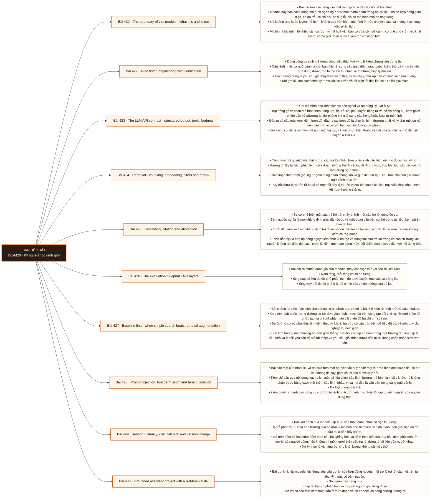

# Mô-đun 28: Kỹ nghệ AI có ranh giới

Module ở mức `C`: biết khi nào nên dùng và khi nào không, chứ không phải xây mô hình. Ranh giới này là chủ ý và được kiểm ở phần đánh giá: nếu một phương án đơn giản hơn đạt cùng kết quả thì phương án phức tạp không được chọn. Hai nguyên tắc chi phối toàn module. Đầu ra của mô hình là dữ liệu không tin cậy, nên nó phải được kiểm lược đồ và phải bị giới hạn quyền ở ranh giới công cụ. Và vài lần chạy thử thành công không phải kết quả đánh giá: phải có tập đối chứng, có số đo, và có bộ kịch bản đối kháng. Nền tảng học máy chỉ ở mức nhận biết; đây không phải đường đi sâu về vận hành mô hình.

## Điều kiện đầu vào

| Mã | Người học có thể | Bằng chứng được chấp nhận |
|---|---|---|
| EN-28-01 | M02 · M06 · M08 · M11 · M17 · M24 · M26 | Bằng chứng hoàn thành điều kiện được nêu trong cột trước |

Nếu chưa có bằng chứng đầu vào, người học phải hoàn thành lại bài hoặc mô-đun được dẫn chiếu trước khi thực hiện phép đánh giá của mô-đun này.

## Đầu ra mô-đun

Dùng mô hình ngôn ngữ như một thành phần có hợp đồng, có đánh giá, có ngân sách và có mô hình mối đe doạ; biết khi nào một phương án đơn giản hơn thắng

## Tiêu chí hoàn thành

| Mã | Bằng chứng bắt buộc | Ngưỡng đạt | Lỗi loại trực tiếp |
|---|---|---|---|
| EC-28-01 | Mã do công cụ sinh ra không được hợp nhất khi chưa có kiểm thử, rà soát tĩnh và rà soát bảo mật; bộ đánh giá bắt được hồi quy; kiến trúc giải thích được khi nào tìm kiếm đơn giản thắng phương án tăng cường truy hồi | Năm tầng đều có số đo, không kịch bản đối kháng nào rò rỉ, cải thiện so với đường cơ sở đủ bù chi phí, và không vi phạm bốn điều kiện tự động chưa đạt. | Lấy vài lần chạy thử thành công làm kết quả đánh giá, dựa vào câu lệnh nhắc để bảo mật, và coi thành công khi trình diễn là sẵn sàng cho sản xuất |

## Khái niệm và nguyên tắc bất biến

| Mã khái niệm | Ranh giới định nghĩa | Nguyên tắc bất biến hoặc quy tắc quyết định | Bài chính |
|---|---|---|---|
| C28-421 | Bài mở module bằng việc đặt ranh giới, vì đây là chỗ dễ trôi nhất. | Module này học cách dùng mô hình ngôn ngữ như một thành phần trong hệ dữ liệu: nó có hợp đồng giao diện, có độ trễ, có chi phí, có tỉ lệ lỗi, và có mô hình mối đe doạ riêng. | L421 |
| C28-422 | Dùng công cụ sinh mã trong công việc thật, với kỷ luật kiểm chứng làm trung tâm. | Câu lệnh nhắc và ngữ cảnh là một bản đặc tả: cung cấp giao diện, ràng buộc, kiểm thử và ví dụ thì kết quả dùng được; mô tả mơ hồ thì nhận về mã trông hợp lý mà sai. | L422 |
| C28-423 | Coi mô hình như một dịch vụ bên ngoài và áp đúng kỷ luật ở M8. | Hợp đồng gồm: chọn mô hình theo năng lực, độ trễ, chi phí, quyền riêng tư và hỗ trợ công cụ, kèm ghim phiên bản và phương án dự phòng khi nhà cung cấp hỏng hoặc khai tử mô hình. | L423 |
| C28-424 | Tầng truy hồi quyết định chất lượng câu trả lời nhiều hơn phần sinh văn bản, nên nó được học kỹ hơn. | Đường đi: lấy tài liệu, phân tích, chia đoạn, nhúng thành véctơ, đánh chỉ mục, truy hồi, lọc, sắp xếp lại, rồi mới dựng ngữ cảnh. | L424 |
| C28-425 | Ba cơ chế biến một câu trả lời trôi chảy thành một câu trả lời dùng được. | Bám nguồn nghĩa là mọi khẳng định phải dẫn được về một đoạn văn bản cụ thể trong tài liệu, kèm phiên bản tài liệu. | L425 |
| C28-426 | Bài đặt ra chuẩn đánh giá của module, thay cho việc thử vài câu rồi kết luận. | Năm tầng, mỗi tầng có số đo riêng | L426 |
| C28-427 | Bài chống lại việc mặc định chọn phương án phức tạp, và nó là bài thể hiện rõ nhất mức C của module. | Quy trình bắt buộc: dựng đường cơ sở đơn giản nhất trước, đo trên cùng tập đối chứng, rồi mới thêm độ phức tạp và chỉ giữ phần nào cải thiện đủ bù chi phí của nó. | L427 |
| C28-428 | Bài bảo mật của module, và nó dựa trên một nguyên tắc duy nhất: mọi thứ mô hình đọc được đều là dữ liệu không tin cậy, gồm cả tài liệu được truy hồi. | Tiêm chỉ dẫn qua nội dung xảy ra khi một tài liệu chứa câu lệnh hướng mô hình làm việc khác; nó không chặn được bằng cách viết thêm câu lệnh nhắc, vì cả hai đều là văn bản trong cùng ngữ cảnh. | L428 |
| C28-429 | Bài vận hành của module, áp M26 vào một thành phần có đặc thù riêng. | Độ trễ phân vị 95 chịu ảnh hưởng của số đơn vị mã hoá đầu ra nhiều hơn đầu vào, nên giới hạn độ dài đầu ra là đòn bẩy chính. | L429 |
| C28-430 | Bài dự án khép module, lấy đúng yêu cầu dự án của hợp đồng nguồn: một trợ lý trả lời câu hỏi trên tài liệu kỹ thuật, có bám nguồn. | Nộp gồm bảy hạng mục | L430 |

## Các bài trong mô-đun

| Bài | Dạng | Đầu ra | Bằng chứng | Điều kiện tiên quyết |
|---|---|---|---|---|
| L421 · [[wiki.ai.boundary|The boundary of this module - what it is and is not]]| LT | Phân định việc thuộc và không thuộc phạm vi module, và nêu ba hệ quả thiết kế của ba thuộc tính kỹ thuật. | Phân đúng ≥ 8/10 tình huống, ba hệ quả thiết kế được nêu cụ thể, và chi phí cùng độ trễ ước lượng trước khớp số đo thật trong sai số thoả thuận. | M28: M27 |
| L422 · [[wiki.ai.assisted-engineering|AI-assisted engineering with verification]]| TH | Dùng công cụ sinh mã cho ba nhiệm vụ với kỷ luật kiểm chứng và phát hiện được lỗi trong mã sinh ra. | Mọi đoạn mã sinh ra qua kiểm thử và rà soát bảo mật trước khi hợp nhất, và ≥ 1 lỗi trong mã sinh ra được kiểm thử phát hiện. | L421 |
| L423 · [[wiki.ai.api-contract|The LLM API contract - structured output, tools, budgets]]| TH | Cài lớp gọi có kiểm lược đồ, ngân sách và dự phòng, chịu được ba chế độ hỏng của nhà cung cấp. | Ba chế độ hỏng được xử lý không sập, không đầu ra sai lược đồ nào lọt hạ nguồn, ngân sách không bị vượt, và dự phòng hoạt động. | L422 |
| L424 · [[wiki.ai.retrieval-pipeline|Retrieval - chunking, embedding, filters and rerank]]| TH | Dựng đường truy hồi có lọc theo quyền và đo được độ phủ ở k trước khi tới phần sinh văn bản. | Độ phủ ở k đo được cho ba cấu hình, phép thử phủ định về quyền không rò tài liệu, và ảnh hưởng của việc đổi mô hình nhúng được định lượng. | L423 |
| L425 · [[wiki.ai.grounding-citation-abstention|Grounding, citation and abstention]]| TH | Cài kiểm trích dẫn bằng máy và cơ chế từ chối, chứng minh không trích dẫn bịa nào lọt. | Không trích dẫn bịa nào lọt qua phép kiểm máy, tỉ lệ từ chối đúng vượt ngưỡng trên nhóm không có đáp án, và tài liệu mâu thuẫn được trình bày kèm phiên bản. | L424 |
| L426 · [[wiki.ai.evaluation-five-layers|The evaluation blueprint - five layers]]| TH | Dựng bộ đánh giá năm tầng chạy tự động và bắt được hồi quy khi đổi một thành phần. | Ba thay đổi tiêm làm đúng tầng tương ứng xuống điểm, và bộ đánh giá chặn được bản phát hành theo ngưỡng. | L425 |
| L427 · [[wiki.ai.baseline-first|Baseline first - when simple search beats retrieval augmentation]]| TH | So đường cơ sở với phương án tăng cường truy hồi trên cùng tập đối chứng và biện minh độ phức tạp bằng số. | Ba đường cơ sở có số đo trên cùng tập đối chứng, quyết định dẫn từ cặp cải thiện với chi phí, và một loại câu hỏi mà đường cơ sở thắng được chỉ ra. | L426 |
| L428 · [[wiki.ai.prompt-injection-isolation|Prompt injection, tool permission and tenant isolation]]| TH | Tái hiện ba tấn công và chặn bằng ba lớp phòng thủ ở ranh giới công cụ, không bằng câu lệnh nhắc. | Mọi kịch bản rò rỉ hoặc vượt quyền bị chặn ở ranh giới công cụ, không phòng thủ nào chỉ dựa vào câu lệnh nhắc, và vòng lặp gọi công cụ có giới hạn. | L427 |
| L429 · [[wiki.ai.serving-lineage|Serving - latency, cost, fallback and version lineage]]| TH | Đạt ngưỡng độ trễ và chi phí với đệm an toàn theo quyền và truy vết nguồn gốc đủ bốn thứ. | Độ trễ phân vị 95 và chi phí trên mỗi truy vấn dưới ngưỡng, đệm không rò dữ liệu giữa người dùng, và mọi câu trả lời truy được đủ bốn thứ. | L428 |
| L430 · [[wiki.ai.grounded-assistant-red-team|Grounded assistant project with a red-team suite]]| DA | Nộp trợ lý đủ bảy hạng mục, vượt đường cơ sở có số đo, và không vi phạm bốn điều kiện tự động chưa đạt. | Năm tầng đều có số đo, không kịch bản đối kháng nào rò rỉ, cải thiện so với đường cơ sở đủ bù chi phí, và không vi phạm bốn điều kiện tự động chưa đạt. | L429 |

## Nội dung từng bài

> **Sơ đồ đề xuất: DE-M28 v0.1.0.** Mỗi nhánh đi từ một bài học đến các nội dung nguyên tử bắt buộc. Thứ tự dạy lấy từ bảng `Các bài trong mô-đun`.

### Lesson 421: The boundary of this module - what it is and is not

Bài mở module bằng việc đặt ranh giới, vì đây là chỗ dễ trôi nhất. Module này học cách dùng mô hình ngôn ngữ như một thành phần trong hệ dữ liệu: nó có hợp đồng giao diện, có độ trễ, có chi phí, có tỉ lệ lỗi, và có mô hình mối đe doạ riêng. Nó không dạy huấn luyện mô hình, không dạy vận hành mô hình ở mức chuyên sâu, và không thay công việc phân tích. Mô hình khái niệm tối thiểu cần có: đơn vị mã hoá văn bản và cửa sổ ngữ cảnh, cơ chế chú ý ở mức khái niệm, và ba giai đoạn huấn luyện ở mức nhận biết. Ba thuộc tính kỹ thuật có hệ quả thiết kế: đầu ra không tất định nên phép thử phải chịu được biến thiên; chi phí và độ trễ tỉ lệ với số đơn vị mã hoá nên chúng tính trước được; và cửa sổ ngữ cảnh là ràng buộc cứng nên việc chọn đưa gì vào là một bài toán thiết kế chứ một chi tiết.

Người học phải phân định việc thuộc và không thuộc phạm vi module, và nêu ba hệ quả thiết kế của ba thuộc tính kỹ thuật. Bằng chứng thực hành: Cho mười tình huống công việc; phân loại thuộc phạm vi module, thuộc một module khác, hay không thuộc chương trình. Với ba thuộc tính kỹ thuật, viết một hệ quả thiết kế cụ thể cho từng cái. Tính trước chi phí và độ trễ của một lời gọi từ số đơn vị mã hoá ước lượng và đối chiếu với số đo thật. Bài hoàn tất khi phân đúng ≥ 8/10 tình huống, ba hệ quả thiết kế được nêu cụ thể, và chi phí cùng độ trễ ước lượng trước khớp số đo thật trong sai số thoả thuận.

Cách đánh giá: Tầng *hiểu*. Bài mở module, đặt ranh giới. Kiểm bằng bài phân định mười tình huống; đạt khi phân đúng ít nhất tám và ba hệ quả thiết kế được nêu cụ thể.

### Lesson 422: AI-assisted engineering with verification

Dùng công cụ sinh mã trong công việc thật, với kỷ luật kiểm chứng làm trung tâm. Câu lệnh nhắc và ngữ cảnh là một bản đặc tả: cung cấp giao diện, ràng buộc, kiểm thử và ví dụ thì kết quả dùng được; mô tả mơ hồ thì nhận về mã trông hợp lý mà sai. Cách dùng đúng là yêu cầu giả thuyết và kiểm thử, rồi tự chạy, chứ áp bản vá một cách mù quáng. Khi gỡ lỗi, làm sạch nhật ký trước khi đưa vào và tái hiện lỗi độc lập chứ tin lời giải thích. Rà soát mã sinh ra theo bốn trục: tính đúng, bảo mật, giấy phép, và nguồn gốc; đo hiệu năng của mã sinh ra thay vì giả định. Một điểm phải kiểm luôn: thư viện và tham số do công cụ đề xuất có thể đã lỗi thời hoặc không tồn tại, nên đối chiếu với tài liệu chính thức kèm phiên bản là bước bắt buộc.

Người học phải dùng công cụ sinh mã cho ba nhiệm vụ với kỷ luật kiểm chứng và phát hiện được lỗi trong mã sinh ra. Bằng chứng thực hành: Chọn ba nhiệm vụ lập trình có tiêu chí rõ. Với mỗi cái, viết đặc tả gồm giao diện, ràng buộc và kiểm thử trước khi yêu cầu sinh mã. Chạy kiểm thử, rà soát tĩnh và rà soát bảo mật. Ghi lại mọi chỗ mã sinh ra sai, gồm cả tham số hoặc thư viện không tồn tại. Đo hiệu năng và so với bản viết tay. Bài hoàn tất khi mọi đoạn mã sinh ra qua kiểm thử và rà soát bảo mật trước khi hợp nhất, và ≥ 1 lỗi trong mã sinh ra được kiểm thử phát hiện.

Cách đánh giá: Tầng *áp dụng*. Objective đòi kiểm chứng chứ tiêu thụ. Kiểm bằng ba nhiệm vụ; đạt khi mọi đoạn mã sinh ra đều qua kiểm thử cùng rà soát bảo mật trước khi hợp nhất, và ít nhất một lỗi trong mã sinh ra được phát hiện bằng kiểm thử.

### Lesson 423: The LLM API contract - structured output, tools, budgets

Coi mô hình như một dịch vụ bên ngoài và áp đúng kỷ luật ở M8. Hợp đồng gồm: chọn mô hình theo năng lực, độ trễ, chi phí, quyền riêng tư và hỗ trợ công cụ, kèm ghim phiên bản và phương án dự phòng khi nhà cung cấp hỏng hoặc khai tử mô hình. Đầu ra có cấu trúc kèm kiểm lược đồ: đầu ra sai lược đồ là chuyện bình thường phải xử lý chứ một sự cố, nên cần thử lại có giới hạn và cần đường dự phòng. Gọi công cụ chỉ là mô hình đề nghị một lời gọi, và việc thực hiện thuộc về mã của ta; đây là chỗ đặt kiểm quyền ở Bài 428. Hết giờ, thử lại và hạn mức theo Bài 224, với lưu ý thử lại chỉ áp cho lỗi an toàn. Ngân sách số đơn vị mã hoá, ngân sách tốc độ và giới hạn đồng thời phải đặt trước. Câu lệnh nhắc và cấu hình là mã có phiên bản, gắn với bộ đánh giá của bản phát hành.

Người học phải cài lớp gọi có kiểm lược đồ, ngân sách và dự phòng, chịu được ba chế độ hỏng của nhà cung cấp. Bằng chứng thực hành: Cài lớp gọi có kiểm lược đồ đầu ra, thử lại có giới hạn, ngân sách đơn vị mã hoá và giới hạn đồng thời. Tiêm ba chế độ hỏng: hết giờ, vượt hạn mức, và đầu ra sai lược đồ. Chứng minh không đầu ra sai nào lọt xuống hạ nguồn. Đặt câu lệnh nhắc và cấu hình vào kho mã có phiên bản. Kiểm phương án dự phòng khi mô hình chính không dùng được. Bài hoàn tất khi ba chế độ hỏng được xử lý không sập, không đầu ra sai lược đồ nào lọt hạ nguồn, ngân sách không bị vượt, và dự phòng hoạt động.

Cách đánh giá: Tầng *áp dụng*. Objective có tiêu chí nghiệm thu là hệ vẫn đúng dưới lỗi của bên ngoài. Kiểm bằng ba chế độ hỏng tiêm; đạt khi cả ba được xử lý không sập, đầu ra sai lược đồ không lọt xuống hạ nguồn, và ngân sách không bị vượt.

### Lesson 424: Retrieval - chunking, embedding, filters and rerank

Tầng truy hồi quyết định chất lượng câu trả lời nhiều hơn phần sinh văn bản, nên nó được học kỹ hơn. Đường đi: lấy tài liệu, phân tích, chia đoạn, nhúng thành véctơ, đánh chỉ mục, truy hồi, lọc, sắp xếp lại, rồi mới dựng ngữ cảnh. Chia đoạn theo ranh giới ngữ nghĩa cùng phần chồng lấn và giữ siêu dữ liệu; cấu trúc cha con giữ được ngữ cảnh mục lớn. Truy hồi thưa dựa trên từ khoá và truy hồi dày dựa trên véctơ bắt được hai loại truy vấn khác nhau, nên kết hợp thường thắng. Bộ sắp xếp lại đắt nhưng cải thiện rõ ở phần đầu danh sách. Hai điểm bắt buộc: kho véctơ là một chỉ mục chứ nguồn sự thật, nên dựng lại được từ nguồn; và lọc theo quyền phải áp trước khi trả kết quả, không phải sau, nếu không thì rò rỉ dữ liệu giữa các khách hàng. Đổi phiên bản mô hình nhúng buộc dựng lại toàn bộ chỉ mục.

Người học phải dựng đường truy hồi có lọc theo quyền và đo được độ phủ ở k trước khi tới phần sinh văn bản. Bằng chứng thực hành: Dựng tập tài liệu có phân quyền theo khách hàng. Cài ba cấu hình truy hồi: chỉ từ khoá, chỉ véctơ, và kết hợp có sắp xếp lại. Xây tập đối chứng gồm truy vấn và tài liệu đúng. Đo độ phủ ở k và độ chính xác cho cả ba. Chạy phép thử phủ định về quyền. Đổi phiên bản mô hình nhúng và đo ảnh hưởng khi chưa dựng lại chỉ mục. Bài hoàn tất khi độ phủ ở k đo được cho ba cấu hình, phép thử phủ định về quyền không rò tài liệu, và ảnh hưởng của việc đổi mô hình nhúng được định lượng.

Cách đánh giá: Tầng *áp dụng*. Objective đo tầng truy hồi riêng chứ đo kết quả cuối. Kiểm bằng tập đối chứng truy hồi; đạt khi độ phủ ở k đo được cho ba cấu hình, và phép thử phủ định về quyền không trả về tài liệu ngoài phạm vi.

### Lesson 425: Grounding, citation and abstention

Ba cơ chế biến một câu trả lời trôi chảy thành một câu trả lời dùng được. Bám nguồn nghĩa là mọi khẳng định phải dẫn được về một đoạn văn bản cụ thể trong tài liệu, kèm phiên bản tài liệu. Trích dẫn ánh xạ từng khẳng định tới đoạn nguồn chứ tới cả tài liệu, vì trích dẫn ở mức tài liệu không kiểm chứng được. Trích dẫn bịa là chế độ hỏng nguy hiểm nhất vì nó tạo vẻ đáng tin: câu trả lời trông có căn cứ trong khi nguồn không nói điều đó; cách chặn là kiểm trích dẫn bằng máy, đối chiếu đoạn được dẫn với nội dung thật. Từ chối trả lời khi bằng chứng không đủ là một tính năng chứ một thất bại, và ngưỡng từ chối là một tham số phải đo theo Bài 426. Chính sách cho tài liệu mâu thuẫn hoặc đã cũ: trình bày cả hai kèm phiên bản chứ chọn bừa một bên.

Người học phải cài kiểm trích dẫn bằng máy và cơ chế từ chối, chứng minh không trích dẫn bịa nào lọt. Bằng chứng thực hành: Xây tập đối chứng gồm câu hỏi có đáp án, câu hỏi không có đáp án trong tài liệu, và câu hỏi có hai tài liệu mâu thuẫn. Cài trích dẫn ở mức đoạn và kiểm trích dẫn bằng máy. Cài cơ chế từ chối có ngưỡng. Đo tỉ lệ trích dẫn bịa, tỉ lệ từ chối đúng và tỉ lệ từ chối nhầm. Áp chính sách cho tài liệu mâu thuẫn. Bài hoàn tất khi không trích dẫn bịa nào lọt qua phép kiểm máy, tỉ lệ từ chối đúng vượt ngưỡng trên nhóm không có đáp án, và tài liệu mâu thuẫn được trình bày kèm phiên bản.

Cách đánh giá: Tầng *áp dụng*. Objective có một tiêu chí nghiệm thu nhị phân về tính trung thực. Kiểm bằng tập đối chứng có tài liệu mâu thuẫn và câu hỏi không có đáp án; đạt khi không trích dẫn bịa nào lọt và tỉ lệ từ chối đúng trên nhóm câu không có đáp án vượt ngưỡng.

### Lesson 426: The evaluation blueprint - five layers

Bài đặt ra chuẩn đánh giá của module, thay cho việc thử vài câu rồi kết luận. Năm tầng, mỗi tầng có số đo riêng: tầng nạp tài liệu đo độ phủ phân tích, độ tươi, quyền truy cập và trùng lặp; tầng truy hồi đo độ phủ ở k, độ chính xác và tính đúng của bộ lọc; tầng sinh văn bản đo mức bám nguồn, tính đúng của nhiệm vụ, chất lượng trích dẫn và tỉ lệ từ chối; tầng hệ thống đo độ trễ phân vị, tỉ lệ lỗi, chi phí trên mỗi đơn vị và khả dụng; tầng an toàn đo kết quả trên bộ kịch bản đối kháng. Đo tách từng tầng là điều kiện để biết sửa chỗ nào, vì một câu trả lời sai có thể do truy hồi trượt hoặc do sinh văn bản sai, và hai nguyên nhân cần hai cách sửa. Tập đối chứng phải gắn với bản phát hành và chạy lại ở mỗi lần đổi câu lệnh nhắc, đổi mô hình hoặc đổi chỉ mục. Rà soát người cho phần không đo được bằng máy.

Người học phải dựng bộ đánh giá năm tầng chạy tự động và bắt được hồi quy khi đổi một thành phần. Bằng chứng thực hành: Dựng bộ đánh giá năm tầng trên tập đối chứng cố định. Chạy lấy đường cơ sở. Tiêm ba thay đổi: đổi cách chia đoạn, đổi câu lệnh nhắc, và đổi phiên bản mô hình. Với mỗi cái, chỉ ra tầng nào xuống điểm. Đặt ngưỡng chặn phát hành và xác nhận nó chặn đúng. Thêm một vòng rà soát người cho phần không đo được. Bài hoàn tất khi ba thay đổi tiêm làm đúng tầng tương ứng xuống điểm, và bộ đánh giá chặn được bản phát hành theo ngưỡng.

Cách đánh giá: Tầng *áp dụng*. Objective là một cửa chặn hồi quy có số đo theo tầng. Kiểm bằng ba thay đổi tiêm; đạt khi mỗi thay đổi làm đúng tầng tương ứng xuống điểm và bộ đánh giá chặn được bản phát hành.

### Lesson 427: Baseline first - when simple search beats retrieval augmentation

Bài chống lại việc mặc định chọn phương án phức tạp, và nó là bài thể hiện rõ nhất mức `C` của module. Quy trình bắt buộc: dựng đường cơ sở đơn giản nhất trước, đo trên cùng tập đối chứng, rồi mới thêm độ phức tạp và chỉ giữ phần nào cải thiện đủ bù chi phí của nó. Ba đường cơ sở phải thử: tìm kiếm theo từ khoá, tra cứu có cấu trúc trên dữ liệu đã có, và một quy tắc nghiệp vụ đơn giản. Bốn tình huống mà phương án đơn giản thắng: câu hỏi có đáp án nằm trong một trường dữ liệu; tập tài liệu nhỏ và ít đổi; yêu cầu độ trễ rất thấp; và yêu cầu giải thích được đến mức không chấp nhận sinh văn bản. Chi phí của độ phức tạp phải nêu tường minh: thêm thành phần phải vận hành, thêm chi phí trên mỗi truy vấn, thêm chế độ hỏng, và thêm bề mặt bảo mật ở Bài 428.

Người học phải so đường cơ sở với phương án tăng cường truy hồi trên cùng tập đối chứng và biện minh độ phức tạp bằng số. Bằng chứng thực hành: Dựng ba đường cơ sở cho cùng bài toán. Đo trên cùng tập đối chứng với cùng số đo ở Bài 426. Dựng phương án tăng cường truy hồi và đo lại. Tính chi phí trên mỗi truy vấn và số thành phần phải vận hành cho từng phương án. Kết luận bằng cặp cải thiện với chi phí. Tìm một loại câu hỏi mà đường cơ sở thắng. Bài hoàn tất khi ba đường cơ sở có số đo trên cùng tập đối chứng, quyết định dẫn từ cặp cải thiện với chi phí, và một loại câu hỏi mà đường cơ sở thắng được chỉ ra.

Cách đánh giá: Tầng *đánh giá*. Objective đòi biện minh độ phức tạp chứ mặc định chọn nó. Kiểm bằng bài so; đạt khi ba đường cơ sở có số đo trên cùng tập đối chứng, và quyết định dùng hay không dùng phương án phức tạp dẫn được từ cặp cải thiện với chi phí.

### Lesson 428: Prompt injection, tool permission and tenant isolation

Bài bảo mật của module, và nó dựa trên một nguyên tắc duy nhất: mọi thứ mô hình đọc được đều là dữ liệu không tin cậy, gồm cả tài liệu được truy hồi. Tiêm chỉ dẫn qua nội dung xảy ra khi một tài liệu chứa câu lệnh hướng mô hình làm việc khác; nó không chặn được bằng cách viết thêm câu lệnh nhắc, vì cả hai đều là văn bản trong cùng ngữ cảnh. Ba lớp phòng thủ thật: kiểm quyền ở ranh giới công cụ chứ ở câu lệnh nhắc, tức mã thực hiện lời gọi tự kiểm quyền của người dùng thật; danh sách cho phép cho công cụ và tham số; và phê duyệt của người cho thao tác không đảo ngược được. Rò rỉ dữ liệu ra ngoài qua một công cụ có khả năng gửi đi là ca hỏng nặng nhất. Cách ly giữa các khách hàng áp trước truy hồi theo Bài 424. Vòng lặp gọi công cụ không kiểm soát gây chi phí tăng vọt, nên cần giới hạn số bước và ngân sách.

Người học phải tái hiện ba tấn công và chặn bằng ba lớp phòng thủ ở ranh giới công cụ, không bằng câu lệnh nhắc. Bằng chứng thực hành: Dựng bộ 30 kịch bản đối kháng gồm tiêm chỉ dẫn qua tài liệu, cố lấy dữ liệu của khách hàng khác, và cố gọi công cụ ngoài quyền. Chạy trên hệ chưa có phòng thủ và đếm số kịch bản thành công. Thêm ba lớp phòng thủ và chạy lại. Chứng minh phòng thủ nằm ở mã chứ ở câu lệnh nhắc. Đặt giới hạn số bước gọi công cụ và ngân sách. Bài hoàn tất khi mọi kịch bản rò rỉ hoặc vượt quyền bị chặn ở ranh giới công cụ, không phòng thủ nào chỉ dựa vào câu lệnh nhắc, và vòng lặp gọi công cụ có giới hạn.

Cách đánh giá: Tầng *phân tích*. Objective đòi đặt chốt kiểm soát đúng chỗ. Kiểm bằng bộ 30 kịch bản đối kháng; đạt khi mọi kịch bản rò rỉ dữ liệu hoặc vượt quyền bị chặn ở ranh giới công cụ, và không phòng thủ nào chỉ dựa trên câu lệnh nhắc.

### Lesson 429: Serving - latency, cost, fallback and version lineage

Bài vận hành của module, áp M26 vào một thành phần có đặc thù riêng. Độ trễ phân vị 95 chịu ảnh hưởng của số đơn vị mã hoá đầu ra nhiều hơn đầu vào, nên giới hạn độ dài đầu ra là đòn bẩy chính. Bộ nhớ đệm có hai mức: đệm theo câu hỏi giống hệt, và đệm theo kết quả truy hồi; đệm phải tính tới quyền của người dùng, nếu không thì một người thấy câu trả lời dựng từ tài liệu của người khác. Xử lý theo lô và hàng đợi cho khối lượng không cần tức thời. Đường dự phòng khi mô hình chính hỏng: mô hình khác, đường cơ sở đơn giản hơn ở Bài 427, hoặc trả lời rằng chưa phục vụ được. Truy vết nguồn gốc phải ghi đủ bốn thứ cho mỗi câu trả lời: phiên bản mô hình, phiên bản câu lệnh nhắc, phiên bản chỉ mục, và tập tài liệu đã dùng; thiếu bốn thứ này thì không điều tra được một câu trả lời sai.

Người học phải đạt ngưỡng độ trễ và chi phí với đệm an toàn theo quyền và truy vết nguồn gốc đủ bốn thứ. Bằng chứng thực hành: Chạy tải và đo độ trễ phân vị cùng chi phí trên mỗi truy vấn. Giới hạn độ dài đầu ra và đo lại. Bật hai mức đệm và chạy phép thử phủ định: hai người dùng có quyền khác nhau hỏi cùng câu và kiểm không ai thấy tài liệu ngoài quyền. Cài ghi nguồn gốc bốn thứ. Tiêm lỗi nhà cung cấp và kiểm đường dự phòng. Bài hoàn tất khi độ trễ phân vị 95 và chi phí trên mỗi truy vấn dưới ngưỡng, đệm không rò dữ liệu giữa người dùng, và mọi câu trả lời truy được đủ bốn thứ.

Cách đánh giá: Tầng *áp dụng*. Objective có ba tiêu chí nghiệm thu gồm một ca bảo mật. Kiểm bằng phép thử tải cộng phép thử đệm; đạt khi độ trễ phân vị 95 và chi phí trên mỗi truy vấn dưới ngưỡng, đệm không rò dữ liệu giữa người dùng, và mọi câu trả lời truy được bốn thứ.

### Lesson 430: Grounded assistant project with a red-team suite

Bài dự án khép module, lấy đúng yêu cầu dự án của hợp đồng nguồn: một trợ lý trả lời câu hỏi trên tài liệu kỹ thuật, có bám nguồn. Nộp gồm bảy hạng mục: nạp tài liệu có phiên bản và truy vết nguồn gốc từng đoạn; trả lời có cấu trúc kèm trích dẫn ở mức đoạn và có từ chối khi bằng chứng không đủ; tập đối chứng gồm câu hỏi bình thường, câu hỏi đối kháng, tài liệu đã cũ và tài liệu mâu thuẫn; số đo năm tầng theo Bài 426 gồm cả độ trễ phân vị 95 và chi phí; ba lớp phòng thủ ở Bài 428 cùng kết quả bộ 30 kịch bản đối kháng; so với đường cơ sở đơn giản theo Bài 427; và quy trình thử nghiệm dần khi đổi câu lệnh nhắc, đổi mô hình hoặc đổi chỉ mục, kèm đường quay lui. Bốn điều kiện tự động chưa đạt: lấy vài lần chạy thử làm đánh giá, phòng thủ chỉ bằng câu lệnh nhắc, rò rỉ dữ liệu nhạy cảm, và không có cơ chế từ chối cùng ngân sách cùng dự phòng.

Người học phải nộp trợ lý đủ bảy hạng mục, vượt đường cơ sở có số đo, và không vi phạm bốn điều kiện tự động chưa đạt. Bằng chứng thực hành: Dựng trợ lý theo bảy hạng mục. Chạy bộ đánh giá năm tầng và bộ 30 kịch bản đối kháng. So với ba đường cơ sở. Thực hiện một lần đổi mô hình theo quy trình thử nghiệm dần rồi quay lui. Trình bày 20 phút và trả lời chất vấn về một câu trả lời sai: nó sai ở tầng nào và sửa thế nào. Bài hoàn tất khi năm tầng đều có số đo, không kịch bản đối kháng nào rò rỉ, cải thiện so với đường cơ sở đủ bù chi phí, và không vi phạm bốn điều kiện tự động chưa đạt.

Cách đánh giá: Tầng *sáng tạo*. Bài tổng hợp toàn module. Kiểm bằng số đo năm tầng cộng bộ đối kháng; đạt khi mọi tầng có số đo, bộ 30 kịch bản không có kịch bản nào rò rỉ, và phần cải thiện so với đường cơ sở đủ bù chi phí tăng thêm.

## Lý do sắp xếp

Mô-đun bắt đầu từ `M28: M27` và đi theo các quan hệ tiên quyết đã ghi trong bảng. Mỗi bài chỉ sử dụng khái niệm hoặc thao tác đã được giới thiệu trước đó; bài cuối L430 tích hợp đầu ra của toàn mô-đun.

## Ma trận đánh giá

| Mã đầu ra | Mức độ tư duy | Cách đánh giá | Ngưỡng đạt | Hình thức kiểm tra lại |
|---|---|---|---|---|
| L421 | Hiểu | Tầng *hiểu*. Bài mở module, đặt ranh giới. Kiểm bằng bài phân định mười tình huống; đạt khi phân đúng ít nhất tám và ba hệ quả thiết kế được nêu cụ thể. | Phân đúng ≥ 8/10 tình huống, ba hệ quả thiết kế được nêu cụ thể, và chi phí cùng độ trễ ước lượng trước khớp số đo thật trong sai số thoả thuận. | Tình huống mới, giữ nguyên đầu ra và ngưỡng |
| L422 | Áp dụng | Tầng *áp dụng*. Objective đòi kiểm chứng chứ tiêu thụ. Kiểm bằng ba nhiệm vụ; đạt khi mọi đoạn mã sinh ra đều qua kiểm thử cùng rà soát bảo mật trước khi hợp nhất, và ít nhất một lỗi trong mã sinh ra được phát hiện bằng kiểm thử. | Mọi đoạn mã sinh ra qua kiểm thử và rà soát bảo mật trước khi hợp nhất, và ≥ 1 lỗi trong mã sinh ra được kiểm thử phát hiện. | Tình huống mới, giữ nguyên đầu ra và ngưỡng |
| L423 | Áp dụng | Tầng *áp dụng*. Objective có tiêu chí nghiệm thu là hệ vẫn đúng dưới lỗi của bên ngoài. Kiểm bằng ba chế độ hỏng tiêm; đạt khi cả ba được xử lý không sập, đầu ra sai lược đồ không lọt xuống hạ nguồn, và ngân sách không bị vượt. | Ba chế độ hỏng được xử lý không sập, không đầu ra sai lược đồ nào lọt hạ nguồn, ngân sách không bị vượt, và dự phòng hoạt động. | Tình huống mới, giữ nguyên đầu ra và ngưỡng |
| L424 | Áp dụng | Tầng *áp dụng*. Objective đo tầng truy hồi riêng chứ đo kết quả cuối. Kiểm bằng tập đối chứng truy hồi; đạt khi độ phủ ở k đo được cho ba cấu hình, và phép thử phủ định về quyền không trả về tài liệu ngoài phạm vi. | Độ phủ ở k đo được cho ba cấu hình, phép thử phủ định về quyền không rò tài liệu, và ảnh hưởng của việc đổi mô hình nhúng được định lượng. | Tình huống mới, giữ nguyên đầu ra và ngưỡng |
| L425 | Áp dụng | Tầng *áp dụng*. Objective có một tiêu chí nghiệm thu nhị phân về tính trung thực. Kiểm bằng tập đối chứng có tài liệu mâu thuẫn và câu hỏi không có đáp án; đạt khi không trích dẫn bịa nào lọt và tỉ lệ từ chối đúng trên nhóm câu không có đáp án vượt ngưỡng. | Không trích dẫn bịa nào lọt qua phép kiểm máy, tỉ lệ từ chối đúng vượt ngưỡng trên nhóm không có đáp án, và tài liệu mâu thuẫn được trình bày kèm phiên bản. | Tình huống mới, giữ nguyên đầu ra và ngưỡng |
| L426 | Áp dụng | Tầng *áp dụng*. Objective là một cửa chặn hồi quy có số đo theo tầng. Kiểm bằng ba thay đổi tiêm; đạt khi mỗi thay đổi làm đúng tầng tương ứng xuống điểm và bộ đánh giá chặn được bản phát hành. | Ba thay đổi tiêm làm đúng tầng tương ứng xuống điểm, và bộ đánh giá chặn được bản phát hành theo ngưỡng. | Tình huống mới, giữ nguyên đầu ra và ngưỡng |
| L427 | Đánh giá | Tầng *đánh giá*. Objective đòi biện minh độ phức tạp chứ mặc định chọn nó. Kiểm bằng bài so; đạt khi ba đường cơ sở có số đo trên cùng tập đối chứng, và quyết định dùng hay không dùng phương án phức tạp dẫn được từ cặp cải thiện với chi phí. | Ba đường cơ sở có số đo trên cùng tập đối chứng, quyết định dẫn từ cặp cải thiện với chi phí, và một loại câu hỏi mà đường cơ sở thắng được chỉ ra. | Tình huống mới, giữ nguyên đầu ra và ngưỡng |
| L428 | Phân tích | Tầng *phân tích*. Objective đòi đặt chốt kiểm soát đúng chỗ. Kiểm bằng bộ 30 kịch bản đối kháng; đạt khi mọi kịch bản rò rỉ dữ liệu hoặc vượt quyền bị chặn ở ranh giới công cụ, và không phòng thủ nào chỉ dựa trên câu lệnh nhắc. | Mọi kịch bản rò rỉ hoặc vượt quyền bị chặn ở ranh giới công cụ, không phòng thủ nào chỉ dựa vào câu lệnh nhắc, và vòng lặp gọi công cụ có giới hạn. | Tình huống mới, giữ nguyên đầu ra và ngưỡng |
| L429 | Áp dụng | Tầng *áp dụng*. Objective có ba tiêu chí nghiệm thu gồm một ca bảo mật. Kiểm bằng phép thử tải cộng phép thử đệm; đạt khi độ trễ phân vị 95 và chi phí trên mỗi truy vấn dưới ngưỡng, đệm không rò dữ liệu giữa người dùng, và mọi câu trả lời truy được bốn thứ. | Độ trễ phân vị 95 và chi phí trên mỗi truy vấn dưới ngưỡng, đệm không rò dữ liệu giữa người dùng, và mọi câu trả lời truy được đủ bốn thứ. | Tình huống mới, giữ nguyên đầu ra và ngưỡng |
| L430 | Sáng tạo | Tầng *sáng tạo*. Bài tổng hợp toàn module. Kiểm bằng số đo năm tầng cộng bộ đối kháng; đạt khi mọi tầng có số đo, bộ 30 kịch bản không có kịch bản nào rò rỉ, và phần cải thiện so với đường cơ sở đủ bù chi phí tăng thêm. | Năm tầng đều có số đo, không kịch bản đối kháng nào rò rỉ, cải thiện so với đường cơ sở đủ bù chi phí, và không vi phạm bốn điều kiện tự động chưa đạt. | Tình huống mới, giữ nguyên đầu ra và ngưỡng |

Không cộng điểm để bù cho lỗi loại trực tiếp. Người học phải sửa đúng lỗi, nộp lại bằng chứng và thực hiện kiểm tra lại trên một tình huống khác.

## Bài thực hành bắt buộc

| Bài thực hành hoặc dự án | Bài liên quan | Sản phẩm bắt buộc | Lỗi được cài vào tình huống |
|---|---|---|---|
| The boundary of this module - what it is and is not | L421 | Cho mười tình huống công việc; phân loại thuộc phạm vi module, thuộc một module khác, hay không thuộc chương trình. Với ba thuộc tính kỹ thuật, viết một hệ quả thiết kế cụ thể cho từng cái. Tính trước chi phí và độ trễ của một lời gọi từ số đơn vị mã hoá ước lượng và đối chiếu với số đo thật. | Trôi sang huấn luyện mô hình · coi đầu ra tất định nên viết phép thử so khớp chuỗi · bỏ qua ràng buộc cửa sổ ngữ cảnh khi thiết kế · ước lượng chi phí sau khi chạy thay vì trước. |
| AI-assisted engineering with verification | L422 | Chọn ba nhiệm vụ lập trình có tiêu chí rõ. Với mỗi cái, viết đặc tả gồm giao diện, ràng buộc và kiểm thử trước khi yêu cầu sinh mã. Chạy kiểm thử, rà soát tĩnh và rà soát bảo mật. Ghi lại mọi chỗ mã sinh ra sai, gồm cả tham số hoặc thư viện không tồn tại. Đo hiệu năng và so với bản viết tay. | Hợp nhất mã sinh ra mà chưa có kiểm thử · dán nhật ký chứa bí mật vào công cụ · tin lời giải thích thay vì tái hiện lỗi · dùng tham số công cụ đề xuất mà không tra tài liệu. |
| The LLM API contract - structured output, tools, budgets | L423 | Cài lớp gọi có kiểm lược đồ đầu ra, thử lại có giới hạn, ngân sách đơn vị mã hoá và giới hạn đồng thời. Tiêm ba chế độ hỏng: hết giờ, vượt hạn mức, và đầu ra sai lược đồ. Chứng minh không đầu ra sai nào lọt xuống hạ nguồn. Đặt câu lệnh nhắc và cấu hình vào kho mã có phiên bản. Kiểm phương án dự phòng khi mô hình chính không dùng được. | Phân tích đầu ra bằng cách tìm chuỗi thay vì kiểm lược đồ · thử lại mọi lỗi · không ghim phiên bản mô hình · để câu lệnh nhắc nằm ngoài kho mã. |
| Retrieval - chunking, embedding, filters and rerank | L424 | Dựng tập tài liệu có phân quyền theo khách hàng. Cài ba cấu hình truy hồi: chỉ từ khoá, chỉ véctơ, và kết hợp có sắp xếp lại. Xây tập đối chứng gồm truy vấn và tài liệu đúng. Đo độ phủ ở k và độ chính xác cho cả ba. Chạy phép thử phủ định về quyền. Đổi phiên bản mô hình nhúng và đo ảnh hưởng khi chưa dựng lại chỉ mục. | Coi kho véctơ là nguồn sự thật · lọc quyền sau khi truy hồi · chia đoạn theo số ký tự cố định cắt ngang câu · đổi mô hình nhúng mà không dựng lại chỉ mục. |
| Grounding, citation and abstention | L425 | Xây tập đối chứng gồm câu hỏi có đáp án, câu hỏi không có đáp án trong tài liệu, và câu hỏi có hai tài liệu mâu thuẫn. Cài trích dẫn ở mức đoạn và kiểm trích dẫn bằng máy. Cài cơ chế từ chối có ngưỡng. Đo tỉ lệ trích dẫn bịa, tỉ lệ từ chối đúng và tỉ lệ từ chối nhầm. Áp chính sách cho tài liệu mâu thuẫn. | Trích dẫn ở mức tài liệu · không kiểm trích dẫn bằng máy · coi từ chối là thất bại rồi ép mô hình luôn trả lời · chọn một tài liệu khi có mâu thuẫn mà không nói. |
| The evaluation blueprint - five layers | L426 | Dựng bộ đánh giá năm tầng trên tập đối chứng cố định. Chạy lấy đường cơ sở. Tiêm ba thay đổi: đổi cách chia đoạn, đổi câu lệnh nhắc, và đổi phiên bản mô hình. Với mỗi cái, chỉ ra tầng nào xuống điểm. Đặt ngưỡng chặn phát hành và xác nhận nó chặn đúng. Thêm một vòng rà soát người cho phần không đo được. | Thử vài câu rồi kết luận · chỉ đo kết quả cuối nên không biết sửa tầng nào · đổi tập đối chứng mỗi lần đánh giá · bỏ tầng chi phí và độ trễ. |
| Baseline first - when simple search beats retrieval augmentation | L427 | Dựng ba đường cơ sở cho cùng bài toán. Đo trên cùng tập đối chứng với cùng số đo ở Bài 426. Dựng phương án tăng cường truy hồi và đo lại. Tính chi phí trên mỗi truy vấn và số thành phần phải vận hành cho từng phương án. Kết luận bằng cặp cải thiện với chi phí. Tìm một loại câu hỏi mà đường cơ sở thắng. | Bắt đầu từ phương án phức tạp nhất · so hai phương án trên hai tập dữ liệu khác nhau · bỏ chi phí vận hành khỏi so sánh · kết luận bằng cảm nhận về chất lượng câu trả lời. |
| Prompt injection, tool permission and tenant isolation | L428 | Dựng bộ 30 kịch bản đối kháng gồm tiêm chỉ dẫn qua tài liệu, cố lấy dữ liệu của khách hàng khác, và cố gọi công cụ ngoài quyền. Chạy trên hệ chưa có phòng thủ và đếm số kịch bản thành công. Thêm ba lớp phòng thủ và chạy lại. Chứng minh phòng thủ nằm ở mã chứ ở câu lệnh nhắc. Đặt giới hạn số bước gọi công cụ và ngân sách. | Chặn tiêm chỉ dẫn bằng cách viết thêm vào câu lệnh nhắc · cho công cụ dùng quyền của dịch vụ thay vì của người dùng · không giới hạn số bước gọi công cụ · ghi cả nội dung nhạy cảm vào vết theo dõi. |
| Serving - latency, cost, fallback and version lineage | L429 | Chạy tải và đo độ trễ phân vị cùng chi phí trên mỗi truy vấn. Giới hạn độ dài đầu ra và đo lại. Bật hai mức đệm và chạy phép thử phủ định: hai người dùng có quyền khác nhau hỏi cùng câu và kiểm không ai thấy tài liệu ngoài quyền. Cài ghi nguồn gốc bốn thứ. Tiêm lỗi nhà cung cấp và kiểm đường dự phòng. | Đệm theo câu hỏi mà bỏ qua quyền người dùng · tối ưu độ trễ bằng cách bỏ bước truy hồi · không ghi phiên bản chỉ mục nên không điều tra được câu trả lời cũ · không có đường dự phòng. |
| Grounded assistant project with a red-team suite | L430 | Dựng trợ lý theo bảy hạng mục. Chạy bộ đánh giá năm tầng và bộ 30 kịch bản đối kháng. So với ba đường cơ sở. Thực hiện một lần đổi mô hình theo quy trình thử nghiệm dần rồi quay lui. Trình bày 20 phút và trả lời chất vấn về một câu trả lời sai: nó sai ở tầng nào và sửa thế nào. | Trình diễn vài câu hỏi thuận lợi thay vì chạy bộ đánh giá · bỏ cơ chế từ chối để tỉ lệ trả lời cao · dựa vào câu lệnh nhắc để chặn tiêm chỉ dẫn · bỏ so sánh với đường cơ sở. |

## Ngộ nhận và lỗi loại trực tiếp

| Lỗi | Hệ quả | Nơi phát hiện | Cách khắc phục |
|---|---|---|---|
| Trôi sang huấn luyện mô hình · coi đầu ra tất định nên viết phép thử so khớp chuỗi · bỏ qua ràng buộc cửa sổ ngữ cảnh khi thiết kế · ước lượng chi phí sau khi chạy thay vì trước. | Không tạo được bằng chứng hợp lệ cho đầu ra L421 | L421 | Làm lại phép đánh giá trên tình huống mới và đạt tiêu chí `Done when` |
| Hợp nhất mã sinh ra mà chưa có kiểm thử · dán nhật ký chứa bí mật vào công cụ · tin lời giải thích thay vì tái hiện lỗi · dùng tham số công cụ đề xuất mà không tra tài liệu. | Không tạo được bằng chứng hợp lệ cho đầu ra L422 | L422 | Làm lại phép đánh giá trên tình huống mới và đạt tiêu chí `Done when` |
| Phân tích đầu ra bằng cách tìm chuỗi thay vì kiểm lược đồ · thử lại mọi lỗi · không ghim phiên bản mô hình · để câu lệnh nhắc nằm ngoài kho mã. | Không tạo được bằng chứng hợp lệ cho đầu ra L423 | L423 | Làm lại phép đánh giá trên tình huống mới và đạt tiêu chí `Done when` |
| Coi kho véctơ là nguồn sự thật · lọc quyền sau khi truy hồi · chia đoạn theo số ký tự cố định cắt ngang câu · đổi mô hình nhúng mà không dựng lại chỉ mục. | Không tạo được bằng chứng hợp lệ cho đầu ra L424 | L424 | Làm lại phép đánh giá trên tình huống mới và đạt tiêu chí `Done when` |
| Trích dẫn ở mức tài liệu · không kiểm trích dẫn bằng máy · coi từ chối là thất bại rồi ép mô hình luôn trả lời · chọn một tài liệu khi có mâu thuẫn mà không nói. | Không tạo được bằng chứng hợp lệ cho đầu ra L425 | L425 | Làm lại phép đánh giá trên tình huống mới và đạt tiêu chí `Done when` |
| Thử vài câu rồi kết luận · chỉ đo kết quả cuối nên không biết sửa tầng nào · đổi tập đối chứng mỗi lần đánh giá · bỏ tầng chi phí và độ trễ. | Không tạo được bằng chứng hợp lệ cho đầu ra L426 | L426 | Làm lại phép đánh giá trên tình huống mới và đạt tiêu chí `Done when` |
| Bắt đầu từ phương án phức tạp nhất · so hai phương án trên hai tập dữ liệu khác nhau · bỏ chi phí vận hành khỏi so sánh · kết luận bằng cảm nhận về chất lượng câu trả lời. | Không tạo được bằng chứng hợp lệ cho đầu ra L427 | L427 | Làm lại phép đánh giá trên tình huống mới và đạt tiêu chí `Done when` |
| Chặn tiêm chỉ dẫn bằng cách viết thêm vào câu lệnh nhắc · cho công cụ dùng quyền của dịch vụ thay vì của người dùng · không giới hạn số bước gọi công cụ · ghi cả nội dung nhạy cảm vào vết theo dõi. | Không tạo được bằng chứng hợp lệ cho đầu ra L428 | L428 | Làm lại phép đánh giá trên tình huống mới và đạt tiêu chí `Done when` |
| Đệm theo câu hỏi mà bỏ qua quyền người dùng · tối ưu độ trễ bằng cách bỏ bước truy hồi · không ghi phiên bản chỉ mục nên không điều tra được câu trả lời cũ · không có đường dự phòng. | Không tạo được bằng chứng hợp lệ cho đầu ra L429 | L429 | Làm lại phép đánh giá trên tình huống mới và đạt tiêu chí `Done when` |
| Trình diễn vài câu hỏi thuận lợi thay vì chạy bộ đánh giá · bỏ cơ chế từ chối để tỉ lệ trả lời cao · dựa vào câu lệnh nhắc để chặn tiêm chỉ dẫn · bỏ so sánh với đường cơ sở. | Không tạo được bằng chứng hợp lệ cho đầu ra L430 | L430 | Làm lại phép đánh giá trên tình huống mới và đạt tiêu chí `Done when` |

## Điểm nối với mô-đun khác

| Kế thừa từ | Cung cấp cho mô-đun sau | Cam kết đầu ra |
|---|---|---|
| M02 · M06 · M08 · M11 · M17 · M24 · M26 | M08, M26, M27 | Dùng mô hình ngôn ngữ như một thành phần có hợp đồng, có đánh giá, có ngân sách và có mô hình mối đe doạ; biết khi nào một phương án đơn giản hơn thắng |

## Tài liệu tham khảo

| Mã | Nguồn | Vị trí | Dùng cho |
|---|---|---|---|
| R28-01 | Hợp đồng học tập gốc | `23_MODERN_AI_ENGINEERING.md` | Phạm vi, lab, tiêu chí hoàn thành và lỗi loại trực tiếp |
| R28-02 | Manifest nguồn cấp bài | `Material/DE/Reference/.../Lesson_*/sources.yaml` | Truy vết nguồn khi manifest được điền |

## Đối chiếu năng lực

| Khung hoặc mã năng lực | Phạm vi sử dụng | Bằng chứng |
|---|---|---|
| `DATS` mức 3 · `SCTY` mức 4 | Đầu ra và phép đánh giá của mô-đun | EC-28-01 và ma trận đánh giá theo bài |

Ánh xạ này mô tả phạm vi được thực hành; nó không tự động chứng nhận cấp độ của người học trong khung năng lực.

## Giới hạn của mô-đun

- Roadmap xác định phạm vi, bằng chứng và cách đánh giá; nội dung giảng giải đầy đủ thuộc `note.md`.
- Manifest nguồn cấp bài hiện chưa có dữ liệu. Không được dùng tên tệp trong `Reference/Library` làm bằng chứng cho một khẳng định.
- Hoàn thành mô-đun chỉ chứng minh các đầu ra được nêu trong tài liệu này; không tự động chứng nhận chức danh hoặc kinh nghiệm làm việc.
