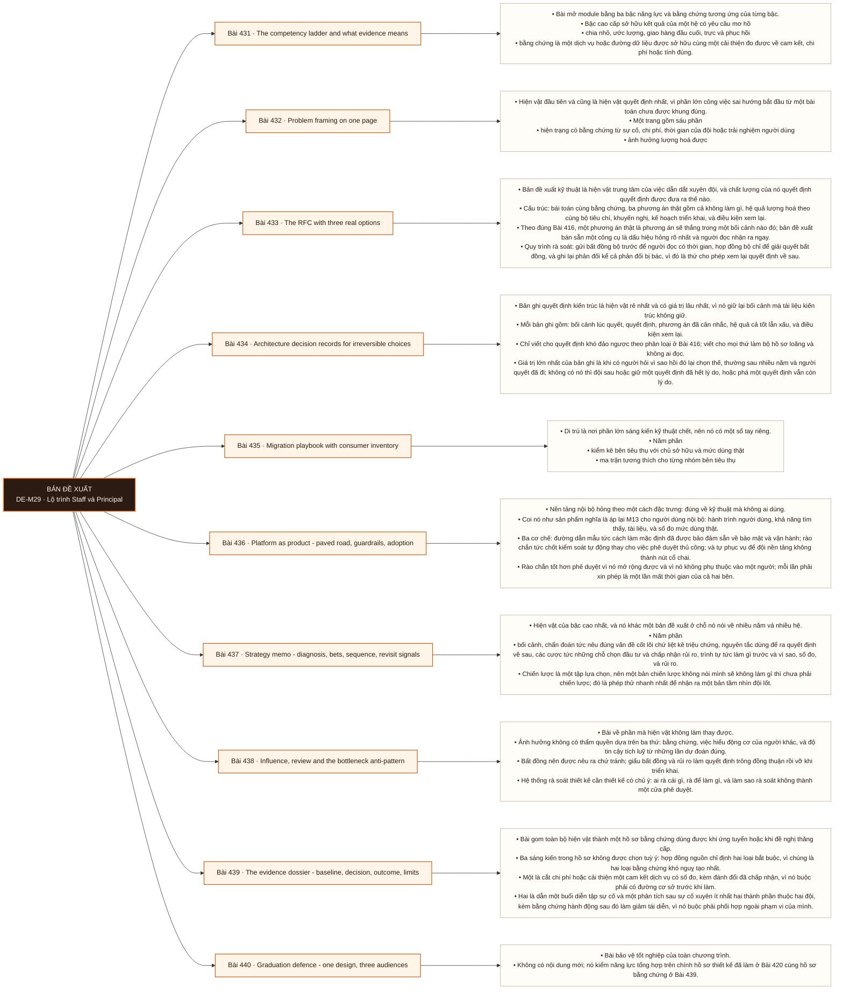

# Mô-đun 29: Lộ trình Staff và Principal

Module này không cấp danh hiệu. Bậc cao đòi phạm vi, niềm tin và kết quả trong một tổ chức thật, nên phần lớn bằng chứng chỉ tạo ra được khi đi làm. Cái module dạy được là bộ hiện vật và tiêu chuẩn chất lượng của chúng: cách khung một bài toán, cách viết một bản đề xuất có ba phương án thật, cách thiết kế một lần di trú, cách coi nền tảng như một sản phẩm, và cách đo kết quả thay vì đếm tài liệu. Ranh giới bằng chứng được giữ nghiêm suốt module: tách rõ cái làm trong lab, cái làm trong dự án cá nhân, và cái có tác động trong sản xuất; gộp ba thứ này là một dạng nói quá.

## Điều kiện đầu vào

| Mã | Người học có thể | Bằng chứng được chấp nhận |
|---|---|---|
| EN-29-01 | M01 tới M27, cộng ít nhất một hệ đã vận hành đủ lâu để có bằng chứng về sự cố, chi phí và thay đổi | Bằng chứng hoàn thành điều kiện được nêu trong cột trước |

Nếu chưa có bằng chứng đầu vào, người học phải hoàn thành lại bài hoặc mô-đun được dẫn chiếu trước khi thực hiện phép đánh giá của mô-đun này.

## Đầu ra mô-đun

Chuyển từ làm xong việc sang thay đổi cách nhiều đội làm việc, bằng hiện vật có người đọc, có áp dụng và có kết quả đo được

## Tiêu chí hoàn thành

| Mã | Bằng chứng bắt buộc | Ngưỡng đạt | Lỗi loại trực tiếp |
|---|---|---|---|
| EC-29-01 | Ba bản đề xuất được rà soát, một bản được triển khai và đo sau khi áp dụng; một lần di trú có tương thích, quay lui, chủ sở hữu, số đo và bằng chứng bên tiêu thụ thật; ít nhất hai kỹ sư hoặc hai đội làm được việc mà không cần tới mình, nhờ giao diện, tài liệu và rào chắn tốt hơn | Đạt ≥ 70/100, phần A và C đều ≥ 60%. Hai bản trình bày ở phần E mâu thuẫn về sự thật thì phần đó bằng không; gộp bằng chứng lab vào phần tác động sản xuất thì phần F bằng không. | Tuyên bố tầm ảnh hưởng nhiều đội từ một danh mục cá nhân, đếm số tài liệu như là kết quả, giấu bất đồng và rủi ro, và không đo mức áp dụng |

## Khái niệm và nguyên tắc bất biến

| Mã khái niệm | Ranh giới định nghĩa | Nguyên tắc bất biến hoặc quy tắc quyết định | Bài chính |
|---|---|---|---|
| C29-431 | Bài mở module bằng ba bậc năng lực và bằng chứng tương ứng của từng bậc. | Bậc cao cấp sở hữu kết quả của một hệ có yêu cầu mơ hồ | L431 |
| C29-432 | Hiện vật đầu tiên và cũng là hiện vật quyết định nhất, vì phần lớn công việc sai hướng bắt đầu từ một bài toán chưa được khung đúng. | Một trang gồm sáu phần | L432 |
| C29-433 | Bản đề xuất kỹ thuật là hiện vật trung tâm của việc dẫn dắt xuyên đội, và chất lượng của nó quyết định quyết định được đưa ra thế nào. | Cấu trúc: bài toán cùng bằng chứng, ba phương án thật gồm cả không làm gì, hệ quả lượng hoá theo cùng bộ tiêu chí, khuyến nghị, kế hoạch triển khai, và điều kiện xem lại. | L433 |
| C29-434 | Bản ghi quyết định kiến trúc là hiện vật rẻ nhất và có giá trị lâu nhất, vì nó giữ lại bối cảnh mà tài liệu kiến trúc không giữ. | Mỗi bản ghi gồm: bối cảnh lúc quyết, quyết định, phương án đã cân nhắc, hệ quả cả tốt lẫn xấu, và điều kiện xem lại. | L434 |
| C29-435 | Di trú là nơi phần lớn sáng kiến kỹ thuật chết, nên nó có một sổ tay riêng. | Năm phần | L435 |
| C29-436 | Nền tảng nội bộ hỏng theo một cách đặc trưng: đúng về kỹ thuật mà không ai dùng. | Coi nó như sản phẩm nghĩa là áp lại M13 cho người dùng nội bộ: hành trình người dùng, khả năng tìm thấy, tài liệu, và số đo mức dùng thật. | L436 |
| C29-437 | Hiện vật của bậc cao nhất, và nó khác một bản đề xuất ở chỗ nó nói về nhiều năm và nhiều hệ. | Năm phần | L437 |
| C29-438 | Bài về phần mà hiện vật không làm thay được. | Ảnh hưởng không có thẩm quyền dựa trên ba thứ: bằng chứng, việc hiểu động cơ của người khác, và độ tin cậy tích luỹ từ những lần dự đoán đúng. | L438 |
| C29-439 | Bài gom toàn bộ hiện vật thành một hồ sơ bằng chứng dùng được khi ứng tuyển hoặc khi đề nghị thăng cấp. | Ba sáng kiến trong hồ sơ không được chọn tuỳ ý: hợp đồng nguồn chỉ định hai loại bắt buộc, vì chúng là hai loại bằng chứng khó nguỵ tạo nhất. | L439 |
| C29-440 | Bài bảo vệ tốt nghiệp của toàn chương trình. | Không có nội dung mới; nó kiểm năng lực tổng hợp trên chính hồ sơ thiết kế đã làm ở Bài 420 cùng hồ sơ bằng chứng ở Bài 439. | L440 |

## Các bài trong mô-đun

| Bài | Dạng | Đầu ra | Bằng chứng | Điều kiện tiên quyết |
|---|---|---|---|---|
| L431 · [[wiki.staff.competency-evidence|The competency ladder and what evidence means]]| LT | Chấm bằng chứng hiện có của mình theo ba bậc và phân tách đúng ba loại bằng chứng. | Mọi mục bằng chứng phân đúng ba loại, mỗi tuyên bố về sản xuất có cách kiểm chứng từ bên ngoài, và rà soát chéo không tìm thấy chỗ nói quá. | M29: M28 |
| L432 · [[wiki.staff.problem-framing|Problem framing on one page]]| TH | Khung ba bài toán thật thành ba trang một, mỗi trang có bằng chứng định lượng cho hiện trạng. | Ba trang đều có dữ liệu cho hiện trạng và ảnh hưởng, nêu rõ người quyết định, và có tiêu chí thành công đo được. | L431 |
| L433 · [[wiki.staff.rfc-options|The RFC with three real options]]| TH | Nộp ba bản đề xuất được rà soát thật, trong đó một bản được triển khai và đo sau khi áp dụng. | Ba bản đề xuất đều được người ngoài rà soát, mỗi phương án có một bối cảnh mà nó thắng, mọi phản đối được ghi kèm cách xử lý, và bản được triển khai có số đo trước cùng sau khi áp dụng. | L432 |
| L434 · [[wiki.staff.adr-irreversible|Architecture decision records for irreversible choices]]| TH | Viết ba bản ghi cho ba quyết định khó đảo ngược, mỗi bản có hệ quả xấu và điều kiện xem lại. | Ba bản ghi có ≥ 2 hệ quả xấu cụ thể và điều kiện xem lại kiểm được bằng số đo, và người chưa tham gia hiểu được lý do chọn. | L433 |
| L435 · [[wiki.staff.migration-playbook|Migration playbook with consumer inventory]]| TH | Lập sổ tay di trú năm phần có kiểm kê từ dữ liệu thật và kế hoạch hỗ trợ bên tiêu thụ. | Kiểm kê dựa trên dữ liệu sử dụng thật với chênh lệch so với trí nhớ được ghi, mọi nhóm có đường chuyển đổi cùng chủ sở hữu, và kế hoạch có ước lượng thời gian đội dùng. | L434 |
| L436 · [[wiki.staff.platform-product|Platform as product - paved road, guardrails, adoption]]| TH | Dựng đường dẫn mẫu có rào chắn và chứng minh hai kỹ sư hoặc hai đội đưa được thay đổi lên sản xuất mà không cần tới mình. | Hai người thuộc hai đội khác nhau đều đưa được thay đổi đầu tiên lên sản xuất trong giới hạn thời gian mà không hỏi mình, ≥ 3 điểm phê duyệt được thay bằng rào chắn, và ba chỉ số mức áp dụng có số đo. | L435 |
| L437 · [[wiki.staff.strategy-memo|Strategy memo - diagnosis, bets, sequence, revisit signals]]| TH | Viết một bản chiến lược có chẩn đoán, có phần không làm, và có tín hiệu xem lại cùng người khởi động. | Bản chiến lược nêu ≥ 3 việc sẽ không làm, chẩn đoán chỉ ra vấn đề cốt lõi, và mỗi cược có tín hiệu xem lại đo được cùng người khởi động. | L436 |
| L438 · [[wiki.staff.influence-bottleneck|Influence, review and the bottleneck anti-pattern]]| LT | Nhận ra ba mẫu hỏng trong tình huống thật và thiết kế một hệ thống rà soát không thành cửa phê duyệt. | Nhận đúng mẫu hỏng ở ≥ 2/3 tình huống, hệ thống rà soát nêu rõ cách tránh thành nút cổ chai, và phép thử mức đòn bẩy được áp vào công việc của chính mình. | L437 |
| L439 · [[wiki.staff.evidence-dossier|The evidence dossier - baseline, decision, outcome, limits]]| TH | Lập hồ sơ năm phần cho ba sáng kiến, trong đó bắt buộc có một sáng kiến về chi phí hoặc cam kết dịch vụ và một buổi diễn tập xuyên hai thành phần, rồi trình bày một sáng kiến cho ba nhóm người. | Hai loại sáng kiến bắt buộc đều có mặt với số đo trước và sau, mọi mục có giới hạn nhân quả nêu rõ cùng ít nhất hai cách giải thích khác, và ba bản trình bày được đối chiếu không có mâu thuẫn về sự thật. | L438 |
| L440 · [[wiki.staff.graduation-defence|Graduation defence - one design, three audiences]]| KT | Bảo vệ một thiết kế đầu cuối trước ba nhóm người nghe, chịu được bốn ràng buộc đổi, và phân tách trung thực ba loại bằng chứng. | Đạt ≥ 70/100, phần A và C đều ≥ 60%. Hai bản trình bày ở phần E mâu thuẫn về sự thật thì phần đó bằng không; gộp bằng chứng lab vào phần tác động sản xuất thì phần F bằng không. | L439 |

## Nội dung từng bài

> **Sơ đồ đề xuất: DE-M29 v0.1.0.** Mỗi nhánh đi từ một bài học đến các nội dung nguyên tử bắt buộc. Thứ tự dạy lấy từ bảng `Các bài trong mô-đun`.

### Lesson 431: The competency ladder and what evidence means

Bài mở module bằng ba bậc năng lực và bằng chứng tương ứng của từng bậc. Bậc cao cấp sở hữu kết quả của một hệ có yêu cầu mơ hồ: chia nhỏ, ước lượng, giao hàng đầu cuối, trực và phục hồi; bằng chứng là một dịch vụ hoặc đường dữ liệu được sở hữu cùng một cải thiện đo được về cam kết, chi phí hoặc tính đúng. Bậc tiếp theo dẫn dắt kỹ thuật xuyên đội: nhận ra vấn đề hệ thống, lập bản đồ bên liên quan cùng động cơ cùng phụ thuộc, viết đề xuất, điều phối rà soát và giải quyết bất đồng, dựng kiến trúc đích cùng đường di trú từng bước, và coi nền tảng như sản phẩm. Bậc cao nhất định hướng toàn tổ chức. Danh hiệu thay đổi theo công ty, còn bằng chứng thì không: bằng chứng là quyết định, kết quả và mức đòn bẩy. Ranh giới bằng chứng phải giữ nghiêm: lab khác dự án cá nhân, và cả hai khác tác động trong sản xuất.

Người học phải chấm bằng chứng hiện có của mình theo ba bậc và phân tách đúng ba loại bằng chứng. Bằng chứng thực hành: Liệt kê mọi bằng chứng hiện có. Phân mỗi mục vào lab, dự án cá nhân, hay tác động trong sản xuất. Với mỗi mục thuộc loại thứ ba, ghi cách một người bên ngoài kiểm chứng được. Chấm theo ba bậc và chỉ ra khoảng trống lớn nhất. Đổi bài chéo: người khác đọc và đánh dấu mọi chỗ nói quá. Bài hoàn tất khi mọi mục bằng chứng phân đúng ba loại, mỗi tuyên bố về sản xuất có cách kiểm chứng từ bên ngoài, và rà soát chéo không tìm thấy chỗ nói quá.

Cách đánh giá: Tầng *hiểu*. Bài mở module, đặt chuẩn bằng chứng. Kiểm bằng bài tự chấm có rà soát chéo; đạt khi mọi mục bằng chứng được phân đúng ba loại và mỗi tuyên bố có một cách kiểm chứng từ bên ngoài.

### Lesson 432: Problem framing on one page

Hiện vật đầu tiên và cũng là hiện vật quyết định nhất, vì phần lớn công việc sai hướng bắt đầu từ một bài toán chưa được khung đúng. Một trang gồm sáu phần: hiện trạng có bằng chứng từ sự cố, chi phí, thời gian của đội hoặc trải nghiệm người dùng; ảnh hưởng lượng hoá được; ai chịu ảnh hưởng và ai quyết định; ràng buộc gồm cả ràng buộc về tổ chức; phi mục tiêu; và tiêu chí thành công đo được. Phần hiện trạng phải có dữ liệu chứ ý kiến, và đây là phần phân biệt một bài toán thật với một sở thích kỹ thuật. Ba dấu hiệu một bài toán chưa được khung đúng: giải pháp đã có tên trước khi vấn đề được mô tả; không ai đo được nó đang tốn bao nhiêu; và không rõ ai sẽ quyết. Nối với Bài 1: phát biểu bài toán sáu phần áp ở đây với thêm chiều tổ chức.

Người học phải khung ba bài toán thật thành ba trang một, mỗi trang có bằng chứng định lượng cho hiện trạng. Bằng chứng thực hành: Chọn ba vấn đề thật từ hệ đã dựng hoặc từ nơi làm việc. Với mỗi cái, thu bằng chứng định lượng cho hiện trạng: số sự cố, giờ công, chi phí, hoặc số đo trải nghiệm. Viết một trang đủ sáu phần. Đổi bài chéo và nhờ người khác tìm chỗ nào là ý kiến chứ dữ liệu. Sửa theo phản hồi. Bài hoàn tất khi ba trang đều có dữ liệu cho hiện trạng và ảnh hưởng, nêu rõ người quyết định, và có tiêu chí thành công đo được.

Cách đánh giá: Tầng *áp dụng*. Objective đòi bằng chứng chứ ý kiến. Kiểm bằng rà soát chéo; đạt khi cả ba trang có dữ liệu cho hiện trạng và ảnh hưởng, và mỗi trang nêu rõ người quyết định cùng tiêu chí thành công đo được.

### Lesson 433: The RFC with three real options

Bản đề xuất kỹ thuật là hiện vật trung tâm của việc dẫn dắt xuyên đội, và chất lượng của nó quyết định quyết định được đưa ra thế nào. Cấu trúc: bài toán cùng bằng chứng, ba phương án thật gồm cả không làm gì, hệ quả lượng hoá theo cùng bộ tiêu chí, khuyến nghị, kế hoạch triển khai, và điều kiện xem lại. Theo đúng Bài 416, một phương án thật là phương án sẽ thắng trong một bối cảnh nào đó; bản đề xuất bán sẵn một công cụ là dấu hiệu hỏng rõ nhất và người đọc nhận ra ngay. Quy trình rà soát: gửi bất đồng bộ trước để người đọc có thời gian, họp đồng bộ chỉ để giải quyết bất đồng, và ghi lại phản đối kể cả phản đối bị bác, vì đó là thứ cho phép xem lại quyết định về sau. Quyết định phải ghi ai quyết và quyết vào lúc nào. Ba lý do một bản đề xuất tốt vẫn không dẫn tới thay đổi.

Người học phải nộp ba bản đề xuất được rà soát thật, trong đó một bản được triển khai và đo sau khi áp dụng. Bằng chứng thực hành: Từ ba trang khung bài toán ở Bài 432, viết ba bản đề xuất đầy đủ. Gửi mỗi bản cho ít nhất ba người đọc và thu phản hồi bất đồng bộ. Tổ chức một buổi rà soát chỉ để giải quyết bất đồng. Ghi biên bản gồm mọi phản đối, cách xử lý từng phản đối, quyết định và người quyết. Chọn một bản, triển khai nó, rồi đo kết quả sau khi có người dùng thật: số đo trước, số đo sau, mức áp dụng, và phần chưa đạt. Viết điều kiện xem lại quyết định cho cả ba. Bài hoàn tất khi ba bản đề xuất đều được người ngoài rà soát, mỗi phương án có một bối cảnh mà nó thắng, mọi phản đối được ghi kèm cách xử lý, và bản được triển khai có số đo trước cùng sau khi áp dụng.

Cách đánh giá: Tầng *đánh giá*. Objective đo cả hiện vật, quá trình dẫn tới quyết định, và kết quả sau khi áp dụng. Kiểm bằng ba bản đề xuất cộng số đo sau áp dụng; đạt khi cả ba được rà soát bởi người ngoài, mọi phản đối được ghi kèm cách xử lý, và bản được triển khai có số đo trước và sau.

### Lesson 434: Architecture decision records for irreversible choices

Bản ghi quyết định kiến trúc là hiện vật rẻ nhất và có giá trị lâu nhất, vì nó giữ lại bối cảnh mà tài liệu kiến trúc không giữ. Mỗi bản ghi gồm: bối cảnh lúc quyết, quyết định, phương án đã cân nhắc, hệ quả cả tốt lẫn xấu, và điều kiện xem lại. Chỉ viết cho quyết định khó đảo ngược theo phân loại ở Bài 416; viết cho mọi thứ làm bộ hồ sơ loãng và không ai đọc. Giá trị lớn nhất của bản ghi là khi có người hỏi vì sao hồi đó lại chọn thế, thường sau nhiều năm và người quyết đã đi; không có nó thì đội sau hoặc giữ một quyết định đã hết lý do, hoặc phá một quyết định vẫn còn lý do. Hệ quả xấu phải viết thật: một bản ghi chỉ liệt kê ưu điểm là một bản quảng cáo. Bản ghi bất biến: quyết định đổi thì viết bản mới và đánh dấu bản cũ đã bị thay thế, chứ sửa bản cũ.

Người học phải viết ba bản ghi cho ba quyết định khó đảo ngược, mỗi bản có hệ quả xấu và điều kiện xem lại. Bằng chứng thực hành: Chọn ba quyết định khó đảo ngược trong hệ đã dựng. Viết bản ghi cho từng cái. Với mỗi bản, liệt kê ít nhất hai hệ quả xấu cụ thể và một điều kiện xem lại có thể kiểm bằng số đo. Đưa cho một người chưa tham gia quyết định và hỏi họ có hiểu vì sao chọn vậy không. Thay thế một bản ghi cũ và giữ bản cũ. Bài hoàn tất khi ba bản ghi có ≥ 2 hệ quả xấu cụ thể và điều kiện xem lại kiểm được bằng số đo, và người chưa tham gia hiểu được lý do chọn.

Cách đánh giá: Tầng *áp dụng*. Objective đòi trung thực về hệ quả xấu. Kiểm bằng rà soát chéo; đạt khi cả ba bản có ít nhất hai hệ quả xấu cụ thể và điều kiện xem lại kiểm được, và không bản nào viết cho quyết định dễ đảo.

### Lesson 435: Migration playbook with consumer inventory

Di trú là nơi phần lớn sáng kiến kỹ thuật chết, nên nó có một sổ tay riêng. Năm phần: kiểm kê bên tiêu thụ với chủ sở hữu và mức dùng thật; ma trận tương thích cho từng nhóm bên tiêu thụ; chạy song song có tiêu chí đối soát theo Bài 417; chuyển đổi theo từng phần với đường quay lui; và khai tử có thời hạn cùng theo dõi mức dùng còn lại. Kiểm kê phải dựa trên dữ liệu sử dụng thật chứ trên trí nhớ, vì bên tiêu thụ luôn nhiều hơn người ta nghĩ, và những bên không ai nhớ chính là những bên sẽ hỏng. Hỗ trợ bên tiêu thụ là một phần của kế hoạch chứ một việc phát sinh: đường dẫn mẫu, công cụ chuyển đổi, tài liệu, và thời gian của người. Chế độ hỏng đặc trưng về tổ chức: di trú làm quá tải đội dùng, nên họ hoãn, nên hệ cũ sống mãi và ta phải nuôi hai hệ.

Người học phải lập sổ tay di trú năm phần có kiểm kê từ dữ liệu thật và kế hoạch hỗ trợ bên tiêu thụ. Bằng chứng thực hành: Chọn một thay đổi cần di trú. Lập kiểm kê bên tiêu thụ từ nhật ký truy vấn cùng khai báo theo Bài 265. So với danh sách từ trí nhớ và ghi chênh lệch. Lập ma trận tương thích theo nhóm. Thiết kế chạy song song và chuyển đổi từng phần. Ước lượng thời gian mà mỗi đội dùng phải bỏ ra và lập kế hoạch hỗ trợ. Đặt thời hạn khai tử và cách theo dõi mức dùng còn lại. Bài hoàn tất khi kiểm kê dựa trên dữ liệu sử dụng thật với chênh lệch so với trí nhớ được ghi, mọi nhóm có đường chuyển đổi cùng chủ sở hữu, và kế hoạch có ước lượng thời gian đội dùng.

Cách đánh giá: Tầng *áp dụng*. Objective gồm cả chiều tổ chức chứ chỉ kỹ thuật. Kiểm bằng rà soát sổ tay; đạt khi kiểm kê dựa trên dữ liệu sử dụng thật, mọi nhóm bên tiêu thụ có đường chuyển đổi cùng chủ sở hữu, và kế hoạch có ước lượng thời gian của đội dùng.

### Lesson 436: Platform as product - paved road, guardrails, adoption

Nền tảng nội bộ hỏng theo một cách đặc trưng: đúng về kỹ thuật mà không ai dùng. Coi nó như sản phẩm nghĩa là áp lại M13 cho người dùng nội bộ: hành trình người dùng, khả năng tìm thấy, tài liệu, và số đo mức dùng thật. Ba cơ chế: đường dẫn mẫu tức cách làm mặc định đã được bảo đảm sẵn về bảo mật và vận hành; rào chắn tức chốt kiểm soát tự động thay cho việc phê duyệt thủ công; và tự phục vụ để đội nền tảng không thành nút cổ chai. Rào chắn tốt hơn phê duyệt vì nó mở rộng được và vì nó không phụ thuộc vào một người; mỗi lần phải xin phép là một lần mất thời gian của cả hai bên. Đo mức áp dụng bằng chỉ số hợp lệ theo Bài 197: tỉ lệ đội dùng đường dẫn mẫu, thời gian tới thay đổi đầu tiên chạy được ở sản xuất, và tỉ lệ việc làm được không cần mở phiếu; số phiếu đã đóng không phải chỉ số.

Người học phải dựng đường dẫn mẫu có rào chắn và chứng minh hai kỹ sư hoặc hai đội đưa được thay đổi lên sản xuất mà không cần tới mình. Bằng chứng thực hành: Chọn một quy trình mà đội dùng hay phải xin phê duyệt. Dựng đường dẫn mẫu gồm khuôn mẫu, tài liệu và ví dụ chạy được. Thay ít nhất ba điểm phê duyệt thủ công bằng rào chắn tự động. Nhờ hai người thuộc hai đội khác nhau dùng đường dẫn mẫu và bấm giờ tới thay đổi đầu tiên chạy được; đếm số lần họ phải hỏi mình. Đo ba chỉ số mức áp dụng và ghi mọi chỗ họ vấp; mỗi lần phải hỏi là một thiếu sót của tài liệu hoặc của rào chắn, sửa rồi đo lại với người thứ hai. Bài hoàn tất khi hai người thuộc hai đội khác nhau đều đưa được thay đổi đầu tiên lên sản xuất trong giới hạn thời gian mà không hỏi mình, ≥ 3 điểm phê duyệt được thay bằng rào chắn, và ba chỉ số mức áp dụng có số đo.

Cách đánh giá: Tầng *đánh giá*. Objective đo bằng hành vi người dùng nội bộ chứ bằng tính năng đã xây. Kiểm bằng phép thử người; đạt khi hai người thuộc hai đội khác nhau đều đưa được thay đổi đầu tiên lên sản xuất trong giới hạn thời gian mà không hỏi mình, và ít nhất ba rào chắn thay được phê duyệt thủ công.

### Lesson 437: Strategy memo - diagnosis, bets, sequence, revisit signals

Hiện vật của bậc cao nhất, và nó khác một bản đề xuất ở chỗ nó nói về nhiều năm và nhiều hệ. Năm phần: bối cảnh, chẩn đoán tức nêu đúng vấn đề cốt lõi chứ liệt kê triệu chứng, nguyên tắc dùng để ra quyết định về sau, các cược tức những chỗ chọn đầu tư và chấp nhận rủi ro, trình tự tức làm gì trước và vì sao, số đo, và rủi ro. Chiến lược là một tập lựa chọn, nên một bản chiến lược không nói mình sẽ không làm gì thì chưa phải chiến lược; đó là phép thử nhanh nhất để nhận ra một bản tầm nhìn đội lốt. Tín hiệu xem lại phải viết ra cùng lúc: điều gì xảy ra thì chiến lược này không còn đúng, và ai được quyền khởi động việc xem lại. Chi phí chìm là cái bẫy đặc trưng: chiến lược đã sai vì thị trường hoặc tổ chức đổi mà vẫn tiếp tục vì đã bỏ nhiều công vào.

Người học phải viết một bản chiến lược có chẩn đoán, có phần không làm, và có tín hiệu xem lại cùng người khởi động. Bằng chứng thực hành: Chọn một phạm vi nhiều hệ. Viết bản chiến lược đủ năm phần. Trong phần các cược, nêu ít nhất ba việc sẽ không làm và lý do. Với mỗi cược, viết một tín hiệu cho biết nó sai kèm cách đo. Ghi ai được quyền khởi động việc xem lại. Đổi bài chéo và nhờ người khác tìm chỗ nào là tầm nhìn chứ lựa chọn. Bài hoàn tất khi bản chiến lược nêu ≥ 3 việc sẽ không làm, chẩn đoán chỉ ra vấn đề cốt lõi, và mỗi cược có tín hiệu xem lại đo được cùng người khởi động.

Cách đánh giá: Tầng *đánh giá*. Objective đòi lựa chọn chứ mong muốn. Kiểm bằng rà soát chéo; đạt khi bản chiến lược nêu rõ ít nhất ba việc sẽ không làm, chẩn đoán chỉ ra vấn đề cốt lõi chứ triệu chứng, và tín hiệu xem lại kiểm được kèm người có quyền khởi động.

### Lesson 438: Influence, review and the bottleneck anti-pattern

Bài về phần mà hiện vật không làm thay được. Ảnh hưởng không có thẩm quyền dựa trên ba thứ: bằng chứng, việc hiểu động cơ của người khác, và độ tin cậy tích luỹ từ những lần dự đoán đúng. Bất đồng nên được nêu ra chứ tránh; giấu bất đồng và rủi ro làm quyết định trông đồng thuận rồi vỡ khi triển khai. Hệ thống rà soát thiết kế cần thiết kế có chủ ý: ai rà cái gì, rà để làm gì, và làm sao rà soát không thành một cửa phê duyệt. Ba mẫu hỏng đặc trưng của bậc cao: trở thành nút cổ chai vì mọi thứ phải qua mình; giữ bối cảnh cho riêng mình nên đội không tự quyết được; và đi giải cứu các đội thay vì làm cho họ tự làm được. Phép thử của mức đòn bẩy: sau khi mình rời đi, hai đội có tiếp tục làm đúng không, nhờ giao diện, tài liệu và rào chắn tốt hơn chứ nhờ trí nhớ của ai đó.

Người học phải nhận ra ba mẫu hỏng trong tình huống thật và thiết kế một hệ thống rà soát không thành cửa phê duyệt. Bằng chứng thực hành: Cho ba tình huống về một người dẫn dắt kỹ thuật; nhận ra mẫu hỏng trong từng cái và đề xuất cách đổi. Thiết kế một hệ thống rà soát thiết kế cho một tổ chức giả định: ai rà cái gì, tiêu chí nào cần rà và tiêu chí nào để rào chắn tự động lo. Áp phép thử mức đòn bẩy vào công việc của chính mình và chỉ ra chỗ mình đang là nút cổ chai. Bài hoàn tất khi nhận đúng mẫu hỏng ở ≥ 2/3 tình huống, hệ thống rà soát nêu rõ cách tránh thành nút cổ chai, và phép thử mức đòn bẩy được áp vào công việc của chính mình.

Cách đánh giá: Tầng *hiểu*. Bài lý thuyết chuẩn bị cho bài hồ sơ bằng chứng. Kiểm bằng bài phân tích ba tình huống cộng một thiết kế; đạt khi nhận đúng mẫu hỏng ở ít nhất hai tình huống và hệ thống rà soát nêu rõ cách nó không thành nút cổ chai.

### Lesson 439: The evidence dossier - baseline, decision, outcome, limits

Bài gom toàn bộ hiện vật thành một hồ sơ bằng chứng dùng được khi ứng tuyển hoặc khi đề nghị thăng cấp. Ba sáng kiến trong hồ sơ không được chọn tuỳ ý: hợp đồng nguồn chỉ định hai loại bắt buộc, vì chúng là hai loại bằng chứng khó nguỵ tạo nhất. Một là cắt chi phí hoặc cải thiện một cam kết dịch vụ có số đo, kèm đánh đổi đã chấp nhận, vì nó buộc phải có đường cơ sở trước khi làm. Hai là dẫn một buổi diễn tập sự cố và một phân tích sau sự cố xuyên ít nhất hai thành phần thuộc hai đội, kèm bằng chứng hành động sau đó làm giảm tái diễn, vì nó buộc phải phối hợp ngoài phạm vi của mình. Sáng kiến thứ ba tự chọn. Mỗi mục có năm phần: đường cơ sở trước khi làm, quyết định cùng lý do, việc triển khai cùng mức áp dụng, kết quả đo được, và giới hạn của lập luận nhân quả; phần cuối là phần hiếm ai viết và là phần làm hồ sơ đáng tin: kết quả tốt có thể do nhiều nguyên nhân, và nói rõ điều đó mạnh hơn là tuyên bố chắc chắn. Ranh giới bằng chứng giữ nghiêm theo Bài 431. Cùng một sáng kiến trình bày cho ba nhóm người khác nhau: ban lãnh đạo cần phương án, mức rủi ro và kinh tế; kỹ sư cần đánh đổi kỹ thuật; người vận hành cần thay đổi trong công việc hằng ngày. Ba bản trình bày khác về chi tiết nhưng không được khác về sự thật, và đây là ranh giới đạo đức của bài.

Người học phải lập hồ sơ năm phần cho ba sáng kiến, trong đó bắt buộc có một sáng kiến về chi phí hoặc cam kết dịch vụ và một buổi diễn tập xuyên hai thành phần, rồi trình bày một sáng kiến cho ba nhóm người. Bằng chứng thực hành: Thực hiện sáng kiến bắt buộc thứ nhất: đo đường cơ sở, cắt chi phí hoặc cải thiện một cam kết dịch vụ, đo lại, và báo cáo đánh đổi đã chấp nhận. Thực hiện sáng kiến bắt buộc thứ hai: dẫn một buổi diễn tập sự cố xuyên hai thành phần thuộc hai đội, viết phân tích sau sự cố, rồi theo dõi xem hành động có làm giảm tái diễn không. Lập hồ sơ cho ba sáng kiến, mỗi cái đủ năm phần. Với mỗi kết quả, nêu ít nhất hai cách giải thích khác. Chọn một sáng kiến và chuẩn bị ba bản trình bày: mười phút cho ban lãnh đạo, sáu mươi phút cho kỹ sư, và một bản hướng dẫn cho người vận hành. Trình bày cả ba và nhờ người nghe đối chiếu xem có mâu thuẫn không. Bài hoàn tất khi hai loại sáng kiến bắt buộc đều có mặt với số đo trước và sau, mọi mục có giới hạn nhân quả nêu rõ cùng ít nhất hai cách giải thích khác, và ba bản trình bày được đối chiếu không có mâu thuẫn về sự thật.

Cách đánh giá: Tầng *đánh giá*. Objective đòi trung thực về giới hạn nhân quả. Kiểm bằng rà soát hồ sơ cộng ba lần trình bày; đạt khi hai loại sáng kiến bắt buộc đều có mặt kèm số đo trước và sau, mọi mục có giới hạn nhân quả nêu rõ, và ba bản trình bày nhất quán về sự thật khi đối chiếu.

### Lesson 440: Graduation defence - one design, three audiences

Bài bảo vệ tốt nghiệp của toàn chương trình. Không có nội dung mới; nó kiểm năng lực tổng hợp trên chính hồ sơ thiết kế đã làm ở Bài 420 cùng hồ sơ bằng chứng ở Bài 439.

Người học phải bảo vệ một thiết kế đầu cuối trước ba nhóm người nghe, chịu được bốn ràng buộc đổi, và phân tách trung thực ba loại bằng chứng. Bằng chứng thực hành: Hội đồng ba người. Bài chấm sáu phần: A (20đ) trình bày hồ sơ thiết kế, mọi thành phần truy được về một yêu cầu hoặc bảo đảm · B (20đ) bảo vệ bảng năng lực và bảng chế độ hỏng, chỉ ra nút thắt đầu tiên cùng hệ quả với dữ liệu · C (20đ) bốn ràng buộc đổi do hội đồng đưa ra; điều chỉnh đúng phần bị ảnh hưởng kèm chi phí · D (15đ) trình kế hoạch di trú có kiểm kê bên tiêu thụ, chạy song song và quay lui · E (15đ) cùng một sáng kiến trình bày mười phút cho ban lãnh đạo và mười phút cho người vận hành; hội đồng đối chiếu tính nhất quán · F (10đ) hồ sơ bằng chứng, phân tách ba loại và nêu giới hạn nhân quả. Bài hoàn tất khi đạt ≥ 70/100, phần A và C đều ≥ 60%. Hai bản trình bày ở phần E mâu thuẫn về sự thật thì phần đó bằng không; gộp bằng chứng lab vào phần tác động sản xuất thì phần F bằng không.

Cách đánh giá: Tầng *đánh giá*. Bài bảo vệ cuối cùng, đo năng lực thiết kế, năng lực truyền đạt và tính trung thực về bằng chứng.

## Lý do sắp xếp

Mô-đun bắt đầu từ `M29: M28` và đi theo các quan hệ tiên quyết đã ghi trong bảng. Mỗi bài chỉ sử dụng khái niệm hoặc thao tác đã được giới thiệu trước đó; bài cuối L440 tích hợp đầu ra của toàn mô-đun.

## Ma trận đánh giá

| Mã đầu ra | Mức độ tư duy | Cách đánh giá | Ngưỡng đạt | Hình thức kiểm tra lại |
|---|---|---|---|---|
| L431 | Hiểu | Tầng *hiểu*. Bài mở module, đặt chuẩn bằng chứng. Kiểm bằng bài tự chấm có rà soát chéo; đạt khi mọi mục bằng chứng được phân đúng ba loại và mỗi tuyên bố có một cách kiểm chứng từ bên ngoài. | Mọi mục bằng chứng phân đúng ba loại, mỗi tuyên bố về sản xuất có cách kiểm chứng từ bên ngoài, và rà soát chéo không tìm thấy chỗ nói quá. | Tình huống mới, giữ nguyên đầu ra và ngưỡng |
| L432 | Áp dụng | Tầng *áp dụng*. Objective đòi bằng chứng chứ ý kiến. Kiểm bằng rà soát chéo; đạt khi cả ba trang có dữ liệu cho hiện trạng và ảnh hưởng, và mỗi trang nêu rõ người quyết định cùng tiêu chí thành công đo được. | Ba trang đều có dữ liệu cho hiện trạng và ảnh hưởng, nêu rõ người quyết định, và có tiêu chí thành công đo được. | Tình huống mới, giữ nguyên đầu ra và ngưỡng |
| L433 | Đánh giá | Tầng *đánh giá*. Objective đo cả hiện vật, quá trình dẫn tới quyết định, và kết quả sau khi áp dụng. Kiểm bằng ba bản đề xuất cộng số đo sau áp dụng; đạt khi cả ba được rà soát bởi người ngoài, mọi phản đối được ghi kèm cách xử lý, và bản được triển khai có số đo trước và sau. | Ba bản đề xuất đều được người ngoài rà soát, mỗi phương án có một bối cảnh mà nó thắng, mọi phản đối được ghi kèm cách xử lý, và bản được triển khai có số đo trước cùng sau khi áp dụng. | Tình huống mới, giữ nguyên đầu ra và ngưỡng |
| L434 | Áp dụng | Tầng *áp dụng*. Objective đòi trung thực về hệ quả xấu. Kiểm bằng rà soát chéo; đạt khi cả ba bản có ít nhất hai hệ quả xấu cụ thể và điều kiện xem lại kiểm được, và không bản nào viết cho quyết định dễ đảo. | Ba bản ghi có ≥ 2 hệ quả xấu cụ thể và điều kiện xem lại kiểm được bằng số đo, và người chưa tham gia hiểu được lý do chọn. | Tình huống mới, giữ nguyên đầu ra và ngưỡng |
| L435 | Áp dụng | Tầng *áp dụng*. Objective gồm cả chiều tổ chức chứ chỉ kỹ thuật. Kiểm bằng rà soát sổ tay; đạt khi kiểm kê dựa trên dữ liệu sử dụng thật, mọi nhóm bên tiêu thụ có đường chuyển đổi cùng chủ sở hữu, và kế hoạch có ước lượng thời gian của đội dùng. | Kiểm kê dựa trên dữ liệu sử dụng thật với chênh lệch so với trí nhớ được ghi, mọi nhóm có đường chuyển đổi cùng chủ sở hữu, và kế hoạch có ước lượng thời gian đội dùng. | Tình huống mới, giữ nguyên đầu ra và ngưỡng |
| L436 | Đánh giá | Tầng *đánh giá*. Objective đo bằng hành vi người dùng nội bộ chứ bằng tính năng đã xây. Kiểm bằng phép thử người; đạt khi hai người thuộc hai đội khác nhau đều đưa được thay đổi đầu tiên lên sản xuất trong giới hạn thời gian mà không hỏi mình, và ít nhất ba rào chắn thay được phê duyệt thủ công. | Hai người thuộc hai đội khác nhau đều đưa được thay đổi đầu tiên lên sản xuất trong giới hạn thời gian mà không hỏi mình, ≥ 3 điểm phê duyệt được thay bằng rào chắn, và ba chỉ số mức áp dụng có số đo. | Tình huống mới, giữ nguyên đầu ra và ngưỡng |
| L437 | Đánh giá | Tầng *đánh giá*. Objective đòi lựa chọn chứ mong muốn. Kiểm bằng rà soát chéo; đạt khi bản chiến lược nêu rõ ít nhất ba việc sẽ không làm, chẩn đoán chỉ ra vấn đề cốt lõi chứ triệu chứng, và tín hiệu xem lại kiểm được kèm người có quyền khởi động. | Bản chiến lược nêu ≥ 3 việc sẽ không làm, chẩn đoán chỉ ra vấn đề cốt lõi, và mỗi cược có tín hiệu xem lại đo được cùng người khởi động. | Tình huống mới, giữ nguyên đầu ra và ngưỡng |
| L438 | Hiểu | Tầng *hiểu*. Bài lý thuyết chuẩn bị cho bài hồ sơ bằng chứng. Kiểm bằng bài phân tích ba tình huống cộng một thiết kế; đạt khi nhận đúng mẫu hỏng ở ít nhất hai tình huống và hệ thống rà soát nêu rõ cách nó không thành nút cổ chai. | Nhận đúng mẫu hỏng ở ≥ 2/3 tình huống, hệ thống rà soát nêu rõ cách tránh thành nút cổ chai, và phép thử mức đòn bẩy được áp vào công việc của chính mình. | Tình huống mới, giữ nguyên đầu ra và ngưỡng |
| L439 | Đánh giá | Tầng *đánh giá*. Objective đòi trung thực về giới hạn nhân quả. Kiểm bằng rà soát hồ sơ cộng ba lần trình bày; đạt khi hai loại sáng kiến bắt buộc đều có mặt kèm số đo trước và sau, mọi mục có giới hạn nhân quả nêu rõ, và ba bản trình bày nhất quán về sự thật khi đối chiếu. | Hai loại sáng kiến bắt buộc đều có mặt với số đo trước và sau, mọi mục có giới hạn nhân quả nêu rõ cùng ít nhất hai cách giải thích khác, và ba bản trình bày được đối chiếu không có mâu thuẫn về sự thật. | Tình huống mới, giữ nguyên đầu ra và ngưỡng |
| L440 | Đánh giá | Tầng *đánh giá*. Bài bảo vệ cuối cùng, đo năng lực thiết kế, năng lực truyền đạt và tính trung thực về bằng chứng. | Đạt ≥ 70/100, phần A và C đều ≥ 60%. Hai bản trình bày ở phần E mâu thuẫn về sự thật thì phần đó bằng không; gộp bằng chứng lab vào phần tác động sản xuất thì phần F bằng không. | Tình huống mới, giữ nguyên đầu ra và ngưỡng |

Không cộng điểm để bù cho lỗi loại trực tiếp. Người học phải sửa đúng lỗi, nộp lại bằng chứng và thực hiện kiểm tra lại trên một tình huống khác.

## Bài thực hành bắt buộc

| Bài thực hành hoặc dự án | Bài liên quan | Sản phẩm bắt buộc | Lỗi được cài vào tình huống |
|---|---|---|---|
| The competency ladder and what evidence means | L431 | Liệt kê mọi bằng chứng hiện có. Phân mỗi mục vào lab, dự án cá nhân, hay tác động trong sản xuất. Với mỗi mục thuộc loại thứ ba, ghi cách một người bên ngoài kiểm chứng được. Chấm theo ba bậc và chỉ ra khoảng trống lớn nhất. Đổi bài chéo: người khác đọc và đánh dấu mọi chỗ nói quá. | Gộp bằng chứng lab với bằng chứng sản xuất · tuyên bố bậc cao từ việc học xong chương trình · đếm dự án thay vì nêu kết quả · không có cách để bên ngoài kiểm chứng. |
| Problem framing on one page | L432 | Chọn ba vấn đề thật từ hệ đã dựng hoặc từ nơi làm việc. Với mỗi cái, thu bằng chứng định lượng cho hiện trạng: số sự cố, giờ công, chi phí, hoặc số đo trải nghiệm. Viết một trang đủ sáu phần. Đổi bài chéo và nhờ người khác tìm chỗ nào là ý kiến chứ dữ liệu. Sửa theo phản hồi. | Đặt tên giải pháp trước khi mô tả vấn đề · mô tả hiện trạng bằng cảm nhận · bỏ phi mục tiêu · không nêu ai là người quyết định. |
| The RFC with three real options | L433 | Từ ba trang khung bài toán ở Bài 432, viết ba bản đề xuất đầy đủ. Gửi mỗi bản cho ít nhất ba người đọc và thu phản hồi bất đồng bộ. Tổ chức một buổi rà soát chỉ để giải quyết bất đồng. Ghi biên bản gồm mọi phản đối, cách xử lý từng phản đối, quyết định và người quyết. Chọn một bản, triển khai nó, rồi đo kết quả sau khi có người dùng thật: số đo trước, số đo sau, mức áp dụng, và phần chưa đạt. Viết điều kiện xem lại quyết định cho cả ba. | Dựng phương án rơm · bỏ qua phản đối bị bác · họp trước khi người đọc kịp đọc · không ghi ai là người quyết · coi bản đề xuất được duyệt là kết quả, trong khi kết quả là số đo sau khi có người dùng. |
| Architecture decision records for irreversible choices | L434 | Chọn ba quyết định khó đảo ngược trong hệ đã dựng. Viết bản ghi cho từng cái. Với mỗi bản, liệt kê ít nhất hai hệ quả xấu cụ thể và một điều kiện xem lại có thể kiểm bằng số đo. Đưa cho một người chưa tham gia quyết định và hỏi họ có hiểu vì sao chọn vậy không. Thay thế một bản ghi cũ và giữ bản cũ. | Viết bản ghi cho mọi quyết định · chỉ liệt kê ưu điểm · sửa bản ghi cũ khi quyết định đổi · viết điều kiện xem lại mơ hồ không kiểm được. |
| Migration playbook with consumer inventory | L435 | Chọn một thay đổi cần di trú. Lập kiểm kê bên tiêu thụ từ nhật ký truy vấn cùng khai báo theo Bài 265. So với danh sách từ trí nhớ và ghi chênh lệch. Lập ma trận tương thích theo nhóm. Thiết kế chạy song song và chuyển đổi từng phần. Ước lượng thời gian mà mỗi đội dùng phải bỏ ra và lập kế hoạch hỗ trợ. Đặt thời hạn khai tử và cách theo dõi mức dùng còn lại. | Kiểm kê bằng trí nhớ · chuyển đổi toàn bộ một lần · không tính thời gian của đội dùng · gỡ hệ cũ theo lịch thay vì theo mức dùng còn lại. |
| Platform as product - paved road, guardrails, adoption | L436 | Chọn một quy trình mà đội dùng hay phải xin phê duyệt. Dựng đường dẫn mẫu gồm khuôn mẫu, tài liệu và ví dụ chạy được. Thay ít nhất ba điểm phê duyệt thủ công bằng rào chắn tự động. Nhờ hai người thuộc hai đội khác nhau dùng đường dẫn mẫu và bấm giờ tới thay đổi đầu tiên chạy được; đếm số lần họ phải hỏi mình. Đo ba chỉ số mức áp dụng và ghi mọi chỗ họ vấp; mỗi lần phải hỏi là một thiếu sót của tài liệu hoặc của rào chắn, sửa rồi đo lại với người thứ hai. | Xây nền tảng rồi chờ người ta tới · đo bằng số phiếu đã đóng · giữ phê duyệt thủ công vì an tâm hơn · không có ví dụ chạy được trong tài liệu. |
| Strategy memo - diagnosis, bets, sequence, revisit signals | L437 | Chọn một phạm vi nhiều hệ. Viết bản chiến lược đủ năm phần. Trong phần các cược, nêu ít nhất ba việc sẽ không làm và lý do. Với mỗi cược, viết một tín hiệu cho biết nó sai kèm cách đo. Ghi ai được quyền khởi động việc xem lại. Đổi bài chéo và nhờ người khác tìm chỗ nào là tầm nhìn chứ lựa chọn. | Viết tầm nhìn mà không có lựa chọn · liệt kê triệu chứng thay vì chẩn đoán · không nêu việc sẽ không làm · tín hiệu xem lại mơ hồ không đo được. |
| Influence, review and the bottleneck anti-pattern | L438 | Cho ba tình huống về một người dẫn dắt kỹ thuật; nhận ra mẫu hỏng trong từng cái và đề xuất cách đổi. Thiết kế một hệ thống rà soát thiết kế cho một tổ chức giả định: ai rà cái gì, tiêu chí nào cần rà và tiêu chí nào để rào chắn tự động lo. Áp phép thử mức đòn bẩy vào công việc của chính mình và chỉ ra chỗ mình đang là nút cổ chai. | Coi mọi thứ phải qua mình là trách nhiệm · giấu bất đồng để họp trôi chảy · giải cứu đội khác thay vì cải thiện giao diện · đo ảnh hưởng bằng số buổi rà soát đã tham gia. |
| The evidence dossier - baseline, decision, outcome, limits | L439 | Thực hiện sáng kiến bắt buộc thứ nhất: đo đường cơ sở, cắt chi phí hoặc cải thiện một cam kết dịch vụ, đo lại, và báo cáo đánh đổi đã chấp nhận. Thực hiện sáng kiến bắt buộc thứ hai: dẫn một buổi diễn tập sự cố xuyên hai thành phần thuộc hai đội, viết phân tích sau sự cố, rồi theo dõi xem hành động có làm giảm tái diễn không. Lập hồ sơ cho ba sáng kiến, mỗi cái đủ năm phần. Với mỗi kết quả, nêu ít nhất hai cách giải thích khác. Chọn một sáng kiến và chuẩn bị ba bản trình bày: mười phút cho ban lãnh đạo, sáu mươi phút cho kỹ sư, và một bản hướng dẫn cho người vận hành. Trình bày cả ba và nhờ người nghe đối chiếu xem có mâu thuẫn không. | Tuyên bố nhân quả từ một tương quan · đo sau khi làm mà không có đường cơ sở trước khi làm · diễn tập trong phạm vi một đội rồi gọi là xuyên đội · giấu phần không thành công · đổi sự thật khi đổi người nghe · gộp bằng chứng lab vào phần kết quả sản xuất. |
| Graduation defence - one design, three audiences | L440 | Hội đồng ba người. Bài chấm sáu phần: A (20đ) trình bày hồ sơ thiết kế, mọi thành phần truy được về một yêu cầu hoặc bảo đảm · B (20đ) bảo vệ bảng năng lực và bảng chế độ hỏng, chỉ ra nút thắt đầu tiên cùng hệ quả với dữ liệu · C (20đ) bốn ràng buộc đổi do hội đồng đưa ra; điều chỉnh đúng phần bị ảnh hưởng kèm chi phí · D (15đ) trình kế hoạch di trú có kiểm kê bên tiêu thụ, chạy song song và quay lui · E (15đ) cùng một sáng kiến trình bày mười phút cho ban lãnh đạo và mười phút cho người vận hành; hội đồng đối chiếu tính nhất quán · F (10đ) hồ sơ bằng chứng, phân tách ba loại và nêu giới hạn nhân quả. | Bảo vệ quyết định cũ vì đã bỏ công vào nó · đổi sự thật khi đổi người nghe · tuyên bố tác động sản xuất từ bằng chứng lab · trình thiết kế có thành phần không gắn với yêu cầu nào. |

## Ngộ nhận và lỗi loại trực tiếp

| Lỗi | Hệ quả | Nơi phát hiện | Cách khắc phục |
|---|---|---|---|
| Gộp bằng chứng lab với bằng chứng sản xuất · tuyên bố bậc cao từ việc học xong chương trình · đếm dự án thay vì nêu kết quả · không có cách để bên ngoài kiểm chứng. | Không tạo được bằng chứng hợp lệ cho đầu ra L431 | L431 | Làm lại phép đánh giá trên tình huống mới và đạt tiêu chí `Done when` |
| Đặt tên giải pháp trước khi mô tả vấn đề · mô tả hiện trạng bằng cảm nhận · bỏ phi mục tiêu · không nêu ai là người quyết định. | Không tạo được bằng chứng hợp lệ cho đầu ra L432 | L432 | Làm lại phép đánh giá trên tình huống mới và đạt tiêu chí `Done when` |
| Dựng phương án rơm · bỏ qua phản đối bị bác · họp trước khi người đọc kịp đọc · không ghi ai là người quyết · coi bản đề xuất được duyệt là kết quả, trong khi kết quả là số đo sau khi có người dùng. | Không tạo được bằng chứng hợp lệ cho đầu ra L433 | L433 | Làm lại phép đánh giá trên tình huống mới và đạt tiêu chí `Done when` |
| Viết bản ghi cho mọi quyết định · chỉ liệt kê ưu điểm · sửa bản ghi cũ khi quyết định đổi · viết điều kiện xem lại mơ hồ không kiểm được. | Không tạo được bằng chứng hợp lệ cho đầu ra L434 | L434 | Làm lại phép đánh giá trên tình huống mới và đạt tiêu chí `Done when` |
| Kiểm kê bằng trí nhớ · chuyển đổi toàn bộ một lần · không tính thời gian của đội dùng · gỡ hệ cũ theo lịch thay vì theo mức dùng còn lại. | Không tạo được bằng chứng hợp lệ cho đầu ra L435 | L435 | Làm lại phép đánh giá trên tình huống mới và đạt tiêu chí `Done when` |
| Xây nền tảng rồi chờ người ta tới · đo bằng số phiếu đã đóng · giữ phê duyệt thủ công vì an tâm hơn · không có ví dụ chạy được trong tài liệu. | Không tạo được bằng chứng hợp lệ cho đầu ra L436 | L436 | Làm lại phép đánh giá trên tình huống mới và đạt tiêu chí `Done when` |
| Viết tầm nhìn mà không có lựa chọn · liệt kê triệu chứng thay vì chẩn đoán · không nêu việc sẽ không làm · tín hiệu xem lại mơ hồ không đo được. | Không tạo được bằng chứng hợp lệ cho đầu ra L437 | L437 | Làm lại phép đánh giá trên tình huống mới và đạt tiêu chí `Done when` |
| Coi mọi thứ phải qua mình là trách nhiệm · giấu bất đồng để họp trôi chảy · giải cứu đội khác thay vì cải thiện giao diện · đo ảnh hưởng bằng số buổi rà soát đã tham gia. | Không tạo được bằng chứng hợp lệ cho đầu ra L438 | L438 | Làm lại phép đánh giá trên tình huống mới và đạt tiêu chí `Done when` |
| Tuyên bố nhân quả từ một tương quan · đo sau khi làm mà không có đường cơ sở trước khi làm · diễn tập trong phạm vi một đội rồi gọi là xuyên đội · giấu phần không thành công · đổi sự thật khi đổi người nghe · gộp bằng chứng lab vào phần kết quả sản xuất. | Không tạo được bằng chứng hợp lệ cho đầu ra L439 | L439 | Làm lại phép đánh giá trên tình huống mới và đạt tiêu chí `Done when` |
| Bảo vệ quyết định cũ vì đã bỏ công vào nó · đổi sự thật khi đổi người nghe · tuyên bố tác động sản xuất từ bằng chứng lab · trình thiết kế có thành phần không gắn với yêu cầu nào. | Không tạo được bằng chứng hợp lệ cho đầu ra L440 | L440 | Làm lại phép đánh giá trên tình huống mới và đạt tiêu chí `Done when` |

## Điểm nối với mô-đun khác

| Kế thừa từ | Cung cấp cho mô-đun sau | Cam kết đầu ra |
|---|---|---|
| M01 tới M27, cộng ít nhất một hệ đã vận hành đủ lâu để có bằng chứng về sự cố, chi phí và thay đổi | M13, M28 | Chuyển từ làm xong việc sang thay đổi cách nhiều đội làm việc, bằng hiện vật có người đọc, có áp dụng và có kết quả đo được |

## Tài liệu tham khảo

| Mã | Nguồn | Vị trí | Dùng cho |
|---|---|---|---|
| R29-01 | Hợp đồng học tập gốc | `24_STAFF_PRINCIPAL_ARCHITECT.md` | Phạm vi, lab, tiêu chí hoàn thành và lỗi loại trực tiếp |
| R29-02 | Manifest nguồn cấp bài | `Material/DE/Reference/.../Lesson_*/sources.yaml` | Truy vết nguồn khi manifest được điền |

## Đối chiếu năng lực

| Khung hoặc mã năng lực | Phạm vi sử dụng | Bằng chứng |
|---|---|---|
| `ARCH` mức 5 · `ITMG` mức 5 | Đầu ra và phép đánh giá của mô-đun | EC-29-01 và ma trận đánh giá theo bài |

Ánh xạ này mô tả phạm vi được thực hành; nó không tự động chứng nhận cấp độ của người học trong khung năng lực.

## Giới hạn của mô-đun

- Roadmap xác định phạm vi, bằng chứng và cách đánh giá; nội dung giảng giải đầy đủ thuộc `note.md`.
- Manifest nguồn cấp bài hiện chưa có dữ liệu. Không được dùng tên tệp trong `Reference/Library` làm bằng chứng cho một khẳng định.
- Hoàn thành mô-đun chỉ chứng minh các đầu ra được nêu trong tài liệu này; không tự động chứng nhận chức danh hoặc kinh nghiệm làm việc.
