# Giai đoạn 10: Thiết kế hệ thống, ranh giới AI và lộ trình nghề nghiệp

Giai đoạn này kết hợp M27-M29. Người học chuyển từ `Bằng chứng hoàn thành Giai đoạn 9` sang khả năng tạo và bảo vệ bằng chứng tích hợp ở L440.

## Điều kiện đầu vào

| Năng lực bắt buộc | Bằng chứng được chấp nhận | Cách khắc phục |
|---|---|---|
| Bằng chứng hoàn thành Giai đoạn 9 | Sản phẩm và kết quả đánh giá của giai đoạn trước | Hoàn thành lại tiêu chí chưa đạt trước khi vào bài kiểm tra tích hợp |

## Đầu ra giai đoạn

Bảo vệ một thiết kế đầu cuối trước ba nhóm người nghe, chịu được bốn ràng buộc đổi, và phân tách trung thực ba loại bằng chứng.

## Thứ tự mô-đun

| Mô-đun | Năng lực được bổ sung | Phụ thuộc | Bằng chứng hoàn thành |
|---|---|---|---|
| [DE-M27](Module_27-system-design-progression/roadmap.md) | Chạy một quy trình thiết kế mười bước cho năm loại hệ, và bảo vệ được quyết định rồi thay đổi nó khi một ràng buộc đổi | M08 · M11 · M17 · M20 · M24 · M25 · M26 | Người rà soát truy được mọi thành phần về một yêu cầu hoặc một bảo đảm; bảng năng lực có giả định và độ nhạy; bảng chế độ hỏng có phát hiện, ứng phó và hệ quả với dữ liệu |
| [DE-M28](Module_28-modern-ai-engineering-bounded/roadmap.md) | Dùng mô hình ngôn ngữ như một thành phần có hợp đồng, có đánh giá, có ngân sách và có mô hình mối đe doạ; biết khi nào một phương án đơn giản hơn thắng | M02 · M06 · M08 · M11 · M17 · M24 · M26 | Mã do công cụ sinh ra không được hợp nhất khi chưa có kiểm thử, rà soát tĩnh và rà soát bảo mật; bộ đánh giá bắt được hồi quy; kiến trúc giải thích được khi nào tìm kiếm đơn giản thắng phương án tăng cường truy hồi |
| [DE-M29](Module_29-staff-and-principal-trajectory/roadmap.md) | Chuyển từ làm xong việc sang thay đổi cách nhiều đội làm việc, bằng hiện vật có người đọc, có áp dụng và có kết quả đo được | M01 tới M27, cộng ít nhất một hệ đã vận hành đủ lâu để có bằng chứng về sự cố, chi phí và thay đổi | Ba bản đề xuất được rà soát, một bản được triển khai và đo sau khi áp dụng; một lần di trú có tương thích, quay lui, chủ sở hữu, số đo và bằng chứng bên tiêu thụ thật; ít nhất hai kỹ sư hoặc hai đội làm được việc mà không cần tới mình, nhờ giao diện, tài liệu và rào chắn tốt hơn |

**Sơ đồ thứ tự:** đọc từ trái sang phải; mỗi mô-đun tạo bằng chứng đầu vào cho mô-đun kế tiếp và bài kiểm tra cuối giai đoạn.

```mermaid
%%{init: {"flowchart": {"htmlLabels": true, "wrappingWidth": 520, "nodeSpacing": 64, "rankSpacing": 160}}}%%
flowchart LR
  P10["Giai đoạn 10<br/>Thiết kế hệ thống, ranh giới AI và lộ trình nghề nghiệp<br/>Roadmap hiện hành"]
  M27["M27 · Tiến trình thiết kế hệ thống<br/>Bài 405–420"]
  P10 --> M27
  M28["M28 · Kỹ nghệ AI có ranh giới<br/>Bài 421–430"]
  M27 --> M28
  M29["M29 · Lộ trình Staff và Principal<br/>Bài 431–440"]
  M28 --> M29
  G10["Bài kiểm tra cuối giai đoạn<br/>Bài 440"]
  M29 --> G10

  classDef phase fill:#2b1b12,color:#fff4e8,stroke:#ff8a3d,stroke-width:2px;
  classDef module fill:#fff4e8,color:#2b1b12,stroke:#c85e16,stroke-width:1.5px;
  classDef gate fill:#fffdf8,color:#2b1b12,stroke:#2b1b12,stroke-width:2px;
  class P10 phase;
  class M27,M28,M29 module;
  class G10 gate;
```

## Lý do sắp xếp

- M27 đứng trước M28 vì điều kiện đầu vào của M28 sử dụng bằng chứng hoặc cơ chế đã hình thành ở mô-đun trước.
- M28 đứng trước M29 vì điều kiện đầu vào của M29 sử dụng bằng chứng hoặc cơ chế đã hình thành ở mô-đun trước.

## Bài kiểm tra cuối giai đoạn

### Nhiệm vụ

Hội đồng ba người. Bài chấm sáu phần: A (20đ) trình bày hồ sơ thiết kế, mọi thành phần truy được về một yêu cầu hoặc bảo đảm · B (20đ) bảo vệ bảng năng lực và bảng chế độ hỏng, chỉ ra nút thắt đầu tiên cùng hệ quả với dữ liệu · C (20đ) bốn ràng buộc đổi do hội đồng đưa ra; điều chỉnh đúng phần bị ảnh hưởng kèm chi phí · D (15đ) trình kế hoạch di trú có kiểm kê bên tiêu thụ, chạy song song và quay lui · E (15đ) cùng một sáng kiến trình bày mười phút cho ban lãnh đạo và mười phút cho người vận hành; hội đồng đối chiếu tính nhất quán · F (10đ) hồ sơ bằng chứng, phân tách ba loại và nêu giới hạn nhân quả.

### Cách đánh giá

| Tiêu chí | Bằng chứng | Ngưỡng đạt | Lỗi loại trực tiếp |
|---|---|---|---|
| Bảo vệ một thiết kế đầu cuối trước ba nhóm người nghe, chịu được bốn ràng buộc đổi, và phân tách trung thực ba loại bằng chứng. | Hội đồng ba người. Bài chấm sáu phần: A (20đ) trình bày hồ sơ thiết kế, mọi thành phần truy được về một yêu cầu hoặc bảo đảm · B (20đ) bảo vệ bảng năng lực và bảng chế độ hỏng, chỉ ra nút thắt đầu tiên cùng hệ quả với dữ liệu · C (20đ) bốn ràng buộc đổi do hội đồng đưa ra; điều chỉnh đúng phần bị ảnh hưởng kèm chi phí · D (15đ) trình kế hoạch di trú có kiểm kê bên tiêu thụ, chạy song song và quay lui · E (15đ) cùng một sáng kiến trình bày mười phút cho ban lãnh đạo và mười phút cho người vận hành; hội đồng đối chiếu tính nhất quán · F (10đ) hồ sơ bằng chứng, phân tách ba loại và nêu giới hạn nhân quả. | Đạt ≥ 70/100, phần A và C đều ≥ 60%. Hai bản trình bày ở phần E mâu thuẫn về sự thật thì phần đó bằng không; gộp bằng chứng lab vào phần tác động sản xuất thì phần F bằng không. | Bảo vệ quyết định cũ vì đã bỏ công vào nó · đổi sự thật khi đổi người nghe · tuyên bố tác động sản xuất từ bằng chứng lab · trình thiết kế có thành phần không gắn với yêu cầu nào. |

## Điểm tích hợp

| Năng lực trước được dùng lại | Mô-đun sử dụng | Năng lực sau được mở khóa |
|---|---|---|
| M08 · M11 · M17 · M20 · M24 · M25 · M26 | M27 | Chạy một quy trình thiết kế mười bước cho năm loại hệ, và bảo vệ được quyết định rồi thay đổi nó khi một ràng buộc đổi |
| M02 · M06 · M08 · M11 · M17 · M24 · M26 | M28 | Dùng mô hình ngôn ngữ như một thành phần có hợp đồng, có đánh giá, có ngân sách và có mô hình mối đe doạ; biết khi nào một phương án đơn giản hơn thắng |
| M01 tới M27, cộng ít nhất một hệ đã vận hành đủ lâu để có bằng chứng về sự cố, chi phí và thay đổi | M29 | Chuyển từ làm xong việc sang thay đổi cách nhiều đội làm việc, bằng hiện vật có người đọc, có áp dụng và có kết quả đo được |

## Khắc phục

| Tiêu chí chưa đạt | Bằng chứng chẩn đoán | Phần phải làm lại | Cách kiểm tra lại |
|---|---|---|---|
| Bảo vệ quyết định cũ vì đã bỏ công vào nó · đổi sự thật khi đổi người nghe · tuyên bố tác động sản xuất từ bằng chứng lab · trình thiết kế có thành phần không gắn với yêu cầu nào. | Bài làm, nhật ký và phản hồi theo tiêu chí L440 | Bài hoặc mô-đun tạo ra bằng chứng còn thiếu | Tình huống mới, giữ nguyên đầu ra và ngưỡng đạt |

## Rủi ro của giai đoạn

| Rủi ro | Cách phát hiện | Biện pháp kiểm soát |
|---|---|---|
| Vẽ một thành phần không gắn với yêu cầu nào, nói cuối cùng nhất quán mà không có hợp đồng với người dùng, coi bộ nhớ đệm là nguồn sự thật, và bỏ qua năng lực, bảo mật cùng đường quay lui | Không đạt tiêu chí hoàn thành M27 | Khắc phục tại M27 trước khi thực hiện bài kiểm tra cuối giai đoạn |
| Lấy vài lần chạy thử thành công làm kết quả đánh giá, dựa vào câu lệnh nhắc để bảo mật, và coi thành công khi trình diễn là sẵn sàng cho sản xuất | Không đạt tiêu chí hoàn thành M28 | Khắc phục tại M28 trước khi thực hiện bài kiểm tra cuối giai đoạn |
| Tuyên bố tầm ảnh hưởng nhiều đội từ một danh mục cá nhân, đếm số tài liệu như là kết quả, giấu bất đồng và rủi ro, và không đo mức áp dụng | Không đạt tiêu chí hoàn thành M29 | Khắc phục tại M29 trước khi thực hiện bài kiểm tra cuối giai đoạn |

## Tài liệu tham khảo

| Mã | Nguồn | Vị trí | Dùng cho |
|---|---|---|---|
| DE-M27 | Roadmap mô-đun | `Module_27-system-design-progression/roadmap.md` | Đầu ra, thứ tự bài và tiêu chí đánh giá của mô-đun |
| DE-M28 | Roadmap mô-đun | `Module_28-modern-ai-engineering-bounded/roadmap.md` | Đầu ra, thứ tự bài và tiêu chí đánh giá của mô-đun |
| DE-M29 | Roadmap mô-đun | `Module_29-staff-and-principal-trajectory/roadmap.md` | Đầu ra, thứ tự bài và tiêu chí đánh giá của mô-đun |

Roadmap giai đoạn không thay thế roadmap mô-đun. Khi hai cấp diễn đạt khác nhau, mã đầu ra và tiêu chí do roadmap mô-đun sở hữu được dùng để rà soát.
