# Chương trình Data Engineer

Chương trình gồm 10 giai đoạn, 29 mô-đun và 440 bài học. Roadmap xác định năng lực đích, thứ tự học và bằng chứng đánh giá cho vai trò Data Engineer; nội dung giảng giải đầy đủ nằm trong cây `Curriculum/`.

## Năng lực đích

Người hoàn thành phải tạo, kiểm tra và bảo vệ được các sản phẩm của vai trò Data Engineer trong phạm vi các đầu ra chương trình dưới đây. Kết luận hoàn thành chỉ dựa trên bằng chứng đã nộp và không thay thế kinh nghiệm làm việc.

## Phạm vi

### Bao gồm

- M01: Tư duy kỹ thuật, Git và gỡ lỗi.
- M02: Python cho môi trường vận hành.
- M03: Cấu trúc dữ liệu và thuật toán cho hệ thống.
- M04: Kiến trúc máy tính và mô hình hiệu năng.
- M05: Hệ điều hành, đồng thời và Linux.
- M06: Mạng từ gói tin đến API.
- M07: Thiết kế và chuyển giao phần mềm.
- M08: Kỹ nghệ backend và API.
- M09: Lý thuyết quan hệ và thực thi SQL.
- M10: Storage engine và vận hành cơ sở dữ liệu.
- M11: Mô hình dữ liệu giao dịch, phân tích và miền nghiệp vụ.
- M12: Semantic layer và kỹ nghệ chỉ số.
- M13: Sản phẩm dữ liệu phân tích và tự phục vụ.
- M14: Nội tại OLAP và analytical engine.
- M15: Định dạng tệp, tuần tự hóa và open table format.
- M16: Kỹ nghệ nạp và tích hợp dữ liệu.
- M17: ELT, dbt và điều phối workflow.
- M18: Chất lượng và độ tin cậy dữ liệu.
- M19: Metadata, catalog, lineage và quản trị.
- M20: Nền tảng hệ phân tán.
- M21: Kafka và event streaming.
- M22: Nội tại change data capture.
- M23: Spark, Flink và distributed compute engine.
- M24: Trừu tượng cloud trước tên dịch vụ.
- M25: Container, infrastructure as code và Kubernetes.
- M26: Observability, reliability và security.
- M27: Tiến trình thiết kế hệ thống.
- M28: Kỹ nghệ AI có ranh giới.
- M29: Lộ trình Staff và Principal.

### Không bao gồm

- Chứng nhận chức danh, thâm niên hoặc năng lực ngoài các đầu ra được đánh giá.
- Cam kết việc làm, mức lương hoặc mức độ sử dụng công cụ trên thị trường.
- Lịch dạy và số giờ cố định; kế hoạch triển khai được quản lý ngoài roadmap.

## Điều kiện đầu vào

- Không yêu cầu bằng chứng hoàn thành một chương trình khác.
- Người học phải hoàn thành bài chẩn đoán hoặc các tiêu chí đầu vào được ghi ở Giai đoạn 1 trước khi dùng kết quả để miễn nội dung.

## Đầu ra chương trình

| Mã | Người hoàn thành có thể | Bằng chứng | Ngưỡng đạt |
|---|---|---|---|
| PO-01 | Nộp lời giải cho một bài toán dữ liệu cho trước, bảo vệ lựa chọn cấu trúc bằng số đo của chính mình, và chẩn đoán được một lỗi tiêm sẵn. | Buổi 145 phút: 100 phút làm bài độc lập, 45 phút chữa bài. Nhận một bài toán xử lý tệp 3 GB với ngân sách bộ nhớ 200 MB. Bài chấm sáu phần: A (15đ) phát biểu bài toán sáu phần và phép kiểm chấp nhận · B (20đ) chương trình chạy đúng trong ngân sách bộ nhớ · C (20đ) lựa chọn cấu trúc dẫn bằng số đo của chính mình, không dẫn lý thuyết suông · D (15đ) bộ kiểm đủ bốn loại và quy trình tích hợp xanh · E (20đ) chẩn đoán một lỗi tiêm sẵn bằng bảng giả thuyết có ít nhất ba dòng bị bác bỏ · F (10đ) nhật ký có cấu trúc đủ để người khác chẩn đoán lại. | Đạt ≥ 70/100, phần B và C đều ≥ 60%. Lựa chọn cấu trúc không dẫn được về số đo của chính mình thì phần C bằng không. |
| PO-02 | Chẩn đoán đúng ba sự cố thuộc ba tầng khác nhau, mỗi kết luận dẫn được về số đo hoặc gói tin làm bằng chứng. | Buổi 120 phút: 75 phút làm bài độc lập, 45 phút chữa bài. Làm trên một hệ có ba sự cố cài sẵn ở ba tầng. Bài chấm sáu phần: A (20đ) phân loại đúng loại tải bằng chỉ số hệ thống · B (20đ) chẩn đoán sự cố mạng bằng bản bắt gói, chỉ đúng gói làm bằng chứng · C (20đ) giải thích một hiện tượng hiệu năng bằng mô hình chi phí, dẫn số đo của chính mình · D (15đ) sửa cả ba và xác nhận đã hồi phục · E (15đ) dòng thời gian chẩn đoán có ghi nhánh sai đã thử · F (10đ) báo cáo hiệu năng sáu phần cho một phép đo trong buổi. | Đạt ≥ 70/100, phần A và B đều ≥ 60%. Kết luận nào không dẫn được về số đo hoặc gói tin thì phần đó bằng không. |
| PO-03 | Nộp một dịch vụ giữ đúng bất biến dưới truy cập đồng thời và dưới sự cố, với bằng chứng từ phép kiểm chạy song song. | Buổi 155 phút: 110 phút làm bài độc lập, 45 phút chữa bài. Nhận một đặc tả dịch vụ nhỏ. Bài chấm sáu phần: A (15đ) đồ thị phụ thuộc không có cạnh sai chiều và phép kiểm lõi không cần cơ sở dữ liệu · B (25đ) không sinh tác động kép khi máy khách thử lại, chứng minh bằng ba thí nghiệm · C (20đ) bất biến giữ đúng dưới 50 luồng đồng thời, chứng minh bằng phép kiểm chạy song song · D (15đ) hạn chờ và giới hạn thử lại đặt đủ, không khuếch đại · E (15đ) chẩn đoán một sự cố tiêm sẵn bằng chỉ số và theo vết · F (10đ) phép thử phủ định cho mọi điểm vào đều từ chối đúng. | Đạt ≥ 70/100, phần B và C đều ≥ 60%. Bất biến nào chỉ được chứng minh bằng phép kiểm tuần tự thì không tính điểm ở phần C. |
| PO-04 | Truy được đường đi của một lệnh ghi từ câu lệnh tới khôi phục, bảo vệ một lựa chọn mức cô lập theo dị thường, và khôi phục thành công. | Buổi 120 phút: 75 phút làm bài độc lập, 45 phút chữa bài. Bài chấm sáu phần: A (20đ) truy đường đi của một lệnh chèn từ câu lệnh tới nhật ký ghi trước, tới trang, tới điểm kiểm tra và tới khôi phục · B (20đ) tối ưu hai truy vấn chậm, mỗi tối ưu dẫn về một quan sát trong kế hoạch và kết quả khớp tuyệt đối · C (20đ) chọn mức cô lập cho hai bất biến cho trước và chứng minh bằng phép kiểm chạy song song · D (20đ) khôi phục về một mốc thời gian và đối soát khớp · E (10đ) chẩn đoán một hệ đang bị chặn bằng khung nhìn khoá · F (10đ) nêu ba chỉ số vận hành phải theo dõi và ngưỡng dẫn từ phân bố. | Đạt ≥ 70/100, phần C và D đều ≥ 60%. Bất biến chỉ chứng minh bằng phép chạy tuần tự thì phần C bằng không; khôi phục không đối soát thì phần D bằng không. |
| PO-05 | Bảo vệ một định nghĩa chỉ số trước chất vấn, chứng minh nó không đếm trùng, và trình ra bằng chứng người khác dùng được sản phẩm. | Buổi 120 phút: 75 phút làm bài độc lập, 45 phút chữa bài. Bài chấm sáu phần: A (20đ) phát biểu hạt cho mọi bảng và chứng minh bằng phép đếm · B (25đ) hợp đồng sáu phần cho ba chỉ số, và đối soát với truy vấn do hội đồng viết từ hợp đồng, khớp ở ba mức gộp · C (20đ) chứng minh không đếm trùng bằng bốn bước, gồm một chỉ số có bẫy vực cài sẵn · D (15đ) ma trận tương thích chỉ số nhân chiều, cưỡng chế được bằng máy · E (15đ) bằng chứng thử khả dụng theo tác vụ với bốn số đo · F (5đ) truy ngược một chỉ số bất kỳ về quyết định nghiệp vụ. | Đạt ≥ 70/100, phần B và C đều ≥ 60%. Chỉ số nào không khớp đối soát của hội đồng thì phần B của chỉ số đó bằng không; bằng chứng tự phục vụ bằng chỉ số phù phiếm thì phần E bằng không. |
| PO-06 | Giải thích một chuỗi siêu dữ liệu thật, chứng minh tính hiển thị nguyên tử dưới ghi đồng thời, và chọn engine bằng số đo của chính mình. | Buổi 150 phút: 105 phút làm bài độc lập, 45 phút chữa bài. Bài chấm sáu phần: A (20đ) tách bốn phần đóng góp làm hệ cột nhanh, mỗi phần một số đo riêng · B (15đ) chẩn đoán một truy vấn phân tán chậm, phân biệt lệch tải với tràn đĩa với hàng đợi · C (20đ) đọc chuỗi siêu dữ liệu thật và truy một dòng dữ liệu về ảnh chụp · D (20đ) chạy hai bên ghi đồng thời, chỉ ra thao tác nào thất bại và vì sao, chứng minh không mất thay đổi · E (15đ) ma trận tương thích bốn ô cho một thay đổi lược đồ · F (10đ) khuyến nghị engine cho một khối lượng công việc, mọi luận điểm gắn số đo. | Đạt ≥ 70/100, phần C và D đều ≥ 60%. Xoá tệp dữ liệu bằng tay trong phần D thì phần đó bằng không; khuyến nghị engine không có số đo thì phần F bằng không. |
| PO-07 | Chứng minh tính đầy đủ từ nguồn tới đích bằng đối soát, bảo vệ một khẳng định về dòng dõi trước chất vấn, và phục hồi một sự cố dữ liệu an toàn. | Buổi 180 phút: 135 phút làm bài độc lập, 45 phút chữa bài. Bài chấm sáu phần: A (20đ) chứng minh tính đầy đủ từ nguồn tới tầng phục vụ bằng thang đối soát, nêu rõ tổng thể, cửa sổ, phép kiểm và dung sai · B (20đ) trình chứng minh bảy phần cho một mô hình tăng dần và chạy hai ô của ma trận chế độ hỏng tại chỗ · C (15đ) một lỗi thầm lặng được tiêm; định vị phạm vi ảnh hưởng bằng dòng dõi và chạy phục hồi an toàn · D (20đ) bảo vệ một khẳng định về dòng dõi: cạnh này đến từ đâu, độ tin cậy bao nhiêu, phần nào chưa biết · E (15đ) giải thích ranh giới giữa danh mục ghi nhận và hệ cưỡng chế cho ba nghĩa vụ · F (10đ) rà một bộ quy tắc chất lượng và tìm phép kiểm có phạm vi che dữ liệu hỏng. | Đạt ≥ 70/100, phần A và D đều ≥ 60%. Tuyên bố đầy đủ dựa trên lấy mẫu thì phần A bằng không; trình bày cạnh suy ra như sự thật mà không nêu xuất xứ thì phần D bằng không. |
| PO-08 | Phát biểu và bảo vệ một bảo đảm giao nhận có nêu ranh giới, phục hồi một công việc có trạng thái, và giải thích song song lồng nhau bằng số đo. | Buổi 180 phút: 135 phút làm bài độc lập, 45 phút chữa bài. Bài chấm sáu phần: A (20đ) cho một lịch sử thao tác, xác định mô hình nhất quán bị vi phạm kèm chuỗi chứng minh · B (20đ) phát biểu bảo đảm giao nhận đầu cuối của một đường cho trước, nêu nguồn, đích và giả định lỗi, rồi tính số bản trùng và lượng mất tối đa · C (15đ) tái hiện và sửa một ca người dẫn cũ quay lại bằng thẻ chặn · D (20đ) một công việc dòng có trạng thái bị giết; khôi phục từ điểm kiểm tra và đối soát · E (15đ) truy ba tầng song song trên một công việc và quy một mức tăng về đúng tầng · F (10đ) chẩn đoán một công việc chậm và đề xuất đúng một thay đổi có kiểm soát. | Đạt ≥ 70/100, phần B và D đều ≥ 60%. Tuyên bố đúng một lần không nêu nguồn, đích và giả định lỗi thì phần B bằng không; phục hồi bằng cách đặt lại vị trí về cuối thì phần D bằng không. |
| PO-09 | Dựng lại toàn hệ từ mã trong môi trường sạch, phục hồi sau một sự cố được tiêm, và bảo vệ các lựa chọn về danh tính, chi phí và độ tin cậy. | Buổi 180 phút: 135 phút làm bài độc lập, 45 phút chữa bài. Bài chấm sáu phần: A (20đ) dựng lại một lát cắt hệ trong môi trường sạch chỉ từ mã, kho ảnh và bản sao lưu, không thao tác tay · B (15đ) chẩn đoán ba khối lượng công việc hỏng theo đúng thứ tự bằng chứng · C (20đ) một sự cố được tiêm; chạy vòng đời sự cố, xác định phạm vi ảnh hưởng bằng bằng chứng và phục hồi · D (15đ) định nghĩa một chỉ số phục vụ từ sự kiện thô đủ bốn phần và dẫn ra một quyết định phát hành từ ngân sách sai sót · E (15đ) trình mô hình mối đe doạ và chỉ ra chốt kiểm soát cho ba rủi ro lớn nhất, đủ ít nhất hai nhóm · F (15đ) trình bảng chi phí trên mỗi đơn vị và một phương án cho cú sốc chi phí gấp mười. | Đạt ≥ 70/100, phần A và C đều ≥ 60%. Dùng thao tác tay để hoàn thành phần A thì phần đó bằng không; phục hồi ở phần C mà không đối soát dữ liệu thì phần đó bằng không. |
| PO-10 | Bảo vệ một thiết kế đầu cuối trước ba nhóm người nghe, chịu được bốn ràng buộc đổi, và phân tách trung thực ba loại bằng chứng. | Buổi 180 phút: 135 phút bảo vệ và chất vấn, 45 phút hội đồng nghị án và phản hồi. Hội đồng ba người. Bài chấm sáu phần: A (20đ) trình bày hồ sơ thiết kế, mọi thành phần truy được về một yêu cầu hoặc bảo đảm · B (20đ) bảo vệ bảng năng lực và bảng chế độ hỏng, chỉ ra nút thắt đầu tiên cùng hệ quả với dữ liệu · C (20đ) bốn ràng buộc đổi do hội đồng đưa ra; điều chỉnh đúng phần bị ảnh hưởng kèm chi phí · D (15đ) trình kế hoạch di trú có kiểm kê bên tiêu thụ, chạy song song và quay lui · E (15đ) cùng một sáng kiến trình bày mười phút cho ban lãnh đạo và mười phút cho người vận hành; hội đồng đối chiếu tính nhất quán · F (10đ) hồ sơ bằng chứng, phân tách ba loại và nêu giới hạn nhân quả. | Đạt ≥ 70/100, phần A và C đều ≥ 60%. Hai bản trình bày ở phần E mâu thuẫn về sự thật thì phần đó bằng không; gộp bằng chứng lab vào phần tác động sản xuất thì phần F bằng không. |

## Bản đồ giáo trình

| Giai đoạn | Năng lực được bổ sung | Mô-đun | Bằng chứng cuối giai đoạn |
|---|---|---|---|
| [P01 · Nền tảng kỹ thuật](Phase_01-engineering-foundation/roadmap.md) | Nộp lời giải cho một bài toán dữ liệu cho trước, bảo vệ lựa chọn cấu trúc bằng số đo của chính mình, và chẩn đoán được một lỗi tiêm sẵn. | M01–M03 | Đạt ≥ 70/100, phần B và C đều ≥ 60%. Lựa chọn cấu trúc không dẫn được về số đo của chính mình thì phần C bằng không. |
| [P02 · Máy tính, hệ điều hành và mạng](Phase_02-machine-operating-system-and-network/roadmap.md) | Chẩn đoán đúng ba sự cố thuộc ba tầng khác nhau, mỗi kết luận dẫn được về số đo hoặc gói tin làm bằng chứng. | M04–M06 | Đạt ≥ 70/100, phần A và B đều ≥ 60%. Kết luận nào không dẫn được về số đo hoặc gói tin thì phần đó bằng không. |
| [P03 · Kỹ nghệ phần mềm và backend](Phase_03-software-and-backend-engineering/roadmap.md) | Nộp một dịch vụ giữ đúng bất biến dưới truy cập đồng thời và dưới sự cố, với bằng chứng từ phép kiểm chạy song song. | M07–M08 | Đạt ≥ 70/100, phần B và C đều ≥ 60%. Bất biến nào chỉ được chứng minh bằng phép kiểm tuần tự thì không tính điểm ở phần C. |
| [P04 · SQL và nội tại cơ sở dữ liệu](Phase_04-sql-and-database-internals/roadmap.md) | Truy được đường đi của một lệnh ghi từ câu lệnh tới khôi phục, bảo vệ một lựa chọn mức cô lập theo dị thường, và khôi phục thành công. | M09–M10 | Đạt ≥ 70/100, phần C và D đều ≥ 60%. Bất biến chỉ chứng minh bằng phép chạy tuần tự thì phần C bằng không; khôi phục không đối soát thì phần D bằng không. |
| [P05 · Mô hình dữ liệu, semantic layer và sản phẩm phân tích](Phase_05-modeling-semantics-and-analytical-product/roadmap.md) | Bảo vệ một định nghĩa chỉ số trước chất vấn, chứng minh nó không đếm trùng, và trình ra bằng chứng người khác dùng được sản phẩm. | M11–M13 | Đạt ≥ 70/100, phần B và C đều ≥ 60%. Chỉ số nào không khớp đối soát của hội đồng thì phần B của chỉ số đó bằng không; bằng chứng tự phục vụ bằng chỉ số phù phiếm thì phần E bằng không. |
| [P06 · Lưu trữ phân tích và query engine](Phase_06-analytical-storage-and-query-engines/roadmap.md) | Giải thích một chuỗi siêu dữ liệu thật, chứng minh tính hiển thị nguyên tử dưới ghi đồng thời, và chọn engine bằng số đo của chính mình. | M14–M15 | Đạt ≥ 70/100, phần C và D đều ≥ 60%. Xoá tệp dữ liệu bằng tay trong phần D thì phần đó bằng không; khuyến nghị engine không có số đo thì phần F bằng không. |
| [P07 · Nạp, chuyển đổi, chất lượng và quản trị dữ liệu](Phase_07-ingestion-transformation-quality-and-governance/roadmap.md) | Chứng minh tính đầy đủ từ nguồn tới đích bằng đối soát, bảo vệ một khẳng định về dòng dõi trước chất vấn, và phục hồi một sự cố dữ liệu an toàn. | M16–M19 | Đạt ≥ 70/100, phần A và D đều ≥ 60%. Tuyên bố đầy đủ dựa trên lấy mẫu thì phần A bằng không; trình bày cạnh suy ra như sự thật mà không nêu xuất xứ thì phần D bằng không. |
| [P08 · Hệ phân tán, streaming và compute engine](Phase_08-distributed-systems-streaming-and-compute/roadmap.md) | Phát biểu và bảo vệ một bảo đảm giao nhận có nêu ranh giới, phục hồi một công việc có trạng thái, và giải thích song song lồng nhau bằng số đo. | M20–M23 | Đạt ≥ 70/100, phần B và D đều ≥ 60%. Tuyên bố đúng một lần không nêu nguồn, đích và giả định lỗi thì phần B bằng không; phục hồi bằng cách đặt lại vị trí về cuối thì phần D bằng không. |
| [P09 · Cloud platform và vận hành production](Phase_09-cloud-platform-and-production-operations/roadmap.md) | Dựng lại toàn hệ từ mã trong môi trường sạch, phục hồi sau một sự cố được tiêm, và bảo vệ các lựa chọn về danh tính, chi phí và độ tin cậy. | M24–M26 | Đạt ≥ 70/100, phần A và C đều ≥ 60%. Dùng thao tác tay để hoàn thành phần A thì phần đó bằng không; phục hồi ở phần C mà không đối soát dữ liệu thì phần đó bằng không. |
| [P10 · Thiết kế hệ thống, ranh giới AI và lộ trình nghề nghiệp](Phase_10-system-design-ai-boundary-and-trajectory/roadmap.md) | Bảo vệ một thiết kế đầu cuối trước ba nhóm người nghe, chịu được bốn ràng buộc đổi, và phân tách trung thực ba loại bằng chứng. | M27–M29 | Đạt ≥ 70/100, phần A và C đều ≥ 60%. Hai bản trình bày ở phần E mâu thuẫn về sự thật thì phần đó bằng không; gộp bằng chứng lab vào phần tác động sản xuất thì phần F bằng không. |

## Mô hình phụ thuộc

```mermaid
flowchart LR
  P01["P01<br/>Nền tảng kỹ thuật"]
  P02["P02<br/>Máy tính, hệ điều hành và mạng"]
  P03["P03<br/>Kỹ nghệ phần mềm và backend"]
  P04["P04<br/>SQL và nội tại cơ sở dữ liệu"]
  P05["P05<br/>Mô hình dữ liệu, semantic layer và sản phẩm phân tích"]
  P06["P06<br/>Lưu trữ phân tích và query engine"]
  P07["P07<br/>Nạp, chuyển đổi, chất lượng và quản trị dữ liệu"]
  P08["P08<br/>Hệ phân tán, streaming và compute engine"]
  P09["P09<br/>Cloud platform và vận hành production"]
  P10["P10<br/>Thiết kế hệ thống, ranh giới AI và lộ trình nghề nghiệp"]
  P01 --> P02
  P02 --> P03
  P03 --> P04
  P04 --> P05
  P05 --> P06
  P06 --> P07
  P07 --> P08
  P08 --> P09
  P09 --> P10
```

Mỗi cạnh biểu diễn quan hệ tiên quyết cứng ở cấp chương trình. Quan hệ giữa các mô-đun và bài học do roadmap cấp giai đoạn và mô-đun sở hữu.

## Hệ thống đánh giá

### Bài kiểm tra cuối giai đoạn

| Bài kiểm tra | Đầu ra được kiểm tra | Sản phẩm | Ngưỡng đạt | Lỗi loại trực tiếp |
|---|---|---|---|---|
| L044 · P01 | PO-01 | Buổi 145 phút: 100 phút làm bài độc lập, 45 phút chữa bài. Nhận một bài toán xử lý tệp 3 GB với ngân sách bộ nhớ 200 MB. Bài chấm sáu phần: A (15đ) phát biểu bài toán sáu phần và phép kiểm chấp nhận · B (20đ) chương trình chạy đúng trong ngân sách bộ nhớ · C (20đ) lựa chọn cấu trúc dẫn bằng số đo của chính mình, không dẫn lý thuyết suông · D (15đ) bộ kiểm đủ bốn loại và quy trình tích hợp xanh · E (20đ) chẩn đoán một lỗi tiêm sẵn bằng bảng giả thuyết có ít nhất ba dòng bị bác bỏ · F (10đ) nhật ký có cấu trúc đủ để người khác chẩn đoán lại. | Đạt ≥ 70/100, phần B và C đều ≥ 60%. Lựa chọn cấu trúc không dẫn được về số đo của chính mình thì phần C bằng không. | Nạp cả tệp vào bộ nhớ · chọn cấu trúc rồi mới tìm lý do · bỏ phần chẩn đoán vì hết giờ · dẫn bậc độ phức tạp thay vì số đo. |
| L088 · P02 | PO-02 | Buổi 120 phút: 75 phút làm bài độc lập, 45 phút chữa bài. Làm trên một hệ có ba sự cố cài sẵn ở ba tầng. Bài chấm sáu phần: A (20đ) phân loại đúng loại tải bằng chỉ số hệ thống · B (20đ) chẩn đoán sự cố mạng bằng bản bắt gói, chỉ đúng gói làm bằng chứng · C (20đ) giải thích một hiện tượng hiệu năng bằng mô hình chi phí, dẫn số đo của chính mình · D (15đ) sửa cả ba và xác nhận đã hồi phục · E (15đ) dòng thời gian chẩn đoán có ghi nhánh sai đã thử · F (10đ) báo cáo hiệu năng sáu phần cho một phép đo trong buổi. | Đạt ≥ 70/100, phần A và B đều ≥ 60%. Kết luận nào không dẫn được về số đo hoặc gói tin thì phần đó bằng không. | Khởi động lại hệ rồi mất bằng chứng · kết luận từ một chỉ số · đoán trúng mà không có bằng chứng · bỏ phần dòng thời gian vì hết giờ. |
| L112 · P03 | PO-03 | Buổi 155 phút: 110 phút làm bài độc lập, 45 phút chữa bài. Nhận một đặc tả dịch vụ nhỏ. Bài chấm sáu phần: A (15đ) đồ thị phụ thuộc không có cạnh sai chiều và phép kiểm lõi không cần cơ sở dữ liệu · B (25đ) không sinh tác động kép khi máy khách thử lại, chứng minh bằng ba thí nghiệm · C (20đ) bất biến giữ đúng dưới 50 luồng đồng thời, chứng minh bằng phép kiểm chạy song song · D (15đ) hạn chờ và giới hạn thử lại đặt đủ, không khuếch đại · E (15đ) chẩn đoán một sự cố tiêm sẵn bằng chỉ số và theo vết · F (10đ) phép thử phủ định cho mọi điểm vào đều từ chối đúng. | Đạt ≥ 70/100, phần B và C đều ≥ 60%. Bất biến nào chỉ được chứng minh bằng phép kiểm tuần tự thì không tính điểm ở phần C. | Chỉ kiểm tuần tự rồi kết luận đúng · bỏ phần chẩn đoán vì hết giờ · thử lại mà không có khoá bất biến · để lõi phụ thuộc cơ sở dữ liệu. |
| L148 · P04 | PO-04 | Buổi 120 phút: 75 phút làm bài độc lập, 45 phút chữa bài. Bài chấm sáu phần: A (20đ) truy đường đi của một lệnh chèn từ câu lệnh tới nhật ký ghi trước, tới trang, tới điểm kiểm tra và tới khôi phục · B (20đ) tối ưu hai truy vấn chậm, mỗi tối ưu dẫn về một quan sát trong kế hoạch và kết quả khớp tuyệt đối · C (20đ) chọn mức cô lập cho hai bất biến cho trước và chứng minh bằng phép kiểm chạy song song · D (20đ) khôi phục về một mốc thời gian và đối soát khớp · E (10đ) chẩn đoán một hệ đang bị chặn bằng khung nhìn khoá · F (10đ) nêu ba chỉ số vận hành phải theo dõi và ngưỡng dẫn từ phân bố. | Đạt ≥ 70/100, phần C và D đều ≥ 60%. Bất biến chỉ chứng minh bằng phép chạy tuần tự thì phần C bằng không; khôi phục không đối soát thì phần D bằng không. | Chọn mức cô lập theo tên · tối ưu làm đổi kết quả · bỏ phần khôi phục vì tốn thời gian · chứng minh bất biến bằng phép chạy tuần tự. |
| L202 · P05 | PO-05 | Buổi 120 phút: 75 phút làm bài độc lập, 45 phút chữa bài. Bài chấm sáu phần: A (20đ) phát biểu hạt cho mọi bảng và chứng minh bằng phép đếm · B (25đ) hợp đồng sáu phần cho ba chỉ số, và đối soát với truy vấn do hội đồng viết từ hợp đồng, khớp ở ba mức gộp · C (20đ) chứng minh không đếm trùng bằng bốn bước, gồm một chỉ số có bẫy vực cài sẵn · D (15đ) ma trận tương thích chỉ số nhân chiều, cưỡng chế được bằng máy · E (15đ) bằng chứng thử khả dụng theo tác vụ với bốn số đo · F (5đ) truy ngược một chỉ số bất kỳ về quyết định nghiệp vụ. | Đạt ≥ 70/100, phần B và C đều ≥ 60%. Chỉ số nào không khớp đối soát của hội đồng thì phần B của chỉ số đó bằng không; bằng chứng tự phục vụ bằng chỉ số phù phiếm thì phần E bằng không. | Dùng số dashboard làm bằng chứng tự phục vụ · đối soát bằng truy vấn do chính mình viết · bỏ phần truy ngược vì hết giờ · khai báo chỉ số theo cột có sẵn. |
| L230 · P06 | PO-06 | Buổi 150 phút: 105 phút làm bài độc lập, 45 phút chữa bài. Bài chấm sáu phần: A (20đ) tách bốn phần đóng góp làm hệ cột nhanh, mỗi phần một số đo riêng · B (15đ) chẩn đoán một truy vấn phân tán chậm, phân biệt lệch tải với tràn đĩa với hàng đợi · C (20đ) đọc chuỗi siêu dữ liệu thật và truy một dòng dữ liệu về ảnh chụp · D (20đ) chạy hai bên ghi đồng thời, chỉ ra thao tác nào thất bại và vì sao, chứng minh không mất thay đổi · E (15đ) ma trận tương thích bốn ô cho một thay đổi lược đồ · F (10đ) khuyến nghị engine cho một khối lượng công việc, mọi luận điểm gắn số đo. | Đạt ≥ 70/100, phần C và D đều ≥ 60%. Xoá tệp dữ liệu bằng tay trong phần D thì phần đó bằng không; khuyến nghị engine không có số đo thì phần F bằng không. | Dùng chữ ACID thay cho mô tả giao thức chốt · so tốc độ giữa lần chạy nóng và lần chạy lạnh · thử lại mọi xung đột ghi · chọn engine bằng danh sách tính năng. |
| L308 · P07 | PO-07 | Buổi 180 phút: 135 phút làm bài độc lập, 45 phút chữa bài. Bài chấm sáu phần: A (20đ) chứng minh tính đầy đủ từ nguồn tới tầng phục vụ bằng thang đối soát, nêu rõ tổng thể, cửa sổ, phép kiểm và dung sai · B (20đ) trình chứng minh bảy phần cho một mô hình tăng dần và chạy hai ô của ma trận chế độ hỏng tại chỗ · C (15đ) một lỗi thầm lặng được tiêm; định vị phạm vi ảnh hưởng bằng dòng dõi và chạy phục hồi an toàn · D (20đ) bảo vệ một khẳng định về dòng dõi: cạnh này đến từ đâu, độ tin cậy bao nhiêu, phần nào chưa biết · E (15đ) giải thích ranh giới giữa danh mục ghi nhận và hệ cưỡng chế cho ba nghĩa vụ · F (10đ) rà một bộ quy tắc chất lượng và tìm phép kiểm có phạm vi che dữ liệu hỏng. | Đạt ≥ 70/100, phần A và D đều ≥ 60%. Tuyên bố đầy đủ dựa trên lấy mẫu thì phần A bằng không; trình bày cạnh suy ra như sự thật mà không nêu xuất xứ thì phần D bằng không. | Dùng mọi việc xanh làm bằng chứng đầy đủ · trình bày cạnh suy ra như sự thật · công bố bản sửa trước khi đối soát · tuyên bố danh mục cưỡng chế chính sách. |
| L360 · P08 | PO-08 | Buổi 180 phút: 135 phút làm bài độc lập, 45 phút chữa bài. Bài chấm sáu phần: A (20đ) cho một lịch sử thao tác, xác định mô hình nhất quán bị vi phạm kèm chuỗi chứng minh · B (20đ) phát biểu bảo đảm giao nhận đầu cuối của một đường cho trước, nêu nguồn, đích và giả định lỗi, rồi tính số bản trùng và lượng mất tối đa · C (15đ) tái hiện và sửa một ca người dẫn cũ quay lại bằng thẻ chặn · D (20đ) một công việc dòng có trạng thái bị giết; khôi phục từ điểm kiểm tra và đối soát · E (15đ) truy ba tầng song song trên một công việc và quy một mức tăng về đúng tầng · F (10đ) chẩn đoán một công việc chậm và đề xuất đúng một thay đổi có kiểm soát. | Đạt ≥ 70/100, phần B và D đều ≥ 60%. Tuyên bố đúng một lần không nêu nguồn, đích và giả định lỗi thì phần B bằng không; phục hồi bằng cách đặt lại vị trí về cuối thì phần D bằng không. | Coi hết giờ là bên kia đã hỏng · nói đúng một lần mà không nêu ranh giới · đặt lại vị trí tiêu thụ về cuối để phục hồi · đổi cấu hình bộ nhớ trước khi đọc kế hoạch. |
| L404 · P09 | PO-09 | Buổi 180 phút: 135 phút làm bài độc lập, 45 phút chữa bài. Bài chấm sáu phần: A (20đ) dựng lại một lát cắt hệ trong môi trường sạch chỉ từ mã, kho ảnh và bản sao lưu, không thao tác tay · B (15đ) chẩn đoán ba khối lượng công việc hỏng theo đúng thứ tự bằng chứng · C (20đ) một sự cố được tiêm; chạy vòng đời sự cố, xác định phạm vi ảnh hưởng bằng bằng chứng và phục hồi · D (15đ) định nghĩa một chỉ số phục vụ từ sự kiện thô đủ bốn phần và dẫn ra một quyết định phát hành từ ngân sách sai sót · E (15đ) trình mô hình mối đe doạ và chỉ ra chốt kiểm soát cho ba rủi ro lớn nhất, đủ ít nhất hai nhóm · F (15đ) trình bảng chi phí trên mỗi đơn vị và một phương án cho cú sốc chi phí gấp mười. | Đạt ≥ 70/100, phần A và C đều ≥ 60%. Dùng thao tác tay để hoàn thành phần A thì phần đó bằng không; phục hồi ở phần C mà không đối soát dữ liệu thì phần đó bằng không. | Sửa trực tiếp trên cụm thay vì qua mã · gọi người trực vì một số đo không hành động được · phục hồi mà không đối soát dữ liệu · trình mô hình mối đe doạ chỉ có chốt ngăn chặn. |
| L440 · P10 | PO-10 | Buổi 180 phút: 135 phút bảo vệ và chất vấn, 45 phút hội đồng nghị án và phản hồi. Hội đồng ba người. Bài chấm sáu phần: A (20đ) trình bày hồ sơ thiết kế, mọi thành phần truy được về một yêu cầu hoặc bảo đảm · B (20đ) bảo vệ bảng năng lực và bảng chế độ hỏng, chỉ ra nút thắt đầu tiên cùng hệ quả với dữ liệu · C (20đ) bốn ràng buộc đổi do hội đồng đưa ra; điều chỉnh đúng phần bị ảnh hưởng kèm chi phí · D (15đ) trình kế hoạch di trú có kiểm kê bên tiêu thụ, chạy song song và quay lui · E (15đ) cùng một sáng kiến trình bày mười phút cho ban lãnh đạo và mười phút cho người vận hành; hội đồng đối chiếu tính nhất quán · F (10đ) hồ sơ bằng chứng, phân tách ba loại và nêu giới hạn nhân quả. | Đạt ≥ 70/100, phần A và C đều ≥ 60%. Hai bản trình bày ở phần E mâu thuẫn về sự thật thì phần đó bằng không; gộp bằng chứng lab vào phần tác động sản xuất thì phần F bằng không. | Bảo vệ quyết định cũ vì đã bỏ công vào nó · đổi sự thật khi đổi người nghe · tuyên bố tác động sản xuất từ bằng chứng lab · trình thiết kế có thành phần không gắn với yêu cầu nào. |

### Quyết định hoàn thành chương trình

Người học hoàn thành chương trình khi mọi đầu ra PO đều có bằng chứng đạt ngưỡng và không còn lỗi loại trực tiếp chưa khắc phục. Một tiêu chí chưa đạt phải được kiểm tra lại bằng tình huống mới; điểm ở đầu ra khác không được dùng để bù.

## Độ phủ và khả năng truy vết

| Năng lực đối chiếu | Đầu ra chương trình | Giai đoạn | Bằng chứng |
|---|---|---|---|
| HPCC, PROG, TEST | PO-01 | P01 | Bài kiểm tra cuối P01 và tiêu chí của M01–M03 |
| HPCC, NTAS, PROG, SYSP | PO-02 | P02 | Bài kiểm tra cuối P02 và tiêu chí của M04–M06 |
| CFMG, PROG, SYSP, TEST | PO-03 | P03 | Bài kiểm tra cuối P03 và tiêu chí của M07–M08 |
| DBAD, DTAN, SYSP | PO-04 | P04 | Bài kiểm tra cuối P04 và tiêu chí của M09–M10 |
| DATM, DTAN | PO-05 | P05 | Bài kiểm tra cuối P05 và tiêu chí của M11–M13 |
| DATM, DBAD, SYSP | PO-06 | P06 | Bài kiểm tra cuối P06 và tiêu chí của M14–M15 |
| DATM, DTAN, GOVN, PROG, SYSP, USUP | PO-07 | P07 | Bài kiểm tra cuối P07 và tiêu chí của M16–M19 |
| ARCH, DTAN, ITOP, PROG, SYSP | PO-08 | P08 | Bài kiểm tra cuối P08 và tiêu chí của M20–M23 |
| ARCH, ITMG, ITOP, PROG, SCTY, SYSP, USUP | PO-09 | P09 | Bài kiểm tra cuối P09 và tiêu chí của M24–M26 |
| ARCH, DATS, ITMG, SCTY, SYSP | PO-10 | P10 | Bài kiểm tra cuối P10 và tiêu chí của M27–M29 |

Ánh xạ trên mô tả phạm vi được thực hành. Nó không tự động chứng nhận cấp độ nghề nghiệp hoặc cấp độ của một khung năng lực.

## Rủi ro của chương trình

| Rủi ro | Hệ quả | Biện pháp kiểm soát | Điều kiện rà soát lại |
|---|---|---|---|
| Học thuộc lệnh Git rời rạc mà không có mô hình đối tượng, nên mất commit là mất luôn, và sửa lỗi bằng cách đổi thử tới khi hết báo lỗi | Không tạo được bằng chứng hợp lệ cho M01 | Áp dụng lỗi loại trực tiếp và quy trình khắc phục tại roadmap mô-đun | Khi nội dung, công cụ hoặc phép đánh giá của M01 thay đổi |
| Viết script chạy được trên máy mình rồi gọi đó là xong: không đóng gói, không kiểm thử, không đo, và chọn mô hình đồng thời theo lời khuyên trên mạng | Không tạo được bằng chứng hợp lệ cho M02 | Áp dụng lỗi loại trực tiếp và quy trình khắc phục tại roadmap mô-đun | Khi nội dung, công cụ hoặc phép đánh giá của M02 thay đổi |
| Học độ phức tạp như công thức để đọc, rồi không giải thích được vì sao một phép quét tuyến tính thắng một cấu trúc có độ phức tạp tốt hơn | Không tạo được bằng chứng hợp lệ cho M03 | Áp dụng lỗi loại trực tiếp và quy trình khắc phục tại roadmap mô-đun | Khi nội dung, công cụ hoặc phép đánh giá của M03 thay đổi |
| Học thông số phần cứng như kiến thức rời, rồi không nối được với việc vì sao một truy vấn chậm hay vì sao thêm luồng không tăng thông lượng | Không tạo được bằng chứng hợp lệ cho M04 | Áp dụng lỗi loại trực tiếp và quy trình khắc phục tại roadmap mô-đun | Khi nội dung, công cụ hoặc phép đánh giá của M04 thay đổi |
| Học thuộc danh sách lệnh mà không biết mỗi lệnh đo cái gì, nên khi hệ chậm thì chạy lần lượt mọi lệnh và vẫn không kết luận được | Không tạo được bằng chứng hợp lệ cho M05 | Áp dụng lỗi loại trực tiếp và quy trình khắc phục tại roadmap mô-đun | Khi nội dung, công cụ hoặc phép đánh giá của M05 thay đổi |
| Gọi giao diện lập trình web mà không đặt hạn chờ và không giới hạn thử lại, rồi một nguồn chậm kéo sập cả pipeline | Không tạo được bằng chứng hợp lệ cho M06 | Áp dụng lỗi loại trực tiếp và quy trình khắc phục tại roadmap mô-đun | Khi nội dung, công cụ hoặc phép đánh giá của M06 thay đổi |
| Áp nguyên tắc thiết kế như luật tuyệt đối, chia lớp thật nhiều rồi mã khó đọc hơn; hoặc kiểm thử mô phỏng cả thành phần bên trong nên đổi cấu trúc là phép kiểm đỏ | Không tạo được bằng chứng hợp lệ cho M07 | Áp dụng lỗi loại trực tiếp và quy trình khắc phục tại roadmap mô-đun | Khi nội dung, công cụ hoặc phép đánh giá của M07 thay đổi |
| Xây giao diện chạy đúng khi gọi lần lượt rồi hỏng khi có hai máy khách gọi cùng lúc, vì ranh giới giao dịch và khoá bất biến chưa được thiết kế | Không tạo được bằng chứng hợp lệ cho M08 | Áp dụng lỗi loại trực tiếp và quy trình khắc phục tại roadmap mô-đun | Khi nội dung, công cụ hoặc phép đánh giá của M08 thay đổi |
| Học cú pháp rồi tối ưu bằng cách thêm chỉ mục cho mọi cột, không đọc kế hoạch lần nào, nên truy vấn vẫn chậm và ghi thì chậm thêm | Không tạo được bằng chứng hợp lệ cho M09 | Áp dụng lỗi loại trực tiếp và quy trình khắc phục tại roadmap mô-đun | Khi nội dung, công cụ hoặc phép đánh giá của M09 thay đổi |
| Chọn mức cô lập theo tên nghe có vẻ an toàn, và tin vào bản sao lưu chưa bao giờ khôi phục thử | Không tạo được bằng chứng hợp lệ cho M10 | Áp dụng lỗi loại trực tiếp và quy trình khắc phục tại roadmap mô-đun | Khi nội dung, công cụ hoặc phép đánh giá của M10 thay đổi |
| Vẽ lược đồ sao theo mẫu có sẵn mà không phát biểu hạt, rồi phép kết nhân dòng và mọi chỉ số bị thổi phồng mà không ai phát hiện | Không tạo được bằng chứng hợp lệ cho M11 | Áp dụng lỗi loại trực tiếp và quy trình khắc phục tại roadmap mô-đun | Khi nội dung, công cụ hoặc phép đánh giá của M11 thay đổi |
| Cài công cụ tầng ngữ nghĩa rồi khai báo chỉ số theo bảng hiện có, không có hợp đồng và không đối soát, nên tầng mới trở thành một nguồn số sai mới có thẩm quyền | Không tạo được bằng chứng hợp lệ cho M12 | Áp dụng lỗi loại trực tiếp và quy trình khắc phục tại roadmap mô-đun | Khi nội dung, công cụ hoặc phép đánh giá của M12 thay đổi |
| Trở thành người viết dbt giỏi mà không hiểu người tiêu thụ, quyết định và vòng đời sản phẩm, nên dựng ra mart đúng kỹ thuật mà không ai dùng | Không tạo được bằng chứng hợp lệ cho M13 | Áp dụng lỗi loại trực tiếp và quy trình khắc phục tại roadmap mô-đun | Khi nội dung, công cụ hoặc phép đánh giá của M13 thay đổi |
| Chọn engine bằng danh sách tính năng của nhà cung cấp, và so tốc độ giữa một lần chạy có đệm nóng với một lần chạy đệm lạnh | Không tạo được bằng chứng hợp lệ cho M14 | Áp dụng lỗi loại trực tiếp và quy trình khắc phục tại roadmap mô-đun | Khi nội dung, công cụ hoặc phép đánh giá của M14 thay đổi |
| Xoá tệp dữ liệu bằng tay, chạy dọn tệp mồ côi mà không kiểm thời hạn giữ và tham chiếu, hoặc tuyên bố đạt đúng một lần chỉ vì bảng chốt giao dịch nguyên tử | Không tạo được bằng chứng hợp lệ cho M15 | Áp dụng lỗi loại trực tiếp và quy trình khắc phục tại roadmap mô-đun | Khi nội dung, công cụ hoặc phép đánh giá của M15 thay đổi |
| Đồng nhất việc trình kết nối chạy xong với việc đường dẫn dữ liệu đúng, và đẩy mốc tiến độ trước khi dữ liệu được công bố bền vững | Không tạo được bằng chứng hợp lệ cho M16 | Áp dụng lỗi loại trực tiếp và quy trình khắc phục tại roadmap mô-đun | Khi nội dung, công cụ hoặc phép đánh giá của M16 thay đổi |
| Tắt phép kiểm hoặc hạ mức nghiêm trọng để đường dẫn xanh, và dùng nạp lại toàn bộ như cách mặc định để chữa lỗi của mô hình tăng dần mà không truy nguyên nhân | Không tạo được bằng chứng hợp lệ cho M17 | Áp dụng lỗi loại trực tiếp và quy trình khắc phục tại roadmap mô-đun | Khi nội dung, công cụ hoặc phép đánh giá của M17 thay đổi |
| Dùng số lượng phép kiểm làm bằng chứng độ phủ mà không ánh xạ với rủi ro, và chọn ngưỡng sao cho bảng theo dõi luôn xanh | Không tạo được bằng chứng hợp lệ cho M18 | Áp dụng lỗi loại trực tiếp và quy trình khắc phục tại roadmap mô-đun | Khi nội dung, công cụ hoặc phép đánh giá của M18 thay đổi |
| Báo cáo dòng dõi do bộ phân tích suy ra như một sự thật, và tuyên bố danh mục cưỡng chế quyền truy cập trong khi nó chỉ lưu siêu dữ liệu | Không tạo được bằng chứng hợp lệ cho M19 | Áp dụng lỗi loại trực tiếp và quy trình khắc phục tại roadmap mô-đun | Khi nội dung, công cụ hoặc phép đánh giá của M19 thay đổi |
| Coi hết giờ là bằng chứng bên kia đã hỏng, và nói số đông thì suy ra tuần tự hoá được | Không tạo được bằng chứng hợp lệ cho M20 | Áp dụng lỗi loại trực tiếp và quy trình khắc phục tại roadmap mô-đun | Khi nội dung, công cụ hoặc phép đánh giá của M20 thay đổi |
| Tăng số phân vùng mà không xử lý khoá và thứ tự, đặt lại vị trí tiêu thụ mà không đối soát, và gọi giao nhận ít nhất một lần là đúng một lần | Không tạo được bằng chứng hợp lệ cho M21 | Áp dụng lỗi loại trực tiếp và quy trình khắc phục tại roadmap mô-đun | Khi nội dung, công cụ hoặc phép đánh giá của M21 thay đổi |
| Xoá khe sao chép để tắt cảnh báo mà không có kế hoạch phục hồi, và chụp lại đè lên trạng thái đang phục vụ | Không tạo được bằng chứng hợp lệ cho M22 | Áp dụng lỗi loại trực tiếp và quy trình khắc phục tại roadmap mô-đun | Khi nội dung, công cụ hoặc phép đánh giá của M22 thay đổi |
| Đổi cấu hình bộ nhớ tiến trình thực thi một cách ngẫu nhiên, kéo toàn bộ dữ liệu về tiến trình điều khiển, và tuyên bố dòng chảy đúng một lần mà bỏ qua đích | Không tạo được bằng chứng hợp lệ cho M23 | Áp dụng lỗi loại trực tiếp và quy trình khắc phục tại roadmap mô-đun | Khi nội dung, công cụ hoặc phép đánh giá của M23 thay đổi |
| Dùng khoá tĩnh hoặc tài khoản cao nhất cho nhanh, mở công khai như một lối tắt, và trừu tượng hoá đa đám mây trước khi một đám mây chạy được | Không tạo được bằng chứng hợp lệ cho M24 | Áp dụng lỗi loại trực tiếp và quy trình khắc phục tại roadmap mô-đun | Khi nội dung, công cụ hoặc phép đánh giá của M24 thay đổi |
| Sửa trực tiếp trên cụm rồi coi là xong, chạy không đặt giới hạn tài nguyên và không có thăm dò, và dùng điều phối vùng chứa ở nơi một máy ảo hoặc một dịch vụ được quản lý an toàn hơn | Không tạo được bằng chứng hợp lệ cho M25 | Áp dụng lỗi loại trực tiếp và quy trình khắc phục tại roadmap mô-đun | Khi nội dung, công cụ hoặc phép đánh giá của M25 thay đổi |
| Gọi người trực vì một số đo không hành động được, để số chuỗi nhãn không giới hạn, phân tích sau sự cố quy về lỗi cá nhân, và để dữ liệu nhạy cảm lọt vào tín hiệu đo lường | Không tạo được bằng chứng hợp lệ cho M26 | Áp dụng lỗi loại trực tiếp và quy trình khắc phục tại roadmap mô-đun | Khi nội dung, công cụ hoặc phép đánh giá của M26 thay đổi |
| Vẽ một thành phần không gắn với yêu cầu nào, nói cuối cùng nhất quán mà không có hợp đồng với người dùng, coi bộ nhớ đệm là nguồn sự thật, và bỏ qua năng lực, bảo mật cùng đường quay lui | Không tạo được bằng chứng hợp lệ cho M27 | Áp dụng lỗi loại trực tiếp và quy trình khắc phục tại roadmap mô-đun | Khi nội dung, công cụ hoặc phép đánh giá của M27 thay đổi |
| Lấy vài lần chạy thử thành công làm kết quả đánh giá, dựa vào câu lệnh nhắc để bảo mật, và coi thành công khi trình diễn là sẵn sàng cho sản xuất | Không tạo được bằng chứng hợp lệ cho M28 | Áp dụng lỗi loại trực tiếp và quy trình khắc phục tại roadmap mô-đun | Khi nội dung, công cụ hoặc phép đánh giá của M28 thay đổi |
| Tuyên bố tầm ảnh hưởng nhiều đội từ một danh mục cá nhân, đếm số tài liệu như là kết quả, giấu bất đồng và rủi ro, và không đo mức áp dụng | Không tạo được bằng chứng hợp lệ cho M29 | Áp dụng lỗi loại trực tiếp và quy trình khắc phục tại roadmap mô-đun | Khi nội dung, công cụ hoặc phép đánh giá của M29 thay đổi |

## Quyết định

| Quyết định | Lý do | Phương án không chọn | Xem xét lại khi |
|---|---|---|---|
| Giữ Data Engineer là chương trình độc lập | Đầu ra nghề nghiệp và bằng chứng đánh giá khác chương trình còn lại | Gộp bài có cùng tên chủ đề giữa DA và DE | Hai chương trình có cùng đầu ra, cùng độ sâu và cùng phép đánh giá |
| Dùng roadmap phân cấp | Mỗi cấp sở hữu một loại quyết định và có thể rà soát riêng | Một tệp tổng chứa toàn bộ 525 đặc tả bài | Hệ thống chỉ còn một đầu ra in bất biến |
| Không đặt thời lượng trong roadmap | Độ sâu nội dung và kế hoạch dạy là hai quyết định khác nhau | Cố định số phút cho mọi bài | Có kế hoạch cohort cụ thể cần lịch vận hành |
| Đánh giá bằng sản phẩm và tình huống mới | Bằng chứng thao tác mạnh hơn việc nhớ lại thuật ngữ | Chỉ dùng câu hỏi trắc nghiệm | Đầu ra chỉ yêu cầu nhận biết hoặc nhớ lại |

## Tài liệu tham khảo

| Mã | Nguồn | Vị trí | Dùng cho |
|---|---|---|---|
| DE-R01 | 29 hợp đồng học tập gốc | `/home/kina2711/PROJECT/roadmap-de/about me/06_LO_TRINH_CHI_TIET_THEO_MODULE/` | Outcomes, labs, exit criteria và critical failures |
| DE-R02 | AE/DE coverage audit | `AE_DE_COVERAGE_AUDIT.md` | Ranh giới nội dung Analytics Engineering trong chương trình DE |

Các manifest `sources.yaml` cấp bài hiện chưa được điền. Vì vậy roadmap chưa tuyên bố rằng mọi khẳng định kỹ thuật đã truy được đến chương, mục hoặc trang của tài liệu trong `Reference/Library`.
